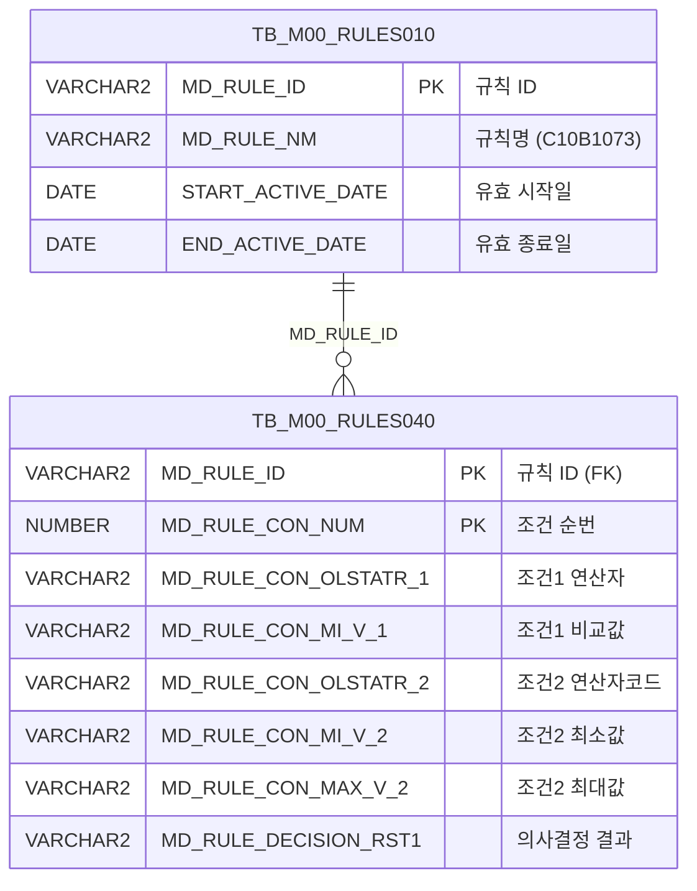

<h1 style="font-size: 40px; text-align: center; font-weight:
   bold; margin: 30px 0;">
  C107000030tab09 레거시 시스템 분석 종합 보고서
</h1>


# 1. 시스템 개요
- **서비스 ID**: C107000030tab09
- **업무명**: PLTCM폭마진량
- **분석 일시**: 2026-03-17 10:46 KST
- **전체 Activity 수**: 2 (분기, 조회)
- **분석자**: Claude Opus 4.6
- **분석 도구**: /analyze-service C107000030tab09
- **문서 버전**: 1.0

# 📊 비즈니스 프로세스 분석

## 시스템 목적

PLTCM(Pickling Line & Tandem Cold Mill, 산세-냉간압연 연속공정) 공정에서 사용되는 **폭 마진량 기준 규칙**을 조회하는 화면이다. C107000030 화면의 9번째 탭(tab09)으로 구성되어 있다.

이 화면은 Rules Engine(C10B1073 규칙)에 등록된 조건-결과 매핑 데이터를 조회한다. 원자재코드, 원자재두께범위, PLTCM출측폭범위의 3가지 조건에 따라 적용할 마진폭(RST1) 값을 결정하는 의사결정 테이블을 표시한다. 이를 통해 PLTCM 공정의 폭 마진 기준을 운영자가 확인할 수 있다.

상위 탭(C107000030)의 검색 폼 파라미터를 공유하며, 탭 진입 시 자동으로 데이터를 로드한다.

## 주요 유즈케이스

### UC-01: PLTCM 폭마진량 규칙 조회
- **Actor**: PLTCM 공정 오퍼레이터 / 품질관리 담당자
- **목적**: 원자재코드, 두께범위, 출측폭범위 조건별 마진폭 결과를 확인하여 PLTCM 공정 운영 기준 파악

- **전제조건**:
  - C107000030 화면에 진입되어 있음
  - 상위 탭의 검색 폼(C107000030_Form_1)이 로드되어 있음
  - Rules Engine에 C10B1073 규칙이 활성화 상태로 등록되어 있음

- **주요 흐름**:
  1. 사용자가 C107000030 화면에서 tab09(PLTCM폭마진량) 탭 선택
  2. 탭 진입 시 onXLE 이벤트 → onLoadGrid() 자동 호출
  3. 상위 폼(C107000030_Form_1) 파라미터로 C107000030tab09-service 호출
  4. C107000030tab09.select 쿼리 실행 (TB_M00_RULES040 + TB_M00_RULES010 조인)
  5. FUNC_GET_YEONSAN 함수로 연산자 코드를 기호(<=값<=, <값< 등)로 변환
  6. Grid에 조건-결과 매핑 테이블 표시

- **대체 흐름**:
  - 조회 결과 없음: Grid에 데이터 없이 빈 상태로 표시
  - C10B1073 규칙이 비활성화 상태: 유효 기간(START_ACTIVE_DATE ~ END_ACTIVE_DATE) 조건에 의해 결과 없음

- **후행조건**:
  - Grid에 폭마진량 규칙 데이터가 표시됨
  - 사용자가 컨텍스트 메뉴를 통해 필터, 엑셀 내보내기 등 추가 작업 가능

### UC-02: 컨텍스트 메뉴를 통한 그리드 조작
- **Actor**: PLTCM 공정 오퍼레이터
- **목적**: 그리드 데이터에 대해 컬럼 이동, 필터링, 편집 모드 전환, 엑셀 내보내기 등 부가 작업 수행

- **전제조건**:
  - Grid에 데이터가 로드되어 있음

- **주요 흐름**:
  1. 사용자가 Grid에서 우클릭하여 컨텍스트 메뉴 호출
  2. 메뉴 항목 선택 (컬럼이동/필터/편집가능/엑셀출력)
  3. onGridContextMenuClick() 함수에서 선택된 메뉴 ID에 따라 처리

- **대체 흐름**:
  - 컬럼이동(move_grid): enableColumnMove 토글 (체크 시 활성화, 해제 시 비활성화)
  - 필터(filter_grid): enableHeaderMenu 활성화 (체크 시에만 동작)
  - 편집가능(editable_grid): setEditable 토글 (읽기전용 ↔ 편집가능)
  - 엑셀출력(excel_grid): gridexcel URL로 엑셀 내보내기 실행

- **후행조건**:
  - 선택한 기능이 Grid에 적용됨

### UC-03: 수동 데이터 재조회
- **Actor**: PLTCM 공정 오퍼레이터
- **목적**: 상위 폼의 조회 조건 변경 후 tab09 데이터를 수동으로 갱신

- **전제조건**:
  - 상위 탭의 검색 폼(C107000030_Form_1)에 조회 조건이 입력되어 있음

- **주요 흐름**:
  1. 사용자가 상위 폼에서 조회 조건 변경
  2. 조회(find) 버튼 클릭
  3. find() 함수에서 uiCommon.parameters4()로 파라미터 구성
  4. C107000030tab09_Grid_1.loadData() 호출
  5. Grid 데이터 갱신

- **대체 흐름**:
  - 없음

- **후행조건**:
  - Grid에 변경된 조건에 맞는 데이터가 표시됨

---
## 비즈니스 로직 상세

### 1. 연산자 코드 → 연산 기호 변환 (FUNC_GET_YEONSAN)

- **목적**: Rules Engine의 BETWEEN 연산자 코드를 사람이 읽을 수 있는 연산 기호 문자열로 변환하여 화면에 표시
- **처리 케이스**:

  **[케이스 1: BETWEEN 연산자 변환]**
  ```
    조건: 연산자 코드가 BETWEEN1 ~ BETWEEN4 중 하나
    처리:
      1. 입력값에 UPPER() 적용하여 대문자로 정규화
      2. FUNC_GET_YEONSAN 함수 호출
      3. BETWEEN 코드별 연산 기호 반환:
         - BETWEEN1 → '<=값<='  (최소값 이상, 최대값 이하)
         - BETWEEN2 → '<=값<'   (최소값 이상, 최대값 미만)
         - BETWEEN3 → '<값<='   (최소값 초과, 최대값 이하)
         - BETWEEN4 → '<값<'    (최소값 초과, 최대값 미만)
  ```

  **[케이스 2: 비표준 연산자 처리]**
  ```
    조건: 입력값이 BETWEEN1~BETWEEN4에 해당하지 않음
    처리:
      1. 입력값을 그대로 반환 (확장성 확보)
  ```

  **[케이스 3: 예외 발생]**
  ```
    조건: WHEN OTHERS 예외 발생
    처리:
      1. NULL 반환
  ```

### 2. Rules Engine 활성 규칙 필터링

- **목적**: C10B1073 규칙 중 현재 유효한(활성화된) 규칙만 조회
- **처리 케이스**:

  **[케이스 1: 유효 기간 내 규칙 조회]**
  ```
    조건: SYSDATE가 START_ACTIVE_DATE 이상이고 END_ACTIVE_DATE 미만
    처리:
      1. TB_M00_RULES010에서 MD_RULE_NM = 'C10B1073' 조건으로 규칙 ID 조회
      2. START_ACTIVE_DATE <= SYSDATE < END_ACTIVE_DATE 조건 적용
      3. 조회된 MD_RULE_ID로 TB_M00_RULES040과 INNER JOIN
      4. 조건(1~4)과 의사결정 결과(RST1) 반환
  ```

### 3. 조건-결과 매핑 구조

- **목적**: 원자재코드, 원자재두께범위, PLTCM출측폭범위 3가지 조건으로 마진폭 결정
- **처리 케이스**:

  **[의사결정 테이블 구조]**
  ```
    조건1 (CON1/MIN1): 원자재코드 - 연산자 + 비교값 (문자열 비교)
    조건2 (CON2/MIN2/MAX2): 원자재두께범위 - 연산자 + 최소값/최대값 (수치 비교, 소수점 3자리)
    조건3 (CON3/MIN3/MAX3): PLTCM출측폭범위 - 연산자 + 최소값/최대값 (수치 비교, 소수점 1자리)
    결과 (RST1): 마진폭 - 의사결정 결과값
  ```

---

# 💾 데이터 요구사항

## 핵심 테이블

### 1. TB_M00_RULES040 - (Rules Engine 조건-결과 상세)
| 컬럼명 | 타입 | PK | 설명 |
|--------|------|----|-----|
| MD_RULE_ID | VARCHAR2 | ✅ | 규칙 ID (TB_M00_RULES010 FK) |
| MD_RULE_CON_NUM | NUMBER | ✅ | 규칙 조건 순번 (SEQ) |
| MD_RULE_CON_OLSTATR_1 | VARCHAR2 | | 조건1 연산자 (원자재코드) |
| MD_RULE_CON_MI_V_1 | VARCHAR2 | | 조건1 비교값 (원자재코드) |
| MD_RULE_CON_OLSTATR_2 | VARCHAR2 | | 조건2 연산자 코드 (원자재두께범위, BETWEEN1~4) |
| MD_RULE_CON_MI_V_2 | VARCHAR2 | | 조건2 최소값 (원자재두께) |
| MD_RULE_CON_MAX_V_2 | VARCHAR2 | | 조건2 최대값 (원자재두께) |
| MD_RULE_CON_OLSTATR_3 | VARCHAR2 | | 조건3 연산자 코드 (PLTCM출측폭범위, BETWEEN1~4) |
| MD_RULE_CON_MI_V_3 | VARCHAR2 | | 조건3 최소값 (PLTCM출측폭) |
| MD_RULE_CON_MAX_V_3 | VARCHAR2 | | 조건3 최대값 (PLTCM출측폭) |
| MD_RULE_CON_OLSTATR_4 | VARCHAR2 | | 조건4 연산자 코드 |
| MD_RULE_CON_MAX_V_4 | VARCHAR2 | | 조건4 최대값 |
| MD_RULE_DECISION_RST1 | VARCHAR2 | | 의사결정 결과1 (마진폭) |

### 2. TB_M00_RULES010 - (Rules Engine 규칙 마스터)
| 컬럼명 | 타입 | PK | 설명 |
|--------|------|----|-----|
| MD_RULE_ID | VARCHAR2 | ✅ | 규칙 ID |
| MD_RULE_NM | VARCHAR2 | | 규칙명 (예: C10B1073) |
| START_ACTIVE_DATE | DATE | | 유효 시작일 |
| END_ACTIVE_DATE | DATE | | 유효 종료일 |

## 데이터 플로우

### 1. 조회

```
[PLTCM 폭마진량 규칙 조회]
탭 진입 (onXLE → onLoadGrid) 또는 조회 버튼 클릭
→ C107000030tab09.select
  FROM M00APUSER.TB_M00_RULES040 RULES040
  INNER JOIN (SELECT MD_RULE_ID FROM M00APUSER.TB_M00_RULES010
              WHERE MD_RULE_NM = 'C10B1073'
                AND START_ACTIVE_DATE <= SYSDATE
                AND SYSDATE < END_ACTIVE_DATE) RULES010
    ON RULES010.MD_RULE_ID = RULES040.MD_RULE_ID
  조건2/3/4 연산자: FUNC_GET_YEONSAN(UPPER(연산자코드)) → 기호 문자열 변환
→ Grid에 조건-결과 매핑 테이블 표시
```

## SQL 일람표

| SQL 이름 | 쿼리 ID | 타입 | 출처 | 테이블 |
|---------|---------|-----|-------|-------|
| PLTCM 폭마진량 규칙 조회 | C107000030tab09.select | SELECT | Service | TB_M00_RULES040, TB_M00_RULES010 |

## PL/SQL 함수/프로시저

| # | 호출명 | 유형 | 용도 | 상세 분석 |
|---|--------|------|------|----------|
| 1 | FUNC_GET_YEONSAN | 스탠드얼론 함수 | 연산자 코드(BETWEEN1~4) → 연산 기호 문자열 변환 | [분석 보고서](../../../dbms/M00APUSER/function/FUNC_GET_YEONSAN_analysis_report.md) |

## ER 다이어그램 (핵심 관계)



관계 설명:
- TB_M00_RULES010이 규칙 마스터로, MD_RULE_ID를 통해 TB_M00_RULES040과 1:N 관계
- TB_M00_RULES010은 규칙명(MD_RULE_NM)과 유효기간을 관리
- TB_M00_RULES040은 각 규칙의 조건-결과 상세 데이터를 저장

---

# 🖥️ 사용자 인터페이스 요구사항

## 화면 레이아웃 상세

### Layout 구조
```javascript
// absolute 포지셔닝 (dhtmlxLayout 미사용)
{
  components: [
    {
      id: "C107000030tab09_Grid_1",
      type: "grid",
      position: { left: 0, top: 0, width: 976, height: 492 }
    },
    {
      id: "C107000030tab09_Form_1",
      type: "form",
      position: { left: 0, top: 450, width: 282, height: 30 },
      note: "비어있음 - 상위 탭 C107000030_Form_1 참조"
    },
    {
      id: "C107000030tab09_messagebox",
      type: "messagebox",
      position: { left: 0, top: 493, width: 976, height: 18 }
    }
  ]
}
```

## 입출력 요소

### Form 컴포넌트
**C107000030tab09_Form_1**
- Form XML이 비어 있음. 검색 파라미터는 상위 탭의 `C107000030_Form_1` 폼에서 참조
- `uiCommon.parameters4('C107000030_Form_1', ...)` 호출로 상위 폼 파라미터 전달

### Grid 컴포넌트

**C107000030tab09_Grid_1 (PLTCM 폭마진량 규칙 목록)**
- 편집 가능 여부: 아니오 (읽기 전용, 컨텍스트 메뉴로 편집 모드 전환 가능)
- Split: 0 (고정 컬럼 없음)
- Smart Rendering: true
- 컨텍스트 메뉴: 컬럼이동, 필터, 편집가능, 엑셀출력
- 3단 그룹 헤더: 원자재코드 / 원자재두께범위 / PLTCM출측폭범위 / 마진폭
- 주요 컬럼 (10개):

  **순번**:
  - SEQ: ro - 조건 순번 (4%, 우측정렬)

  **원자재코드 (조건1)**:
  - CON1: ro - 원자재코드 연산자 (5%, 중앙정렬)
  - MIN1: ro - 원자재코드 비교값 (20%, 좌측정렬, 텍스트 필터)

  **원자재두께범위 (조건2)**:
  - CON2: ro - 두께범위 연산자, FUNC_GET_YEONSAN 변환 결과 (10%, 중앙정렬)
  - MIN2: ron - 두께범위 최소값, 포맷 0.000 (6%, 중앙정렬, 숫자 필터)
  - MAX2: ron - 두께범위 최대값, 포맷 0.000 (6%, 중앙정렬, 숫자 필터)

  **PLTCM출측폭범위 (조건3)**:
  - CON3: ro - 출측폭범위 연산자, FUNC_GET_YEONSAN 변환 결과 (10%, 중앙정렬)
  - MIN3: ron - 출측폭범위 최소값, 포맷 0000.0 (6%, 중앙정렬, 숫자 필터)
  - MAX3: ron - 출측폭범위 최대값, 포맷 0000.0 (6%, 중앙정렬, 숫자 필터)

  **마진폭 (결과)**:
  - RST1: ro - 마진폭 결과값 (6%, 중앙정렬)

## 화면 동작 흐름

### 1. 탭 진입 시 자동 데이터 로드
```
1. 사용자가 C107000030 화면에서 tab09 탭 클릭
2. JSP 로드 완료 시 ui.initializeDHTMLX() 호출
3. Grid XML 로드 완료 시 onXLE 이벤트 발생
4. onLoadGrid() 함수 호출
5. uiCommon.parameters4('C107000030_Form_1', 'C107000030tab09_Grid_1', 'find') 호출
   - 상위 탭의 Form 파라미터를 Grid 파라미터로 변환
6. items['C107000030tab09_Grid_1'].loadData(findUrl) 호출
7. C107000030tab09-service → C107000030tab09.select 실행
8. Grid에 폭마진량 규칙 데이터 표시
9. onXLE 이벤트 핸들러 해제 (detachEvent) - 중복 로드 방지
```

### 2. 수동 재조회
```
1. 사용자가 상위 폼(C107000030_Form_1) 조회 조건 변경
2. 조회 버튼 클릭 → find(eventName, formDivObj, referenceItem) 호출
3. uiCommon.parameters4('C107000030_Form_1', 'C107000030tab09_Grid_1', customparam + eventName) 호출
4. items['C107000030tab09_Grid_1'].loadData(findUrl)
5. Grid 데이터 갱신
```

### 3. 컨텍스트 메뉴 사용
```
1. 사용자가 Grid 위에서 우클릭
2. 컨텍스트 메뉴 표시 (contextmenu.xml 기반)
3. 메뉴 항목 선택 → onGridContextMenuClick(id, gridObj, menuObj) 호출
4. 선택 항목에 따른 처리:
   - move_grid: 컬럼 드래그 이동 토글
   - filter_grid: 헤더 필터 메뉴 활성화
   - editable_grid: Grid 편집 모드 토글
   - excel_grid: gridexcel URL로 엑셀 다운로드
```

## JavaScript 모듈

**C107000030tab09.jsp** (인라인 스크립트)
- find(eventName, formDivObj, referenceItem): 상위 폼 파라미터로 Grid 데이터 조회 (uiCommon.parameters4로 파라미터 구성)
- add(referenceItem): 그리드 신규 행 추가
- remove(referenceItem): 그리드 행 삭제
- copy(referenceItem): 그리드 행 클립보드 복사
- undo(referenceItem): 실행 취소
- redo(referenceItem): 다시 실행
- onGridContextMenuClick(id, gridObj, menuObj): 컨텍스트 메뉴 항목별 처리
- findMessage(referenceItem): 메시지박스에 appMsg 표시 (uiCommon.message 호출)
- onLoadGrid(): Grid XML 로드 완료 시 자동 데이터 로드 (onXLE 이벤트 핸들러, 1회 실행 후 해제)

**의존 스크립트**:
- `./dhtmlx/codebase/glue.ui.bootstrap.js` - GLUE UI 프레임워크 부트스트랩
- `./js/c10.ui.js` - C10 모듈 공통 UI 스크립트

## 주요 이벤트 핸들러

**onXLE (Grid XML 로드 완료)**
- 이벤트 타입: Grid XML Load End
- 처리 내용:
  1. onLoadGrid() 함수 호출
  2. 상위 폼(C107000030_Form_1) 파라미터 구성
  3. Grid 데이터 자동 로드
  4. onXLE 이벤트 핸들러 해제 (detachEvent) - 1회만 실행

**onGridContextMenuClick (컨텍스트 메뉴 클릭)**
- 이벤트 타입: Grid Context Menu Click
- 처리 내용:
  1. 클릭된 메뉴 ID 확인 (move_grid/filter_grid/editable_grid/excel_grid)
  2. 체크박스 상태(isChecked) 확인
  3. 해당 기능 토글 또는 실행

---

# 📌 특이사항 및 주의사항

## 1. 상위 탭 폼 파라미터 공유 구조
- 이 화면(tab09)은 자체 검색 폼이 없으며, 상위 탭(C107000030)의 `C107000030_Form_1` 폼 파라미터를 `uiCommon.parameters4()`로 참조한다. 상위 폼과의 의존 관계로 인해 독립적인 화면 운영이 불가하며, C107000030 화면 내에서만 정상 동작한다.

## 2. onXLE 이벤트 1회 실행 후 해제 패턴
- `onLoadGrid()` 함수 내에서 `detachEvent(onXLE)`를 호출하여 Grid XML 로드 완료 이벤트를 1회만 처리한다. 이는 탭 재진입 시 중복 데이터 로드를 방지하기 위한 패턴이나, 탭 전환 후 재진입 시 자동 조회가 동작하지 않을 수 있다.

## 3. SQL 쿼리의 조건4(CON4/MAX4) 존재하나 Grid에 미표시
- SQL 쿼리(C107000030tab09.select)에서 `CON4`(FUNC_GET_YEONSAN 변환된 조건4 연산자)와 `MAX4`(조건4 최대값)를 조회하고 있으나, Grid 컬럼 정의에는 CON4/MAX4가 포함되어 있지 않다. SQL에서 조회되지만 화면에 표시되지 않는 데이터가 존재하며, 향후 화면 확장 시 참고할 필요가 있다.

## 4. FUNC_GET_YEONSAN 함수의 UPPER() 적용 패턴
- 연산자 코드를 FUNC_GET_YEONSAN 함수에 전달하기 전에 `UPPER()` 함수를 적용한다. 이는 연산자 코드가 대소문자 혼용으로 저장될 수 있음을 의미하며, 함수 내부에서는 대문자 기준으로만 비교한다.

## 5. Grid colwidthUnit이 '%' 단위
- Grid 컬럼 너비가 px이 아닌 %(퍼센트)로 지정되어 있어, 화면 크기에 따라 컬럼 너비가 동적으로 조정된다. 고정 레이아웃(absolute positioning)과 상대적 컬럼 너비의 조합이 사용되고 있다.

---

# 📚 참고 문서

- **Query SQL**: `src/query/C107000030tab09-query.glue_sql`
- **Service XML**: `src/service/C107000030tab09-service.xml`
- **JSP**: `WebContents/C107000030tab09.jsp`
- **Grid XML**: `WebContents/header/kr/C107000030tab09/C107000030tab09_Grid_1.xml`
- **Form XML**: `WebContents/header/kr/C107000030tab09/C107000030tab09_Form_1.xml`
- **JS**: `./js/c10.ui.js` (C10 모듈 공통 UI)
- **PL/SQL 분석**: `docs/analysis/dbms/M00APUSER/function/FUNC_GET_YEONSAN_analysis_report.md`
