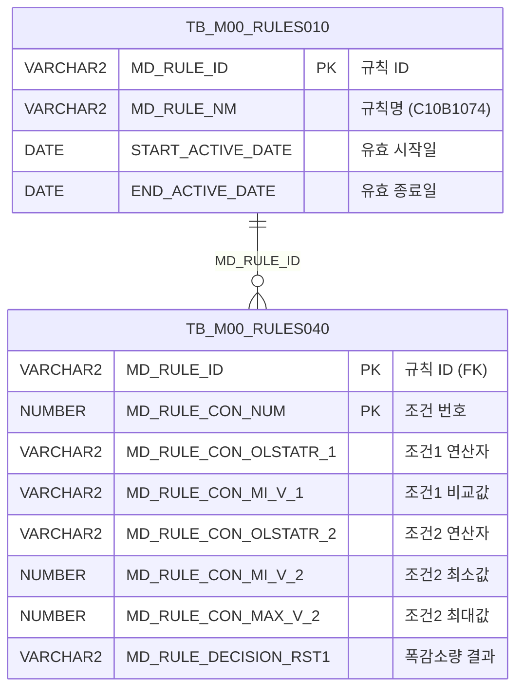

<h1 style="font-size: 40px; text-align: center; font-weight:
   bold; margin: 30px 0;">
  C107000030tab10 레거시 시스템 분석 종합 보고서
</h1>


# 1. 시스템 개요
- **서비스 ID**: C107000030tab10
- **업무명**: PLTCM 폭수축량 규칙 조회
- **분석 일시**: 2026-03-17 10:47 (KST)
- **전체 Activity 수**: 2개 (분기, 조회 - 모두 Built-in)
- **분석자**: Claude Opus 4.6
- **분석 도구**: /analyze-service C107000030tab10
- **문서 버전**: 1.0

# 📊 비즈니스 프로세스 분석

## 시스템 목적

본 서비스는 C10(연속공정) 모듈의 PLTCM(Pickling Line and Tandem Cold Mill) 공정에서 발생하는 **폭수축량 규칙 데이터를 조회**하는 탭 화면이다. 부모 화면 C107000030의 하위 탭(tab10)으로 구성되어 있으며, 의사결정 규칙 엔진(RULES) 테이블에서 C10B1074 규칙을 조회하여 원자재코드 조건, PLTCM 두께 범위, PLTCM 폭 범위에 따른 폭감소량 결과값을 그리드에 표시한다.

이 화면은 PLTCM 공정에서 코일이 압연될 때 발생하는 폭 수축 정도를 예측하기 위한 기준 데이터를 제공한다. 오퍼레이터는 원자재코드, 두께 범위, 폭 범위별 폭감소량 기준값을 확인하여 공정 제어에 참고할 수 있다. 읽기 전용 조회 화면으로, 데이터 수정 기능은 없다.

<!-- 단순 조회 서비스: Custom Activity 0개, SELECT 쿼리만 사용, Router→단일 조회 체인이므로 핵심/상세 워크플로우 다이어그램 생략 -->

## 주요 유즈케이스

### UC-01: PLTCM 폭수축량 규칙 조회
- **Actor**: PLTCM 공정 오퍼레이터 / 설계 담당자
- **목적**: 원자재코드, PLTCM 두께 범위, 폭 범위 조건별 폭감소량 기준값을 조회하여 공정 제어 및 설계에 참고

- **전제조건**:
  - 사용자가 시스템에 로그인되어 있음
  - 부모 화면 C107000030에서 해당 탭(tab10)이 선택됨
  - M00APUSER.TB_M00_RULES010에 C10B1074 규칙이 활성 상태(SYSDATE 기준)로 등록되어 있음

- **주요 흐름**:
  1. 사용자가 부모 화면(C107000030)에서 tab10 탭을 클릭
  2. 그리드 초기 로드 완료 시 onXLEEvent에 의해 자동 조회 실행
  3. 부모 탭의 검색 Form(C107000030_Form_1) 파라미터를 참조하여 `C107000030tab10.select` 쿼리 호출
  4. TB_M00_RULES010에서 C10B1074 규칙 ID를 조회하고, TB_M00_RULES040과 조인하여 조건-결과 데이터 반환
  5. FUNC_GET_YEONSAN 함수로 조건2, 조건3의 연산자 코드를 한글 연산자명으로 변환
  6. Grid_1에 SEQ, 원자재코드(연산/비교값), PLTCM두께범위(연산/비교값), PLTCM폭범위(연산/비교값), 폭감소량 표시

- **대체 흐름**:
  - C10B1074 규칙이 비활성(만료)인 경우: 조회 결과 없음
  - FUNC_GET_YEONSAN에서 연산자 코드를 찾을 수 없는 경우: NULL 반환

- **후행조건**:
  - 그리드에 폭수축량 규칙 데이터가 표시됨
  - 사용자가 컨텍스트 메뉴를 통해 엑셀 내보내기 가능

### UC-02: 그리드 데이터 엑셀 내보내기
- **Actor**: PLTCM 공정 오퍼레이터 / 설계 담당자
- **목적**: 폭수축량 규칙 데이터를 엑셀로 내보내어 오프라인 참조 또는 보고서 작성에 활용

- **전제조건**:
  - 그리드에 데이터가 조회된 상태

- **주요 흐름**:
  1. 그리드 영역에서 마우스 우클릭하여 컨텍스트 메뉴 표시
  2. "엑셀" 메뉴 항목 선택
  3. onGridContextMenuClick 이벤트 핸들러에서 excel_grid 처리
  4. 현재 그리드 데이터를 엑셀 파일로 내보내기

- **대체 흐름**:
  - 데이터가 없는 상태에서 엑셀 내보내기: 빈 엑셀 파일 생성

- **후행조건**:
  - 엑셀 파일 다운로드 완료

### UC-03: 수동 재조회 (부모 탭 조건 변경 후)
- **Actor**: PLTCM 공정 오퍼레이터
- **목적**: 부모 화면의 검색 조건을 변경한 후 탭 데이터를 갱신

- **전제조건**:
  - 부모 화면(C107000030)의 검색 Form 조건이 변경됨
  - tab10이 활성 상태

- **주요 흐름**:
  1. 부모 화면에서 검색 조건 변경
  2. 조회 버튼 클릭 또는 탭 재선택
  3. find() 함수 호출, C107000030_Form_1의 파라미터로 findUrl 구성
  4. handleDataProcess.do 호출로 그리드 데이터 갱신

- **대체 흐름**:
  - 조회 결과 없음: 그리드 비어있는 상태 표시

- **후행조건**:
  - 변경된 조건에 맞는 데이터가 그리드에 표시됨

---
## 비즈니스 로직 상세

### 1. 의사결정 규칙(C10B1074) 기반 폭수축량 조건-결과 매핑

- **목적**: PLTCM 공정에서 원자재코드, 두께 범위, 폭 범위 3가지 조건의 조합에 따라 적정 폭감소량을 결정하기 위한 규칙 데이터를 제공
- **처리 케이스**:

  **[케이스 1: 규칙 조건 매칭]**
  ```
    조건: TB_M00_RULES010에서 MD_RULE_NM='C10B1074'이고 START_ACTIVE_DATE ≤ SYSDATE < END_ACTIVE_DATE
    처리:
      1. RULES010에서 활성 규칙의 MD_RULE_ID 조회
      2. RULES040과 MD_RULE_ID로 INNER JOIN
      3. 각 행은 하나의 조건 조합(조건1: 원자재코드, 조건2: PLTCM두께범위, 조건3: PLTCM폭범위)과 결과(폭감소량)를 표현
      4. 조건2, 조건3의 연산자(OLSTATR_2, OLSTATR_3)는 FUNC_GET_YEONSAN으로 한글 변환
  ```

  **[케이스 2: 규칙 비활성]**
  ```
    조건: C10B1074 규칙의 유효기간이 만료됨 (SYSDATE ≥ END_ACTIVE_DATE)
    처리:
      1. RULES010 서브쿼리에서 결과 없음
      2. INNER JOIN 결과 0건
      3. 그리드에 데이터 표시 안 됨
  ```

### 2. 연산자 코드 한글 변환 (FUNC_GET_YEONSAN)

- **목적**: RULES040의 연산자 코드(UPPER 처리됨)를 사용자가 이해할 수 있는 한글 연산자명으로 변환
- **처리 케이스**:

  **[케이스 1: 정상 변환]**
  ```
    조건: MD_RULE_CON_OLSTATR_2 또는 OLSTATR_3에 유효한 연산자 코드가 존재
    처리:
      1. UPPER() 함수로 대문자 변환
      2. M00APUSER.FUNC_GET_YEONSAN 함수에 전달
      3. 한글 연산자명 반환 (예: '>=', '<=', '=', 'BETWEEN' 등)
  ```

  **[케이스 2: 코드 미존재]**
  ```
    조건: 연산자 코드가 NULL이거나 매핑 없음
    처리:
      1. FUNC_GET_YEONSAN에서 NULL 반환
      2. CON2 또는 CON3 컬럼이 빈 값으로 표시
  ```

### 3. 다조건 범위 비교 구조

- **목적**: 3개 조건 축(원자재코드, 두께, 폭)의 조합으로 폭감소량을 결정하는 다차원 규칙 테이블 제공
- **데이터 구조**:
  ```
  조건1 (CON1): 원자재코드 - 연산자 + 비교값(MIN1)
  조건2 (CON2): PLTCM 두께범위 - 연산자 + 최소값(MIN2) + 최대값(MAX2)
  조건3 (CON3): PLTCM 폭범위 - 연산자 + 최소값(MIN3) + 최대값(MAX3)
  결과  (RST1): 폭감소량

  예시:
  SEQ=1, CON1='=', MIN1='STS304', CON2='>=', MIN2=0.500, MAX2=1.000, CON3='>=', MIN3=900.0, MAX3=1200.0, RST1=15
  → 원자재코드가 STS304이고, PLTCM 두께가 0.500~1.000이며, PLTCM 폭이 900.0~1200.0일 때 폭감소량은 15
  ```

---

# 💾 데이터 요구사항

## 핵심 테이블

### 1. TB_M00_RULES040 - (의사결정 규칙 조건/결과 상세)
| 컬럼명 | 타입 | PK | 설명 |
|--------|------|----|-----|
| MD_RULE_ID | VARCHAR2 | ✅ | 규칙 ID (PK) |
| MD_RULE_CON_NUM | NUMBER | ✅ | 규칙 조건 번호 (SEQ) |
| MD_RULE_CON_OLSTATR_1 | VARCHAR2 | | 조건1 연산자 (원자재코드) |
| MD_RULE_CON_MI_V_1 | VARCHAR2 | | 조건1 비교값 (원자재코드값) |
| MD_RULE_CON_OLSTATR_2 | VARCHAR2 | | 조건2 연산자 코드 (PLTCM두께) |
| MD_RULE_CON_MI_V_2 | NUMBER | | 조건2 최소값 (두께 하한) |
| MD_RULE_CON_MAX_V_2 | NUMBER | | 조건2 최대값 (두께 상한) |
| MD_RULE_CON_OLSTATR_3 | VARCHAR2 | | 조건3 연산자 코드 (PLTCM폭) |
| MD_RULE_CON_MI_V_3 | NUMBER | | 조건3 최소값 (폭 하한) |
| MD_RULE_CON_MAX_V_3 | NUMBER | | 조건3 최대값 (폭 상한) |
| MD_RULE_DECISION_RST1 | VARCHAR2 | | 의사결정 결과1 (폭감소량) |

### 2. TB_M00_RULES010 - (의사결정 규칙 마스터)
| 컬럼명 | 타입 | PK | 설명 |
|--------|------|----|-----|
| MD_RULE_ID | VARCHAR2 | ✅ | 규칙 ID (PK) |
| MD_RULE_NM | VARCHAR2 | | 규칙명 (예: 'C10B1074') |
| START_ACTIVE_DATE | DATE | | 규칙 유효 시작일 |
| END_ACTIVE_DATE | DATE | | 규칙 유효 종료일 |

## 데이터 플로우

### 1. 조회

```
[화면 진입 시 자동 조회 - onXLEEvent 트리거]
탭 선택 / 화면 진입
→ C107000030tab10.select
  FROM M00APUSER.TB_M00_RULES040 RULES040
  INNER JOIN (
    SELECT MD_RULE_ID
    FROM M00APUSER.TB_M00_RULES010
    WHERE MD_RULE_NM = 'C10B1074'
      AND START_ACTIVE_DATE <= SYSDATE
      AND SYSDATE < END_ACTIVE_DATE
  ) RULES010
  ON RULES010.MD_RULE_ID = RULES040.MD_RULE_ID
→ FUNC_GET_YEONSAN으로 연산자 코드→한글 변환
→ Grid_1에 조건-결과 규칙 목록 표시
```

## SQL 일람표

| SQL 이름 | 쿼리 ID | 타입 | 출처 | 테이블 |
|---------|---------|-----|-------|-------|
| 폭수축량 규칙 조회 | C107000030tab10.select | SELECT | Service | TB_M00_RULES040, TB_M00_RULES010 |

## PL/SQL 함수/프로시저

| # | 호출명 | 유형 | 용도 | 상세 분석 |
|---|--------|------|------|----------|
| 1 | FUNC_GET_YEONSAN | 함수 | 연산자 코드를 한글 연산자명으로 변환 | [분석 보고서](../../../dbms/M00APUSER/function/FUNC_GET_YEONSAN_analysis_report.md) |

## ER 다이어그램 (핵심 관계)



관계 설명:
- TB_M00_RULES010이 규칙 마스터로 규칙의 기본 정보(규칙명, 유효기간)를 관리
- TB_M00_RULES040은 규칙의 상세 조건-결과 매핑을 저장하며 MD_RULE_ID로 RULES010과 1:N 관계
- FUNC_GET_YEONSAN 함수는 연산자 코드 변환을 담당하는 외부 함수 (M00APUSER 스키마)

---

# 🖥️ 사용자 인터페이스 요구사항

## 화면 레이아웃 상세

### Layout 구조
```javascript
{
  type: "flat",  // 레이아웃 컨테이너 없이 div 기반 직접 배치
  description: "탭 내부 화면, 부모 C107000030의 tab10",
  components: [
    {
      id: "C107000030tab10_Grid_1",
      type: "grid",
      position: { top: "0px", left: "0px", width: "976px", height: "492px" }
    },
    {
      id: "C107000030tab10_Form_1",
      type: "form",
      position: { top: "450px", left: "0px", width: "282px", height: "30px" },
      description: "빈 Form (실제 항목 없음, 부모 Form 참조)"
    },
    {
      id: "C107000030tab10_messagebox",
      type: "messagebox",
      position: { top: "493px", left: "0px", width: "976px", height: "18px" }
    }
  ]
}
```

## 입출력 요소

### Form 컴포넌트
**C107000030tab10_Form_1**
- 빈 Form (XML에 실제 입력 항목 없음)
- 검색 파라미터는 부모 탭의 **C107000030_Form_1**을 크로스-탭 참조하여 사용

### Grid 컴포넌트

**C107000030tab10_Grid_1 (PLTCM 폭수축량 규칙 목록)**
- 편집 가능 여부: 아니오 (전체 읽기 전용)
- Split: 없음 (split=0)
- 페이징: 활성화 (pageset=true, rowCnt=19)
- 스마트 렌더링: 활성화 (smartRendering=true, awaitedRowHeight=22)
- 컨텍스트 메뉴: 활성화
- 멀티 선택: 활성화
- 주요 컬럼 (10개):

  **3단 그룹 헤더 구조**:
  - 1행: SEQ | 원자재코드 | PLTCM두께범위 | PLTCM폭범위 | 폭감소량
  - 2행: (rspan) | 연산 | 비교값 | 연산 | 비교값 | 비교값 | 연산 | 비교값 | 비교값 | (rspan)
  - 3행: (rspan) | | text_filter | | numeric_filter | numeric_filter | | numeric_filter | numeric_filter | (rspan)

  **기본 정보**:
  - SEQ: ro - 규칙 조건 번호 (4%, 우측정렬)

  **원자재코드 조건**:
  - CON1: ro - 원자재코드 연산자 (5%, 중앙정렬, 텍스트 필터)
  - MIN1: ro - 원자재코드 비교값 (20%, 좌측정렬, 텍스트 필터)

  **PLTCM두께범위 조건**:
  - CON2: ro - 두께범위 연산자, FUNC_GET_YEONSAN 변환 (10%, 중앙정렬)
  - MIN2: ron - 두께범위 최소값 (6%, 중앙정렬, 소수점 3자리 포맷 0.000, 숫자 필터)
  - MAX2: ron - 두께범위 최대값 (6%, 중앙정렬, 소수점 3자리 포맷 0.000, 숫자 필터)

  **PLTCM폭범위 조건**:
  - CON3: ro - 폭범위 연산자, FUNC_GET_YEONSAN 변환 (10%, 중앙정렬)
  - MIN3: ron - 폭범위 최소값 (6%, 중앙정렬, 소수점 1자리 포맷 0000.0, 숫자 필터)
  - MAX3: ron - 폭범위 최대값 (6%, 중앙정렬, 소수점 1자리 포맷 0000.0, 숫자 필터)

  **결과**:
  - RST1: ro - 폭감소량 (6%, 중앙정렬)

## 화면 동작 흐름

### 1. 화면 초기 로딩 (탭 선택)
```
1. 부모 화면(C107000030)에서 tab10 탭 클릭
2. C107000030tab10.jsp 로드
3. 그리드(C107000030tab10_Grid_1) 초기화
4. onXLEEvent 이벤트 핸들러(onLoadGrid) 등록
5. 그리드 XLE 로드 완료 시 자동 조회 실행:
   - 부모 Form(C107000030_Form_1)의 파라미터 추출
   - findUrl 구성 → items['C107000030tab10_Grid_1'].loadData(findUrl)
   - onXLE 이벤트 해제 (1회성 실행)
6. handleDataProcess.do 호출 → C107000030tab10-service → 조회 Activity
7. C107000030tab10.select 쿼리 실행 (mesdao)
8. Grid_1에 규칙 조건-결과 데이터 표시
9. findMessage() 호출 → 메시지박스에 appMsg 출력
```

### 2. 수동 재조회
```
1. 부모 화면에서 검색 조건 변경
2. 조회 버튼 클릭 (find 함수 호출)
3. 부모 Form(C107000030_Form_1)의 파라미터로 findUrl 구성
4. items['C107000030tab10_Grid_1'].loadData(findUrl) 호출
5. 그리드 데이터 갱신
```

### 3. 컨텍스트 메뉴 기능
```
1. 그리드 영역에서 마우스 우클릭
2. contextmenu.xml 기반 메뉴 표시
3. onGridContextMenuClick 이벤트 핸들러 실행
4. 메뉴 항목별 처리:
   - move_grid: 컬럼 이동
   - filter_grid: 필터 설정
   - editable_grid: 편집 가능 모드 전환
   - excel_grid: 엑셀 내보내기
```

## JavaScript 모듈

**C107000030tab10.jsp** (탭 내부 인라인 스크립트)
- find(): 부모 Form(C107000030_Form_1)의 파라미터로 그리드 데이터 로드
- add(): 그리드에 새 행 추가 (items[referenceItem].addRow())
- remove(): 그리드에서 행 삭제 (items[referenceItem].removeRow())
- copy(): 행 내용 클립보드 복사 (items[referenceItem].copyRowContent())
- undo(): 실행 취소 (items[referenceItem].undo())
- redo(): 다시 실행 (items[referenceItem].redo())
- onGridContextMenuClick(): 컨텍스트 메뉴 항목 클릭 처리 (move_grid, filter_grid, editable_grid, excel_grid)
- findMessage(): 메시지박스에 appMsg 출력
- onLoadGrid(): onXLEEvent 기반 그리드 초기 로드 후 자동 조회 실행, 이벤트 1회 실행 후 해제

## 주요 이벤트 핸들러

**onLoadGrid (그리드 XLE 로드 완료)**
- 이벤트 타입: onXLEEvent
- 처리 내용:
  1. 그리드 초기 렌더링 완료 감지
  2. 부모 Form(C107000030_Form_1)에서 검색 파라미터 추출
  3. findUrl 구성 → Grid_1.loadData(findUrl) 호출
  4. 데이터 조회 완료 후 onXLE 이벤트 핸들러 해제 (detachEvent)
  5. 이후 조회는 find() 함수를 통해 수동으로만 실행

**onGridContextMenuClick (컨텍스트 메뉴 클릭)**
- 이벤트 타입: Grid Context Menu Click
- 처리 내용:
  1. 클릭된 메뉴 항목 ID 확인
  2. move_grid: 컬럼 순서 이동 UI 표시
  3. filter_grid: 컬럼 필터 설정
  4. editable_grid: 읽기 전용 ↔ 편집 가능 토글
  5. excel_grid: 현재 그리드 데이터를 엑셀 파일로 내보내기

---

# 📌 특이사항 및 주의사항

## 1. 크로스-탭 파라미터 참조 구조
- 이 화면(tab10)은 **자체 검색 Form이 비어있으며**, 부모 화면(C107000030)의 `C107000030_Form_1`을 직접 참조하여 검색 파라미터를 구성한다. 탭 간 데이터 공유 구조이므로, 부모 Form의 변경 시 이 탭의 조회 동작에 영향을 미친다. 현대화 시 이 의존 관계를 명확히 설계해야 한다.

## 2. 의사결정 규칙 엔진(RULES) 활용
- 하드코딩된 비즈니스 로직 대신 **M00 공통 규칙 테이블**(TB_M00_RULES010/040)을 활용한 유연한 규칙 관리 패턴이다. 규칙명 `C10B1074`로 폭수축량 기준을 관리하며, 유효기간(START_ACTIVE_DATE ~ END_ACTIVE_DATE)으로 버전 관리가 가능하다. 단, 규칙이 만료되면 조회 결과가 0건이 되므로 규칙 유효기간 관리에 주의가 필요하다.

## 3. FUNC_GET_YEONSAN 함수의 스키마 간 참조
- SQL 쿼리에서 `M00APUSER.FUNC_GET_YEONSAN()` 함수를 **스키마 프리픽스 포함하여 직접 호출**한다. 이는 mesdao(MESAPUSER 스키마) 커넥션에서 실행되면서 다른 스키마의 함수를 호출하는 패턴으로, 스키마 간 GRANT 권한이 필수적이다.

## 4. onXLEEvent 기반 1회성 자동 조회 패턴
- 탭 진입 시 `onXLEEvent`로 그리드 초기화 완료를 감지한 후 자동 조회를 수행하고, **즉시 이벤트를 해제(detachEvent)**하는 패턴을 사용한다. 이는 탭 전환 시 불필요한 중복 조회를 방지하기 위한 최적화 기법이다.

## 5. 읽기 전용 화면에서의 편집 기능 UI 존재
- 그리드가 전체 읽기 전용(allReadOnly=true)임에도 컨텍스트 메뉴에 `add`(새 행 추가), `remove`(행 삭제), `editable_grid`(편집 가능 전환) 등 편집 관련 메뉴가 존재한다. 이는 공통 컨텍스트 메뉴 XML을 모든 그리드에 일괄 적용하는 프레임워크 패턴 때문이며, 실제 편집 후 저장 서비스는 미구현 상태이다.

---

# 📚 참고 문서

- **Query SQL**: `src/query/C107000030tab10-query.glue_sql`
- **Service XML**: `src/service/C107000030tab10-service.xml`
- **JSP**: `WebContents/C107000030tab10.jsp`
- **Grid XML**: `WebContents/header/kr/C107000030tab10/C107000030tab10_Grid_1.xml`
- **Form XML**: `WebContents/header/kr/C107000030tab10/C107000030tab10_Form_1.xml`
- **PL/SQL 분석**: `docs/analysis/dbms/M00APUSER/function/FUNC_GET_YEONSAN_analysis_report.md`
