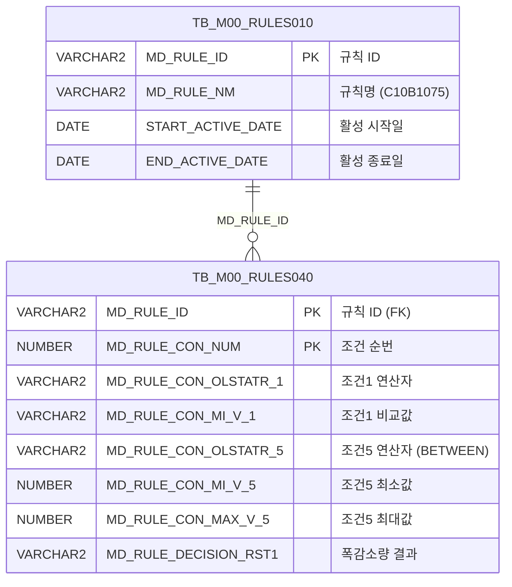

<h1 style="font-size: 40px; text-align: center; font-weight:
   bold; margin: 30px 0;">
  C107000030tab11 레거시 시스템 분석 종합 보고서
</h1>


# 1. 시스템 개요
- **서비스 ID**: C107000030tab11
- **업무명**: CGL폭감소량
- **분석 일시**: 2026-03-17 10:49 (KST)
- **전체 Activity 수**: 2 (분기 Router 1개, 조회 Activity 1개)
- **분석자**: Claude Opus 4.6
- **분석 도구**: /analyze-service C107000030tab11
- **문서 버전**: 1.0

# 📊 비즈니스 프로세스 분석

## 시스템 목적

CGL(연속용융아연도금라인) 공정의 **폭감소량 규칙(C10B1075)** 데이터를 조회하는 화면이다. M00APUSER 스키마의 Rules Engine(TB_M00_RULES010/040)에 등록된 C10B1075 규칙의 조건-결과 매핑 테이블을 표시한다.

이 화면은 상위 탭 화면(C107000030)의 하위 탭(tab11)으로, 공정/품명코드/재질코드/원자재코드/PLTCM두께범위/제품폭범위 등 6개 조건과 그에 따른 폭감소량(RST1) 결과를 조회한다. 조건 5,6(PLTCM두께범위, 제품폭범위)은 BETWEEN 범위 연산자를 사용하며, `FUNC_GET_YEONSAN` 함수를 통해 연산자 코드(BETWEEN1~4)를 화면 표시용 기호(<=값<=, <=값< 등)로 변환한다.

Custom Activity가 없는 읽기 전용 조회 화면으로, Router → FormSearch(조회) 구조의 단순 서비스이다.

## 주요 유즈케이스

### UC-01: CGL 폭감소량 규칙 조회
- **Actor**: CGL 공정 오퍼레이터 / 품질관리 담당자
- **목적**: C10B1075 규칙에 등록된 폭감소량 조건-결과 매핑 데이터를 조회하여 공정 조건별 폭감소량 기준값을 확인

- **전제조건**:
  - 사용자가 시스템에 로그인되어 있음
  - 상위 탭 화면(C107000030)에 진입한 상태
  - TB_M00_RULES010에 C10B1075 규칙이 활성 상태로 등록되어 있음

- **주요 흐름**:
  1. 사용자가 C107000030 화면에서 tab11(CGL폭감소량) 탭 선택
  2. 탭 진입 시 Grid XLE 이벤트로 onLoadGrid() 자동 실행
  3. 상위 탭의 Form(C107000030_Form_1) 파라미터를 사용하여 C107000030tab11.select 쿼리 호출
  4. TB_M00_RULES010에서 C10B1075 규칙 ID 조회 (활성 기간 내)
  5. TB_M00_RULES040에서 해당 규칙의 조건(CON1~6) 및 결과(RST1) 조회
  6. CON5, CON6 컬럼은 FUNC_GET_YEONSAN 함수로 연산자 코드를 기호로 변환
  7. Grid에 조회 결과 표시

- **대체 흐름**:
  - C10B1075 규칙이 비활성(만료)인 경우: 조회 결과 없음
  - 조회 결과가 없는 경우: 빈 그리드 표시

- **후행조건**:
  - Grid에 폭감소량 규칙 데이터가 표시됨
  - 사용자가 컨텍스트 메뉴를 통해 엑셀 내보내기 가능

### UC-02: 폭감소량 규칙 데이터 엑셀 내보내기
- **Actor**: CGL 공정 오퍼레이터 / 품질관리 담당자
- **목적**: 조회된 폭감소량 규칙 데이터를 엑셀 파일로 내보내어 오프라인 참조 또는 보고서 작성에 활용

- **전제조건**:
  - Grid에 조회 데이터가 표시된 상태

- **주요 흐름**:
  1. Grid 영역에서 우클릭하여 컨텍스트 메뉴 열기
  2. "엑셀 내보내기" 메뉴 클릭
  3. gridObj.toExcel() 호출로 서버 측 엑셀 생성
  4. 엑셀 파일 다운로드

- **대체 흐름**:
  - 데이터가 없는 경우: 빈 엑셀 파일 생성

- **후행조건**:
  - 엑셀 파일 다운로드 완료

### UC-03: 그리드 컬럼 필터링
- **Actor**: CGL 공정 오퍼레이터
- **목적**: 특정 조건에 해당하는 규칙만 필터링하여 확인

- **전제조건**:
  - Grid에 조회 데이터가 표시된 상태

- **주요 흐름**:
  1. 그리드 3번째 헤더 행의 필터 영역에 값 입력
  2. 텍스트 필터(CON1~CON4 비교값) 또는 숫자 필터(MIN5, MAX5, MIN6, MAX6) 사용
  3. 입력값에 따라 Grid 데이터 클라이언트 측 필터링

- **대체 흐름**:
  - 필터 조건에 맞는 데이터가 없는 경우: 빈 그리드 표시

- **후행조건**:
  - 필터링된 결과만 Grid에 표시됨

---
## 비즈니스 로직 상세

### 1. BETWEEN 연산자 코드 변환 (FUNC_GET_YEONSAN)

- **목적**: Rules Engine의 조건 연산자 코드(BETWEEN1~4)를 사람이 읽을 수 있는 연산 기호 문자열로 변환하여 화면에 표시
- **처리 케이스**:

  **[케이스 1: BETWEEN1 - 양쪽 포함]**
  ```
    조건: 입력값 = 'BETWEEN1'
    처리: '<=값<=' 반환 (최소값 이상, 최대값 이하)
  ```

  **[케이스 2: BETWEEN2 - 최소 포함, 최대 미포함]**
  ```
    조건: 입력값 = 'BETWEEN2'
    처리: '<=값<' 반환 (최소값 이상, 최대값 미만)
  ```

  **[케이스 3: BETWEEN3 - 최소 미포함, 최대 포함]**
  ```
    조건: 입력값 = 'BETWEEN3'
    처리: '<값<=' 반환 (최소값 초과, 최대값 이하)
  ```

  **[케이스 4: BETWEEN4 - 양쪽 미포함]**
  ```
    조건: 입력값 = 'BETWEEN4'
    처리: '<값<' 반환 (최소값 초과, 최대값 미만)
  ```

  **[케이스 5: 기타]**
  ```
    조건: 위 4가지 외의 코드
    처리: 입력값 그대로 반환
  ```

- **예외 처리**:
  - 모든 예외 발생 시: NULL 반환

### 2. C10B1075 규칙 활성 기간 필터링

- **목적**: Rules Engine에서 현재 시점에 활성화된 C10B1075 규칙만 조회하여 유효한 폭감소량 기준을 적용
- **처리 케이스**:

  **[케이스 1: 활성 규칙 필터링]**
  ```
    조건: START_ACTIVE_DATE <= SYSDATE < END_ACTIVE_DATE
    처리:
      1. TB_M00_RULES010에서 MD_RULE_NM = 'C10B1075' 조건으로 규칙 ID 조회
      2. 활성 기간(START_ACTIVE_DATE ~ END_ACTIVE_DATE) 내 SYSDATE 포함 여부 확인
      3. 해당 MD_RULE_ID로 TB_M00_RULES040 조인하여 조건-결과 데이터 조회
  ```

### 3. 6개 조건 + 1개 결과 매핑 구조

- **목적**: CGL 공정에서 폭감소량을 결정하는 6개 조건과 그에 따른 폭감소량 결과를 매핑
- **조건 매핑**:

  ```
  CON1(공정 연산자)     + MIN1(공정 비교값)         → 조건 1
  CON2(품명코드 연산자) + MIN2(품명코드 비교값)     → 조건 2
  CON3(재질코드 연산자) + MIN3(재질코드 비교값)     → 조건 3
  CON4(원자재코드 연산자) + MIN4(원자재코드 비교값)  → 조건 4
  CON5(PLTCM두께 연산자) + MIN5~MAX5(두께 범위)     → 조건 5 (BETWEEN 범위)
  CON6(제품폭 연산자)   + MIN6~MAX6(폭 범위)       → 조건 6 (BETWEEN 범위)

  RST1 = 폭감소량 결과값
  ```

---

# 💾 데이터 요구사항

## 핵심 테이블

### 1. TB_M00_RULES010 - (규칙 마스터)
| 컬럼명 | 타입 | PK | 설명 |
|--------|------|----|-----|
| MD_RULE_ID | VARCHAR2 | ✅ | 규칙 ID |
| MD_RULE_NM | VARCHAR2 | | 규칙명 (예: C10B1075) |
| START_ACTIVE_DATE | DATE | | 활성 시작일 |
| END_ACTIVE_DATE | DATE | | 활성 종료일 |

### 2. TB_M00_RULES040 - (규칙 조건-결과 상세)
| 컬럼명 | 타입 | PK | 설명 |
|--------|------|----|-----|
| MD_RULE_ID | VARCHAR2 | ✅ | 규칙 ID (FK → RULES010) |
| MD_RULE_CON_NUM | NUMBER | ✅ | 조건 순번 (SEQ) |
| MD_RULE_CON_OLSTATR_1 | VARCHAR2 | | 조건1 연산자 (공정) |
| MD_RULE_CON_MI_V_1 | VARCHAR2 | | 조건1 비교값 (공정) |
| MD_RULE_CON_OLSTATR_2 | VARCHAR2 | | 조건2 연산자 (품명코드) |
| MD_RULE_CON_MI_V_2 | VARCHAR2 | | 조건2 비교값 (품명코드) |
| MD_RULE_CON_OLSTATR_3 | VARCHAR2 | | 조건3 연산자 (재질코드) |
| MD_RULE_CON_MI_V_3 | VARCHAR2 | | 조건3 비교값 (재질코드) |
| MD_RULE_CON_OLSTATR_4 | VARCHAR2 | | 조건4 연산자 (원자재코드) |
| MD_RULE_CON_MI_V_4 | VARCHAR2 | | 조건4 비교값 (원자재코드) |
| MD_RULE_CON_OLSTATR_5 | VARCHAR2 | | 조건5 연산자 코드 (PLTCM두께, BETWEEN1~4) |
| MD_RULE_CON_MI_V_5 | NUMBER | | 조건5 최소값 (PLTCM두께 하한) |
| MD_RULE_CON_MAX_V_5 | NUMBER | | 조건5 최대값 (PLTCM두께 상한) |
| MD_RULE_CON_OLSTATR_6 | VARCHAR2 | | 조건6 연산자 코드 (제품폭, BETWEEN1~4) |
| MD_RULE_CON_MI_V_6 | NUMBER | | 조건6 최소값 (제품폭 하한) |
| MD_RULE_CON_MAX_V_6 | NUMBER | | 조건6 최대값 (제품폭 상한) |
| MD_RULE_DECISION_RST1 | VARCHAR2 | | 의사결정 결과1 (폭감소량) |

## 데이터 플로우

### 1. 조회

```
[CGL 폭감소량 규칙 조회]
탭 진입 (onLoadGrid 자동 실행)
→ C107000030tab11.select
  FROM M00APUSER.TB_M00_RULES040 RULES040
  INNER JOIN (
    SELECT MD_RULE_ID
    FROM M00APUSER.TB_M00_RULES010
    WHERE MD_RULE_NM = 'C10B1075'
      AND START_ACTIVE_DATE <= SYSDATE
      AND SYSDATE < END_ACTIVE_DATE
  ) RULES010 ON RULES010.MD_RULE_ID = RULES040.MD_RULE_ID
  -- CON5, CON6: FUNC_GET_YEONSAN(UPPER(연산자코드)) 변환 적용
→ Grid에 조건(SEQ, CON1~6, MIN1~6, MAX5~6) + 결과(RST1) 표시
```

## SQL 일람표

| SQL 이름 | 쿼리 ID | 타입 | 출처 | 테이블 |
|---------|---------|-----|-------|-------|
| CGL폭감소량 규칙 조회 | C107000030tab11.select | SELECT | Service | TB_M00_RULES040, TB_M00_RULES010 |

## PL/SQL 함수/프로시저

| # | 호출명 | 유형 | 용도 | 상세 분석 |
|---|--------|------|------|----------|
| 1 | FUNC_GET_YEONSAN | 함수 | BETWEEN 연산자 코드를 화면 표시용 기호로 변환 | [분석 보고서](../../../dbms/M00APUSER/function/FUNC_GET_YEONSAN_analysis_report.md) |

## ER 다이어그램 (핵심 관계)



관계 설명:
- TB_M00_RULES010이 규칙 마스터로 규칙의 활성 기간을 관리
- TB_M00_RULES040이 규칙별 조건-결과 상세 데이터를 보유 (1:N 관계)
- MD_RULE_ID를 통한 1:N 관계 (하나의 규칙에 여러 조건 행)

---

# 🖥️ 사용자 인터페이스 요구사항

## 화면 레이아웃 상세

### Layout 구조 (absolute positioning)
```javascript
{
  itemType: "flat",
  dirType: "none (absolute positioning)",
  components: [
    {
      id: "C107000030tab11_Grid_1",
      type: "grid",
      position: { left: 0, top: 0, width: 976, height: 492 }
    },
    {
      id: "C107000030tab11_Form_1",
      type: "form",
      position: { left: 0, top: 450, width: 282, height: 30 },
      note: "상위 탭(C107000030_Form_1) 참조용, 자체 필드 없음"
    },
    {
      id: "C107000030tab11_messagebox",
      type: "messagebox",
      position: { left: 0, top: 493, width: 976, height: 18 }
    }
  ]
}
```

## 입출력 요소

### Form 컴포넌트
**C107000030tab11_Form_1**
- 자체 필드 없음 (빈 Form)
- 조회 시 상위 탭의 `C107000030_Form_1` 파라미터를 참조하여 데이터 조회

### Grid 컴포넌트

**C107000030tab11_Grid_1 (CGL폭감소량 규칙 목록)**
- 편집 가능 여부: 아니오 (모든 컬럼 읽기 전용)
- Split: 0 (고정 컬럼 없음)
- 헤더 구조: 3단 헤더 (그룹명 / 연산-비교값 / 필터)
- 컨텍스트 메뉴: 활성화 (열 이동, 필터, 편집모드, 엑셀 내보내기)
- 주요 컬럼 (16개):

  **순번**:
  - SEQ: ro - 조건 순번 (4%, 우측정렬)

  **공정 조건 (조건1)**:
  - CON1: ro - 공정 연산자 (5%, 중앙정렬)
  - MIN1: ro - 공정 비교값 (6%, 중앙정렬)

  **품명코드 조건 (조건2)**:
  - CON2: ro - 품명코드 연산자 (5%, 중앙정렬)
  - MIN2: ro - 품명코드 비교값 (8%, 좌측정렬)

  **재질코드 조건 (조건3)**:
  - CON3: ro - 재질코드 연산자 (5%, 중앙정렬)
  - MIN3: ro - 재질코드 비교값 (6%, 좌측정렬)

  **원자재코드 조건 (조건4)**:
  - CON4: ro - 원자재코드 연산자 (10%, 중앙정렬)
  - MIN4: ro - 원자재코드 비교값 (8%, 좌측정렬)

  **PLTCM두께범위 조건 (조건5)**:
  - CON5: ro - PLTCM두께 연산자 기호 (8%, 중앙정렬, FUNC_GET_YEONSAN 변환값)
  - MIN5: ron - PLTCM두께 최소값 (5%, 중앙정렬, 숫자포맷: 0.000)
  - MAX5: ron - PLTCM두께 최대값 (5%, 중앙정렬, 숫자포맷: 0.000)

  **제품폭범위 조건 (조건6)**:
  - CON6: ro - 제품폭 연산자 기호 (8%, 중앙정렬, FUNC_GET_YEONSAN 변환값)
  - MIN6: ron - 제품폭 최소값 (5%, 중앙정렬, 숫자포맷: 0000.0)
  - MAX6: ron - 제품폭 최대값 (5%, 중앙정렬, 숫자포맷: 0000.0)

  **의사결정 결과**:
  - RST1: ro - 폭감소량 (*, 중앙정렬)

## 화면 동작 흐름

### 1. 화면 초기 로딩 (탭 진입)
```
1. 상위 화면(C107000030)에서 tab11(CGL폭감소량) 탭 선택
2. C107000030tab11.jsp 로드
3. ui.initializeDHTMLX() 호출 - DHTMLX 컴포넌트 초기화
4. Grid XLE 이벤트 등록: onXLE = items['C107000030tab11_Grid_1'].onXLEEvent(onLoadGrid)
5. Grid XML 로드 완료 시 onLoadGrid() 자동 실행
6. uiCommon.parameters4('C107000030_Form_1', 'C107000030tab11_Grid_1', customparam + 'find')
   - 상위 탭의 Form 파라미터를 사용하여 조회 URL 구성
7. items['C107000030tab11_Grid_1'].loadData(findUrl) 호출
8. C107000030tab11-service → 분기 → 조회 Activity 실행
9. C107000030tab11.select 쿼리 실행, Grid에 결과 바인딩
10. XLE 이벤트 해제: detachEvent(onXLE) - 이후 자동 조회 방지
```

### 2. 수동 조회 (find 버튼)
```
1. 상위 탭의 Form에서 조건 변경 후 조회 버튼 클릭
2. find(eventName, formDivObj, referenceItem) 호출
3. uiCommon.parameters4('C107000030_Form_1', 'C107000030tab11_Grid_1', customparam + eventName)
4. items['C107000030tab11_Grid_1'].loadData(findUrl)
5. Grid 데이터 갱신
```

### 3. 컨텍스트 메뉴 기능
```
1. Grid 영역 우클릭 → 컨텍스트 메뉴 표시
2. onGridContextMenuClick(id, gridObj, menuObj) 호출
3. 메뉴 항목별 처리:
   - move_grid: 컬럼 이동 활성화/비활성화 (enableColumnMove)
   - filter_grid: 헤더 필터 메뉴 활성화 (enableHeaderMenu)
   - editable_grid: 편집 모드 전환 (setEditable)
   - excel_grid: 엑셀 내보내기 (toExcel)
```

## JavaScript 모듈

**C107000030tab11.jsp** (인라인 스크립트)
- find(eventName, formDivObj, referenceItem): 조회 기능 (uiCommon.parameters4로 상위 Form 파라미터 구성 → Grid loadData)
- add(referenceItem): 신규 행 추가 (items[referenceItem].addRow())
- remove(referenceItem): 행 삭제 (items[referenceItem].removeRow())
- copy(referenceItem): 행 클립보드 복사 (items[referenceItem].copyRowContent())
- undo(referenceItem): 실행 취소 (items[referenceItem].undo())
- redo(referenceItem): 다시 실행 (items[referenceItem].redo())
- onGridContextMenuClick(id, gridObj, menuObj): 컨텍스트 메뉴 처리 (열 이동, 필터, 편집모드, 엑셀)
- findMessage(referenceItem): 메시지박스 표시 (uiCommon.message)
- onLoadGrid(): Grid XML 로드 완료 시 자동 조회 실행 및 XLE 이벤트 해제

## 주요 이벤트 핸들러

**onLoadGrid (Grid XML 로드 완료)**
- 이벤트 타입: XLE (XML Load End)
- 처리 내용:
  1. uiCommon.parameters4로 상위 Form 파라미터 구성
  2. Grid loadData 호출하여 자동 조회 실행
  3. detachEvent(onXLE)로 XLE 이벤트 해제 (1회성 실행)

**onGridContextMenuClick (컨텍스트 메뉴 클릭)**
- 이벤트 타입: Context Menu Click
- 처리 내용:
  1. 메뉴 항목 ID 판별 (move_grid, filter_grid, editable_grid, excel_grid)
  2. 체크박스 상태(isChecked) 확인
  3. 해당 Grid 기능 활성화/비활성화

# 📌 특이사항 및 주의사항

## 1. 상위 탭 Form 참조 구조
- 자체 Form(C107000030tab11_Form_1)은 빈 Form이며 실제 조회 파라미터는 상위 탭의 `C107000030_Form_1`을 참조한다
- `uiCommon.parameters4('C107000030_Form_1', ...)` 호출로 상위 Form 값을 사용하므로, 상위 탭의 Form 구조 변경 시 이 화면에도 영향

## 2. XLE 이벤트 1회성 자동 조회
- Grid XML 로드 완료 시 자동 조회를 실행한 후 즉시 `detachEvent(onXLE)`로 이벤트를 해제하여 이후 불필요한 재조회를 방지
- 이 패턴은 탭 전환 시 최초 1회만 데이터를 로드하는 용도

## 3. FUNC_GET_YEONSAN 함수의 UPPER() 적용
- SQL에서 `M00APUSER.FUNC_GET_YEONSAN(UPPER(RULES040.MD_RULE_CON_OLSTATR_5))` 형태로 호출하여 입력값을 대문자로 변환 후 비교
- 연산자 코드 저장 시 대소문자 혼용 가능성을 고려한 방어 코딩

## 4. Rules Engine 활성 기간 필터링
- `START_ACTIVE_DATE <= SYSDATE AND SYSDATE < END_ACTIVE_DATE` 조건으로 현재 활성 규칙만 조회
- 종료일은 미만(<) 비교로 END_ACTIVE_DATE 당일은 활성 기간에 포함되지 않음

## 5. 읽기 전용 화면에 편집 관련 함수 포함
- 모든 컬럼이 읽기 전용(ro/ron)이지만 add(), remove(), undo(), redo() 등 편집 관련 함수가 포함되어 있음
- 컨텍스트 메뉴의 editable_grid 옵션으로 편집 모드 전환 가능 (관리자용 기능으로 추정)
- 표준 탬플릿에 의한 보일러플레이트 코드 포함 가능성

## 6. 숫자 포맷 차이
- PLTCM두께범위(MIN5, MAX5): 소수점 3자리 포맷 (0.000) → 밀리미터 단위 추정
- 제품폭범위(MIN6, MAX6): 소수점 1자리 포맷 (0000.0) → 밀리미터 단위 추정
- 컬럼별 비즈니스 의미에 따른 정밀도 차이

# 📚 참고 문서

- **Service XML**: `src/service/C107000030tab11-service.xml`
- **Query SQL**: `src/query/C107000030tab11-query.glue_sql`
- **JSP**: `WebContents/C107000030tab11.jsp`
- **Grid XML**: `WebContents/header/kr/C107000030tab11/C107000030tab11_Grid_1.xml`
- **Form XML**: `WebContents/header/kr/C107000030tab11/C107000030tab11_Form_1.xml`
- **JS**: `WebContents/js/c10.ui.js` (공통 UI 라이브러리)
- **PL/SQL 분석**: `docs/analysis/dbms/M00APUSER/function/FUNC_GET_YEONSAN_analysis_report.md`
