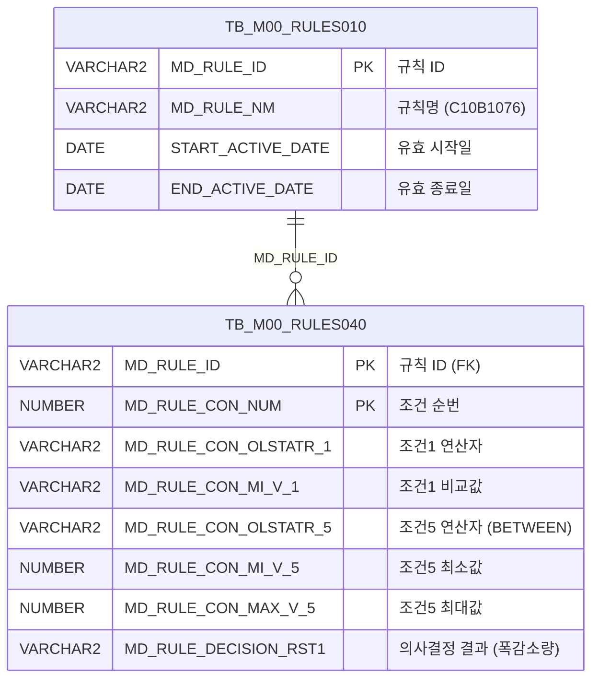

<h1 style="font-size: 40px; text-align: center; font-weight:
   bold; margin: 30px 0;">
  C107000030tab12 레거시 시스템 분석 종합 보고서
</h1>


# 1. 시스템 개요
- **서비스 ID**: C107000030tab12
- **업무명**: EGL폭감소량
- **분석 일시**: 2026-03-17 10:49 KST
- **전체 Activity 수**: 2 (Built-in 2개, Custom 0개)
- **분석자**: Claude Opus 4.6 / Claude Sonnet
- **분석 도구**: /analyze-service C107000030tab12
- **문서 버전**: 1.0

# 비즈니스 프로세스 분석

## 시스템 목적

C107000030tab12는 EGL(전기아연도금) 공정에서 사용하는 **폭감소량 룰(C10B1076)** 조회 화면이다. 상위 화면 C107000030의 탭12로 구성되며, 의사결정 룰 엔진(TB_M00_RULES010/040)에 등록된 C10B1076 규칙의 조건-결과 매핑 데이터를 조회하여 Grid에 표시한다.

폭감소량 규칙은 **공정, 품명코드, 재질코드, 원자재코드, PLTCM두께범위, 제품폭범위** 6개 조건의 조합에 따라 적용할 폭감소량 값을 결정한다. 이 화면은 해당 규칙 데이터를 읽기 전용으로 조회하여 오퍼레이터가 현재 적용 중인 폭감소량 기준을 확인할 수 있게 한다.

본 서비스는 Custom Activity 없이 Built-in Activity(Router + FormSearch)만으로 구성된 단순 조회 서비스이다. 탭 진입 시 상위 탭(C107000030)의 조회 조건 Form을 공유하여 자동 조회가 수행된다.

## 주요 유즈케이스

### UC-01: EGL 폭감소량 규칙 조회
- **Actor**: C10 공정 오퍼레이터 / 설계 담당자
- **목적**: EGL 공정에 적용 중인 폭감소량 의사결정 규칙(C10B1076)의 조건-결과 매핑 데이터를 조회하여 현재 기준을 확인

- **전제조건**:
  - 사용자가 C107000030 화면에 접속하여 tab12 탭을 선택
  - TB_M00_RULES010에 C10B1076 규칙이 등록되어 있고, 현재 유효기간(START_ACTIVE_DATE ~ END_ACTIVE_DATE) 내에 있음
  - TB_M00_RULES040에 해당 규칙의 조건-결과 행이 존재

- **주요 흐름**:
  1. 사용자가 C107000030 화면에서 tab12(EGL폭감소량) 탭 선택
  2. 탭 진입 시 onLoadGrid 이벤트가 자동 발생하여 조회 실행
  3. 상위 탭(C107000030)의 Form_1 조회 조건을 파라미터로 구성 (uiCommon.parameters4)
  4. C107000030tab12-service의 find 명령 호출
  5. C107000030tab12.select 쿼리 실행: TB_M00_RULES010에서 C10B1076 규칙 ID를 조회하고, TB_M00_RULES040과 조인하여 6개 조건 + 1개 결과(폭감소량) 반환
  6. Grid에 규칙 데이터 표시 (읽기 전용)

- **대체 흐름**:
  - 규칙이 유효기간 외인 경우: TB_M00_RULES010 서브쿼리에서 결과 없음 → Grid에 데이터 없음
  - 조회 버튼 수동 클릭: find 함수 호출로 동일한 조회 수행

- **후행조건**:
  - Grid에 C10B1076 규칙의 조건-결과 데이터가 표시됨
  - 사용자가 폭감소량 기준을 확인할 수 있는 상태

### UC-02: 그리드 컨텍스트 메뉴 활용
- **Actor**: C10 공정 오퍼레이터
- **목적**: 그리드의 컨텍스트 메뉴를 통해 컬럼 이동, 필터, 편집 모드 전환, 엑셀 내보내기 등 부가 기능 활용

- **전제조건**:
  - Grid에 데이터가 로드되어 있음

- **주요 흐름**:
  1. 사용자가 Grid 영역에서 우클릭하여 컨텍스트 메뉴 호출
  2. 메뉴 항목 선택:
     - **컬럼 이동(move_grid)**: 컬럼 드래그 이동 활성화/비활성화
     - **헤더 필터(filter_grid)**: 헤더 메뉴 활성화
     - **편집 가능(editable_grid)**: 읽기 전용 ↔ 편집 모드 전환
     - **엑셀 내보내기(excel_grid)**: Grid 데이터를 엑셀 파일로 다운로드

- **대체 흐름**:
  - 체크박스 토글 방식으로 기능 ON/OFF
  - 엑셀 내보내기는 `/gridexcel` URL로 서버 호출

- **후행조건**:
  - 선택한 기능이 활성화/비활성화됨

### UC-03: 메시지 확인
- **Actor**: C10 공정 오퍼레이터
- **목적**: Grid 조회 후 시스템 메시지(건수 등)를 상태바에서 확인

- **전제조건**:
  - Grid 조회가 완료됨

- **주요 흐름**:
  1. Grid 조회 완료 후 findMessage 함수 호출
  2. Grid의 appMsg UserData에서 메시지 추출
  3. messagebox 영역에 메시지 표시

- **후행조건**:
  - 조회 결과 건수 등 시스템 메시지가 하단 상태바에 표시됨

---
## 비즈니스 로직 상세

### 1. 의사결정 룰 엔진 기반 폭감소량 규칙 조회

- **목적**: C10B1076 규칙에 등록된 6개 조건(공정, 품명코드, 재질코드, 원자재코드, PLTCM두께범위, 제품폭범위)의 조합에 따른 폭감소량 결과값을 조회하여 화면에 표시
- **처리 케이스**:

  **[케이스 1: 유효 규칙 조회]**
  ```
    조건: TB_M00_RULES010.MD_RULE_NM = 'C10B1076'
          AND START_ACTIVE_DATE <= SYSDATE
          AND SYSDATE < END_ACTIVE_DATE
    처리:
      1. TB_M00_RULES010에서 C10B1076 규칙의 MD_RULE_ID 조회 (유효기간 필터)
      2. TB_M00_RULES040과 MD_RULE_ID로 조인
      3. 6개 조건 컬럼 추출:
         - CON1(공정 연산자), MIN1(공정 비교값)
         - CON2(품명코드 연산자), MIN2(품명코드 비교값)
         - CON3(재질코드 연산자), MIN3(재질코드 비교값)
         - CON4(원자재코드 연산자), MIN4(원자재코드 비교값)
         - CON5(PLTCM두께범위 연산자), MIN5(두께 최소값), MAX5(두께 최대값)
         - CON6(제품폭범위 연산자), MIN6(폭 최소값), MAX6(폭 최대값)
      4. 의사결정 결과 RST1(폭감소량) 추출
  ```

  **[케이스 2: 범위 조건의 연산자 변환]**
  ```
    조건: CON5(PLTCM두께범위), CON6(제품폭범위) 컬럼
    처리:
      1. MD_RULE_CON_OLSTATR_5, MD_RULE_CON_OLSTATR_6 값을 UPPER() 처리
      2. FUNC_GET_YEONSAN 함수 호출하여 연산자 코드를 기호로 변환:
         - BETWEEN1 → '<=값<='  (최소값 이상, 최대값 이하)
         - BETWEEN2 → '<=값<'   (최소값 이상, 최대값 미만)
         - BETWEEN3 → '<값<='   (최소값 초과, 최대값 이하)
         - BETWEEN4 → '<값<'    (최소값 초과, 최대값 미만)
         - 기타 → 입력값 그대로 반환
      3. 변환된 기호를 CON5, CON6 컬럼으로 Grid에 표시
  ```

- **예외 처리**:
  - 유효기간 외 규칙: SYSDATE가 START_ACTIVE_DATE~END_ACTIVE_DATE 범위 밖이면 조회 결과 없음
  - FUNC_GET_YEONSAN 예외: WHEN OTHERS → NULL 반환

### 2. 다조건 의사결정 규칙 구조

- **목적**: 6개 조건의 조합으로 폭감소량을 결정하는 의사결정 테이블 패턴
- **처리 케이스**:

  **[조건 1~4: 단일값 비교]**
  ```
    CON1~CON4: 각각 연산자(OLSTATR) + 비교값(MI_V)으로 구성
    - 공정(CON1): 연산자 + 공정코드
    - 품명코드(CON2): 연산자 + 품명코드
    - 재질코드(CON3): 연산자 + 재질코드값
    - 원자재코드(CON4): 연산자 + 원자재코드값
  ```

  **[조건 5~6: 범위 비교]**
  ```
    CON5, CON6: 연산자(OLSTATR) + 최소값(MI_V) + 최대값(MAX_V)으로 구성
    - PLTCM두께범위(CON5): BETWEEN 연산자 + 두께 최소/최대 (소수점 3자리, 0.000)
    - 제품폭범위(CON6): BETWEEN 연산자 + 폭 최소/최대 (소수점 1자리, 0000.0)
    - FUNC_GET_YEONSAN으로 연산자 기호 변환하여 표시
  ```

---

# 데이터 요구사항

## 핵심 테이블

### 1. TB_M00_RULES010 - (의사결정 규칙 마스터)
| 컬럼명 | 타입 | PK | 설명 |
|--------|------|----|------|
| MD_RULE_ID | VARCHAR2 | PK | 규칙 ID |
| MD_RULE_NM | VARCHAR2 | | 규칙명 (예: 'C10B1076') |
| START_ACTIVE_DATE | DATE | | 유효 시작일 |
| END_ACTIVE_DATE | DATE | | 유효 종료일 |

### 2. TB_M00_RULES040 - (의사결정 규칙 조건-결과 상세)
| 컬럼명 | 타입 | PK | 설명 |
|--------|------|----|------|
| MD_RULE_ID | VARCHAR2 | PK | 규칙 ID (FK → RULES010) |
| MD_RULE_CON_NUM | NUMBER | PK | 조건 순번 (SEQ) |
| MD_RULE_CON_OLSTATR_1 | VARCHAR2 | | 조건1 연산자 (공정) |
| MD_RULE_CON_MI_V_1 | VARCHAR2 | | 조건1 비교값 (공정코드) |
| MD_RULE_CON_OLSTATR_2 | VARCHAR2 | | 조건2 연산자 (품명코드) |
| MD_RULE_CON_MI_V_2 | VARCHAR2 | | 조건2 비교값 (품명코드값) |
| MD_RULE_CON_OLSTATR_3 | VARCHAR2 | | 조건3 연산자 (재질코드) |
| MD_RULE_CON_MI_V_3 | VARCHAR2 | | 조건3 비교값 (재질코드값) |
| MD_RULE_CON_OLSTATR_4 | VARCHAR2 | | 조건4 연산자 (원자재코드) |
| MD_RULE_CON_MI_V_4 | VARCHAR2 | | 조건4 비교값 (원자재코드값) |
| MD_RULE_CON_OLSTATR_5 | VARCHAR2 | | 조건5 연산자 (PLTCM두께범위, BETWEEN 코드) |
| MD_RULE_CON_MI_V_5 | NUMBER | | 조건5 최소값 (PLTCM두께 하한) |
| MD_RULE_CON_MAX_V_5 | NUMBER | | 조건5 최대값 (PLTCM두께 상한) |
| MD_RULE_CON_OLSTATR_6 | VARCHAR2 | | 조건6 연산자 (제품폭범위, BETWEEN 코드) |
| MD_RULE_CON_MI_V_6 | NUMBER | | 조건6 최소값 (제품폭 하한) |
| MD_RULE_CON_MAX_V_6 | NUMBER | | 조건6 최대값 (제품폭 상한) |
| MD_RULE_DECISION_RST1 | VARCHAR2 | | 의사결정 결과1 (폭감소량) |

## 데이터 플로우

### 1. 조회

```
[EGL폭감소량 규칙 조회]
탭 진입 (onLoadGrid) 또는 조회 버튼 클릭 (find)
→ C107000030tab12.select
  FROM M00APUSER.TB_M00_RULES040 RULES040
  INNER JOIN (SELECT MD_RULE_ID FROM M00APUSER.TB_M00_RULES010
              WHERE MD_RULE_NM='C10B1076'
              AND START_ACTIVE_DATE <= SYSDATE
              AND SYSDATE < END_ACTIVE_DATE) RULES010
    ON RULES010.MD_RULE_ID = RULES040.MD_RULE_ID
  - CON5, CON6: FUNC_GET_YEONSAN(UPPER(OLSTATR)) 함수로 연산자 기호 변환
→ Grid에 6개 조건 + 1개 결과(폭감소량) 목록 표시
```

## SQL 일람표

| SQL 이름 | 쿼리 ID | 타입 | 출처 | 테이블 |
|---------|---------|-----|-------|-------|
| EGL폭감소량 규칙 조회 | C107000030tab12.select | SELECT | Service | TB_M00_RULES040, TB_M00_RULES010 |

## PL/SQL 함수/프로시저

| # | 호출명 | 유형 | 용도 | 상세 분석 |
|---|--------|------|------|----------|
| 1 | FUNC_GET_YEONSAN | 함수 | 연산자 코드(BETWEEN1~4)를 연산 기호(<=값<= 등)로 변환 | [분석 보고서](../../../dbms/M00APUSER/function/FUNC_GET_YEONSAN_analysis_report.md) |

## ER 다이어그램 (핵심 관계)



관계 설명:
- **TB_M00_RULES010**이 중심 테이블로 규칙 마스터 역할 (규칙명, 유효기간 관리)
- **TB_M00_RULES040**은 규칙별 조건-결과 상세 데이터를 보관하며, MD_RULE_ID로 1:N 관계
- 스키마: 모두 M00APUSER (마스터 데이터)

---

# 사용자 인터페이스 요구사항

## 화면 레이아웃 상세

### Layout 구조 (pageConfiguration)
```javascript
// 레이아웃 컨테이너 없이 절대좌표(absolute) 배치
{
  type: "flat",
  components: [
    {
      id: "C107000030tab12_Grid_1",
      type: "grid",
      position: { left: "0px", top: "0px", width: "976px", height: "492px" }
    },
    {
      id: "C107000030tab12_messagebox",
      type: "messagebox",
      position: { left: "0px", top: "493px", width: "976px", height: "18px" }
    },
    {
      id: "C107000030tab12_Form_1",
      type: "form",
      position: { left: "0px", top: "450px", width: "282px", height: "30px" }
      // 비어있는 Form - 상위 탭(C107000030)의 Form_1을 공유
    }
  ]
}
```

## 입출력 요소

### Form 컴포넌트
**C107000030tab12_Form_1**
- 자체 필드 없음 (XML이 비어있음, items 태그만 존재)
- 상위 탭(C107000030)의 C107000030_Form_1 폼을 조회 조건으로 공유하여 사용

### Grid 컴포넌트

**C107000030tab12_Grid_1 (EGL폭감소량 규칙 목록)**
- 편집 가능 여부: 아니오 (읽기 전용, 모든 컬럼 ro/ron 타입)
- Split: 0 (고정 컬럼 없음)
- 컬럼 너비 단위: % (백분율)
- 헤더: 3단 구성 (1단: 그룹 헤더, 2단: 연산/비교값 구분, 3단: 필터)
- 페이지셋(pageset): true
- 컨텍스트 메뉴: true
- 주요 컬럼 (16개):

  **순번**:
  - SEQ: ro - 조건 순번 (4%, 우측정렬)

  **공정 조건**:
  - CON1: ro - 공정 연산자 (5%, 중앙정렬)
  - MIN1: ro - 공정 비교값 (6%, 중앙정렬)

  **품명코드 조건**:
  - CON2: ro - 품명코드 연산자 (5%, 중앙정렬)
  - MIN2: ro - 품명코드 비교값 (8%, 중앙정렬)

  **재질코드 조건**:
  - CON3: ro - 재질코드 연산자 (5%, 중앙정렬)
  - MIN3: ro - 재질코드 비교값 (14%, 좌측정렬)

  **원자재코드 조건**:
  - CON4: ro - 원자재코드 연산자 (5%, 중앙정렬)
  - MIN4: ro - 원자재코드 비교값 (5%, 중앙정렬)

  **PLTCM두께범위 조건**:
  - CON5: ro - 두께범위 연산자 기호 (8%, 중앙정렬, FUNC_GET_YEONSAN 변환)
  - MIN5: ron - 두께 최소값 (5%, 중앙정렬, format: 0.000)
  - MAX5: ron - 두께 최대값 (5%, 중앙정렬, format: 0.000)

  **제품폭범위 조건**:
  - CON6: ro - 폭범위 연산자 기호 (8%, 중앙정렬, FUNC_GET_YEONSAN 변환)
  - MIN6: ron - 폭 최소값 (5%, 중앙정렬, format: 0000.0)
  - MAX6: ron - 폭 최대값 (5%, 중앙정렬, format: 0000.0)

  **의사결정 결과**:
  - RST1: ro - 폭감소량 (*, 중앙정렬)

## 화면 동작 흐름

### 1. 화면 초기 로딩 (탭 진입)
```
1. C107000030 화면에서 tab12(EGL폭감소량) 탭 선택
2. ui.initializeDHTMLX() 호출로 DHTMLX 컴포넌트 초기화
3. Grid XML 로드 완료 시 onXLE 이벤트 발생
4. onLoadGrid 함수 자동 실행:
   - uiCommon.parameters4('C107000030_Form_1', 'C107000030tab12_Grid_1', customparam + 'find')
   - 상위 탭의 Form 조건을 파라미터로 구성
5. items['C107000030tab12_Grid_1'].loadData(findUrl) 호출
6. C107000030tab12-service → 분기(PosDefaultRouter) → 조회(FormSearch)
7. C107000030tab12.select 쿼리 실행
8. Grid에 EGL폭감소량 규칙 데이터 표시
9. onXLE 이벤트 해제 (detachEvent) → 이후 자동 조회 방지
10. findMessage로 상태바에 조회 결과 메시지 표시
```

### 2. 수동 조회 (find 버튼)
```
1. 사용자가 상위 탭(C107000030)에서 조회 버튼 클릭
2. find(eventName, formDivObj, referenceItem) 함수 호출
3. uiCommon.parameters4('C107000030_Form_1', 'C107000030tab12_Grid_1', customparam + eventName)
4. items['C107000030tab12_Grid_1'].loadData(findUrl)
5. handleDataProcess.do → C107000030tab12-service 서비스 호출
6. Grid 데이터 갱신
```

### 3. 컨텍스트 메뉴 기능
```
1. Grid 영역에서 우클릭
2. contextmenu.xml 기반 메뉴 표시
3. 메뉴 항목 선택 시 onGridContextMenuClick 호출:
   - move_grid: gridObj.enableColumnMove(true/false)
   - filter_grid: gridObj.enableHeaderMenu()
   - editable_grid: gridObj.setEditable(true/false)
   - excel_grid: gridObj.toExcel('/gridexcel', 'color')
4. 체크박스 토글로 기능 ON/OFF
```

## JavaScript 모듈

**C107000030tab12.jsp** (인라인 스크립트)
- find(eventName, formDivObj, referenceItem): 조회 실행 (uiCommon.parameters4로 상위 Form 파라미터 구성 → Grid loadData)
- add(referenceItem): 신규 행 추가 (items[referenceItem].addRow())
- remove(referenceItem): 행 삭제 (items[referenceItem].removeRow())
- copy(referenceItem): 행 클립보드 복사 (items[referenceItem].copyRowContent())
- undo(referenceItem): 되돌리기 (items[referenceItem].undo())
- redo(referenceItem): 다시 실행 (items[referenceItem].redo())
- onGridContextMenuClick(id, gridObj, menuObj): 컨텍스트 메뉴 핸들러 (컬럼 이동/필터/편집/엑셀)
- findMessage(referenceItem): 메시지박스 표시 (uiCommon.message로 appMsg 표시)
- onLoadGrid(): 초기 자동 조회 (uiCommon.parameters4 → loadData → detachEvent)

**외부 참조**:
- ./js/c10.ui.js: C10 모듈 공통 UI 스크립트
- ./dhtmlx/codebase/glue.ui.bootstrap.js: GLUE UI 프레임워크 부트스트랩

## 주요 이벤트 핸들러

**onLoadGrid (탭 초기 진입 시 자동 조회)**
- 이벤트 타입: onXLE (Grid XML 로드 완료)
- 처리 내용:
  1. uiCommon.parameters4로 상위 Form 조건 수집
  2. Grid loadData로 C107000030tab12-service 호출
  3. detachEvent로 onXLE 이벤트 해제 (1회만 실행)

**onGridContextMenuClick (컨텍스트 메뉴)**
- 이벤트 타입: Grid Context Menu Click
- 처리 내용:
  1. 메뉴 항목 ID 확인 (move_grid/filter_grid/editable_grid/excel_grid)
  2. 체크박스 상태(isChecked) 확인
  3. 해당 기능 활성화/비활성화

---

# 특이사항 및 주의사항

## 1. 상위 탭 Form 공유 패턴
- C107000030tab12의 자체 Form_1은 **비어있는 빈 Form** (items 태그만 존재, 필드 없음)
- 조회 시 상위 탭(C107000030)의 `C107000030_Form_1`을 직접 참조하여 파라미터를 구성
- `uiCommon.parameters4('C107000030_Form_1', 'C107000030tab12_Grid_1', ...)` 패턴으로 크로스 탭 Form 참조
- 상위 탭의 Form 구조가 변경되면 이 탭의 조회 동작에도 영향을 미침

## 2. 자동 조회 + 이벤트 해제 패턴
- `onXLE` 이벤트(Grid XML 로드 완료)에 `onLoadGrid` 함수 바인딩
- 최초 1회 자동 조회 수행 후 `detachEvent(onXLE)`로 이벤트 해제
- 이후 탭 재진입 시에는 자동 조회가 발생하지 않으며, 수동 조회 필요
- 이 패턴은 탭 초기 진입 시 데이터를 즉시 표시하되, 불필요한 중복 조회를 방지하기 위한 설계

## 3. FUNC_GET_YEONSAN 연산자 변환 함수 의존성
- CON5(PLTCM두께범위), CON6(제품폭범위) 컬럼은 SQL에서 `M00APUSER.FUNC_GET_YEONSAN(UPPER(...))` 함수를 호출하여 연산자 코드를 기호로 변환
- BETWEEN1~BETWEEN4 → `<=값<=`, `<=값<`, `<값<=`, `<값<` 매핑
- 함수 예외 시 NULL 반환 → 해당 셀이 빈 값으로 표시될 수 있음
- 입력값에 UPPER() 적용 → 대소문자 무관 비교

## 4. M00APUSER 스키마 직접 참조
- 쿼리에서 `M00APUSER.TB_M00_RULES040`, `M00APUSER.TB_M00_RULES010`으로 스키마를 직접 명시
- `M00APUSER.FUNC_GET_YEONSAN` 함수도 스키마 접두사 포함
- DAO는 `mesdao`(MESAPUSER)를 사용하지만, 실제 테이블은 M00APUSER 스키마에 위치
- 크로스 스키마 접근 권한이 필요한 구조

## 5. 읽기 전용 Grid에 편집 관련 함수 존재
- Grid 컬럼이 모두 ro/ron(읽기 전용) 타입임에도 add, remove, undo, redo 등 편집 관련 함수가 정의되어 있음
- 컨텍스트 메뉴의 editable_grid 기능으로 런타임에 편집 모드 전환 가능
- 이는 GLUE 프레임워크의 템플릿 기반 코드 생성에 따른 것으로, 실제 저장 기능(save)은 구현되어 있지 않음

---

# 참고 문서

- **Service XML**: `src/service/C107000030tab12-service.xml`
- **Query SQL**: `src/query/C107000030tab12-query.glue_sql`
- **JSP**: `WebContents/C107000030tab12.jsp`
- **Grid XML**: `WebContents/header/kr/C107000030tab12/C107000030tab12_Grid_1.xml`
- **Form XML**: `WebContents/header/kr/C107000030tab12/C107000030tab12_Form_1.xml`
- **PL/SQL**: [FUNC_GET_YEONSAN 분석 보고서](../../../dbms/M00APUSER/function/FUNC_GET_YEONSAN_analysis_report.md)
