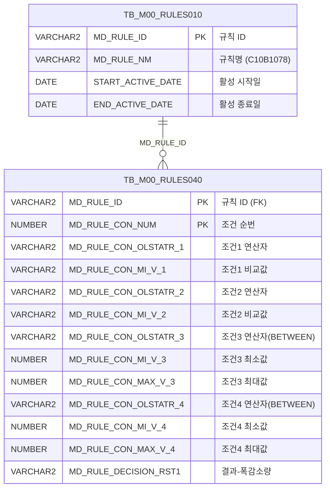

<h1 style="font-size: 40px; text-align: center; font-weight:
   bold; margin: 30px 0;">
  C107000030tab13 레거시 시스템 분석 종합 보고서
</h1>


# 1. 시스템 개요
- **서비스 ID**: C107000030tab13
- **업무명**: CCL 폭감소량 규칙 조회
- **분석 일시**: 2026-03-17 10:50 (KST)
- **분석 시간**: 약 5분
- **전체 Activity 수**: 2개 (Built-in 2개)
- **분석자**: Claude Opus 4.6 / Claude Sonnet
- **분석 도구**: /analyze-service C107000030tab13
- **문서 버전**: 1.0

# 📊 비즈니스 프로세스 분석

## 시스템 목적

CCL(Continuous Coating Line, 연속도장라인) 공정에서 사용되는 **폭감소량 규칙 데이터를 조회**하는 화면이다. 상위 화면 C107000030의 탭 13번에 해당하며, 부모 화면의 검색 조건 폼(C107000030_Form_1)을 공유하여 사용한다.

MES Rules Engine(TB_M00_RULES040)에 등록된 **C10B1078 규칙**의 조건-결과 매핑 데이터를 조회한다. 이 규칙은 품명코드, 재질코드, PLTCM 두께범위, 제품폭범위 등 4가지 조건에 따라 CCL 공정에서 적용할 폭감소량 값을 결정한다. 폭감소량은 도장 공정 전후 제품 폭 변화를 보정하기 위한 기준값으로, 생산 품질 관리에 핵심적인 파라미터이다.

## 주요 유즈케이스

### UC-01: CCL 폭감소량 규칙 조회
- **Actor**: CCL 공정 오퍼레이터 / 품질관리 담당자
- **목적**: CCL 공정에서 적용되는 폭감소량 규칙을 조회하여 품명코드, 재질코드, 두께/폭 범위별로 적용될 폭감소량 값을 확인

- **전제조건**:
  - 사용자가 시스템에 로그인되어 있음
  - 상위 화면 C107000030이 로드된 상태
  - TB_M00_RULES010에 C10B1078 규칙이 활성 상태로 등록되어 있음

- **주요 흐름**:
  1. 사용자가 상위 화면(C107000030)에서 탭 13(CCL폭감소량) 선택
  2. 탭 진입 시 onLoadGrid 이벤트가 자동으로 find() 함수 호출
  3. 부모 폼(C107000030_Form_1)의 파라미터를 읽어 Grid 데이터 로드
  4. C107000030tab13.select 쿼리 실행 → TB_M00_RULES040에서 C10B1078 규칙 조회
  5. Grid에 조건(품명코드, 재질코드, PLTCM두께범위, 제품폭범위)과 결과(폭감소량) 표시

- **대체 흐름**:
  - 조회 결과가 없는 경우: 빈 Grid 표시
  - C10B1078 규칙이 비활성 상태인 경우: START_ACTIVE_DATE/END_ACTIVE_DATE 조건에 의해 데이터 미조회

- **후행조건**:
  - 조회된 폭감소량 규칙 데이터가 Grid에 표시됨
  - 사용자가 컨텍스트 메뉴를 통해 엑셀 내보내기, 필터링 등 부가 기능 사용 가능

### UC-02: 그리드 데이터 필터링
- **Actor**: CCL 공정 오퍼레이터
- **목적**: 조회된 폭감소량 규칙 데이터 중 특정 조건의 데이터를 필터링하여 확인

- **전제조건**:
  - Grid에 조회 데이터가 로드되어 있음

- **주요 흐름**:
  1. Grid 헤더의 3번째 행에서 텍스트/숫자 필터 사용
  2. 품명코드 비교값(MIN1) → 텍스트 필터 입력
  3. 재질코드 비교값(MIN2) → 텍스트 필터 입력
  4. PLTCM 두께범위(MIN3, MAX3) → 숫자 필터 입력
  5. 제품폭범위(MIN4, MAX4) → 숫자 필터 입력
  6. 필터 조건에 맞는 행만 Grid에 표시

- **대체 흐름**:
  - 필터 조건에 맞는 데이터가 없는 경우: 빈 Grid 표시

- **후행조건**:
  - 필터링된 데이터가 Grid에 표시됨

### UC-03: 엑셀 내보내기
- **Actor**: CCL 공정 오퍼레이터 / 품질관리 담당자
- **목적**: 폭감소량 규칙 데이터를 엑셀 파일로 다운로드하여 오프라인 활용

- **전제조건**:
  - Grid에 조회 데이터가 로드되어 있음

- **주요 흐름**:
  1. Grid 영역에서 마우스 우클릭 → 컨텍스트 메뉴 표시
  2. "엑셀 내보내기" 메뉴 선택
  3. toExcel 함수 호출로 Grid 데이터를 엑셀 파일로 변환
  4. 브라우저에서 엑셀 파일 다운로드

- **대체 흐름**:
  - Grid에 데이터가 없는 경우: 빈 엑셀 파일 생성

- **후행조건**:
  - 엑셀 파일이 사용자 로컬에 다운로드됨

---
## 비즈니스 로직 상세

### 1. 연산자 코드 변환 (FUNC_GET_YEONSAN)

- **목적**: Rules Engine에 저장된 연산자 코드(BETWEEN1~BETWEEN4)를 사람이 읽을 수 있는 연산 기호로 변환하여 화면에 표시

- **처리 케이스**:

  **[케이스 1: BETWEEN 범위 연산자 변환]**
  ```
    조건: PLTCM두께범위(CON3), 제품폭범위(CON4) 컬럼의 연산자 코드
    처리:
      1. RULES040.MD_RULE_CON_OLSTATR_3/4 값을 UPPER() 적용
      2. M00APUSER.FUNC_GET_YEONSAN 함수 호출
      3. 변환 매핑:
         - BETWEEN1 → '<=값<='  (최소값 이상, 최대값 이하)
         - BETWEEN2 → '<=값<'   (최소값 이상, 최대값 미만)
         - BETWEEN3 → '<값<='   (최소값 초과, 최대값 이하)
         - BETWEEN4 → '<값<'    (최소값 초과, 최대값 미만)
         - 기타      → 입력값 그대로 반환
  ```

  **[케이스 2: 매핑되지 않은 연산자]**
  ```
    조건: 위 BETWEEN1~4에 해당하지 않는 연산자 코드
    처리:
      1. 원본 연산자 코드를 그대로 반환
      2. 확장성 확보 (새로운 연산자 추가 시 함수 수정 필요)
  ```

  **[케이스 3: 예외 발생]**
  ```
    조건: 함수 실행 중 예외 발생
    처리:
      1. WHEN OTHERS 핸들러에서 NULL 반환
  ```

### 2. Rules Engine 활성 규칙 필터링

- **목적**: TB_M00_RULES010에서 현재 활성 상태인 C10B1078 규칙만 조회

- **처리 케이스**:

  **[케이스 1: 활성 기간 검증]**
  ```
    조건: MD_RULE_NM = 'C10B1078' AND 현재 시각이 활성 기간 내
    처리:
      1. START_ACTIVE_DATE <= SYSDATE 확인 (시작일 이후)
      2. SYSDATE < END_ACTIVE_DATE 확인 (종료일 이전, 종료일 미포함)
      3. 조건 충족 시 MD_RULE_ID 반환
      4. RULES040과 MD_RULE_ID로 조인하여 상세 규칙 데이터 조회
  ```

### 3. 4조건-1결과 규칙 매핑 구조

- **목적**: 4가지 입력 조건에 대해 1가지 의사결정 결과(폭감소량)를 매핑

- **처리 케이스**:

  **[조건 구조]**
  ```
    조건1 (CON1/MIN1): 품명코드 - 단일값 비교 (연산자 + 비교값)
    조건2 (CON2/MIN2): 재질코드 - 단일값 비교 (연산자 + 비교값)
    조건3 (CON3/MIN3/MAX3): PLTCM두께범위 - 범위 비교 (BETWEEN 연산자 + 최소/최대값)
    조건4 (CON4/MIN4/MAX4): 제품폭범위 - 범위 비교 (BETWEEN 연산자 + 최소/최대값)
    결과 (RST1): 폭감소량 값
  ```

---

# 💾 데이터 요구사항

## 핵심 테이블

### 1. TB_M00_RULES040 - (Rules Engine 규칙 상세 조건/결과)
| 컬럼명 | 타입 | PK | 설명 |
|--------|------|----|------|
| MD_RULE_ID | VARCHAR2 | ✅ | 규칙 ID (RULES010과 FK 관계) |
| MD_RULE_CON_NUM | NUMBER | ✅ | 조건 순번 (SEQ) |
| MD_RULE_CON_OLSTATR_1 | VARCHAR2 | | 조건1 연산자 (품명코드) |
| MD_RULE_CON_MI_V_1 | VARCHAR2 | | 조건1 비교값 (품명코드 값) |
| MD_RULE_CON_OLSTATR_2 | VARCHAR2 | | 조건2 연산자 (재질코드) |
| MD_RULE_CON_MI_V_2 | VARCHAR2 | | 조건2 비교값 (재질코드 값) |
| MD_RULE_CON_OLSTATR_3 | VARCHAR2 | | 조건3 연산자 (PLTCM두께범위, BETWEEN1~4) |
| MD_RULE_CON_MI_V_3 | NUMBER | | 조건3 최소값 (PLTCM두께 최소) |
| MD_RULE_CON_MAX_V_3 | NUMBER | | 조건3 최대값 (PLTCM두께 최대) |
| MD_RULE_CON_OLSTATR_4 | VARCHAR2 | | 조건4 연산자 (제품폭범위, BETWEEN1~4) |
| MD_RULE_CON_MI_V_4 | NUMBER | | 조건4 최소값 (제품폭 최소) |
| MD_RULE_CON_MAX_V_4 | NUMBER | | 조건4 최대값 (제품폭 최대) |
| MD_RULE_DECISION_RST1 | VARCHAR2 | | 의사결정 결과1 (폭감소량) |

### 2. TB_M00_RULES010 - (Rules Engine 규칙 마스터)
| 컬럼명 | 타입 | PK | 설명 |
|--------|------|----|------|
| MD_RULE_ID | VARCHAR2 | ✅ | 규칙 ID |
| MD_RULE_NM | VARCHAR2 | | 규칙명 (예: C10B1078) |
| START_ACTIVE_DATE | DATE | | 활성 시작일 |
| END_ACTIVE_DATE | DATE | | 활성 종료일 |

## 데이터 플로우

### 1. 조회

```
[CCL 폭감소량 규칙 조회]
탭 진입 (C107000030 → tab13)
→ C107000030tab13.select
  FROM M00APUSER.TB_M00_RULES040 RULES040
  INNER JOIN (SELECT MD_RULE_ID
               FROM M00APUSER.TB_M00_RULES010
              WHERE MD_RULE_NM = 'C10B1078'
                AND START_ACTIVE_DATE <= SYSDATE
                AND SYSDATE < END_ACTIVE_DATE) RULES010
    ON RULES010.MD_RULE_ID = RULES040.MD_RULE_ID
  -- CON3, CON4 컬럼에 M00APUSER.FUNC_GET_YEONSAN() 함수 적용
  -- BETWEEN1~4 코드를 <=값<=, <=값< 등 연산 기호로 변환
→ Grid에 4조건(품명코드, 재질코드, PLTCM두께범위, 제품폭범위) + 1결과(폭감소량) 표시
```

## SQL 일람표

| SQL 이름 | 쿼리 ID | 타입 | 출처 | 테이블 |
|---------|---------|-----|-------|-------|
| CCL 폭감소량 규칙 조회 | C107000030tab13.select | SELECT | Service | TB_M00_RULES040, TB_M00_RULES010 |

## PL/SQL 함수/프로시저

| # | 호출명 | 유형 | 용도 | 상세 분석 |
|---|--------|------|------|----------|
| 1 | FUNC_GET_YEONSAN | 함수 | 연산자 코드(BETWEEN1~4)를 연산 기호(<=값<= 등)로 변환 | [분석 보고서](../../../dbms/M00APUSER/function/FUNC_GET_YEONSAN_analysis_report.md) |

## ER 다이어그램 (핵심 관계)



관계 설명:
- **TB_M00_RULES010**이 규칙 마스터 테이블로, 규칙의 활성 기간을 관리
- **TB_M00_RULES040**이 규칙 상세 테이블로, MD_RULE_ID 기반 1:N 관계
- RULES010에서 활성 규칙 ID를 조회한 후, RULES040에서 해당 규칙의 모든 조건-결과 행을 조회

---

# 🖥️ 사용자 인터페이스 요구사항

## 화면 레이아웃 상세

### Layout 구조
```javascript
{
  itemType: "absolute",  // 절대 위치 배치
  components: [
    {
      id: "C107000030tab13_Grid_1",
      position: { left: 0, top: 0, width: 976, height: 492 },
      component: { itemType: "grid" }
    },
    {
      id: "C107000030tab13_messagebox",
      position: { left: 0, top: 493, width: 976, height: 18 },
      component: { itemType: "messagebox" }
    },
    {
      id: "C107000030tab13_Form_1",
      position: { left: 0, top: 450, width: 282, height: 30 },
      component: { itemType: "form" }  // 빈 폼 (부모 C107000030_Form_1 참조)
    }
  ]
}
```

## 입출력 요소

### Form 컴포넌트
**C107000030tab13_Form_1**
- 빈 폼 컨테이너 (필드 없음)
- 부모 화면의 검색 폼 **C107000030_Form_1**을 참조하여 조회 파라미터 획득
- URL: basicGridData.do

### Grid 컴포넌트

**C107000030tab13_Grid_1 (CCL 폭감소량 규칙 목록)**
- 편집 가능 여부: 아니오 (읽기 전용, 모든 컬럼 ro/ron)
- Split: 0 (고정 컬럼 없음)
- 표시 행 수: 17행
- 컨텍스트 메뉴: 활성
- 페이지네이션: 활성
- Smart Rendering: 활성
- 주요 컬럼 (12개):

  **3단 병합 헤더 구조**:
  - 1행: SEQ | 품명코드(2열) | 재질코드(2열) | PLTCM두께범위(4열) | 제품폭범위(4열) | 폭감소량
  - 2행: SEQ | 연산 | 비교값 | 연산 | 비교값 | 연산 | 비교값 | 비교값 | 연산 | 비교값 | 비교값 | 폭감소량
  - 3행: SEQ | - | 텍스트필터 | - | 텍스트필터 | - | 숫자필터 | 숫자필터 | - | 숫자필터 | 숫자필터 | 폭감소량

  **기본 정보**:
  - SEQ: ro - 조건 순번 (4%, 우측정렬)

  **품명코드 그룹**:
  - CON1: ro - 품명코드 연산자 (8%, 중앙정렬)
  - MIN1: ro - 품명코드 비교값 (5%, 좌측정렬)

  **재질코드 그룹**:
  - CON2: ro - 재질코드 연산자 (8%, 중앙정렬)
  - MIN2: ro - 재질코드 비교값 (6%, 중앙정렬)

  **PLTCM두께범위 그룹**:
  - CON3: ro - PLTCM두께 연산자 (10%, 중앙정렬) ※ FUNC_GET_YEONSAN 변환 결과
  - MIN3: ron - PLTCM두께 최소값 (8%, 중앙정렬, 포맷: 0.000)
  - MAX3: ron - PLTCM두께 최대값 (8%, 중앙정렬, 포맷: 0.000)

  **제품폭범위 그룹**:
  - CON4: ro - 제품폭 연산자 (10%, 중앙정렬) ※ FUNC_GET_YEONSAN 변환 결과
  - MIN4: ron - 제품폭 최소값 (8%, 중앙정렬, 포맷: 0000.0)
  - MAX4: ron - 제품폭 최대값 (8%, 중앙정렬, 포맷: 0000.0)

  **결과**:
  - RST1: ro - 폭감소량 (*, 중앙정렬)

### Messagebox 컴포넌트
**C107000030tab13_messagebox**
- 위치: Grid 하단 (top: 493px, height: 18px)
- Grid 조회 결과 메시지(appMsg) 표시

## 화면 동작 흐름

### 1. 화면 초기 로딩 (탭 진입)
```
1. 상위 화면 C107000030에서 탭 13(CCL폭감소량) 선택
2. C107000030tab13.jsp 로드
3. Grid 초기화 (handleDataProcess.do, C107000030tab13-service)
4. onLoadGrid 이벤트 발생 (XLE: XML Load End)
   - C107000030tab13_Grid_1에 XLE 이벤트 핸들러 등록
   - 자동으로 find() 함수 호출
   - XLE 이벤트 핸들러 해제 (detachEvent) → 1회성 자동 조회
5. find() 실행:
   - 부모 폼 C107000030_Form_1 객체 참조
   - uiCommon.parameters로 폼 파라미터 구성
   - C107000030tab13_Grid_1 데이터 로드 (loadData)
6. Grid에 폭감소량 규칙 데이터 표시
7. findMessage() 콜백으로 messagebox에 조회 결과 메시지 표시
```

### 2. 조회 (부모 화면에서 조회 버튼 클릭)
```
1. 사용자가 부모 화면 C107000030_Form_1에서 조회 조건 입력
2. 부모 화면의 조회 버튼 클릭 → 탭별 find() 호출
3. find() 실행:
   - 부모 폼 C107000030_Form_1 파라미터 읽기
   - C107000030tab13_Grid_1에 loadData 호출
   - C107000030tab13.select 쿼리 실행
4. Grid 데이터 갱신
5. findMessage()로 조회 건수 메시지 표시
```

### 3. 컨텍스트 메뉴 활용
```
1. Grid 영역에서 마우스 우클릭
2. 컨텍스트 메뉴 표시 (onGridContextMenuClick)
3. 메뉴 선택:
   - move_grid: 컬럼 이동 모드 토글 (enableColumnMove)
   - filter_grid: 헤더 필터 메뉴 활성화 (enableHeaderMenu)
   - editable_grid: 편집 모드 토글 (setEditable)
   - excel_grid: 엑셀 내보내기 (toExcel)
```

## JavaScript 모듈

**C107000030tab13.jsp** (탭 화면 스크립트)
- find(): CCL 폭감소량 데이터 조회 (부모 C107000030_Form_1 파라미터 참조 → loadData 호출)
- add(): 그리드 새 행 추가
- remove(): 그리드 선택 행 삭제
- copy(): 그리드 행 클립보드 복사
- undo(): 실행 취소
- redo(): 다시 실행
- onGridContextMenuClick(id): 컨텍스트 메뉴 항목 처리 (컬럼이동, 필터, 편집모드, 엑셀)
- findMessage(appMsg): Grid 조회 결과 메시지를 messagebox에 표시 (uiCommon.message 호출)
- onLoadGrid(): Grid XLE 이벤트 핸들러 - 초기 자동 조회 실행 후 이벤트 해제 (detachEvent)

## 주요 이벤트 핸들러

**onLoadGrid (탭 초기 진입 시 자동 조회)**
- 이벤트 타입: Grid XLE (XML Load End)
- 처리 내용:
  1. Grid 로드 완료 감지
  2. find() 함수 자동 호출로 데이터 조회
  3. XLE 이벤트 핸들러 해제 (1회성 실행)

**onGridContextMenuClick (그리드 우클릭 메뉴)**
- 이벤트 타입: Context Menu Click
- 처리 내용:
  1. 메뉴 ID에 따른 분기 처리
  2. move_grid → enableColumnMove 토글
  3. filter_grid → enableHeaderMenu 활성화
  4. editable_grid → setEditable 토글
  5. excel_grid → toExcel 엑셀 내보내기

---

# 📌 특이사항 및 주의사항

## 1. 부모 화면 폼 참조 패턴
- C107000030tab13은 자체 검색 폼이 없고, **부모 화면 C107000030의 C107000030_Form_1을 직접 참조**하여 조회 파라미터를 획득한다. 탭 전환 시 부모 폼의 검색 조건이 유지되는 구조이다. 신규 시스템 개발 시 탭 간 데이터 독립성과 부모-자식 관계를 명확히 설계해야 한다.

## 2. FUNC_GET_YEONSAN 연산자 변환 함수 의존성
- CON3, CON4 컬럼에서 M00APUSER.FUNC_GET_YEONSAN 함수를 호출하여 BETWEEN1~4 코드를 연산 기호로 변환한다. 이 함수는 M00APUSER 스키마에 존재하며, CON1/CON2는 이 변환을 적용하지 않는다. 즉, 조건 3(PLTCM두께범위)과 조건 4(제품폭범위)만 범위 연산자를 사용하고, 조건 1(품명코드)과 조건 2(재질코드)는 단일값 비교 연산을 사용한다.

## 3. Rules Engine(C10B1078) 활성 기간 관리
- TB_M00_RULES010의 START_ACTIVE_DATE, END_ACTIVE_DATE로 규칙 활성 기간을 관리한다. `START_ACTIVE_DATE <= SYSDATE AND SYSDATE < END_ACTIVE_DATE` 조건에서 **종료일은 미포함**(< 연산자)이므로, 종료일 당일에 규칙이 비활성화된다. 규칙 버전 관리 시 시작일/종료일 설정에 주의가 필요하다.

## 4. 컬럼 너비 단위가 퍼센트(%)
- Grid 컬럼 너비가 px가 아닌 **% 단위**(colwidthUnit: "%")로 설정되어 있어, 화면 크기에 따라 컬럼 너비가 가변적이다. RST1(폭감소량) 컬럼은 `*`로 설정되어 나머지 공간을 차지한다.

## 5. 1회성 자동 조회 패턴 (onLoadGrid)
- onLoadGrid 함수에서 XLE 이벤트를 감지하여 find()를 호출한 후 **즉시 이벤트를 해제(detachEvent)**한다. 이는 탭 최초 진입 시 1회만 자동 조회를 수행하고, 이후 데이터 리로드 시에는 자동 조회가 발생하지 않도록 하는 패턴이다.

---

# 📚 참고 문서

- **Query SQL**: `src/query/C107000030tab13-query.glue_sql`
- **Service XML**: `src/service/C107000030tab13-service.xml`
- **JSP**: `WebContents/C107000030tab13.jsp`
- **Grid XML**: `WebContents/header/kr/C107000030tab13/C107000030tab13_Grid_1.xml`
- **Form XML**: `WebContents/header/kr/C107000030tab13/C107000030tab13_Form_1.xml`
- **Messagebox XML**: `WebContents/header/kr/C107000030tab13/C107000030tab13_messagebox.xml`
- **PL/SQL 분석**: `docs/analysis/dbms/M00APUSER/function/FUNC_GET_YEONSAN_analysis_report.md`
