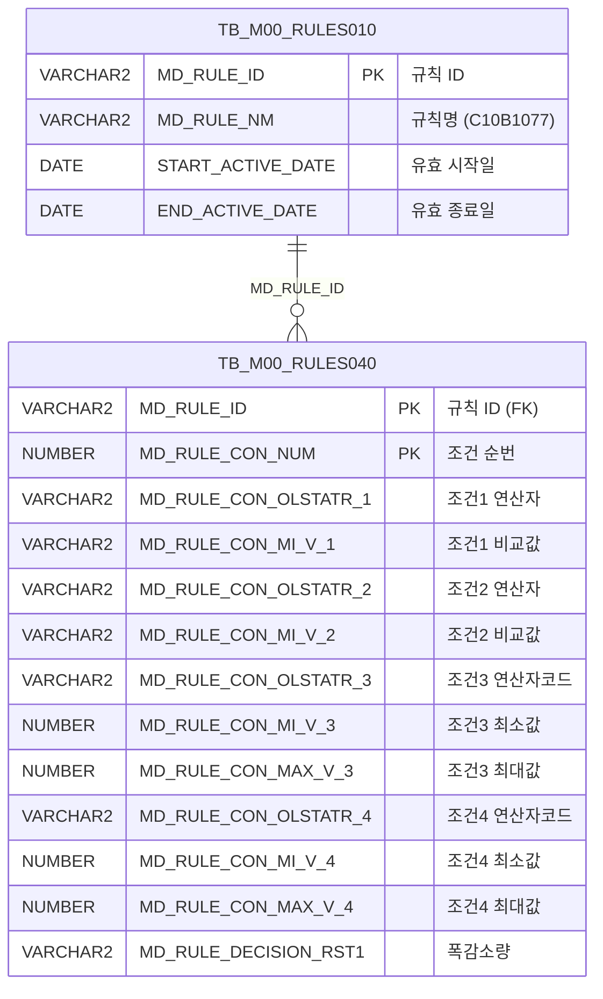

<h1 style="font-size: 40px; text-align: center; font-weight:
   bold; margin: 30px 0;">
  C107000030tab14 레거시 시스템 분석 종합 보고서
</h1>


# 1. 시스템 개요
- **서비스 ID**: C107000030tab14
- **업무명**: 정전폭감소량
- **분석 일시**: 2026-03-17 10:52 KST
- **분석 시간**: 약 5분
- **전체 Activity 수**: 2개 (built-in)
- **분석자**: Claude Opus 4.6 / Claude Sonnet 4.6
- **분석 도구**: /analyze-service C107000030tab14
- **문서 버전**: 1.0

# 📊 비즈니스 프로세스 분석

## 시스템 목적

C107000030tab14는 C10 모듈의 **정전폭감소량(정전기 폭 감소량)** 기준 데이터를 조회하는 탭 화면이다. 부모 화면 C107000030의 14번째 탭으로, Rules Engine(C10B1077)에 등록된 조건-결과 매핑 데이터를 표시한다.

이 화면은 **품명코드, 재질코드, PLTCM 두께범위, 제품폭범위** 4가지 조건 조합에 따른 **폭감소량** 결과값을 규칙 기반으로 관리하며, 생산 계획 수립 시 제품 폭 사양에 따른 정전기 기인 폭 감소 보정값을 참조하는 데 사용된다. 규칙 엔진(TB_M00_RULES010/040)의 유효 기간 내 활성 규칙만 조회하며, 범위 조건의 연산자는 FUNC_GET_YEONSAN 함수를 통해 사람이 읽을 수 있는 기호(`<=값<=`, `<값<` 등)로 변환하여 표시한다.

<!-- 워크플로우 다이어그램 생략: Custom Activity 0개, SELECT 쿼리만 사용, 단순 Router→조회 체인 -->

## 주요 유즈케이스

### UC-01: 정전폭감소량 규칙 조회
- **Actor**: 생산관리 담당자
- **목적**: C10B1077 규칙에 등록된 정전폭감소량 조건-결과 매핑 데이터를 조회하여 제품 사양별 폭 감소 보정값을 확인

- **전제조건**:
  - 사용자가 시스템에 로그인되어 있음
  - 부모 화면 C107000030이 활성화되어 있음
  - TB_M00_RULES010에 C10B1077 규칙이 유효 기간 내 등록되어 있음

- **주요 흐름**:
  1. 사용자가 C107000030 화면에서 tab14(정전폭감소량) 탭 선택
  2. 탭 로드 완료 시 onXLEEvent → onLoadGrid 자동 호출
  3. 부모 화면 C107000030_Form_1의 파라미터를 uiCommon.parameters4로 구성
  4. C107000030tab14-service 호출 → C107000030tab14.select 쿼리 실행
  5. TB_M00_RULES010에서 C10B1077 규칙 ID 조회 (유효기간 필터)
  6. TB_M00_RULES040에서 해당 규칙의 조건-결과 행 조회
  7. FUNC_GET_YEONSAN으로 CON3/CON4 연산자 코드를 기호 변환
  8. Grid에 결과 표시 (SEQ, 조건1~4, 비교값, 폭감소량)

- **대체 흐름**:
  - C10B1077 규칙이 유효기간 외인 경우: 조회 결과 0건
  - 규칙 조건 행이 없는 경우: 빈 Grid 표시

- **후행조건**:
  - Grid에 정전폭감소량 규칙 데이터가 표시됨
  - 사용자가 컨텍스트 메뉴를 통해 필터링, Excel 내보내기 가능

### UC-02: 컨텍스트 메뉴를 통한 Grid 제어
- **Actor**: 생산관리 담당자
- **목적**: Grid의 컬럼 이동, 필터, 편집 모드, Excel 내보내기 등 부가 기능 활용

- **전제조건**:
  - Grid에 데이터가 로드되어 있음

- **주요 흐름**:
  1. Grid 영역에서 우클릭하여 컨텍스트 메뉴 표시
  2. 원하는 기능 선택 (move_grid / filter_grid / editable_grid / excel_grid)
  3. onGridContextMenuClick 함수에서 선택된 기능 처리
  4. 해당 기능 활성화/비활성화 토글

- **대체 흐름**:
  - Excel 내보내기 선택 시: gridObj.toExcel 호출하여 서버 경로(/gridexcel)로 내보내기

- **후행조건**:
  - 선택한 기능이 Grid에 적용됨

### UC-03: 수동 재조회
- **Actor**: 생산관리 담당자
- **목적**: 부모 화면의 검색 조건 변경 후 정전폭감소량 데이터 재조회

- **전제조건**:
  - 부모 화면 C107000030_Form_1의 검색 조건이 변경됨

- **주요 흐름**:
  1. 부모 화면에서 조회 버튼 클릭 (find 이벤트 발생)
  2. find 함수에서 uiCommon.parameters4로 C107000030_Form_1 파라미터 구성
  3. C107000030tab14_Grid_1.loadData 호출
  4. Grid에 갱신된 결과 표시

- **대체 흐름**:
  - 조회 결과 없음: 빈 Grid 표시, 메시지박스에 앱 메시지 출력

- **후행조건**:
  - Grid에 최신 조건 기반 데이터 표시됨

---
## 비즈니스 로직 상세

### 1. Rules Engine 기반 조건-결과 매핑 조회

- **목적**: C10B1077 규칙에 정의된 4개 조건(품명코드, 재질코드, PLTCM두께범위, 제품폭범위)과 1개 결과(폭감소량)의 매핑 데이터를 조회

- **처리 케이스**:

  **[케이스 1: 유효 규칙 필터링]**
  ```
    조건: TB_M00_RULES010.MD_RULE_NM = 'C10B1077'
          AND START_ACTIVE_DATE <= SYSDATE < END_ACTIVE_DATE
    처리:
      1. TB_M00_RULES010에서 C10B1077 규칙의 MD_RULE_ID 추출 (서브쿼리)
      2. TB_M00_RULES040과 MD_RULE_ID로 조인
      3. 해당 규칙의 모든 조건 행(MD_RULE_CON_NUM 기준) 반환
  ```

  **[케이스 2: 조건 컬럼 매핑]**
  ```
    4개 조건의 매핑 구조:
      조건1 (품명코드):    CON1 = MD_RULE_CON_OLSTATR_1 (연산자), MIN1 = MD_RULE_CON_MI_V_1 (비교값)
      조건2 (재질코드):    CON2 = MD_RULE_CON_OLSTATR_2 (연산자), MIN2 = MD_RULE_CON_MI_V_2 (비교값)
      조건3 (PLTCM두께범위): CON3 = FUNC_GET_YEONSAN(OLSTATR_3) (연산기호), MIN3 = MI_V_3, MAX3 = MAX_V_3
      조건4 (제품폭범위):   CON4 = FUNC_GET_YEONSAN(OLSTATR_4) (연산기호), MIN4 = MI_V_4, MAX4 = MAX_V_4
    결과: RST1 = MD_RULE_DECISION_RST1 (폭감소량)
  ```

### 2. 연산자 코드 → 연산 기호 변환 (FUNC_GET_YEONSAN)

- **목적**: 규칙 엔진의 범위 조건 연산자 코드(BETWEEN1~4)를 사람이 읽을 수 있는 수학적 부등호 기호로 변환

- **처리 케이스**:

  **[매핑 규칙]**
  ```
    BETWEEN1 → '<=값<='  (최소값 이상, 최대값 이하 - 양쪽 포함)
    BETWEEN2 → '<=값<'   (최소값 이상, 최대값 미만)
    BETWEEN3 → '<값<='   (최소값 초과, 최대값 이하)
    BETWEEN4 → '<값<'    (최소값 초과, 최대값 미만 - 양쪽 미포함)
    기타     → 입력값 그대로 반환
  ```

  **[적용 위치]**
  ```
    CON3: FUNC_GET_YEONSAN(UPPER(MD_RULE_CON_OLSTATR_3)) - PLTCM 두께범위 연산자
    CON4: FUNC_GET_YEONSAN(UPPER(MD_RULE_CON_OLSTATR_4)) - 제품폭범위 연산자
  ```

- **예외 처리**:
  - 매핑되지 않은 연산자 코드: 입력값 그대로 반환 (확장성 보장)
  - WHEN OTHERS 예외: NULL 반환

---

# 💾 데이터 요구사항

## 핵심 테이블

### 1. TB_M00_RULES010 - (규칙 마스터 테이블)
| 컬럼명 | 타입 | PK | 설명 |
|--------|------|----|-----|
| MD_RULE_ID | VARCHAR2 | ✅ | 규칙 ID |
| MD_RULE_NM | VARCHAR2 |  | 규칙명 (예: C10B1077) |
| START_ACTIVE_DATE | DATE |  | 규칙 유효 시작일 |
| END_ACTIVE_DATE | DATE |  | 규칙 유효 종료일 |

### 2. TB_M00_RULES040 - (규칙 조건-결과 상세 테이블)
| 컬럼명 | 타입 | PK | 설명 |
|--------|------|----|-----|
| MD_RULE_ID | VARCHAR2 | ✅ | 규칙 ID (FK → RULES010) |
| MD_RULE_CON_NUM | NUMBER | ✅ | 조건 순번 (SEQ) |
| MD_RULE_CON_OLSTATR_1 | VARCHAR2 |  | 조건1 연산자 (품명코드) |
| MD_RULE_CON_MI_V_1 | VARCHAR2 |  | 조건1 비교값 |
| MD_RULE_CON_OLSTATR_2 | VARCHAR2 |  | 조건2 연산자 (재질코드) |
| MD_RULE_CON_MI_V_2 | VARCHAR2 |  | 조건2 비교값 |
| MD_RULE_CON_OLSTATR_3 | VARCHAR2 |  | 조건3 연산자 코드 (PLTCM두께 - BETWEEN1~4) |
| MD_RULE_CON_MI_V_3 | NUMBER |  | 조건3 최소값 (두께 하한) |
| MD_RULE_CON_MAX_V_3 | NUMBER |  | 조건3 최대값 (두께 상한) |
| MD_RULE_CON_OLSTATR_4 | VARCHAR2 |  | 조건4 연산자 코드 (제품폭 - BETWEEN1~4) |
| MD_RULE_CON_MI_V_4 | NUMBER |  | 조건4 최소값 (폭 하한) |
| MD_RULE_CON_MAX_V_4 | NUMBER |  | 조건4 최대값 (폭 상한) |
| MD_RULE_DECISION_RST1 | VARCHAR2 |  | 의사결정 결과1 (폭감소량) |

## 데이터 플로우

### 1. 조회

```
[정전폭감소량 규칙 조회]
탭 진입 (onXLEEvent → onLoadGrid)
→ C107000030tab14.select
  FROM M00APUSER.TB_M00_RULES040 RULES040
  INNER JOIN (
    SELECT MD_RULE_ID
    FROM M00APUSER.TB_M00_RULES010
    WHERE MD_RULE_NM = 'C10B1077'
      AND START_ACTIVE_DATE <= SYSDATE
      AND SYSDATE < END_ACTIVE_DATE
  ) RULES010 ON RULES010.MD_RULE_ID = RULES040.MD_RULE_ID
  + FUNC_GET_YEONSAN(UPPER(OLSTATR_3)) → CON3 연산기호 변환
  + FUNC_GET_YEONSAN(UPPER(OLSTATR_4)) → CON4 연산기호 변환
→ Grid에 조건-결과 매핑 목록 표시
```

## SQL 일람표

| SQL 이름 | 쿼리 ID | 타입 | 출처 | 테이블 |
|---------|---------|-----|-------|-------|
| 정전폭감소량 규칙 조회 | C107000030tab14.select | SELECT | Service | TB_M00_RULES040, TB_M00_RULES010 |

## PL/SQL 함수/프로시저

| # | 호출명 | 유형 | 용도 | 상세 분석 |
|---|--------|------|------|----------|
| 1 | FUNC_GET_YEONSAN | 함수 | 연산자 코드(BETWEEN1~4)를 연산 기호(<=값<= 등)로 변환 | [분석 보고서](../../../dbms/M00APUSER/function/FUNC_GET_YEONSAN_analysis_report.md) |

## ER 다이어그램 (핵심 관계)



관계 설명:
- TB_M00_RULES010이 규칙 마스터로 규칙 ID와 유효기간을 관리
- TB_M00_RULES040이 규칙별 조건-결과 상세 데이터를 저장 (1:N 관계)
- MD_RULE_ID를 통한 조인으로 유효 규칙의 조건 행만 필터링

---

# 🖥️ 사용자 인터페이스 요구사항

## 화면 레이아웃 상세

### Layout 구조
```javascript
// 절대 위치 기반 레이아웃 (initLayout 미사용 - 탭 콘텐츠 페이지)
{
  type: "absolute",
  components: [
    {
      id: "C107000030tab14_Grid_1",
      type: "grid",
      position: { top: "0px", left: "0px", width: "976px", height: "492px" }
    },
    {
      id: "C107000030tab14_messagebox",
      type: "messagebox",
      position: { top: "493px", left: "0px", width: "976px", height: "18px" }
    },
    {
      id: "C107000030tab14_Form_1",
      type: "form",
      position: { top: "450px", left: "0px", width: "282px", height: "30px" },
      note: "빈 form - 파라미터는 부모 화면 C107000030_Form_1에서 전달"
    }
  ]
}
```

## 입출력 요소

### Form 컴포넌트
**C107000030tab14_Form_1**
- Form XML에 입력 항목 없음 (빈 form)
- 검색 파라미터는 부모 화면 C107000030_Form_1에서 전달받는 구조

### Grid 컴포넌트

**C107000030tab14_Grid_1 (정전폭감소량 규칙 목록)**
- 편집 가능 여부: 아니오 (읽기 전용, 컨텍스트 메뉴로 편집 모드 토글 가능)
- Split: 0 (고정 컬럼 없음)
- 3단 헤더 구조: 1행(그룹 헤더) / 2행(연산/비교값) / 3행(필터)
- Multiselect: true
- Smart Rendering: true (awaitedRowHeight: 22)
- 참조 테이블: C10B1077
- 주요 컬럼 (12개):

  **순번**:
  - SEQ: ro - 조건 순번 (4%, 우측정렬)

  **품명코드 조건**:
  - CON1: ro - 품명코드 연산자 (10%, 중앙정렬)
  - MIN1: ro - 품명코드 비교값 (8%, 좌측정렬)

  **재질코드 조건**:
  - CON2: ro - 재질코드 연산자 (10%, 중앙정렬)
  - MIN2: ro - 재질코드 비교값 (8%, 중앙정렬)

  **PLTCM두께범위 조건**:
  - CON3: ro - PLTCM두께 연산기호 (10%, 중앙정렬) - FUNC_GET_YEONSAN 변환값
  - MIN3: ron - PLTCM두께 최소값 (6%, 중앙정렬, format: 0.000)
  - MAX3: ron - PLTCM두께 최대값 (6%, 중앙정렬, format: 0.000)

  **제품폭범위 조건**:
  - CON4: ro - 제품폭 연산기호 (10%, 중앙정렬) - FUNC_GET_YEONSAN 변환값
  - MIN4: ron - 제품폭 최소값 (6%, 중앙정렬, format: 0000.0)
  - MAX4: ron - 제품폭 최대값 (6%, 중앙정렬, format: 0000.0)

  **결과**:
  - RST1: ro - 폭감소량 (*, 중앙정렬)

### Messagebox 컴포넌트
**C107000030tab14_messagebox**
- 위치: Grid 하단 (top: 493px)
- 크기: 976x18px
- 용도: Grid의 appMsg 표시

## 화면 동작 흐름

### 1. 탭 초기 로딩
```
1. 부모 화면 C107000030에서 tab14(정전폭감소량) 탭 선택
2. C107000030tab14.jsp 로드
3. ui.initializeDHTMLX() 호출 → DHTMLX 컴포넌트 초기화
4. pageConfiguration JSON 파싱 → Grid, Messagebox, Form 생성
5. onXLEEvent 이벤트 바인딩 (Grid 로드 완료 감지)
6. Grid XLE 이벤트 발생 → onLoadGrid() 자동 호출
7. uiCommon.parameters4('C107000030_Form_1', 'C107000030tab14_Grid_1', 'find') 파라미터 구성
8. items['C107000030tab14_Grid_1'].loadData(findUrl) → 데이터 자동 조회
9. onXLE 이벤트 detach (중복 호출 방지)
10. Grid에 정전폭감소량 규칙 데이터 표시
11. findMessage → messagebox에 앱 메시지 표시
```

### 2. 수동 재조회 (부모 화면 find 이벤트)
```
1. 부모 화면에서 조회 버튼 클릭 → find() 호출
2. uiCommon.parameters4('C107000030_Form_1', 'C107000030tab14_Grid_1', eventName) 파라미터 구성
3. items['C107000030tab14_Grid_1'].loadData(findUrl) → 데이터 재조회
4. Grid 갱신
5. findMessage → messagebox에 앱 메시지 표시
```

### 3. 컨텍스트 메뉴 기능 활용
```
1. Grid 영역에서 우클릭 → contextmenu.xml 기반 메뉴 표시
2. 메뉴 항목 선택 → onGridContextMenuClick(id, gridObj, menuObj) 호출
3. 기능별 처리:
   - move_grid: enableColumnMove(true/false) 토글
   - filter_grid: enableHeaderMenu() 활성화
   - editable_grid: setEditable(true/false) 토글
   - excel_grid: toExcel('/gridexcel', 'color') 서버 내보내기
```

## JavaScript 모듈

**C107000030tab14.jsp** (탭 콘텐츠 인라인 스크립트)
- find(eventName, formDivObj, referenceItem): 조회 기능 (uiCommon.parameters4로 부모 form 파라미터 구성 → Grid loadData)
- add(referenceItem): 신규 행 추가 (items[referenceItem].addRow())
- remove(referenceItem): 행 삭제 (items[referenceItem].removeRow())
- copy(referenceItem): 행 클립보드 복사 (items[referenceItem].copyRowContent())
- undo(referenceItem): 실행 취소 (items[referenceItem].undo())
- redo(referenceItem): 재실행 (items[referenceItem].redo())
- onGridContextMenuClick(id, gridObj, menuObj): 컨텍스트 메뉴 처리 (컬럼이동/필터/편집/Excel)
- findMessage(referenceItem): 메시지박스에 appMsg 표시 (uiCommon.message 호출)
- onLoadGrid(): Grid 초기 로드 후 자동 조회 (onXLE 이벤트 detach 포함)

## 주요 이벤트 핸들러

**onXLEEvent → onLoadGrid (Grid 초기 로드 완료)**
- 이벤트 타입: Grid XLE (onXLEEvent)
- 처리 내용:
  1. uiCommon.parameters4로 부모 C107000030_Form_1 파라미터 구성
  2. Grid loadData 호출하여 데이터 자동 조회
  3. onXLE 이벤트 detach (items["C107000030tab14_Grid_1"].getDhxGrid().detachEvent)
  4. 중복 호출 방지 (1회성 이벤트)

**find (부모 화면 조회 버튼)**
- 이벤트 타입: Form find button click
- 처리 내용:
  1. uiCommon.parameters4('C107000030_Form_1', 'C107000030tab14_Grid_1', eventName)
  2. Grid loadData 호출
  3. 결과 표시 후 findMessage로 메시지 출력

**onGridContextMenuClick (컨텍스트 메뉴)**
- 이벤트 타입: Grid Context Menu Click
- 처리 내용:
  1. menuObj.getCheckboxState(id)로 토글 상태 확인
  2. id별 분기: move_grid / filter_grid / editable_grid / excel_grid
  3. 해당 Grid 기능 활성화/비활성화

---

# 📌 특이사항 및 주의사항

## 1. 탭 콘텐츠 특수 구조
- **부모 화면 의존성**: 자체 Form에 입력 항목이 없고, 부모 화면 C107000030_Form_1의 파라미터를 `uiCommon.parameters4`로 전달받아 사용한다. 부모 화면과의 결합도가 높아 독립 화면으로 분리 시 파라미터 전달 구조를 재설계해야 한다.
- **자동 조회 패턴**: onXLEEvent로 Grid 로드 완료를 감지한 후 자동 조회를 실행하고, detachEvent로 이벤트를 제거하여 1회만 실행되도록 보장한다.

## 2. Rules Engine 기반 데이터 관리
- **유효기간 필터링**: `START_ACTIVE_DATE <= SYSDATE < END_ACTIVE_DATE` 조건으로 현재 유효한 규칙만 조회한다. 규칙 유효기간 만료 시 데이터가 0건 조회될 수 있다.
- **규칙 명칭 하드코딩**: SQL에 `MD_RULE_NM='C10B1077'`이 하드코딩되어 있어 규칙명 변경 시 쿼리 수정이 필요하다.
- **M00APUSER 스키마 직접 참조**: 쿼리에서 `M00APUSER.TB_M00_RULES040`, `M00APUSER.TB_M00_RULES010`으로 스키마를 명시적으로 지정하고 있다.

## 3. Grid 컬럼 표시 형식 특이점
- **3단 헤더**: 1행은 조건 그룹명(품명코드, 재질코드 등), 2행은 연산/비교값 구분, 3행은 필터(text_filter, numeric_filter)로 구성된 복합 헤더 구조이다.
- **숫자 포맷 차이**: 두께범위(MIN3/MAX3)는 `0.000` (소수점 3자리), 폭범위(MIN4/MAX4)는 `0000.0` (정수 4자리 + 소수점 1자리)으로 서로 다른 포맷을 사용한다.
- **FUNC_GET_YEONSAN 변환**: CON3/CON4만 함수 변환이 적용되고, CON1/CON2는 원본 연산자 코드가 그대로 표시된다. 이는 조건1/2가 단순 등호 비교이고, 조건3/4가 범위(BETWEEN) 비교이기 때문이다.

## 4. 편집 기능 잠재적 불일치
- Grid 타입이 대부분 `ro`(읽기전용)이지만, 컨텍스트 메뉴의 `editable_grid` 기능으로 편집 모드를 활성화할 수 있다. 그러나 서비스에 저장(save) 액티비티가 없어 편집한 데이터를 서버에 반영할 수 없다. 편집 모드는 사실상 임시 데이터 수정 용도이다.

---

# 📚 참고 문서

- **Service XML**: `src/service/C107000030tab14-service.xml`
- **Query SQL**: `src/query/C107000030tab14-query.glue_sql`
- **JSP**: `WebContents/C107000030tab14.jsp`
- **Grid XML**: `WebContents/header/kr/C107000030tab14/C107000030tab14_Grid_1.xml`
- **Form XML**: `WebContents/header/kr/C107000030tab14/C107000030tab14_Form_1.xml`
- **Messagebox XML**: `WebContents/header/kr/C107000030tab14/C107000030tab14_messagebox.xml`
- **PL/SQL 분석**: `docs/analysis/dbms/M00APUSER/function/FUNC_GET_YEONSAN_analysis_report.md`
