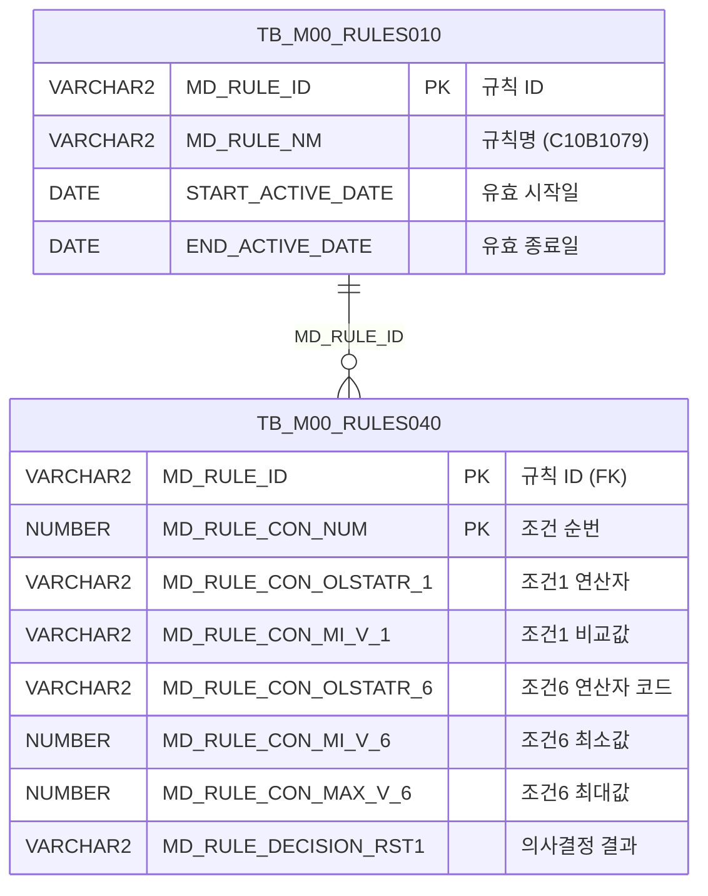

<h1 style="font-size: 40px; text-align: center; font-weight:
   bold; margin: 30px 0;">
  C107000030tab15 레거시 시스템 분석 종합 보고서
</h1>


# 1. 시스템 개요
- **서비스 ID**: C107000030tab15
- **업무명**: 정전폭마진량 (Rules Engine 조건 조회)
- **분석 일시**: 2026-03-17 10:54 KST
- **분석 시간**: 약 5분
- **전체 Activity 수**: 2 (built-in)
- **분석자**: Claude Opus 4.6
- **분석 도구**: /analyze-service C107000030tab15
- **문서 버전**: 1.0

# 📊 비즈니스 프로세스 분석

## 시스템 목적

C107000030tab15는 C10 모듈의 규칙 엔진(Rules Engine) 기반 **정전폭마진량** 조건 및 의사결정 결과를 조회하는 화면이다. 부모 탭 화면 C107000030의 15번째 탭으로 구성되어 있다.

규칙 ID `C10B1079`에 등록된 의사결정 규칙의 조건-결과 매핑 데이터를 조회하여, 주문 Edge, 품명코드, 제품형태, 코팅방식, 수지타입, 두께범위 등 6가지 조건 기준과 그에 따른 폭감소량(결과값)을 그리드로 표시한다. 이 데이터는 생산 계획 수립 시 제품 폭 방향의 마진량을 결정하는 기준으로 활용된다.

조회 전용 화면으로 데이터 수정 기능은 없으며, 부모 탭(C107000030)의 검색 폼을 공유하여 조건 없이 규칙 전체를 자동 조회한다.

## 주요 유즈케이스

### UC-01: 정전폭마진량 규칙 조회
- **Actor**: 생산 관리자 / 스케줄 담당자
- **목적**: C10B1079 규칙에 등록된 정전폭마진량 의사결정 조건과 결과값을 확인하여 폭 방향 마진 기준을 파악

- **전제조건**:
  - 사용자가 시스템에 로그인되어 있음
  - C107000030 화면의 tab15 탭이 활성화됨
  - TB_M00_RULES010에 C10B1079 규칙이 유효 기간 내로 등록되어 있음

- **주요 흐름**:
  1. 사용자가 C107000030 화면에서 tab15(정전폭마진량) 탭 클릭
  2. 탭 로드 시 `onLoadGrid` 이벤트로 자동 조회 실행
  3. `uiCommon.parameters4('C107000030_Form_1', 'C107000030tab15_Grid_1', 'find')` 호출
  4. C107000030tab15.select 쿼리 실행 — TB_M00_RULES010에서 C10B1079 규칙 ID 조회 후 TB_M00_RULES040과 조인
  5. 6개 조건(주문Edge, 품명코드, 제품형태, 코팅방식, 수지타입, 두께범위)과 폭감소량 결과를 Grid에 표시

- **대체 흐름**:
  - C10B1079 규칙이 유효 기간 밖인 경우: 조회 결과 없음
  - 규칙 조건 데이터 미등록 시: 빈 그리드 표시

- **후행조건**:
  - 조회된 규칙 데이터가 Grid에 표시됨
  - 사용자가 조건별 폭감소량 기준을 확인할 수 있음

### UC-02: 그리드 데이터 활용 (엑셀 내보내기/필터링)
- **Actor**: 생산 관리자
- **목적**: 조회된 규칙 데이터를 엑셀로 내보내거나 필터링하여 특정 조건의 폭감소량 확인

- **전제조건**:
  - Grid에 데이터가 조회된 상태

- **주요 흐름**:
  1. Grid 우클릭으로 컨텍스트 메뉴 표시
  2. 엑셀 내보내기(excel_grid) 선택 시 `/gridexcel` URL로 엑셀 파일 생성
  3. 또는 헤더 필터(filter_grid) 활성화 후 텍스트/숫자 필터로 특정 조건 검색
  4. 컬럼 이동(move_grid)으로 화면 재배치 가능

- **대체 흐름**:
  - 편집 모드(editable_grid) 활성화 가능하나 서비스에 저장 로직 없음

- **후행조건**:
  - 필터링된 결과 또는 엑셀 파일 획득

### UC-03: 연산자 기호 확인
- **Actor**: 생산 관리자
- **목적**: 두께범위 조건(CON6)의 연산자 코드를 이해 가능한 기호로 변환하여 범위 조건의 의미 파악

- **전제조건**:
  - 규칙 데이터에 BETWEEN 계열 연산자 코드가 등록됨

- **주요 흐름**:
  1. 조회 시 CON6 컬럼에 대해 `FUNC_GET_YEONSAN` 함수 자동 호출
  2. BETWEEN1 → `<=값<=`, BETWEEN2 → `<=값<`, BETWEEN3 → `<값<=`, BETWEEN4 → `<값<` 변환
  3. 변환된 연산 기호가 Grid의 CON6 컬럼에 표시
  4. MIN6, MAX6 컬럼과 함께 두께 범위 조건의 상한/하한 확인

- **대체 흐름**:
  - 매핑되지 않은 연산자 코드: 원본 코드 그대로 표시

- **후행조건**:
  - 사용자가 두께범위 조건의 정확한 경계 포함 여부를 확인할 수 있음

---
## 비즈니스 로직 상세

### 1. 연산자 코드 → 연산 기호 변환 (FUNC_GET_YEONSAN)

- **목적**: Rules Engine의 조건 연산자 코드(BETWEEN1~BETWEEN4)를 화면에 표시 가능한 수학적 부등호 기호로 변환하여 사용자가 범위 조건의 의미를 직관적으로 파악할 수 있게 함

- **처리 케이스**:

  **[케이스 1: 양쪽 포함 범위]**
  ```
    조건: 연산자 코드 = 'BETWEEN1'
    처리:
      1. 입력값을 UPPER()로 대문자 변환
      2. '<=값<=' 문자열 반환
      3. 의미: 최소값 이상 AND 최대값 이하 (MIN6 ≤ X ≤ MAX6)
  ```

  **[케이스 2: 하한 포함, 상한 미포함]**
  ```
    조건: 연산자 코드 = 'BETWEEN2'
    처리:
      1. 입력값을 UPPER()로 대문자 변환
      2. '<=값<' 문자열 반환
      3. 의미: 최소값 이상 AND 최대값 미만 (MIN6 ≤ X < MAX6)
  ```

  **[케이스 3: 하한 미포함, 상한 포함]**
  ```
    조건: 연산자 코드 = 'BETWEEN3'
    처리:
      1. 입력값을 UPPER()로 대문자 변환
      2. '<값<=' 문자열 반환
      3. 의미: 최소값 초과 AND 최대값 이하 (MIN6 < X ≤ MAX6)
  ```

  **[케이스 4: 양쪽 미포함]**
  ```
    조건: 연산자 코드 = 'BETWEEN4'
    처리:
      1. 입력값을 UPPER()로 대문자 변환
      2. '<값<' 문자열 반환
      3. 의미: 최소값 초과 AND 최대값 미만 (MIN6 < X < MAX6)
  ```

  **[케이스 5: 기타 연산자]**
  ```
    조건: 위 4개 코드에 해당하지 않는 값
    처리:
      1. 입력값을 그대로 반환 (변환 없음)
      2. 예외 발생 시 NULL 반환
  ```

### 2. Rules Engine 기반 다조건 의사결정 조회

- **목적**: C10B1079 규칙의 6가지 조건 조합에 따른 폭감소량 의사결정 결과를 조회

- **처리 케이스**:

  **[케이스 1: 활성 규칙 필터링]**
  ```
    조건: TB_M00_RULES010에서 MD_RULE_NM = 'C10B1079'
    처리:
      1. START_ACTIVE_DATE <= SYSDATE < END_ACTIVE_DATE 범위 확인
      2. 유효 기간 내 규칙의 MD_RULE_ID 추출
      3. TB_M00_RULES040과 MD_RULE_ID로 조인
  ```

  **[케이스 2: 조건 컬럼 매핑]**
  ```
    처리:
      1. CON1(주문Edge): MD_RULE_CON_OLSTATR_1 (연산자 코드)
      2. MIN1(주문Edge 비교값): MD_RULE_CON_MI_V_1
      3. CON2(품명코드): MD_RULE_CON_OLSTATR_2
      4. MIN2(품명코드 비교값): MD_RULE_CON_MI_V_2
      5. CON3(제품형태): MD_RULE_CON_OLSTATR_3
      6. MIN3(제품형태 비교값): MD_RULE_CON_MI_V_3
      7. CON4(코팅방식): MD_RULE_CON_OLSTATR_4
      8. MIN4(코팅방식 비교값): MD_RULE_CON_MI_V_4
      9. CON5(수지타입): MD_RULE_CON_OLSTATR_5
      10. MIN5(수지타입 비교값): MD_RULE_CON_MI_V_5
      11. CON6(두께범위): FUNC_GET_YEONSAN(UPPER(MD_RULE_CON_OLSTATR_6)) → 연산 기호 변환
      12. MIN6(두께 최소값): MD_RULE_CON_MI_V_6
      13. MAX6(두께 최대값): MD_RULE_CON_MAX_V_6
      14. RST1(폭감소량 결과): MD_RULE_DECISION_RST1
  ```

---

# 💾 데이터 요구사항

## 핵심 테이블

### 1. TB_M00_RULES010 - (Rules Engine 규칙 마스터)
| 컬럼명 | 타입 | PK | 설명 |
|--------|------|----|------|
| MD_RULE_ID | VARCHAR2 | ✅ | 규칙 ID (PK) |
| MD_RULE_NM | VARCHAR2 |  | 규칙명 (예: C10B1079) |
| START_ACTIVE_DATE | DATE |  | 유효 시작일 |
| END_ACTIVE_DATE | DATE |  | 유효 종료일 |

### 2. TB_M00_RULES040 - (Rules Engine 조건-결과 매핑)
| 컬럼명 | 타입 | PK | 설명 |
|--------|------|----|------|
| MD_RULE_ID | VARCHAR2 | ✅ | 규칙 ID (FK → RULES010) |
| MD_RULE_CON_NUM | NUMBER | ✅ | 조건 순번 (SEQ) |
| MD_RULE_CON_OLSTATR_1 | VARCHAR2 |  | 조건1 연산자 (주문Edge) |
| MD_RULE_CON_MI_V_1 | VARCHAR2 |  | 조건1 비교값 (주문Edge) |
| MD_RULE_CON_OLSTATR_2 | VARCHAR2 |  | 조건2 연산자 (품명코드) |
| MD_RULE_CON_MI_V_2 | VARCHAR2 |  | 조건2 비교값 (품명코드) |
| MD_RULE_CON_OLSTATR_3 | VARCHAR2 |  | 조건3 연산자 (제품형태) |
| MD_RULE_CON_MI_V_3 | VARCHAR2 |  | 조건3 비교값 (제품형태) |
| MD_RULE_CON_OLSTATR_4 | VARCHAR2 |  | 조건4 연산자 (코팅방식) |
| MD_RULE_CON_MI_V_4 | VARCHAR2 |  | 조건4 비교값 (코팅방식) |
| MD_RULE_CON_OLSTATR_5 | VARCHAR2 |  | 조건5 연산자 (수지타입) |
| MD_RULE_CON_MI_V_5 | VARCHAR2 |  | 조건5 비교값 (수지타입) |
| MD_RULE_CON_OLSTATR_6 | VARCHAR2 |  | 조건6 연산자 코드 (두께범위, BETWEEN1~4) |
| MD_RULE_CON_MI_V_6 | NUMBER |  | 조건6 최소값 (두께 하한) |
| MD_RULE_CON_MAX_V_6 | NUMBER |  | 조건6 최대값 (두께 상한) |
| MD_RULE_DECISION_RST1 | VARCHAR2 |  | 의사결정 결과1 (폭감소량) |

## 데이터 플로우

### 1. 조회

```
[탭 로딩 시 자동 조회 — 정전폭마진량 규칙]
탭 활성화 (onLoadGrid 이벤트)
→ C107000030tab15.select
  FROM M00APUSER.TB_M00_RULES040 RULES040
  INNER JOIN (
    SELECT MD_RULE_ID
    FROM M00APUSER.TB_M00_RULES010
    WHERE MD_RULE_NM = 'C10B1079'
      AND START_ACTIVE_DATE <= SYSDATE
      AND SYSDATE < END_ACTIVE_DATE
  ) RULES010 ON RULES010.MD_RULE_ID = RULES040.MD_RULE_ID
→ CON6 컬럼: FUNC_GET_YEONSAN(UPPER(MD_RULE_CON_OLSTATR_6)) 함수 호출로 연산 기호 변환
→ Grid에 SEQ, CON1~CON6, MIN1~MIN6, MAX6, RST1 표시
```

## SQL 일람표

| SQL 이름 | 쿼리 ID | 타입 | 출처 | 테이블 |
|---------|---------|-----|-------|-------|
| 정전폭마진량 규칙 조회 | C107000030tab15.select | SELECT | Service | TB_M00_RULES040, TB_M00_RULES010 |

## PL/SQL 함수/프로시저

| # | 호출명 | 유형 | 용도 | 상세 분석 |
|---|--------|------|------|----------|
| 1 | FUNC_GET_YEONSAN | 스탠드얼론 함수 | 연산자 코드(BETWEEN1~4)를 연산 기호(<=값<= 등)로 변환 | [분석 보고서](../../../dbms/M00APUSER/function/FUNC_GET_YEONSAN_analysis_report.md) |

## ER 다이어그램 (핵심 관계)



관계 설명:
- **TB_M00_RULES010**이 규칙 마스터 테이블로 규칙 ID/명칭/유효기간 관리
- **TB_M00_RULES040**이 조건-결과 매핑 테이블로 MD_RULE_ID 기반 1:N 관계
- M00APUSER 스키마의 공통 Rules Engine 테이블을 MES C10 모듈에서 참조하는 구조

---

# 🖥️ 사용자 인터페이스 요구사항

## 화면 레이아웃 상세

### Layout 구조 (Absolute 배치)
```javascript
{
  layoutType: "absolute",
  components: [
    {
      id: "C107000030tab15_Grid_1",
      type: "grid",
      position: { left: 0, top: 0, width: 976, height: 492 }
    },
    {
      id: "C107000030tab15_Form_1",
      type: "form",
      position: { left: 0, top: 450, width: 282, height: 30 },
      note: "빈 폼 — 부모 탭(C107000030_Form_1) 공유"
    },
    {
      id: "C107000030tab15_messagebox",
      type: "messagebox",
      position: { left: 0, top: 493, width: 976, height: 18 }
    }
  ]
}
```

## 입출력 요소

### Form 컴포넌트
**C107000030tab15_Form_1**
- 빈 폼 (XML 내용 없음)
- 실제 조회 조건은 부모 탭 `C107000030_Form_1`을 공유하여 사용
- `uiCommon.parameters4('C107000030_Form_1', ...)` 호출로 부모 폼 파라미터 참조

### Grid 컴포넌트

**C107000030tab15_Grid_1 (정전폭마진량 규칙 목록)**
- 편집 가능 여부: 아니오 (읽기 전용, 전 컬럼 ro/ron)
- Split: 0 (고정 컬럼 없음)
- 다중 행 헤더: 3단 구조
- 컨텍스트 메뉴: 활성화 (컬럼 이동, 필터, 편집 모드, 엑셀 내보내기)
- 스마트 렌더링: 활성화 (rowCnt=17)
- 주요 컬럼 (15개):

  **기본 정보**:
  - SEQ: ro - 조건 순번 (4%, 우측정렬)

  **주문Edge 그룹**:
  - CON1: ro - 조건1 연산자 (5%, 중앙정렬)
  - MIN1: ro - 조건1 비교값 (6%, 좌측정렬)

  **품명코드 그룹**:
  - CON2: ro - 조건2 연산자 (5%, 중앙정렬)
  - MIN2: ro - 조건2 비교값 (8%, 중앙정렬)

  **제품형태 그룹**:
  - CON3: ro - 조건3 연산자 (10%, 중앙정렬)
  - MIN3: ro - 조건3 비교값 (6%, 중앙정렬)

  **코팅방식 그룹**:
  - CON4: ro - 조건4 연산자 (10%, 중앙정렬)
  - MIN4: ro - 조건4 비교값 (6%, 중앙정렬)

  **수지타입 그룹**:
  - CON5: ro - 조건5 연산자 (10%, 중앙정렬)
  - MIN5: ro - 조건5 비교값 (5%, 중앙정렬)

  **두께범위 그룹**:
  - CON6: ro - 조건6 연산 기호 (10%, 중앙정렬, FUNC_GET_YEONSAN 변환 결과)
  - MIN6: ron - 조건6 최소값 (5%, 중앙정렬, 숫자 형식 0000.0)
  - MAX6: ron - 조건6 최대값 (5%, 중앙정렬, 숫자 형식 0000.0)

  **결과**:
  - RST1: ro - 폭감소량 결과 (*, 중앙정렬)

## 화면 동작 흐름

### 1. 화면 초기 로딩 (탭 활성화)
```
1. 부모 화면 C107000030에서 tab15 탭 클릭
2. C107000030tab15.jsp 로드
3. ui.initializeDHTMLX() 호출 — DHTMLX 컴포넌트 초기화
4. items['C107000030tab15_Grid_1'].onXLEEvent(onLoadGrid) 이벤트 등록
5. Grid XML 로드 완료 시 onLoadGrid() 자동 호출
6. uiCommon.parameters4('C107000030_Form_1', 'C107000030tab15_Grid_1', 'find') 호출
7. handleDataProcess.do → C107000030tab15-service → C107000030tab15.select 실행
8. Grid에 규칙 데이터 표시
9. onXLE 이벤트 detach (1회만 실행)
```

### 2. 수동 조회 (부모 폼 find 버튼)
```
1. 부모 탭(C107000030)의 조회 버튼 클릭
2. find(eventName, formDivObj, referenceItem) 호출
3. uiCommon.parameters4('C107000030_Form_1', 'C107000030tab15_Grid_1', customparam + eventName)
4. items['C107000030tab15_Grid_1'].loadData(findUrl) 실행
5. Grid 데이터 갱신
```

### 3. 컨텍스트 메뉴 기능
```
1. Grid 우클릭 → 컨텍스트 메뉴 표시
2. 메뉴 항목 선택:
   - move_grid: 컬럼 드래그 이동 활성화/비활성화
   - filter_grid: 헤더 필터 메뉴 활성화
   - editable_grid: 편집 모드 토글 (setEditable)
   - excel_grid: gridexcel URL로 엑셀 내보내기
3. 체크박스 상태(isChecked)로 토글 동작
```

## JavaScript 모듈

**C107000030tab15.jsp** (인라인 스크립트)
- find(eventName, formDivObj, referenceItem): 조회 기능 (uiCommon.parameters4로 부모 폼 파라미터 구성 → Grid loadData)
- add(referenceItem): 신규 행 추가 (items[referenceItem].addRow())
- remove(referenceItem): 행 삭제 (items[referenceItem].removeRow())
- copy(referenceItem): 클립보드 복사 (items[referenceItem].copyRowContent())
- undo(referenceItem): 실행 취소 (items[referenceItem].undo())
- redo(referenceItem): 다시 실행 (items[referenceItem].redo())
- onGridContextMenuClick(id, gridObj, menuObj): 컨텍스트 메뉴 처리 (컬럼 이동/필터/편집/엑셀)
- findMessage(referenceItem): 메시지박스 표시 (uiCommon.message 호출)
- onLoadGrid(): 초기 로드 시 자동 조회 실행 후 onXLE 이벤트 detach

**c10.ui.js** (공통 스크립트)
- C10 모듈 공통 UI 유틸리티 (외부 참조)

## 주요 이벤트 핸들러

**onLoadGrid (Grid 초기 로드)**
- 이벤트 타입: onXLE (Grid XML Load End)
- 처리 내용:
  1. uiCommon.parameters4로 부모 폼 파라미터 구성
  2. Grid loadData로 C107000030tab15-service 호출
  3. onXLE 이벤트 detach (중복 호출 방지)

**find (조회 버튼 클릭)**
- 이벤트 타입: Form find button click
- 처리 내용:
  1. customparam 빈 문자열 초기화
  2. uiCommon.parameters4('C107000030_Form_1', 'C107000030tab15_Grid_1', customparam + eventName)
  3. Grid loadData 호출

**onGridContextMenuClick (컨텍스트 메뉴)**
- 이벤트 타입: Grid 우클릭 메뉴 항목 선택
- 처리 내용:
  1. 메뉴 ID별 분기 (move_grid, filter_grid, editable_grid, excel_grid)
  2. 체크박스 상태 확인 (getCheckboxState)
  3. 해당 기능 활성화/비활성화 토글

---

# 📌 특이사항 및 주의사항

## 1. 부모 탭 폼 참조 구조
- **부모 폼 공유**: `C107000030tab15_Form_1` XML은 빈 파일이며, 실제 조회 파라미터는 부모 탭의 `C107000030_Form_1`을 직접 참조한다. `uiCommon.parameters4('C107000030_Form_1', ...)` 호출로 확인됨. 현대화 시 탭 간 의존관계를 명확히 관리해야 한다.

## 2. Rules Engine 간접 참조 패턴
- **규칙명 하드코딩**: SQL에서 `MD_RULE_NM='C10B1079'`로 규칙명을 직접 문자열 비교한다. 규칙명이 변경되면 쿼리 수정이 필요하다. 또한 서브쿼리를 인라인 뷰로 사용하여 RULES010-RULES040 조인하는 패턴은 M00 모듈의 공통 Rules Engine 활용 방식이다.

## 3. 유효기간 기반 규칙 필터링
- **시간 범위 조건**: `START_ACTIVE_DATE <= SYSDATE AND SYSDATE < END_ACTIVE_DATE`로 현재 유효한 규칙만 조회한다. 종료일은 미포함(`<`)이므로, 규칙 교체 시 종료일과 시작일이 같은 날짜로 설정하면 하루 동안 두 규칙이 동시 활성화될 수 있다.

## 4. FUNC_GET_YEONSAN 함수 호출 위치
- **CON6 컬럼에만 적용**: 6개 조건 중 CON6(두께범위)에만 `FUNC_GET_YEONSAN` 함수를 적용하고, CON1~CON5는 원본 연산자 코드를 그대로 표시한다. 이는 CON1~CON5의 연산자가 단순 비교(=, LIKE 등)인 반면, CON6만 BETWEEN 계열의 범위 연산을 사용하기 때문이다.

## 5. messagebox XML 미존재 가능성
- **런타임 오류 위험**: `C107000030tab15_messagebox.xml` 파일이 `header/kr/C107000030tab15/` 폴더에 존재하지 않을 수 있음. `findMessage` 함수에서 `uiCommon.message`를 호출하나, XML 미존재 시 상태바 표시가 동작하지 않을 수 있다.

## 6. 편집/저장 기능 불일치
- **저장 서비스 미구현**: add, remove 함수가 정의되어 있고 컨텍스트 메뉴에서 editable_grid 토글이 가능하나, 서비스 XML에는 조회(FormSearch) Activity만 존재한다. 저장 로직이 없으므로 편집된 데이터는 서버에 반영되지 않는다. 이는 GLUE 프레임워크 템플릿에서 자동 생성된 코드로 추정된다.

---

# 📚 참고 문서

- **Query SQL**: `src/query/C107000030tab15-query.glue_sql`
- **Service XML**: `src/service/C107000030tab15-service.xml`
- **JS**: `WebContents/C107000030tab15.jsp` (인라인 스크립트), `WebContents/js/c10.ui.js`
- **PL/SQL**: `docs/analysis/dbms/M00APUSER/function/FUNC_GET_YEONSAN_analysis_report.md`
