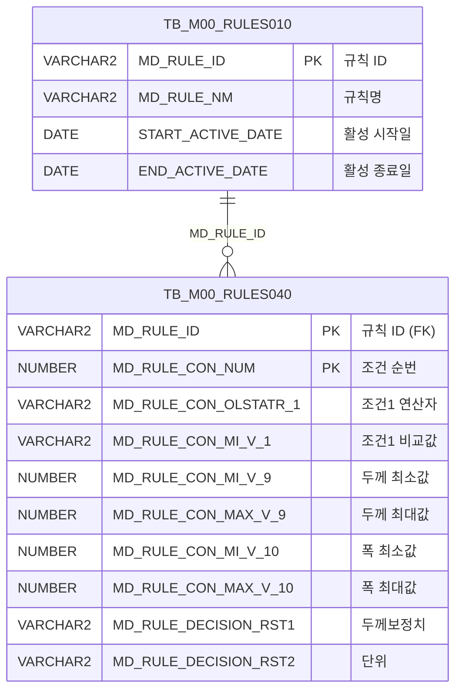

<h1 style="font-size: 40px; text-align: center; font-weight:
   bold; margin: 30px 0;">
  C107000030tab16 레거시 시스템 분석 종합 보고서
</h1>


# 1. 시스템 개요
- **서비스 ID**: C107000030tab16
- **업무명**: 압연두께 Set치 보정 규칙 조회 (탭16)
- **분석 일시**: 2026-03-17 10:54 (KST)
- **분석 시간**: 약 5분
- **전체 Activity 수**: 2개 (Built-in)
- **분석자**: Claude Opus 4.6 / Claude Sonnet 4.6
- **분석 도구**: /analyze-service C107000030tab16
- **문서 버전**: 1.0

# 📊 비즈니스 프로세스 분석

## 시스템 목적

본 서비스는 C10(압연) 모듈의 두께 Set치 보정 규칙을 조회하는 화면으로, 부모 화면 C107000030의 탭16에 해당한다. 의사결정 테이블(MDT, Master Decision Table) 기반의 규칙 엔진 데이터를 조회하여, 제품의 품명·규격기관·규격약호·주문용도·고객사·두께구분·관리코드·도금량·두께범위·폭범위 등 10개 조건과 2개 의사결정 결과(두께보정치, 단위)를 표시한다.

압연 공정에서 제품 두께를 목표치에 맞추기 위해 조건별 보정값을 사전에 정의해두고, 이를 조회하여 작업에 반영하는 것이 핵심 목적이다. 규칙 ID는 `C10B2060`으로 고정되어 있으며, 활성 기간(START_ACTIVE_DATE ~ END_ACTIVE_DATE) 내의 규칙만 조회된다.

<!-- 단순 조회 서비스: Custom Activity 0개, SELECT 쿼리만 사용, Router → FormSearch 단순 체인 → 워크플로우 다이어그램 생략 -->

## 주요 유즈케이스

### UC-01: 두께 Set치 보정 규칙 조회
- **Actor**: 압연 공정 오퍼레이터 / 공정기술 담당자
- **목적**: C10B2060 규칙의 조건별 두께 보정값을 조회하여 압연 작업 시 적용할 보정치를 확인

- **전제조건**:
  - 부모 화면(C107000030)에 접속한 상태
  - TB_M00_RULES010에 C10B2060 규칙이 등록되어 있고 활성 기간 내에 있음
  - TB_M00_RULES040에 해당 규칙의 조건-결과 매핑 데이터가 존재

- **주요 흐름**:
  1. 사용자가 부모 화면(C107000030)의 탭바에서 "압연두께Set치보정" 탭(tab16) 선택
  2. 탭 진입 시 onLoadGrid 이벤트에 의해 자동 조회 실행
  3. 부모 폼(C107000030_Form_1)의 파라미터를 사용하여 C107000030tab16.select 쿼리 호출
  4. TB_M00_RULES010에서 C10B2060 규칙 ID를 조회하고, TB_M00_RULES040과 조인하여 10개 조건 및 2개 결과값 반환
  5. 조건 9, 10의 연산자는 FUNC_GET_YEONSAN 함수를 통해 연산자 기호로 변환하여 표시
  6. Grid에 규칙 데이터가 표시됨 (읽기 전용)

- **대체 흐름**:
  - C10B2060 규칙이 활성 기간을 벗어난 경우: 빈 결과 반환
  - 조건 컬럼이 NULL인 경우: 해당 셀이 비어있는 상태로 표시

- **후행조건**:
  - Grid에 규칙 조건-결과 매핑 데이터가 표시됨
  - 사용자가 컨텍스트 메뉴를 통해 엑셀 다운로드 가능

### UC-02: 규칙 데이터 필터링
- **Actor**: 압연 공정 오퍼레이터 / 공정기술 담당자
- **목적**: 다수의 규칙 행 중 특정 조건에 해당하는 행만 필터링하여 확인

- **전제조건**:
  - UC-01이 완료되어 Grid에 데이터가 표시된 상태

- **주요 흐름**:
  1. Grid 3단계 멀티 헤더의 3번째 행(필터행)에서 텍스트/숫자 필터 입력
  2. 규격기관, 규격약호, 주문용도, 고객사, 두께구분, 관리코드, 도금량에 대해 텍스트 필터 적용
  3. 두께범위(MIN9/MAX9), 폭범위(MIN10/MAX10)에 대해 숫자 필터 적용
  4. 필터 조건에 맞는 행만 Grid에 표시

- **대체 흐름**:
  - 필터 조건에 맞는 데이터가 없는 경우: 빈 Grid 표시

- **후행조건**:
  - 필터링된 데이터만 Grid에 표시됨

### UC-03: 엑셀 다운로드
- **Actor**: 압연 공정 오퍼레이터 / 공정기술 담당자
- **목적**: 조회된 규칙 데이터를 엑셀 파일로 다운로드하여 오프라인 활용

- **전제조건**:
  - UC-01이 완료되어 Grid에 데이터가 표시된 상태

- **주요 흐름**:
  1. Grid 영역에서 마우스 우클릭하여 컨텍스트 메뉴 표시
  2. "엑셀다운" 메뉴 선택
  3. onGridContextMenuClick 핸들러에서 excel_grid 분기 처리
  4. Grid 데이터가 엑셀 파일로 변환 및 다운로드

- **대체 흐름**:
  - 데이터가 없는 경우: 빈 엑셀 파일 생성

- **후행조건**:
  - 엑셀 파일이 사용자 로컬에 다운로드됨

---
## 비즈니스 로직 상세

### 1. 의사결정 테이블(MDT) 규칙 조회 로직

- **목적**: C10B2060 규칙 ID에 해당하는 의사결정 테이블의 조건-결과 매핑을 조회하여 압연 두께 보정에 필요한 데이터를 제공
- **처리 케이스**:

  **[케이스 1: 활성 규칙 필터링]**
  ```
    조건: TB_M00_RULES010에서 MD_RULE_NM = 'C10B2060'이고 현재 시각이 활성 기간 내
    처리:
      1. TB_M00_RULES010에서 MD_RULE_NM = 'C10B2060' 조건으로 MD_RULE_ID 조회
      2. START_ACTIVE_DATE <= SYSDATE AND SYSDATE < END_ACTIVE_DATE 조건으로 활성 규칙만 필터
      3. 조회된 MD_RULE_ID로 TB_M00_RULES040과 조인
  ```

  **[케이스 2: 조건 1~8 (직접값 표시)]**
  ```
    조건: 조건 컬럼 1~8은 별도 변환 없이 원본값 표시
    처리:
      1. MD_RULE_CON_OLSTATR_N → CONN (연산자)로 매핑
      2. MD_RULE_CON_MI_V_N → MINN (비교값)으로 매핑
      3. N = 1~8까지 반복
  ```

  **[케이스 3: 조건 9~10 (함수 변환 표시)]**
  ```
    조건: 조건 9(두께범위)와 조건 10(폭범위)은 연산자를 FUNC_GET_YEONSAN 함수로 변환
    처리:
      1. MD_RULE_CON_OLSTATR_9/10 값을 UPPER()로 대문자 변환
      2. M00APUSER.FUNC_GET_YEONSAN() 함수 호출하여 연산자 기호 변환
      3. 조건 9: MIN9(0.000 포맷) + MAX9(0.000 포맷) 범위값 포함
      4. 조건 10: MIN10(0000.0 포맷) + MAX10(0000.0 포맷) 범위값 포함
  ```

### 2. FUNC_GET_YEONSAN 함수 (연산자 변환)

- **목적**: 의사결정 테이블의 연산자 코드(영문 약어)를 사람이 읽을 수 있는 연산자 기호로 변환
- **스키마**: M00APUSER
- **처리 케이스**:

  **[연산자 변환 규칙]**
  ```
    입력: 영문 연산자 코드 (대문자 변환 후)
    처리: 코드 → 기호 변환 (예: 'GE' → '>=', 'LE' → '<=' 등)
    출력: 연산자 기호 문자열
  ```

- 📎 **[상세 분석 보고서](../../../dbms/M00APUSER/function/FUNC_GET_YEONSAN_analysis_report.md)**

---

# 💾 데이터 요구사항

## 핵심 테이블

### 1. TB_M00_RULES010 - (의사결정 규칙 마스터)
| 컬럼명 | 타입 | PK | 설명 |
|--------|------|----|-----|
| MD_RULE_ID | VARCHAR2 | ✅ | 규칙 ID (PK) |
| MD_RULE_NM | VARCHAR2 | | 규칙명 (예: 'C10B2060') |
| START_ACTIVE_DATE | DATE | | 활성 시작일 |
| END_ACTIVE_DATE | DATE | | 활성 종료일 |

### 2. TB_M00_RULES040 - (의사결정 규칙 조건-결과 매핑)
| 컬럼명 | 타입 | PK | 설명 |
|--------|------|----|-----|
| MD_RULE_ID | VARCHAR2 | ✅ | 규칙 ID (FK → RULES010) |
| MD_RULE_CON_NUM | NUMBER | ✅ | 조건 순번 (SEQ) |
| MD_RULE_CON_OLSTATR_1 ~ _10 | VARCHAR2 | | 조건 1~10 연산자 |
| MD_RULE_CON_MI_V_1 ~ _8 | VARCHAR2 | | 조건 1~8 비교값 |
| MD_RULE_CON_MI_V_9 | NUMBER | | 조건 9 최소값 (두께범위) |
| MD_RULE_CON_MAX_V_9 | NUMBER | | 조건 9 최대값 (두께범위) |
| MD_RULE_CON_MI_V_10 | NUMBER | | 조건 10 최소값 (폭범위) |
| MD_RULE_CON_MAX_V_10 | NUMBER | | 조건 10 최대값 (폭범위) |
| MD_RULE_DECISION_RST1 | VARCHAR2 | | 의사결정 결과 1 (두께보정치) |
| MD_RULE_DECISION_RST2 | VARCHAR2 | | 의사결정 결과 2 (단위) |

## 데이터 플로우

### 1. 조회
```
[두께 Set치 보정 규칙 조회]
화면 탭 진입 (자동 조회)
→ C107000030tab16.select
  FROM M00APUSER.TB_M00_RULES040 RULES040
  INNER JOIN (SELECT MD_RULE_ID FROM M00APUSER.TB_M00_RULES010
              WHERE MD_RULE_NM='C10B2060'
              AND START_ACTIVE_DATE <= SYSDATE
              AND SYSDATE < END_ACTIVE_DATE) RULES010
    ON RULES010.MD_RULE_ID = RULES040.MD_RULE_ID
  - 조건 1~8: 연산자 + 비교값 직접 조회
  - 조건 9~10: FUNC_GET_YEONSAN()으로 연산자 변환 + MIN/MAX 범위값 조회
  - 결과: RST1(두께보정치), RST2(단위)
→ Grid에 규칙 목록 표시 (읽기 전용)
```

## SQL 일람표

| SQL 이름 | 쿼리 ID | 타입 | 출처 | 테이블 |
|---------|---------|-----|-------|-------|
| 두께보정 규칙 조회 | C107000030tab16.select | SELECT | Service | TB_M00_RULES040, TB_M00_RULES010 |

## PL/SQL 함수/프로시저

| # | 호출명 | 유형 | 용도 | 상세 분석 |
|---|--------|------|------|----------|
| 1 | FUNC_GET_YEONSAN | 함수 | 연산자 코드 → 기호 변환 | [분석 보고서](../../../dbms/M00APUSER/function/FUNC_GET_YEONSAN_analysis_report.md) |

## ER 다이어그램 (핵심 관계)



관계 설명:
- TB_M00_RULES010이 규칙 마스터로, 규칙명과 활성 기간을 관리
- TB_M00_RULES040이 규칙의 조건-결과 매핑을 저장하며, MD_RULE_ID로 1:N 관계
- 하나의 규칙(C10B2060)에 대해 다수의 조건 행(MD_RULE_CON_NUM)이 존재

---

# 🖥️ 사용자 인터페이스 요구사항

## 화면 레이아웃 상세

### Layout 구조
```javascript
{
  itemType: "flat",
  description: "레이아웃 컨테이너 없이 div 기반 절대 좌표 배치",
  components: [
    {
      id: "C107000030tab16_Grid_1",
      type: "grid",
      position: { left: 0, top: 0, width: 976, height: 492 }
    },
    {
      id: "C107000030tab16_messagebox",
      type: "messagebox",
      position: { left: 0, top: 493, width: 976, height: 18 }
    },
    {
      id: "C107000030tab16_Form_1",
      type: "form",
      position: { left: 0, top: 450, width: 282, height: 30 }
    }
  ]
}
```

## 입출력 요소

### Form 컴포넌트
**C107000030tab16_Form_1**
- Form XML이 빈 `<items/>` — 실질적 검색 조건은 부모 화면(C107000030_Form_1)에서 상속
- 조회 파라미터는 부모 폼의 필드를 참조하여 서비스 호출 시 전달

### Grid 컴포넌트

**C107000030tab16_Grid_1 (두께보정 규칙 목록)**
- 편집 가능 여부: 아니오 (전체 읽기 전용)
- Split: 없음 (고정 컬럼 0개)
- 멀티 헤더: 3단계 (대분류 → 연산/비교값 → 필터행)
- 컨텍스트 메뉴: 컬럼이동, 헤더필터, 편집모드, 엑셀다운로드
- 주요 컬럼 (25개):

  **순번**:
  - SEQ: ro - 조건 순번 (4%, 우측정렬)

  **조건1 - 품명**:
  - CON1: ro - 연산자 (9%, 중앙정렬)
  - MIN1: ro - 비교값 (6%, 좌측정렬)

  **조건2 - 규격기관**:
  - CON2: ro - 연산자 (9%, 중앙정렬, 텍스트 필터)
  - MIN2: ro - 비교값 (8%, 중앙정렬)

  **조건3 - 규격약호**:
  - CON3: ro - 연산자 (9%, 중앙정렬, 텍스트 필터)
  - MIN3: ro - 비교값 (6%, 중앙정렬)

  **조건4 - 주문용도**:
  - CON4: ro - 연산자 (9%, 중앙정렬, 텍스트 필터)
  - MIN4: ro - 비교값 (6%, 중앙정렬)

  **조건5 - 고객사**:
  - CON5: ro - 연산자 (9%, 중앙정렬, 텍스트 필터)
  - MIN5: ro - 비교값 (5%, 중앙정렬)

  **조건6 - 주문두께구분**:
  - CON6: ro - 연산자 (9%, 중앙정렬, 텍스트 필터)
  - MIN6: ro - 비교값 (5%, 중앙정렬)

  **조건7 - 두께관리코드**:
  - CON7: ro - 연산자 (9%, 중앙정렬, 텍스트 필터)
  - MIN7: ro - 비교값 (5%, 중앙정렬)

  **조건8 - 도금량코드**:
  - CON8: ro - 연산자 (9%, 중앙정렬, 텍스트 필터)
  - MIN8: ro - 비교값 (5%, 중앙정렬)

  **조건9 - 두께범위**:
  - CON9: ro - 연산자 (10%, 중앙정렬, FUNC_GET_YEONSAN 변환)
  - MIN9: ron - 최소값 (5%, 중앙정렬, 포맷 0.000, 숫자 필터)
  - MAX9: ron - 최대값 (5%, 중앙정렬, 포맷 0.000)

  **조건10 - 폭범위**:
  - CON10: ro - 연산자 (10%, 중앙정렬, FUNC_GET_YEONSAN 변환)
  - MIN10: ron - 최소값 (5%, 중앙정렬, 포맷 0000.0, 숫자 필터)
  - MAX10: ron - 최대값 (5%, 중앙정렬, 포맷 0000.0)

  **의사결정 결과**:
  - RST1: ro - 두께보정치 (10%, 중앙정렬)
  - RST2: ro - 단위 (10%, 중앙정렬)

## 화면 동작 흐름

### 1. 화면 초기 로딩 (탭 진입)
```
1. 사용자가 부모 화면(C107000030) 탭바에서 tab16 선택
2. Grid XML 로드 완료 시 onLoadGrid 이벤트 발생
3. 부모 폼(C107000030_Form_1) 파라미터 추출 (uiCommon.parameters4)
4. handleDataProcess.do → C107000030tab16-service 호출
5. PosDefaultRouter(분기) → FormSearch(조회) Activity 실행
6. C107000030tab16.select 쿼리 실행
7. Grid에 규칙 데이터 표시
8. onLoadGrid XLE 이벤트 detach (1회성 자동 조회)
```

### 2. 수동 조회
```
1. 사용자가 부모 화면 조회 버튼 클릭 (find 함수 호출)
2. C107000030_Form_1 파라미터 추출 (uiCommon.parameters4)
3. handleDataProcess.do → C107000030tab16-service 호출
4. Grid에 최신 규칙 데이터 갱신
5. 메시지박스에 조회 완료 메시지 표시 (findMessage)
```

### 3. 컨텍스트 메뉴 활용
```
1. Grid 영역에서 마우스 우클릭
2. 컨텍스트 메뉴 표시 (4개 옵션)
3-a. "컬럼이동" 선택 → enableColumnMove 활성화
3-b. "헤더필터" 선택 → enableHeaderMenu 활성화
3-c. "편집모드" 선택 → setEditable 활성화 (임시)
3-d. "엑셀다운" 선택 → toExcel 호출 → 엑셀 파일 다운로드
```

## JavaScript 모듈

**C107000030tab16.jsp** (탭 내 인라인 스크립트)
- find(): 조회 이벤트 핸들러 (uiCommon.parameters4로 부모 폼 파라미터 구성 → handleDataProcess.do 호출)
- onLoadGrid(): Grid XML 로드 완료 후 자동 조회 실행 및 XLE 이벤트 detach
- add(): 그리드 신규 행 추가
- remove(): 그리드 선택 행 삭제
- copy(): 그리드 행 클립보드 복사
- undo(): 실행 취소
- redo(): 다시 실행
- onGridContextMenuClick(): 컨텍스트 메뉴 처리 (move_grid, filter_grid, editable_grid, excel_grid)
- findMessage(): 메시지박스 표시 (uiCommon.message)

## 주요 이벤트 핸들러

**find (조회 버튼 클릭)**
- 이벤트 타입: Button Click (부모 폼 조회)
- 처리 내용:
  1. C107000030_Form_1 폼에서 파라미터 추출
  2. uiCommon.parameters4 호출하여 요청 파라미터 구성
  3. handleDataProcess.do로 C107000030tab16-service 서비스 호출
  4. Grid_1에 조회 결과 바인딩

**onLoadGrid (자동 조회)**
- 이벤트 타입: Grid XLE (XML Load End)
- 처리 내용:
  1. Grid XML 로드 완료 감지
  2. 부모 폼 파라미터로 자동 조회 실행
  3. XLE 이벤트 핸들러 detach (1회성)

**onGridContextMenuClick (컨텍스트 메뉴)**
- 이벤트 타입: Grid Context Menu Click
- 처리 내용:
  1. 선택된 메뉴 ID 확인 (move_grid / filter_grid / editable_grid / excel_grid)
  2. move_grid: 드래그로 컬럼 이동 활성화
  3. filter_grid: 헤더 필터 메뉴 활성화
  4. editable_grid: 그리드 편집 모드 토글
  5. excel_grid: 그리드 데이터 엑셀 다운로드

---

# 📌 특이사항 및 주의사항

## 1. 의사결정 테이블(MDT) 규칙 엔진 기반 구조
- 본 화면은 일반적인 비즈니스 테이블 조회가 아닌, M00APUSER 스키마의 **범용 의사결정 테이블**(TB_M00_RULES010/040)을 사용하는 규칙 엔진 기반 구조이다.
- 규칙명 `C10B2060`이 SQL에 하드코딩되어 있으며, 규칙 구조 변경 시 화면 레이아웃도 함께 수정해야 한다.

## 2. 조건 9~10의 함수 변환 로직
- 조건 1~8은 연산자를 원본 그대로 표시하지만, 조건 9(두께범위)와 10(폭범위)은 `M00APUSER.FUNC_GET_YEONSAN()` 함수를 통해 연산자 기호로 변환한다.
- 이 비대칭 처리는 조건 9~10이 범위 조건(MIN/MAX)을 포함하기 때문이며, 연산자 코드가 영문 약어 형태로 저장되어 있어 화면 표시 시 변환이 필요하다.

## 3. 부모 화면 폼 의존성
- 본 탭 화면은 자체 Form XML이 비어있으며(`<items/>` 만 존재), 조회 파라미터는 부모 화면(C107000030_Form_1)에서 상속받는다.
- 이는 GLUE 프레임워크의 탭 화면 패턴으로, 탭 간 조회 조건 공유를 위한 구조이나 부모 폼 변경 시 모든 탭에 영향을 미치는 결합도가 있다.

## 4. Grid 읽기 전용이나 행 추가/삭제 함수 존재
- Grid의 모든 컬럼이 ro/ron(읽기 전용)으로 설정되어 있으나, add(), remove(), copy(), undo(), redo() 함수가 정의되어 있다.
- 컨텍스트 메뉴에 "편집모드(editable_grid)" 옵션이 있어 런타임에 편집 가능으로 전환할 수 있으나, 저장 기능(save)이 없으므로 실질적인 데이터 수정은 불가능하다.

## 5. 활성 기간 기반 규칙 관리
- 규칙 조회 시 `START_ACTIVE_DATE <= SYSDATE AND SYSDATE < END_ACTIVE_DATE` 조건으로 현재 활성 규칙만 필터한다.
- END_ACTIVE_DATE 비교에 `<` (미만)을 사용하므로, 종료일 당일에는 규칙이 비활성화되는 점에 주의해야 한다.

---

# 📚 참고 문서

- **Service XML**: `src/service/C107000030tab16-service.xml`
- **Query SQL**: `src/query/C107000030tab16-query.glue_sql`
- **JSP**: `WebContents/C107000030tab16.jsp`
- **Grid XML**: `WebContents/header/kr/C107000030tab16/C107000030tab16_Grid_1.xml`
- **Form XML**: `WebContents/header/kr/C107000030tab16/C107000030tab16_Form_1.xml`
- **PL/SQL 분석**: `docs/analysis/dbms/M00APUSER/function/FUNC_GET_YEONSAN_analysis_report.md`
