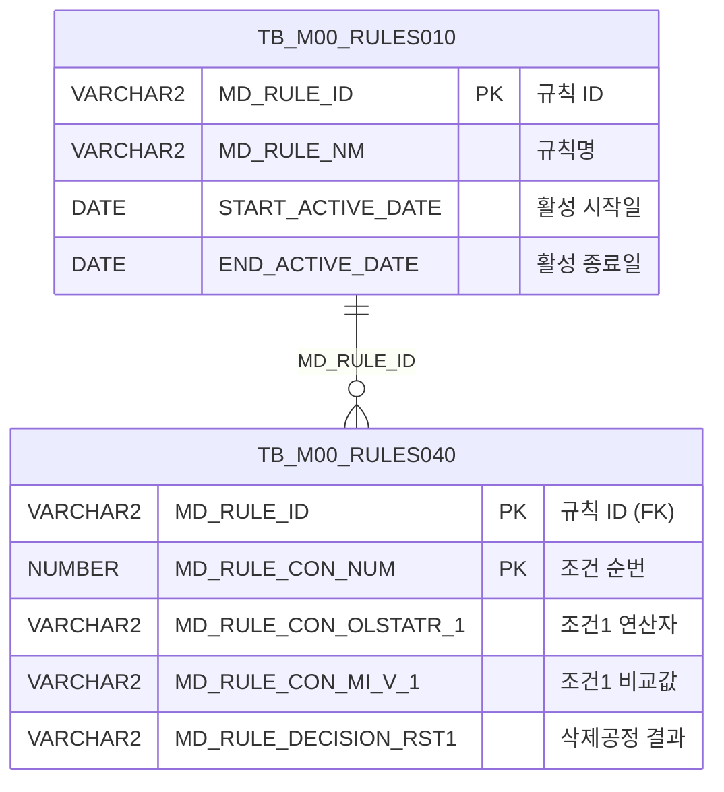

<h1 style="font-size: 40px; text-align: center; font-weight:
   bold; margin: 30px 0;">
  C107000030tab17 레거시 시스템 분석 종합 보고서
</h1>


# 1. 시스템 개요
- **서비스 ID**: C107000030tab17
- **업무명**: 통과공정삭제기준
- **분석 일시**: 2026-03-17 10:55 KST
- **전체 Activity 수**: 2 (Built-in: 2, Custom: 0)
- **분석자**: Claude Opus 4.6 / Claude Sonnet
- **분석 도구**: /analyze-service C107000030tab17
- **문서 버전**: 1.0

# 📊 비즈니스 프로세스 분석

## 시스템 목적

C107000030tab17은 C10(도금) 공정의 **통과공정삭제기준** 규칙을 조회하는 화면으로, 상위 탭 화면 C107000030의 17번째 탭이다. Rules Engine(M00APUSER.TB_M00_RULES040)에 등록된 규칙 ID 'C10B2010'의 조건-결과 매핑 테이블을 읽기 전용 그리드로 표시한다.

이 화면은 특정 주문 속성(품명, B/Marking, 주문내경, 내경링종류, 표면처리코드, 도금량지정, EMBOSS무늬, 포장단중하한값, 코일외경, 두께범위, 폭범위, 수지타입, 광택도코드, 보호필름, 재질코드, 주문EDGE, 주문길이, 제품형태, 권취방법, 최종수요가, 주문용도) 21개 조건과 해당 조건 충족 시 삭제할 공정을 1:1로 매핑한 의사결정 테이블을 제공한다. 오퍼레이터는 이 화면을 통해 어떤 주문 조건 조합에서 어떤 통과공정이 삭제되는지 확인할 수 있다.

두께범위(조건 10)와 폭범위(조건 11)는 BETWEEN 연산자를 사용하며, `FUNC_GET_YEONSAN` 함수를 통해 연산자 코드(BETWEEN1~BETWEEN4)를 사람이 읽을 수 있는 기호(`<=값<=`, `<=값<`, `<값<=`, `<값<`)로 변환하여 표시한다.

## 주요 유즈케이스

### UC-01: 통과공정삭제기준 조회
- **Actor**: 도금 공정 오퍼레이터 / 생산관리자
- **목적**: 규칙 ID 'C10B2010'에 등록된 21개 주문 조건별 통과공정 삭제 규칙을 조회하여 현재 적용 중인 기준을 확인

- **전제조건**:
  - 사용자가 시스템에 로그인되어 있음
  - 상위 탭 화면 C107000030에서 해당 탭(tab17)이 활성화됨
  - TB_M00_RULES010에 'C10B2010' 규칙이 등록되어 있고 활성 기간 내임

- **주요 흐름**:
  1. 탭 활성화 시 onLoadGrid 이벤트에 의해 자동 조회 실행
  2. 상위 탭 폼(C107000030_Form_1)에서 파라미터 수집 (uiCommon.parameters4 호출)
  3. C107000030tab17.select 쿼리 실행 — TB_M00_RULES010에서 활성 규칙 ID 조회 후 TB_M00_RULES040에서 조건-결과 매핑 데이터 조회
  4. 두께범위(CON10), 폭범위(CON11) 컬럼은 FUNC_GET_YEONSAN 함수로 연산자 코드를 기호로 변환
  5. Grid에 46개 컬럼(SEQ + 21개 조건×연산/비교값 쌍 + 삭제공정 결과) 표시

- **대체 흐름**:
  - 'C10B2010' 규칙이 활성 기간 외인 경우: 조회 결과 없음
  - 규칙 조건이 없는 경우: 빈 그리드 표시

- **후행조건**:
  - 조회된 규칙 데이터가 읽기 전용 Grid에 표시됨
  - 사용자가 컨텍스트 메뉴로 엑셀 다운로드, 컬럼 이동, 헤더 필터 등 활용 가능

### UC-02: 컨텍스트 메뉴 활용
- **Actor**: 도금 공정 오퍼레이터
- **목적**: 그리드 데이터를 다양한 방식으로 조작/활용 (컬럼 이동, 헤더 필터, 편집 모드, 엑셀 다운로드)

- **전제조건**:
  - 그리드에 데이터가 로드되어 있음

- **주요 흐름**:
  1. 그리드에서 우클릭으로 컨텍스트 메뉴 표시
  2. 원하는 기능 선택:
     - **컬럼이동(move_grid)**: 드래그로 컬럼 순서 변경 토글
     - **헤더필터(filter_grid)**: 컬럼별 필터 메뉴 활성화
     - **편집가능(editable_grid)**: 셀 편집 모드 토글
     - **엑셀다운(excel_grid)**: 현재 그리드 데이터를 엑셀 파일로 다운로드

- **대체 흐름**:
  - 체크박스 토글 기반으로 기능 활성/비활성 전환

- **후행조건**:
  - 선택한 기능이 그리드에 적용됨

### UC-03: 수동 재조회
- **Actor**: 도금 공정 오퍼레이터
- **목적**: 상위 탭의 검색 조건 변경 후 통과공정삭제기준을 다시 조회

- **전제조건**:
  - 상위 탭(C107000030)의 Form에 검색 조건이 설정되어 있음

- **주요 흐름**:
  1. 상위 탭의 조회 버튼 클릭 또는 find 이벤트 발생
  2. uiCommon.parameters4로 C107000030_Form_1의 파라미터 수집
  3. C107000030tab17_Grid_1에 loadData 호출
  4. 갱신된 조건으로 그리드 데이터 리로드

- **대체 흐름**:
  - 조회 결과 없음: 빈 그리드 표시, 메시지박스에 메시지 표시

- **후행조건**:
  - 최신 조건으로 갱신된 데이터가 그리드에 표시됨

---
## 비즈니스 로직 상세

### 1. 연산자 코드 변환 (FUNC_GET_YEONSAN)

- **목적**: Rules Engine의 두께범위/폭범위 조건에 사용되는 BETWEEN 연산자 코드를 화면 표시용 기호 문자열로 변환
- **처리 케이스**:

  **[케이스 1: BETWEEN1 - 양쪽 포함 범위]**
  ```
    조건: 연산자 코드 = 'BETWEEN1'
    처리:
      1. UPPER() 적용하여 대소문자 무관 처리
      2. '<=값<=' 문자열 반환
      3. 의미: 최소값 이상, 최대값 이하
  ```

  **[케이스 2: BETWEEN2 - 최소 포함, 최대 미포함]**
  ```
    조건: 연산자 코드 = 'BETWEEN2'
    처리:
      1. '<=값<' 문자열 반환
      2. 의미: 최소값 이상, 최대값 미만
  ```

  **[케이스 3: BETWEEN3 - 최소 미포함, 최대 포함]**
  ```
    조건: 연산자 코드 = 'BETWEEN3'
    처리:
      1. '<값<=' 문자열 반환
      2. 의미: 최소값 초과, 최대값 이하
  ```

  **[케이스 4: BETWEEN4 - 양쪽 미포함]**
  ```
    조건: 연산자 코드 = 'BETWEEN4'
    처리:
      1. '<값<' 문자열 반환
      2. 의미: 최소값 초과, 최대값 미만
  ```

  **[케이스 5: 기타 연산자]**
  ```
    조건: 위 코드에 해당하지 않는 경우
    처리:
      1. 입력값 그대로 반환 (=, <>, >, < 등)
  ```

- **예외 처리**:
  - WHEN OTHERS: 모든 예외 발생 시 NULL 반환

### 2. Rules Engine 활성 규칙 필터링

- **목적**: 현재 시점에 유효한 'C10B2010' 규칙만 조회하여 만료/미활성 규칙 표시 방지
- **처리 케이스**:

  **[케이스 1: 활성 기간 내]**
  ```
    조건: START_ACTIVE_DATE <= SYSDATE AND SYSDATE < END_ACTIVE_DATE
    처리:
      1. TB_M00_RULES010에서 MD_RULE_NM = 'C10B2010' 조건으로 MD_RULE_ID 추출
      2. 추출된 MD_RULE_ID로 TB_M00_RULES040의 조건-결과 매핑 조회
      3. 21개 조건 컬럼과 1개 결과 컬럼(삭제공정) 반환
  ```

  **[케이스 2: 활성 기간 외]**
  ```
    조건: SYSDATE < START_ACTIVE_DATE 또는 SYSDATE >= END_ACTIVE_DATE
    처리:
      1. RULES010 서브쿼리 결과 없음
      2. INNER JOIN 실패로 빈 결과셋 반환
  ```

### 3. 21개 조건 매핑 구조

- **목적**: 주문 속성 21개 항목에 대한 연산자-비교값 매핑으로 통과공정 삭제 여부 판단 규칙 제공
- **처리 케이스**:

  **[조건 1~9, 12~21: 단일 비교값 조건]**
  ```
    구조: CON[N] (연산자) + MIN[N] (비교값)
    예: CON1='=' + MIN1='HRPO' → 품명이 HRPO인 경우
  ```

  **[조건 10, 11: 범위 비교값 조건 (두께/폭)]**
  ```
    구조: CON[N] (BETWEEN 연산자, FUNC_GET_YEONSAN으로 변환) + MIN[N] (최소값) + MAX[N] (최대값)
    예: CON10='<=값<=' + MIN10=0.400 + MAX10=2.300 → 두께 0.400~2.300mm 범위
  ```

---

# 💾 데이터 요구사항

## 핵심 테이블

### 1. TB_M00_RULES040 - (규칙 조건-결과 매핑 테이블)
| 컬럼명 | 타입 | PK | 설명 |
|--------|------|----|------|
| MD_RULE_ID | VARCHAR2 | ✅ | 규칙 ID (TB_M00_RULES010 FK) |
| MD_RULE_CON_NUM | NUMBER | ✅ | 조건 순번 (SEQ) |
| MD_RULE_CON_OLSTATR_1 ~ _21 | VARCHAR2 | | 조건 1~21의 연산자 |
| MD_RULE_CON_MI_V_1 ~ _21 | VARCHAR2 | | 조건 1~21의 비교값(최소값) |
| MD_RULE_CON_MAX_V_10 | VARCHAR2 | | 조건 10(두께범위) 최대값 |
| MD_RULE_CON_MAX_V_11 | VARCHAR2 | | 조건 11(폭범위) 최대값 |
| MD_RULE_DECISION_RST1 | VARCHAR2 | | 의사결정 결과 (삭제공정) |

### 2. TB_M00_RULES010 - (규칙 마스터 테이블)
| 컬럼명 | 타입 | PK | 설명 |
|--------|------|----|------|
| MD_RULE_ID | VARCHAR2 | ✅ | 규칙 ID |
| MD_RULE_NM | VARCHAR2 | | 규칙명 (예: 'C10B2010') |
| START_ACTIVE_DATE | DATE | | 활성 시작일 |
| END_ACTIVE_DATE | DATE | | 활성 종료일 |

## 데이터 플로우

### 1. 조회
```
[통과공정삭제기준 조회]
탭 활성화 / 조회 버튼 클릭
→ C107000030tab17.select
  FROM M00APUSER.TB_M00_RULES040 RULES040
  INNER JOIN (
    SELECT MD_RULE_ID
    FROM M00APUSER.TB_M00_RULES010
    WHERE MD_RULE_NM = 'C10B2010'
      AND START_ACTIVE_DATE <= SYSDATE
      AND SYSDATE < END_ACTIVE_DATE
  ) RULES010 ON RULES010.MD_RULE_ID = RULES040.MD_RULE_ID
  -- 두께범위(CON10), 폭범위(CON11): M00APUSER.FUNC_GET_YEONSAN()으로 연산자 코드 변환
→ Grid에 46개 컬럼 표시 (SEQ + 21조건×연산/비교값 + 삭제공정)
```

## SQL 일람표
| SQL 이름 | 쿼리 ID | 타입 | 출처 | 테이블 |
|---------|---------|-----|-------|-------|
| 통과공정삭제기준 조회 | C107000030tab17.select | SELECT | Service | TB_M00_RULES040, TB_M00_RULES010 |

## PL/SQL 함수/프로시저
| # | 호출명 | 유형 | 용도 | 상세 분석 |
|---|--------|------|------|----------|
| 1 | FUNC_GET_YEONSAN | 함수 | BETWEEN 연산자 코드를 화면 표시용 기호로 변환 | [분석 보고서](../../../dbms/M00APUSER/function/FUNC_GET_YEONSAN_analysis_report.md) |

## ER 다이어그램 (핵심 관계)



관계 설명:
- TB_M00_RULES010이 규칙 마스터로, MD_RULE_ID를 통해 TB_M00_RULES040과 1:N 관계
- 하나의 규칙(C10B2010)에 여러 조건-결과 매핑 행이 존재

---

# 🖥️ 사용자 인터페이스 요구사항

## 화면 레이아웃 상세

### Layout 구조 (div 직접 배치, initLayout 미사용)
```javascript
// 레이아웃 없이 div 직접 배치 (절대 좌표)
{
  components: [
    {
      id: "C107000030tab17_Grid_1",
      type: "grid",
      position: { left: 0, top: 0, width: 976, height: 492 }
    },
    {
      id: "C107000030tab17_messagebox",
      type: "messagebox",
      position: { left: 0, top: 493, width: 976, height: 18 }
    },
    {
      id: "C107000030tab17_Form_1",
      type: "form",
      position: { left: 0, top: 450, width: 282, height: 30 }
      // 실제 Form XML은 비어있음 (<items/>)
      // 상위 탭(C107000030)의 C107000030_Form_1 파라미터 사용
    }
  ]
}
```

## 입출력 요소

### Form 컴포넌트
**C107000030tab17_Form_1**
- Form XML이 비어있음 (`<items/>`)
- 상위 탭(C107000030)의 C107000030_Form_1에서 검색 파라미터를 가져와 사용
- `uiCommon.parameters4('C107000030_Form_1', ...)` 호출로 파라미터 수집

### Grid 컴포넌트

**C107000030tab17_Grid_1 (통과공정삭제기준)**
- 편집 가능 여부: 아니오 (모든 컬럼 읽기 전용)
- Split: 0 (고정 컬럼 없음)
- 3단 헤더 구조 (조건 그룹명 → 연산/비교값 → 필터)
- rowCnt: 17, 스마트 렌더링/페이지셋/컨텍스트메뉴 활성화
- colwidthUnit: % (너비 비율 기반)
- 주요 컬럼 (46개):

  **기본 정보**:
  - SEQ: ro - 조건 순번 (4%, 우측정렬)

  **조건 1 - 품명**:
  - CON1: ro - 품명 연산자 (5%, 중앙정렬)
  - MIN1: ro - 품명 비교값 (8%, 좌측정렬)

  **조건 2 - B/Marking**:
  - CON2: ro - B/Marking 연산자 (9%, 중앙정렬)
  - MIN2: ro - B/Marking 비교값 (5%, 중앙정렬)

  **조건 3 - 주문내경**:
  - CON3: ro - 주문내경 연산자 (9%, 중앙정렬)
  - MIN3: ro - 주문내경 비교값 (5%, 중앙정렬)

  **조건 4 - 내경링종류**:
  - CON4: ro - 내경링종류 연산자 (9%, 중앙정렬)
  - MIN4: ro - 내경링종류 비교값 (5%, 중앙정렬)

  **조건 5 - 표면처리코드**:
  - CON5: ro - 표면처리코드 연산자 (9%, 중앙정렬)
  - MIN5: ro - 표면처리코드 비교값 (9%, 좌측정렬)

  **조건 6 - 도금량지정**:
  - CON6: ro - 도금량지정 연산자 (9%, 중앙정렬)
  - MIN6: ro - 도금량지정 비교값 (5%, 중앙정렬)

  **조건 7 - EMBOSS무늬**:
  - CON7: ro - EMBOSS무늬 연산자 (9%, 중앙정렬)
  - MIN7: ro - EMBOSS무늬 비교값 (5%, 중앙정렬)

  **조건 8 - 포장단중하한값**:
  - CON8: ro - 포장단중하한값 연산자 (9%, 중앙정렬)
  - MIN8: ro - 포장단중하한값 비교값 (5%, 중앙정렬)

  **조건 9 - 코일외경**:
  - CON9: ro - 코일외경 연산자 (9%, 중앙정렬)
  - MIN9: ro - 코일외경 비교값 (5%, 중앙정렬)

  **조건 10 - 두께범위 (범위형)**:
  - CON10: ro - 두께범위 연산자 (10%, 중앙정렬, FUNC_GET_YEONSAN 변환)
  - MIN10: ron - 두께범위 최소값 (5%, 중앙정렬, format: 0.000)
  - MAX10: ron - 두께범위 최대값 (5%, 중앙정렬, format: 0.000)

  **조건 11 - 폭범위 (범위형)**:
  - CON11: ro - 폭범위 연산자 (10%, 중앙정렬, FUNC_GET_YEONSAN 변환)
  - MIN11: ron - 폭범위 최소값 (5%, 중앙정렬, format: 0000.0)
  - MAX11: ron - 폭범위 최대값 (5%, 중앙정렬, format: 0000.0)

  **조건 12 - 수지타입**:
  - CON12: ro - 수지타입 연산자 (10%, 중앙정렬)
  - MIN12: ro - 수지타입 비교값 (5%, 중앙정렬)

  **조건 13 - 광택도코드**:
  - CON13: ro - 광택도코드 연산자 (10%, 중앙정렬)
  - MIN13: ro - 광택도코드 비교값 (5%, 중앙정렬)

  **조건 14 - 보호필름**:
  - CON14: ro - 보호필름 연산자 (10%, 중앙정렬)
  - MIN14: ro - 보호필름 비교값 (5%, 중앙정렬)

  **조건 15 - 재질코드**:
  - CON15: ro - 재질코드 연산자 (10%, 중앙정렬)
  - MIN15: ro - 재질코드 비교값 (8%, 좌측정렬)

  **조건 16 - 주문EDGE**:
  - CON16: ro - 주문EDGE 연산자 (10%, 중앙정렬)
  - MIN16: ro - 주문EDGE 비교값 (5%, 중앙정렬)

  **조건 17 - 주문길이**:
  - CON17: ro - 주문길이 연산자 (10%, 중앙정렬)
  - MIN17: ro - 주문길이 비교값 (5%, 중앙정렬)

  **조건 18 - 제품형태**:
  - CON18: ro - 제품형태 연산자 (10%, 중앙정렬)
  - MIN18: ro - 제품형태 비교값 (5%, 중앙정렬)

  **조건 19 - 권취방법**:
  - CON19: ro - 권취방법 연산자 (10%, 중앙정렬)
  - MIN19: ro - 권취방법 비교값 (5%, 중앙정렬)

  **조건 20 - 최종수요가**:
  - CON20: ro - 최종수요가 연산자 (10%, 중앙정렬)
  - MIN20: ro - 최종수요가 비교값 (5%, 중앙정렬)

  **조건 21 - 주문용도**:
  - CON21: ro - 주문용도 연산자 (10%, 중앙정렬)
  - MIN21: ro - 주문용도 비교값 (5%, 중앙정렬)

  **결과**:
  - RST1: ro - 삭제공정 (10%, 중앙정렬)

## 화면 동작 흐름

### 1. 화면 초기 로딩 (탭 활성화)
```
1. 상위 화면 C107000030에서 tab17 탭 클릭
2. C107000030tab17.jsp 로드
3. ui.initializeDHTMLX() 호출 → DHTMLX 컴포넌트 초기화
4. Grid_1의 onXLE 이벤트에 onLoadGrid 핸들러 등록
5. Grid XML 로드 완료 시 onLoadGrid 자동 실행:
   - uiCommon.parameters4('C107000030_Form_1', 'C107000030tab17_Grid_1', 'find')
   - items['C107000030tab17_Grid_1'].loadData(findUrl)
6. onXLE 이벤트 detach (1회성 자동 조회)
7. 조회 결과가 Grid에 표시됨
8. findMessage로 appMsg 메시지박스에 표시
```

### 2. 수동 재조회 (find)
```
1. 상위 탭의 조회 버튼 클릭 → find 함수 호출
2. uiCommon.parameters4('C107000030_Form_1', 'C107000030tab17_Grid_1', eventName)
3. 상위 폼의 파라미터와 이벤트명을 결합하여 URL 생성
4. items['C107000030tab17_Grid_1'].loadData(findUrl)
5. handleDataProcess.do 호출 → C107000030tab17-service → 분기(PosDefaultRouter) → 조회(FormSearch)
6. Grid 데이터 갱신
```

### 3. 컨텍스트 메뉴 활용
```
1. Grid에서 우클릭 → contextmenu.xml 기반 메뉴 표시
2. 메뉴 항목 선택 (onGridContextMenuClick):
   - move_grid: 컬럼 이동 활성/비활성 토글
   - filter_grid: 헤더 필터 메뉴 활성화
   - editable_grid: 셀 편집 모드 토글
   - excel_grid: toExcel()로 엑셀 다운로드 (gridexcel 서블릿 호출)
```

## JavaScript 모듈

**C107000030tab17.jsp** (인라인 스크립트)
- find(eventName, formDivObj, referenceItem): 조회 실행 (uiCommon.parameters4로 상위 폼 파라미터 수집 → Grid loadData)
- add(referenceItem): 그리드 행 추가 (items[referenceItem].addRow())
- remove(referenceItem): 그리드 행 삭제 (items[referenceItem].removeRow())
- copy(referenceItem): 행 클립보드 복사 (items[referenceItem].copyRowContent())
- undo(referenceItem): 실행 취소 (items[referenceItem].undo())
- redo(referenceItem): 다시 실행 (items[referenceItem].redo())
- onGridContextMenuClick(id, gridObj, menuObj): 컨텍스트 메뉴 처리 (move_grid/filter_grid/editable_grid/excel_grid)
- findMessage(referenceItem): 메시지박스 표시 (uiCommon.message)
- onLoadGrid(): 초기 자동 조회 (uiCommon.parameters4 → loadData → onXLE detach)

**외부 JS**:
- ./dhtmlx/codebase/glue.ui.bootstrap.js (DHTMLX 프레임워크)
- ./js/c10.ui.js (C10 모듈 공통 UI)

## 주요 이벤트 핸들러

**onXLE (Grid XML 로드 완료)**
- 이벤트 타입: Grid onXLEEvent
- 처리 내용:
  1. onLoadGrid 함수 실행
  2. uiCommon.parameters4로 상위 폼 파라미터 수집
  3. Grid loadData로 자동 조회
  4. detachEvent(onXLE)로 이벤트 해제 (1회성)

**onGridContextMenuClick (컨텍스트 메뉴 클릭)**
- 이벤트 타입: Grid Context Menu Click
- 처리 내용:
  1. 메뉴 ID로 기능 분기
  2. getCheckboxState로 토글 상태 확인
  3. 해당 기능 활성/비활성 전환

---

# 📌 특이사항 및 주의사항

## 1. 상위 탭 Form 참조 패턴
- 이 화면 자체의 Form XML(`C107000030tab17_Form_1.xml`)은 비어있으며(`<items/>`), 조회 파라미터를 상위 탭 화면 `C107000030_Form_1`에서 가져오는 구조이다. 탭 간 파라미터 공유 패턴으로, 상위 폼 변경 시 이 화면에도 영향을 미친다.

## 2. Rules Engine 의사결정 테이블 구조
- TB_M00_RULES040은 범용 의사결정 테이블로, 21개 조건 컬럼과 결과 컬럼이 모두 동일한 컬럼 패턴(`MD_RULE_CON_OLSTATR_N`, `MD_RULE_CON_MI_V_N`, `MD_RULE_CON_MAX_V_N`)으로 구성되어 있다. 조건의 비즈니스 의미(품명, B/Marking 등)는 테이블이 아닌 화면 헤더에서만 정의되며, 조건 순서 변경 시 화면과 데이터의 매핑이 틀어질 수 있다.

## 3. FUNC_GET_YEONSAN 함수 한정 적용
- 21개 조건 중 두께범위(조건 10)와 폭범위(조건 11)만 `FUNC_GET_YEONSAN` 함수를 적용하여 BETWEEN 코드를 기호로 변환한다. 나머지 19개 조건은 연산자 코드를 원본 그대로 표시하므로, 화면에서 일관성이 떨어질 수 있다.

## 4. onXLE 이벤트 1회성 자동 조회
- Grid XML 로드 완료 시 자동 조회를 실행하고 즉시 `detachEvent(onXLE)`로 이벤트를 해제한다. 이는 탭 전환 시 불필요한 재조회를 방지하는 패턴이지만, 탭이 다시 활성화될 때 자동 갱신이 되지 않는다는 점에 유의해야 한다.

## 5. 편집 기능 존재하나 비활성 상태
- add, remove, copy, undo, redo 함수가 정의되어 있고 컨텍스트 메뉴에 editable_grid 옵션이 있으나, 모든 컬럼이 ro(읽기 전용)로 설정되어 있다. 편집 모드를 활성화하면 컬럼 타입과 무관하게 setEditable(true)가 적용되므로, 실제로 데이터 수정이 가능해질 수 있으나 저장 서비스가 없어 수정 내용은 반영되지 않는다.

---

# 📚 참고 문서

- **Service XML**: `src/service/C107000030tab17-service.xml`
- **Query SQL**: `src/query/C107000030tab17-query.glue_sql`
- **JSP**: `WebContents/C107000030tab17.jsp`
- **Grid XML**: `WebContents/header/kr/C107000030tab17/C107000030tab17_Grid_1.xml`
- **Form XML**: `WebContents/header/kr/C107000030tab17/C107000030tab17_Form_1.xml`
- **PL/SQL 분석**: `docs/analysis/dbms/M00APUSER/function/FUNC_GET_YEONSAN_analysis_report.md`
