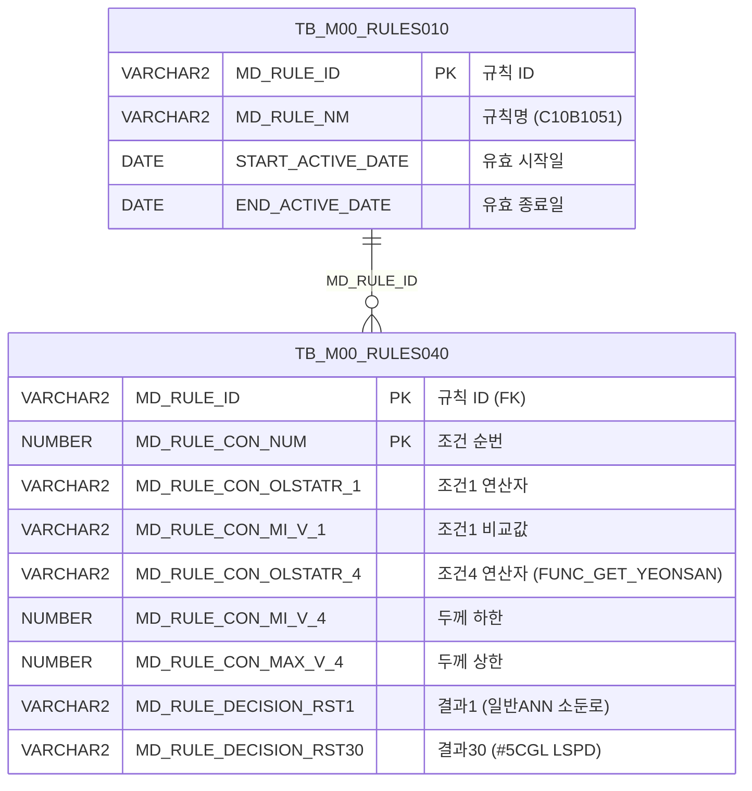

<h1 style="font-size: 40px; text-align: center; font-weight:
   bold; margin: 30px 0;">
  C107000030tab18 레거시 시스템 분석 종합 보고서
</h1>


# 1. 시스템 개요
- **서비스 ID**: C107000030tab18
- **업무명**: 제조표준 조회 (C10B1051 규칙 기반)
- **분석 일시**: 2026-03-17 (KST)
- **전체 Activity 수**: 2 (Built-in: 2, Custom: 0)
- **분석자**: Claude Opus 4.6 / Sonnet
- **분석 도구**: /analyze-service C107000030tab18
- **문서 버전**: 1.0

# 비즈니스 프로세스 분석

## 시스템 목적

C107000030tab18은 C10 모듈(냉연 제조실행시스템)의 **제조표준 조회** 탭 화면이다. 부모 화면 C107000030의 탭 18로 동작하며, 의사결정 규칙 테이블(TB_M00_RULES040)에 등록된 **C10B1051 규칙**의 조건-결과 매핑 데이터를 조회하여 표시한다.

C10B1051 규칙은 제조표준번호, 품명, 재질, 두께범위, 폭범위 등 5개 조건을 기반으로 총 30개의 의사결정 결과값을 산출한다. 결과값은 일반ANN(소둔로, CYCLE, 보정시간, 코일온도, 냉종), H-CON ANN(동일 5항목), #2~#5 CGL(CYCLE, HT, CT, ST, LSPD)의 공정 파라미터로 구성되며, 각 공정별 소둔/도금 라인의 제조 기준값을 정의한다.

이 화면은 읽기 전용 조회 화면으로, 데이터 수정 기능 없이 규칙 엔진에 등록된 제조표준 정보를 빠르게 확인하기 위한 목적으로 사용된다. 두께/폭 범위의 조건(4, 5번)에는 `FUNC_GET_YEONSAN` 함수를 통해 연산자 코드를 한글 의미명으로 변환하여 표시한다.

## 주요 유즈케이스

### UC-01: 제조표준 규칙 조회
- **Actor**: 생산 관리자 / 품질 관리자
- **목적**: C10B1051 규칙에 등록된 제조표준 조건-결과 매핑 데이터를 조회하여 각 공정별 소둔/도금 파라미터 기준값 확인

- **전제조건**:
  - 부모 화면 C107000030이 로딩되어 있음
  - C10B1051 규칙이 TB_M00_RULES010에 등록되어 있고, 현재 유효기간 내에 있음
  - 해당 규칙에 대한 상세 조건/결과 데이터가 TB_M00_RULES040에 존재함

- **주요 흐름**:
  1. 사용자가 C107000030 화면에서 tab18(제조표준) 탭을 클릭
  2. 탭 로딩 완료 시 onXLE(XML Load End) 이벤트 발생
  3. 부모 폼(C107000030_Form_1)에서 검색 파라미터를 가져옴 (uiCommon.parameters4)
  4. C107000030tab18-service 호출하여 C107000030tab18.select 쿼리 실행
  5. TB_M00_RULES010에서 C10B1051 규칙 ID 조회 (유효기간 검증)
  6. TB_M00_RULES040에서 해당 규칙의 조건-결과 매핑 데이터 조회
  7. FUNC_GET_YEONSAN 함수로 CON4/CON5의 연산자 코드를 한글 의미명으로 변환
  8. 43컬럼 다중헤더 Grid에 결과 표시

- **대체 흐름**:
  - C10B1051 규칙이 유효기간 외인 경우: 조회 결과 없음
  - 규칙 데이터가 미등록된 경우: 빈 그리드 표시

- **후행조건**:
  - 제조표준 규칙 데이터가 그리드에 표시됨
  - 사용자가 컨텍스트 메뉴를 통해 필터링, 엑셀 내보내기 등 가능

### UC-02: 그리드 데이터 필터링
- **Actor**: 생산 관리자
- **목적**: 다량의 제조표준 규칙 중 특정 조건(품명, 재질, 두께/폭 범위)에 해당하는 규칙만 필터링하여 확인

- **전제조건**:
  - UC-01에 의해 제조표준 데이터가 그리드에 로드되어 있음

- **주요 흐름**:
  1. 그리드 3행 헤더의 필터 영역에서 조건 입력
  2. 품명(MIN1): 텍스트 필터로 품명 검색
  3. 재질(MIN2): 텍스트 필터로 재질 검색
  4. 두께(MIN4/MAX4): 숫자 필터로 범위 검색
  5. 폭(MIN5/MAX5): 숫자 필터로 범위 검색
  6. 필터 조건에 맞는 행만 그리드에 표시

- **대체 흐름**:
  - 필터 결과 없음: 빈 그리드 표시

- **후행조건**:
  - 필터링된 데이터만 그리드에 표시됨

### UC-03: 엑셀 내보내기
- **Actor**: 생산 관리자 / 품질 관리자
- **목적**: 제조표준 규칙 데이터를 엑셀 파일로 내보내어 오프라인 분석 및 보고서 작성에 활용

- **전제조건**:
  - 그리드에 데이터가 로드되어 있음

- **주요 흐름**:
  1. 그리드 영역에서 우클릭하여 컨텍스트 메뉴 표시
  2. "엑셀내보내기(excel_grid)" 메뉴 선택
  3. 현재 그리드 데이터가 엑셀 파일로 다운로드

- **후행조건**:
  - 엑셀 파일이 로컬에 다운로드됨

---
## 비즈니스 로직 상세

### 1. 연산자 코드 한글 변환 (FUNC_GET_YEONSAN)

- **목적**: 규칙 조건의 연산자 코드(영문 약어)를 사용자가 이해할 수 있는 한글 연산자 의미명으로 변환
- **처리 케이스**:

  **[케이스 1: 조건4/조건5 연산자 변환]**
  ```
    조건: CON4, CON5 컬럼의 MD_RULE_CON_OLSTATR_4, MD_RULE_CON_OLSTATR_5 값
    처리:
      1. UPPER() 함수로 대문자 변환
      2. M00APUSER.FUNC_GET_YEONSAN() 함수 호출
      3. 연산자 코드를 한글 의미명으로 변환 (예: 'GE' → '이상', 'LE' → '이하', 'BT' → '사이' 등)
      4. 변환된 한글 연산자명을 CON4/CON5 컬럼으로 반환
  ```

- **참고**: [FUNC_GET_YEONSAN 상세 분석 보고서](../../../dbms/M00APUSER/function/FUNC_GET_YEONSAN_analysis_report.md)

### 2. 의사결정 규칙 유효성 검증

- **목적**: C10B1051 규칙이 현재 시점에 유효한지 검증하여 올바른 제조표준 데이터만 조회
- **처리 케이스**:

  **[케이스 1: 유효기간 검증]**
  ```
    조건: TB_M00_RULES010의 START_ACTIVE_DATE <= SYSDATE < END_ACTIVE_DATE
    처리:
      1. TB_M00_RULES010에서 MD_RULE_NM = 'C10B1051' 조건으로 검색
      2. START_ACTIVE_DATE가 현재 일시 이전인지 확인
      3. END_ACTIVE_DATE가 현재 일시 이후인지 확인
      4. 조건 충족 시 해당 MD_RULE_ID를 반환
      5. 반환된 MD_RULE_ID로 TB_M00_RULES040 조인
  ```

### 3. 제조표준 조건-결과 매핑 구조

- **목적**: 5개 조건 기반으로 30개 공정 파라미터 결과값을 매핑하는 의사결정 테이블 구조
- **처리 케이스**:

  **[조건 구조]**
  ```
    CON1 (조건1): 제조표준번호 - 연산자 (MD_RULE_CON_OLSTATR_1)
    MIN1 (비교값1): 제조표준번호 비교값 (MD_RULE_CON_MI_V_1)
    CON2 (조건2): 품명 - 연산자 (MD_RULE_CON_OLSTATR_2)
    MIN2 (비교값2): 품명 비교값 (MD_RULE_CON_MI_V_2)
    CON3 (조건3): 재질 - 연산자 (MD_RULE_CON_OLSTATR_3)
    MIN3 (비교값3): 재질 비교값 (MD_RULE_CON_MI_V_3)
    CON4 (조건4): 두께범위 - 연산자 (FUNC_GET_YEONSAN 변환)
    MIN4/MAX4: 두께 최소/최대값 (MD_RULE_CON_MI_V_4, MD_RULE_CON_MAX_V_4)
    CON5 (조건5): 폭범위 - 연산자 (FUNC_GET_YEONSAN 변환)
    MIN5/MAX5: 폭 최소/최대값 (MD_RULE_CON_MI_V_5, MD_RULE_CON_MAX_V_5)
  ```

  **[결과 구조 - 30개 공정 파라미터]**
  ```
    RST1~RST5:   일반ANN (소둔로, CYCLE, 보정시간, 코일온도, 냉종)
    RST6~RST10:  H-CON ANN (소둔로, CYCLE, 보정시간, 코일온도, 냉종)
    RST11~RST15: #2CGL (CYCLE, HT, CT, ST, LSPD)
    RST16~RST20: #3CGL (CYCLE, HT, CT, ST, LSPD)
    RST21~RST25: #4CGL (CYCLE, HT, CT, ST, LSPD)
    RST26~RST30: #5CGL (CYCLE, HT, CT, ST, LSPD)
  ```

---

# 데이터 요구사항

## 핵심 테이블

### 1. TB_M00_RULES040 - (의사결정 규칙 상세 조건/결과)
| 컬럼명 | 타입 | PK | 설명 |
|--------|------|----|-----|
| MD_RULE_ID | VARCHAR2 | ✅ | 규칙 ID (TB_M00_RULES010 FK) |
| MD_RULE_CON_NUM | NUMBER | ✅ | 조건 순번 (SEQ) |
| MD_RULE_CON_OLSTATR_1 | VARCHAR2 | | 조건1 연산자 (제조표준번호) |
| MD_RULE_CON_MI_V_1 | VARCHAR2 | | 조건1 비교값 |
| MD_RULE_CON_OLSTATR_2 | VARCHAR2 | | 조건2 연산자 (품명) |
| MD_RULE_CON_MI_V_2 | VARCHAR2 | | 조건2 비교값 |
| MD_RULE_CON_OLSTATR_3 | VARCHAR2 | | 조건3 연산자 (재질) |
| MD_RULE_CON_MI_V_3 | VARCHAR2 | | 조건3 비교값 |
| MD_RULE_CON_OLSTATR_4 | VARCHAR2 | | 조건4 연산자 (두께범위) |
| MD_RULE_CON_MI_V_4 | NUMBER | | 조건4 최소값 (두께 하한) |
| MD_RULE_CON_MAX_V_4 | NUMBER | | 조건4 최대값 (두께 상한) |
| MD_RULE_CON_OLSTATR_5 | VARCHAR2 | | 조건5 연산자 (폭범위) |
| MD_RULE_CON_MI_V_5 | NUMBER | | 조건5 최소값 (폭 하한) |
| MD_RULE_CON_MAX_V_5 | NUMBER | | 조건5 최대값 (폭 상한) |
| MD_RULE_DECISION_RST1 | VARCHAR2 | | 일반ANN 소둔로 |
| MD_RULE_DECISION_RST2 | VARCHAR2 | | 일반ANN CYCLE |
| MD_RULE_DECISION_RST3 | VARCHAR2 | | 일반ANN 보정시간 |
| MD_RULE_DECISION_RST4 | VARCHAR2 | | 일반ANN 코일온도 |
| MD_RULE_DECISION_RST5 | VARCHAR2 | | 일반ANN 냉종 |
| MD_RULE_DECISION_RST6 | VARCHAR2 | | H-CON ANN 소둔로 |
| MD_RULE_DECISION_RST7 | VARCHAR2 | | H-CON ANN CYCLE |
| MD_RULE_DECISION_RST8 | VARCHAR2 | | H-CON ANN 보정시간 |
| MD_RULE_DECISION_RST9 | VARCHAR2 | | H-CON ANN 코일온도 |
| MD_RULE_DECISION_RST10 | VARCHAR2 | | H-CON ANN 냉종 |
| MD_RULE_DECISION_RST11 | VARCHAR2 | | #2CGL CYCLE |
| MD_RULE_DECISION_RST12 | VARCHAR2 | | #2CGL HT |
| MD_RULE_DECISION_RST13 | VARCHAR2 | | #2CGL CT |
| MD_RULE_DECISION_RST14 | VARCHAR2 | | #2CGL ST |
| MD_RULE_DECISION_RST15 | VARCHAR2 | | #2CGL LSPD |
| MD_RULE_DECISION_RST16 | VARCHAR2 | | #3CGL CYCLE |
| MD_RULE_DECISION_RST17 | VARCHAR2 | | #3CGL HT |
| MD_RULE_DECISION_RST18 | VARCHAR2 | | #3CGL CT |
| MD_RULE_DECISION_RST19 | VARCHAR2 | | #3CGL ST |
| MD_RULE_DECISION_RST20 | VARCHAR2 | | #3CGL LSPD |
| MD_RULE_DECISION_RST21 | VARCHAR2 | | #4CGL CYCLE |
| MD_RULE_DECISION_RST22 | VARCHAR2 | | #4CGL HT |
| MD_RULE_DECISION_RST23 | VARCHAR2 | | #4CGL CT |
| MD_RULE_DECISION_RST24 | VARCHAR2 | | #4CGL ST |
| MD_RULE_DECISION_RST25 | VARCHAR2 | | #4CGL LSPD |
| MD_RULE_DECISION_RST26 | VARCHAR2 | | #5CGL CYCLE |
| MD_RULE_DECISION_RST27 | VARCHAR2 | | #5CGL HT |
| MD_RULE_DECISION_RST28 | VARCHAR2 | | #5CGL CT |
| MD_RULE_DECISION_RST29 | VARCHAR2 | | #5CGL ST |
| MD_RULE_DECISION_RST30 | VARCHAR2 | | #5CGL LSPD |

### 2. TB_M00_RULES010 - (의사결정 규칙 마스터)
| 컬럼명 | 타입 | PK | 설명 |
|--------|------|----|-----|
| MD_RULE_ID | VARCHAR2 | ✅ | 규칙 ID |
| MD_RULE_NM | VARCHAR2 | | 규칙명 (예: C10B1051) |
| START_ACTIVE_DATE | DATE | | 유효 시작일 |
| END_ACTIVE_DATE | DATE | | 유효 종료일 |

## 데이터 플로우

### 1. 조회

```
[탭 로딩 시 제조표준 규칙 자동 조회]
tab18 탭 활성화 (onXLE 이벤트)
→ 부모 폼(C107000030_Form_1)에서 파라미터 수집 (uiCommon.parameters4)
→ C107000030tab18.select 실행
  FROM M00APUSER.TB_M00_RULES040 RULES040
  INNER JOIN (SELECT MD_RULE_ID
              FROM M00APUSER.TB_M00_RULES010
              WHERE MD_RULE_NM = 'C10B1051'
                AND START_ACTIVE_DATE <= SYSDATE
                AND SYSDATE < END_ACTIVE_DATE) RULES010
    ON RULES010.MD_RULE_ID = RULES040.MD_RULE_ID
  -- 조건4,5: M00APUSER.FUNC_GET_YEONSAN(UPPER(연산자코드)) 변환
→ Grid_1에 43컬럼 다중헤더 데이터 표시
```

## SQL 일람표

| SQL 이름 | 쿼리 ID | 타입 | 출처 | 테이블 |
|---------|---------|-----|-------|-------|
| 제조표준 규칙 조회 | C107000030tab18.select | SELECT | Service | TB_M00_RULES040, TB_M00_RULES010 |

## PL/SQL 함수/프로시저

| # | 호출명 | 유형 | 용도 | 상세 분석 |
|---|--------|------|------|----------|
| 1 | FUNC_GET_YEONSAN | 함수 | 연산자 코드를 한글 의미명으로 변환 | [분석 보고서](../../../dbms/M00APUSER/function/FUNC_GET_YEONSAN_analysis_report.md) |

## ER 다이어그램 (핵심 관계)



관계 설명:
- TB_M00_RULES010이 규칙 마스터 테이블로 규칙의 메타정보(이름, 유효기간)를 관리
- TB_M00_RULES040이 규칙 상세 테이블로 각 규칙의 조건-결과 매핑 행을 관리
- MD_RULE_ID를 통한 1:N 관계 (하나의 규칙에 다수의 조건-결과 행)

---

# 사용자 인터페이스 요구사항

## 화면 레이아웃 상세

### Layout 구조 (Absolute 배치)
```javascript
{
  itemType: "absolute",
  components: [
    {
      id: "C107000030tab18_Grid_1",
      type: "grid",
      position: { left: 0, top: 0, width: 976, height: 492 }
    },
    {
      id: "C107000030tab18_messagebox",
      type: "messagebox",
      position: { left: 0, top: 493, width: 976, height: 18 }
    },
    {
      id: "C107000030tab18_Form_1",
      type: "form",
      position: { left: 0, top: 450, width: 282, height: 30 },
      note: "빈 폼 - 검색 파라미터는 부모 탭 C107000030_Form_1 참조"
    }
  ]
}
```

## 입출력 요소

### Form 컴포넌트
**C107000030tab18_Form_1**
- 빈 폼 구조 (`<items/>`) - 검색 파라미터는 부모 탭의 C107000030_Form_1 폼에서 참조됨

### Grid 컴포넌트

**C107000030tab18_Grid_1 (제조표준 규칙)**
- 편집 가능 여부: 아니오 (읽기 전용)
- Split: 0 (고정 컬럼 없음)
- 세로 헤더(vertical): 사용
- 컨텍스트 메뉴: 사용 (컬럼이동, 필터, 편집가능, 엑셀내보내기)
- 페이징: 사용 (17행/페이지)
- 스마트 렌더링: 사용
- 다중 선택: 사용
- 너비 단위: % (퍼센트)
- 3단 계층 헤더 구조
- 주요 컬럼 (43개):

  **순번**:
  - SEQ: ro - 조건 순번 (4%, 우측정렬)

  **조건 영역 - 제조표준번호**:
  - CON1: ro - 조건1 연산자 (5%, 중앙정렬)
  - MIN1: ro - 조건1 비교값/품명 (14%, 좌측정렬)

  **조건 영역 - 품명**:
  - CON2: ro - 조건2 연산자 (5%, 중앙정렬)
  - MIN2: ro - 조건2 비교값/재질 (7%, 중앙정렬)

  **조건 영역 - 재질/두께범위**:
  - CON3: ro - 조건3 연산자 (9%, 중앙정렬)
  - MIN3: ro - 조건3 비교값 (8%, 중앙정렬)
  - CON4: ro - 조건4 연산자 (FUNC_GET_YEONSAN 변환, 9%, 중앙정렬)
  - MIN4: ron - 조건4 최소값 (소수점 3자리, 5%, 중앙정렬)
  - MAX4: ron - 조건4 최대값 (소수점 3자리, 5%, 중앙정렬)

  **조건 영역 - 폭범위**:
  - CON5: ro - 조건5 연산자 (FUNC_GET_YEONSAN 변환, 9%, 중앙정렬)
  - MIN5: ron - 조건5 최소값 (소수점 1자리, 5%, 중앙정렬)
  - MAX5: ron - 조건5 최대값 (소수점 1자리, 5%, 중앙정렬)

  **결과 영역 - 일반ANN**:
  - RST1: ro - 소둔로 (10%, 중앙정렬)
  - RST2: ro - CYCLE (10%, 중앙정렬)
  - RST3: ro - 보정시간 (10%, 중앙정렬)
  - RST4: ro - 코일온도 (10%, 중앙정렬)
  - RST5: ro - 냉종 (10%, 중앙정렬)

  **결과 영역 - H-CON ANN**:
  - RST6: ro - 소둔로 (10%, 중앙정렬)
  - RST7: ro - CYCLE (10%, 중앙정렬)
  - RST8: ro - 보정시간 (10%, 중앙정렬)
  - RST9: ro - 코일온도 (10%, 중앙정렬)
  - RST10: ro - 냉종 (10%, 중앙정렬)

  **결과 영역 - #2CGL**:
  - RST11: ro - CYCLE (10%, 중앙정렬)
  - RST12: ro - HT (10%, 중앙정렬)
  - RST13: ro - CT (10%, 중앙정렬)
  - RST14: ro - ST (10%, 중앙정렬)
  - RST15: ro - LSPD (10%, 중앙정렬)

  **결과 영역 - #3CGL**:
  - RST16: ro - CYCLE (10%, 중앙정렬)
  - RST17: ro - HT (10%, 중앙정렬)
  - RST18: ro - CT (10%, 중앙정렬)
  - RST19: ro - ST (10%, 중앙정렬)
  - RST20: ro - LSPD (10%, 중앙정렬)

  **결과 영역 - #4CGL**:
  - RST21: ro - CYCLE (10%, 중앙정렬)
  - RST22: ro - HT (10%, 중앙정렬)
  - RST23: ro - CT (10%, 중앙정렬)
  - RST24: ro - ST (10%, 중앙정렬)
  - RST25: ro - LSPD (10%, 중앙정렬)

  **결과 영역 - #5CGL**:
  - RST26: ro - CYCLE (10%, 중앙정렬)
  - RST27: ro - HT (10%, 중앙정렬)
  - RST28: ro - CT (10%, 중앙정렬)
  - RST29: ro - ST (10%, 중앙정렬)
  - RST30: ro - LSPD (10%, 중앙정렬)

## 화면 동작 흐름

### 1. 화면 초기 로딩 (탭 활성화)
```
1. 부모 화면 C107000030에서 tab18(제조표준) 탭 클릭
2. tab18 JSP 로딩 및 DHTMLX 컴포넌트 초기화
3. Grid_1 XML 로딩 완료 시 onXLE 이벤트 발생
4. onLoadGrid() 함수 실행
5. 부모 폼(C107000030_Form_1)에서 uiCommon.parameters4로 파라미터 수집
6. C107000030tab18-service 서비스 호출 (find 명령)
7. C107000030tab18.select 쿼리 실행
8. Grid_1에 제조표준 규칙 데이터 바인딩
9. onXLE 이벤트 detach (중복 실행 방지)
```

### 2. 수동 조회 (부모 폼 조회 버튼)
```
1. 사용자가 부모 탭의 C107000030_Form_1에서 검색 조건 입력
2. 조회 버튼 클릭 시 find() 함수 호출
3. uiCommon.parameters4(C107000030_Form_1)로 파라미터 구성
4. C107000030tab18_Grid_1 데이터 로드 요청
5. C107000030tab18.select 쿼리 실행
6. Grid에 결과 바인딩
7. findMessage()로 메시지박스에 조회 결과 메시지 표시
```

### 3. 컨텍스트 메뉴 기능
```
1. 그리드 영역에서 우클릭
2. 컨텍스트 메뉴 표시 (4개 항목)
   - move_grid: 컬럼 이동 토글
   - filter_grid: 필터 토글
   - editable_grid: 편집 가능 토글
   - excel_grid: 엑셀 내보내기
3. 선택한 메뉴 항목에 따라 onGridContextMenuClick() 처리
```

## JavaScript 모듈

**C107000030tab18.jsp** (탭 내장 스크립트)
- find(): 조회 실행 (uiCommon.parameters4로 부모 폼 파라미터 수집 → Grid loadData)
- add(): 그리드 행 추가 (items[referenceItem].addRow)
- remove(): 그리드 행 제거 (items[referenceItem].removeRow)
- copy(): 그리드 행 클립보드 복사 (items[referenceItem].copyRowContent)
- undo(): 실행 취소 (items[referenceItem].undo)
- redo(): 다시 실행 (items[referenceItem].redo)
- onGridContextMenuClick(): 컨텍스트 메뉴 클릭 처리 (컬럼이동/필터/편집가능/엑셀내보내기)
- findMessage(): 메시지박스 표시 (uiCommon.message)
- onLoadGrid(): 그리드 XLE 이벤트 핸들러 (초기 로딩 시 자동 조회, detachEvent)

## 주요 이벤트 핸들러

**onLoadGrid (그리드 로딩 완료)**
- 이벤트 타입: XLE (XML Load End)
- 처리 내용:
  1. 부모 폼(C107000030_Form_1)에서 uiCommon.parameters4로 파라미터 수집
  2. C107000030tab18_Grid_1 loadData 호출
  3. 이벤트 detach하여 1회만 실행

**onGridContextMenuClick (컨텍스트 메뉴 선택)**
- 이벤트 타입: Context Menu Click
- 처리 내용:
  1. 선택된 메뉴 ID 확인 (move_grid/filter_grid/editable_grid/excel_grid)
  2. 해당 기능 토글 또는 실행

---

# 특이사항 및 주의사항

## 1. M00APUSER 스키마 직접 참조
- TB_M00_RULES040, TB_M00_RULES010 모두 M00APUSER 스키마의 테이블을 직접 참조한다 (`M00APUSER.TB_M00_RULES040`). 서비스 DAO가 mesdao(MESAPUSER)로 설정되어 있으므로, 쿼리 내에서 스키마명을 명시적으로 기술하여 크로스 스키마 조회를 수행한다. FUNC_GET_YEONSAN 함수도 `M00APUSER.FUNC_GET_YEONSAN`으로 스키마를 명시한다.

## 2. 의사결정 규칙 엔진 테이블(RULES) 활용
- 일반적인 비즈니스 테이블이 아닌 범용 의사결정 규칙 엔진 테이블(TB_M00_RULES010/040)을 활용한다. C10B1051이라는 규칙명으로 제조표준 데이터를 관리하며, 조건 5개 + 결과 30개의 고정 컬럼 구조를 사용한다. 이 구조는 유연하지만 컬럼 의미가 테이블 스키마에서 드러나지 않으므로, 규칙명(C10B1051)과 컬럼 매핑을 별도로 관리해야 한다.

## 3. 유효기간 기반 규칙 버전 관리
- `START_ACTIVE_DATE <= SYSDATE AND SYSDATE < END_ACTIVE_DATE` 조건으로 현재 유효한 규칙만 조회한다. 종료일 비교에 `<`(미만)을 사용하여 종료일 당일은 포함하지 않는 반개구간 방식이다. 동일 규칙명으로 복수 버전이 존재할 수 있으며, 유효기간이 겹치면 의도하지 않은 중복 조회가 발생할 수 있다.

## 4. 부모 탭 폼 의존성
- 검색 파라미터를 자체 폼이 아닌 부모 탭(C107000030)의 C107000030_Form_1에서 참조한다. C107000030tab18_Form_1은 빈 `<items/>` 구조이며, `uiCommon.parameters4` 호출 시 부모 폼 ID를 직접 지정한다. 이 종속 구조로 인해 탭 단독 사용이 불가하며, 반드시 부모 화면 컨텍스트 내에서 동작해야 한다.

## 5. 서브쿼리 기반 조인 패턴
- TB_M00_RULES010을 인라인 뷰(서브쿼리)로 사용하여 유효 규칙 ID만 추출한 후 RULES040과 조인한다. ANSI JOIN 문법이 아닌 Oracle 전통적인 콤마 조인(`FROM A, (SELECT ...) B WHERE B.key = A.key`) 패턴을 사용한다.

---

# 참고 문서

- **Query SQL**: `src/query/C107000030tab18-query.glue_sql`
- **Service XML**: `src/service/C107000030tab18-service.xml`
- **JSP**: `WebContents/C107000030tab18.jsp`
- **Grid XML**: `WebContents/header/kr/C107000030tab18/C107000030tab18_Grid_1.xml`
- **Form XML**: `WebContents/header/kr/C107000030tab18/C107000030tab18_Form_1.xml`
- **PL/SQL 분석**: `docs/analysis/dbms/M00APUSER/function/FUNC_GET_YEONSAN_analysis_report.md`
