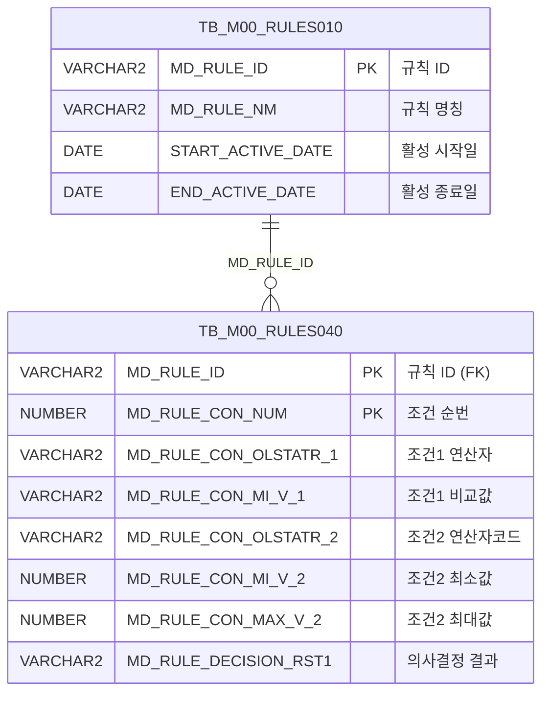

<h1 style="font-size: 40px; text-align: center; font-weight:
   bold; margin: 30px 0;">
  C107000030tab19 레거시 시스템 분석 종합 보고서
</h1>


# 1. 시스템 개요
- **서비스 ID**: C107000030tab19
- **업무명**: 포장재중량 규칙 조회
- **분석 일시**: 2026-03-17 (KST)
- **전체 Activity 수**: 2 (Built-in: 2, Custom: 0)
- **분석자**: Claude Opus 4.6 / Claude Sonnet 4.6
- **분석 도구**: /analyze-service C107000030tab19
- **문서 버전**: 1.0

# 📊 비즈니스 프로세스 분석

## 시스템 목적

C107000030tab19는 C10(도금) 모듈의 포장재중량 규칙 조회 화면이다. 부모 화면 C107000030의 19번째 탭으로, 포장 시 적용되는 포장재 중량 산출 규칙(C10B1081)을 조회하여 표시한다.

규칙 엔진(TB_M00_RULES010/RULES040)에 등록된 C10B1081 규칙의 조건(포장방법, 폭범위, 포장단중, 길이범위)과 의사결정 결과(포장재중량)를 그리드에 표시하며, 연산자 코드를 FUNC_GET_YEONSAN 함수를 통해 사람이 읽을 수 있는 기호(<=값<=, <값< 등)로 변환하여 보여준다.

이 화면은 조회 전용으로 데이터 수정 기능이 없으며, 포장 업무 담당자가 포장재중량 기준을 확인하는 참조용 화면이다.

<!-- 워크플로우 다이어그램 생략: Custom Activity 0개, SELECT 쿼리만 사용, 단순 조회 체인 -->

## 주요 유즈케이스

### UC-01: 포장재중량 규칙 조회
- **Actor**: 포장 업무 담당자 / 오퍼레이터
- **목적**: C10B1081 규칙에 정의된 포장재중량 산출 기준(포장방법, 폭범위, 포장단중, 길이범위별 결과)을 확인

- **전제조건**:
  - 사용자가 시스템에 로그인되어 있음
  - 부모 화면 C107000030에서 tab19 탭이 선택됨
  - TB_M00_RULES010에 C10B1081 규칙이 활성 상태로 등록되어 있음 (START_ACTIVE_DATE <= SYSDATE < END_ACTIVE_DATE)

- **주요 흐름**:
  1. 탭 진입 시 onLoadGrid 이벤트로 자동 데이터 조회 시작
  2. 부모 화면의 C107000030_Form_1 검색 조건을 파라미터로 구성 (uiCommon.parameters4)
  3. C107000030tab19.select 쿼리 실행 — TB_M00_RULES040과 TB_M00_RULES010 조인
  4. FUNC_GET_YEONSAN 함수로 연산자 코드(BETWEEN1~4)를 기호(<=값<=, <값< 등)로 변환
  5. 그리드에 포장재중량 규칙 목록 표시 (13개 컬럼)

- **대체 흐름**:
  - C10B1081 규칙이 비활성(만료)인 경우: 조회 결과 없음
  - 규칙 데이터가 없는 경우: 빈 그리드 표시

- **후행조건**:
  - 포장재중량 규칙이 그리드에 표시됨
  - 사용자가 컨텍스트 메뉴를 통해 엑셀 내보내기 가능

### UC-02: 그리드 컨텍스트 메뉴 활용
- **Actor**: 포장 업무 담당자
- **목적**: 조회된 포장재중량 규칙을 다양한 방식으로 조작 (엑셀 내보내기, 필터링 등)

- **전제조건**:
  - 그리드에 데이터가 조회되어 있음

- **주요 흐름**:
  1. 그리드에서 우클릭하여 컨텍스트 메뉴 표시
  2. 메뉴 항목 선택:
     - move_grid: 컬럼 이동 활성화/비활성화
     - filter_grid: 헤더 메뉴 필터 활성화
     - editable_grid: 편집 모드 토글
     - excel_grid: 엑셀 내보내기 (toExcel)

- **대체 흐름**:
  - 데이터가 없는 상태에서 엑셀 내보내기: 빈 엑셀 파일 생성

- **후행조건**:
  - 선택한 기능이 적용된 상태

### UC-03: 부모 화면 검색 조건 연동 조회
- **Actor**: 포장 업무 담당자
- **목적**: 부모 화면(C107000030)의 검색 조건 변경 시 포장재중량 규칙을 재조회

- **전제조건**:
  - 부모 화면의 검색 폼(C107000030_Form_1)이 존재함

- **주요 흐름**:
  1. 부모 화면에서 검색 조건 변경
  2. find 함수 호출
  3. uiCommon.parameters4('C107000030_Form_1', 'C107000030tab19_Grid_1', customparam + eventName)으로 파라미터 구성
  4. C107000030tab19-service 호출하여 데이터 재조회
  5. 그리드 갱신

- **대체 흐름**:
  - 파라미터 구성 실패: 조회 실패 메시지 표시

- **후행조건**:
  - 변경된 조건에 맞는 데이터가 그리드에 표시됨

---
## 비즈니스 로직 상세

### 1. 연산자 코드 변환 (FUNC_GET_YEONSAN)

- **목적**: 규칙 엔진의 연산자 코드(BETWEEN1~4)를 화면에 표시 가능한 범위 연산 기호로 변환하여 사용자가 조건의 의미를 직관적으로 파악할 수 있도록 함

- **처리 케이스**:

  **[케이스 1: 양쪽 포함 범위]**
  ```
    조건: 연산자 코드 = 'BETWEEN1'
    처리:
      1. UPPER() 적용하여 대문자 변환
      2. '<=값<=' 기호로 변환
      3. 의미: 최소값 이상, 최대값 이하
  ```

  **[케이스 2: 좌포함 우미포함 범위]**
  ```
    조건: 연산자 코드 = 'BETWEEN2'
    처리:
      1. UPPER() 적용하여 대문자 변환
      2. '<=값<' 기호로 변환
      3. 의미: 최소값 이상, 최대값 미만
  ```

  **[케이스 3: 좌미포함 우포함 범위]**
  ```
    조건: 연산자 코드 = 'BETWEEN3'
    처리:
      1. UPPER() 적용하여 대문자 변환
      2. '<값<=' 기호로 변환
      3. 의미: 최소값 초과, 최대값 이하
  ```

  **[케이스 4: 양쪽 미포함 범위]**
  ```
    조건: 연산자 코드 = 'BETWEEN4'
    처리:
      1. UPPER() 적용하여 대문자 변환
      2. '<값<' 기호로 변환
      3. 의미: 최소값 초과, 최대값 미만 (양쪽 미포함)
  ```

  **[케이스 5: 미정의 연산자]**
  ```
    조건: 위 4가지에 해당하지 않는 코드
    처리:
      1. 입력값 그대로 반환
      2. 예외 발생 시 NULL 반환
  ```

### 2. 규칙 엔진 기반 다조건 의사결정 구조

- **목적**: C10B1081 규칙의 4개 조건(포장방법, 폭범위, 포장단중, 길이범위)을 조합하여 포장재중량 결과를 결정하는 의사결정 테이블 구조를 조회

- **처리 케이스**:

  **[케이스 1: 규칙 활성 기간 필터링]**
  ```
    조건: TB_M00_RULES010.MD_RULE_NM = 'C10B1081'
    처리:
      1. START_ACTIVE_DATE <= SYSDATE 확인
      2. SYSDATE < END_ACTIVE_DATE 확인
      3. 활성 규칙의 MD_RULE_ID 추출
      4. RULES040과 조인하여 조건 상세 조회
  ```

  **[각 행의 조건 구조]**
  ```
    조건1 (CON1): 포장방법 — 연산자 (MD_RULE_CON_OLSTATR_1), 비교값 (MD_RULE_CON_MI_V_1)
    조건2 (CON2~MAX2): 폭범위 — 연산자 기호 변환, 최소값/최대값
    조건3 (CON3~MAX3): 포장단중 — 연산자 기호 변환, 최소값/최대값
    조건4 (CON4~MAX4): 길이범위 — 연산자 기호 변환, 최소값/최대값
    결과 (RST1): 포장재중량 — MD_RULE_DECISION_RST1
  ```

---

# 💾 데이터 요구사항

## 핵심 테이블

### 1. TB_M00_RULES010 - (규칙 마스터)
| 컬럼명 | 타입 | PK | 설명 |
|--------|------|----|------|
| MD_RULE_ID | VARCHAR2 | ✅ | 규칙 ID (PK) |
| MD_RULE_NM | VARCHAR2 |  | 규칙 명칭 (예: 'C10B1081') |
| START_ACTIVE_DATE | DATE |  | 규칙 활성 시작일 |
| END_ACTIVE_DATE | DATE |  | 규칙 활성 종료일 |

### 2. TB_M00_RULES040 - (규칙 조건 상세)
| 컬럼명 | 타입 | PK | 설명 |
|--------|------|----|------|
| MD_RULE_ID | VARCHAR2 | ✅ | 규칙 ID (FK → RULES010) |
| MD_RULE_CON_NUM | NUMBER | ✅ | 조건 순번 (SEQ) |
| MD_RULE_CON_OLSTATR_1 | VARCHAR2 |  | 조건1 연산자 (포장방법) |
| MD_RULE_CON_MI_V_1 | VARCHAR2 |  | 조건1 비교값 |
| MD_RULE_CON_OLSTATR_2 | VARCHAR2 |  | 조건2 연산자 코드 (폭범위, BETWEEN1~4) |
| MD_RULE_CON_MI_V_2 | NUMBER |  | 조건2 최소값 (폭범위) |
| MD_RULE_CON_MAX_V_2 | NUMBER |  | 조건2 최대값 (폭범위) |
| MD_RULE_CON_OLSTATR_3 | VARCHAR2 |  | 조건3 연산자 코드 (포장단중) |
| MD_RULE_CON_MI_V_3 | VARCHAR2 |  | 조건3 최소값 (포장단중) |
| MD_RULE_CON_MAX_V_3 | VARCHAR2 |  | 조건3 최대값 (포장단중) |
| MD_RULE_CON_OLSTATR_4 | VARCHAR2 |  | 조건4 연산자 코드 (길이범위, BETWEEN1~4) |
| MD_RULE_CON_MI_V_4 | NUMBER |  | 조건4 최소값 (길이범위) |
| MD_RULE_CON_MAX_V_4 | NUMBER |  | 조건4 최대값 (길이범위) |
| MD_RULE_DECISION_RST1 | VARCHAR2 |  | 의사결정 결과1 (포장재중량) |

## 데이터 플로우

### 1. 조회

```
[포장재중량 규칙 조회]
탭 진입 (자동) 또는 검색 버튼 클릭
→ C107000030tab19.select
  FROM M00APUSER.TB_M00_RULES040 RULES040
  INNER JOIN (서브쿼리) RULES010
    ON RULES010.MD_RULE_ID = RULES040.MD_RULE_ID
  서브쿼리:
    SELECT MD_RULE_ID FROM M00APUSER.TB_M00_RULES010
    WHERE MD_RULE_NM = 'C10B1081'
      AND START_ACTIVE_DATE <= SYSDATE
      AND SYSDATE < END_ACTIVE_DATE
  함수 호출:
    M00APUSER.FUNC_GET_YEONSAN(UPPER(연산자코드)) → CON2, CON3, CON4
→ Grid에 포장재중량 규칙 목록 표시 (SEQ, 조건1~4, 결과)
```

## SQL 일람표

| SQL 이름 | 쿼리 ID | 타입 | 출처 | 테이블 |
|---------|---------|-----|-------|-------|
| 포장재중량 규칙 조회 | C107000030tab19.select | SELECT | Service | TB_M00_RULES040, TB_M00_RULES010 |

## PL/SQL 함수/프로시저

| # | 호출명 | 유형 | 용도 | 상세 분석 |
|---|--------|------|------|----------|
| 1 | FUNC_GET_YEONSAN | 함수 | 연산자 코드(BETWEEN1~4)를 연산 기호(<=값<= 등)로 변환 | [분석 보고서](../../../dbms/M00APUSER/function/FUNC_GET_YEONSAN_analysis_report.md) |

## ER 다이어그램 (핵심 관계)



관계 설명:
- TB_M00_RULES010이 중심 테이블로 규칙 마스터 역할 (활성 기간 관리)
- TB_M00_RULES040은 규칙 조건 상세로, MD_RULE_ID 기반 1:N 관계
- FUNC_GET_YEONSAN 함수는 RULES040의 연산자 코드를 화면 표시용 기호로 변환

---

# 🖥️ 사용자 인터페이스 요구사항

## 화면 레이아웃 상세

### Layout 구조 (initLayout)
```javascript
{
  // 부모 탭(C107000030 tab19) 내부 — 독립 layout 없음
  // flat 구조: Grid + Form + Messagebox 직접 배치
  components: [
    {
      id: "C107000030tab19_Grid_1",
      type: "grid",
      position: { left: 0, top: 0, width: 976, height: 492 }
    },
    {
      id: "C107000030tab19_Form_1",
      type: "form",
      position: { left: 0, top: 450, width: 282, height: 30 },
      note: "Form XML 비어있음 — 검색 조건은 부모 C107000030_Form_1 참조"
    },
    {
      id: "C107000030tab19_messagebox",
      type: "messagebox",
      position: { left: 0, top: 493, width: 976, height: 18 }
    }
  ]
}
```

## 입출력 요소

### Form 컴포넌트
**C107000030tab19_Form_1**
- Form XML이 비어있음 (필드 없음)
- 검색 조건은 부모 화면의 C107000030_Form_1을 공유하여 사용

### Grid 컴포넌트

**C107000030tab19_Grid_1 (포장재중량 규칙)**
- 편집 가능 여부: 아니오 (읽기 전용, 모든 컬럼 ro/ron)
- Split: 0 (고정 컬럼 없음)
- 스마트 렌더링: 활성화
- 컨텍스트 메뉴: 활성화
- 페이지셋: 활성화
- 3단 계층 헤더 구조
- 주요 컬럼 (13개):

  **기본 정보**:
  - SEQ: ro - 조건 순번 (4%, 우측정렬)

  **포장방법 그룹**:
  - CON1: ro - 조건1 포장방법 연산자 (9%, 중앙정렬)
  - MIN1: ro - 조건1 비교값 (8%, 좌측정렬)

  **폭범위 그룹**:
  - CON2: ro - 조건2 연산 기호 (FUNC_GET_YEONSAN 변환) (9%, 중앙정렬)
  - MIN2: ron - 조건2 최소값 (7%, 우측정렬, format: 0000.0)
  - MAX2: ron - 조건2 최대값 (7%, 우측정렬, format: 0000.0)

  **포장단중 그룹**:
  - CON3: ro - 조건3 연산 기호 (FUNC_GET_YEONSAN 변환) (9%, 중앙정렬)
  - MIN3: ro - 조건3 최소값 (7%, 중앙정렬)
  - MAX3: ro - 조건3 최대값 (7%, 중앙정렬)

  **길이범위 그룹**:
  - CON4: ro - 조건4 연산 기호 (FUNC_GET_YEONSAN 변환) (9%, 중앙정렬)
  - MIN4: ron - 조건4 최소값 (7%, 중앙정렬, format: 0000.0)
  - MAX4: ron - 조건4 최대값 (7%, 중앙정렬, format: 0000.0)

  **결과**:
  - RST1: ro - 포장재중량 결과 (*, 중앙정렬)

## 화면 동작 흐름

### 1. 화면 초기 로딩 (탭 진입)
```
1. 부모 화면 C107000030에서 tab19 선택
2. onLoadGrid 이벤트 발생 (onXLEEvent 핸들러)
3. find 함수 자동 호출
4. uiCommon.parameters4('C107000030_Form_1', 'C107000030tab19_Grid_1', customparam + eventName)로 파라미터 구성
5. C107000030tab19-service 호출 (분기 → 조회)
6. C107000030tab19.select 쿼리 실행
7. Grid에 포장재중량 규칙 목록 표시
8. onXLEEvent 핸들러 자동 해제 (detachEvent) — 이후 재진입 시 자동 조회 방지
9. 메시지박스에 조회 결과 건수 표시 (findMessage)
```

### 2. 수동 조회 (부모 화면 검색)
```
1. 부모 화면에서 검색 조건 변경/입력
2. 조회 버튼 클릭 → find 함수 호출
3. uiCommon.parameters4로 부모 Form 파라미터 + Grid ID + 커스텀 파라미터 구성
4. C107000030tab19-service 호출
5. Grid 데이터 갱신
6. findMessage로 조회 결과 메시지 표시
```

### 3. 엑셀 내보내기
```
1. 그리드에서 우클릭 → 컨텍스트 메뉴 표시
2. excel_grid 메뉴 항목 클릭
3. toExcel 호출로 그리드 데이터 엑셀 파일 다운로드
```

## JavaScript 모듈

**C107000030tab19.jsp** (탭 내장 스크립트)
- find(): 포장재중량 규칙 조회 (uiCommon.parameters4로 부모 Form 파라미터 구성 → 서비스 호출)
- add(): 컨텍스트 메뉴 — 새 행 추가 (referenceItem 대상)
- remove(): 컨텍스트 메뉴 — 행 삭제
- copy(): 컨텍스트 메뉴 — 행 클립보드 복사
- undo(): 실행 취소
- redo(): 다시 실행
- onGridContextMenuClick(): 그리드 우클릭 컨텍스트 메뉴 핸들러 (move_grid, filter_grid, editable_grid, excel_grid)
- findMessage(): appMsg 사용자 데이터로 메시지박스 표시 (uiCommon.message)
- onLoadGrid(): 그리드 초기 로드 시 자동 조회 + onXLEEvent 해제

## 주요 이벤트 핸들러

**onLoadGrid (탭 최초 진입 자동 조회)**
- 이벤트 타입: Grid XLE Event (onXLEEvent)
- 처리 내용:
  1. 그리드 초기 로드 감지
  2. find() 호출하여 자동 데이터 조회
  3. detachEvent(onXLE)로 이벤트 핸들러 해제
  4. 이후 탭 재진입 시 자동 조회 발생하지 않음

**onGridContextMenuClick (그리드 컨텍스트 메뉴)**
- 이벤트 타입: Grid Context Menu Click
- 처리 내용:
  1. 클릭된 메뉴 ID 확인
  2. move_grid: enableColumnMove 토글
  3. filter_grid: enableHeaderMenu 활성화
  4. editable_grid: setEditable 토글
  5. excel_grid: toExcel 호출로 엑셀 내보내기

---

# 📌 특이사항 및 주의사항

## 1. 규칙 엔진(Rules Engine) 기반 의사결정 테이블
- **TB_M00_RULES010/040 구조**: 공통 규칙 엔진을 활용하여 포장재중량 기준을 관리한다. 규칙 ID 'C10B1081'로 식별되며, 활성 기간(START_ACTIVE_DATE ~ END_ACTIVE_DATE)으로 규칙 유효성을 관리한다.
- **확장성**: 동일한 규칙 엔진 구조를 C10 모듈의 다른 규칙(tab01~tab18 등)에서도 공유하므로, 규칙 변경 시 영향 범위 확인이 필요하다.

## 2. 부모 화면 Form 의존성
- **검색 조건 공유**: 자체 Form(C107000030tab19_Form_1)은 비어있으며, 부모 화면의 C107000030_Form_1을 참조한다. `uiCommon.parameters4`의 첫 번째 인자로 부모 Form ID를 직접 지정하는 하드코딩 패턴이다.
- **커플링**: 부모 화면의 Form 구조 변경 시 이 탭의 조회 기능에 영향을 줄 수 있다.

## 3. FUNC_GET_YEONSAN 함수 호출 패턴
- **스키마 명시 호출**: `M00APUSER.FUNC_GET_YEONSAN(UPPER(...))` 형태로 M00APUSER 스키마를 명시적으로 지정한다. 다른 탭(tab01, tab02)에서도 동일 함수를 호출하므로 함수 변경 시 전체 탭에 영향이 있다.
- **UPPER() 래핑**: 모든 연산자 코드에 UPPER()를 적용하여 대소문자 무관 비교를 수행한다.

## 4. onXLEEvent 기반 자동 조회 및 일회성 해제
- **onLoadGrid 패턴**: 탭 최초 진입 시 onXLEEvent로 자동 조회를 수행한 후, detachEvent로 핸들러를 해제한다. 이는 탭 전환 시 불필요한 재조회를 방지하는 패턴이지만, 이벤트 해제 시점 관리에 주의가 필요하다.

## 5. 규칙 엔진 서브쿼리 조인
- **인라인 뷰 사용**: TB_M00_RULES010을 서브쿼리로 사용하여 활성 규칙 ID만 추출한 후 RULES040과 조인한다. 이는 ANSI JOIN이 아닌 Oracle 구문의 콤마 조인(,)을 사용하는 레거시 패턴이다.

---

# 📚 참고 문서

- **Query SQL**: `src/query/C107000030tab19-query.glue_sql`
- **Service XML**: `src/service/C107000030tab19-service.xml`
- **JSP**: `WebContents/C107000030tab19.jsp`
- **PL/SQL 분석**: `docs/analysis/dbms/M00APUSER/function/FUNC_GET_YEONSAN_analysis_report.md`
