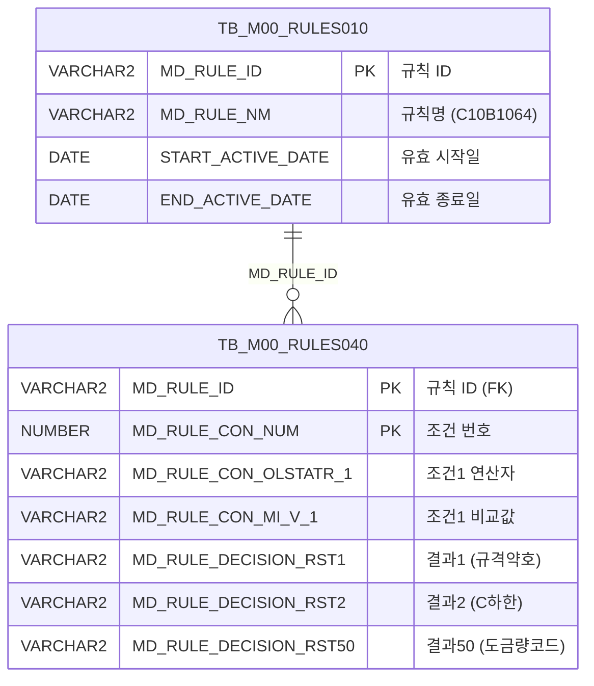

<h1 style="font-size: 40px; text-align: center; font-weight:
   bold; margin: 30px 0;">
  C107000030tab20 레거시 시스템 분석 종합 보고서
</h1>


# 1. 시스템 개요
- **서비스 ID**: C107000030tab20
- **업무명**: 원자재발주기준 조회
- **분석 일시**: 2026-03-17 (KST)
- **전체 Activity 수**: 2개 (Built-in: 2개, Custom: 0개)
- **분석자**: Claude Opus 4.6 / Sonnet 4.6
- **분석 도구**: /analyze-service C107000030tab20
- **문서 버전**: 1.0

# 비즈니스 프로세스 분석

## 시스템 목적

본 서비스는 **원자재발주기준(C10B1064 규칙)** 데이터를 조회하는 읽기 전용 화면이다. C107000030(원자재/발주기준) 탭 화면의 하위 탭(tab20)으로, 원자재 발주 시 적용되는 화학성분 및 기계적 성질의 허용 범위 기준을 조회한다.

규칙 엔진(TB_M00_RULES010/040)에 등록된 'C10B1064' 규칙을 기반으로, 원자재코드/두께그룹/Maker 3가지 조건 조합에 대해 C, Si, Mn, P, S 등 21개 화학원소의 하한/상한값과 YP, TS, EL, HRB 등 기계적 성질 범위, 도금량코드를 매핑하여 표시한다. 상위 탭(C107000030)의 검색 폼을 공유하며, 탭 진입 시 자동으로 데이터를 로드한다.

<!-- 단순 조회 서비스: Custom Activity 0개, SELECT 쿼리만 사용, Router → 단일 조회 Activity → 워크플로우 다이어그램 생략 -->

## 주요 유즈케이스

### UC-01: 원자재발주기준 자동 조회
- **Actor**: 원자재 구매/품질 담당자
- **목적**: 탭 진입 시 상위 폼의 검색 조건을 기반으로 원자재발주기준 데이터를 자동 조회

- **전제조건**:
  - 사용자가 C107000030 화면에 진입하여 로그인 상태
  - 상위 탭의 C107000030_Form_1에 검색 조건이 입력되어 있음
  - TB_M00_RULES010에 'C10B1064' 규칙이 유효기간 내 등록되어 있음

- **주요 흐름**:
  1. 사용자가 C107000030tab20 탭을 클릭하여 진입
  2. onXLEEvent 이벤트가 발생하여 onLoadGrid 함수 호출
  3. 상위 폼(C107000030_Form_1)의 파라미터를 uiCommon.parameters4로 수집
  4. handleDataProcess.do를 통해 C107000030tab20-service 호출 (find 명령)
  5. PosDefaultRouter가 '조회' Activity로 분기
  6. FormSearch가 mesdao를 통해 C107000030tab20.select 쿼리 실행
  7. TB_M00_RULES010에서 'C10B1064' 활성 규칙 ID 조회 후 TB_M00_RULES040과 조인
  8. 조건(3개) + 결과(50개) 컬럼이 Grid에 표시
  9. XLE 이벤트 해제 (재진입 시 자동 조회 방지)
  10. appMsg를 messagebox에 표시

- **대체 흐름**:
  - 'C10B1064' 규칙이 유효기간 외인 경우: 조회 결과 0건, 빈 Grid 표시
  - 상위 폼 파라미터 없는 경우: 전체 규칙 행 조회

- **후행조건**:
  - Grid에 원자재발주기준 데이터가 읽기 전용으로 표시됨
  - 사용자가 컨텍스트 메뉴를 통해 엑셀 내보내기 가능

### UC-02: 조회 조건 변경 후 재조회
- **Actor**: 원자재 구매/품질 담당자
- **목적**: 상위 탭의 검색 조건을 변경한 후 원자재발주기준 데이터를 재조회

- **전제조건**:
  - UC-01이 최소 1회 수행된 상태
  - 상위 탭의 C107000030_Form_1이 접근 가능

- **주요 흐름**:
  1. 사용자가 상위 탭(C107000030)의 검색 폼에서 조건 변경
  2. 조회 버튼 클릭 시 find() 함수 호출
  3. uiCommon.parameters4('C107000030_Form_1', 'C107000030tab20_Grid_1', customparam + eventName)으로 파라미터 구성
  4. Grid 데이터 재로드
  5. findMessage()로 조회 결과 메시지 표시

- **대체 흐름**:
  - 조회 결과 없음: 빈 Grid 및 "조회된 데이터가 없습니다" 메시지 표시

- **후행조건**:
  - 변경된 조건에 맞는 데이터가 Grid에 표시됨

### UC-03: 컨텍스트 메뉴 기능 활용
- **Actor**: 원자재 구매/품질 담당자
- **목적**: Grid의 컨텍스트 메뉴를 통해 컬럼 이동, 필터, 엑셀 내보내기 등 보조 기능 사용

- **전제조건**:
  - Grid에 데이터가 조회되어 있음

- **주요 흐름**:
  1. 사용자가 Grid 영역에서 마우스 우클릭
  2. 컨텍스트 메뉴 표시 (컬럼이동, 헤더필터, 편집가능, 엑셀내보내기)
  3. 원하는 기능 선택
  4. onGridContextMenuClick에서 선택 항목에 따라 처리:
     - move_grid: 컬럼 순서 변경
     - filter_grid: 헤더 필터 토글
     - editable_grid: 편집 가능 모드 토글
     - excel_grid: 엑셀 파일 다운로드

- **대체 흐름**:
  - Grid 데이터 없는 상태에서 엑셀 내보내기: 빈 파일 생성

- **후행조건**:
  - 선택한 기능이 Grid에 적용됨

---
## 비즈니스 로직 상세

### 1. 규칙 엔진 기반 원자재발주기준 매핑

- **목적**: 의사결정 규칙 테이블(RULES040)에서 원자재 발주 시 적용할 화학성분/기계적 성질의 허용 범위를 조건별로 매핑하여 조회
- **처리 케이스**:

  **[케이스 1: 활성 규칙 필터링]**
  ```
    조건: TB_M00_RULES010.MD_RULE_NM = 'C10B1064'
          AND START_ACTIVE_DATE <= SYSDATE
          AND SYSDATE < END_ACTIVE_DATE
    처리:
      1. RULES010에서 활성 상태인 'C10B1064' 규칙의 MD_RULE_ID 추출
      2. 서브쿼리 결과를 RULES040과 INNER JOIN
      3. 유효기간이 지난 규칙은 자동으로 제외됨
  ```

  **[케이스 2: 3조건 → 50결과 매핑 구조]**
  ```
    조건: RULES040의 각 행(MD_RULE_CON_NUM)이 하나의 규칙 조합
    처리:
      1. 조건부 (CON1~CON3, MIN1~MIN3):
         - CON1/MIN1: 원자재코드 연산자/비교값
         - CON2/MIN2: 두께그룹 연산자/비교값
         - CON3/MIN3: 원자재Maker 연산자/비교값
      2. 결과부 (RST1~RST50):
         - RST1: 원자재규격약호
         - RST2~RST3: C(탄소) 하한/상한
         - RST4~RST5: Si(규소) 하한/상한
         - RST6~RST7: Mn(망간) 하한/상한
         - RST8~RST9: P(인) 하한/상한
         - RST10~RST11: S(황) 하한/상한
         - RST12~RST13: Cr(크롬) 하한/상한
         - RST14~RST15: Ni(니켈) 하한/상한
         - RST16~RST17: Cu(구리) 하한/상한
         - RST18~RST19: Al(알루미늄) 하한/상한
         - RST20~RST21: Ti(티타늄) 하한/상한
         - RST22~RST23: Nb(니오븀) 하한/상한
         - RST24~RST25: V(바나듐) 하한/상한
         - RST26~RST27: N(질소) 하한/상한
         - RST28~RST29: Mo(몰리브덴) 하한/상한
         - RST30~RST31: Sn(주석) 하한/상한
         - RST32~RST33: W(텅스텐) 하한/상한
         - RST34~RST35: Co(코발트) 하한/상한
         - RST36~RST37: B(붕소) 하한/상한
         - RST38~RST39: Pb(납) 하한/상한
         - RST40~RST41: Ca(칼슘) 하한/상한
         - RST42~RST43: YP(항복점) 하한/상한
         - RST44~RST45: TS(인장강도) 하한/상한
         - RST46~RST47: EL(연신율) 하한/상한
         - RST48~RST49: HRB(경도) 하한/상한
         - RST50: 도금량코드
  ```

---

# 데이터 요구사항

## 핵심 테이블

### 1. TB_M00_RULES040 - (의사결정 규칙 조건/결과 테이블)
| 컬럼명 | 타입 | PK | 설명 |
|--------|------|----|-----|
| MD_RULE_ID | VARCHAR2 | ✅ | 규칙 ID (RULES010과 조인) |
| MD_RULE_CON_NUM | NUMBER | ✅ | 규칙 조건 번호 (SEQ) |
| MD_RULE_CON_OLSTATR_1 | VARCHAR2 | | 조건1 연산자 (원자재코드) |
| MD_RULE_CON_MI_V_1 | VARCHAR2 | | 조건1 비교값 (원자재코드) |
| MD_RULE_CON_OLSTATR_2 | VARCHAR2 | | 조건2 연산자 (두께그룹) |
| MD_RULE_CON_MI_V_2 | VARCHAR2 | | 조건2 비교값 (두께그룹) |
| MD_RULE_CON_OLSTATR_3 | VARCHAR2 | | 조건3 연산자 (원자재Maker) |
| MD_RULE_CON_MI_V_3 | VARCHAR2 | | 조건3 비교값 (원자재Maker) |
| MD_RULE_DECISION_RST1 | VARCHAR2 | | 결과1 (원자재규격약호) |
| MD_RULE_DECISION_RST2~RST50 | VARCHAR2 | | 결과2~50 (화학성분/기계적성질 하한/상한, 도금량코드) |

### 2. TB_M00_RULES010 - (의사결정 규칙 마스터 테이블)
| 컬럼명 | 타입 | PK | 설명 |
|--------|------|----|-----|
| MD_RULE_ID | VARCHAR2 | ✅ | 규칙 ID |
| MD_RULE_NM | VARCHAR2 | | 규칙명 (예: 'C10B1064') |
| START_ACTIVE_DATE | DATE | | 규칙 유효 시작일 |
| END_ACTIVE_DATE | DATE | | 규칙 유효 종료일 |

## 데이터 플로우

### 1. 조회

```
[원자재발주기준 조회]
탭 진입 (onXLEEvent → onLoadGrid) 또는 조회 버튼 클릭 (find)
→ C107000030tab20.select
  FROM M00APUSER.TB_M00_RULES040 RULES040
  INNER JOIN (SELECT MD_RULE_ID
               FROM M00APUSER.TB_M00_RULES010
              WHERE MD_RULE_NM = 'C10B1064'
                AND START_ACTIVE_DATE <= SYSDATE
                AND SYSDATE < END_ACTIVE_DATE) RULES010
    ON RULES010.MD_RULE_ID = RULES040.MD_RULE_ID
→ 3개 조건 컬럼(CON1~CON3, MIN1~MIN3) + 50개 결과 컬럼(RST1~RST50)
→ Grid에 원자재발주기준 목록 표시
```

## SQL 일람표
| SQL 이름 | 쿼리 ID | 타입 | 출처 | 테이블 |
|---------|---------|-----|-------|-------|
| 원자재발주기준 조회 | C107000030tab20.select | SELECT | Service | TB_M00_RULES040, TB_M00_RULES010 |

## ER 다이어그램 (핵심 관계)



관계 설명:
- **TB_M00_RULES010**이 규칙 마스터로 규칙 ID 및 유효기간을 관리
- **TB_M00_RULES040**은 각 규칙의 조건/결과 행을 저장하며, MD_RULE_ID로 1:N 관계
- M00APUSER 스키마의 공통 규칙 엔진 테이블을 활용

---

# 사용자 인터페이스 요구사항

## 화면 레이아웃 상세

### Layout 구조 (Absolute Positioning)
```javascript
{
  // C107000030 상위 탭의 하위 탭 콘텐츠
  // 절대 위치 기반 레이아웃
  components: [
    {
      id: "C107000030tab20_Grid_1",
      type: "grid",
      position: { left: 0, top: 0, width: 976, height: 492 }
    },
    {
      id: "C107000030tab20_Form_1",
      type: "form",
      position: { left: 0, top: 450, width: 282, height: 30 }
      // 빈 Form - 상위 탭의 C107000030_Form_1을 참조
    },
    {
      id: "C107000030tab20_messagebox",
      type: "messagebox",
      position: { left: 0, top: 493, width: 976, height: 18 }
    }
  ]
}
```

## 입출력 요소

### Form 컴포넌트
**C107000030tab20_Form_1**
- 빈 Form (items 요소만 존재, 필드 없음)
- 검색 조건은 상위 탭(C107000030)의 **C107000030_Form_1**을 공유하여 사용
- uiCommon.parameters4('C107000030_Form_1', 'C107000030tab20_Grid_1', ...)로 크로스탭 참조

### Grid 컴포넌트

**C107000030tab20_Grid_1 (원자재발주기준 목록)**
- 편집 가능 여부: 아니오 (전체 읽기 전용, 모든 컬럼 타입 `ro`)
- Split: 0 (고정 컬럼 없음)
- Smart Rendering: 사용
- 멀티셀렉트: 사용
- 컨텍스트 메뉴: 사용
- 페이지셋: 사용
- 행 높이: 22px
- 헤더: 3행 구조 (그룹명 → 연산/비교값 → 텍스트 필터)
- 주요 컬럼 (57개):

  **조건부 (7개)**:
  - SEQ: ro - 순번 (4%, 우측정렬)
  - CON1: ro - 원자재코드 연산자 (9%, 중앙정렬, 텍스트 필터 없음)
  - MIN1: ro - 원자재코드 비교값 (8%, 좌측정렬, 텍스트 필터 있음)
  - CON2: ro - 두께그룹 연산자 (9%, 중앙정렬, 텍스트 필터 없음)
  - MIN2: ro - 두께그룹 비교값 (7%, 우측정렬, 텍스트 필터 있음)
  - CON3: ro - 원자재Maker 연산자 (9%, 중앙정렬, 텍스트 필터 없음)
  - MIN3: ro - 원자재Maker 비교값 (7%, 중앙정렬, 텍스트 필터 있음)

  **결과부 - 원자재규격약호 (1개)**:
  - RST1: ro - 원자재규격약호 (12%, 중앙정렬)

  **결과부 - 화학성분 하한/상한 (42개)**:
  - RST2: ro - C 하한 (5%, 중앙정렬)
  - RST3: ro - C 상한 (5%, 중앙정렬)
  - RST4: ro - Si 하한 (5%, 중앙정렬)
  - RST5: ro - Si 상한 (5%, 중앙정렬)
  - RST6: ro - Mn 하한 (5%, 중앙정렬)
  - RST7: ro - Mn 상한 (5%, 중앙정렬)
  - RST8: ro - P 하한 (5%, 중앙정렬)
  - RST9: ro - P 상한 (5%, 중앙정렬)
  - RST10: ro - S 하한 (5%, 중앙정렬)
  - RST11: ro - S 상한 (5%, 중앙정렬)
  - RST12: ro - Cr 하한 (5%, 중앙정렬)
  - RST13: ro - Cr 상한 (5%, 중앙정렬)
  - RST14: ro - Ni 하한 (5%, 중앙정렬)
  - RST15: ro - Ni 상한 (5%, 중앙정렬)
  - RST16: ro - Cu 하한 (5%, 중앙정렬)
  - RST17: ro - Cu 상한 (5%, 중앙정렬)
  - RST18: ro - Al 하한 (5%, 중앙정렬)
  - RST19: ro - Al 상한 (5%, 중앙정렬)
  - RST20: ro - Ti 하한 (5%, 중앙정렬)
  - RST21: ro - Ti 상한 (5%, 중앙정렬)
  - RST22: ro - Nb 하한 (5%, 중앙정렬)
  - RST23: ro - Nb 상한 (5%, 중앙정렬)
  - RST24: ro - V 하한 (5%, 중앙정렬)
  - RST25: ro - V 상한 (5%, 중앙정렬)
  - RST26: ro - N 하한 (5%, 중앙정렬)
  - RST27: ro - N 상한 (5%, 중앙정렬)
  - RST28: ro - Mo 하한 (5%, 중앙정렬)
  - RST29: ro - Mo 상한 (5%, 중앙정렬)
  - RST30: ro - Sn 하한 (5%, 중앙정렬)
  - RST31: ro - Sn 상한 (5%, 중앙정렬)
  - RST32: ro - W 하한 (5%, 중앙정렬)
  - RST33: ro - W 상한 (5%, 중앙정렬)
  - RST34: ro - Co 하한 (5%, 중앙정렬)
  - RST35: ro - Co 상한 (5%, 중앙정렬)
  - RST36: ro - B 하한 (5%, 중앙정렬)
  - RST37: ro - B 상한 (5%, 중앙정렬)
  - RST38: ro - Pb 하한 (5%, 중앙정렬)
  - RST39: ro - Pb 상한 (5%, 중앙정렬)
  - RST40: ro - Ca 하한 (5%, 중앙정렬)
  - RST41: ro - Ca 상한 (5%, 중앙정렬)

  **결과부 - 기계적 성질 하한/상한 (8개)**:
  - RST42: ro - YP(항복점) 하한 (5%, 중앙정렬)
  - RST43: ro - YP(항복점) 상한 (5%, 중앙정렬)
  - RST44: ro - TS(인장강도) 하한 (5%, 중앙정렬)
  - RST45: ro - TS(인장강도) 상한 (5%, 중앙정렬)
  - RST46: ro - EL(연신율) 하한 (5%, 중앙정렬)
  - RST47: ro - EL(연신율) 상한 (5%, 중앙정렬)
  - RST48: ro - HRB(경도) 하한 (5%, 중앙정렬)
  - RST49: ro - HRB(경도) 상한 (5%, 중앙정렬)

  **결과부 - 도금량코드 (1개)**:
  - RST50: ro - 도금량코드 (5%, 중앙정렬)

## 화면 동작 흐름

### 1. 화면 초기 로딩 (탭 진입)
```
1. 사용자가 C107000030 화면에서 tab20(원자재발주기준) 탭 클릭
2. onXLEEvent 이벤트 발생 → onLoadGrid() 호출
3. uiCommon.parameters4('C107000030_Form_1', 'C107000030tab20_Grid_1', customparam + 'find')
   → 상위 탭의 검색 폼 파라미터를 수집
4. handleDataProcess.do 호출 → C107000030tab20-service → 분기 → 조회 Activity
5. C107000030tab20.select 실행 → Grid에 데이터 바인딩
6. detachEvent(xleEvent_id)로 XLE 이벤트 해제 (탭 재진입 시 자동 조회 방지)
7. findMessage()로 appMsg 메시지를 messagebox에 표시
```

### 2. 조건 변경 후 재조회
```
1. 사용자가 상위 탭(C107000030)의 C107000030_Form_1에서 검색 조건 변경
2. 조회 버튼 클릭 → find() 함수 호출
3. uiCommon.parameters4('C107000030_Form_1', 'C107000030tab20_Grid_1', customparam + eventName)
   → 변경된 검색 조건 수집
4. handleDataProcess.do → C107000030tab20-service 호출
5. C107000030tab20.select 재실행
6. Grid 데이터 갱신
7. findMessage()로 결과 메시지 표시
```

### 3. 컨텍스트 메뉴 활용
```
1. Grid 영역에서 마우스 우클릭
2. 컨텍스트 메뉴 표시:
   - move_grid: 컬럼 이동
   - filter_grid: 헤더 필터 ON/OFF
   - editable_grid: 편집 가능 모드 토글
   - excel_grid: 엑셀 내보내기
3. onGridContextMenuClick(id, zoneId, cas) 핸들러에서 switch 처리
4. 선택된 기능 실행
```

## JavaScript 모듈

**C107000030tab20.jsp** (인라인 스크립트)
- find(): 상위 폼 파라미터로 Grid 데이터 조회 (uiCommon.parameters4('C107000030_Form_1', 'C107000030tab20_Grid_1', customparam + eventName))
- add(): Grid에 새 행 추가
- remove(): Grid에서 행 삭제
- copy(): Grid 행 클립보드 복사
- undo(): 실행 취소
- redo(): 다시 실행
- onGridContextMenuClick(id, zoneId, cas): 컨텍스트 메뉴 핸들러 (move_grid, filter_grid, editable_grid, excel_grid)
- findMessage(): Grid 로드 완료 후 appMsg 사용자 데이터를 messagebox에 표시
- onLoadGrid(): XLE 이벤트 핸들러, 탭 초기 진입 시 자동 조회 수행 후 이벤트 해제

## 주요 이벤트 핸들러

**onXLEEvent (탭 진입 이벤트)**
- 이벤트 타입: Grid XLE (Extra Layout Event)
- 처리 내용:
  1. onLoadGrid() 호출
  2. 상위 폼(C107000030_Form_1)의 파라미터로 Grid 자동 조회
  3. 조회 완료 후 XLE 이벤트 해제 (detachEvent)
  4. 이후 탭 재진입 시에는 자동 조회하지 않음

**onGridContextMenuClick (컨텍스트 메뉴 클릭)**
- 이벤트 타입: Grid Context Menu Click
- 처리 내용:
  1. 클릭된 메뉴 항목 ID 확인
  2. move_grid: 컬럼 드래그 이동 활성화
  3. filter_grid: 헤더 행 텍스트 필터 토글
  4. editable_grid: Grid 편집 모드 토글
  5. excel_grid: 엑셀 파일 내보내기

---

# 특이사항 및 주의사항

## 1. 크로스탭 폼 참조 패턴
- C107000030tab20은 자체 Form이 비어있으며, 상위 탭(C107000030)의 **C107000030_Form_1**을 크로스탭 참조하여 검색 조건을 공유한다.
- `uiCommon.parameters4('C107000030_Form_1', 'C107000030tab20_Grid_1', ...)`로 다른 탭의 폼 파라미터를 직접 사용하는 비표준 패턴이다.
- 상위 탭의 폼 구조가 변경되면 본 탭의 조회 기능에도 영향을 미친다.

## 2. XLE 이벤트 1회성 자동 조회 패턴
- 탭 최초 진입 시 onXLEEvent → onLoadGrid로 자동 조회를 수행한 후 `detachEvent`로 이벤트를 해제한다.
- 이 패턴은 탭 재진입 시 불필요한 조회를 방지하기 위한 것이나, 사용자가 탭을 떠났다 돌아올 때 데이터가 갱신되지 않을 수 있다.

## 3. 규칙 엔진 의존성 (C10B1064)
- 'C10B1064' 규칙명이 SQL에 하드코딩되어 있다. 규칙명이 변경되면 쿼리 수정이 필요하다.
- 규칙 유효기간(START_ACTIVE_DATE ~ END_ACTIVE_DATE)으로 활성 규칙을 필터링하므로, 유효기간이 만료된 규칙은 조회되지 않는다.
- M00APUSER 스키마의 공통 규칙 엔진 테이블을 사용하므로, 타 모듈과 규칙 테이블을 공유한다.

## 4. 대규모 컬럼 구조 (57개 컬럼)
- Grid에 57개 컬럼이 존재하며, 모두 읽기 전용이다. 가로 스크롤이 필수적인 넓은 레이아웃이다.
- RST1~RST50의 50개 결과 컬럼은 범용 의사결정 테이블의 구조를 그대로 반영한 것으로, 컬럼명만으로는 비즈니스 의미를 파악하기 어렵다.
- 헤더 3행 구조로 그룹 헤더(원소명), 하위 헤더(하한/상한), 텍스트 필터를 구분한다.

## 5. Oracle Implicit Join 구문 사용
- SQL에서 ANSI JOIN이 아닌 Oracle 전통 방식의 Comma Join + WHERE 절을 사용한다 (`FROM RULES040, (SELECT ...) RULES010 WHERE ...`).
- 서브쿼리를 인라인 뷰로 사용하여 활성 규칙 ID를 필터링하는 패턴이다.

---

# 참고 문서

- **Query SQL**: `src/query/C107000030tab20-query.glue_sql`
- **Service XML**: `src/service/C107000030tab20-service.xml`
- **JSP**: `WebContents/C107000030tab20.jsp`
- **Grid XML**: `WebContents/header/kr/C107000030tab20/C107000030tab20_Grid_1.xml`
- **Form XML**: `WebContents/header/kr/C107000030tab20/C107000030tab20_Form_1.xml`
