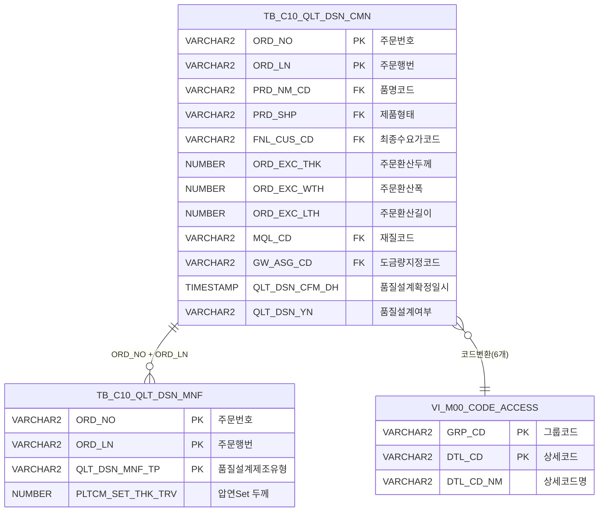

<h1 style="font-size: 40px; text-align: center; font-weight:
   bold; margin: 30px 0;">
  C107000040 레거시 시스템 분석 종합 보고서
</h1>


# 1. 시스템 개요
- **서비스 ID**: C107000040
- **업무명**: 품질설계검색결과상세조회
- **분석 일시**: 2026-03-17 (KST)
- **전체 Activity 수**: 2개 (Built-in 2개, Custom 0개)
- **분석자**: Claude Opus 4.6 / Sonnet (UI)
- **분석 도구**: /analyze-service C107000040
- **문서 버전**: 1.0

# 📊 비즈니스 프로세스 분석

## 시스템 목적

품질설계검색결과상세조회(C107000040) 화면은 품질설계 확정 내역을 다양한 조건으로 검색하여 결과를 상세 조회하는 서비스이다. 주문번호, 품명, 재질, 도금량, 엠보스, 조도, 스팽글, 후처리 등 제품 사양 조건과 설계확정일자 범위, 등록자, 압연Set 범위, 제품폭 범위 등 다양한 필터를 제공한다.

조회 결과는 주문번호, 행번, 품명, 제품유형, 최종수요가, 두께, 폭, 압연Set, 길이, 재질코드, 도금량, 설계확정일시 등 12개 컬럼으로 구성된 그리드에 표시된다. 그리드 행을 더블클릭하면 해당 주문의 품질설계상세(C104000020) 화면으로 이동하여 설계 내용을 상세히 확인할 수 있다.

이 화면은 품질설계 담당자가 설계 확정 이력을 검색하고, 특정 주문의 설계 결과를 빠르게 찾아 상세 내용을 확인하는 용도로 사용된다. 팝업 형태로 동작하며(닫기 버튼 존재), 다른 화면에서 호출되어 검색 결과를 제공하는 보조 조회 화면이다.

## 주요 유즈케이스

### UC-01: 품질설계 확정 내역 조회
- **Actor**: 품질설계 담당자
- **목적**: 다양한 제품 사양 조건과 설계확정일자 범위로 품질설계 확정 내역을 검색하여 대상 주문을 파악

- **전제조건**:
  - 사용자가 시스템에 로그인되어 있음
  - 품질설계 확정 데이터가 존재함 (TB_C10_QLT_DSN_CMN, TB_C10_QLT_DSN_MNF)

- **주요 흐름**:
  1. 화면 진입 시 설계확정일자 기본값 자동 설정 (시작일/종료일)
  2. 마스터 콤보(품명, 재질, 유형, 수지, 엠보스, 조도, 스팽글, 후처리, 도금량) 자동 로드
  3. 그리드 로드 이벤트(onGridLoadEvent)에서 자동 조회 실행
  4. C107000040.select 쿼리 실행 - TB_C10_QLT_DSN_CMN과 TB_C10_QLT_DSN_MNF 조인 조회
  5. 조회 결과를 Grid에 표시 (주문번호, 행번, 품명, 제품유형 등 12개 컬럼)

- **대체 흐름**:
  - 조건에 맞는 데이터 없음: 빈 그리드 표시
  - 날짜 범위 무효: 날짜 유효성 검증 실패 시 조회 차단

- **후행조건**:
  - 조건에 맞는 품질설계 확정 목록이 그리드에 표시됨
  - 사용자가 특정 주문을 선택하여 상세 화면으로 이동할 수 있는 상태

### UC-02: 조건 변경 재조회
- **Actor**: 품질설계 담당자
- **목적**: 검색 조건을 변경하여 원하는 품질설계 확정 내역을 필터링

- **전제조건**:
  - 화면이 초기 로딩 완료된 상태
  - 마스터 콤보가 정상 로드됨

- **주요 흐름**:
  1. 사용자가 설계확정일자 범위, 품명, 재질, 도금량 등 검색 조건 입력/선택
  2. 품명(PRD_NM_CD_NM) 콤보 선택 변경 시 도금량 콤보 카테고리 동적 변경
     - G/3/J/6 → SG0000, L/4 → SL0000, E/2 → SE0000
  3. 압연Set 범위(시작~종료), 제품폭 범위(시작~종료) 수치 입력
  4. 조회 버튼 클릭
  5. 날짜 유효성 검증 수행
  6. C107000040.select 쿼리 재실행 (변경된 조건 파라미터 적용)
  7. 그리드 데이터 갱신

- **대체 흐름**:
  - 날짜 유효성 검증 실패: 조회 미실행, 에러 메시지 표시
  - 도금량 콤보 카테고리 매핑 불일치: 기본 카테고리 적용

- **후행조건**:
  - 변경된 조건에 맞는 결과가 그리드에 표시됨

### UC-03: 품질설계 상세 화면 이동
- **Actor**: 품질설계 담당자
- **목적**: 검색 결과에서 특정 주문의 품질설계 상세 정보를 확인

- **전제조건**:
  - 그리드에 조회 결과가 표시된 상태
  - 이동 대상 주문이 존재함

- **주요 흐름**:
  1. 그리드 행 더블클릭
  2. 선택된 행의 ORD_NO(주문번호), ORD_LN(행번) 추출
  3. parent.newRemoveOpenTab 호출로 C104000020 화면 열기
  4. ORD_NO, ORD_LN 파라미터 전달하여 상세 화면 자동 조회

- **대체 흐름**:
  - 대상 화면 로드 실패: 에러 처리

- **후행조건**:
  - C104000020(품질설계상세) 화면이 열리고 해당 주문 정보가 표시됨

---
## 비즈니스 로직 상세

### 1. 다중 코드값 → 의미명 변환

- **목적**: 품질설계 테이블의 코드값을 사람이 읽을 수 있는 의미명으로 변환하여 조회 결과 표시
- **처리 케이스**:

  **[케이스 1: 스칼라 서브쿼리 기반 코드 변환]**
  ```
    조건: 조회 결과의 각 코드 컬럼에 대해 VI_M00_CODE_ACCESS 뷰에서 코드명 조회
    처리:
      1. PRD_NM_CD (품명코드) → GRP_CD 조건으로 코드명 변환
      2. PRD_SHP (제품유형) → GRP_CD 조건으로 코드명 변환
      3. FNL_CUS_CD (최종수요가코드) → GRP_CD 조건으로 코드명 변환
      4. MQL_CD (재질코드) → GRP_CD 조건으로 코드명 변환
      5. GW_ASG_CD (도금량지정코드) → GRP_CD 조건으로 코드명 변환
      6. QLT_DSN_YN (품질설계여부) → GRP_CD 조건으로 코드명 변환
    방식: SELECT (SELECT DTL_CD_NM FROM VI_M00_CODE_ACCESS WHERE GRP_CD = '[그룹코드]' AND DTL_CD = A.컬럼) 패턴
  ```

  **[케이스 2: 등록자 이름 역변환]**
  ```
    조건: ORD_RGS_PRS_NAME 파라미터에 이름이 입력된 경우
    처리:
      1. FN_CAST_USER_ID 함수로 사용자 이름을 사용자 ID로 변환
      2. 변환된 ID로 ORD_RGS_PRS 컬럼 필터링
  ```

### 2. 도금량 콤보 동적 카테고리 변경

- **목적**: 품명 선택에 따라 도금량 콤보의 마스터 코드 카테고리를 동적으로 변경
- **처리 케이스**:

  **[케이스 1: 품명 코드별 카테고리 매핑]**
  ```
    조건: 품명(PRD_NM_CD_NM) 콤보 선택 변경 시
    처리:
      1. 선택된 품명 코드의 첫 글자 확인
      2. G, 3, J, 6 → SG0000 카테고리 적용 (아연도금 계열)
      3. L, 4 → SL0000 카테고리 적용 (알루미늄도금 계열)
      4. E, 2 → SE0000 카테고리 적용 (전기도금 계열)
      5. 해당 카테고리의 마스터 코드 목록으로 도금량 콤보 재로드
  ```

### 3. 날짜 범위 및 수치 범위 조건 필터링

- **목적**: 설계확정일시, 압연Set, 제품폭의 시작~종료 범위 조건으로 정밀 필터링
- **처리 케이스**:

  **[케이스 1: 설계확정일시 범위]**
  ```
    조건: QLT_DSN_CFM_DH_STR, QLT_DSN_CFM_DH_END 파라미터 존재 (필수)
    처리:
      1. TO_DATE(:QLT_DSN_CFM_DH_STR, 'YYYY-MM-DD') ~ TO_DATE(:QLT_DSN_CFM_DH_END, 'YYYY-MM-DD') + 1
      2. BETWEEN 연산자로 확정일시 범위 필터링
  ```

  **[케이스 2: 압연Set 두께 범위]**
  ```
    조건: PLTCM_SET_THK_TRV_STR 또는 PLTCM_SET_THK_TRV_END 파라미터 존재 시 (선택)
    처리:
      1. B.PLTCM_SET_THK_TRV >= :PLTCM_SET_THK_TRV_STR (시작값 있을 때)
      2. B.PLTCM_SET_THK_TRV <= :PLTCM_SET_THK_TRV_END (종료값 있을 때)
  ```

  **[케이스 3: 제품폭 범위]**
  ```
    조건: ORD_EXC_WTH_STR 또는 ORD_EXC_WTH_END 파라미터 존재 시 (선택)
    처리:
      1. A.ORD_EXC_WTH >= :ORD_EXC_WTH_STR (시작값 있을 때)
      2. A.ORD_EXC_WTH <= :ORD_EXC_WTH_END (종료값 있을 때)
  ```

### 4. 품질설계 제조유형 필터 조건

- **목적**: 품질설계 제조 테이블 조인 시 제조유형 '1'(기본 제조유형)만 필터링
- **처리 케이스**:

  **[케이스 1: 제조유형 고정 필터]**
  ```
    조건: TB_C10_QLT_DSN_MNF 조인 시
    처리:
      1. B.QLT_DSN_MNF_TP = '1' 조건으로 기본 제조유형만 조인
      2. 다른 제조유형(2, 3 등)은 조회 대상에서 제외
  ```

---

# 💾 데이터 요구사항

## 핵심 테이블

### 1. TB_C10_QLT_DSN_CMN - (품질설계 공통 정보)
| 컬럼명 | 타입 | PK | 설명 |
|--------|------|----|-----|
| ORD_NO | VARCHAR2 | ✅ | 주문번호 |
| ORD_LN | VARCHAR2 | ✅ | 주문행번 |
| PRD_NM_CD | VARCHAR2 | | 품명코드 (FK → VI_M00_CODE_ACCESS) |
| PRD_SHP | VARCHAR2 | | 제품형태 (FK → VI_M00_CODE_ACCESS) |
| FNL_CUS_CD | VARCHAR2 | | 최종수요가코드 (FK → VI_M00_CODE_ACCESS) |
| ORD_EXC_THK | NUMBER | | 주문환산두께 |
| ORD_EXC_WTH | NUMBER | | 주문환산폭 |
| ORD_EXC_LTH | NUMBER | | 주문환산길이 |
| MQL_CD | VARCHAR2 | | 재질코드 (FK → VI_M00_CODE_ACCESS) |
| GW_ASG_CD | VARCHAR2 | | 도금량지정코드 (FK → VI_M00_CODE_ACCESS) |
| QLT_DSN_CFM_DH | TIMESTAMP | | 품질설계확정일시 |
| QLT_DSN_YN | VARCHAR2 | | 품질설계여부 |

### 2. TB_C10_QLT_DSN_MNF - (품질설계 제조 정보)
| 컬럼명 | 타입 | PK | 설명 |
|--------|------|----|-----|
| ORD_NO | VARCHAR2 | ✅ | 주문번호 (FK → TB_C10_QLT_DSN_CMN) |
| ORD_LN | VARCHAR2 | ✅ | 주문행번 (FK → TB_C10_QLT_DSN_CMN) |
| QLT_DSN_MNF_TP | VARCHAR2 | ✅ | 품질설계제조유형 ('1'=기본) |
| PLTCM_SET_THK_TRV | NUMBER | | 압연Set 두께 |

### 3. VI_M00_CODE_ACCESS - (공통코드 뷰, M00APUSER 스키마)
| 컬럼명 | 타입 | PK | 설명 |
|--------|------|----|-----|
| GRP_CD | VARCHAR2 | ✅ | 그룹코드 |
| DTL_CD | VARCHAR2 | ✅ | 상세코드 |
| DTL_CD_NM | VARCHAR2 | | 상세코드명 |

## 데이터 플로우

### 1. 조회
```
[품질설계 확정 내역 조회]
화면 진입 (또는 조회 버튼 클릭)
→ C107000040.select
  FROM TB_C10_QLT_DSN_CMN A
  INNER JOIN TB_C10_QLT_DSN_MNF B ON A.ORD_NO = B.ORD_NO AND A.ORD_LN = B.ORD_LN AND B.QLT_DSN_MNF_TP = '1'
  + 6개 스칼라 서브쿼리 (VI_M00_CODE_ACCESS 뷰에서 코드명 변환)
  WHERE A.QLT_DSN_CFM_DH BETWEEN TO_DATE(:시작일) AND TO_DATE(:종료일) + 1
    AND (선택 조건: 품명, 재질, 유형, 수지, 도금량, 엠보스, 조도, 스팽글, 후처리, 등록자, 압연Set 범위, 제품폭 범위)
→ Grid에 12개 컬럼 목록 표시
```

## SQL 일람표
| SQL 이름 | 쿼리 ID | 타입 | 출처 | 테이블 |
|---------|---------|-----|-------|-------|
| 품질설계결과상세 조회 | C107000040.select | SELECT | Service | TB_C10_QLT_DSN_CMN, TB_C10_QLT_DSN_MNF, VI_M00_CODE_ACCESS |

## ER 다이어그램 (핵심 관계)



관계 설명:
- TB_C10_QLT_DSN_CMN이 중심 테이블로 주문 기본 정보 보유
- TB_C10_QLT_DSN_MNF: ORD_NO + ORD_LN 기반 1:N 관계 (제조유형별 설계 정보)
- VI_M00_CODE_ACCESS: 6개 코드 컬럼(PRD_NM_CD, PRD_SHP, FNL_CUS_CD, MQL_CD, GW_ASG_CD, QLT_DSN_YN)에 대한 스칼라 서브쿼리 코드 변환

---

# 🖥️ 사용자 인터페이스 요구사항

## 화면 레이아웃 상세

### Layout 구조 (absolute positioning)
```javascript
{
  itemType: "absolute",
  components: [
    {
      id: "C107000040_Form_1",
      type: "form",
      position: { left: 0, top: 0 },
      size: { width: 981, height: 63 }
    },
    {
      id: "C107000040_Grid_1",
      type: "grid",
      position: { left: -1, top: 64 },
      size: { width: 980, height: 511 }
    },
    {
      id: "C107000040_messagebox",
      type: "messagebox",
      position: { left: -1, top: 567 },
      size: { width: 980, height: 19 }
    }
  ]
}
```

## 입출력 요소

### Form 컴포넌트
**C107000040_Form_1** (2행 검색 폼, 총 28개 필드)

- **Row 1 (검색 조건 상단)**:
  - QLT_DSN_CFM_DH_STR: calendar - 설계확정일자 시작 (필수, 배경색 #FFFFC0, 너비 65px)
  - QLT_DSN_CFM_DH_END: calendar - 설계확정일자 종료 (필수, 배경색 #FFFFC0, 너비 65px)
  - GW_ASG_CD_NM: combo - 도금량 (동적 카테고리: SG0000/SL0000/SE0000, 품명 연동)
  - GW_ASG_CD: hidden - 도금량코드
  - MQL_CD_NM: combo - 재질 (마스터: SZ0000, 코드표시)
  - MQL_CD: hidden - 재질코드
  - PRD_SHP_NM: combo - 유형 (마스터: SZ0000, 코드표시)
  - PRD_SHP: hidden - 유형코드
  - RSN_TP_NM: combo - 수지 (마스터: SZ0000, 코드표시)
  - RSN_TP: hidden - 수지코드
  - ORD_RGS_PRS_NAME: input - 등록자 (너비 50px, 배경색 #FFFFC0)
  - find: button - 조회 (초기 disabled)
  - winClose: button - 닫기

- **Row 2 (검색 조건 하단)**:
  - PRD_NM_CD_NM: combo - 품명 (마스터: SZ0000, 코드표시, 도금량 카테고리 연동)
  - PRD_NM_CD: hidden - 품명코드
  - PLTCM_SET_THK_TRV_STR: input - 압연Set 시작 (너비 45px, 최대 6자, 우측정렬)
  - PLTCM_SET_THK_TRV_END: input - 압연Set 종료 (너비 45px, 우측정렬)
  - ORD_EXC_WTH_STR: input - 제품폭 시작 (너비 45px, 최대 6자, 우측정렬)
  - ORD_EXC_WTH_END: input - 제품폭 종료 (너비 45px, 우측정렬)
  - EMBS_CD_NM: combo - 엠보스 (마스터: SZ0000, 코드표시)
  - EMBS_CD: hidden - 엠보스코드
  - ORD_ROU_CD_NM: combo - 조도 (마스터: SZ0000, 코드표시)
  - ORD_ROU_CD: hidden - 조도코드
  - ORD_SPNL_TP_NM: combo - 스팽글 (마스터: SZ0000, 코드표시)
  - ORD_SPNL_TP: hidden - 스팽글코드
  - ORD_SUR_HND_CD_NM: combo - 후처리 (마스터: SZ0000, 코드표시)
  - ORD_SUR_HND_CD: hidden - 후처리코드

### Grid 컴포넌트

**C107000040_Grid_1 (품질설계 결과 목록)**
- 편집 가능 여부: 아니오 (읽기 전용)
- Split: 없음
- Smart Rendering: 활성화
- 컬럼 너비 단위: % (colwidthUnit)
- Context Menu: 활성화 (컬럼이동, 필터, 편집 토글, 엑셀 내보내기)
- 주요 컬럼 (12개):

  **기본 정보**:
  - ORD_NO: ro - 주문번호 (8%, 중앙정렬, 문자정렬)
  - ORD_LN: ro - 행번 (3%, 중앙정렬, 숫자정렬)

  **제품 사양 정보**:
  - PRD_NM_CD: ro - 품명 (7%, 좌측정렬, 문자정렬)
  - PRD_SHP: ro - 제품유형 (7%, 좌측정렬, 문자정렬)
  - FNL_CUS_CD: ro - 최종수요가 (18%, 좌측정렬, 문자정렬)

  **수치 정보**:
  - ORD_EXC_THK: ron - 두께 (5%, 중앙정렬, 포맷 00.000, 숫자정렬)
  - ORD_EXC_WTH: ron - 폭 (5%, 중앙정렬, 포맷 0,000.0, 숫자정렬)
  - PLTCM_SET_THK_TRV: ron - 압연Set (6%, 중앙정렬, 포맷 00.000, 숫자정렬)
  - ORD_EXC_LTH: ron - 길이 (6%, 중앙정렬, 포맷 0,000.0, 숫자정렬)

  **코드/일시 정보**:
  - MQL_CD: ro - 재질코드 (12%, 좌측정렬, 문자정렬)
  - GW_ASG_CD: ro - 도금량 (11%, 좌측정렬, 정렬 불가)
  - QLT_DSN_CFM_DH: ro - 설계확정일시 (나머지 *, 중앙정렬, 날짜정렬)

## 화면 동작 흐름

### 1. 화면 초기 로딩
```
1. 화면 진입 (팝업 형태)
2. onFormLoadEvent 실행
   - 설계확정일자 기본값 설정 (시작일/종료일)
   - 8개 마스터 콤보 로드 (재질, 유형, 수지, 엠보스, 조도, 스팽글, 후처리: SZ0000 카테고리)
   - 품명 콤보 로드 (SZ0000)
   - 도금량 콤보 초기 카테고리 설정
3. 품명(PRD_NM_CD_NM) 콤보에 onSelectionChange 이벤트 바인딩
   - 선택값에 따라 도금량 카테고리 동적 변경 (SG0000/SL0000/SE0000)
4. onGridLoadEvent 실행
   - Form에서 날짜 파라미터 취합
   - C107000040.select 쿼리 자동 실행
   - Grid에 초기 조회 결과 표시
5. 메시지박스 초기화
```

### 2. 조건 변경 후 재조회
```
1. 사용자가 검색 조건 변경
   - 설계확정일자 범위 변경 (calendar)
   - 콤보 선택 변경 (품명, 재질, 유형, 수지, 도금량, 엠보스, 조도, 스팽글, 후처리)
   - 수치 범위 입력 (압연Set 시작~종료, 제품폭 시작~종료)
   - 등록자명 입력
2. 조회(find) 버튼 클릭
3. 날짜 유효성 검증 (시작일 ≤ 종료일)
4. Form 파라미터 수집 → C107000040-service 호출 (basicGridData.do)
5. C107000040.select 쿼리 실행 (16개 바인드 파라미터)
6. Grid 데이터 갱신
7. 메시지박스에 조회 결과 건수 표시 (findMessage)
```

### 3. 품질설계 상세 화면 이동
```
1. Grid 행 더블클릭 (doOnRowDblClicked)
2. 선택된 행의 ORD_NO(주문번호), ORD_LN(행번) 추출
3. parent.newRemoveOpenTab 호출
   - 대상 화면: C104000020 (품질설계상세)
   - 전달 파라미터: ORD_NO, ORD_LN
4. C104000020 화면 열기 및 해당 주문 자동 조회
```

## JavaScript 모듈

**C107000040.jsp** (메인 화면 스크립트, JSP 내장)
- onFormLoadEvent(): 폼 로드 시 초기값 설정 (날짜 기본값, 마스터 콤보 로드, 품명-도금량 카테고리 연동)
- onGridLoadEvent(): 그리드 로드 후 초기 조회 실행 (Form 날짜 파라미터 수집 → 데이터 로드)
- find(): 조회 버튼 클릭 시 날짜 유효성 검증 후 그리드 데이터 로드
- doOnRowDblClicked(): 행 더블클릭 시 C104000020 탭 열기 (parent.newRemoveOpenTab)
- findMessage(): 그리드 appMsg 사용자 데이터를 메시지박스에 표시
- save(): 그리드 저장 (sendGrid)
- refresh(): 그리드 새로고침 (데이터 초기화 후 재조회)

## 주요 이벤트 핸들러

**onFormLoadEvent (폼 로드)**
- 이벤트 타입: onXLEEvent
- 처리 내용:
  1. 설계확정일자 시작/종료 기본값 설정
  2. 8개 마스터 콤보 데이터 로드 (SZ0000 카테고리)
  3. 품명 콤보 onSelectionChange 이벤트 바인딩
  4. 품명 선택 시 도금량 콤보 카테고리 동적 변경 (G/3/J/6→SG0000, L/4→SL0000, E/2→SE0000)

**doOnRowDblClicked (행 더블클릭)**
- 이벤트 타입: rowDblClicked
- 처리 내용:
  1. 클릭된 행의 ORD_NO, ORD_LN 추출
  2. parent.newRemoveOpenTab("C104000020", {ORD_NO, ORD_LN}) 호출
  3. C104000020 품질설계상세 화면 열기

**find (조회)**
- 이벤트 타입: button.find 클릭
- 처리 내용:
  1. 설계확정일자 시작/종료 유효성 검증
  2. 검증 통과 시 Form 파라미터 수집
  3. C107000040-service 서비스 호출 (basicGridData.do)
  4. Grid 데이터 바인딩

**품명 콤보 선택 변경**
- 이벤트 타입: combo.PRD_NM_CD_NM.onSelectionChange
- 처리 내용:
  1. 선택된 품명 코드값 확인
  2. 코드 첫 글자에 따라 도금량 콤보 카테고리 결정
  3. 도금량 콤보 목록 재로드

---

# 📌 특이사항 및 주의사항

## 1. 도금량 콤보 동적 카테고리 연동
- **품명-도금량 연동 로직**: 품명 콤보 선택에 따라 도금량 콤보의 마스터 코드 카테고리가 동적으로 변경됨 (G/3/J/6→SG0000, L/4→SL0000, E/2→SE0000). 품명과 도금량 간의 업무적 종속 관계를 반영한 것으로, 신규 품명 코드 추가 시 카테고리 매핑 규칙도 함께 업데이트해야 함

## 2. 팝업 화면 특성
- **winClose 버튼**: 이 화면은 팝업으로 동작하며 닫기(winClose) 버튼이 존재함. 다른 화면에서 호출되는 보조 조회 화면으로, 독립적인 데이터 수정 기능 없이 조회 전용으로 설계됨
- **조회 버튼 초기 비활성화**: find 버튼이 초기에 disabled 상태로 설정되어 있어, 특정 조건 충족 후 활성화되는 패턴

## 3. 6개 스칼라 서브쿼리 코드 변환
- **성능 주의**: 단일 SELECT 쿼리 내에 VI_M00_CODE_ACCESS 뷰를 참조하는 스칼라 서브쿼리가 6개 포함됨. 대량 데이터 조회 시 성능 저하 가능성이 있으며, 뷰의 인덱스 구성에 따라 쿼리 실행 계획이 달라질 수 있음

## 4. 등록자 이름→ID 역변환 함수
- **FN_CAST_USER_ID**: 등록자 필드에 사용자 이름을 입력하면 FN_CAST_USER_ID 함수로 사용자 ID로 변환하여 필터링함. 동명이인 처리, 퇴직자 처리 등 엣지 케이스에 주의 필요

## 5. 제조유형 하드코딩
- **QLT_DSN_MNF_TP = '1'**: 품질설계 제조 테이블 조인 시 제조유형이 '1'로 하드코딩되어 있음. 다른 제조유형의 설계 정보는 이 화면에서 조회 불가

---

# 📚 참고 문서

- **Service XML**: `src/service/C107000040-service.xml`
- **Query SQL**: `src/query/C107000040-query.glue_sql`
- **JSP**: `WebContents/C107000040.jsp`
- **Form XML**: `WebContents/header/kr/C107000040/C107000040_Form_1.xml`
- **Grid XML**: `WebContents/header/kr/C107000040/C107000040_Grid_1.xml`
