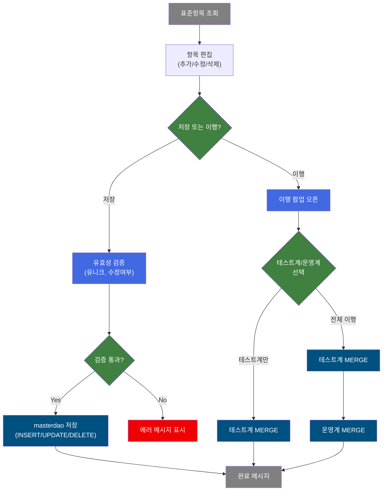
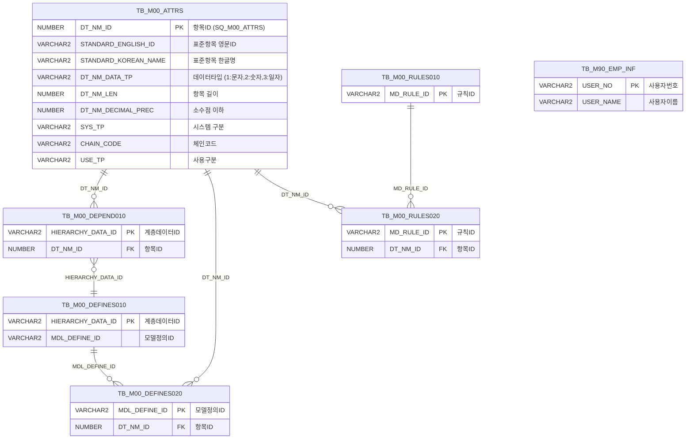

<h1 style="font-size: 40px; text-align: center; font-weight:
   bold; margin: 30px 0;">
  C107000050 표준항목관리 레거시 시스템 분석 종합 보고서
</h1>


# 1. 시스템 개요
- **서비스 ID**: C107000050
- **업무명**: 표준항목관리
- **분석 일시**: 2026-03-17 11:04 KST
- **전체 Activity 수**: 9개 (Custom: 4개, Built-in: 5개)
- **분석자**: Claude Opus 4.6 / Sonnet (Phase별 혼합)
- **분석 도구**: /analyze-service C107000050
- **문서 버전**: 1.0

# 📊 비즈니스 프로세스 분석

## 시스템 목적

표준항목관리(C107000050) 화면은 MES 시스템의 마스터데이터 표준항목(TB_M00_ATTRS) 속성을 관리하는 화면이다. 표준항목의 영문ID, 한글명, 데이터타입, 길이, 소수점자리, 시스템구분, 부문(체인코드), 사용구분 등을 조회·등록·수정·삭제할 수 있다.

핵심 기능으로 **데이터 이행(Migration)** 기능을 제공한다. 화면에서 편집된 표준항목 데이터를 테스트계 또는 운영계 DB에 직접 JDBC 연결로 MERGE INTO 처리하여 동기화할 수 있다. 이행 시에는 GLUE 프레임워크 DAO를 우회하여 `OraclePreparedStatement`로 직접 접속하므로, 현재 애플리케이션 서버와 다른 DB 인스턴스에 대한 데이터 이행이 가능하다.

조회 시에는 마스터데이터레이아웃 정의(RULE) 여부에 따라 데이터타입을 코드(1,2,3)에서 한글명(문자,숫자,일자)으로 변환하고, 체인코드에는 `PL_M60_COMMON_FNC_PKG.getMastValue` 패키지 함수로 모듈명을 부가하여 반환한다.

## 핵심 워크플로우 다이어그램



### 상세 워크플로우 다이어그램

```mermaid
flowchart TD
    subgraph 조회흐름["조회 흐름"]
        Q1["Router 분기<br/>(cmd=find)"]:::proc --> Q2["FormSearch: C107000050.select<br/>TB_M00_ATTRS + RULE 서브쿼리<br/>영문ID/한글명/시스템/부문 필터"]:::proc
        Q2 --> Q3["Grid 표시<br/>(데이터타입 코드→한글 변환)"]:::proc
    end

    subgraph 저장흐름["저장 흐름"]
        S1["Router 분기<br/>(cmd=chkUnique_U1)"]:::proc --> S2["FormSearch: 유니크 검사<br/>TB_M00_ATTRS PK 중복 확인"]:::proc
        S2 --> S3{"중복 존재?"}:::decision
        S3 -->|Yes| S4["에러: 기존 데이터 존재"]:::error
        S3 -->|No| S5["Router 분기<br/>(cmd=chkUpdateRow)"]:::proc
        S5 --> S6["FormSearch: 수정여부 확인<br/>기존 레코드 일치 검증"]:::proc
        S6 --> S7["GridSave: INSERT/UPDATE/DELETE<br/>TB_M00_ATTRS (masterdao)"]:::save
    end

    subgraph 이행흐름["이행 흐름"]
        M1["Router 분기<br/>(cmd=테스트계이행)"]:::proc --> M2["C107000050pop01ProcActivity<br/>직접 JDBC 접속 (chk=tstdao)<br/>210.1.1.139:2020:UBMADQ"]:::proc_call
        M2 --> M3["MERGE INTO TB_M00_ATTRS<br/>(Named Parameter 바인딩)"]:::save
        M3 --> M4["체크된 행만 executeUpdate"]:::proc
        M4 --> M5["conn.commit()"]:::save
    end

    subgraph 전체이행["전체 이행 흐름"]
        A1["테스트계이행_all"]:::proc_call --> A2["MERGE INTO (tstdao)"]:::save
        A2 --> A3["운영계이행_all"]:::proc_call
        A3 --> A4["MERGE INTO (prddao)<br/>210.1.1.146:2010:USMEAP1"]:::save
    end

    classDef start fill:#808080,color:#fff
    classDef proc fill:#4169E1,color:#fff
    classDef proc_call fill:#408080,color:#fff
    classDef decision fill:#408040,color:#fff
    classDef save fill:#005080,color:#fff
    classDef error fill:#F00000,color:#fff
```



## 주요 유즈케이스

### UC-01: 표준항목 조회

- **Actor**: 마스터데이터 관리자
- **목적**: 등록된 표준항목 속성 정보를 시스템/부문/항목ID/항목명 조건으로 조회

- **전제조건**:
  - 시스템에 로그인되어 있음
  - M00APUSER.TB_M00_ATTRS 테이블에 데이터 존재

- **주요 흐름**:
  1. 화면 진입 시 Form 콤보박스(시스템, 부문) 자동 로드
  2. 시스템(MES/ERP/전체), 부문, 항목ID, 항목명 조건 입력
  3. 조회 버튼 클릭 또는 입력 필드에서 엔터키
  4. C107000050.select 쿼리 실행 — TB_M00_ATTRS에서 RULE 서브쿼리와 LEFT JOIN하여 데이터타입 한글 변환, 체인코드에 모듈명 부가
  5. Grid에 14개 컬럼으로 결과 표시 (편집 가능 컬럼은 FFFFC0 배경색)

- **대체 흐름**:
  - 조건 미입력 시: 전체 데이터 조회
  - 항목ID 입력 시: 자동 대문자 변환 후 전방 LIKE 검색

- **후행조건**:
  - Grid에 조회 결과 표시
  - 행 편집 및 이행 가능 상태

### UC-02: 표준항목 등록/수정/삭제

- **Actor**: 마스터데이터 관리자
- **목적**: 표준항목 속성 정보를 신규 등록, 수정, 삭제

- **전제조건**:
  - 조회된 데이터가 Grid에 표시되어 있음
  - 저장 권한 보유

- **주요 흐름**:
  1. 메뉴 "행추가"로 신규 행 추가 또는 기존 행 편집
  2. 표준항목ID(영문), 한글명, 시스템, 부문, 항목Type, 길이, 소수점이하, 사용구분 입력
  3. 체크박스 선택 후 저장 버튼 클릭
  4. 유니크 검사(chkUnique_U1): 동일 영문ID+한글명+데이터타입+길이+소수점 조합 중복 확인
  5. 수정여부 확인(chkUpdateRow): 기존 레코드와 변경점 비교
  6. GridSave Activity로 masterdao를 통해 INSERT/UPDATE/DELETE 실행 (isAudit=true)
  7. 저장 완료 메시지 표시 후 자동 재조회

- **대체 흐름**:
  - 유니크 검사 실패 시: "이미 존재하는 데이터입니다" 에러 메시지
  - 수정 사항 없는 경우: 변경 없음 안내

- **후행조건**:
  - TB_M00_ATTRS 테이블에 데이터 반영
  - 감사 추적 정보(생성자/수정자, 일시) 자동 기록

### UC-03: 데이터 이행 (테스트계/운영계)

- **Actor**: 마스터데이터 관리자
- **목적**: 현재 환경의 표준항목 데이터를 테스트계 또는 운영계 DB에 직접 이행

- **전제조건**:
  - Grid에 이행 대상 데이터가 조회되어 있음
  - 체크박스로 이행 대상 행 선택
  - 대상 DB 접속 가능 (네트워크 연결)

- **주요 흐름**:
  1. 이행 대상 행의 체크박스 선택
  2. "이행" 링크버튼 클릭
  3. 수정여부 확인(chkUpdateRow) 실행 — 미저장 데이터 확인
  4. 이행 팝업(C107000050pop01.jsp) 오픈
  5. 팝업에서 이행 대상(테스트계만/전체) 선택
  6. C107000050pop01ProcActivity 실행:
     - `chk=tstdao`: 테스트계 DB에 직접 JDBC 접속 → MERGE INTO 실행
     - 전체이행: 테스트계 → 운영계 순차 실행
  7. 체크된 행(CH=="1")만 MERGE INTO 실행 (DT_NM_ID 기준 존재 시 UPDATE, 미존재 시 INSERT)
  8. 전체 conn.commit() 후 완료 메시지 표시

- **대체 흐름**:
  - 체크된 행 없음: IDS 검증 실패로 FAILURE 반환
  - DB 접속 실패: 롤백 후 "이행이 실패했습니다" 메시지 표시
  - 필수 컬럼(DT_NM_ID, STANDARD_ENGLISH_ID, STANDARD_KOREAN_NAME, SYS_TP) 누락: 해당 행 건너뜀

- **후행조건**:
  - 대상 DB의 TB_M00_ATTRS에 데이터 반영
  - 팝업에 완료/실패 메시지 표시

---
## 비즈니스 로직 상세

### 1. 데이터 이행 처리 (C107000050pop01ProcActivity)

- **목적**: 화면에서 편집된 표준항목 데이터를 테스트계/운영계 DB에 MERGE INTO로 동기화

- **처리 케이스**:

  **[케이스 1: 테스트계 단독 이행]**
  ```
    조건: chk == "tstdao" (서비스 XML property)
    처리:
      1. DriverManager.getConnection(210.1.1.139:2020:UBMADQ, M00APUSER, M00APUSER_TST)
      2. setAutoCommit(false)
      3. MERGE INTO M00APUSER.TB_M00_ATTRS 쿼리 준비
      4. IDS[0]을 쉼표 분리하여 각 행 순회
      5. 체크된 행(CH=="1")만 executeUpdate()
      6. conn.commit()
      7. ctx.put("TST", "테스트계 이행이 완료되었습니다.")
  ```

  **[케이스 2: 전체 이행 (테스트계 → 운영계)]**
  ```
    조건: cmd=테스트계이행_all → 운영계이행_all 체인
    처리:
      1. 테스트계이행_all Activity 실행 (chk=tstdao)
      2. 성공 시 transition → 운영계이행_all Activity (chk=prddao)
      3. prddao: DriverManager.getConnection(210.1.1.146:2010:USMEAP1, M00APUSER, M00APUSER_PRD)
      4. 동일 MERGE INTO 실행
      5. ctx.put("PRD", "운영계 이행이 완료되었습니다.")
  ```

  **[케이스 3: 예외 처리]**
  ```
    조건: Exception 발생
    처리:
      1. conn.rollback()
      2. 실패 메시지: "테스트계/운영계 이행이 실패했습니다."
      3. ctx.put(ERRMSG, e.getMessage())
      4. PosException throw
  ```

- **예외 처리**:
  - DB 접속 실패 (네트워크/인증): 롤백 → PosException throw
  - IDS null 또는 빈 배열: FAILURE 반환 (이행 중단)
  - ClassNotFoundException: printStackTrace만 수행하고 계속 진행 (다음 단계에서 재실패)

### 2. 조회 시 데이터타입 코드 변환

- **목적**: 마스터데이터레이아웃 정의(RULE) 존재 여부에 따라 데이터타입 코드를 한글명으로 변환

- **처리 케이스**:

  **[케이스 1: RULE 정의 존재 시]**
  ```
    조건: RULE.DT_NM_ID IS NOT NULL (마스터데이터레이아웃에 등록된 항목)
    처리:
      DECODE(DT_NM_DATA_TP, '1', '문자', '2', '숫자', '3', '일자') 변환
      CHAIN_CODE: 원본값 + ' - ' + PL_M60_COMMON_FNC_PKG.getMastValue('MES_MOD_TP', 'SZ0000', CHAIN_CODE)
  ```

  **[케이스 2: RULE 정의 미존재 시]**
  ```
    조건: RULE.DT_NM_ID IS NULL
    처리:
      DT_NM_DATA_TP 원본값(코드) 그대로 반환
      CHAIN_CODE 원본값 그대로 반환
  ```

### 3. RULE 서브쿼리 구성

- **목적**: 마스터데이터레이아웃에 등록된 DT_NM_ID 목록을 UNION으로 추출하여 RULE 뷰 생성

- **처리 케이스**:

  **[서브쿼리 구조]**
  ```
    UNION 1: TB_M00_DEPEND010 → TB_M00_DEFINES010 → TB_M00_DEFINES020
      HIERARCHY_DATA_ID 기반 레이아웃 종속관계 → 모델 정의 → 컬럼 DT_NM_ID 추출
    UNION 2: TB_M00_RULES010 → TB_M00_RULES020 → TB_M00_ATTRS
      규칙 정의 → 규칙 상세 → 항목 DT_NM_ID 추출
    결과: 중복 제거(UNION)된 DT_NM_ID 목록을 RULE 인라인 뷰로 사용
  ```

---

# ⚙️ Java 컴포넌트 분석

## Custom Activity 상세 분석

### 1개 Custom Activity 발견 (4개 인스턴스)

### 1. C107000050pop01ProcActivity (운영계이행 / 테스트계이행_all / 테스트계이행 / 운영계이행_all)
- **클래스명**: com.unionsteel.mes.c10.activity.ui.C107000050pop01ProcActivity
- **액티비티명**: 운영계이행, 테스트계이행_all, 테스트계이행, 운영계이행_all
- **파일 경로**: src/com/unionsteel/mes/c10/activity/ui/C107000050pop01ProcActivity.java
- **주요 기능**: 직접 JDBC 접속으로 테스트계/운영계 M00APUSER.TB_M00_ATTRS에 MERGE INTO 실행
- **라인 수**: 351 | **메소드 수**: 1개

> C107000050 화면의 pop01 팝업에서 데이터 이행(마이그레이션) 처리를 위해 직접 JDBC Connection을 생성하여 `M00APUSER.TB_M00_ATTRS` 테이블에 MERGE INTO 구문을 실행하는 Activity이다. GLUE 프레임워크의 DAO를 사용하지 않고 `oracle.jdbc.OraclePreparedStatement`를 직접 사용하며, `chk` 프로퍼티 값에 따라 테스트계(`tstdao`) 또는 운영계(`prddao`) 데이터베이스에 접속한다.

📎 **[상세 분석 보고서](../customClass/com.unionsteel.mes.c10.activity.ui.C107000050pop01ProcActivity_class_analysis.md)**

---

# 💾 데이터 요구사항

## 핵심 테이블

### 1. M00APUSER.TB_M00_ATTRS - 표준항목 속성 마스터

| 컬럼명 | 타입 | PK | 설명 |
|--------|------|----|------|
| DT_NM_ID | NUMBER | ✅ | 항목ID (시퀀스 SQ_M00_ATTRS로 자동 생성) |
| STANDARD_ENGLISH_ID | VARCHAR2 | | 표준항목 영문ID |
| STANDARD_KOREAN_NAME | VARCHAR2 | | 표준항목 한글명 |
| DT_NM_DATA_TP | VARCHAR2 | | 항목 데이터타입 (1:문자, 2:숫자, 3:일자) |
| DT_NM_LEN | NUMBER | | 항목 길이 |
| DT_NM_DECIMAL_PREC | NUMBER | | 소수점 이하 자리 |
| DT_NM_ALIAS | VARCHAR2 | | 표준항목명 약어 |
| USE_TP | VARCHAR2 | | 사용 구분 |
| SYS_TP | VARCHAR2 | | 시스템 구분 (MES/ERP) |
| CHAIN_CODE | VARCHAR2 | | 체인코드 (부문) |
| CREATED_OBJECT_TYPE | VARCHAR2 | | 생성 객체 타입 |
| CREATED_OBJECT_ID | VARCHAR2 | | 생성자 ID |
| CREATED_PROGRAM_ID | VARCHAR2 | | 생성 프로그램 ID |
| CREATION_TIMESTAMP | DATE | | 생성 일시 |
| LAST_UPDATED_OBJECT_TYPE | VARCHAR2 | | 수정 객체 타입 |
| LAST_UPDATED_OBJECT_ID | VARCHAR2 | | 수정자 ID |
| LAST_UPDATE_PROGRAM_ID | VARCHAR2 | | 수정 프로그램 ID |
| LAST_UPDATE_TIMESTAMP | DATE | | 수정 일시 |

### 2. M00APUSER.TB_M00_DEPEND010 - 마스터데이터 종속관계 정의

| 컬럼명 | 타입 | PK | 설명 |
|--------|------|----|------|
| HIERARCHY_DATA_ID | VARCHAR2 | ✅ | 계층 데이터 ID |
| DT_NM_ID | NUMBER | | 항목 ID (TB_M00_ATTRS FK) |

### 3. M00APUSER.TB_M00_DEFINES010 - 모델 정의

| 컬럼명 | 타입 | PK | 설명 |
|--------|------|----|------|
| HIERARCHY_DATA_ID | VARCHAR2 | ✅ | 계층 데이터 ID |
| MDL_DEFINE_ID | VARCHAR2 | | 모델 정의 ID |

### 4. M00APUSER.TB_M00_DEFINES020 - 모델 정의 상세

| 컬럼명 | 타입 | PK | 설명 |
|--------|------|----|------|
| MDL_DEFINE_ID | VARCHAR2 | ✅ | 모델 정의 ID |
| DT_NM_ID | NUMBER | | 항목 ID |

### 5. TB_M00_RULES010 / TB_M00_RULES020 - 규칙 정의 / 규칙 상세

| 컬럼명 | 타입 | PK | 설명 |
|--------|------|----|------|
| MD_RULE_ID | VARCHAR2 | ✅ | 규칙 ID |
| DT_NM_ID | NUMBER | | 항목 ID (RULES020) |

### 6. M90APUSER.TB_M90_EMP_INF - 사원 정보 (참조)

| 컬럼명 | 타입 | PK | 설명 |
|--------|------|----|------|
| USER_NO | VARCHAR2 | ✅ | 사용자 번호 |
| USER_NAME | VARCHAR2 | | 사용자 이름 (등록자명 표시용) |

## 데이터 플로우

### 1. 조회

```
[표준항목 조회]
화면 진입 → Form 조건 입력 (시스템/부문/항목ID/항목명)
→ C107000050.select
  FROM M00APUSER.TB_M00_ATTRS ATTRS
  LEFT JOIN (
    UNION 서브쿼리: TB_M00_DEPEND010 → TB_M00_DEFINES010 → TB_M00_DEFINES020
                    TB_M00_RULES010 → TB_M00_RULES020 → TB_M00_ATTRS
  ) RULE ON ATTRS.DT_NM_ID = RULE.DT_NM_ID
  + 스칼라 서브쿼리: M90APUSER.TB_M90_EMP_INF (등록자명 변환)
  WHERE STANDARD_ENGLISH_ID LIKE :STANDARD_ENGLISH_ID || '%'
    AND STANDARD_KOREAN_NAME LIKE '%' || :STANDARD_KOREAN_NAME || '%'
    AND SYS_TP = :SYS_TP (선택)
    AND CHAIN_CODE = :CHAIN_CODE (선택)
  ORDER BY DT_NM_ID
→ Grid에 표준항목 목록 표시
  (RULE 존재 시 DT_NM_DATA_TP: 1→문자, 2→숫자, 3→일자 변환)
  (RULE 존재 시 CHAIN_CODE: 원본 + ' - ' + 모듈명 부가)
```

### 2. 저장

```
[표준항목 저장]
체크된 행 선택 → 저장 버튼 클릭
→ C107000050.chkUnique_U1
  FROM TB_M00_ATTRS
  WHERE STANDARD_ENGLISH_ID = :STANDARD_ENGLISH_ID
    AND STANDARD_KOREAN_NAME = :STANDARD_KOREAN_NAME
    AND DT_NM_DATA_TP = :DT_NM_DATA_TP
    AND DT_NM_LEN = :DT_NM_LEN (선택)
    AND DT_NM_DECIMAL_PREC = :DT_NM_DECIMAL_PREC (선택)
  → 중복 시 저장 중단
→ C107000050.chkUpdateRow
  FROM TB_M00_ATTRS
  WHERE DT_NM_ID = :DT_NM_ID AND ... (전 컬럼 일치 확인)
  → 변경 없으면 저장 건너뜀
→ GridSave (masterdao, isAudit=true)
  INSERT: C107000050.insert (SQ_M00_ATTRS.NEXTVAL로 DT_NM_ID 자동 생성)
  UPDATE: C107000050.update (DT_NM_ID 기준 11개 컬럼 갱신)
  DELETE: C107000050.delete (DT_NM_ID 기준 삭제)
→ 감사 추적 정보 자동 기록
```

### 3. 이행

```
[데이터 이행]
체크된 행 선택 → 이행 버튼 클릭
→ C107000050.chkUpdateRow (미저장 확인)
→ 팝업(C107000050pop01.jsp) 오픈
→ C107000050pop01ProcActivity 실행
  직접 JDBC 접속 (tstdao/prddao)
  → MERGE INTO M00APUSER.TB_M00_ATTRS
    ON (DT_NM_ID = :DT_NM_ID)
    MATCHED: UPDATE 9개 컬럼 + 변경추적 4개
    NOT MATCHED: INSERT 13개 + 변경추적 4개
  → 체크된 행(CH==1)만 executeUpdate
  → conn.commit()
→ 완료 메시지 표시
```

## SQL 일람표

| SQL 이름 | 쿼리 ID | 타입 | 출처 | 테이블 |
|---------|---------|-----|------|--------|
| 표준항목 조회 | C107000050.select | SELECT | Service | TB_M00_ATTRS, TB_M00_DEPEND010, TB_M00_DEFINES010, TB_M00_DEFINES020, TB_M00_RULES010, TB_M00_RULES020, TB_M90_EMP_INF |
| 유니크 검사 | C107000050.chkUnique_U1 | SELECT | Service | TB_M00_ATTRS |
| 수정여부 확인 | C107000050.chkUpdateRow | SELECT | Service | TB_M00_ATTRS |
| 표준항목 등록 | C107000050.insert | INSERT | Service | TB_M00_ATTRS |
| 표준항목 수정 | C107000050.update | UPDATE | Service | TB_M00_ATTRS |
| 표준항목 삭제 | C107000050.delete | DELETE | Service | TB_M00_ATTRS |
| 이행 MERGE | C107000050pop01.update | MERGE | Service | TB_M00_ATTRS |

## PL/SQL 함수/프로시저

| # | 호출명 | 유형 | 용도 | 상세 분석 |
|---|--------|------|------|----------|
| 1 | PL_M60_COMMON_FNC_PKG.GETMASTVALUE | 패키지 | 마스터코드값 조회 (체인코드→모듈명 변환) | [분석 보고서](../../../dbms/MESAPUSER/package/PL_M60_COMMON_FNC_PKG_analysis_report.md) |

## ER 다이어그램 (핵심 관계)



관계 설명:
- **TB_M00_ATTRS**가 중심 테이블로 표준항목 속성 관리의 허브 역할
- **TB_M00_DEPEND010 → TB_M00_DEFINES010 → TB_M00_DEFINES020**: 마스터데이터 레이아웃 종속관계 체인 (HIERARCHY_DATA_ID → MDL_DEFINE_ID → DT_NM_ID)
- **TB_M00_RULES010 → TB_M00_RULES020**: 규칙 정의 체인 (MD_RULE_ID → DT_NM_ID)
- **TB_M90_EMP_INF**: 등록자 이름 조회용 참조 테이블 (USER_NO → USER_NAME)

---

# 🖥️ 사용자 인터페이스 요구사항

## 화면 레이아웃 상세

### Layout 구조 (initLayout)
```javascript
{
  itemType: "layout",
  dirType: "row",  // 수직 배치 (위→아래)
  components: [
    {
      id: "C107000050_Form_1",
      type: "form",
      position: { top: "0px", height: "35px" },
      // 검색 조건 + 버튼
    },
    {
      id: "C107000050_Menu_1",
      type: "menu",
      position: { top: "36px", height: "25px" },
      // 그리드 메뉴 (새로고침, 행추가, 복사)
    },
    {
      id: "C107000050_Grid_1",
      type: "grid",
      position: { top: "61px", height: "502px" },
      // 표준항목 목록 (14컬럼, 21행)
    },
    {
      id: "C107000050_messagebox",
      type: "messagebox",
      position: { top: "566px", height: "19px" },
      // 상태 메시지 표시
    }
  ]
}
```

## 입출력 요소

### Form 컴포넌트
**C107000050_Form_1**
- SYS_TP: Combo - 시스템 (전체/MES/ERP, 너비 70px)
- CHAIN_CODE: Combo - 부문 (LOV: SZ0000/MES_MOD_TP, 너비 100px)
- STANDARD_ENGLISH_ID: Input - 항목ID (너비 100px, 입력 시 자동 대문자 변환, 엔터키로 조회)
- STANDARD_KOREAN_NAME: Input - 항목명 (너비 100px, 엔터키로 조회)
- migraiton: LinkButton - 이행 (너비 75px) → 이행 팝업(C107000050pop01.jsp) 오픈
- find: Button - 조회 (보안 제어, 초기 disabled)
- save: Button - 저장 (보안 제어, 초기 disabled)
- winClose: Button - 닫기
- txMsg: Hidden - 처리 메시지
- txErrMsg: Hidden - 에러 메시지

### Grid 컴포넌트

**C107000050_Grid_1 (표준항목 목록)**
- 편집 가능 여부: 예 (FFFFC0 배경색 컬럼)
- Split: 없음 (0)
- 행 수: 21행 (pageset 사용)
- 주요 컬럼 (14개):

  **숨김 컬럼**:
  - DT_NM_ID: ro - 항목ID (10%, 좌측정렬, 숨김) — TB_M00_ATTRS PK
  - DT_NM_ALIAS: ed - 항목명약어 (10%, 좌측정렬, 숨김, 편집 가능, FFFFC0)
  - RULE_DT_NM_ID: combo_v - RULE_DT_NM_ID (7%, 좌측정렬, 숨김, 편집 가능, FFFFC0) — TB_M00_RULES020

  **기본 정보**:
  - CH: ch - 선택 체크박스 (3%, 중앙정렬, 편집 가능)
  - STANDARD_ENGLISH_ID: ed - 표준항목ID (17%, 좌측정렬, 편집 가능, FFFFC0)
  - STANDARD_KOREAN_NAME: ed - 표준항목명 (15%, 좌측정렬, 편집 가능, FFFFC0)

  **분류 정보**:
  - SYS_TP: combo_v - 시스템 (7%, 좌측정렬, 편집 가능, FFFFC0, 옵션: 전체/MES/ERP)
  - CHAIN_CODE: combo_v - 부문 (15%, 좌측정렬, 편집 가능, FFFFC0, LOV: SZ0000/MES_MOD_TP)
  - DT_NM_DATA_TP: combo_v - 항목Type (7%, 좌측정렬, 편집 가능, FFFFC0, 옵션: 문자/숫자/일자)

  **수치 정보**:
  - DT_NM_LEN: ed - 길이 (5%, 우측정렬, 편집 가능, FFFFC0, 포맷: 0.0)
  - DT_NM_DECIMAL_PREC: ed - 소수점이하 (8%, 우측정렬, 편집 가능, FFFFC0, 포맷: 0.0)

  **추적 정보**:
  - CREATED_OBJECT_ID: ro - 등록자 (7%, 좌측정렬, 읽기 전용)
  - CREATION_TIMESTAMP: ro - 등록일자 (나머지%, 중앙정렬, 읽기 전용)

  **사용 상태**:
  - USE_TP: combo_v - 사용구분 (7%, 좌측정렬, 편집 가능, FFFFC0, LOV: SZ0000/USE_YN)

### Menu 컴포넌트
**C107000050_Menu_1**
- refresh: 새로고침 (refresh.gif) — 그리드 초기화 후 재조회
- add: 행추가 (new.gif) — 그리드에 새 행 추가
- copy: 복사 (copy.gif) — 선택 행 클립보드 복사

## 화면 동작 흐름

### 1. 화면 초기 로딩
```
1. 화면 진입
2. onFormLoadFunction 실행
   - SYS_TP 콤보: 전체/MES/ERP 옵션 설정
   - CHAIN_CODE 콤보: LOV(SZ0000/MES_MOD_TP) 데이터 로드
   - STANDARD_ENGLISH_ID 입력 이벤트: 자동 대문자 변환 + 엔터키 조회 바인딩
   - STANDARD_KOREAN_NAME 입력 이벤트: 엔터키 조회 바인딩
3. onLoadGrid 실행
   - Grid 컬럼 콤보 초기화 (SYS_TP, DT_NM_DATA_TP, CHAIN_CODE, USE_TP)
4. 보안 설정에 따라 find/save 버튼 활성화
5. 상태바 초기화
```

### 2. 표준항목 조회
```
1. 사용자가 시스템/부문/항목ID/항목명 조건 입력
2. 조회 버튼 클릭 또는 엔터키
3. find 이벤트 실행
   - uiCommon.parameters(C107000050_Form_1) 호출하여 파라미터 구성
4. C107000050-service 호출 (cmd=find)
   - Router → 조회 Activity → C107000050.select 실행
5. Grid에 결과 바인딩
   - RULE 정의 여부에 따라 데이터타입 한글 변환
6. findMessage로 조회 완료 메시지 표시
```

### 3. 이행 처리 (팝업)
```
1. Grid에서 이행 대상 행 체크
2. "이행" 링크버튼 클릭
3. migraiton 이벤트 실행
   - 체크된 행의 데이터 수정여부 확인 (chkUpdateRow)
   - 미저장 데이터 존재 시 경고
4. C107000050pop01.jsp 팝업 오픈
5. 팝업에서 이행 대상 선택 (테스트계만 / 전체)
6. 이행 실행:
   - 테스트계만: cmd=테스트계이행 → 테스트계 DB MERGE → end
   - 전체이행: cmd=테스트계이행_all → 테스트계 → 운영계이행_all → 운영계 → end
7. onAfterUpdateFinishEvent에서 완료 메시지 표시
```

### 4. 행 편집 및 저장
```
1. Grid 셀 클릭하여 편집 모드 진입 (FFFFC0 배경색 컬럼만 편집 가능)
2. onEdit 이벤트: 셀 편집 시 해당 행 체크박스 자동 체크
3. 행 상태 자동 설정 (inserted/updated)
4. 저장 버튼 클릭
5. save 이벤트 실행:
   - 체크된 행 필수값 검증
   - 유니크 검사 (chkUnique_U1)
   - 수정여부 확인 (chkUpdateRow)
   - 확인 다이얼로그 표시
   - GridSave: INSERT/UPDATE/DELETE 실행
6. onAfterUpdateFinishEvent: 완료 메시지 + 자동 재조회
```

## JavaScript 모듈

**C107000050.jsp** (메인 화면 스크립트)
- onFormLoadFunction(): 폼 로드 후 콤보 초기화, 입력 필드 이벤트 설정
- onLoadGrid(): 그리드 컬럼 콤보 초기화 (SYS_TP, DT_NM_DATA_TP, CHAIN_CODE, USE_TP)
- find(): 표준항목 조회 (uiCommon.parameters → 서비스 호출)
- save(): 유효성 검사 + 저장 (chkUnique_U1, chkUpdateRow → GridSave)
- migraiton(): 이행 팝업(C107000050pop01.jsp) 오픈
- refresh(): 그리드 새로고침
- add(): 행 추가
- remove(): 행 삭제
- copy(): 행 복사
- undo(): 실행 취소
- redo(): 다시 실행
- onEdit(): 셀 편집 이벤트 (체크박스 자동 체크, 행 상태 설정)
- onAfterUpdateFinishEvent(): 저장/이행 완료 후 처리
- onGridContextMenuClick(): 컨텍스트메뉴 (컬럼이동, 헤더필터, 편집모드, 엑셀내보내기)
- findMessage(): 메시지박스에 메시지 표시

## 주요 이벤트 핸들러

**onEdit (셀 편집)**
- 이벤트 타입: onEditCellEvent
- 처리 내용:
  1. 편집된 셀의 행 체크박스 자동 체크 (CH = "1")
  2. 행 상태 설정 (inserted → 신규, updated → 수정)
  3. Grid 변경 추적 활성화

**onAfterUpdateFinishEvent (저장/이행 완료)**
- 이벤트 타입: onAfterUpdateFinishEvent
- 처리 내용:
  1. 저장 결과 메시지 표시
  2. 이행인 경우 → 이행 팝업(C107000050pop01.jsp) 오픈
  3. 자동 재조회 (find 호출)
  4. 메시지박스 업데이트

**migraiton (이행 버튼)**
- 이벤트 타입: LinkButton click
- 처리 내용:
  1. 체크된 행 확인
  2. 수정여부 검증 (chkUpdateRow)
  3. C107000050pop01.jsp 팝업 오픈 (체크된 행 데이터 전달)

---

# 📌 특이사항 및 주의사항

## 1. 직접 JDBC 접속 및 DB 접속 정보 하드코딩

- **DB 접속 정보 노출**: `C107000050pop01ProcActivity`에 테스트계/운영계 DB URL, 계정, 비밀번호가 `private static final` 상수로 하드코딩되어 있다. 소스코드 유출 시 DB 접속 정보가 노출되는 심각한 보안 취약점이다.
  - 테스트계: `jdbc:oracle:thin:@210.1.1.139:2020:UBMADQ` / `M00APUSER` / `M00APUSER_TST`
  - 운영계: `jdbc:oracle:thin:@210.1.1.146:2010:USMEAP1` / `M00APUSER` / `M00APUSER_PRD`
- **GLUE 프레임워크 DAO 우회**: 프레임워크의 커넥션풀/트랜잭션 관리를 사용하지 않고 `DriverManager.getConnection()`으로 직접 연결. 커넥션 누수 가능성 존재.

## 2. ClassNotFoundException 예외 처리 미흡

- `Class.forName(driver)` 실패 시 `printStackTrace()`만 수행하고 예외를 무시한 채 계속 진행한다. 드라이버 미존재 시 다음 `DriverManager.getConnection()`에서 별도 예외가 발생하여 사용자에게 혼란을 줄 수 있다.

## 3. 이행 버튼 오타

- Form 필드 ID와 이벤트 핸들러 함수명이 `migraiton` (migration의 오타)으로 작성되어 있다. 기능에는 영향이 없으나 코드 가독성과 유지보수에 영향을 준다.

## 4. 주석 처리된 파일 읽기 코드

- `C107000050pop01ProcActivity` 소스 내에 SQL 파일을 파일시스템에서 직접 읽어 실행하는 코드(`FileReader`/`BufferedReader`)가 주석 블록으로 존재한다. 과거 SQL을 외부 파일로 관리하던 방식의 흔적이다.

## 5. 조회 시 RULE 서브쿼리의 복잡한 UNION 구조

- `C107000050.select` 쿼리의 RULE 서브쿼리가 4개 테이블(DEPEND010, DEFINES010, DEFINES020, RULES010/020)을 UNION하여 구성된다. 마스터데이터레이아웃 정의 체계의 복잡성을 반영하며, 쿼리 성능에 영향을 줄 수 있다. Complex 등급으로 분류되어 있다.

## 6. INSERT 절의 감사 컬럼 중복 바인딩

- MERGE INTO의 NOT MATCHED INSERT 절에서 `CREATED_*` 4개 컬럼과 `LAST_UPDATED_*` 4개 컬럼에 동일한 파라미터(ObjectType, ObjectId, ProgramId, Timestamp)가 바인딩된다. 의도적인 설계이지만, INSERT 시 생성/수정 정보가 동일하게 기록되는 구조이다.

---

# 📚 참고 문서

- **Query SQL**: `src/query/C107000050-query.glue_sql`, `src/query/C107000050pop01-query.glue_sql`
- **Service XML**: `src/service/C107000050-service.xml`
- **JS**: `WebContents/C107000050.jsp` (인라인 스크립트)
- **Custom Java 클래스**:
  - `src/com/unionsteel/mes/c10/activity/ui/C107000050pop01ProcActivity.java`
