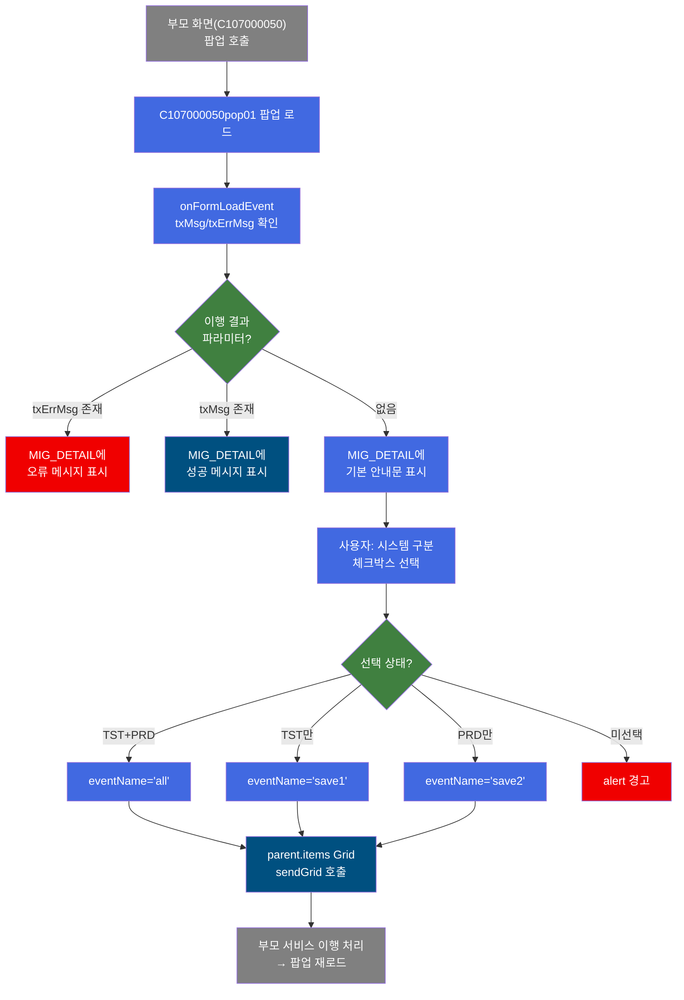
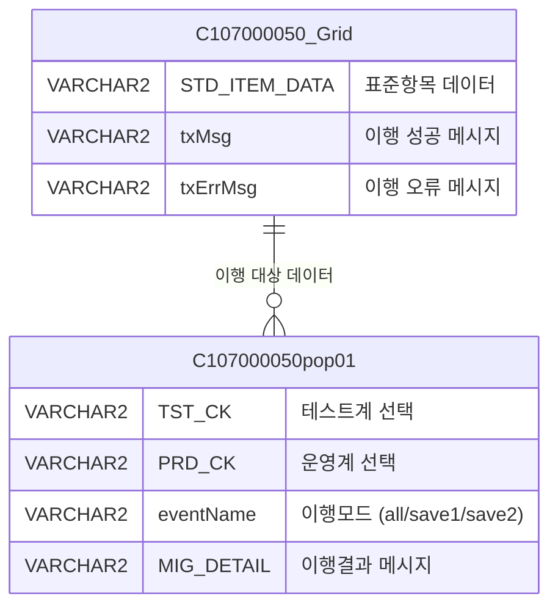

<h1 style="font-size: 40px; text-align: center; font-weight:
   bold; margin: 30px 0;">
  C107000050pop01 레거시 시스템 분석 종합 보고서
</h1>


# 1. 시스템 개요
- **서비스 ID**: C107000050pop01
- **업무명**: 표준항목관리 - 데이터이행 팝업
- **분석 일시**: 2026-03-17 11:04 KST
- **전체 Activity 수**: 1개 (built-in)
- **분석자**: Claude Opus 4.6 / Sonnet
- **분석 도구**: /analyze-service C107000050pop01
- **문서 버전**: 1.0

# 📊 비즈니스 프로세스 분석

## 시스템 목적

C107000050pop01은 **표준항목관리(C107000050) 화면의 데이터이행 팝업**으로, 사용자가 선택한 표준항목 데이터를 테스트계 또는 운영계 시스템으로 이행(마이그레이션)하기 위한 실행 인터페이스이다.

이 팝업은 부모 화면(C107000050)의 Grid에서 선택된 데이터를 대상으로, 이행 대상 시스템(테스트계/운영계/양쪽 모두)을 체크박스로 선택한 뒤 "실행" 버튼을 클릭하면 부모 화면의 Grid에 sendGrid 요청을 전송하여 실제 데이터 이행을 수행한다. 이행 결과는 MIG_DETAIL 영역에 성공/오류 메시지로 표시된다.

서비스 자체는 PosDefaultRouter 단일 Activity로 구성된 라우터 서비스로, 비즈니스 로직은 JavaScript(클라이언트)와 부모 서비스(C107000050)에서 처리된다.

## 주요 유즈케이스

### UC-01: 데이터이행 대상 시스템 선택 및 실행
- **Actor**: 시스템 관리자 / 표준항목 담당자
- **목적**: 표준항목 데이터를 선택한 대상 시스템(테스트계/운영계)으로 이행

- **전제조건**:
  - 부모 화면(C107000050)에서 이행 대상 데이터가 Grid에 로드되어 있음
  - 사용자가 이행 권한을 보유함
  - 팝업이 부모 화면에서 정상적으로 호출됨

- **주요 흐름**:
  1. 팝업 진입 시 onFormLoadEvent에서 MIG_DETAIL에 안내 메시지 표시
  2. 사용자가 시스템 구분 체크박스 선택 (테스트계/운영계/양쪽 모두)
  3. "실행" 버튼 클릭
  4. 확인 대화상자 표시: "입력된 정보를 이행하시겠습니까?"
  5. 확인 시 `parent.items['C107000050_Grid_1'].sendGrid()` 호출로 부모 화면에 이행 요청 전송
  6. 이행 결과가 MIG_DETAIL 영역에 표시됨

- **대체 흐름**:
  - 체크박스 미선택 시: alert 경고 메시지 후 처리 중단
  - 테스트계만 선택: eventName='save1'로 테스트계 전용 이행
  - 운영계만 선택: eventName='save2'로 운영계 전용 이행
  - 양쪽 모두 선택: eventName='all'로 전체 이행

- **후행조건**:
  - 대상 시스템에 표준항목 데이터가 이행됨
  - MIG_DETAIL에 이행 결과(성공/오류) 메시지가 표시됨

### UC-02: 이행 결과 확인
- **Actor**: 시스템 관리자 / 표준항목 담당자
- **목적**: 데이터이행 실행 후 결과 메시지를 확인

- **전제조건**:
  - UC-01의 이행 실행이 완료됨

- **주요 흐름**:
  1. 이행 실행 후 팝업이 다시 로드됨
  2. onFormLoadEvent에서 request 파라미터(txMsg 또는 txErrMsg) 확인
  3. txErrMsg가 있으면 오류 메시지를 MIG_DETAIL에 표시
  4. txMsg가 있으면 성공 메시지를 MIG_DETAIL에 표시
  5. 둘 다 없으면 기본 안내문 표시

- **대체 흐름**:
  - 오류 발생 시: txErrMsg 파라미터로 전달된 오류 내용이 MIG_DETAIL에 표시됨

- **후행조건**:
  - 사용자가 이행 결과를 확인하고 필요 시 재실행 가능

### UC-03: 부모 화면 Grid 데이터 편집 (컨텍스트 메뉴)
- **Actor**: 시스템 관리자
- **목적**: 팝업 내 참조 Grid에 대해 행 추가/삭제/복사 등 편집 작업 수행

- **전제조건**:
  - 팝업이 열려 있고 참조 Grid가 로드되어 있음

- **주요 흐름**:
  1. Grid 우클릭으로 컨텍스트 메뉴 표시
  2. 메뉴 항목 선택 (행 추가/삭제/복사/실행취소/다시실행)
  3. 선택한 작업이 Grid에 반영됨

- **대체 흐름**:
  - 컨텍스트 메뉴에서 엑셀 내보내기 선택 시 Grid 데이터를 엑셀로 다운로드

- **후행조건**:
  - Grid 데이터가 편집된 상태로 유지됨

---

# 🖥️ 사용자 인터페이스 요구사항

## 화면 레이아웃 상세

### Layout 구조 (Flat - 레이아웃 컨테이너 없이 div 직접 배치)
```javascript
{
  type: "flat",  // 레이아웃 없이 절대 위치 배치
  components: [
    {
      id: "C107000050pop01_Form_1",
      type: "form",
      position: { left: "0px", top: "0px", width: "481px", height: "255px" }
    },
    {
      id: "C107000050pop01_messagebox",
      type: "messagebox",
      position: { left: "0px", top: "231px", width: "480px", height: "19px" }
    }
  ]
}
```

## 입출력 요소

### Form 컴포넌트
**C107000050pop01_Form_1** (이행 대상 선택 및 실행 폼)
- XML: `./header/kr/C107000050pop01/C107000050pop01_Form_1.xml`
- URL: `basicGridData.do`
- 참조 항목: `C107000050pop01_Grid_1`
- 서비스: `C107000050pop01-service`

**필드 상세**:
- template (setTitleIcon): 제목 아이콘 템플릿 (470px)
- std_title: label - "시스템구분" 라벨 (470px)
- TST_CK: checkbox - 테스트계 선택 (라벨 우측정렬, 라벨너비 60px, 블록너비 470px)
- PRD_CK: checkbox - 운영계 선택 (라벨 우측정렬, 라벨너비 50px, 블록너비 470px)
- save: button - "실행" (command: save, 470px) → save 함수 호출
- MIG_DETAIL: input (멀티라인) - 이행 결과/안내 메시지 표시 영역 (입력높이 150px, 입력너비 330px, rows: 2, 블록너비 460px)

### Messagebox 컴포넌트
**C107000050pop01_messagebox** (상태바)
- XML 파일 미존재 (코드에서 div로 직접 생성)
- 위치: 하단 (0px, 231px, 480×19px)

## 화면 동작 흐름

### 1. 화면 초기 로딩
```
1. 부모 화면(C107000050)에서 팝업 호출
2. C107000050pop01.jsp 로드
3. Form 컴포넌트 초기화 (C107000050pop01_Form_1)
4. onFormLoadEvent 실행:
   - request 파라미터 확인 (txMsg, txErrMsg)
   - txErrMsg 존재 시 → MIG_DETAIL에 오류 메시지 설정
   - txMsg 존재 시 → MIG_DETAIL에 성공 메시지 설정
   - 둘 다 없음 → MIG_DETAIL에 기본 안내문 설정
5. Messagebox 초기화
```

### 2. 데이터이행 실행
```
1. 사용자가 TST_CK(테스트계) 또는 PRD_CK(운영계) 체크박스 선택
2. "실행" 버튼 클릭 → save() 함수 호출
3. eventName 결정:
   - TST_CK=true AND PRD_CK=true → eventName='all'
   - TST_CK=true → eventName='save1'
   - PRD_CK=true → eventName='save2'
   - 둘 다 미선택 → alert 경고 후 종료
4. 확인 대화상자: "입력된 정보를 이행하시겠습니까?"
5. 확인 시 parent.items['C107000050_Grid_1'].sendGrid('C107000050_Grid_1', eventName) 호출
6. 부모 화면의 서비스가 이행 처리 수행
7. 결과에 따라 팝업 재로드 (txMsg/txErrMsg 파라미터 전달)
```

### 3. Grid 편집 (컨텍스트 메뉴)
```
1. Grid 영역 우클릭
2. 컨텍스트 메뉴 표시 (contextmenu.xml 기반)
3. 메뉴 항목 선택:
   - move_grid: 컬럼 이동
   - filter_grid: 필터 적용
   - editable_grid: 편집 모드 전환
   - excel_grid: 엑셀 내보내기
```

## JavaScript 모듈

**C107000050pop01.jsp** (인라인 스크립트)
- find(): 폼 파라미터 기반 참조 Grid 데이터 조회 (items[referenceItem].loadData(findUrl))
- save(): 이행 실행 - TST_CK/PRD_CK 체크 상태에 따라 eventName 결정 후 parent.items['C107000050_Grid_1'].sendGrid() 호출
- refresh(): Grid 선택 초기화 (빈 구현)
- add(): 참조 Grid 행 추가 (items[referenceItem].addRow())
- remove(): 참조 Grid 행 삭제 (items[referenceItem].removeRow())
- copy(): 행 클립보드 복사 (items[referenceItem].copyRowContent())
- undo(): 실행 취소 (items[referenceItem].undo())
- redo(): 다시 실행 (items[referenceItem].redo())
- onGridContextMenuClick(): 컨텍스트 메뉴 항목 처리 (move_grid, filter_grid, editable_grid, excel_grid)
- findMessage(): 메시지 조회 (항상 true 반환)
- onFormLoadEvent(): 폼 로드 시 MIG_DETAIL 필드에 txMsg/txErrMsg 또는 기본 안내문 설정

## 주요 이벤트 핸들러

**save (실행 버튼 클릭)**
- 이벤트 타입: Button Click (command: save)
- 처리 내용:
  1. TST_CK, PRD_CK 체크박스 값 확인
  2. 선택 조합에 따라 eventName 결정 (all/save1/save2)
  3. 미선택 시 alert 경고 후 종료
  4. 확인 대화상자 표시: "입력된 정보를 이행하시겠습니까?"
  5. parent.items['C107000050_Grid_1'].sendGrid('C107000050_Grid_1', eventName) 호출

**onFormLoadEvent (폼 로드 이벤트)**
- 이벤트 타입: onXLEEvent (Form Load)
- 처리 내용:
  1. request 파라미터에서 txMsg, txErrMsg 추출
  2. txErrMsg 존재 시 → MIG_DETAIL에 오류 메시지 설정
  3. txMsg 존재 시 → MIG_DETAIL에 성공 메시지 설정
  4. 둘 다 없음 → 기본 안내 메시지 설정

**onGridContextMenuClick (컨텍스트 메뉴 클릭)**
- 이벤트 타입: Grid Context Menu Click
- 처리 내용:
  1. 선택된 메뉴 ID 확인
  2. move_grid: 컬럼 이동 처리
  3. filter_grid: 필터 적용
  4. editable_grid: 편집 모드 전환
  5. excel_grid: 엑셀 내보내기

---

# 📊 핵심 워크플로우 다이어그램



## ER 다이어그램



관계 설명:
- **C107000050_Grid**: 부모 화면의 Grid로, 이행 대상 표준항목 데이터를 보유. 팝업에서 sendGrid 호출로 이행 실행
- **C107000050pop01**: 이행 제어 팝업. 시스템 구분 선택 후 부모 Grid에 이행 요청 전송. 결과는 txMsg/txErrMsg로 수신

---

# 📌 특이사항 및 주의사항

## 1. 부모-자식 화면 간 강결합
- **부모 Grid 직접 참조**: `parent.items['C107000050_Grid_1'].sendGrid()` 형태로 부모 화면의 Grid 객체를 직접 참조한다. 부모 화면의 Grid ID가 변경되면 팝업이 정상 동작하지 않는다.
- **하드코딩된 Grid ID**: 'C107000050_Grid_1' 문자열이 JavaScript에 하드코딩되어 있어, 부모 화면 구조 변경 시 팝업 코드도 함께 수정해야 한다.

## 2. 이행 대상 시스템 분기 로직
- **3가지 이행 모드**: eventName으로 'all'(양쪽), 'save1'(테스트계), 'save2'(운영계)를 구분하여 부모 서비스에 전달한다. 실제 이행 처리 로직은 부모 서비스(C107000050)에 존재하며, 이 팝업은 UI 입력만 담당한다.
- **이행 결과 전달 방식**: 이행 완료 후 request 파라미터(txMsg/txErrMsg)로 결과를 전달받아 팝업을 재로드하는 방식이다.

## 3. 서비스 구조의 특이성
- **Router 전용 서비스**: PosDefaultRouter 단일 Activity만 존재하며, 서비스 자체에 비즈니스 로직이 없다. 모든 비즈니스 로직은 JavaScript(클라이언트)와 부모 서비스에 분산되어 있다.
- **빈 구현 함수**: refresh() 함수가 빈 구현(no-op)으로 존재한다.
- **Grid 참조 불일치 가능성**: Form XML에 referenceItem으로 'C107000050pop01_Grid_1'이 설정되어 있으나, 실제 팝업에는 Grid 컴포넌트가 존재하지 않고 부모 화면의 Grid를 참조한다.

## 4. Messagebox XML 파일 부재
- messagebox 컴포넌트의 XML 파일(`C107000050pop01_messagebox.xml`)이 존재하지 않으며, JSP에서 div 태그로 직접 생성하고 있다. 프레임워크 표준 패턴과 다른 구현 방식이다.

---

# 📚 참고 문서

- **Service XML**: `src/service/C107000050pop01-service.xml`
- **JSP**: `WebContents/C107000050pop01.jsp`
- **Form XML**: `WebContents/header/kr/C107000050pop01/C107000050pop01_Form_1.xml`
- **부모 서비스**: C107000050 (표준항목관리 메인 화면)
