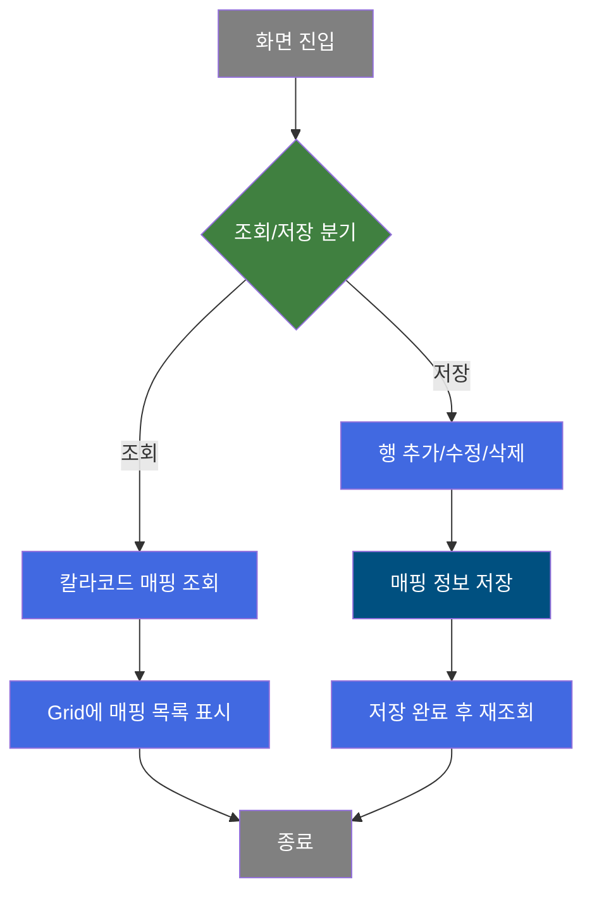
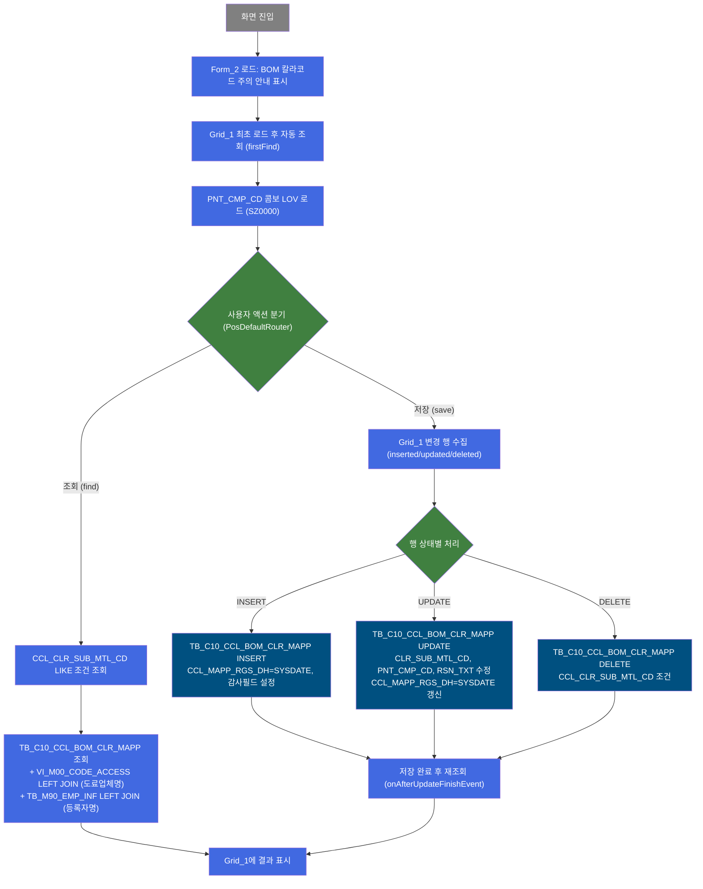
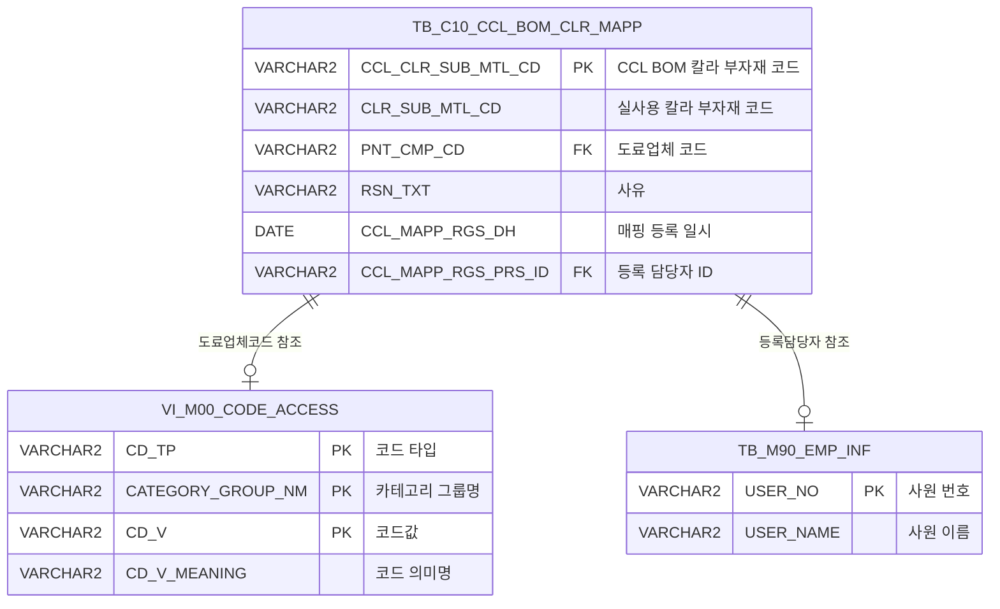

<h1 style="font-size: 40px; text-align: center; font-weight:
   bold; margin: 30px 0;">
  C107000060 레거시 시스템 분석 종합 보고서
</h1>


# 1. 시스템 개요
- **서비스 ID**: C107000060
- **업무명**: 실사용도료칼라코드관리 (CCL BOM 실사용 칼라코드 Mapping)
- **분석 일시**: 2026-03-17 11:06 KST
- **전체 Activity 수**: 3개 (Built-in: 3, Custom: 0)
- **분석자**: Claude Opus 4.6 / Sonnet (UI)
- **분석 도구**: /analyze-service C107000060
- **문서 버전**: 1.0

# 📊 비즈니스 프로세스 분석

## 시스템 목적

CCL(Continuous Coating Line) 공정에서 BOM(Bill of Materials) 상의 칼라코드와 실제 사용하는 도료의 칼라코드가 다를 경우, 그 매핑 관계를 관리하기 위한 화면이다. CCL 공정에서는 BOM에 등록된 칼라코드와 실제 투입되는 도료의 칼라코드가 상이한 경우가 발생할 수 있으며, 이 차이를 추적·관리하지 않으면 품질 관리 및 원자재 사용량 추적에 문제가 생길 수 있다.

본 화면은 CCL BOM 칼라코드(CCL_CLR_SUB_MTL_CD)와 실사용 칼라코드(CLR_SUB_MTL_CD), 도료업체(PNT_CMP_CD) 간의 매핑 정보를 CRUD(생성/조회/수정/삭제) 방식으로 관리한다. BOM 칼라코드와 다른 실사용 도료를 적용할 경우 출측 특기사항에 실사용 칼라코드와 도료사를 기록해야 하는 업무 규칙이 있으며, 화면 상단에 이에 대한 주의 안내 메시지가 표시된다.

## 핵심 워크플로우 다이어그램



### 상세 워크플로우 다이어그램



## 주요 유즈케이스

### UC-01: 칼라코드 매핑 정보 조회
- **Actor**: CCL 공정 관리자
- **목적**: CCL BOM 칼라코드별 실사용 칼라코드 및 도료업체 매핑 현황을 조회하여 확인

- **전제조건**:
  - 사용자가 시스템에 로그인되어 있음
  - TB_C10_CCL_BOM_CLR_MAPP 테이블에 매핑 데이터가 존재함

- **주요 흐름**:
  1. 화면 진입 시 Grid_1 자동 조회 실행 (firstFind 이벤트) - 전체 매핑 목록 표시
  2. (선택) CCL BOM 칼라코드 입력 필드에 검색 조건 입력
  3. 조회 버튼 클릭 → C107000060.select 쿼리 실행
  4. 조건에 해당하는 매핑 정보가 Grid에 표시 (칼라코드, 실사용칼라코드, 도료업체, 사유, 등록일자, 등록자)

- **대체 흐름**:
  - 조회 조건 미입력 시: `NVL(:CCL_CLR_SUB_MTL_CD, '%')` 조건으로 전체 목록 조회
  - 조회 결과 없음: Grid에 빈 목록 표시

- **후행조건**:
  - Grid에 매핑 데이터가 표시됨
  - 사용자가 행 추가/수정/삭제 작업 가능 상태

### UC-02: 칼라코드 매핑 정보 신규 등록
- **Actor**: CCL 공정 관리자
- **목적**: BOM 칼라코드와 실사용 칼라코드 간의 새로운 매핑 관계를 등록

- **전제조건**:
  - 조회 화면이 로드되어 있음
  - 등록할 CCL BOM 칼라코드가 중복되지 않음

- **주요 흐름**:
  1. 메뉴 "행추가" 클릭 → Grid에 빈 행 추가
  2. 칼라코드(CCL_CLR_SUB_MTL_CD) 입력 (편집 가능, 노란색 배경)
  3. 실사용칼라코드(CLR_SUB_MTL_CD) 입력 (편집 가능, 노란색 배경)
  4. 업체코드(PNT_CMP_CD) 콤보박스에서 도료업체 선택 (SZ0000 카테고리 LOV)
  5. (선택) 사유(RSN_TXT) 입력
  6. 저장 버튼 클릭 → C107000060.insert 실행
  7. 저장 완료 후 자동 재조회 (onAfterUpdateFinishEvent)

- **대체 흐름**:
  - PK 중복 시: DB 에러 발생, 저장 실패 메시지 표시
  - 필수 필드 미입력 시: 저장 실패

- **후행조건**:
  - TB_C10_CCL_BOM_CLR_MAPP에 새 레코드 삽입됨
  - CCL_MAPP_RGS_DH에 SYSDATE, CCL_MAPP_RGS_PRS_ID에 현재 사용자 ID 자동 설정
  - 감사 필드(CREATED_*, LAST_UPDATED_*) 자동 설정

### UC-03: 칼라코드 매핑 정보 수정
- **Actor**: CCL 공정 관리자
- **목적**: 기존 매핑 정보의 실사용칼라코드, 도료업체, 사유를 변경

- **전제조건**:
  - Grid에 기존 매핑 데이터가 표시되어 있음

- **주요 흐름**:
  1. Grid에서 수정할 행의 편집 가능 컬럼(실사용칼라코드, 업체코드, 사유) 직접 편집
  2. 저장 버튼 클릭 → C107000060.update 실행
  3. CCL_CLR_SUB_MTL_CD 기준으로 UPDATE, CCL_MAPP_RGS_DH = SYSDATE로 갱신
  4. 저장 완료 후 자동 재조회

- **대체 흐름**:
  - 칼라코드(PK) 컬럼은 기존 행에서 수정 불가 (신규 행에서만 입력)

- **후행조건**:
  - 매핑 정보가 수정되고 등록일시/등록자가 갱신됨

### UC-04: 칼라코드 매핑 정보 삭제
- **Actor**: CCL 공정 관리자
- **목적**: 불필요한 칼라코드 매핑 정보를 삭제

- **전제조건**:
  - Grid에 삭제 대상 행이 존재함

- **주요 흐름**:
  1. Grid에서 삭제할 행 선택 (멀티셀렉트 지원)
  2. 메뉴 "삭제" 클릭 → 선택 행에 빨간색 취소선 스타일 적용
  3. 저장 버튼 클릭 → C107000060.delete 실행 (CCL_CLR_SUB_MTL_CD 조건)
  4. 저장 완료 후 자동 재조회

- **대체 흐름**:
  - 행 미선택 시 삭제 메뉴 클릭: 동작 없음

- **후행조건**:
  - TB_C10_CCL_BOM_CLR_MAPP에서 해당 레코드 삭제됨

---
## 비즈니스 로직 상세

### 1. 칼라코드 LIKE 검색 로직

- **목적**: 사용자 입력 조건에 따른 유연한 칼라코드 검색
- **처리 케이스**:

  **[케이스 1: 조건 미입력 시 전체 조회]**
  ```
    조건: CCL_CLR_SUB_MTL_CD 파라미터가 NULL 또는 미입력
    처리:
      1. NVL(:CCL_CLR_SUB_MTL_CD, '%') → '%'로 변환
      2. NVL(CCL_CLR_SUB_MTL_CD, '%') LIKE '%' → 전체 행 조회
      3. 테이블의 CCL_CLR_SUB_MTL_CD가 NULL인 행도 포함
  ```

  **[케이스 2: 조건 입력 시 부분 일치 조회]**
  ```
    조건: CCL_CLR_SUB_MTL_CD 파라미터에 값 입력 (예: 'ABC%')
    처리:
      1. NVL(CCL_CLR_SUB_MTL_CD, '%') LIKE 'ABC%' 패턴 매칭
      2. LIKE 연산자이므로 와일드카드(%) 포함 가능
  ```

### 2. 도료업체코드 → 업체명 변환 (스칼라 서브쿼리)

- **목적**: 도료업체 코드값을 사람이 읽을 수 있는 업체명으로 변환하여 Grid에 표시
- **처리 케이스**:

  **[케이스 1: 코드 매핑 존재]**
  ```
    조건: PNT_CMP_CD 값이 VI_M00_CODE_ACCESS에 존재
    처리:
      1. CD_TP='PNT_CMP_CD', CATEGORY_GROUP_NM='SZ0000' 조건 조회
      2. CD_V = PNT_CMP_CD로 코드값 매칭
      3. CD_V_MEANING (업체명)을 PNT_CMP_NM으로 반환
  ```

  **[케이스 2: 코드 매핑 미존재]**
  ```
    조건: PNT_CMP_CD 값이 마스터에 없음
    처리:
      1. 스칼라 서브쿼리 결과 NULL 반환
      2. PNT_CMP_NM 컬럼에 NULL 표시
  ```

### 3. 등록담당자 ID → 이름 변환 (NVL + 스칼라 서브쿼리)

- **목적**: 등록 담당자 사번을 이름으로 변환하되, 이름이 없으면 사번 그대로 표시
- **처리 케이스**:

  **[케이스 1: 사원정보 존재]**
  ```
    조건: CCL_MAPP_RGS_PRS_ID가 TB_M90_EMP_INF.USER_NO에 존재
    처리:
      1. USER_NAME 조회하여 CCL_MAPP_RGS_PRS_NM으로 반환
  ```

  **[케이스 2: 사원정보 미존재]**
  ```
    조건: 사원 테이블에 해당 사번 없음
    처리:
      1. NVL(NULL, CCL_MAPP_RGS_PRS_ID) → 사번 ID 그대로 표시
  ```

---

# 💾 데이터 요구사항

## 핵심 테이블

### 1. TB_C10_CCL_BOM_CLR_MAPP - CCL BOM 칼라코드 매핑 관리
| 컬럼명 | 타입 | PK | 설명 |
|--------|------|----|------|
| CCL_CLR_SUB_MTL_CD | VARCHAR2 | ✅ | CCL BOM 칼라 부자재 코드 (PK) |
| CLR_SUB_MTL_CD | VARCHAR2 | | 실사용 칼라 부자재 코드 |
| PNT_CMP_CD | VARCHAR2 | | 도료업체 코드 |
| RSN_TXT | VARCHAR2 | | 사유 텍스트 |
| CCL_MAPP_RGS_DH | DATE | | 매핑 등록 일시 (SYSDATE 자동) |
| CCL_MAPP_RGS_PRS_ID | VARCHAR2 | | 매핑 등록 담당자 ID |
| CREATED_OBJECT_TYPE | VARCHAR2 | | 생성 객체 타입 (감사) |
| CREATED_OBJECT_ID | VARCHAR2 | | 생성 객체 ID (감사) |
| CREATED_PROGRAM_ID | VARCHAR2 | | 생성 프로그램 ID (감사) |
| CREATION_TIMESTAMP | DATE | | 생성 일시 (감사) |
| LAST_UPDATED_OBJECT_TYPE | VARCHAR2 | | 최종 수정 객체 타입 (감사) |
| LAST_UPDATED_OBJECT_ID | VARCHAR2 | | 최종 수정 객체 ID (감사) |
| LAST_UPDATE_PROGRAM_ID | VARCHAR2 | | 최종 수정 프로그램 ID (감사) |
| LAST_UPDATE_TIMESTAMP | DATE | | 최종 수정 일시 (감사) |

### 2. VI_M00_CODE_ACCESS - 공통 코드 마스터 뷰 (M00APUSER)
| 컬럼명 | 타입 | PK | 설명 |
|--------|------|----|------|
| CD_TP | VARCHAR2 | ✅ | 코드 타입 (예: PNT_CMP_CD) |
| CATEGORY_GROUP_NM | VARCHAR2 | ✅ | 카테고리 그룹명 (예: SZ0000) |
| CD_V | VARCHAR2 | ✅ | 코드값 |
| CD_V_MEANING | VARCHAR2 | | 코드 의미명 (업체명 등) |

### 3. TB_M90_EMP_INF - 사원 정보 (M90APUSER)
| 컬럼명 | 타입 | PK | 설명 |
|--------|------|----|------|
| USER_NO | VARCHAR2 | ✅ | 사원 번호 |
| USER_NAME | VARCHAR2 | | 사원 이름 |

## 데이터 플로우

### 1. 조회
```
[칼라코드 매핑 정보 조회]
화면 진입 (또는 조회 버튼 클릭)
→ C107000060.select
  FROM TB_C10_CCL_BOM_CLR_MAPP
  LEFT OUTER JOIN VI_M00_CODE_ACCESS ON CD_TP='PNT_CMP_CD' AND CATEGORY_GROUP_NM='SZ0000' AND CD_V=PNT_CMP_CD
  LEFT OUTER JOIN TB_M90_EMP_INF ON USER_NO=CCL_MAPP_RGS_PRS_ID
  WHERE NVL(CCL_CLR_SUB_MTL_CD,'%') LIKE NVL(:CCL_CLR_SUB_MTL_CD,'%')
→ Grid_1에 매핑 목록 표시 (7개 컬럼)
```

### 2. 신규 등록
```
[칼라코드 매핑 신규 등록]
행추가 메뉴 클릭 → 빈 행 추가 → 칼라코드/실사용코드/업체/사유 입력 → 저장 버튼 클릭
→ C107000060.insert
  INTO TB_C10_CCL_BOM_CLR_MAPP
  VALUES (CCL_CLR_SUB_MTL_CD, CLR_SUB_MTL_CD, PNT_CMP_CD, RSN_TXT, SYSDATE, ObjectId, 감사필드...)
→ 저장 완료 후 자동 재조회
```

### 3. 수정
```
[칼라코드 매핑 수정]
Grid에서 편집 가능 컬럼 직접 수정 → 저장 버튼 클릭
→ C107000060.update
  SET CLR_SUB_MTL_CD, PNT_CMP_CD, RSN_TXT, CCL_MAPP_RGS_DH=SYSDATE
  WHERE CCL_CLR_SUB_MTL_CD = :CCL_CLR_SUB_MTL_CD
→ 저장 완료 후 자동 재조회
```

### 4. 삭제
```
[칼라코드 매핑 삭제]
행 선택 → 삭제 메뉴 클릭 (빨간색 취소선 표시) → 저장 버튼 클릭
→ C107000060.delete
  FROM TB_C10_CCL_BOM_CLR_MAPP
  WHERE CCL_CLR_SUB_MTL_CD = :CCL_CLR_SUB_MTL_CD
→ 저장 완료 후 자동 재조회
```

## SQL 일람표
| SQL 이름 | 쿼리 ID | 타입 | 출처 | 테이블 |
|---------|---------|------|------|--------|
| CCL BOM 칼라코드 매핑 조회 | C107000060.select | SELECT | Service | TB_C10_CCL_BOM_CLR_MAPP, VI_M00_CODE_ACCESS, TB_M90_EMP_INF |
| CCL BOM 칼라코드 매핑 추가 | C107000060.insert | INSERT | Service | TB_C10_CCL_BOM_CLR_MAPP |
| CCL BOM 칼라코드 매핑 수정 | C107000060.update | UPDATE | Service | TB_C10_CCL_BOM_CLR_MAPP |
| CCL BOM 칼라코드 매핑 삭제 | C107000060.delete | DELETE | Service | TB_C10_CCL_BOM_CLR_MAPP |

## ER 다이어그램 (핵심 관계)



관계 설명:
- **TB_C10_CCL_BOM_CLR_MAPP**이 중심 테이블로, CCL BOM 칼라코드 매핑의 핵심 데이터를 관리
- **VI_M00_CODE_ACCESS**: PNT_CMP_CD (도료업체코드)를 CD_V로 조인하여 업체명(CD_V_MEANING) 조회 (CD_TP='PNT_CMP_CD', CATEGORY_GROUP_NM='SZ0000')
- **TB_M90_EMP_INF**: CCL_MAPP_RGS_PRS_ID를 USER_NO로 조인하여 등록 담당자명(USER_NAME) 조회

---

# 🖥️ 사용자 인터페이스 요구사항

## 화면 레이아웃 상세

### Layout 구조 (Absolute 배치)
```javascript
{
  itemType: "absolute",
  components: [
    {
      id: "C107000060_Form_1",    // 조회 조건 + 버튼
      type: "form",
      position: { left: 0, top: 0, width: 981, height: 28 }
    },
    {
      id: "C107000060_Menu_1",    // 새로고침/행추가/삭제 메뉴
      type: "menu",
      position: { left: 0, top: 28, width: 981, height: 25 }
    },
    {
      id: "C107000060_Form_2",    // BOM 칼라코드 주의 안내 레이블
      type: "form",
      position: { left: 231, top: 28, width: 749, height: 25 }
    },
    {
      id: "C107000060_Grid_1",    // 매핑 정보 그리드
      type: "grid",
      position: { left: -1, top: 54, width: 980, height: 511 }
    },
    {
      id: "C107000060_messagebox", // 상태 메시지 표시
      type: "messagebox",
      position: { left: -1, top: 567, width: 980, height: 19 }
    }
  ]
}
```

## 입출력 요소

### Form 컴포넌트
**C107000060_Form_1** (조회 조건 + 액션 버튼)
- CCL_CLR_SUB_MTL_CD: input - CCL BOM 칼라코드 입력 (너비 80px)
- find: button - 조회 → Grid_1 데이터 로드
- save: button - 저장 → Grid_1 변경 데이터 저장 (sendGrid)
- winClose: button - 닫기 → 화면 종료

**C107000060_Form_2** (주의 안내)
- cau_lab: label - "BOM 칼라코드와 다른 실사용 도료 적용 시 출측특기사항에 실사용 칼라코드와 도료사 기록 必" (너비 650px, onFormLoadFunction에서 동적 설정)

### Menu 컴포넌트
**C107000060_Menu_1**
- refresh: 새로고침 (refresh.gif) → Grid_1 초기화 후 재조회
- add: 행추가 (new.gif) → Grid_1에 빈 행 추가
- remove: 삭제 (remove.gif) → Grid_1 선택 행 삭제 마킹

### Grid 컴포넌트

**C107000060_Grid_1 (칼라코드 매핑 목록)**
- 편집 가능 여부: 예 (일부 컬럼)
- Split: 0 (고정 컬럼 없음)
- 설정: multiselect, smartRendering, validation, 페이지당 21행
- 컨텍스트 메뉴: 컬럼이동, 필터, 편집가능 토글, 엑셀 출력
- 주요 컬럼 (7개):

  **편집 가능 컬럼** (배경색 #FFFFC0 노란색):
  - CCL_CLR_SUB_MTL_CD: ed - 칼라코드 (9%, 중앙정렬, 편집가능, 노란색 배경)
  - CLR_SUB_MTL_CD: ed - 실사용칼라코드 (11%, 중앙정렬, 편집가능, 노란색 배경)
  - PNT_CMP_CD: combo_v - 업체코드/도료업체코드 (25%, 중앙정렬, 편집가능, LOV: SZ0000 카테고리)
  - RSN_TXT: ed - 사유 (32%, 좌측정렬, 편집가능, 노란색 배경)

  **읽기 전용 컬럼**:
  - CCL_MAPP_RGS_DH: ro - 등록일자 (8%, 중앙정렬, 날짜형식 %Y-%m-%d)
  - CCL_MAPP_RGS_PRS_ID: ro - 등록자ID (8%, 중앙정렬)
  - CCL_MAPP_RGS_PRS_NM: ro - 등록자명 (7%, 중앙정렬)

- DataProcessor 스타일:
  - inserted: 굵은 검정 글씨
  - updated: 굵은 검정 글씨
  - deleted: 굵은 빨간 글씨 + 취소선

## 화면 동작 흐름

### 1. 화면 초기 로딩
```
1. 화면 진입
2. Absolute Layout으로 Form_1, Menu_1, Form_2, Grid_1, messagebox 배치
3. Form_2 로드 완료 → onFormLoadFunction 이벤트 발생
   - cau_lab 레이블에 "BOM 칼라코드와 다른 실사용 도료 적용 시 출측특기사항에 실사용 칼라코드와 도료사 기록 必" 주의문구 설정
4. Grid_1 로드 완료 → onGridLoadFunction 이벤트 발생
   - PNT_CMP_CD 컬럼 콤보박스 LOV 데이터 로드
   - basicLovData.do?ServiceName=lov-service&category=SZ0000&code=PNT_CMP_CD 호출
   - 콤보 옵션: readonly(true,true), optionHeight(220)
5. Grid_1 최초 XLE 이벤트 → firstFind 이벤트 발생 (1회만)
   - Form_1 파라미터로 Grid_1 최초 데이터 조회
   - 이벤트 핸들러 자동 해제 (grid.detachEvent)
6. 상태바(messagebox) 초기화
```

### 2. 칼라코드 조회
```
1. 사용자가 CCL BOM 칼라코드 입력 (선택)
2. 조회 버튼 클릭
3. Form_1 파라미터 구성 → findUrl 생성
4. Grid_1.loadData(findUrl) 호출
5. C107000060-service → 분기(PosDefaultRouter) → 조회(FormSearch)
6. C107000060.select 쿼리 실행 (NVL LIKE 패턴)
7. Grid_1에 결과 바인딩, messagebox에 처리 결과 메시지 표시
```

### 3. 데이터 저장 (추가/수정/삭제)
```
1. 행추가(add) → Grid에 빈 행 추가 (inserted 상태)
   또는 기존 행 편집 (updated 상태)
   또는 행 선택 후 삭제(remove) → 빨간색 취소선 (deleted 상태)
2. 저장 버튼 클릭
3. Grid_1.sendGrid() 호출 → handleDataProcess.do
4. C107000060-service → 분기(PosDefaultRouter) → 저장(GridSave)
5. 행 상태별 쿼리 실행:
   - inserted → C107000060.insert
   - updated → C107000060.update
   - deleted → C107000060.delete
6. 저장 완료 → onAfterUpdateFinishEvent 발생
7. find('find','C107000060_Form_1','C107000060_Grid_1') 자동 재조회
```

## JavaScript 모듈

**C107000060.jsp** (인라인 스크립트)
- find(): Form_1 파라미터로 Grid_1 데이터 조회 (items[referenceItem].loadData(findUrl))
- save(): Grid_1 변경 데이터 저장 (items[referenceItem].sendGrid())
- refresh(): Grid_1 초기화 후 재조회 (clearDataProcess → loadData)
- add(): Grid_1에 새 행 추가 (items[referenceItem].addRow())
- remove(): Grid_1 선택 행 삭제 마킹 (items[referenceItem].removeRow())
- copy(): Grid_1 행 내용 클립보드 복사 (items[referenceItem].copyRowContent())
- undo(): Grid_1 실행 취소 (items[referenceItem].undo())
- redo(): Grid_1 다시 실행 (items[referenceItem].redo())
- findMessage(): messagebox에 appMsg 메시지 표시 (uiCommon.message())
- onGridContextMenuClick(): 컨텍스트 메뉴 이벤트 처리 (컬럼이동/필터/편집가능토글/엑셀출력)

## 주요 이벤트 핸들러

**firstFind (최초 자동 조회)**
- 이벤트 타입: onXLEEvent (Grid_1 로드 완료, 1회만)
- 처리 내용:
  1. Form_1 파라미터로 parentFindUrl 구성
  2. Grid_1.loadData(parentFindUrl) 호출
  3. grid.detachEvent(grdXle) → 이벤트 핸들러 자동 해제

**onFormLoadFunction (Form_2 로드 완료)**
- 이벤트 타입: onXLEEvent (Form_2 로드)
- 처리 내용:
  1. Form_2의 cau_lab 레이블에 주의 문구 동적 설정
  2. form.setItemLabel('cau_lab', ...) 호출

**onGridLoadFunction (Grid_1 로드 완료)**
- 이벤트 타입: onXLEEvent (Grid_1 로드)
- 처리 내용:
  1. PNT_CMP_CD 컬럼의 combo 객체 획득
  2. pntCmpCdCombo.loadXML(basicLovData.do?...) 호출하여 LOV 데이터 로드
  3. readonly(true,true) 설정
  4. setOptionHeight(220) 설정

**onAfterUpdateFinishEvent (저장 완료 후)**
- 이벤트 타입: afterUpdate
- 처리 내용:
  1. 저장 처리 완료 감지
  2. find('find','C107000060_Form_1','C107000060_Grid_1') 호출
  3. Form_1 조건으로 Grid_1 자동 재조회

**onGridContextMenuClick (컨텍스트 메뉴)**
- 이벤트 타입: contextMenu
- 처리 내용:
  1. move_grid: enableColumnMove 토글
  2. filter_grid: enableHeaderMenu 활성화
  3. editable_grid: setEditable 토글
  4. excel_grid: gridexcel/color 엑셀 다운로드

---

# 📌 특이사항 및 주의사항

## 1. NVL 패턴을 이용한 전체/부분 조회 통합
- **NVL + LIKE 패턴**: `NVL(CCL_CLR_SUB_MTL_CD,'%') LIKE NVL(:CCL_CLR_SUB_MTL_CD,'%')` 구문은 컬럼값이 NULL인 경우에도 '%'로 변환하여 LIKE 매칭에 포함시킨다. 이는 NULL 데이터가 존재할 경우 의도치 않은 전체 조회 결과를 반환할 수 있으므로, CCL_CLR_SUB_MTL_CD에 NULL이 들어가는 경우를 주의해야 한다.

## 2. UPDATE 시 스키마 한정자 불일치
- **C10APUSER 스키마 명시**: UPDATE 쿼리(C107000060.update)에서만 `C10APUSER.TB_C10_CCL_BOM_CLR_MAPP`으로 스키마를 명시하고, SELECT/INSERT/DELETE 쿼리에서는 스키마 없이 테이블명만 사용한다. DAO가 mesdao(MESAPUSER)로 설정되어 있어, C10APUSER 스키마를 명시한 UPDATE와 스키마 미명시인 나머지 쿼리가 서로 다른 스키마의 테이블을 참조할 가능성이 있다. 이는 MESAPUSER에서 TB_C10_CCL_BOM_CLR_MAPP에 대한 시노님(Synonym)이 C10APUSER를 가리키는 구조일 수 있다.

## 3. UPDATE 시 등록일시/등록자 갱신 정책
- **CCL_MAPP_RGS_DH = SYSDATE**: UPDATE 쿼리에서 매핑 등록일시(CCL_MAPP_RGS_DH)를 SYSDATE로 재설정한다. 일반적으로 "등록일시"는 최초 등록 시점을 유지하는 것이 관례이나, 이 테이블에서는 수정 시에도 갱신된다. 별도의 수정일시(UPD_DH) 컬럼이 없고 LAST_UPDATE_TIMESTAMP 감사 필드로 변경 이력을 추적하는 구조이다.

## 4. PK(칼라코드) 편집 가능 설정
- **CCL_CLR_SUB_MTL_CD 편집 가능**: Grid에서 PK 컬럼인 CCL_CLR_SUB_MTL_CD가 ed(편집 가능) 타입으로 설정되어 있다. 신규 행 추가 시 PK값을 입력해야 하므로 편집 가능이 필요하지만, 기존 행에서 PK를 수정하면 UPDATE 쿼리의 WHERE 조건과 불일치하여 다른 행이 수정되거나 수정 실패할 수 있다. 프론트엔드에서 기존 행의 PK 편집을 방지하는 별도 로직이 없으면 데이터 무결성 위험이 있다.

## 5. firstFind 이벤트의 1회성 실행 패턴
- **detachEvent 패턴**: Grid_1 최초 로드 시 firstFind가 자동 실행된 후 `grid.detachEvent(grdXle)`로 이벤트를 해제하는 패턴을 사용한다. 이는 Grid 초기화 완료 후 최초 1회만 자동 조회를 수행하기 위한 것으로, XLE(onXLEEvent) 완료 시점을 활용한 GLUE Framework 특유의 초기화 패턴이다.

---

# 📚 참고 문서

- **Service XML**: `src/service/C107000060-service.xml`
- **Query SQL**: `src/query/C107000060-query.glue_sql`
- **JSP**: `WebContents/C107000060.jsp`
- **UI Components**: `WebContents/header/kr/C107000060/C107000060_*.xml`
