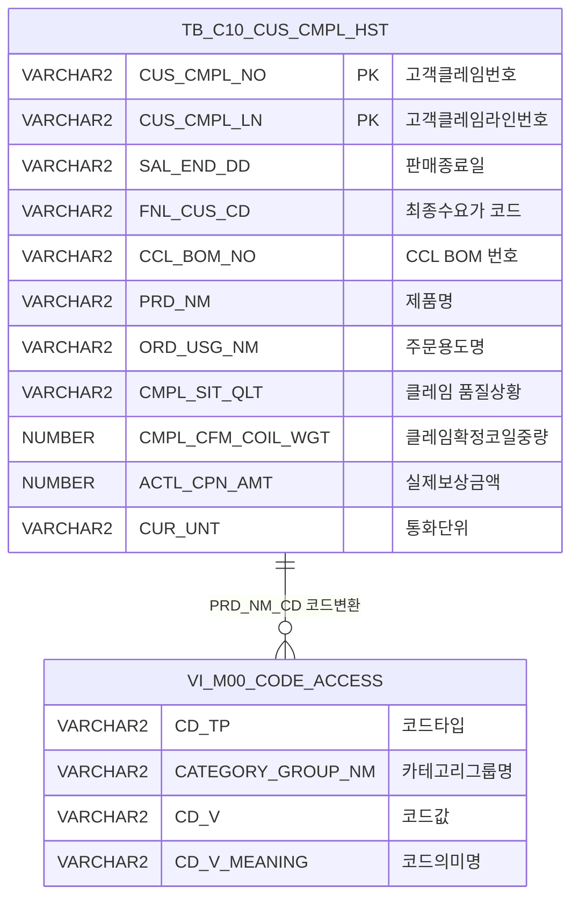

<h1 style="font-size: 40px; text-align: center; font-weight:
   bold; margin: 30px 0;">
  C107000070pop01 레거시 시스템 분석 종합 보고서
</h1>


# 1. 시스템 개요
- **서비스 ID**: C107000070pop01
- **업무명**: 고객불만이력 팝업
- **분석 일시**: 2026-03-17 11:06 KST
- **분석 시간**: 약 5분
- **전체 Activity 수**: 2 (Built-in 2개)
- **분석자**: Claude Opus 4.6 / Sonnet 4.6
- **분석 도구**: /analyze-service C107000070pop01
- **문서 버전**: 1.0

# 📊 비즈니스 프로세스 분석

## 시스템 목적

C107000070pop01은 CCL(Color Coated Line) 작업지시 화면에서 특정 고객의 클레임 이력을 요약하여 팝업으로 표시하는 서비스이다. 오퍼레이터가 작업 시작 전에 해당 고객에 대한 과거 품질 불만 이력을 한눈에 파악할 수 있도록 지원한다.

팝업은 최종수요가(FNL_CUS_CD), CCL BOM 번호, 품명 코드를 URL 파라미터로 전달받아 자동으로 조회를 수행한다. 조회 기간은 기본 2년으로 설정되며, 해당 기간 내 클레임 빈도가 높은 제품명/주문용도/불만유형(현상)을 1위·2위로 집계하고, 보상금액(다통화 환산 후 백만원 단위)과 보상중량 합계를 표시한다. 최근 클레임 3건의 상세보기 링크도 제공하여 빠른 조회가 가능하다.

현장직(ctl_tp=2) 사용자는 보안 정책(C10A2186)에 의해 상세보기 버튼이 비활성화되며, 2시간 동안 팝업을 차단하는 기능도 제공된다.

<!-- 단순 조회 서비스 (Custom Activity 0개, SELECT 쿼리만, Router → FormSearch 체인) → 워크플로우 다이어그램 생략 -->

## 주요 유즈케이스

### UC-01: 고객 클레임 이력 자동 조회
- **Actor**: CCL 공정 오퍼레이터
- **목적**: 작업지시 화면 진입 시 해당 고객의 과거 클레임 이력을 자동으로 팝업 표시하여 품질 주의사항을 사전 인지

- **전제조건**:
  - 부모 화면(C107000070)에서 FNL_CUS_CD, CCL_BOM_NO, PRD_NM_CD 파라미터를 전달
  - 해당 고객의 클레임 이력 데이터(TB_C10_CUS_CMPL_HST)가 존재
  - 팝업 차단 쿠키(popupYN)가 설정되지 않은 상태

- **주요 흐름**:
  1. 부모 화면에서 팝업 호출 → URL 파라미터(FNL_CUS_CD, CCL_BOM_NO, PRD_NM_CD) 전달
  2. Form_1 로드 완료(onFormLoad1) → SAL_END_DD_FR(2년 전), SAL_END_DD_TO(오늘) 자동 설정, URL 파라미터를 hidden 필드에 세팅
  3. Form_2 로드 완료(onFormLoad2) → 즉시 자동 조회 실행 (C107000070pop01.select)
  4. 13개 스칼라 서브쿼리 결과를 Form_2에 바인딩 → 보상금액, 보상중량, 불만유형, 품명, 주문용도, 최근 클레임 3건 표시
  5. 조회 결과의 null 항목은 '-'로 대체(findAfter), 클레임 번호 없는 상세보기 버튼 비활성화

- **대체 흐름**:
  - 조회 결과 없음: messageBox 값이 비면 "0건 조회" 메시지 표시
  - 현장직 사용자(ctl_tp=2): 접근제어 규칙 C10A2186에 의해 상세보기 버튼 3개 모두 비활성화

- **후행조건**:
  - 클레임 통계 요약 정보가 팝업에 표시됨
  - 오퍼레이터가 작업 시 품질 주의사항 인지

### UC-02: 클레임 상세 조회 (상세보기)
- **Actor**: 사무직 오퍼레이터
- **목적**: 최근 클레임 건의 상세 정보를 확인하여 구체적인 불만 사유와 조치 내역 파악

- **전제조건**:
  - UC-01 조회가 완료되어 최근 클레임 번호가 표시된 상태
  - 사용자가 사무직(ctl_tp=1)이어서 상세보기 버튼이 활성 상태

- **주요 흐름**:
  1. 상세보기 버튼(1/2/3 중 하나) 클릭
  2. 해당 hidden 필드(CUS_CMPL_NO_FREQ1/2/3)에서 클레임번호-라인번호 추출
  3. '-' 기준으로 CUS_CMPL_NO와 CUS_CMPL_LN 분리
  4. parent.parentPop() 호출하여 부모 화면의 상세 팝업 표시

- **대체 흐름**:
  - 클레임 번호가 없는 경우: 해당 상세보기 버튼이 이미 비활성화되어 클릭 불가

- **후행조건**:
  - 부모 화면에서 클레임 상세 팝업 표시

### UC-03: 팝업 차단 설정
- **Actor**: CCL 공정 오퍼레이터
- **목적**: 동일 고객에 대한 반복적인 팝업 표시를 일시적으로 차단하여 작업 효율 향상

- **전제조건**:
  - POPUPBlOCK_HIDDEN_TP='N' 파라미터가 전달되어 팝업차단 버튼이 활성화된 상태

- **주요 흐름**:
  1. "2시간동안팝업차단" 버튼 클릭
  2. 쿠키 설정: popupYN=N, 만료시간=현재+2시간
  3. 팝업 창 닫기 (self.close)

- **대체 흐름**:
  - POPUPBlOCK_HIDDEN_TP가 'N'이 아닌 경우: 팝업차단 버튼이 비활성화 상태로 표시

- **후행조건**:
  - 2시간 동안 해당 팝업 재표시 차단

---
## 비즈니스 로직 상세

### 1. 빈도 기반 TOP-N 순위 집계 (제품명, 주문용도, 불만유형)

- **목적**: 특정 고객·BOM·품명 조건에 해당하는 클레임 이력에서 빈도가 가장 높은 항목을 순위별로 추출하여 주요 불만 패턴을 파악
- **처리 케이스**:

  **[케이스 1: 제품명(PRD_NM) 빈도 순위]**
  ```
    조건: FNL_CUS_CD + CCL_BOM_NO + PRD_NM_CD 조건 일치하는 클레임 건
    처리:
      1. TB_C10_CUS_CMPL_HST에서 SAL_END_DD 범위 내 필터링
      2. GROUP BY PRD_NM → COUNT(PRD_NM) DESC 정렬
      3. ROWNUM < 3으로 TOP 2 추출
      4. R_NO=1 → PRD_NM_FREQ1 (1위 제품명)
      5. R_NO=2 → PRD_NM_FREQ2 (2위 제품명)
  ```

  **[케이스 2: 주문용도(ORD_USG_NM) 빈도 순위]**
  ```
    조건: 동일 필터 조건
    처리:
      1. GROUP BY ORD_USG_NM → COUNT DESC 정렬
      2. ROWNUM < 3으로 TOP 2 추출
      3. R_NO=1/2 → ORD_USG_NM_FREQ1/FREQ2
  ```

  **[케이스 3: 불만유형(CMPL_SIT_QLT) 빈도 순위]**
  ```
    조건: 동일 필터 조건
    처리:
      1. GROUP BY CMPL_SIT_QLT → COUNT DESC 정렬
      2. ROWNUM < 3으로 TOP 2 추출
      3. '1위 : ' / '2위 : ' 접두어 연결 후 CMPL_SIT_QLT_FREQ1/FREQ2로 반환
  ```

### 2. 다통화 환산 보상금액 합계

- **목적**: 클레임 건별로 다른 통화(USD, JPY, KRW, EUR)로 기록된 실제보상금액을 원화로 통일 환산하여 합산

- **처리 케이스**:

  **[케이스 1: 통화별 고정 환율 적용]**
  ```
    조건: CUR_UNT 컬럼값에 따라 분기
    처리:
      1. USD → ACTL_CPN_AMT × 1,198원 (TRUNC 적용)
      2. JPY → ACTL_CPN_AMT × 11원 (TRUNC 적용)
      3. KRW → ACTL_CPN_AMT × 100 (백원 단위 보정)
      4. EUR → ACTL_CPN_AMT × 1,362.17원 (TRUNC 적용)
  ```

- **계산 공식**:
  ```
  원화환산금액 = CASE CUR_UNT
    WHEN 'USD' THEN TRUNC(ACTL_CPN_AMT × 1198)
    WHEN 'JPY' THEN TRUNC(ACTL_CPN_AMT × 11)
    WHEN 'KRW' THEN ACTL_CPN_AMT × 100
    WHEN 'EUR' THEN TRUNC(ACTL_CPN_AMT × 1362.17)
  END

  최종보상금액(백만원) = TRUNC(SUM(원화환산금액) / 1,000,000)
  ```

### 3. CCL BOM 목록 집계 (LISTAGG)

- **목적**: 조건에 해당하는 모든 DISTINCT CCL_BOM_NO를 쉼표로 연결하여 단일 문자열로 반환
- **처리 케이스**:

  **[케이스 1: BOM 번호 존재]**
  ```
    처리:
      1. DISTINCT CCL_BOM_NO 추출
      2. LISTAGG(CCL_BOM_NO, ',') WITHIN GROUP (ORDER BY CCL_BOM_NO)
      3. 쉼표 구분 목록으로 결합
  ```

### 4. 최근 클레임 3건 추출 (날짜 역순)

- **목적**: 가장 최근에 발생한 클레임 3건의 번호와 판매종료일을 추출하여 상세보기 링크 제공
- **처리 케이스**:

  **[케이스 1: 최근 3건 추출]**
  ```
    처리:
      1. GROUP BY SAL_END_DD, CUS_CMPL_NO, CUS_CMPL_LN
      2. ORDER BY SAL_END_DD DESC (최근순 정렬)
      3. ROWNUM < 4로 TOP 3 추출
      4. CUS_CMPL_NO || '-' || CUS_CMPL_LN 형태로 결합
      5. R_NO=1/2/3 → CUS_CMPL_NO_FREQ1/2/3 및 SAL_END_DD1/2/3
  ```

### 5. CCL_BOM_NO NULL 분기 조건 처리

- **목적**: CCL BOM 번호의 존재 여부에 따라 다른 필터링 조건을 적용
- **처리 케이스**:

  **[케이스 1: CCL_BOM_NO 있음]**
  ```
    조건: FNL_CUS_CD IS NOT NULL AND CCL_BOM_NO IS NOT NULL
    처리:
      1. CCL_BOM_NO = :CCL_BOM_NO 조건 적용
      2. FNL_CUS_CD = :FNL_CUS_CD 조건 적용
      3. PRD_NM = VI_M00_CODE_ACCESS에서 PRD_NM_CD → 제품명 변환 후 비교
  ```

  **[케이스 2: CCL_BOM_NO 없음]**
  ```
    조건: FNL_CUS_CD IS NOT NULL AND CCL_BOM_NO IS NULL
    처리:
      1. CCL_BOM_NO IS NULL 조건 적용
      2. FNL_CUS_CD = :FNL_CUS_CD 조건 적용
      3. PRD_NM 변환 비교 동일
  ```

---

# 💾 데이터 요구사항

## 핵심 테이블

### 1. C10APUSER.TB_C10_CUS_CMPL_HST - (고객 클레임 이력)
| 컬럼명 | 타입 | PK | 설명 |
|--------|------|----|------|
| CUS_CMPL_NO | VARCHAR2 | ✅ | 고객클레임번호 |
| CUS_CMPL_LN | VARCHAR2 | ✅ | 고객클레임라인번호 |
| SAL_END_DD | VARCHAR2 | | 판매종료일 (YYYYMMDD) |
| FNL_CUS_CD | VARCHAR2 | | 최종수요가 코드 |
| CCL_BOM_NO | VARCHAR2 | | CCL BOM 번호 |
| PRD_NM | VARCHAR2 | | 제품명 |
| ORD_USG_NM | VARCHAR2 | | 주문용도명 |
| CMPL_SIT_QLT | VARCHAR2 | | 클레임 품질상황 (불만유형/현상) |
| CMPL_CFM_COIL_WGT | NUMBER | | 클레임 확정 코일 중량 (톤) |
| ACTL_CPN_AMT | NUMBER | | 실제보상금액 (원화 기준) |
| CUR_UNT | VARCHAR2 | | 통화 단위 (USD/JPY/KRW/EUR) |

### 2. M00APUSER.VI_M00_CODE_ACCESS - (공통 코드 뷰)
| 컬럼명 | 타입 | PK | 설명 |
|--------|------|----|------|
| CD_TP | VARCHAR2 | | 코드 타입 ('PRD_NM_CD') |
| CATEGORY_GROUP_NM | VARCHAR2 | | 카테고리 그룹명 ('SZ0000') |
| CD_V | VARCHAR2 | | 코드값 (PRD_NM_CD) |
| CD_V_MEANING | VARCHAR2 | | 코드 의미명 (실제 제품명) |

## 데이터 플로우

### 1. 조회

```
[고객 클레임 이력 통계 조회]
화면 진입 (URL 파라미터: FNL_CUS_CD, CCL_BOM_NO, PRD_NM_CD)
→ Form_1 로드 → SAL_END_DD_FR/TO 기본값 설정 (2년 전 ~ 오늘)
→ Form_2 로드 → 즉시 자동 조회 실행

→ C107000070pop01.select
  FROM DUAL
  13개 스칼라 서브쿼리 실행:
    각 서브쿼리: C10APUSER.TB_C10_CUS_CMPL_HST
    WHERE SAL_END_DD BETWEEN :SAL_END_DD_FR AND :SAL_END_DD_TO
      AND FNL_CUS_CD = :FNL_CUS_CD
      AND (CCL_BOM_NO = :CCL_BOM_NO OR CCL_BOM_NO IS NULL)
      AND PRD_NM = M00APUSER.VI_M00_CODE_ACCESS(PRD_NM_CD → 제품명 변환)
→ Form_2에 단일 행 결과 바인딩
→ null 항목 '-' 대체, 클레임 없는 상세보기 버튼 비활성화
```

## SQL 일람표

| SQL 이름 | 쿼리 ID | 타입 | 출처 | 테이블 |
|---------|---------|-----|-------|-------|
| 고객 클레임 이력 통계 조회 | C107000070pop01.select | SELECT | Service | C10APUSER.TB_C10_CUS_CMPL_HST, M00APUSER.VI_M00_CODE_ACCESS |

## ER 다이어그램 (핵심 관계)



관계 설명:
- **TB_C10_CUS_CMPL_HST**가 중심 테이블로 고객 클레임 이력 데이터를 저장
- **VI_M00_CODE_ACCESS**: PRD_NM_CD(제품명 코드)를 실제 제품명으로 변환하는 참조 뷰 (CD_TP='PRD_NM_CD', CATEGORY_GROUP_NM='SZ0000')

---

# 🖥️ 사용자 인터페이스 요구사항

## 화면 레이아웃 상세

### Layout 구조 (Absolute 포지셔닝)
```javascript
{
  type: "absolute",
  totalWidth: "600px",
  totalHeight: "433px",
  components: [
    {
      id: "C107000070pop01_Form_1",
      type: "form",
      position: { left: 0, top: 0, width: 600, height: 30 }
    },
    {
      id: "C107000070pop01_Form_2",
      type: "form",
      position: { left: 0, top: 30, width: 600, height: 380 }
    },
    {
      id: "C107000070pop01_messagebox",
      type: "messagebox",
      position: { left: 0, top: 410, width: 600, height: 23 }
    }
  ]
}
```

## 입출력 요소

### Form 컴포넌트

**C107000070pop01_Form_1** (조회 조건)
- SAL_END_DD_FR: calendar - 접수일 시작 (80px, 배경 #FFFFC0)
- SAL_END_DD_TO: calendar - 접수일 종료 (80px, 배경 #FFFFC0)
- find: button - 조회 → find 이벤트
- popUpBlock: button - 2시간동안팝업차단 → popUpBlock 이벤트 (기본 비활성)
- FNL_CUS_CD: hidden - 최종수요가 코드
- CCL_BOM_NO: hidden - CCL BOM 번호
- PRD_NM_CD: hidden - 품명 코드

**C107000070pop01_Form_2** (조회 결과)
- ACTL_CPN_AMT: input(readonly) - 보상금액(백만원) (380px, 빨간 볼드, 배경 #FFFFC0)
- CMPL_CFM_COIL_WGT: input(readonly) - 보상중량(톤) (380px, 빨간 볼드, 배경 #FFFFC0)
- CCL_BOM_NO: input(readonly) - CCL-BOM (380px, 빨간 볼드, 배경 #FFFFC0)
- CMPL_SIT_QLT_FREQ1: input(readonly) - 불만유형(현상) 1위 (188px, 빨간 볼드, 배경 #FFFFC0)
- CMPL_SIT_QLT_FREQ2: input(readonly) - 불만유형(현상) 2위 (187px, 빨간 볼드, 배경 #FFFFC0)
- PRD_NM_FREQ1: input(readonly) - 품명 1위 (188px)
- PRD_NM_FREQ2: input(readonly) - 품명 2위 (187px)
- ORD_USG_NM_FREQ1: input(readonly) - 주문용도 1위 (380px)
- ORD_USG_NM_FREQ2: input(readonly) - 주문용도 2위 (380px)
- SAL_END_DD1: input(readonly) - 불만상세조회 1건 판매종료일 (245px)
- CUS_CMPL_DETAIL1: button - 상세보기 → CUS_CMPL_DETAIL1 이벤트
- SAL_END_DD2: input(readonly) - 불만상세조회 2건 판매종료일 (245px)
- CUS_CMPL_DETAIL2: button - 상세보기 → CUS_CMPL_DETAIL2 이벤트
- SAL_END_DD3: input(readonly) - 불만상세조회 3건 판매종료일 (245px)
- CUS_CMPL_DETAIL3: button - 상세보기 → CUS_CMPL_DETAIL3 이벤트
- CUS_CMPL_NO_FREQ1: hidden - 최근 1번째 클레임번호-라인번호
- CUS_CMPL_NO_FREQ2: hidden - 최근 2번째 클레임번호-라인번호
- CUS_CMPL_NO_FREQ3: hidden - 최근 3번째 클레임번호-라인번호
- messageBox: hidden - 조회결과 유무 확인용 내부 필드

**C107000070pop01_messagebox** (상태바)
- 메시지박스 (XML 파일 미존재, 프레임워크 기본 동작)

## 화면 동작 흐름

### 1. 화면 초기 로딩 (자동 조회)
```
1. 부모 화면에서 팝업 호출 (URL 파라미터 전달)
2. Form_1 로드 완료 (onFormLoad1):
   - POPUPBlOCK_HIDDEN_TP='N'이면 팝업차단 버튼 활성화
   - SAL_END_DD_FR = 2년 전 날짜, SAL_END_DD_TO = 오늘 날짜 자동 설정
   - URL 파라미터(CCL_BOM_NO, FNL_CUS_CD, PRD_NM_CD)를 Form_1 hidden 필드에 세팅
3. Form_2 로드 완료 (onFormLoad2):
   - Form_1 조건으로 Form_2 즉시 자동 조회 실행
   - ctl_tp='2'(현장직)이면 상세보기 버튼 3개 모두 비활성화 (접근제어 C10A2186)
4. 조회 완료 (findAfter):
   - null 항목을 '-'로 대체
   - CUS_CMPL_NO_FREQ1/2/3 빈값이면 해당 상세보기 버튼 비활성화
   - findMessage() 호출 → 조회 건수 메시지 표시
```

### 2. 수동 조회 (기간 변경 후 재조회)
```
1. 사용자가 접수일 시작/종료(SAL_END_DD_FR/TO) 변경
2. 조회 버튼 클릭
3. Form_1 파라미터로 C107000070pop01-service 호출 (find 커맨드)
4. Form_2에 결과 바인딩
5. findAfter 콜백 실행 (null 처리, 버튼 제어, 메시지 표시)
```

### 3. 클레임 상세 조회 (상세보기 팝업)
```
1. 상세보기 버튼(1/2/3) 클릭
2. CUS_CMPL_NO_FREQ1/2/3 hidden 필드에서 값 추출
3. '-' 기준으로 분리: CUS_CMPL_NO, CUS_CMPL_LN
4. parent.parentPop(CUS_CMPL_NO, CUS_CMPL_LN) 호출
5. 부모 화면의 클레임 상세 팝업 표시
```

### 4. 팝업 차단 설정
```
1. "2시간동안팝업차단" 버튼 클릭
2. 쿠키 설정: popupYN=N, 만료=현재+2시간
3. self.close()로 팝업 닫기
```

## JavaScript 모듈

**C107000070pop01.jsp** (인라인 스크립트)
- onFormLoad1(): Form_1 로드 이벤트 — POPUPBlOCK_HIDDEN_TP 확인 후 팝업차단 버튼 활성화, 날짜 기본값(2년전~오늘) 설정, URL 파라미터(CCL_BOM_NO, FNL_CUS_CD, PRD_NM_CD) 세팅
- onFormLoad2(): Form_2 로드 이벤트 — Form_1 조건으로 즉시 조회 실행, 접근제어 C10A2186 적용(현장직 상세보기 비활성화)
- find(): 조회 버튼 핸들러 — Form_1 조건으로 Form_2 조회 (basicFormData.do → C107000070pop01-service)
- findAfter(): 조회 완료 콜백 — null→'-' 대체, 상세보기 버튼 활성/비활성 제어, findMessage() 호출
- findMessage(): 메시지 표시 — messageBox 값으로 조회 건수 안내 ('0건 조회' 또는 '조회되었습니다')
- popUpBlock(): 팝업차단 — 2시간 만료 쿠키(popupYN=N) 설정 후 self.close()
- CUS_CMPL_DETAIL1/2/3(): 상세보기 — CUS_CMPL_NO_FREQ1/2/3에서 '-' 기준 분리 후 parent.parentPop() 호출
- onGridContextMenuClick(): 그리드 컨텍스트 메뉴 — 공통 템플릿 포함 (본 화면에서는 그리드 미사용)

## 주요 이벤트 핸들러

**find (조회 버튼 클릭)**
- 이벤트 타입: Button Click (command: find)
- 처리 내용:
  1. Form_1의 SAL_END_DD_FR, SAL_END_DD_TO, FNL_CUS_CD, CCL_BOM_NO, PRD_NM_CD 파라미터 수집
  2. basicFormData.do URL로 C107000070pop01-service 호출 (actionType: find)
  3. Form_2에 조회 결과 바인딩
  4. findAfter 콜백으로 후처리 수행

**onFormLoad2 (Form_2 자동 조회)**
- 이벤트 타입: XLE (Form Load Complete)
- 처리 내용:
  1. Form_1 참조하여 조건 파라미터 구성
  2. Form_2 즉시 조회 실행
  3. 접근제어 규칙 C10A2186 확인
  4. ctl_tp='2'(현장직)이면 CUS_CMPL_DETAIL1/2/3 버튼 비활성화

**CUS_CMPL_DETAIL1/2/3 (상세보기)**
- 이벤트 타입: Button Click
- 처리 내용:
  1. 해당 CUS_CMPL_NO_FREQ hidden 필드 값 추출
  2. '-' 기준 split하여 CUS_CMPL_NO(인덱스 0)와 CUS_CMPL_LN(인덱스 1) 분리
  3. parent.parentPop(CUS_CMPL_NO, CUS_CMPL_LN) 호출하여 부모 화면 팝업 오픈

---

# 📌 특이사항 및 주의사항

## 1. 다통화 환산 시 하드코딩된 고정 환율
- **환율 하드코딩**: SQL 쿼리 내에 USD=1198, JPY=11, KRW=100(보정), EUR=1362.17 환율이 직접 코딩되어 있다. 환율 변동 시 쿼리 수정이 필요하며, 실시간 환율 연동이 아닌 고정값이므로 정확한 보상금액 산출에 오차가 발생할 수 있다.

## 2. 13개 스칼라 서브쿼리 반복 패턴으로 인한 성능 우려
- **동일 조건 반복**: 13개 스칼라 서브쿼리 모두 동일한 WHERE 조건(SAL_END_DD 범위, FNL_CUS_CD, CCL_BOM_NO, PRD_NM_CD)을 반복한다. TB_C10_CUS_CMPL_HST 테이블을 최소 13회 스캔하는 구조로, 데이터량 증가 시 성능 저하 가능성이 있다. WITH(CTE)나 인라인 뷰로 공통 필터링 결과를 재사용하는 방식으로 개선 가능하다.

## 3. PRD_NM_CD 코드 변환을 위한 서브쿼리 중첩
- **코드 변환 비효율**: 매 스칼라 서브쿼리 내에서 VI_M00_CODE_ACCESS 뷰를 별도로 조회하여 PRD_NM_CD를 실제 제품명으로 변환한다. 총 13개 × 1개 = 13회 코드 변환 서브쿼리가 실행되며, DUAL 기반 단일 행 반환 구조여서 최적화가 제한적이다.

## 4. CCL_BOM_NO NULL 분기의 OR 조건 복잡성
- **분기 로직**: CCL_BOM_NO가 NULL인 경우와 NOT NULL인 경우를 OR 조건으로 분리 처리한다. 각 스칼라 서브쿼리마다 이 분기가 반복되어 쿼리 가독성이 낮고, 옵티마이저의 인덱스 활용이 제한될 수 있다.

## 5. 접근제어 규칙 적용 방식 (클라이언트 사이드)
- **C10A2186 규칙**: 사무직/현장직 구분에 따른 상세보기 버튼 비활성화가 JavaScript(클라이언트 측)에서만 처리된다. 서버 측 검증이 없으므로, URL 직접 호출 등으로 우회 가능성이 존재한다.

## 6. 팝업차단 쿠키 기반 제어
- **쿠키 의존**: 팝업 차단을 브라우저 쿠키(popupYN=N, 2시간 만료)로 제어하므로, 쿠키 삭제 시 차단이 해제된다. 사용자별/세션별 서버 측 관리가 아닌 클라이언트 측 제어이다.

## 7. POPUPBlOCK_HIDDEN_TP 오타 가능성
- **변수명**: `POPUPBlOCK_HIDDEN_TP`에서 'l'(소문자 L)이 사용되어 일관성 문제가 있을 수 있다. 대소문자 혼용(`BlOCK`)이 의도적인지 오타인지 확인 필요하다.

---

# 📚 참고 문서

- **Query SQL**: `src/query/C107000070pop01-query.glue_sql`
- **Service XML**: `src/service/C107000070pop01-service.xml`
- **JSP**: `WebContents/C107000070pop01.jsp`
- **Form XML**:
  - `WebContents/header/kr/C107000070pop01/C107000070pop01_Form_1.xml`
  - `WebContents/header/kr/C107000070pop01/C107000070pop01_Form_2.xml`
