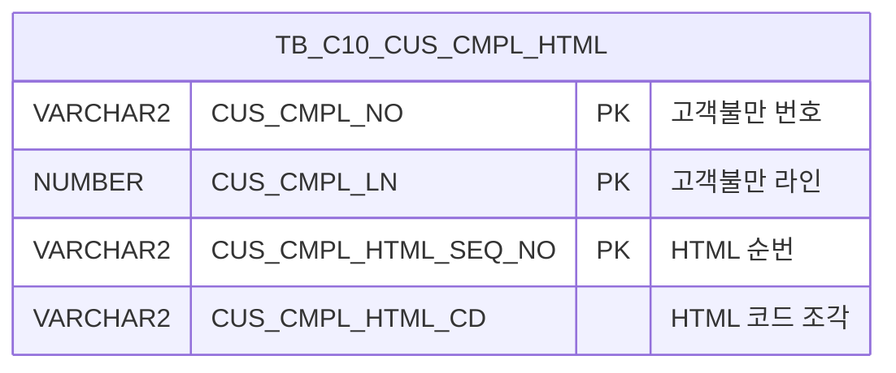

<h1 style="font-size: 40px; text-align: center; font-weight:
   bold; margin: 30px 0;">
  C107000070pop02 레거시 시스템 분석 종합 보고서
</h1>


# 1. 시스템 개요
- **서비스 ID**: C107000070pop02
- **업무명**: 고객불만이력 상세조회 (팝업)
- **분석 일시**: 2026-03-17 11:07 KST
- **전체 Activity 수**: 2개 (Built-in 2개)
- **분석자**: Claude Opus 4.6 / Sonnet 4.6
- **분석 도구**: /analyze-service C107000070pop02
- **문서 버전**: 1.0

# 📊 비즈니스 프로세스 분석

## 시스템 목적

본 서비스는 고객불만 이력의 상세 내용을 HTML 형태로 조회하여 팝업 화면에 표시하는 뷰어형 서비스이다. 부모 화면(C107000070)에서 특정 고객불만 건을 선택하면, 해당 건의 불만번호(CUS_CMPL_NO)와 라인번호(CUS_CMPL_LN)를 URL 파라미터로 전달받아 팝업이 열린다.

팝업 화면은 `TB_C10_CUS_CMPL_HTML` 테이블에 저장된 HTML 코드 조각들을 순서대로 조회하여, 이를 하나의 HTML 문자열로 결합한 후 화면 본문(body)에 직접 렌더링하는 방식으로 동작한다. Form XML 필드 정의 없이 Ajax로 데이터를 가져와 innerHTML로 삽입하는 특수한 UI 패턴을 사용한다.

---

## 주요 유즈케이스

### UC-01: 고객불만 상세이력 조회

- **Actor**: MES 오퍼레이터 / 품질관리 담당자
- **목적**: 선택한 고객불만 건의 상세 이력 내용을 HTML 형태로 팝업에서 확인

- **전제조건**:
  - 부모 화면(C107000070)에서 고객불만 목록이 조회되어 있음
  - 특정 고객불만 건이 선택되어 팝업 호출됨
  - CUS_CMPL_NO, CUS_CMPL_LN 파라미터가 URL로 전달됨

- **주요 흐름**:
  1. 부모 화면에서 고객불만 건 선택 → 팝업 호출 (CUS_CMPL_NO, CUS_CMPL_LN 전달)
  2. 팝업 화면 로딩 → Form XLE 이벤트 발생 → `onFormLoad1()` 호출
  3. `uiCommon.ajaxLoadData('c10AjaxData.do', ...)` 호출 — 파라미터: CUS_CMPL_NO, CUS_CMPL_LN, column-info=CUS_CMPL_HTML_CD
  4. 서비스(C107000070pop02-service) 실행 → Router(분기) → FormSearch(조회) Activity 체인
  5. `C107000070pop02.select` 쿼리로 `TB_C10_CUS_CMPL_HTML` 테이블에서 HTML 코드 조각 조회
  6. 응답 XML의 `<cell>` 태그를 순회하여 HTML 문자열 누적 결합
  7. `document.getElementById('CUS_CMPL').innerHTML`에 결합된 HTML 삽입 → 상세 이력 표시

- **대체 흐름**:
  - 조회 결과 없음: body 영역에 내용 없이 빈 화면 표시
  - Ajax 통신 실패: 오류 메시지 표시

- **후행조건**:
  - 고객불만 상세 이력이 HTML로 팝업 본문에 렌더링됨
  - 사용자는 내용을 읽기 전용으로 확인 가능

---

## 비즈니스 로직 상세

### 1. HTML 코드 조각 순차 조합

- **목적**: 테이블에 분할 저장된 HTML 코드 조각들을 올바른 순서로 조합하여 완성된 HTML 문서 생성
- **처리 케이스**:

  **[케이스 1: 정상 조회 및 조합]**
  ```
  조건: CUS_CMPL_NO, CUS_CMPL_LN에 해당하는 HTML 레코드 존재
  처리:
    1. TB_C10_CUS_CMPL_HTML에서 CUS_CMPL_HTML_CD 컬럼 조회
    2. ORDER BY TO_NUMBER(CUS_CMPL_HTML_SEQ_NO) ASC로 순번 정렬
    3. 조회된 모든 cell의 HTML 문자열을 순차적으로 누적 결합
    4. 결합된 HTML을 body#CUS_CMPL 요소에 innerHTML로 삽입
  ```

  **[케이스 2: 데이터 없음]**
  ```
  조건: 해당 불만번호+라인에 HTML 레코드 미존재
  처리:
    1. 빈 결과셋 반환
    2. body 영역에 내용 없이 표시
  ```

---

# 💾 데이터 요구사항

## 핵심 테이블

### 1. TB_C10_CUS_CMPL_HTML - (고객불만 상세이력 HTML 저장)
| 컬럼명 | 타입 | PK | 설명 |
|--------|------|----|-----|
| CUS_CMPL_NO | VARCHAR2 | ✅ | 고객불만 번호 |
| CUS_CMPL_LN | NUMBER | ✅ | 고객불만 라인 번호 |
| CUS_CMPL_HTML_SEQ_NO | VARCHAR2 | ✅ | HTML 순번 (TO_NUMBER로 정렬) |
| CUS_CMPL_HTML_CD | VARCHAR2 | | HTML 코드 조각 내용 |

## 데이터 플로우

### 1. 조회

```
[고객불만 상세이력 HTML 조회]
팝업 진입 (URL 파라미터: CUS_CMPL_NO, CUS_CMPL_LN)
→ Form XLE 이벤트 → onFormLoad1()
→ c10AjaxData.do Ajax 호출 (column-info=CUS_CMPL_HTML_CD)
→ C107000070pop02.select
  FROM C10APUSER.TB_C10_CUS_CMPL_HTML
  WHERE CUS_CMPL_NO = :CUS_CMPL_NO
    AND CUS_CMPL_LN = :CUS_CMPL_LN
  ORDER BY TO_NUMBER(CUS_CMPL_HTML_SEQ_NO) ASC
→ 응답 XML cell 순회 → HTML 문자열 누적 → body#CUS_CMPL.innerHTML 삽입
```

## SQL 일람표

| SQL 이름 | 쿼리 ID | 타입 | 출처 | 테이블 |
|---------|---------|-----|-------|-------|
| 고객불만이력 상세 HTML코드 조회 | C107000070pop02.select | SELECT | Service | C10APUSER.TB_C10_CUS_CMPL_HTML |

## ER 다이어그램 (핵심 관계)



관계 설명:
- `TB_C10_CUS_CMPL_HTML`은 단독 테이블로 사용됨
- CUS_CMPL_NO + CUS_CMPL_LN으로 상위 고객불만 건과 논리적 연결 (TB_C10_CUS_CMPL 등 참조 가능)
- CUS_CMPL_HTML_SEQ_NO로 HTML 조각의 순서를 관리

---

# 🖥️ 사용자 인터페이스 요구사항

## 화면 레이아웃 상세

### Layout 구조 (팝업)
```javascript
{
  type: "popup",
  title: "고객불만이력 상세조회",
  bodyId: "CUS_CMPL",
  urlParams: ["CUS_CMPL_NO", "CUS_CMPL_LN"],
  components: [
    {
      id: "C107000070pop02_Form_1",
      type: "form",
      area: { width: 382, height: 236, left: 0, top: 0 },
      note: "Form XML 비어있음, body#CUS_CMPL에 HTML 직접 렌더링"
    },
    {
      id: "C107000070pop02_messagebox",
      type: "messagebox",
      area: { width: 380, height: 23, left: 0, top: 228 }
    }
  ]
}
```

## 입출력 요소

### Form 컴포넌트
**C107000070pop02_Form_1**
- Form XML이 비어 있음 (items 태그만 존재, 실제 필드 정의 없음)
- 본문 내용은 Ajax로 HTML 문자열을 가져와 `body#CUS_CMPL` 요소에 innerHTML로 직접 렌더링
- 입력 필드 없이 조회 결과를 HTML로 표시하는 뷰어 역할

### Messagebox 컴포넌트
**C107000070pop02_messagebox**
- 메시지 표시 영역 (상태바)

## 화면 동작 흐름

### 1. 팝업 초기 로딩
```
1. 부모 화면(C107000070)에서 고객불만 건 선택 → 팝업 호출
2. URL 파라미터 수신: CUS_CMPL_NO, CUS_CMPL_LN
3. DHTMLX 초기화 → Form 컴포넌트 로딩 → XLE 이벤트 발생
4. onFormLoad1() 호출
5. uiCommon.ajaxLoadData('c10AjaxData.do', ...) 실행
   - 파라미터: CUS_CMPL_NO, CUS_CMPL_LN, column-info=CUS_CMPL_HTML_CD
6. 서비스 호출 → C107000070pop02.select 쿼리 실행
7. 응답 XML의 <cell> 태그 순회 → HTML 문자열 누적 결합
8. document.getElementById('CUS_CMPL').innerHTML에 결합된 HTML 삽입
9. 고객불만 상세 이력 내용 화면 표시 완료
```

### 2. 데이터 없는 경우
```
1. 팝업 호출 (CUS_CMPL_NO, CUS_CMPL_LN 전달)
2. onFormLoad1() → Ajax 호출
3. 쿼리 실행 결과 0건
4. cell 태그 없음 → HTML 문자열 비어있음
5. body#CUS_CMPL에 빈 내용 표시
```

## JavaScript 모듈

**C107000070pop02.jsp** (팝업 인라인 스크립트)
- onFormLoad1(): Form XLE 이벤트 핸들러 — `uiCommon.ajaxLoadData('c10AjaxData.do', ...)` 호출, 응답 XML 파싱 후 HTML 렌더링

## 주요 이벤트 핸들러

**onFormLoad1 (Form XLE 이벤트)**
- 이벤트 타입: Form 로드 완료 (XLE)
- 처리 내용:
  1. URL 파라미터에서 CUS_CMPL_NO, CUS_CMPL_LN 추출
  2. `uiCommon.ajaxLoadData('c10AjaxData.do', ...)` 호출 — column-info=CUS_CMPL_HTML_CD
  3. 응답 XML의 `<cell>` 태그를 순회하며 HTML 문자열 누적
  4. `document.getElementById('CUS_CMPL').innerHTML`에 결합된 HTML 삽입
  5. 고객불만 상세 이력 표시 완료

---

# 📌 특이사항 및 주의사항

## 1. Form XML 빈 파일 + innerHTML 직접 렌더링 패턴
- **비표준 UI 패턴**: Form XML에 필드 정의 없이 비어있고, Ajax 응답 HTML을 `body#CUS_CMPL` 태그에 `innerHTML`로 직접 삽입하는 방식 사용
- **XSS 위험**: DB에서 가져온 HTML을 검증 없이 innerHTML로 삽입하므로, TB_C10_CUS_CMPL_HTML 테이블에 악의적 스크립트가 저장될 경우 보안 취약점 발생 가능
- **현대화 시 고려**: DHTMLX Form 컴포넌트를 우회하는 패턴이므로, 현대화 시 안전한 HTML 렌더링 방식 (sanitize 처리 또는 구조화된 데이터 바인딩) 적용 필요

## 2. HTML 조각 분할 저장 구조
- **대용량 HTML 분할**: 고객불만 상세 이력이 하나의 HTML 문서가 아닌, `CUS_CMPL_HTML_SEQ_NO` 순번으로 분할 저장됨
- **순번 정렬**: `TO_NUMBER(CUS_CMPL_HTML_SEQ_NO)` — 순번이 VARCHAR2이지만 숫자 변환 후 정렬하므로, 비숫자 값이 입력될 경우 `ORA-01722` 오류 발생 가능
- **HTML 무결성**: 조각 단위로 잘라 저장하므로 태그가 중간에 잘릴 수 있고, 특정 조각 누락 시 HTML 구조 깨질 수 있음

## 3. C10APUSER 스키마 직접 참조
- **스키마 하드코딩**: 쿼리에서 `C10APUSER.TB_C10_CUS_CMPL_HTML` 형태로 스키마를 직접 명시
- 다른 서비스는 주로 `mesdao`(MESAPUSER) 를 사용하지만, 이 서비스는 `mesdao`를 통해 C10APUSER 스키마의 테이블을 직접 참조
- 환경 간 스키마명이 다를 경우 쿼리 수정 필요

## 4. column-info 파라미터 패턴
- **특수 Ajax 패턴**: `c10AjaxData.do` 엔드포인트에 `column-info=CUS_CMPL_HTML_CD` 파라미터를 전달하여 특정 컬럼 데이터만 선택적으로 조회
- 일반적인 Form/Grid 데이터 바인딩이 아닌, 특정 컬럼의 값만 추출하여 HTML 조합에 사용하는 커스텀 패턴

---

# 📚 참고 문서

- **Query SQL**: `src/query/C107000070pop02-query.glue_sql`
- **Service XML**: `src/service/C107000070pop02-service.xml`
- **JSP**: `WebContents/C107000070pop02.jsp`
- **Form XML**: `WebContents/header/kr/C107000070pop02/C107000070pop02_Form_1.xml`
