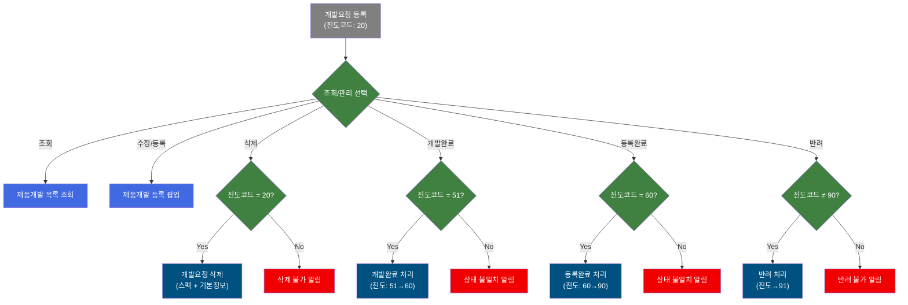
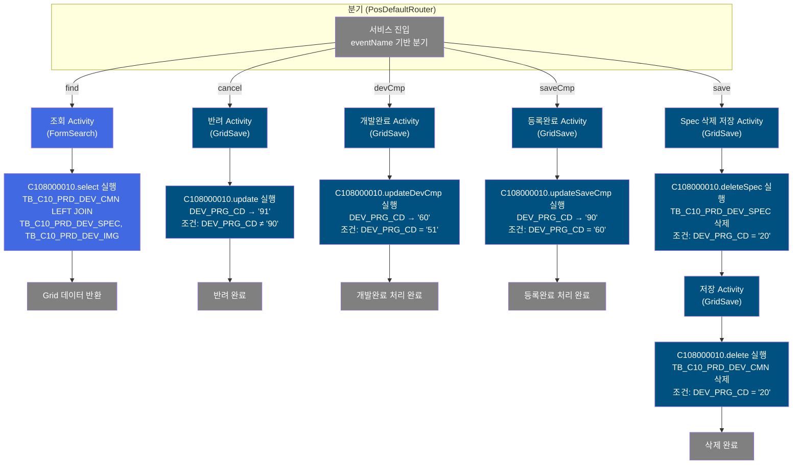
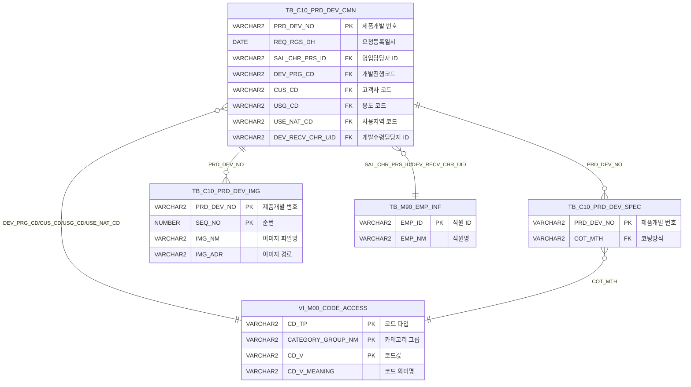

<h1 style="font-size: 40px; text-align: center; font-weight:
   bold; margin: 30px 0;">
  C108000010 레거시 시스템 분석 종합 보고서
</h1>


# 1. 시스템 개요
- **서비스 ID**: C108000010
- **업무명**: 제품개발진행 등록 및 조회
- **분석 일시**: 2026-03-17 08:28 (KST)
- **분석 시간**: 약 5분
- **전체 Activity 수**: 7개 (Built-in 7개, Custom 0개)
- **분석자**: Claude Opus 4.6 + Sonnet (Phase 4)
- **분석 도구**: /analyze-service C108000010
- **문서 버전**: 1.0

# 📊 비즈니스 프로세스 분석

## 시스템 목적

C108000010 서비스는 동국제강 C10(품질설계) 모듈의 **제품개발 진행 관리** 화면으로, 영업부서에서 요청한 신제품 개발 건의 전체 라이프사이클을 관리한다. 개발요청 등록부터 승인대기, 개발완료, 등록완료(종결), 반려까지의 진도 상태를 단계별로 전이시키며, 각 단계별 권한 검증을 수행한다.

주요 업무 흐름은 영업담당자가 고객 요구 기반으로 제품개발을 요청하면, 개발담당자가 접수하여 스펙을 등록하고, 승인 → 개발완료 → 등록완료의 단계를 거쳐 종결하는 것이다. 각 단계 전이 시에는 현재 진도코드 검증이 필수이며, 잘못된 상태에서의 전이는 차단된다. 또한 개발요청 단계(진도코드 20)에서만 삭제가 가능하여 데이터 무결성을 보호한다.

## 핵심 워크플로우 다이어그램



### 상세 워크플로우 다이어그램



## 주요 유즈케이스

### UC-01: 제품개발 목록 조회
- **Actor**: 품질설계 담당자 / 영업담당자
- **목적**: 등록된 제품개발 건의 진행 현황을 조건별로 조회하여 현재 상태를 파악

- **전제조건**:
  - 사용자가 시스템에 로그인되어 있음
  - C108000010 화면 접근 권한이 있음

- **주요 흐름**:
  1. 화면 진입 시 개발요청일 범위가 당월 1일~오늘로 자동 설정
  2. 사용자가 개발요청자, 고객사코드, 개발담당자, 코팅방식, 진도코드 등 조건 입력
  3. 조회 버튼 클릭
  4. 시작일/종료일 유효성 검사 (둘 다 필수, 한쪽만 입력 불가)
  5. C108000010.select 쿼리 실행 → Grid에 제품개발 목록 표시

- **대체 흐름**:
  - 개발요청 시작일만 입력: "개발요청 종료일을 입력해주세요" 알림
  - 개발요청 종료일만 입력: "개발요청 시작일을 입력해주세요" 알림
  - 두 날짜 모두 미입력: "개발요청일는 입력해야 합니다" 알림
  - 조회 결과 없음: 빈 Grid 표시

- **후행조건**:
  - Grid에 조회된 제품개발 목록이 표시됨
  - 개발번호 클릭, 상태 변경, 삭제 등 후속 작업이 가능한 상태

### UC-02: 제품개발 등록/수정 (팝업)
- **Actor**: 영업담당자 / 개발담당자
- **목적**: 신규 제품개발 건을 등록하거나 기존 건의 정보를 수정

- **전제조건**:
  - 신규 등록 시: Grid 행 미선택 상태에서 수정/등록 버튼 클릭
  - 수정 시: Grid에서 대상 행 선택 후 수정/등록 버튼 클릭

- **주요 흐름**:
  1. 수정/등록(create) 버튼 클릭
  2. 선택된 행이 있으면 PRD_DEV_NO, REQ_RGS_DH, DEV_REQ_FILE 값 추출
  3. C108000010pop01 팝업 오픈 (900x447, 모달)
  4. 팝업에서 제품개발 정보 입력/수정 후 저장
  5. 팝업 닫기 시 메인 화면 자동 숨김 처리 (onClose 이벤트)

- **대체 흐름**:
  - 행 미선택 시: 빈 파라미터로 팝업 오픈 (신규 등록 모드)

- **후행조건**:
  - 신규 등록 시 진도코드 '20'(개발요청 등록)으로 자동 설정
  - 개발번호 자동 채번 (D + 연도코드 + 월코드 + 시퀀스 3자리)

### UC-03: 개발완료 처리
- **Actor**: 개발담당자
- **목적**: 승인대기 상태(51)인 제품개발 건을 개발완료 상태(60)로 전이

- **전제조건**:
  - Grid에서 대상 행의 체크박스(PRD_DEV_CFM) 선택
  - 대상 건의 진도코드가 '51'(승인대기)

- **주요 흐름**:
  1. Grid에서 대상 행 체크박스 선택 (PRD_DEV_CFM = 1)
  2. 개발완료(devCmp) 버튼 클릭
  3. 선택된 행들의 진도코드 = '51' 여부 검증
  4. 확인 다이얼로그 표시 ("N건 개발완료 하시겠습니까?")
  5. 확인 클릭 시 C108000010.updateDevCmp 실행 → DEV_PRG_CD = '60'

- **대체 흐름**:
  - 진도코드가 51이 아닌 경우: "진도코드가 51-승인대기 상태에서만 가능합니다" 알림
  - 선택된 행이 없는 경우: "반려할 데이터가 없습니다" 알림 (코드상 메시지 오류)

- **후행조건**:
  - 대상 건의 진도코드가 '60'(개발완료)으로 변경됨
  - Grid 자동 재조회

### UC-04: 등록완료 처리
- **Actor**: 품질설계 담당자
- **목적**: 개발완료 상태(60)인 제품개발 건을 등록완료(90, 종결) 상태로 전이

- **전제조건**:
  - Grid에서 대상 행의 체크박스 선택
  - 대상 건의 진도코드가 '60'(개발완료)

- **주요 흐름**:
  1. Grid에서 대상 행 체크박스 선택
  2. 등록완료(saveCmp) 버튼 클릭
  3. 선택된 행들의 진도코드 = '60' 여부 검증
  4. 확인 다이얼로그 표시 ("N건 등록완료 하시겠습니까?")
  5. 확인 클릭 시 C108000010.updateSaveCmp 실행 → DEV_PRG_CD = '90'

- **대체 흐름**:
  - 진도코드가 60이 아닌 경우: "진도코드가 60-개발완료 상태에서만 가능합니다" 알림
  - 선택된 행이 없는 경우: "반려할 데이터가 없습니다" 알림 (코드상 메시지 오류)

- **후행조건**:
  - 대상 건의 진도코드가 '90'(등록완료/종결)으로 변경됨
  - Grid 자동 재조회

### UC-05: 반려 처리
- **Actor**: 품질설계 담당자
- **목적**: 진행 중인 제품개발 건을 반려(91) 상태로 전이하여 개발 프로세스를 중단

- **전제조건**:
  - Grid에서 대상 행의 체크박스 선택
  - 대상 건의 진도코드가 '90'(등록완료)이 아닌 상태

- **주요 흐름**:
  1. Grid에서 대상 행 체크박스 선택
  2. 반려(cancel) 버튼 클릭
  3. 선택된 행들의 진도코드 ≠ '90' 여부 검증
  4. 확인 다이얼로그 표시 ("N건 반려 하시겠습니까?")
  5. 확인 클릭 시 C108000010.update 실행 → DEV_PRG_CD = '91'

- **대체 흐름**:
  - 진도코드가 90인 경우: "진도코드가 90-등록완료(종결)은 반려 불가능합니다" 알림
  - 선택된 행이 없는 경우: "반려할 데이터가 없습니다" 알림

- **후행조건**:
  - 대상 건의 진도코드가 '91'(반려)로 변경됨
  - Grid 자동 재조회

### UC-06: 제품개발 삭제
- **Actor**: 영업담당자
- **목적**: 개발요청 등록 상태(20)인 건을 삭제하여 잘못된 요청을 취소

- **전제조건**:
  - Grid에서 대상 행을 삭제 상태로 변경 (컨텍스트 메뉴 → 삭제)
  - 대상 건의 진도코드가 '20'(개발요청 등록)

- **주요 흐름**:
  1. Grid에서 대상 행 선택 후 컨텍스트 메뉴 → 삭제
  2. 저장(save) 버튼 클릭
  3. 삭제 상태 행의 진도코드 = '20' 여부 검증
  4. 확인 다이얼로그 표시 ("저장 하시겠습니까?")
  5. 확인 클릭 시 Spec 삭제(C108000010.deleteSpec) → 기본정보 삭제(C108000010.delete) 순차 실행

- **대체 흐름**:
  - 진도코드가 20이 아닌 경우: "진도코드가 20-개발요청 등록 일때만 삭제 가능합니다" 알림
  - 삭제 대상 행이 없는 경우: "저장할 데이타가 없습니다" 알림

- **후행조건**:
  - TB_C10_PRD_DEV_SPEC의 스펙 데이터 먼저 삭제
  - TB_C10_PRD_DEV_CMN의 기본정보 삭제
  - Grid 자동 재조회

### UC-07: 개발번호 상세 조회 (화면 이동)
- **Actor**: 품질설계 담당자
- **목적**: 특정 제품개발 건의 상세 정보를 확인하기 위해 상세 화면으로 이동

- **전제조건**:
  - Grid에 조회 결과가 있음

- **주요 흐름**:
  1. Grid의 개발번호(PRD_DEV_NO) 컬럼 링크 클릭
  2. doLink 함수에서 PRD_DEV_NO 값 추출
  3. parent.newRemoveOpenTab('C108000050', 'PRD_DEV_NO=' + val) 호출
  4. C108000050 탭 화면으로 이동하여 해당 개발번호의 상세 정보 표시

- **후행조건**:
  - C108000050 탭이 열리고 해당 개발번호의 상세 정보가 표시됨

---
## 비즈니스 로직 상세

### 1. 진도코드 단계별 상태 전이 규칙

- **목적**: 제품개발 프로세스의 단계별 상태를 엄격히 관리하여 잘못된 전이를 방지

- **처리 케이스**:

  **[케이스 1: 개발완료 전이 (51 → 60)]**
  ```
    조건: 현재 DEV_PRG_CD = '51' (승인대기) AND PRD_DEV_CFM = '1' (체크)
    처리:
      1. JS에서 진도코드 앞 2자리가 '51'인지 검증
      2. SQL WHERE절에서 DEV_PRG_CD = '51' 조건 재검증
      3. 검증 통과 시 DEV_PRG_CD = '60'으로 UPDATE
      4. 변경 추적 필드(LAST_UPDATED_*) 갱신
  ```

  **[케이스 2: 등록완료 전이 (60 → 90)]**
  ```
    조건: 현재 DEV_PRG_CD = '60' (개발완료) AND PRD_DEV_CFM = '1' (체크)
    처리:
      1. JS에서 진도코드 앞 2자리가 '60'인지 검증
      2. SQL WHERE절에서 DEV_PRG_CD = '60' 조건 재검증
      3. 검증 통과 시 DEV_PRG_CD = '90'으로 UPDATE
      4. 변경 추적 필드 갱신
  ```

  **[케이스 3: 반려 전이 (any except 90 → 91)]**
  ```
    조건: 현재 DEV_PRG_CD ≠ '90' (등록완료가 아님) AND PRD_DEV_CFM = '1' (체크)
    처리:
      1. JS에서 진도코드 앞 2자리가 '90'이면 차단
      2. SQL WHERE절에서 DEV_PRG_CD != '90' 조건 재검증
      3. 검증 통과 시 DEV_PRG_CD = '91'로 UPDATE
      4. 변경 추적 필드 갱신
  ```

  **[케이스 4: 삭제 (20 → 물리적 삭제)]**
  ```
    조건: 현재 DEV_PRG_CD = '20' (개발요청 등록)
    처리:
      1. JS에서 진도코드 앞 2자리가 '20'인지 검증
      2. 스펙 삭제 먼저 실행 (TB_C10_PRD_DEV_SPEC WHERE PRD_DEV_NO 서브쿼리 AND DEV_PRG_CD = '20')
      3. 기본정보 삭제 실행 (TB_C10_PRD_DEV_CMN WHERE DEV_PRG_CD = '20')
      4. 진도코드 '20'이 아니면 SQL 레벨에서도 삭제 차단
  ```

### 2. 개발번호 자동 채번 로직

- **목적**: 제품개발 건마다 고유한 개발번호를 자동 생성 (팝업 화면 C108000010pop01에서 수행)

- **처리 케이스**:

  **[채번 규칙]**
  ```
    형식: D + [연도코드] + [월코드] + [3자리 시퀀스]
    처리:
      1. VI_M00_CODE_ACCESS에서 현재 연도의 연도코드(YR_TP) 조회
      2. VI_M00_CODE_ACCESS에서 현재 월의 월코드(MN_TP) 조회
      3. SQ_C10_PRD_DEV_CMN 시퀀스 NEXTVAL로 일련번호 생성
      4. LPAD(시퀀스, 3, '0')으로 3자리 패딩
      5. 결합: 'D' || 연도코드 || 월코드 || 패딩 시퀀스
  ```

### 3. 코드값 → 의미명 변환 (스칼라 서브쿼리)

- **목적**: DB에 저장된 코드값을 사용자에게 표시할 의미명으로 변환

- **처리 케이스**:

  **[케이스 1: 진도코드 변환]**
  ```
    조건: DEV_PRG_CD 컬럼 표시 시
    처리:
      1. CM.DEV_PRG_CD 원본 코드값 추출
      2. VI_M00_CODE_ACCESS에서 CD_TP='DEV_PRG_CD', CATEGORY_GROUP_NM='SZ0000' 조건으로 CD_V_MEANING 조회
      3. "코드 - 의미명" 형태로 결합 (예: "20 - 개발요청 등록")
  ```

  **[케이스 2: 고객사/용도/사용지역/코팅방식 변환]**
  ```
    조건: CUS_CD, USG_CD, USE_NAT_CD, COT_MTH 컬럼 표시 시
    처리:
      1. 각 코드별 CD_TP 지정 (CUS_CD, ORD_USG_CD, NAT_CD, COT_MTH)
      2. VI_M00_CODE_ACCESS에서 해당 CD_TP, CATEGORY_GROUP_NM='SZ0000' 조건으로 의미명 조회
      3. 담당자ID(SAL_CHR_PRS_ID, DEV_RECV_CHR_UID)는 TB_M90_EMP_INF에서 EMP_NM 조회
  ```

  **[케이스 3: 첨부파일 존재 여부]**
  ```
    조건: FILE_YN 컬럼 표시 시
    처리:
      1. TB_C10_PRD_DEV_IMG에서 IMG_NM 조회
      2. DECODE(IMG.IMG_NM, null, 'N', 'Y') 변환
      3. 'Y' 또는 'N'으로 첨부파일 존재 여부 표시
  ```

---

# 💾 데이터 요구사항

## 핵심 테이블

### 1. TB_C10_PRD_DEV_CMN - (제품개발 기본정보)
| 컬럼명 | 타입 | PK | 설명 |
|--------|------|----|------|
| PRD_DEV_NO | VARCHAR2 | ✅ | 제품개발 번호 (PK) |
| REQ_RGS_DH | DATE | | 요청등록일시 |
| SAL_CHR_PRS_ID | VARCHAR2 | | 영업담당자 ID |
| DEV_PRG_CD | VARCHAR2 | | 개발진행코드 (20/51/60/90/91) |
| CUS_CD | VARCHAR2 | | 고객사 코드 |
| USG_CD | VARCHAR2 | | 용도 코드 |
| USE_NAT_CD | VARCHAR2 | | 사용지역 코드 |
| APP_SIM_RCV_ADDR | VARCHAR2 | | 승인시편 수신 주소 |
| APP_SIM_RCV_NM | VARCHAR2 | | 승인시편 수신자명 |
| APP_SIM_RCV_PHON | VARCHAR2 | | 승인시편 수신 연락처 |
| DEV_REQ_RMK | VARCHAR2 | | 개발요청 비고 |
| DEV_REQ_FILE | VARCHAR2 | | 개발요청 첨부파일 여부 |
| DEV_RGS_DH | DATE | | 개발접수일시 |
| DEV_RECV_CHR_UID | VARCHAR2 | | 개발수령담당자 ID |
| PROC_SIM_MO | VARCHAR2 | | Line Sample 생산 MO |
| DEV_RECV_RMK | VARCHAR2 | | 개발접수 비고 |
| CREATED_OBJECT_TYPE | VARCHAR2 | | 생성 객체 타입 |
| CREATED_OBJECT_ID | VARCHAR2 | | 생성 객체 ID |
| CREATED_PROGRAM_ID | VARCHAR2 | | 생성 프로그램 ID |
| CREATION_TIMESTAMP | DATE | | 생성 일시 |
| LAST_UPDATED_OBJECT_TYPE | VARCHAR2 | | 최종수정 객체 타입 |
| LAST_UPDATED_OBJECT_ID | VARCHAR2 | | 최종수정 객체 ID |
| LAST_UPDATE_PROGRAM_ID | VARCHAR2 | | 최종수정 프로그램 ID |
| LAST_UPDATE_TIMESTAMP | DATE | | 최종수정 일시 |

### 2. TB_C10_PRD_DEV_SPEC - (제품개발 스펙정보)
| 컬럼명 | 타입 | PK | 설명 |
|--------|------|----|------|
| PRD_DEV_NO | VARCHAR2 | ✅ | 제품개발 번호 (FK → TB_C10_PRD_DEV_CMN) |
| COT_MTH | VARCHAR2 | | 코팅방식 코드 |

### 3. TB_C10_PRD_DEV_IMG - (제품개발 이미지/파일정보)
| 컬럼명 | 타입 | PK | 설명 |
|--------|------|----|------|
| PRD_DEV_NO | VARCHAR2 | ✅ | 제품개발 번호 (FK → TB_C10_PRD_DEV_CMN) |
| SEQ_NO | NUMBER | ✅ | 순번 |
| IMG_NM | VARCHAR2 | | 이미지 파일명 |
| IMG_ADR | VARCHAR2 | | 이미지 파일 경로 |

### 4. TB_M90_EMP_INF - (직원 정보, M90APUSER 스키마)
| 컬럼명 | 타입 | PK | 설명 |
|--------|------|----|------|
| EMP_ID | VARCHAR2 | ✅ | 직원 ID |
| EMP_NM | VARCHAR2 | | 직원명 |

### 5. VI_M00_CODE_ACCESS - (공통코드 뷰, M00APUSER 스키마)
| 컬럼명 | 타입 | PK | 설명 |
|--------|------|----|------|
| CD_TP | VARCHAR2 | ✅ | 코드 타입 |
| CATEGORY_GROUP_NM | VARCHAR2 | ✅ | 카테고리 그룹명 |
| CD_V | VARCHAR2 | ✅ | 코드값 |
| CD_V_MEANING | VARCHAR2 | | 코드 의미명 |

## 데이터 플로우

### 1. 조회

```
[제품개발 목록 조회]
화면 진입 → 조건 입력 (개발요청일 범위, 개발요청자, 고객사, 코팅방식, 진도코드 등)
→ C108000010.select
  FROM C10APUSER.TB_C10_PRD_DEV_CMN CM
  LEFT OUTER JOIN (SELECT PRD_DEV_NO, MIN(COT_MTH) FROM C10APUSER.TB_C10_PRD_DEV_SPEC GROUP BY PRD_DEV_NO) SP
    ON CM.PRD_DEV_NO = SP.PRD_DEV_NO
  LEFT OUTER JOIN (SELECT PRD_DEV_NO, MAX(IMG_NM), MAX(IMG_ADR) FROM TB_C10_PRD_DEV_IMG GROUP BY PRD_DEV_NO) IMG
    ON CM.PRD_DEV_NO = IMG.PRD_DEV_NO
  WHERE CM.REQ_RGS_DH BETWEEN :REQ_RGS_DH_FR AND :REQ_RGS_DH_TO + 1
    AND CM.SAL_CHR_PRS_ID LIKE :SAL_CHR_PRS_ID%
    AND CM.CUS_CD LIKE :CUS_CD%
    AND CM.DEV_RECV_CHR_UID LIKE :DEV_RECV_CHR_UID%
    AND CM.DEV_PRG_CD LIKE :DEV_PRG_CD%
    AND SP.COT_MTH LIKE :COT_MTH%
  스칼라 서브쿼리로 담당자명, 코드의미명 변환
→ Grid에 제품개발 목록 표시
```

### 2. 상태 변경 (개발완료/등록완료/반려)

```
[개발완료 처리]
Grid 체크박스 선택 → 개발완료 버튼 클릭
→ JS 진도코드 '51' 검증
→ C108000010.updateDevCmp
  UPDATE C10APUSER.TB_C10_PRD_DEV_CMN
  SET DEV_PRG_CD = '60', LAST_UPDATED_* = :변경정보
  WHERE PRD_DEV_NO = :PRD_DEV_NO AND PRD_DEV_CFM = '1' AND DEV_PRG_CD = '51'
→ Grid 자동 재조회

[등록완료 처리]
Grid 체크박스 선택 → 등록완료 버튼 클릭
→ JS 진도코드 '60' 검증
→ C108000010.updateSaveCmp
  UPDATE C10APUSER.TB_C10_PRD_DEV_CMN
  SET DEV_PRG_CD = '90', LAST_UPDATED_* = :변경정보
  WHERE PRD_DEV_NO = :PRD_DEV_NO AND PRD_DEV_CFM = '1' AND DEV_PRG_CD = '60'
→ Grid 자동 재조회

[반려 처리]
Grid 체크박스 선택 → 반려 버튼 클릭
→ JS 진도코드 ≠ '90' 검증
→ C108000010.update
  UPDATE C10APUSER.TB_C10_PRD_DEV_CMN
  SET DEV_PRG_CD = '91', LAST_UPDATED_* = :변경정보
  WHERE PRD_DEV_NO = :PRD_DEV_NO AND PRD_DEV_CFM = '1' AND DEV_PRG_CD != '90'
→ Grid 자동 재조회
```

### 3. 삭제

```
[제품개발 삭제 - 진도코드 20만 가능]
Grid 행 삭제 표시 → 저장 버튼 클릭
→ JS 진도코드 '20' 검증
→ [Step 1] C108000010.deleteSpec
  DELETE FROM C10APUSER.TB_C10_PRD_DEV_SPEC
  WHERE PRD_DEV_NO = (SELECT PRD_DEV_NO FROM C10APUSER.TB_C10_PRD_DEV_CMN
                      WHERE PRD_DEV_NO = :PRD_DEV_NO AND DEV_PRG_CD = '20')
→ [Step 2] C108000010.delete
  DELETE FROM C10APUSER.TB_C10_PRD_DEV_CMN
  WHERE PRD_DEV_NO = :PRD_DEV_NO AND DEV_PRG_CD = '20'
→ Grid 자동 재조회
```

## SQL 일람표
| SQL 이름 | 쿼리 ID | 타입 | 출처 | 테이블 |
|---------|---------|-----|------|-------|
| 제품개발 진행정보 조회 | C108000010.select | SELECT | Service | TB_C10_PRD_DEV_CMN, TB_C10_PRD_DEV_SPEC, TB_C10_PRD_DEV_IMG |
| 반려 처리 (진도→91) | C108000010.update | UPDATE | Service | TB_C10_PRD_DEV_CMN |
| 등록완료 처리 (진도→90) | C108000010.updateSaveCmp | UPDATE | Service | TB_C10_PRD_DEV_CMN |
| 개발완료 처리 (진도→60) | C108000010.updateDevCmp | UPDATE | Service | TB_C10_PRD_DEV_CMN |
| 기본정보 삭제 | C108000010.delete | DELETE | Service | TB_C10_PRD_DEV_CMN |
| 스펙정보 전체 삭제 | C108000010.deleteSpec | DELETE | Service | TB_C10_PRD_DEV_SPEC |

## ER 다이어그램 (핵심 관계)



관계 설명:
- **TB_C10_PRD_DEV_CMN**이 중심 테이블로 모든 관계의 허브 역할
- TB_C10_PRD_DEV_SPEC: PRD_DEV_NO 기반 1:N 관계 (하나의 개발 건에 여러 스펙)
- TB_C10_PRD_DEV_IMG: PRD_DEV_NO 기반 1:N 관계 (하나의 개발 건에 여러 이미지)
- TB_M90_EMP_INF: 영업담당자(SAL_CHR_PRS_ID), 개발수령담당자(DEV_RECV_CHR_UID) 조인
- VI_M00_CODE_ACCESS: 진도코드, 고객사, 용도, 사용지역, 코팅방식 등 코드값 변환

---

# 🖥️ 사용자 인터페이스 요구사항

## 화면 레이아웃 상세

### Layout 구조 (initLayout)
```javascript
{
  programId: "C108000010",
  itemType: "layout",
  dirType: "row",       // 세로 분할 (위→아래)
  childSize: "65",      // Form 65px, Grid 나머지
  splitter: true,       // 크기 조정 가능
  messageBox: true,     // 하단 상태바 활성화
  components: [
    {
      itemType: "form",
      componentId: "C108000010_Form_1",
      xml: "./header/kr/C108000010/C108000010_Form_1.xml",
      url: "gridC10Data.do",
      referenceItem: "C108000010_Grid_1",
      service: "C108000010-service",
      actionType: "find",
      security: "true"
    },
    {
      itemType: "grid",
      componentId: "C108000010_Grid_1",
      xml: "./header/kr/C108000010/C108000010_Grid_1.xml",
      url: "handleDataProcess.do",
      contextmenu: true,
      borderline: true,
      pageset: true,     // 페이징 활성화
      split: "0",        // 고정 컬럼 없음
      referenceItem: "C108000010_Form_1",
      service: "C108000010-service",
      actionType: "save",
      menu: {
        itemType: "menu",
        componentId: "C108000010_Menu_1",
        xml: "./header/kr/C108000010/C108000010_Menu_1.xml"
      }
    }
  ]
}
```

## 입출력 요소

### Form 컴포넌트
**C108000010_Form_1**
- REQ_RGS_DH_FR: Calendar - 개발요청 시작일 (80px, 당월 1일 초기값)
- REQ_RGS_DH_TO: Calendar - 개발요청 종료일 (80px, 오늘 초기값)
- SAL_CHR_PRS_ID: Input - 개발요청자 (70px, 최대 10자)
- CUS_CD: Input + Template(검색아이콘) - 고객사코드 (100px, 최대 6자, masterPopup 연동)
- DEV_RECV_CHR_UID: Input - 개발담당자 (100px, 최대 10자)
- COT_MTH: Combo - 코팅방식 (150px, SZ0000/COT_MTH 마스터 콤보)
- DEV_PRG_CD: Combo - 진도코드 (150px, SZ0000/DEV_PRG_CD 마스터 콤보)
- create: LinkButton - 수정/등록 → C108000010pop01 팝업 오픈
- cancel(devCmp): LinkButton - 개발완료 → 개발완료 처리
- cancel(saveCmp): LinkButton - 등록완료 → 등록완료 처리
- cancel: LinkButton - 반려 → 반려 처리
- find: Button - 조회 (disabled 초기화, 권한 설정 후 활성화)
- save: Button - 저장 (disabled 초기화, 권한 설정 후 활성화)
- winClose: Button - 닫기

### Grid 컴포넌트

**C108000010_Grid_1 (제품개발 목록)**
- 편집 가능 여부: 부분 (체크박스만 편집 가능)
- Split: 0 (고정 컬럼 없음)
- 멀티 선택: 활성화
- 페이징: 활성화 (pageset)
- 컨텍스트 메뉴: 활성화
- 컬럼 너비 단위: % (colwidthUnit)
- 행 높이: 22px
- 추가 헤더: 2행 - "승인시편 수신처 정보(주소/수신자/연락처)" colspan 헤더
- 주요 컬럼 (20개):

  **선택/식별 정보**:
  - PRD_DEV_CFM: ch - 선택 체크박스 (2%, 중앙정렬, 배경색 #FFFFC0, **편집 가능**)
  - PRD_DEV_NO: ahref - 개발번호 (6%, 중앙정렬, 클릭 시 C108000050 탭 이동)

  **일시/진행 정보**:
  - REQ_RGS_DH: ro - 요청등록일시 (8%, 중앙정렬)
  - DEV_PRG_CD: ro - 진도코드 (8%, 좌측정렬, "코드 - 의미명" 형태)
  - DEV_RGS_DH: ro - 개발접수일시 (15%, 좌측정렬)

  **담당자 정보**:
  - SAL_CHR_PRS_ID: ro - 개발요청자 (8%, 좌측정렬, 직원명 표시)
  - DEV_RECV_CHR_UID: ro - 접수담당자 (10%, 좌측정렬, 직원명 표시)

  **고객/제품 정보**:
  - CUS_CD: ro - 고객사 (15%, 좌측정렬, 고객사명 표시)
  - USG_CD: ro - 용도 (15%, 좌측정렬, 용도명 표시)
  - USE_NAT_CD: ro - 사용지역 (8%, 좌측정렬, 지역명 표시)
  - COT_MTH: ro - 코팅방식 (8%, 좌측정렬, "코드 - 의미명" 형태)

  **승인시편 수신처 정보** (colspan 그룹):
  - APP_SIM_RCV_ADDR: ro - 주소 (15%, 좌측정렬)
  - APP_SIM_RCV_NM: ro - 수신자 (10%, 좌측정렬)
  - APP_SIM_RCV_PHON: ro - 연락처 (10%, 좌측정렬)

  **비고/파일 정보**:
  - DEV_REQ_RMK: ro - 개발요청 비고 (15%, 좌측정렬)
  - FILE_YN: ro - 첨부파일 (8%, 중앙정렬, Y/N 표시)
  - PROC_SIM_MO: ro - Line Sample 생산 MO (15%, 좌측정렬)
  - DEV_RECV_RMK: ro - 개발접수비고 (15%, 좌측정렬)

  **숨김 컬럼**:
  - IMG_NM: ro - 이미지명 (8%, 숨김)
  - DEV_REQ_FILE: ro - 첨부파일존재 (8%, 숨김)

### Menu 컴포넌트

**C108000010_Menu_1 (Grid 컨텍스트 메뉴)**
- refresh: 새로고침 (refresh.gif) → Grid 데이터 초기화 후 재조회
- remove: 삭제 (remove.gif) → Grid 선택 행 삭제 표시

## 화면 동작 흐름

### 1. 화면 초기 로딩
```
1. 화면 진입
2. ui.initializeDHTMLX() 호출 - DHTMLX 컴포넌트 초기화
3. Form onXLE 이벤트 발생 → onFormLoadFunction() 실행
   - REQ_RGS_DH_FR = firstDay() (당월 첫날)
   - REQ_RGS_DH_TO = uiCommon.getCurrentDate() (오늘)
   - 캘린더 주 시작일 = 일요일 (setWeekStartDay(7))
   - DEV_PRG_CD 마스터 콤보 로드 (SZ0000, DEV_PRG_CD)
     - 첫 번째 옵션 자동 선택, readonly 설정, 높이 200px
   - COT_MTH 마스터 콤보 로드 (SZ0000, COT_MTH)
     - 첫 번째 옵션 자동 선택, readonly 설정, 높이/너비 200px
4. Grid onXLE 이벤트 발생 → onGridLoadFunction() 실행
   - onAfterUpdateFinishEvent 이벤트 등록 (저장 완료 후 자동 재조회)
5. 상태바 초기화
```

### 2. 제품개발 조회
```
1. 사용자가 조회 조건 입력 (개발요청일 범위, 개발요청자 등)
2. 조회(find) 버튼 클릭
3. find() 함수 실행
   - formObj.getInput("REQ_RGS_DH_FR/TO").value로 날짜 추출
   - 날짜 유효성 검증:
     * 시작일만 입력 → "개발요청 종료일을 입력해주세요"
     * 종료일만 입력 → "개발요청 시작일을 입력해주세요"
     * 둘 다 미입력 → "개발요청일는 입력해야 합니다"
4. uiCommon.parameters(formDivObj, referenceItem, eventName) 호출
5. items[referenceItem].loadData(findUrl) 실행
6. C108000010-service → 분기 → 조회 Activity → C108000010.select 실행
7. Grid에 결과 바인딩
```

### 3. 상태 변경 (개발완료/등록완료/반려)
```
1. Grid에서 대상 행의 PRD_DEV_CFM 체크박스 선택 (updated 상태)
2. 해당 상태 변경 버튼 클릭 (개발완료/등록완료/반려)
3. 선택된 행들의 진도코드 검증
   - 개발완료: 앞 2자리 = '51' 검증
   - 등록완료: 앞 2자리 = '60' 검증
   - 반려: 앞 2자리 ≠ '90' 검증
4. dhtmlx.confirm() 확인 다이얼로그 표시
5. 확인 시 items['C108000010_Grid_1'].sendGrid() 호출
6. 서비스 호출 → 해당 UPDATE SQL 실행
7. onAfterUpdateFinishEvent → refresh() → 자동 재조회
```

### 4. 팝업 연동 (수정/등록, 파일 등록)
```
[수정/등록 팝업]
1. 수정/등록(create) 버튼 클릭
2. 선택 행 있으면 PRD_DEV_NO, REQ_RGS_DH, DEV_REQ_FILE 추출
3. new ui.window("popup", "제품개발 등록", 0, 0, 900, 447,
   "C108000010pop01.do?pageID=C108000010pop01&PRD_DEV_NO=...&DEV_REQ_FILE=...")
4. 모달 팝업, 닫기 시 hide 처리 (destroy가 아닌 hide)

[파일 등록 팝업]
1. 이미지/파일 등록 이벤트 발생
2. Grid에서 선택 행의 PRD_DEV_NO 추출
3. 행 미선택 시 "접수요청 번호가 없습니다" 알림
4. new ui.window("coilImgRegPopWin", "파일 등록", 0, 0, 465, 405,
   "C108000010pop02.jsp?IMG_RGS_TP=1&PRD_DEV_NO=...&PRD_DEV_SEQ_NO=0")

[고객사 마스터 팝업]
1. 고객사코드 검색 아이콘 클릭 (serchIcon_CUS_CD)
2. masterPopup('CUS_CD', 'SZ0000', 'CUS_CD', 'C108000010_Form_1') 호출
3. new ui.window("popup", "popup", 0, 0, 469, 532,
   "masterGridData.do?CD_TP=CUS_CD&CATEGORY_GROUP_NM=SZ0000&...")
4. 선택 완료 시 masterSetValue(code, name, target, formId) 콜백
5. items[formId].setItemValue(target, code) 실행
```

## JavaScript 모듈

**C108000010.jsp** (메인 화면 인라인 스크립트)
- find(eventName, formDivObj, referenceItem): 조회 기능 (날짜 유효성 검증 → uiCommon.parameters → loadData)
- save(eventName, formDivObj, referenceItem): 저장/삭제 기능 (진도코드 20 검증 → sendGrid)
- doLink(val, rId, cInd): Grid 링크 클릭 이벤트 (parent.newRemoveOpenTab으로 C108000050 이동)
- refresh(referenceItem): 메뉴 새로고침 (clearDataProcess → uiCommon.parameters → loadData)
- add(referenceItem): 메뉴 행 추가 (addRow)
- remove(referenceItem): 메뉴 행 삭제 (removeRow)
- copy(referenceItem): 행 클립보드 복사 (copyRowContent)
- onGridContextMenuClick(id, gridObj, menuObj): 컨텍스트 메뉴 (excel_grid → toExcel)
- onFormLoadFunction(): Form 초기화 (날짜 설정, 마스터 콤보 로드)
- onGridLoadFunction(): Grid 초기화 (onAfterUpdateFinishEvent 등록)
- onGridAfterUpdateFinishEvent(): 저장 후 자동 재조회 (refresh 호출)
- findMessage(referenceItem): 상태바 메시지 표시 (uiCommon.message)
- serchIcon_CUS_CD(name, val): 고객사 검색 아이콘 HTML 렌더링
- masterPopup(CD_TP, CATEGORY_GROUP_NM, target, formId): 마스터 팝업 오픈 (ui.window)
- masterSetValue(code, name, target, formId): 마스터 팝업 콜백 (setItemValue)
- create(): 수정/등록 팝업 오픈 (PRD_DEV_NO 추출 → C108000010pop01 팝업)
- cancel(): 반려 처리 (진도코드 ≠ 90 검증 → sendGrid)
- devCmp(): 개발완료 처리 (진도코드 = 51 검증 → sendGrid)
- saveCmp(): 등록완료 처리 (진도코드 = 60 검증 → sendGrid)
- doImgPopUp1(rowIdx): 이미지 팝업 트리거 (C10_linkC108000010pop02 호출)
- C10_linkC108000010pop02(): 파일 등록 팝업 오픈 (C108000010pop02.jsp)

## 주요 이벤트 핸들러

**find (조회 버튼 클릭)**
- 이벤트 타입: Form Button Click
- 처리 내용:
  1. REQ_RGS_DH_FR, REQ_RGS_DH_TO 입력값 추출
  2. 날짜 유효성 검증 (둘 다 필수, 한쪽만 입력 불가)
  3. uiCommon.parameters() 호출하여 파라미터 URL 생성
  4. items[referenceItem].loadData(findUrl) 실행
  5. Grid에 조회 결과 바인딩

**cancel (반려 버튼 클릭)**
- 이벤트 타입: LinkButton Click
- 처리 내용:
  1. Grid 전체 행 순회하며 updated + 체크된 행 검색
  2. 진도코드 앞 2자리 = '90'이면 "반려 불가능" 알림 후 clearDataProcess
  3. 선택 건수 0이면 "반려할 데이터가 없습니다" 알림
  4. dhtmlx.confirm "N건 반려 하시겠습니까?" 표시
  5. 확인 시 sendGrid('C108000010_Grid_1', 'cancel') → 반려 Activity

**devCmp (개발완료 버튼 클릭)**
- 이벤트 타입: LinkButton Click
- 처리 내용:
  1. Grid 전체 행 순회하며 updated + 체크된 행 검색
  2. 진도코드 앞 2자리 ≠ '51'이면 "51-승인대기 상태에서만 가능" 알림
  3. 선택 건수 0이면 "반려할 데이터가 없습니다" 알림
  4. dhtmlx.confirm "N건 개발완료 하시겠습니까?" 표시
  5. 확인 시 sendGrid('C108000010_Grid_1', 'devCmp') → 개발완료 Activity

**saveCmp (등록완료 버튼 클릭)**
- 이벤트 타입: LinkButton Click
- 처리 내용:
  1. Grid 전체 행 순회하며 updated + 체크된 행 검색
  2. 진도코드 앞 2자리 ≠ '60'이면 "60-개발완료 상태에서만 가능" 알림
  3. 선택 건수 0이면 "반려할 데이터가 없습니다" 알림
  4. dhtmlx.confirm "N건 등록완료 하시겠습니까?" 표시
  5. 확인 시 sendGrid('C108000010_Grid_1', 'saveCmp') → 등록완료 Activity

**create (수정/등록 버튼 클릭)**
- 이벤트 타입: LinkButton Click
- 처리 내용:
  1. Grid 선택 행에서 PRD_DEV_NO, REQ_RGS_DH, DEV_REQ_FILE 추출
  2. 행 미선택 시 빈 파라미터로 진행 (신규 등록)
  3. C108000010pop01 팝업 오픈 (900x447, 모달)
  4. 팝업 onClose 이벤트에서 hide 처리

**onFormLoadFunction (Form 로드 완료)**
- 이벤트 타입: onXLE Lifecycle Event
- 처리 내용:
  1. REQ_RGS_DH_FR = firstDay() (당월 1일)
  2. REQ_RGS_DH_TO = uiCommon.getCurrentDate() (오늘)
  3. 캘린더 주 시작일 = 일요일 (setWeekStartDay(7))
  4. onXLE 이벤트 해제 (detachEvent)
  5. DEV_PRG_CD 마스터 콤보: ui.combo.master → selectOption(0) → readonly → setOptionHeight(200)
  6. COT_MTH 마스터 콤보: ui.combo.master → selectOption(0) → readonly → setOptionHeight/Width(200)

**onGridLoadFunction (Grid 로드 완료)**
- 이벤트 타입: onXLE Lifecycle Event
- 처리 내용:
  1. onAfterUpdateFinishEvent 콜백 등록 (저장 완료 후 refresh 자동 호출)
  2. onXLE 이벤트 해제 (detachEvent)

---

# 📌 특이사항 및 주의사항

## 1. 진도코드 이중 검증 (JS + SQL)
- **JS 레벨 검증**: 진도코드 앞 2자리를 `cellVal.substring(0,2)`로 추출하여 사전 검증. "코드 - 의미명" 형태(예: "51 - 승인대기")로 저장되어 있어 substring으로 코드 부분만 추출
- **SQL 레벨 검증**: UPDATE/DELETE WHERE 절에서 DEV_PRG_CD 조건 재검증. JS 검증을 통과해도 동시성 문제로 SQL에서 0건 갱신 가능
- **보안 의의**: 클라이언트 검증만으로는 충분하지 않으므로 서버(SQL) 레벨에서도 이중 검증하여 데이터 무결성 보호

## 2. 알림 메시지 불일치 (코드 버그)
- **devCmp()와 saveCmp()의 0건 알림**: "반려할 데이터가 없습니다"로 표시되나 실제로는 "개발완료할 데이터가 없습니다", "등록완료할 데이터가 없습니다"가 되어야 함
- **원인**: cancel() 함수의 알림 메시지를 복사하여 devCmp(), saveCmp() 함수를 작성하면서 메시지를 변경하지 않은 것으로 추정
- **영향**: 기능에는 영향 없으나 사용자에게 혼란을 줄 수 있음

## 3. 삭제 시 자식 테이블 먼저 삭제 (캐스케이드 패턴)
- **Spec 삭제 → 기본정보 삭제 순서**: Activity 체인에서 "Spec 삭제 저장"이 먼저 실행되고 성공 시 "저장" Activity로 전이하여 기본정보를 삭제
- **서브쿼리 기반 안전장치**: deleteSpec SQL에서 서브쿼리로 DEV_PRG_CD = '20' 조건을 재확인하여 잘못된 삭제 방지
- **트랜잭션**: GridSave Activity 체인이므로 하나의 트랜잭션으로 처리되어 스펙만 삭제되고 기본정보 삭제 실패 시 롤백

## 4. 개발번호 채번 로직의 특수성
- **코드 기반 연월 변환**: 단순 TO_CHAR(SYSDATE, 'YYMM')이 아닌, VI_M00_CODE_ACCESS 뷰에서 YR_TP/MN_TP 코드를 조회하여 연도/월을 자사 코드체계로 변환
- **시퀀스 기반**: SQ_C10_PRD_DEV_CMN 시퀀스로 3자리 일련번호 생성, LPAD로 패딩
- **형식**: D + [연도코드 1자리] + [월코드 1자리] + [시퀀스 3자리] (예: DG6001)

## 5. 팝업 창 닫기 처리의 비대칭
- **C108000010pop01 (수정/등록 팝업)**: onClose 이벤트에서 `this.hide()` 후 `return true` — 실제로는 숨김 처리만 수행하여 재활용 가능하나 별도 갱신 이벤트 없음
- **C108000010pop02 (파일 등록 팝업)**: onClose 처리 없음 — 기본 동작(파괴)으로 처리
- **마스터 팝업**: masterSetValue 콜백으로 선택값 전달, 팝업 자체는 별도 닫기 처리

## 6. 조회 쿼리의 인라인 뷰 패턴
- **TB_C10_PRD_DEV_SPEC**: `GROUP BY PRD_DEV_NO`로 집계 후 LEFT OUTER JOIN — 하나의 개발 건에 여러 스펙이 있을 수 있어 `MIN(COT_MTH)`로 대표 코팅방식만 표시
- **TB_C10_PRD_DEV_IMG**: `GROUP BY PRD_DEV_NO`로 집계 후 LEFT OUTER JOIN — `MAX(IMG_NM)`으로 대표 이미지만 표시
- **성능**: 스펙/이미지가 많은 경우 인라인 뷰 집계에 의한 부하 가능

# 📚 참고 문서

- **Query SQL**: `src/query/C108000010-query.glue_sql`
- **Service XML**: `src/service/C108000010-service.xml`
- **JS**: `WebContents/C108000010.jsp` (인라인 스크립트)
- **팝업 JSP**: `WebContents/C108000010pop01.jsp`, `WebContents/C108000010pop02.jsp`
- **팝업 Query**: `src/query/C108000010pop01-query.glue_sql`, `src/query/C108000010pop02-query.glue_sql`
- **UI XML**: `WebContents/header/kr/C108000010/C108000010_Form_1.xml`, `C108000010_Grid_1.xml`, `C108000010_Menu_1.xml`
- **공통 JS**: `WebContents/js/c10.ui.js`
