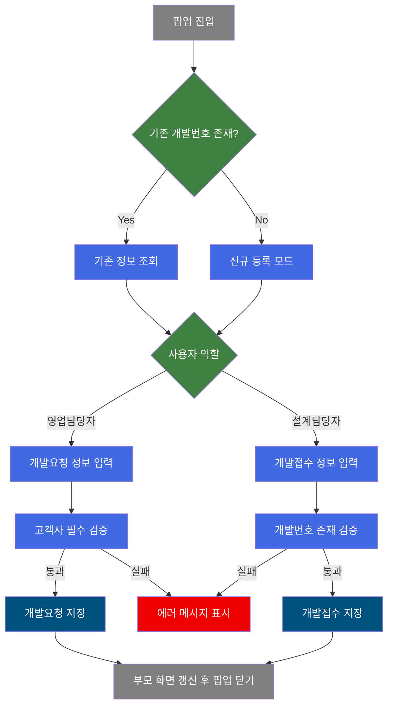
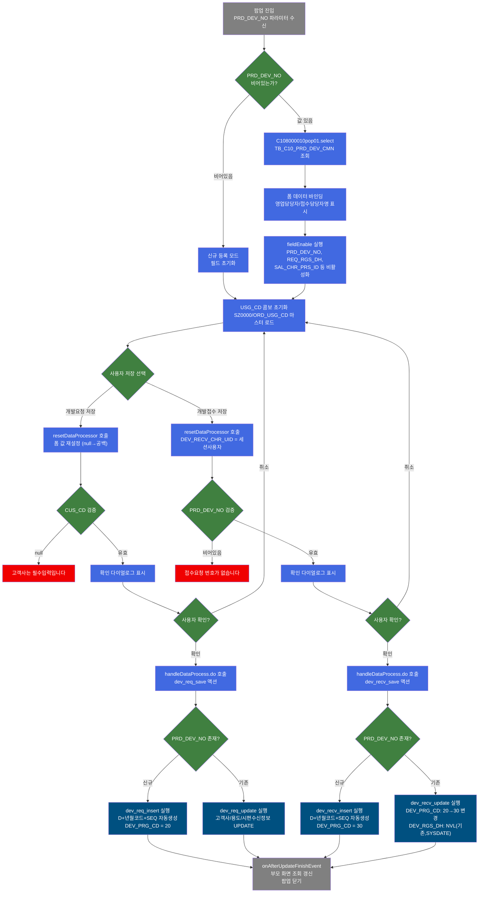
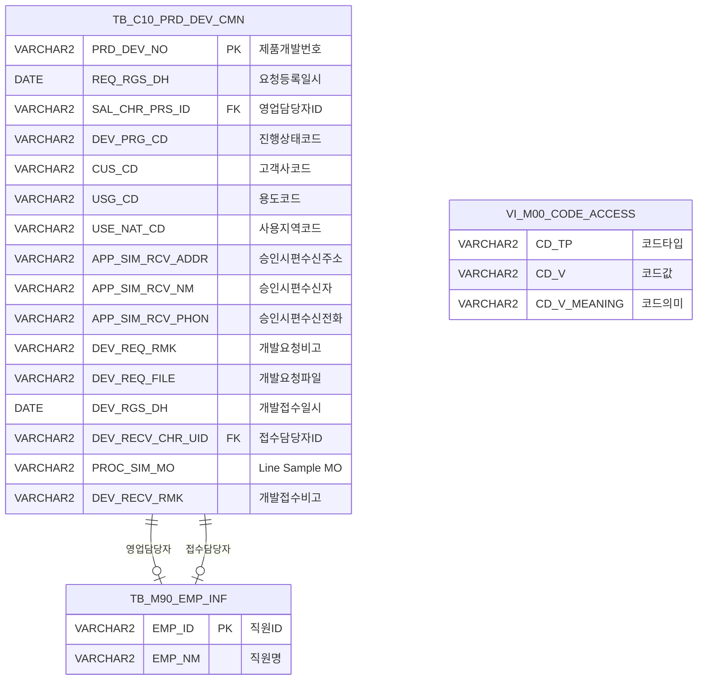

<h1 style="font-size: 40px; text-align: center; font-weight:
   bold; margin: 30px 0;">
  C108000010pop01 제품개발 등록 팝업 레거시 시스템 분석 종합 보고서
</h1>


# 1. 시스템 개요
- **서비스 ID**: C108000010pop01
- **업무명**: 제품개발 등록 (팝업)
- **분석 일시**: 2026-03-17 08:45 (KST)
- **분석 시간**: 약 5분
- **전체 Activity 수**: 4개 (Built-in 4개, Custom 0개)
- **분석자**: Claude Opus 4.6
- **분석 도구**: /analyze-service C108000010pop01
- **문서 버전**: 1.0

# 📊 비즈니스 프로세스 분석

## 시스템 목적

이 서비스는 **품질설계 제품개발 등록 팝업 화면**으로, 영업담당자의 제품개발 요청과 설계담당자의 개발접수를 처리하는 이원화된 등록 시스템이다. 부모 화면(C108000010)의 그리드에서 신규 등록 또는 기존 건 수정 시 팝업으로 호출된다.

영업담당자는 고객사, 용도, 사용지역, 승인시편 수신정보 등을 입력하여 제품개발을 요청(진행상태 '20')하고, 설계담당자는 해당 요청을 접수(진행상태 '30')하면서 Line Sample MO, 개발접수 비고 등을 추가 입력한다. 두 역할에 따라 각각 별도의 INSERT/UPDATE SQL이 실행되며, 개발번호는 날짜 기반 코드(`D` + 년월코드 + 시퀀스)로 자동 생성된다.

## 핵심 워크플로우 다이어그램



### 상세 워크플로우 다이어그램



## 주요 유즈케이스

### UC-01: 제품개발 신규 요청 (영업담당자)
- **Actor**: 영업담당자
- **목적**: 고객사 요청에 의한 신규 제품개발 건을 등록하여 설계팀에 개발 요청을 전달

- **전제조건**:
  - 사용자가 시스템에 로그인되어 있음
  - 부모 화면(C108000010)에서 신규 등록 팝업을 호출 (PRD_DEV_NO 없이 진입)

- **주요 흐름**:
  1. 팝업 진입 → 빈 폼 표시, USG_CD 콤보 마스터 데이터(SZ0000/ORD_USG_CD) 로드
  2. 고객사(CUS_CD) 검색 팝업으로 선택 (필수)
  3. 용도(USG_CD) 콤보 선택, 사용지역(USE_NAT_CD) 검색 팝업 선택
  4. 승인시편 수신주소/수신자/수신전화 입력
  5. 개발요청 비고(DEV_REQ_RMK) 입력 (선택)
  6. "개발요청저장" 버튼 클릭 → 확인 다이얼로그 표시
  7. 확인 시 dev_req_insert 실행: 개발번호 자동생성(`D` + 년월코드 + 시퀀스), DEV_PRG_CD='20'
  8. 저장 완료 후 부모 화면 그리드 갱신 → 팝업 닫기

- **대체 흐름**:
  - 고객사 미입력 시: "고객사는 필수입력입니다." 경고 표시, 저장 중단
  - 확인 다이얼로그에서 취소 시: 저장 중단, 폼 상태 유지

- **후행조건**:
  - TB_C10_PRD_DEV_CMN에 DEV_PRG_CD='20'(요청) 상태로 신규 행 생성
  - 부모 화면 그리드에 신규 건 반영

### UC-02: 기존 제품개발 요청 수정 (영업담당자)
- **Actor**: 영업담당자
- **목적**: 기존에 등록한 제품개발 요청 건의 고객사, 용도, 사용지역, 승인시편 수신정보를 수정

- **전제조건**:
  - 부모 화면에서 기존 개발번호(PRD_DEV_NO) 선택 후 팝업 호출

- **주요 흐름**:
  1. 팝업 진입 → PRD_DEV_NO로 C108000010pop01.select 조회
  2. 기존 정보가 폼에 바인딩됨 (개발번호, 요청등록일시, 개발요청자는 비활성화)
  3. 수정 가능 필드(고객사, 용도, 사용지역, 승인시편 정보, 비고) 변경
  4. "개발요청저장" 버튼 클릭 → dev_req_update 실행
  5. 부모 화면 갱신 후 팝업 닫기

- **대체 흐름**:
  - 조회 결과 0건: "0건 조회되었습니다." 메시지 표시, 폼 초기화
  - 고객사 미입력 시: "고객사는 필수입력입니다." 경고, 저장 중단

- **후행조건**:
  - TB_C10_PRD_DEV_CMN의 해당 행 업데이트 (LAST_UPDATE 감사 필드 갱신)

### UC-03: 제품개발 접수 (설계담당자)
- **Actor**: 설계담당자
- **목적**: 영업담당자가 요청한 제품개발 건을 접수하고 Line Sample MO 및 접수 비고를 등록

- **전제조건**:
  - 부모 화면에서 기존 개발번호(PRD_DEV_NO) 선택 후 팝업 호출
  - DEV_PRG_CD가 '20'(요청) 상태인 건

- **주요 흐름**:
  1. 팝업 진입 → PRD_DEV_NO로 기존 정보 조회, 폼에 바인딩
  2. Line Sample MO(PROC_SIM_MO) 입력
  3. 개발접수 비고(DEV_RECV_RMK) 입력
  4. "개발접수저장" 버튼 클릭 → 확인 다이얼로그 표시
  5. 확인 시 dev_recv_update 실행:
     - DEV_RGS_DH: 기존값 없으면 SYSDATE로 설정
     - DEV_RECV_CHR_UID: 기존값 없으면 세션 사용자ID 설정
     - DEV_PRG_CD: '20'→'30' 자동 전환 (DECODE)
  6. 부모 화면 갱신 후 팝업 닫기

- **대체 흐름**:
  - PRD_DEV_NO 없이 접수 저장 시도: "접수요청 번호가 없습니다." 경고, 저장 중단

- **후행조건**:
  - DEV_PRG_CD가 '30'(접수완료)으로 변경됨
  - DEV_RGS_DH, DEV_RECV_CHR_UID가 최초 접수 시 자동 설정

### UC-04: 비고 이미지 등록
- **Actor**: 설계담당자/영업담당자
- **목적**: 제품개발 건에 대한 비고 이미지(파일)를 별도 팝업으로 등록

- **전제조건**:
  - 기존 개발번호(PRD_DEV_NO)가 존재하는 건

- **주요 흐름**:
  1. 이미지 아이콘(save 아이콘) 클릭
  2. C108000010pop02.jsp 팝업 호출 (IMG_RGS_TP=1, PRD_DEV_NO, PRD_DEV_SEQ_NO=0)
  3. 이미지 파일 등록 처리

- **대체 흐름**:
  - PRD_DEV_NO 없는 경우: "접수요청 번호가 없습니다." 경고

- **후행조건**:
  - 이미지 파일이 서버에 저장됨

---
## 비즈니스 로직 상세

### 1. 개발번호 자동생성 로직

- **목적**: 제품개발 건마다 고유한 개발번호를 날짜 기반으로 자동 생성
- **처리 케이스**:

  **[케이스 1: 개발번호 생성 규칙]**
  ```
    조건: 신규 INSERT 시 (dev_req_insert, dev_recv_insert)
    처리:
      1. VI_M00_CODE_ACCESS 뷰에서 현재 년도/월에 해당하는 코드값 조회
         - CD_TP='YR_TP': 현재 년도(YYYY)에 매핑된 CD_V (예: '9' = 2019)
         - CD_TP='MN_TP': 현재 월(MM)에 매핑된 CD_V (예: '5' = 5월)
      2. 접두어 'D' + 년도코드 + 월코드 조합 (예: 'D95')
      3. SQ_C10_PRD_DEV_CMN 시퀀스의 NEXTVAL을 3자리 LPAD(0패딩)
      4. 최종 개발번호: 'D95' + '001' → 'D95001'
  ```

- **계산 공식**:
  ```
  PRD_DEV_NO = 'D'
    || MAX(DECODE(CD_TP,'YR_TP',CD_V))     -- 년도 코드
    || MAX(DECODE(CD_TP,'MN_TP',CD_V))     -- 월 코드
    || LPAD(SQ_C10_PRD_DEV_CMN.NEXTVAL, 3, '0')  -- 시퀀스 3자리
  ```

### 2. 진행상태 코드 관리 로직

- **목적**: 영업요청→설계접수 단계에 따라 진행상태(DEV_PRG_CD)를 자동 관리
- **처리 케이스**:

  **[케이스 1: 영업 요청 등록]**
  ```
    조건: dev_req_insert 실행 시
    처리:
      1. DEV_PRG_CD = '20' (요청 상태) 고정값으로 INSERT
  ```

  **[케이스 2: 설계 접수 등록 (신규)]**
  ```
    조건: dev_recv_insert 실행 시
    처리:
      1. DEV_PRG_CD = '30' (접수완료 상태) 고정값으로 INSERT
  ```

  **[케이스 3: 설계 접수 (기존 건 업데이트)]**
  ```
    조건: dev_recv_update 실행 시
    처리:
      1. DECODE(DEV_PRG_CD, '20', '30', DEV_PRG_CD)
         - 현재 '20'(요청)이면 → '30'(접수완료)으로 변경
         - 그 외 상태이면 → 기존 상태 유지
  ```

### 3. 접수 시 최초값 보존 로직

- **목적**: 설계 접수 시 접수일시와 접수담당자를 최초 1회만 설정하고 이후 수정 시 보존
- **처리 케이스**:

  **[케이스 1: NVL 기반 최초값 설정]**
  ```
    조건: dev_recv_update 실행 시
    처리:
      1. DEV_RGS_DH = NVL(DEV_RGS_DH, SYSDATE)
         - 기존 접수일시가 있으면 유지, 없으면 현재 시각으로 설정
      2. DEV_RECV_CHR_UID = NVL(DEV_RECV_CHR_UID, :DEV_RECV_CHR_UID)
         - 기존 접수담당자가 있으면 유지, 없으면 현재 사용자ID로 설정
  ```

---

# 💾 데이터 요구사항

## 핵심 테이블

### 1. TB_C10_PRD_DEV_CMN - 제품개발 공통 (C10APUSER 스키마)
| 컬럼명 | 타입 | PK | 설명 |
|--------|------|----|------|
| PRD_DEV_NO | VARCHAR2 | ✅ | 제품개발번호 (자동생성: D+년월코드+시퀀스) |
| REQ_RGS_DH | DATE | | 요청등록일시 (INSERT 시 SYSDATE) |
| SAL_CHR_PRS_ID | VARCHAR2 | | 영업담당자 직원ID |
| DEV_PRG_CD | VARCHAR2 | | 개발진행상태코드 (20:요청, 30:접수) |
| CUS_CD | VARCHAR2 | | 고객사 코드 |
| USG_CD | VARCHAR2 | | 용도 코드 |
| USE_NAT_CD | VARCHAR2 | | 사용지역(국가) 코드 |
| APP_SIM_RCV_ADDR | VARCHAR2 | | 승인시편 수신주소 |
| APP_SIM_RCV_NM | VARCHAR2 | | 승인시편 수신자명 |
| APP_SIM_RCV_PHON | VARCHAR2 | | 승인시편 수신전화번호 |
| DEV_REQ_RMK | VARCHAR2 | | 개발요청 비고 |
| DEV_REQ_FILE | VARCHAR2 | | 개발요청 첨부파일 |
| DEV_RGS_DH | DATE | | 개발접수일시 (접수 시 NVL→SYSDATE) |
| DEV_RECV_CHR_UID | VARCHAR2 | | 접수담당자 사용자ID |
| PROC_SIM_MO | VARCHAR2 | | Line Sample MO |
| DEV_RECV_RMK | VARCHAR2 | | 개발접수 비고 |
| CREATED_OBJECT_TYPE | VARCHAR2 | | 생성 객체 타입 (감사) |
| CREATED_OBJECT_ID | VARCHAR2 | | 생성 객체 ID (감사) |
| CREATED_PROGRAM_ID | VARCHAR2 | | 생성 프로그램 ID (감사) |
| CREATION_TIMESTAMP | DATE | | 생성 일시 (감사) |
| LAST_UPDATED_OBJECT_TYPE | VARCHAR2 | | 최종수정 객체 타입 (감사) |
| LAST_UPDATED_OBJECT_ID | VARCHAR2 | | 최종수정 객체 ID (감사) |
| LAST_UPDATE_PROGRAM_ID | VARCHAR2 | | 최종수정 프로그램 ID (감사) |
| LAST_UPDATE_TIMESTAMP | DATE | | 최종수정 일시 (감사) |

### 2. TB_M90_EMP_INF - 직원 정보 (M90APUSER 스키마, 참조용)
| 컬럼명 | 타입 | PK | 설명 |
|--------|------|----|------|
| EMP_ID | VARCHAR2 | ✅ | 직원 ID |
| EMP_NM | VARCHAR2 | | 직원명 |

### 3. VI_M00_CODE_ACCESS - 마스터 코드 뷰 (M00APUSER 스키마, 참조용)
| 컬럼명 | 타입 | PK | 설명 |
|--------|------|----|------|
| CD_TP | VARCHAR2 | | 코드 타입 (YR_TP, MN_TP, DD_TP) |
| CD_V | VARCHAR2 | | 코드 값 |
| CD_V_MEANING | VARCHAR2 | | 코드 의미 (년도, 월, 일 숫자) |

## 데이터 플로우

### 1. 조회 (기존 건 팝업 진입)
```
[기존 개발번호로 상세 조회]
팝업 진입 (PRD_DEV_NO 파라미터)
→ C108000010pop01.select
  FROM C10APUSER.TB_C10_PRD_DEV_CMN CM
  LEFT OUTER JOIN M90APUSER.TB_M90_EMP_INF (스칼라 서브쿼리)
    ON EMP_ID = CM.SAL_CHR_PRS_ID  -- 영업담당자명
  LEFT OUTER JOIN M90APUSER.TB_M90_EMP_INF (스칼라 서브쿼리)
    ON EMP_ID = CM.DEV_RECV_CHR_UID  -- 접수담당자명
  WHERE CM.PRD_DEV_NO = :PRD_DEV_NO
→ Form_2에 상세 정보 표시
```

### 2. 개발요청 저장 (영업담당자)
```
[신규 등록]
개발요청저장 버튼 클릭
→ CUS_CD 필수 검증
→ C108000010pop01.dev_req_insert
  INSERT INTO C10APUSER.TB_C10_PRD_DEV_CMN
  개발번호 = (SELECT 'D' || 년도코드 || 월코드 FROM VI_M00_CODE_ACCESS) || LPAD(SEQ.NEXTVAL,3,0)
  DEV_PRG_CD = '20' (요청 상태)
→ 부모 화면 갱신, 팝업 닫기

[수정]
개발요청저장 버튼 클릭
→ CUS_CD 필수 검증
→ C108000010pop01.dev_req_update
  UPDATE C10APUSER.TB_C10_PRD_DEV_CMN
  SET CUS_CD, USG_CD, USE_NAT_CD, 승인시편 수신정보, DEV_REQ_RMK, DEV_REQ_FILE
  WHERE PRD_DEV_NO = :PRD_DEV_NO
→ 부모 화면 갱신, 팝업 닫기
```

### 3. 개발접수 저장 (설계담당자)
```
[신규 등록 (설계원이 직접 등록)]
개발접수저장 버튼 클릭
→ PRD_DEV_NO 존재 검증
→ C108000010pop01.dev_recv_insert
  INSERT INTO C10APUSER.TB_C10_PRD_DEV_CMN
  개발번호 = 자동생성 (dev_req_insert와 동일 패턴)
  DEV_PRG_CD = '30' (접수완료 상태)
→ 부모 화면 갱신, 팝업 닫기

[접수 처리 (기존 요청 건 접수)]
개발접수저장 버튼 클릭
→ PRD_DEV_NO 존재 검증
→ C108000010pop01.dev_recv_update
  UPDATE C10APUSER.TB_C10_PRD_DEV_CMN
  SET DEV_RGS_DH = NVL(기존, SYSDATE)
      DEV_RECV_CHR_UID = NVL(기존, :세션사용자)
      DEV_PRG_CD = DECODE('20'→'30', 그 외 유지)
      PROC_SIM_MO, DEV_RECV_RMK
  WHERE PRD_DEV_NO = :PRD_DEV_NO
→ 부모 화면 갱신, 팝업 닫기
```

## SQL 일람표
| SQL 이름 | 쿼리 ID | 타입 | 출처 | 테이블 |
|---------|---------|------|------|--------|
| 제품개발 상세 조회 | C108000010pop01.select | SELECT | Service | TB_C10_PRD_DEV_CMN, TB_M90_EMP_INF |
| 개발요청 신규 등록 | C108000010pop01.dev_req_insert | INSERT | Service | TB_C10_PRD_DEV_CMN, VI_M00_CODE_ACCESS |
| 개발요청 수정 | C108000010pop01.dev_req_update | UPDATE | Service | TB_C10_PRD_DEV_CMN |
| 개발접수 신규 등록 | C108000010pop01.dev_recv_insert | INSERT | Service | TB_C10_PRD_DEV_CMN, VI_M00_CODE_ACCESS |
| 개발접수 수정 | C108000010pop01.dev_recv_update | UPDATE | Service | TB_C10_PRD_DEV_CMN |

## ER 다이어그램 (핵심 관계)



관계 설명:
- **TB_C10_PRD_DEV_CMN**이 중심 테이블로 제품개발 요청/접수 정보를 모두 관리
- **TB_M90_EMP_INF**: SAL_CHR_PRS_ID(영업담당자), DEV_RECV_CHR_UID(접수담당자)로 2회 참조
- **VI_M00_CODE_ACCESS**: 개발번호 자동생성 시 년/월 코드 변환에 사용

---

# 🖥️ 사용자 인터페이스 요구사항

## 화면 레이아웃 상세

### Layout 구조 (절대 위치 기반)
```javascript
{
  // 팝업 화면 - 절대 위치 기반 (initLayout 미사용)
  // 전체 크기: 870px × 400px
  components: [
    {
      id: "C108000010pop01_Form_1",   // 버튼 툴바
      position: { left: 0, top: 0, width: 870, height: 28 }
    },
    {
      id: "C108000010pop01_Form_2",   // 메인 입력 폼
      position: { left: 0, top: 29, width: 870, height: 352 },
      style: "overflow-x:hidden; overflow-y:scroll"
    },
    {
      id: "C108000010pop01_MessageBox_1",  // 상태바
      position: { left: 1, top: 380, width: 869, height: 19 }
    }
  ]
}
```

## 입출력 요소

### Form 컴포넌트

**C108000010pop01_Form_1 (버튼 툴바)**
- dev_req_save: CustomButton - "개발요청저장" (100px, 초기 비활성화)
- dev_recv_save: CustomButton - "개발접수저장" (100px)
- popClose: Button - "닫기"

**C108000010pop01_Form_2 (메인 입력 폼)**

  **개발요청 Fieldset**:
  - PRD_DEV_NO: input - 개발번호 (120px 라벨, 260px 입력, 읽기전용, 비활성화)
  - REQ_RGS_DH: input - 요청등록일시 (120px 라벨, 260px 입력, 읽기전용, 비활성화)
  - SAL_CHR_PRS_ID: input - 개발요청자 (120px 라벨, 260px 입력, maxLength=10, 비활성화)
  - CUS_CD: input - 고객사 (120px 라벨, 220px 입력, **필수**, 배경색:#FFFFC0, 검색팝업 연결: masterPopup('CUS_CD','SZ0000'))
  - USG_CD: combo - 용도 (120px 라벨, 260px 입력, 배경색:#FFFFC0, 마스터코드: SZ0000/ORD_USG_CD)
  - USE_NAT_CD: input - 사용지역 (120px 라벨, 220px 입력, 배경색:#FFFFC0, 검색팝업 연결: masterPopup('NAT_CD','SZ0000'))
  - APP_SIM_RCV_ADDR: input - 승인시편 수신주소 (120px 라벨, 550px 입력, maxLength=100, 배경색:#FFFFC0)
  - APP_SIM_RCV_NM: input - 승인시편 수신자 (120px 라벨, 260px 입력, maxLength=10, 배경색:#FFFFC0)
  - APP_SIM_RCV_PHON: input - 승인시편 수신전화 (120px 라벨, 260px 입력, maxLength=12, 배경색:#FFFFC0)
  - DEV_REQ_RMK: input - 개발요청 비고 (120px 라벨, 550px 입력, maxLength=100)

  **개발접수 Fieldset**:
  - DEV_RGS_DH: input - 개발접수일시 (120px 라벨, 260px 입력, 읽기전용, 비활성화)
  - DEV_RECV_CHR_UID: input - 접수담당자 (120px 라벨, 260px 입력, 읽기전용, 비활성화)
  - PROC_SIM_MO: input - Line Sample MO (120px 라벨, 550px 입력, maxLength=20, 배경색:#FFFFC0)
  - DEV_RECV_RMK: input - 개발접수 비고 (120px 라벨, 640px 입력, maxLength=300, 배경색:#FFFFC0)

  **Hidden 필드**:
  - DEV_PRG_CD: hidden - 개발진행상태코드 (숨김)

## 화면 동작 흐름

### 1. 화면 초기 로딩
```
1. 부모 화면(C108000010)에서 팝업 호출 (PRD_DEV_NO 파라미터 전달)
2. ui.initializeDHTMLX() 호출 → DHTMLX 컴포넌트 초기화
3. onXLEEvent → onFormLoadFunction 실행:
   a. USG_CD 콤보 마스터 데이터 로드 (ui.combo.master, SZ0000/ORD_USG_CD)
   b. masterPopup2SetValue 콜백 등록 (parent.c10popUp_setVal)
   c. PRD_DEV_NO 비어있지 않으면:
      - Form_2에 PRD_DEV_NO 값 설정
      - uiCommon.parameters6 → basicFormData.do → C108000010pop01.select 조회
      - findAfterFunction으로 조회 결과 메시지 처리
   d. fieldEnable() 호출 → PRD_DEV_NO, REQ_RGS_DH, SAL_CHR_PRS_ID, DEV_RGS_DH, DEV_RECV_CHR_UID 비활성화
```

### 2. 개발요청 저장
```
1. 사용자가 개발요청 필드 입력 (고객사, 용도, 사용지역, 승인시편 정보, 비고)
2. "개발요청저장" 버튼 클릭 → dev_req_save() 실행
3. resetDataProcessor("updated") 호출 → DataProcessor 상태 초기화
4. 각 필드값 읽기 후 null 검사 → null이면 공백('')으로 재설정
5. SAL_CHR_PRS_ID = 세션 사용자ID (서버사이드 JSP 변수)
6. CUS_CD 필수 검증 → null이면 dhtmlx.alert("고객사는 필수입력입니다.") 후 return
7. dhtmlx.confirm("개발요청 저장 하시겠습니까?") 표시
8. 확인 시 sendForm("handleDataProcess.do", 'C108000010pop01_Form_2', 'dev_req_save')
9. 서버에서 GridSave Activity가 INSERT/UPDATE 분기 후 SQL 실행
10. onAfterUpdateFinishEvent → popClose() 호출
```

### 3. 개발접수 저장
```
1. 사용자가 개발접수 필드 입력 (Line Sample MO, 개발접수 비고)
2. "개발접수저장" 버튼 클릭 → dev_recv_save() 실행
3. resetDataProcessor("updated") 호출
4. PRD_DEV_NO 존재 검증 → isNull이면 dhtmlx.alert("접수요청 번호가 없습니다.") 후 return
5. DEV_RECV_CHR_UID = 세션 사용자ID
6. PROC_SIM_MO, DEV_RECV_RMK null 검사 → null이면 공백으로 재설정
7. dhtmlx.confirm("개발접수 저장 하시겠습니까?") 표시
8. 확인 시 sendForm("handleDataProcess.do", 'C108000010pop01_Form_2', 'dev_recv_save')
9. 서버에서 GridSave Activity가 INSERT/UPDATE 분기 후 SQL 실행
10. onAfterUpdateFinishEvent → popClose() 호출
```

### 4. 마스터 팝업 (고객사/사용지역)
```
1. 고객사(CUS_CD) 또는 사용지역(USE_NAT_CD) 검색 아이콘 클릭
2. masterPopup() 함수 실행:
   - CUS_CD: masterGridData.do?CD_TP=CUS_CD&CATEGORY_GROUP_NM=SZ0000
   - USE_NAT_CD: masterGridData.do?CD_TP=NAT_CD&CATEGORY_GROUP_NM=SZ0000
3. ui.window 팝업 생성 (469×532px, 모달)
4. 팝업에서 항목 선택 → masterPopup2SetValue 콜백 호출
5. 선택된 코드값이 Form_2의 해당 필드에 설정됨
```

## JavaScript 모듈

**C108000010pop01.jsp** (인라인 스크립트)
- find(eventName, formDivObj, referenceItem): 기본 조회 (uiCommon.parameters → loadData)
- dev_req_save(eventName, formDivObj, referenceItem): 개발요청 저장 (null검사 → 필수검증 → dhtmlx.confirm → sendForm)
- dev_recv_save(eventName, formDivObj, referenceItem): 개발접수 저장 (PRD_DEV_NO검증 → dhtmlx.confirm → sendForm)
- findMessage(referenceItem): 메시지 표시 (uiCommon.message 호출)
- popClose(): 부모 화면 조회 갱신 → 팝업 닫기 (parent.find → parent.winObj.winClose)
- onFormLoadFunction(formDivObj): 폼 로드 후 초기화 (콤보로드, 기존건 조회, fieldEnable)
- fieldEnable(): 읽기전용 필드 비활성화 (PRD_DEV_NO, REQ_RGS_DH, SAL_CHR_PRS_ID, DEV_RGS_DH, DEV_RECV_CHR_UID)
- serchIcon_CUS_CD(name, val): 고객사 검색 아이콘 렌더링
- serchIcon_NAT_CD(name, val): 사용지역 검색 아이콘 렌더링
- setImgIcon(name, val): 비고 이미지 등록 아이콘 렌더링
- masterPopup(CD_TP, CATEGORY_GROUP_NM, target, formId): 마스터 검색 팝업 생성 (ui.window, 469×532, 모달)
- masterSetValue(code, name, target, formId): 팝업 선택값 반환 (items[formId].setItemValue)
- masterPopup2SetValue(code, name, target, formId): 팝업 선택값 반환 콜백 (parent에 등록)
- findAfterFunction(): 조회 후 메시지 처리 (0건 시 폼 초기화)
- onAfterUpdateFinishEvent(): 저장 완료 후 팝업 닫기 (popClose 호출)
- C10_linkC108000010pop02(): 비고 이미지 등록 팝업 호출 (C108000010pop02.jsp)

## 주요 이벤트 핸들러

**onXLEEvent (폼 로드 완료)**
- 이벤트 타입: Form XLE Load
- 처리 내용:
  1. items['C108000010pop01_Form_2'].onXLEEvent(onFormLoadFunction) 등록
  2. USG_CD 콤보 마스터 데이터 비동기 로드
  3. PRD_DEV_NO 존재 시 기존 건 자동 조회
  4. 읽기전용 필드 비활성화

**onAfterUpdateFinishEvent (저장 완료)**
- 이벤트 타입: Form DataProcessor Update Finish
- 처리 내용:
  1. items['C108000010pop01_Form_2'].onAfterUpdateFinishEvent 등록
  2. popClose() 호출 → 부모 화면 find 재실행 → 팝업 닫기

**dev_req_save (개발요청 저장 버튼)**
- 이벤트 타입: Custom Button Click (Form_1)
- 처리 내용:
  1. Form_2 DataProcessor reset
  2. 각 필드 null → 공백 변환
  3. SAL_CHR_PRS_ID = 세션 사용자
  4. CUS_CD 필수 검증
  5. dhtmlx.confirm 후 handleDataProcess.do 전송

**dev_recv_save (개발접수 저장 버튼)**
- 이벤트 타입: Custom Button Click (Form_1)
- 처리 내용:
  1. Form_2 DataProcessor reset
  2. PRD_DEV_NO 필수 검증
  3. DEV_RECV_CHR_UID = 세션 사용자
  4. 각 필드 null → 공백 변환
  5. dhtmlx.confirm 후 handleDataProcess.do 전송

---

# 📌 특이사항 및 주의사항

## 1. 개발번호 자동생성 시퀀스 의존성
- **시퀀스 재사용 불가**: `SQ_C10_PRD_DEV_CMN.NEXTVAL`은 롤백되어도 복원되지 않으므로, 저장 실패 시 번호가 건너뛰어질 수 있다
- **년/월 코드 매핑 필수**: `VI_M00_CODE_ACCESS`에 현재 년도/월에 해당하는 코드가 등록되어 있지 않으면 개발번호 생성이 실패한다
- **동시성 이슈**: 동시에 여러 사용자가 INSERT하면 시퀀스로 고유성은 보장되나, 월 전환 시점에 코드 변경 타이밍에 주의 필요

## 2. 영업/설계 이원화 저장 구조
- **동일 테이블에 두 역할의 INSERT/UPDATE가 공존**: dev_req_insert(영업, PRG_CD='20')와 dev_recv_insert(설계, PRG_CD='30')가 동일한 `TB_C10_PRD_DEV_CMN` 테이블에 INSERT하며, 설계원이 직접 신규 등록 시 요청 없이 바로 접수완료 상태로 생성 가능
- **GridSave built-in Activity 의존**: INSERT/UPDATE 분기는 GridSave 프레임워크가 DataProcessor 상태에 따라 자동 결정하므로, `resetDataProcessor("updated")` 호출이 분기의 핵심

## 3. null 처리 패턴의 비일관성
- **JavaScript에서 수동 null→공백 변환**: dev_req_save, dev_recv_save 함수에서 각 필드값을 개별적으로 `if(value == null) setItemValue(field, '')` 처리하는 반복적 패턴 사용. 값을 읽은 직후 동일한 값을 다시 설정하는 불필요한 코드가 포함됨 (예: `var CUS_CD = getItemValue("CUS_CD"); setItemValue("CUS_CD", CUS_CD);`)
- **null 체크 방식 혼재**: `== null` (JavaScript)과 `isNull()` (커스텀 유틸리티)이 혼용됨. `isNull()`은 JSP 서버사이드 변수(`<%=PRD_DEV_NO%>`)에 대해 사용

## 4. 부모-자식 화면 간 강결합
- **parent 객체 직접 참조**: `popClose()`에서 `parent.find()`, `parent.winObj.winClose()`를 직접 호출하여 부모 화면(C108000010)과 강하게 결합되어 있음
- **parent.c10popUp_setVal 콜백 등록**: 마스터 팝업 반환값 처리를 위해 parent 객체에 콜백 함수를 직접 등록하는 패턴

## 5. 주석 처리된 미사용 코드
- **업무기준 조회 코드 주석처리** (JSP 26-37행): `EasyAccess.getPosRule("C10A2183")` 호출이 주석 처리되어 있어, 원래 화면 제어 로직이 계획되었으나 비활성화됨
- **용도/사용지역 필수 검증 주석처리** (JSP 128-136행): USG_CD, USE_NAT_CD 필수 검증 코드가 주석 처리되어 현재는 고객사(CUS_CD)만 필수
- **onPop01Form2Changed 주석처리** (JSP 287-294행): 예상수주량 숫자 검증 함수가 주석 처리됨 → 해당 필드가 현재 폼에서 제거된 것으로 보임

---

# 📚 참고 문서

- **Service XML**: `src/service/C108000010pop01-service.xml`
- **Query SQL**: `src/query/C108000010pop01-query.glue_sql`
- **JSP**: `WebContents/C108000010pop01.jsp`
- **JS**: 인라인 스크립트 (별도 JS 파일 없음, JSP 내 포함)
- **Form XML**:
  - `WebContents/header/kr/C108000010pop01/C108000010pop01_Form_1.xml`
  - `WebContents/header/kr/C108000010pop01/C108000010pop01_Form_2.xml`
- **부모 화면**: `WebContents/C108000010.jsp` (C108000010-service)
- **비고 이미지 팝업**: `WebContents/C108000010pop02.jsp`
