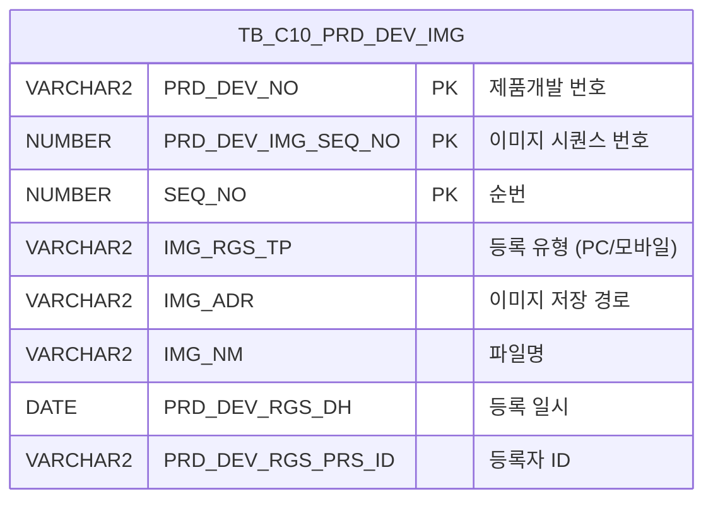

<h1 style="font-size: 40px; text-align: center; font-weight:
   bold; margin: 30px 0;">
  C108000010pop02 레거시 시스템 분석 종합 보고서
</h1>


# 1. 시스템 개요
- **서비스 ID**: C108000010pop02
- **업무명**: 제품개발 파일첨부 프로그램
- **분석 일시**: 2026-03-17 08:53 (KST)
- **전체 Activity 수**: 2개 (built-in)
- **분석자**: Claude Opus 4.6 (Phase 1~4: Sonnet/Haiku)
- **분석 도구**: /analyze-service C108000010pop02
- **문서 버전**: 1.0

# 📊 비즈니스 프로세스 분석

## 시스템 목적

C108000010pop02는 제품개발 화면(C108000010)에서 호출되는 **파일첨부 팝업** 서비스이다. 제품개발 과정에서 생성되는 이미지, 문서 등의 첨부파일을 업로드·조회·삭제하는 기능을 제공한다.

주요 업무 흐름은 다음과 같다: 부모 화면에서 특정 제품개발번호(PRD_DEV_NO)와 시퀀스(PRD_DEV_SEQ_NO)를 파라미터로 전달받아 팝업을 열면, dhtmlXVault 컴포넌트를 통해 파일 업로드가 가능하고, 하단 Grid에서 기존 첨부파일 목록을 확인할 수 있다. 파일 다운로드(파일명 클릭)와 개별 삭제(삭제 버튼) 기능도 제공한다.

이 서비스 자체는 built-in Activity만 사용하는 단순 조회 서비스로, Custom Activity 없이 FormSearch를 통해 TB_C10_PRD_DEV_IMG 테이블에서 이미지 정보를 조회한다. 파일 업로드/삭제는 별도 JSP 핸들러(_uploadHandler3.jsp, _fileDeleteHandler3.jsp)를 통해 처리된다.

<!-- 단순 서비스: Custom Activity 0개, SELECT 쿼리만 사용, Router → 단일 조회 Activity 구조이므로 워크플로우 다이어그램 생략 -->

## 주요 유즈케이스

### UC-01: 첨부파일 목록 조회
- **Actor**: 제품개발 담당자
- **목적**: 특정 제품개발 건에 등록된 첨부파일(이미지) 목록을 확인

- **전제조건**:
  - 부모 화면(C108000010)에서 제품개발번호(PRD_DEV_NO)가 선택되어 있음
  - 팝업 호출 시 PRD_DEV_NO, PRD_DEV_SEQ_NO, IMG_RGS_TP 파라미터가 전달됨

- **주요 흐름**:
  1. 부모 화면에서 파일첨부 팝업 호출 → PRD_DEV_NO, PRD_DEV_SEQ_NO, IMG_RGS_TP가 request 파라미터로 전달
  2. 팝업 로드 시 onVaultLoad()에서 dhtmlXVault 초기화 및 onLoadGrid() 호출
  3. C108000010pop02-service의 분기(PosDefaultRouter) → 조회(FormSearch) Activity 실행
  4. C108000010pop02.select 쿼리로 TB_C10_PRD_DEV_IMG에서 해당 제품개발건의 이미지 정보 조회
  5. Grid에 파일 목록 표시 (개발번호, 순번, 구분(PC/모바일), 파일명, 등록일자, 등록자, 삭제 버튼)

- **대체 흐름**:
  - 등록된 첨부파일이 없는 경우: Grid에 빈 목록 표시

- **후행조건**:
  - Grid에 첨부파일 목록이 표시됨
  - 사용자가 파일 업로드/다운로드/삭제 작업을 수행할 수 있는 상태

### UC-02: 파일 업로드
- **Actor**: 제품개발 담당자
- **목적**: 제품개발 건에 이미지 파일을 첨부

- **전제조건**:
  - 팝업이 열려 있고 Vault 컴포넌트가 초기화됨
  - IMG_RGS_TP, PRD_DEV_NO, PRD_DEV_SEQ_NO 파라미터가 설정됨

- **주요 흐름**:
  1. 사용자가 dhtmlXVault 영역에 파일을 드래그 또는 파일 선택 버튼 클릭
  2. Vault가 _uploadHandler3.jsp로 파일 전송 (IMG_RGS_FLAG='05', IMG_RGS_FLAG_ID=PRD_DEV_NO, IMG_RGS_FLAG_ID2=PRD_DEV_SEQ_NO)
  3. 서버에서 파일을 /APP/WAS/FILES/C10/05 경로에 저장하고 TB_C10_PRD_DEV_IMG에 INSERT (C108000010pop02.insert 쿼리)
  4. 업로드 완료 시 onUploadComplete 콜백 → onLoadGrid() 호출로 Grid 자동 갱신

- **대체 흐름**:
  - 업로드 실패 시: Vault에 에러 상태 표시

- **후행조건**:
  - 파일이 서버에 저장되고 DB에 이미지 정보 등록됨
  - Grid에 새로 업로드된 파일이 표시됨

### UC-03: 파일 다운로드
- **Actor**: 제품개발 담당자
- **목적**: 등록된 첨부파일을 다운로드

- **전제조건**:
  - Grid에 파일 목록이 조회된 상태

- **주요 흐름**:
  1. 사용자가 Grid의 파일명(IMG_NM) 컬럼 링크 클릭
  2. Grid_doLink(val, rowIdx) 이벤트 핸들러 실행
  3. _fileDownloadHandler.jsp로 이동 (FILE_ADR: /APP/WAS/FILES/C10/05, FILE_NM: 파일명)
  4. 서버에서 파일 스트림 전송 → 브라우저 다운로드

- **대체 흐름**:
  - 서버에 파일이 존재하지 않는 경우: 다운로드 핸들러에서 에러 처리

- **후행조건**:
  - 파일이 사용자 로컬에 다운로드됨

### UC-04: 파일 삭제
- **Actor**: 제품개발 담당자
- **목적**: 등록된 첨부파일을 삭제

- **전제조건**:
  - Grid에 파일 목록이 조회된 상태

- **주요 흐름**:
  1. 사용자가 Grid의 삭제(DEL_IMG) 컬럼 클릭
  2. doImgDel(rowIdx) 이벤트 핸들러 실행
  3. _fileDeleteHandler3.jsp 호출 (PRD_DEV_NO, PRD_DEV_SEQ_NO, SEQ_NO 전달)
  4. 서버에서 TB_C10_PRD_DEV_IMG의 해당 행 DELETE (C108000010pop02.delete 쿼리) 및 물리 파일 삭제
  5. onLoadGrid() 호출로 Grid 갱신

- **대체 흐름**:
  - 삭제 실패 시: 에러 메시지 표시

- **후행조건**:
  - DB에서 이미지 정보 삭제 및 물리 파일 제거됨
  - Grid에서 해당 행 제거됨

---
## 비즈니스 로직 상세

### 1. 이미지 등록 유형(IMG_RGS_TP) 코드 변환

- **목적**: DB에 코드값('2' 등)으로 저장된 이미지 등록 유형을 사용자가 이해할 수 있는 한글명으로 변환하여 표시
- **처리 케이스**:

  **[케이스 1: 모바일 등록]**
  ```
    조건: IMG_RGS_TP = '2'
    처리: '모바일'로 표시
  ```

  **[케이스 2: PC 등록 (기본값)]**
  ```
    조건: IMG_RGS_TP ≠ '2' (NULL 포함)
    처리: 'PC'로 표시
  ```

### 2. 이미지 경로 정규화 (CHK_IMG_ADR)

- **목적**: DB에 저장된 Windows 스타일 경로를 웹 브라우저에서 접근 가능한 상대 경로로 변환
- **처리 케이스**:

  **[케이스 1: 경로 변환]**
  ```
    조건: IMG_ADR에 'IMG_UPLOAD' 문자열이 포함됨
    처리:
      1. INSTR로 'IMG_UPLOAD' 시작 위치 탐색
      2. SUBSTR로 'IMG_UPLOAD' 이후 경로 추출
      3. REPLACE로 '\' → '/' 변환 (Windows → Unix 경로)
      4. 앞에 './' 접두사, 뒤에 '/' 접미사 추가
    결과: './IMG_UPLOAD/C10/05/' 형태의 상대 경로
  ```

### 3. 시퀀스 번호 자동 채번 (INSERT 시)

- **목적**: 동일 제품개발번호 및 시퀀스 내에서 순번(SEQ_NO)을 자동 증가
- **처리 케이스**:

  **[케이스 1: 기존 데이터 존재]**
  ```
    조건: 동일 PRD_DEV_NO, PRD_DEV_IMG_SEQ_NO에 기존 행이 존재
    처리: MAX(SEQ_NO) + 1
  ```

  **[케이스 2: 최초 등록]**
  ```
    조건: 동일 PRD_DEV_NO, PRD_DEV_IMG_SEQ_NO에 기존 행 없음
    처리: NVL(MAX(SEQ_NO), 0) + 1 = 1
  ```

---

# 💾 데이터 요구사항

## 핵심 테이블

### 1. TB_C10_PRD_DEV_IMG - (제품개발 이미지 정보)
| 컬럼명 | 타입 | PK | 설명 |
|--------|------|----|------|
| PRD_DEV_NO | VARCHAR2 | ✅ | 제품개발 번호 |
| PRD_DEV_IMG_SEQ_NO | NUMBER | ✅ | 제품개발 이미지 시퀀스 번호 |
| SEQ_NO | NUMBER | ✅ | 순번 (자동 채번) |
| IMG_RGS_TP | VARCHAR2 | | 이미지 등록 유형 ('2':모바일, 그 외:PC) |
| IMG_ADR | VARCHAR2 | | 이미지 저장 경로 (서버 절대 경로) |
| IMG_NM | VARCHAR2 | | 이미지 파일명 |
| PRD_DEV_RGS_DH | DATE | | 등록 일시 |
| PRD_DEV_RGS_PRS_ID | VARCHAR2 | | 등록자 ID |
| CREATED_OBJECT_TYPE | VARCHAR2 | | 생성 객체 유형 |
| CREATED_OBJECT_ID | VARCHAR2 | | 생성자 ID |
| CREATED_PROGRAM_ID | VARCHAR2 | | 생성 프로그램 ID |
| CREATION_TIMESTAMP | TIMESTAMP | | 생성 타임스탬프 |
| LAST_UPDATED_OBJECT_TYPE | VARCHAR2 | | 최종수정 객체 유형 |
| LAST_UPDATED_OBJECT_ID | VARCHAR2 | | 최종수정자 ID |
| LAST_UPDATE_PROGRAM_ID | VARCHAR2 | | 최종수정 프로그램 ID |
| LAST_UPDATE_TIMESTAMP | TIMESTAMP | | 최종수정 타임스탬프 |

## 데이터 플로우

### 1. 조회

```
[팝업 로드 시 첨부파일 목록 조회]
팝업 진입 (PRD_DEV_NO, PRD_DEV_SEQ_NO 파라미터 수신)
→ C108000010pop02.select
  FROM TB_C10_PRD_DEV_IMG
  WHERE PRD_DEV_NO = :PRD_DEV_NO
    AND PRD_DEV_IMG_SEQ_NO = NVL(:PRD_DEV_SEQ_NO, 0)
  ORDER BY PRD_DEV_NO, PRD_DEV_IMG_SEQ_NO, SEQ_NO
→ Grid에 파일 목록 표시 (DECODE로 IMG_RGS_TP 한글 변환, 경로 정규화)
```

### 2. 등록 (파일 업로드)

```
[파일 업로드 시 이미지 정보 등록]
Vault 업로드 완료 → _uploadHandler3.jsp
→ C108000010pop02.insert
  INTO TB_C10_PRD_DEV_IMG
  VALUES (PRD_DEV_NO, PRD_DEV_IMG_SEQ_NO, 자동채번SEQ_NO, IMG_RGS_TP, 파일경로, 파일명, SYSDATE, 등록자ID, 감사컬럼...)
→ onUploadComplete 콜백 → Grid 재조회
```

### 3. 삭제

```
[파일 삭제]
Grid 삭제 버튼 클릭 → doImgDel(rowIdx)
→ _fileDeleteHandler3.jsp
→ C108000010pop02.delete
  DELETE TB_C10_PRD_DEV_IMG
  WHERE PRD_DEV_NO = :IMG_RGS_FLAG_ID
    AND PRD_DEV_IMG_SEQ_NO = NVL(:IMG_RGS_FLAG_ID2, 0)
    AND SEQ_NO = :SEQ
→ Grid 재조회
```

## SQL 일람표

| SQL 이름 | 쿼리 ID | 타입 | 출처 | 테이블 |
|---------|---------|-----|------|--------|
| 제품개발 이미지 조회 | C108000010pop02.select | SELECT | Service | TB_C10_PRD_DEV_IMG |
| 제품개발 이미지 등록 | C108000010pop02.insert | INSERT | _uploadHandler3.jsp | TB_C10_PRD_DEV_IMG |
| 제품개발 이미지 삭제 | C108000010pop02.delete | DELETE | _fileDeleteHandler3.jsp | TB_C10_PRD_DEV_IMG |

## ER 다이어그램 (핵심 관계)



관계 설명:
- TB_C10_PRD_DEV_IMG는 단일 테이블 구조이며, PRD_DEV_NO를 통해 부모 화면(C108000010)의 제품개발 마스터 테이블과 연관됨
- 복합 PK(PRD_DEV_NO + PRD_DEV_IMG_SEQ_NO + SEQ_NO)로 동일 제품개발 건에 대해 여러 이미지를 관리

---

# 🖥️ 사용자 인터페이스 요구사항

## 화면 레이아웃 상세

### Layout 구조
```
팝업 화면 (절대 위치 기반, Layout 컨테이너 미사용)
┌──────────────────────────────────────────────┐
│  [Vault 영역] dhtmlXVault 파일 업로드 컴포넌트    │
│  (상단 ~260px 영역)                             │
│                                              │
├──────────────────────────────────────────────┤
│  [Grid 영역] 첨부파일 목록                       │
│  (430px × 70px, top:260px)                    │
├──────────────────────────────────────────────┤
│  [MessageBox] 상태 메시지                       │
│  (445px × 23px, top:332px)                    │
└──────────────────────────────────────────────┘
```

이 화면은 일반적인 initLayout 구조가 아닌 `position: absolute`로 직접 배치하는 flat 구조를 사용한다.

## 입출력 요소

### Vault 컴포넌트
**vault1** (dhtmlXVaultObject)
- 파일 업로드 컴포넌트
- 업로드 핸들러: `_uploadHandler3.jsp`
- 파라미터: IMG_RGS_FLAG='05', IMG_RGS_FLAG_ID=PRD_DEV_NO, IMG_RGS_FLAG_ID2=PRD_DEV_SEQ_NO
- 업로드 완료 콜백: onUploadComplete → Grid 자동 갱신

### Grid 컴포넌트

**C108000010pop02_Grid_1 (첨부파일 목록)**
- 편집 가능 여부: 아니오 (읽기 전용, 전체 ro)
- Split: 0 (고정 컬럼 없음)
- 컬럼 너비 단위: %
- Multiselect: true
- Skin: dhx_skyblue
- 주요 컬럼 (11개):

  **기본 정보**:
  - PRD_DEV_NO: ro - 개발번호 (19%, 좌측정렬)
  - SEQ_NO: ro - 순번 (8%, 우측정렬)
  - IMG_RGS_TP: ro - 구분(PC/모바일) (11%, 중앙정렬)
  - IMG_NM: ahref_idx - 파일명 (나머지 전체, 좌측정렬, 클릭 시 파일 다운로드)

  **등록 정보**:
  - PRD_DEV_RGS_DH: ro - 등록일자 (20%, 중앙정렬)
  - PRD_DEV_RGS_PRS_ID: ro - 등록자 (16%, 중앙정렬)

  **기능**:
  - DEL_IMG: ro - 삭제 (8%, 중앙정렬, 클릭 시 doImgDel 실행)

  **숨김 컬럼**:
  - PRD_DEV_IMG_SEQ_NO: ro - 이미지 시퀀스 번호 (숨김)
  - IMG_ADR: ro - 이미지 주소 (숨김)
  - CHK_IMG_NM: ro - 체크용 이미지명 (숨김)
  - CHK_IMG_ADR: ro - 체크용 이미지 경로 (숨김, 정규화된 상대 경로)

## 화면 동작 흐름

### 1. 화면 초기 로딩
```
1. 부모 화면(C108000010)에서 팝업 호출
2. request 파라미터 수신: IMG_RGS_TP, PRD_DEV_NO, PRD_DEV_SEQ_NO
3. onVaultLoad() 실행
   - dhtmlXVaultObject 생성 및 초기화
   - _uploadHandler3.jsp, _getInfoHandler.jsp, _getIdHandler.jsp 연결
   - IMG_RGS_FLAG='05', IMG_RGS_FLAG_ID=PRD_DEV_NO, IMG_RGS_FLAG_ID2=PRD_DEV_SEQ_NO 설정
4. onLoadGrid() 호출
   - Grid 초기화 및 C108000010pop02-service 호출 (find 액션)
   - C108000010pop02.select 쿼리 실행
   - Grid에 첨부파일 목록 바인딩
5. Grid에 onXLEEvent 등록 → onLoadGrid 연결
```

### 2. 파일 업로드 후 Grid 갱신
```
1. 사용자가 Vault에 파일 선택/드래그
2. Vault가 _uploadHandler3.jsp로 파일 전송
3. 서버에서 파일 저장 및 DB INSERT
4. onUploadComplete 콜백 발생
5. onLoadGrid() 호출로 Grid 재조회
6. 새로 업로드된 파일이 Grid에 표시됨
```

### 3. 파일 다운로드
```
1. Grid에서 파일명(IMG_NM) 컬럼의 링크(ahref_idx) 클릭
2. Grid_doLink(val, rowIdx) 실행
3. CHK_IMG_ADR(숨김 컬럼)에서 정규화된 경로 추출
4. _fileDownloadHandler.jsp로 이동 (FILE_ADR, FILE_NM 전달)
5. 브라우저에서 파일 다운로드
```

### 4. 파일 삭제
```
1. Grid에서 삭제(DEL_IMG) 컬럼 클릭
2. doImgDel(rowIdx) 실행
3. 해당 행의 PRD_DEV_NO, PRD_DEV_SEQ_NO, SEQ_NO 추출
4. _fileDeleteHandler3.jsp 호출
5. 서버에서 DB DELETE 및 물리 파일 삭제
6. onLoadGrid() 호출로 Grid 갱신
```

## JavaScript 모듈

**C108000010pop02.jsp** (인라인 스크립트)
- onVaultLoad(): 팝업 로드 시 dhtmlXVaultObject 초기화, 업로드 핸들러 및 파라미터 설정
- onLoadGrid(): Grid 데이터 로딩 - PRD_DEV_NO, PRD_DEV_SEQ_NO로 서비스 호출
- find(): Form 파라미터 기반 Grid 조회
- save(): Grid 데이터 저장
- refresh(): Grid 초기화 후 재조회
- add(): Grid 신규 행 추가
- remove(): Grid 선택 행 삭제
- copy(): Grid 행 클립보드 복사
- undo() / redo(): Grid 실행 취소/다시 실행
- doImgDel(rowIdx): 첨부파일 삭제 - _fileDeleteHandler3.jsp 호출 후 Grid 재로딩
- Grid_doLink(val, rowIdx): 파일명 클릭 시 _fileDownloadHandler.jsp로 이동하여 파일 다운로드
- onGridContextMenuClick(): 컨텍스트 메뉴 처리 (컬럼 이동, 헤더 필터, 편집 모드, 엑셀 다운로드)
- findMessage(): MessageBox에 appMsg 표시
- customColumnInfo(): Grid 컬럼 ID 목록 반환
- onFormLoadFunction(): Form 로드 완료 콜백

## 주요 이벤트 핸들러

**onUploadComplete (파일 업로드 완료)**
- 이벤트 타입: Vault Upload Complete Callback
- 처리 내용:
  1. Vault 업로드 프로세스 완료 감지
  2. onLoadGrid() 호출
  3. Grid에 최신 파일 목록 반영

**doImgDel (파일 삭제)**
- 이벤트 타입: DEL_IMG 컬럼 클릭
- 처리 내용:
  1. 클릭된 행(rowIdx)에서 파일 정보 추출
  2. _fileDeleteHandler3.jsp에 삭제 요청 전송
  3. 서버에서 DB 삭제 및 물리 파일 제거
  4. onLoadGrid() 호출로 Grid 갱신

**Grid_doLink (파일 다운로드)**
- 이벤트 타입: IMG_NM 컬럼 ahref_idx 클릭
- 처리 내용:
  1. 클릭된 행의 파일 경로(CHK_IMG_ADR) 및 파일명 추출
  2. _fileDownloadHandler.jsp로 이동 (FILE_ADR: /APP/WAS/FILES/C10/05)
  3. 브라우저 파일 다운로드 실행

---

# 📌 특이사항 및 주의사항

## 1. 레이아웃 컨테이너 미사용 (비표준 패턴)
- 일반적인 GLUE Framework 화면은 initLayout을 통해 레이아웃 컨테이너를 구성하지만, 이 팝업은 `position: absolute`로 직접 배치하는 flat 구조를 사용한다. 화면 크기 조정 시 레이아웃이 깨질 수 있는 잠재적 이슈가 있다.

## 2. 쿼리 힌트 내 프로그램 ID 불일치
- C108000010pop02.insert 쿼리의 Oracle 힌트 주석에 `C108000120pop02`로 기재되어 있으나, 실제 서비스 ID는 `C108000010pop02`이다. 프로그램 ID가 불일치하며, CREATED_PROGRAM_ID와 LAST_UPDATE_PROGRAM_ID 값도 `'C108000120pop02'`로 하드코딩되어 있다.

## 3. 파일 저장 경로 하드코딩
- 파일 저장 경로가 `/APP/WAS/FILES/C10/05`로 하드코딩되어 있다. IMG_RGS_FLAG='05' 값으로 경로가 결정되는 구조이며, 경로 변경 시 JSP 핸들러 수정이 필요하다.

## 4. Grid onXLEEvent 핸들링
- Grid 초기화 시 onXLEEvent를 등록하고, onLoadGrid 호출 시 detachEvent로 제거하는 패턴을 사용한다. 이는 Grid 로딩 완료 후 최초 1회만 이벤트를 처리하기 위한 것으로, 이벤트 누수 방지를 위한 패턴이다.

## 5. MessageBox XML 파일 미존재
- pageConfiguration에 C108000010pop02_MessageBox_1이 정의되어 있으나, 실제 XML 파일(C108000010pop02_MessageBox_1.xml)이 존재하지 않는다. 기능상 문제는 없으나 리소스 정리가 필요할 수 있다.

## 6. PRD_DEV_SEQ_NO NVL 처리
- SELECT/DELETE 쿼리에서 PRD_DEV_IMG_SEQ_NO = NVL(:PRD_DEV_SEQ_NO, 0) 패턴을 사용하여, 시퀀스 번호가 NULL인 경우 0으로 대체한다. INSERT 시에도 동일 패턴 적용.

---

# 📚 참고 문서

- **Query SQL**: `src/query/C108000010pop02-query.glue_sql`
- **Service XML**: `src/service/C108000010pop02-service.xml`
- **JSP**: `WebContents/C108000010pop02.jsp`
- **Grid XML**: `WebContents/header/kr/C108000010pop02/C108000010pop02_Grid_1.xml`
