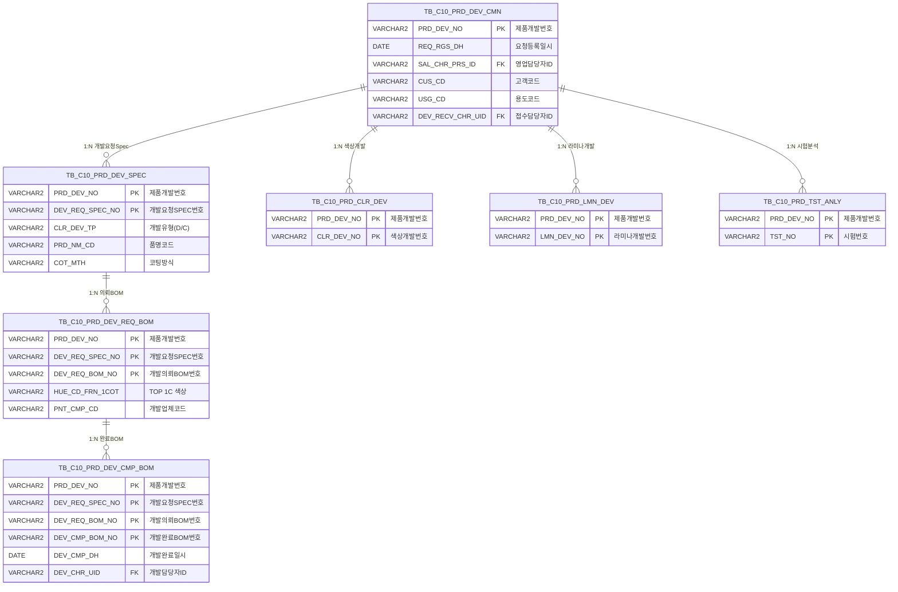

<h1 style="font-size: 40px; text-align: center; font-weight:
   bold; margin: 30px 0;">
  C108000050 레거시 시스템 분석 종합 보고서
</h1>


# 1. 시스템 개요
- **서비스 ID**: C108000050
- **업무명**: 제품개발 상세 현황
- **분석 일시**: 2026-03-17 09:00 (KST)
- **분석 시간**: 약 4분
- **전체 Activity 수**: 6개 (Built-in 6개, Custom 0개)
- **분석자**: Claude Opus 4.6 + Sonnet (subagent)
- **분석 도구**: /analyze-service C108000050
- **문서 버전**: 1.0

# 📊 비즈니스 프로세스 분석

## 시스템 목적

C108000050은 **품질설계 제품개발 상세 현황 조회** 화면으로, 특정 제품개발 건(PRD_DEV_NO)에 대한 전체 개발 이력을 한 화면에서 종합적으로 조회할 수 있는 읽기 전용 조회 화면이다. 고객의 개발요청부터 Spec 정의, 의뢰 BOM 구성, 최종 개발완료 BOM까지의 전체 개발 프로세스를 3단 연계 구조(Spec → 의뢰BOM → 완료BOM)로 드릴다운하며 확인할 수 있다.

이 화면은 제품개발 워크플로우의 허브 역할을 수행하며, 색상개발(C108000130), 라미나개발(C108000170), 특수제품후처리(C108000190), BabyRoll제작(C108000150), 잉크젯개발(C108000210), 시험/분석(C108000230) 등 9개 관련 화면으로의 네비게이션 링크를 제공한다. 하단 요약 영역에서 각 세부 개발 유형별 건수를 집계하여 표시함으로써 해당 제품개발 건의 전체 진행 현황을 한눈에 파악할 수 있도록 한다.

## 주요 유즈케이스

### UC-01: 제품개발 상세 현황 조회
- **Actor**: 품질설계 담당자 / 개발 담당자
- **목적**: 특정 제품개발번호에 대한 기본 정보, 개발요청 Spec, 의뢰 BOM, 완료 BOM 등 전체 개발 이력을 단일 화면에서 종합 조회

- **전제조건**:
  - 사용자가 시스템에 로그인되어 있음
  - 조회 대상 제품개발번호(PRD_DEV_NO)를 알고 있음
  - 해당 제품개발 건이 TB_C10_PRD_DEV_CMN에 등록되어 있음

- **주요 흐름**:
  1. 사용자가 화면에 진입 (또는 다른 화면에서 PRD_DEV_NO 파라미터와 함께 이동)
  2. Form_1에 제품개발 기본 정보(개발번호, 요청등록일시, 개발요청자, 고객사, 용도, 사용지역 등) 표시 - selectCmn 쿼리 실행
  3. Grid_1에 개발요청 Spec 목록(개발유형, 품명, 코팅방식, 수지, 무독성구분 등) 표시 - selectSpec 쿼리 실행
  4. Form_5에 관련 개발건수(색상개발, 라미나개발, 시험분석 등) 요약 표시 - selectCrl 쿼리 실행

- **대체 흐름**:
  - PRD_DEV_NO가 URL 파라미터로 전달된 경우: 화면 로딩 시 자동 조회 실행
  - 조회 결과 없음: 빈 화면 유지

- **후행조건**:
  - 조회된 데이터가 각 Form/Grid에 표시됨
  - 사용자가 관련 화면으로 이동 가능한 상태

### UC-02: 3단 연계 드릴다운 조회
- **Actor**: 품질설계 담당자
- **목적**: Spec → 의뢰BOM → 완료BOM 순서로 연계 조회하여 특정 Spec의 세부 BOM 구성 및 완료 결과를 확인

- **전제조건**:
  - UC-01이 선행 완료되어 Grid_1에 Spec 목록이 표시됨

- **주요 흐름**:
  1. Grid_1에서 특정 개발요청 Spec 행 선택
  2. 시스템이 선택된 PRD_DEV_NO + DEV_REQ_SPEC_NO로 selectReqBom 쿼리 실행
  3. Grid_2에 해당 Spec의 의뢰 BOM 목록(색상코드 TOP/Back 1~4C, 프린트 Roll/Ink 1~4도, 라미나, U-TEX 등) 표시
  4. Grid_2에서 특정 의뢰 BOM 행 선택
  5. 시스템이 PRD_DEV_NO + DEV_REQ_SPEC_NO + DEV_REQ_BOM_NO로 selectCmpBom 쿼리 실행
  6. Grid_3에 해당 의뢰 BOM의 개발완료 BOM 목록(완료일시, 담당자, 색상코드, 프린트/패턴 정보, 내후성보증 여부 등) 표시

- **대체 흐름**:
  - 해당 Spec에 의뢰 BOM이 없는 경우: Grid_2 빈 상태 유지
  - 해당 의뢰 BOM에 완료 BOM이 없는 경우: Grid_3 빈 상태 유지

- **후행조건**:
  - 3단 연계 데이터가 모두 표시됨

### UC-03: 관련 개발 화면으로 이동
- **Actor**: 품질설계 담당자 / 개발 담당자
- **목적**: 현재 제품개발 건의 세부 개발(색상개발, 라미나개발 등) 등록/수정 화면으로 빠르게 이동

- **전제조건**:
  - UC-01이 완료되어 제품개발 기본 정보가 로드됨
  - 이동 대상에 따라 Grid_1/Grid_2의 행이 선택되어 있어야 함 (일부 링크)

- **주요 흐름**:
  1. 하단 Form_5 또는 섹션 헤더(Form_2/3/4)의 링크 버튼 클릭
  2. 시스템이 uiCommon.screenMove로 대상 화면 ID와 파라미터(PRD_DEV_NO, DEV_REQ_SPEC_NO 등) 전달
  3. 대상 화면으로 이동 및 자동 조회 실행

- **대체 흐름**:
  - 필수 파라미터(Grid 선택 행)가 없는 경우: 이동 불가 또는 개발번호만 전달

- **후행조건**:
  - 대상 화면이 전달된 파라미터로 자동 조회 완료

---
## 비즈니스 로직 상세

### 1. 제품개발 요소별 건수 집계 (selectCrl)

- **목적**: 특정 제품개발번호에 대해 색상개발, 라미네이션개발, 시험분석의 건수를 한 번에 집계하여 요약 표시
- **처리 케이스**:

  **[케이스 1: UNION + SUM 집계 패턴]**
  ```
    조건: PRD_DEV_NO가 지정됨
    처리:
      1. TB_C10_PRD_CLR_DEV에서 CLR_DEV_NO 건수 COUNT, 나머지 0으로 패딩
      2. TB_C10_PRD_LMN_DEV에서 LMN_DEV_NO 건수 COUNT, 나머지 0으로 패딩
      3. TB_C10_PRD_TST_ANLY에서 TST_NO 건수 COUNT, 나머지 0으로 패딩
      4. 세 서브쿼리를 UNION ALL로 합침
      5. 외부 쿼리에서 SUM으로 집계하여 1행 반환
  ```

- **계산 공식**:
  ```
  CLR_DEV_NO = SUM(색상개발 COUNT) → 색상개발 건수
  LMN_DEV_NO = SUM(라미네이션개발 COUNT) → 라미나개발 건수
  TST_NO = SUM(시험분석 COUNT) → 시험/분석 건수
  ```

### 2. 코드값 → 의미명 변환 패턴 (selectSpec, selectReqBom, selectCmpBom, selectCmn)

- **목적**: 코드 테이블에 저장된 코드값을 사용자에게 의미 있는 명칭으로 변환하여 표시
- **처리 케이스**:

  **[케이스 1: DECODE를 활용한 개발유형 분류]**
  ```
    조건: selectSpec 쿼리의 CLR_DEV_TP 컬럼
    처리:
      1. CLR_DEV_TP 값이 'D'이면 '디자인'으로 변환
      2. CLR_DEV_TP 값이 'C'이면 '색상'으로 변환
      3. DECODE(SP.CLR_DEV_TP, 'D', '디자인', 'C', '색상') 패턴 적용
  ```

  **[케이스 2: 스칼라 서브쿼리 기반 코드명 조회]**
  ```
    조건: VI_M00_CODE_ACCESS 뷰를 통한 공통코드 변환
    처리:
      1. GRP_CD 조건으로 코드 그룹 지정
      2. 해당 코드값으로 코드명(CD_NM) 조회
      3. 원래 코드값 || ' ' || 코드명 형태로 결합 표시 (COT_MTH, TLP_TP 등)
    적용 컬럼:
      - PRD_NM_CD: 품명코드 → 품명
      - COT_MTH: 코팅방식코드 → 코팅방식명
      - TLP_TP: 무독성구분코드 → 무독성구분명
      - DEV_REF_TP: 개발참조유형코드 → 개발참조유형명 (IN 조건 사용)
      - PNT_CMP_CD: 개발업체코드 → 개발업체명
      - LMN_BND_CMP_CD: 접착제개발업체코드 → 업체명 (NVL 적용)
      - PRT_USG_CD: 프린트용도코드 → 프린트용도명
      - PRT_PTN_CD: 프린트패턴코드 → 프린트패턴명
      - USE_NAT_CD: 사용지역코드 → 사용지역명
      - CUS_CD: 고객코드 → 고객명
  ```

  **[케이스 3: 직원 ID → 이름 변환]**
  ```
    조건: TB_M90_EMP_INF 테이블 참조
    처리:
      1. 직원 UID(SAL_CHR_PRS_ID, DEV_RECV_CHR_UID, DEV_CHR_UID)로 직원명 조회
      2. 스칼라 서브쿼리로 EMP_NM 반환
  ```

### 3. 날짜 형식 변환

- **목적**: Oracle DATE 타입 데이터를 사용자 표시용 문자열로 변환
- **처리 케이스**:

  **[케이스 1: 날짜+시간 표시]**
  ```
    조건: selectCmn 쿼리의 REQ_RGS_DH 컬럼
    처리:
      1. TO_CHAR(CM.REQ_RGS_DH, 'yyyy-mm-dd HH24:MI') 형식으로 변환
      2. '2026-03-17 14:30' 형태로 표시
  ```

---

# 💾 데이터 요구사항

## 핵심 테이블

### 1. TB_C10_PRD_DEV_CMN - (제품개발 공통 정보)
| 컬럼명 | 타입 | PK | 설명 |
|--------|------|----|------|
| PRD_DEV_NO | VARCHAR2 | ✅ | 제품개발번호 (PK) |
| REQ_RGS_DH | DATE | | 요청등록일시 |
| SAL_CHR_PRS_ID | VARCHAR2 | | 영업담당자ID (FK→TB_M90_EMP_INF) |
| DEV_PRG_CD | VARCHAR2 | | 개발진행코드 |
| CUS_CD | VARCHAR2 | | 고객코드 |
| USG_CD | VARCHAR2 | | 용도코드 |
| USE_NAT_CD | VARCHAR2 | | 사용지역코드 |
| DEV_RECV_CHR_UID | VARCHAR2 | | 개발접수담당자ID (FK→TB_M90_EMP_INF) |
| DEV_RGS_DH | DATE | | 개발접수일시 |
| DEV_REQ_RMK | VARCHAR2 | | 개발요청 비고 |
| DEV_REQ_FILE | VARCHAR2 | | 첨부파일 |
| APP_SIM_RCV_ADDR | VARCHAR2 | | 시편수신주소 |
| APP_SIM_RCV_NM | VARCHAR2 | | 시편수신자 |
| APP_SIM_RCV_PHON | VARCHAR2 | | 시편수신전화 |
| PROC_SIM_MO | VARCHAR2 | | Sample MO |
| DEV_RECV_RMK | VARCHAR2 | | 개발접수 비고 |

### 2. TB_C10_PRD_DEV_SPEC - (제품개발 Spec 정보)
| 컬럼명 | 타입 | PK | 설명 |
|--------|------|----|------|
| PRD_DEV_NO | VARCHAR2 | ✅ | 제품개발번호 (PK, FK→TB_C10_PRD_DEV_CMN) |
| DEV_REQ_SPEC_NO | VARCHAR2 | ✅ | 개발요청SPEC번호 (PK) |
| CLR_DEV_TP | VARCHAR2 | | 개발유형 (D:디자인, C:색상) |
| PRD_NM_CD | VARCHAR2 | | 품명코드 |
| CUS_REQ_HUE_TXT | VARCHAR2 | | 고객정의품명(색상명) |
| COT_MTH | VARCHAR2 | | 코팅방식코드 |
| RSN_TP | VARCHAR2 | | 수지유형 |
| TLP_TP | VARCHAR2 | | 무독성구분코드 |
| RL_LUS_RT | VARCHAR2 | | 실광택값 |
| PNT_FLM_THK_TXT | VARCHAR2 | | 도막두께 |
| PTT_FLM_YN | VARCHAR2 | | 보호필름 유무 |
| ORD_PRE_WGT | VARCHAR2 | | 예상수주량 |
| DEV_REF_TP | VARCHAR2 | | 개발참조유형코드 |
| REF_CLR_CD_TXT | VARCHAR2 | | 참조 칼라코드 |
| REF_CCL_BOM | VARCHAR2 | | 참조 CCLBOM |
| SIM_HUE_PRG_YN | VARCHAR2 | | 유사색상 적용가능여부 |

### 3. TB_C10_PRD_DEV_REQ_BOM - (제품개발 의뢰 BOM)
| 컬럼명 | 타입 | PK | 설명 |
|--------|------|----|------|
| PRD_DEV_NO | VARCHAR2 | ✅ | 제품개발번호 (PK) |
| DEV_REQ_SPEC_NO | VARCHAR2 | ✅ | 개발요청SPEC번호 (PK) |
| DEV_REQ_BOM_NO | VARCHAR2 | ✅ | 개발의뢰BOM번호 (PK) |
| HUE_CD_FRN_1COT ~ 4COT | VARCHAR2 | | TOP 1~4차 색상코드 |
| HUE_CD_BAK_1COT ~ 4COT | VARCHAR2 | | Back 1~4차 색상코드 |
| HUE_CD_LMN | VARCHAR2 | | 라미나 색상코드 |
| PRT_ROLL_NO1 ~ NO4 | VARCHAR2 | | 프린트 1~4도 Roll번호 |
| PRT_INK_CD1 ~ CD4 | VARCHAR2 | | 프린트 1~4도 Ink코드 |
| UNI_TEX_ROLL_NO | VARCHAR2 | | U-TEX Roll번호 |
| PICK_UP_ROLL_NO | VARCHAR2 | | PICK-UP Roll번호 |
| IMPT_ROLL_NO | VARCHAR2 | | IMPRINT Roll번호 |
| PNT_CMP_CD | VARCHAR2 | | 개발업체코드 |
| COT_MTH | VARCHAR2 | | 코팅방식코드 |
| TLP_TP | VARCHAR2 | | 무독성구분코드 |
| LMN_BND_CMP_CD | VARCHAR2 | | 라미나 접착제 개발업체코드 |

### 4. TB_C10_PRD_DEV_CMP_BOM - (제품개발 완료 BOM)
| 컬럼명 | 타입 | PK | 설명 |
|--------|------|----|------|
| PRD_DEV_NO | VARCHAR2 | ✅ | 제품개발번호 (PK) |
| DEV_REQ_SPEC_NO | VARCHAR2 | ✅ | 개발요청SPEC번호 (PK) |
| DEV_REQ_BOM_NO | VARCHAR2 | ✅ | 개발의뢰BOM번호 (PK) |
| DEV_CMP_BOM_NO | VARCHAR2 | ✅ | 개발완료BOM번호 (PK) |
| DEV_CMP_DH | DATE | | 개발완료일시 |
| DEV_CHR_UID | VARCHAR2 | | 개발담당자ID (FK→TB_M90_EMP_INF) |
| HUE_CD_FRN_1COT ~ 4COT | VARCHAR2 | | TOP 1~4차 색상코드 |
| HUE_CD_BAK_1COT ~ 4COT | VARCHAR2 | | Back 1~4차 색상코드 |
| HUE_CD_LMN | VARCHAR2 | | 라미나 색상코드 |
| PRT_ROLL_NO1 ~ NO4 | VARCHAR2 | | 프린트 1~4도 Roll번호 |
| PRT_INK_CD1 ~ CD4 | VARCHAR2 | | 프린트 1~4도 Ink코드 |
| UNI_TEX_ROLL_NO | VARCHAR2 | | U-TEX Roll번호 |
| PICK_UP_ROLL_NO | VARCHAR2 | | PICK-UP Roll번호 |
| IMPT_ROLL_NO | VARCHAR2 | | IMPRINT Roll번호 |
| COT_MTH | VARCHAR2 | | 코팅방식코드 |
| TLP_TP | VARCHAR2 | | 무독성구분코드 |
| CCL_BOM_WR_YN | VARCHAR2 | | 내후성보증 여부 |
| DISC_PTN_WTH_CD | VARCHAR2 | | 불연속패턴 및 폭관리 |
| UNI_TEX_PTN_CD | VARCHAR2 | | UNI-TEX 패턴 |
| CUT_LN_YN | VARCHAR2 | | 재단선 유무 |
| PT_TP | VARCHAR2 | | 핀트종류 |
| PRT_USG_CD | VARCHAR2 | | 프린트용도코드 |
| PRT_PTN_CD | VARCHAR2 | | 프린트패턴코드 |
| SPC_PRD_AF_NO | VARCHAR2 | | 특수제품 후처리번호 |
| INK_DEV_NO | VARCHAR2 | | 잉크젯개발 번호 |
| DEV_CMP_RMK | VARCHAR2 | | 개발완료 비고 |

### 5. 건수 집계 참조 테이블
| 테이블명 | 스키마 | 역할 |
|----------|--------|------|
| TB_C10_PRD_CLR_DEV | C10APUSER | 색상개발 (CLR_DEV_NO 건수 집계) |
| TB_C10_PRD_LMN_DEV | C10APUSER | 라미네이션개발 (LMN_DEV_NO 건수 집계) |
| TB_C10_PRD_TST_ANLY | C10APUSER | 시험분석 (TST_NO 건수 집계) |

### 6. 공통 참조 테이블
| 테이블명 | 스키마 | 역할 |
|----------|--------|------|
| VI_M00_CODE_ACCESS | M00APUSER | 공통코드 뷰 (코드값 → 코드명 변환) |
| TB_M90_EMP_INF | M90APUSER | 직원정보 (직원ID → 직원명 변환) |

## 데이터 플로우

### 1. 제품개발 기본 정보 조회
```
화면 진입 (PRD_DEV_NO 파라미터 수신)
→ C108000050.selectCmn
  FROM TB_C10_PRD_DEV_CMN CM
  스칼라 서브쿼리: VI_M00_CODE_ACCESS (CUS_CD, USE_NAT_CD 코드명)
  스칼라 서브쿼리: TB_M90_EMP_INF (SAL_CHR_PRS_ID, DEV_RECV_CHR_UID 직원명)
  WHERE CM.PRD_DEV_NO = :PRD_DEV_NO
→ Form_1에 기본 정보 표시
```

### 2. 개발요청 Spec 조회
```
조회 실행
→ C108000050.selectSpec
  FROM TB_C10_PRD_DEV_SPEC SP
  스칼라 서브쿼리: VI_M00_CODE_ACCESS (PRD_NM_CD, COT_MTH, TLP_TP, DEV_REF_TP 코드명)
  WHERE SP.PRD_DEV_NO = :PRD_DEV_NO
  DECODE: CLR_DEV_TP → 'D'→'디자인', 'C'→'색상'
→ Grid_1에 Spec 목록 표시
```

### 3. 개발의뢰 BOM 조회 (Grid_1 행 선택 연동)
```
Grid_1 행 선택
→ C108000050.selectReqBom
  FROM TB_C10_PRD_DEV_REQ_BOM REB
  스칼라 서브쿼리: VI_M00_CODE_ACCESS (PNT_CMP_CD, COT_MTH, TLP_TP, LMN_BND_CMP_CD 코드명)
  WHERE REB.PRD_DEV_NO = :PRD_DEV_NO
    AND REB.DEV_REQ_SPEC_NO = :DEV_REQ_SPEC_NO
→ Grid_2에 의뢰 BOM 목록 표시
```

### 4. 개발완료 BOM 조회 (Grid_2 행 선택 연동)
```
Grid_2 행 선택
→ C108000050.selectCmpBom
  FROM TB_C10_PRD_DEV_CMP_BOM CPB
  스칼라 서브쿼리: TB_M90_EMP_INF (DEV_CHR_UID 직원명)
  스칼라 서브쿼리: VI_M00_CODE_ACCESS (COT_MTH, TLP_TP, PRT_USG_CD, PRT_PTN_CD 코드명)
  WHERE CPB.PRD_DEV_NO = :PRD_DEV_NO
    AND CPB.DEV_REQ_SPEC_NO = :DEV_REQ_SPEC_NO
    AND CPB.DEV_REQ_BOM_NO = :DEV_REQ_BOM_NO
→ Grid_3에 완료 BOM 목록 표시
```

### 5. 관련 개발건수 집계 조회
```
조회 실행
→ C108000050.selectCrl
  서브쿼리1: TB_C10_PRD_CLR_DEV → COUNT(CLR_DEV_NO), 0, 0
  서브쿼리2: TB_C10_PRD_LMN_DEV → 0, COUNT(LMN_DEV_NO), 0
  서브쿼리3: TB_C10_PRD_TST_ANLY → 0, 0, COUNT(TST_NO)
  UNION → SUM 집계
  WHERE PRD_DEV_NO = :PRD_DEV_NO
→ Form_5에 색상개발/라미나개발/시험분석 건수 표시
```

## SQL 일람표
| SQL 이름 | 쿼리 ID | 타입 | 출처 | 테이블 |
|---------|---------|------|------|--------|
| 제품개발 요소 합 | C108000050.selectCrl | SELECT | Service | C10APUSER.TB_C10_PRD_CLR_DEV, C10APUSER.TB_C10_PRD_LMN_DEV, C10APUSER.TB_C10_PRD_TST_ANLY |
| 개발요청 Spec 조회 | C108000050.selectSpec | SELECT | Service | TB_C10_PRD_DEV_SPEC, VI_M00_CODE_ACCESS |
| 개발의뢰 BOM | C108000050.selectReqBom | SELECT | Service | TB_C10_PRD_DEV_REQ_BOM, VI_M00_CODE_ACCESS |
| 개발완료 BOM | C108000050.selectCmpBom | SELECT | Service | TB_C10_PRD_DEV_CMP_BOM, TB_M90_EMP_INF, VI_M00_CODE_ACCESS |
| 제품개발공통 조회 | C108000050.selectCmn | SELECT | Service | TB_C10_PRD_DEV_CMN, TB_M90_EMP_INF, VI_M00_CODE_ACCESS |

## ER 다이어그램 (핵심 관계)



관계 설명:
- **TB_C10_PRD_DEV_CMN**이 중심 테이블로 모든 관계의 허브 역할
- **3단 계층 구조**: CMN → SPEC → REQ_BOM → CMP_BOM (PRD_DEV_NO 기반 1:N 계층)
- **건수 집계 테이블**: CLR_DEV, LMN_DEV, TST_ANLY는 CMN과 PRD_DEV_NO로 1:N 연결
- **공통 참조**: VI_M00_CODE_ACCESS(코드명), TB_M90_EMP_INF(직원명)은 전 쿼리에서 스칼라 서브쿼리로 참조

---

# 🖥️ 사용자 인터페이스 요구사항

## 화면 레이아웃 상세

### Layout 구조 (initLayout)
```javascript
{
  programId: "C108000050",
  itemType: "layout",
  messageBox: true,
  dirType: "row",           // 수직 배치 (위→아래)
  childSize: "120,160,160,160",  // 4개 영역 크기 (px)
  splitter: true,           // 영역 간 크기 조절 가능
  components: [
    {
      id: "form_area_1",
      height: "120px",
      component: {
        itemType: "form",
        formId: "C108000050_Form_1"   // 제품개발 기본 정보 폼
      }
    },
    {
      id: "spec_area",
      height: "160px",
      component: {
        itemType: "layout",
        dirType: "row",
        childSize: "30",    // Form_2 = 30px, Grid_1 = 나머지
        children: [
          { itemType: "form", formId: "C108000050_Form_2" },  // 개발요청 Spec 헤더
          { itemType: "grid", gridId: "C108000050_Grid_1" }   // Spec 목록
        ]
      }
    },
    {
      id: "req_bom_area",
      height: "160px",
      component: {
        itemType: "layout",
        dirType: "row",
        childSize: "30",
        children: [
          { itemType: "form", formId: "C108000050_Form_3" },  // 개발의뢰 BOM 헤더
          { itemType: "grid", gridId: "C108000050_Grid_2" }   // 의뢰 BOM 목록
        ]
      }
    },
    {
      id: "cmp_bom_area",
      height: "160px",
      component: {
        itemType: "layout",
        dirType: "row",
        childSize: "30",
        children: [
          { itemType: "form", formId: "C108000050_Form_4" },  // 개발완료 BOM 헤더
          { itemType: "grid", gridId: "C108000050_Grid_3" }   // 완료 BOM 목록
        ]
      }
    },
    {
      id: "summary_area",
      height: "나머지",
      component: {
        itemType: "form",
        formId: "C108000050_Form_5"   // 관련 개발건수 요약
      }
    }
  ]
}
```

## 입출력 요소

### Form 컴포넌트

**C108000050_Form_1 (제품개발 기본 정보)**
- PRD_DEV_NO: input - 개발번호 (읽기전용)
- REQ_RGS_DH: input - 요청등록일시 (읽기전용)
- SAL_CHR_PRS_ID: input - 개발요청자 (읽기전용)
- CUS_CD: input - 고객사 (읽기전용)
- find: button - 조회 → find 명령 실행
- winClose: button - 닫기 → 화면 종료
- USG_CD: input - 용도 (읽기전용)
- USE_NAT_CD: input - 사용지역 (읽기전용)
- DEV_REQ_RMK: input - 개발요청 비고 (읽기전용)
- DEV_REQ_FILE: input - 첨부파일 (읽기전용)
- APP_SIM_RCV_ADDR: input - 시편수신주소 (읽기전용)
- APP_SIM_RCV_NM: input - 시편수신자 (읽기전용)
- APP_SIM_RCV_PHON: input - 시편수신전화 (읽기전용)
- DEV_RGS_DH: input - 개발접수일시 (읽기전용)
- DEV_RECV_CHR_UID: input - 접수담당자 (읽기전용)
- PROC_SIM_MO: input - Sample MO (읽기전용)
- DEV_RECV_RMK: input - 개발접수 비고 (읽기전용)

**C108000050_Form_2 (개발요청 Spec 섹션 헤더)**
- dev_req_spec_call: linkbutton - [개발요청 Spec] 등록 → C108000070 화면 이동

**C108000050_Form_3 (개발의뢰 BOM 섹션 헤더)**
- dev_req_bom_call: linkbutton - [개발의뢰 BOM] 등록 → C108000090 화면 이동

**C108000050_Form_4 (개발완료 BOM 섹션 헤더)**
- dev_cmp_bom_call: linkbutton - [개발완료 BOM] 등록 → C108000110 화면 이동

**C108000050_Form_5 (관련 개발건수 요약)**
- clr_dev_call: linkbutton - 색상개발 → C108000130 이동
- CLR_DEV_NO: input - 색상개발 건수 (읽기전용)
- spc_prd_af_call: linkbutton - 특수제품후처리 → C108000190 이동
- SPC_PRD_AF_NO: input - 특수제품후처리 건수 (읽기전용)
- prt_by_roll_call: linkbutton - BabyRoll제작 → C108000150 이동
- PRT_BY_ROLL_NO: input - BabyRoll제작 건수 (읽기전용)
- ink_dev_call: linkbutton - 잉크젯개발 → C108000210 이동
- INK_DEV_NO: input - 잉크젯개발 건수 (읽기전용)
- lmn_dev_call: linkbutton - 라미나개발 → C108000170 이동
- LMN_DEV_NO: input - 라미나개발 건수 (읽기전용)
- prd_tst_call: linkbutton - 시험/분석 → C108000230 이동
- TST_NO: input - 시험/분석 건수 (읽기전용)

### Grid 컴포넌트

**C108000050_Grid_1 (개발요청 Spec 목록)**
- 편집 가능 여부: 아니오 (읽기 전용)
- 컨텍스트 메뉴: 셀 복사, 엑셀 내보내기
- 주요 컬럼 (16개):

  **기본 정보**:
  - DEV_REQ_SPEC_NO: ro - 개발요청 SPEC번호 (8%, 좌측정렬)
  - CLR_DEV_TP: ro - 개발유형 (10%, 좌측정렬)
  - PRD_NM_CD: ro - 품명 (12%, 좌측정렬)
  - CUS_REQ_HUE_TXT: ro - 고객정의품명(색상명) (15%, 좌측정렬)

  **코팅/수지 정보**:
  - COT_MTH: ro - 코팅방식 (10%, 좌측정렬)
  - RSN_TP: ro - 수지 (8%, 좌측정렬)
  - TLP_TP: ro - 무독성구분 (12%, 좌측정렬)

  **규격/특성 정보**:
  - RL_LUS_RT: ro - 실광택값 (12%, 좌측정렬)
  - PNT_FLM_THK_TXT: ro - 도막두께 (12%, 좌측정렬)
  - PTT_FLM_YN: ro - 보호필름 유무 (12%, 좌측정렬)
  - ORD_PRE_WGT: ro - 예상수주량 (12%, 좌측정렬)

  **참조 정보**:
  - DEV_REF_TP: ro - 개발참조 유형 (12%, 좌측정렬)
  - REF_CLR_CD_TXT: ro - 참조 칼라코드 (15%, 좌측정렬)
  - REF_CCL_BOM: ro - 참조 CCLBOM (12%, 좌측정렬)
  - SIM_HUE_PRG_YN: ro - 유사색상 적용가능여부 (12%, 좌측정렬)

  **숨김 컬럼**:
  - PRD_DEV_NO: ro - 제품개발 번호 (숨김)

**C108000050_Grid_2 (개발의뢰 BOM 목록)**
- 편집 가능 여부: 아니오 (읽기 전용)
- 컨텍스트 메뉴: 셀 복사, 엑셀 내보내기
- 주요 컬럼 (36개):

  **기본 정보**:
  - DEV_REQ_BOM_NO: ro - 개발의뢰BOM 번호 (12%, 좌측정렬)

  **TOP 색상코드 (정면)**:
  - HUE_CD_FRN_1COT: ro - TOP 1C (12%, 좌측정렬)
  - HUE_CD_FRN_2COT: ro - TOP 2C (15%, 좌측정렬)
  - HUE_CD_FRN_3COT: ro - TOP 3C (10%, 좌측정렬)
  - HUE_CD_FRN_4COT: ro - TOP 4C (8%, 좌측정렬)

  **Back 색상코드 (배면)**:
  - HUE_CD_BAK_1COT: ro - Back 1C (12%, 좌측정렬)
  - HUE_CD_BAK_2COT: ro - Back 2C (12%, 좌측정렬)
  - HUE_CD_BAK_3COT: ro - Back 3C (12%, 좌측정렬)
  - HUE_CD_BAK_4COT: ro - Back 4C (12%, 좌측정렬)

  **라미나/프린트 Roll**:
  - HUE_CD_LMN: ro - 라미나 (12%, 좌측정렬)
  - PRT_ROLL_NO1: ro - Print1도 Roll (12%, 좌측정렬)
  - PRT_INK_CD1: ro - Print1도 Ink (12%, 좌측정렬)
  - PRT_ROLL_NO2: ro - Print2도 Roll (15%, 좌측정렬)
  - PRT_INK_CD2: ro - Print2도 Ink (12%, 좌측정렬)
  - PRT_ROLL_NO3: ro - Print3도 Roll (12%, 좌측정렬)
  - PRT_INK_CD3: ro - Print3도 Ink (12%, 좌측정렬)
  - PRT_ROLL_NO4: ro - Print4도 Roll (12%, 좌측정렬)
  - PRT_INK_CD4: ro - Print4도 Ink (12%, 좌측정렬)

  **특수 Roll**:
  - UNI_TEX_ROLL_NO: ro - U-TEX Roll (12%, 좌측정렬)
  - PICK_UP_ROLL_NO: ro - PICK-UP Roll (12%, 좌측정렬)
  - IMPT_ROLL_NO: ro - IMPRINT Roll (12%, 좌측정렬)

  **기타 정보**:
  - SIM_HUE_PRG_YN: ro - 유사색상 적용여부 (12%, 좌측정렬)
  - PNT_CMP_CD: ro - 개발업체 (12%, 좌측정렬)
  - COT_MTH: ro - 코팅방식 (12%, 좌측정렬)
  - RSN_TP: ro - 수지 (12%, 좌측정렬)
  - TLP_TP: ro - 무독성구분 (12%, 좌측정렬)
  - RL_LUS_RT: ro - 실광택값 (12%, 좌측정렬)
  - PNT_FLM_THK_TXT: ro - 도막두께 (12%, 좌측정렬)
  - LMN_BND_CMP_CD: ro - 라미나유형 접착제개발업체 (12%, 좌측정렬)
  - LMN_KND_TP: ro - 라미나유형 (12%, 좌측정렬)
  - LMN_FLM_THK: ro - 라미나 필름두께 (12%, 좌측정렬)
  - DSN_SIM_FILE: ro - 디자인 시안 적용가능여부 (12%, 좌측정렬)
  - PRT_BY_ROLL_CMP_CD: ro - Print Baby Roll 제작업체 (12%, 좌측정렬)
  - SPC_PRD_AF_WK: ro - 특수제품 후처리작업 (12%, 좌측정렬)

  **숨김 컬럼**:
  - PRD_DEV_NO: ro - 제품개발 번호 (숨김)
  - DEV_REQ_SPEC_NO: ro - 개발요청SPEC번호 (숨김)

**C108000050_Grid_3 (개발완료 BOM 목록)**
- 편집 가능 여부: 아니오 (읽기 전용)
- 컨텍스트 메뉴: 셀 복사, 엑셀 내보내기
- 주요 컬럼 (39개):

  **기본 정보**:
  - DEV_CMP_BOM_NO: ro - 개발완료BOM 번호 (12%, 좌측정렬)
  - DEV_CMP_DH: ro - 개발완료일시 (12%, 좌측정렬)
  - DEV_CHR_UID: ro - 개발담당자 (12%, 좌측정렬)

  **TOP 색상코드 (정면)**:
  - HUE_CD_FRN_1COT: ro - TOP 1C (12%, 좌측정렬)
  - HUE_CD_FRN_2COT: ro - TOP 2C (15%, 좌측정렬)
  - HUE_CD_FRN_3COT: ro - TOP 3C (10%, 좌측정렬)
  - HUE_CD_FRN_4COT: ro - TOP 4C (8%, 좌측정렬)

  **Back 색상코드 (배면)**:
  - HUE_CD_BAK_1COT: ro - Back 1C (12%, 좌측정렬)
  - HUE_CD_BAK_2COT: ro - Back 2C (12%, 좌측정렬)
  - HUE_CD_BAK_3COT: ro - Back 3C (12%, 좌측정렬)
  - HUE_CD_BAK_4COT: ro - Back 4C (12%, 좌측정렬)

  **라미나/프린트 Roll**:
  - HUE_CD_LMN: ro - 라미나 (12%, 좌측정렬)
  - PRT_ROLL_NO1: ro - Print1도 Roll (12%, 좌측정렬)
  - PRT_INK_CD1: ro - Print1도 Ink (12%, 좌측정렬)
  - PRT_ROLL_NO2: ro - Print2도 Roll (15%, 좌측정렬)
  - PRT_INK_CD2: ro - Print2도 Ink (12%, 좌측정렬)
  - PRT_ROLL_NO3: ro - Print3도 Roll (12%, 좌측정렬)
  - PRT_INK_CD3: ro - Print3도 Ink (12%, 좌측정렬)
  - PRT_ROLL_NO4: ro - Print4도 Roll (12%, 좌측정렬)
  - PRT_INK_CD4: ro - Print4도 Ink (12%, 좌측정렬)

  **특수 Roll**:
  - UNI_TEX_ROLL_NO: ro - U-TEX Roll (12%, 좌측정렬)
  - PICK_UP_ROLL_NO: ro - PICK-UP Roll (12%, 좌측정렬)
  - IMPT_ROLL_NO: ro - IMPRINT Roll (12%, 좌측정렬)

  **완료 BOM 고유 정보**:
  - UNFIX_NO: ro - Unfixed 번호 (12%, 좌측정렬)
  - COT_MTH: ro - 코팅방식 (12%, 좌측정렬)
  - TLP_TP: ro - 무독성구분 (12%, 좌측정렬)
  - CCL_BOM_WR_YN: ro - 내후성보증 여부 (12%, 좌측정렬)
  - DISC_PTN_WTH_CD: ro - 불연속패턴 및 폭관리 (12%, 좌측정렬)
  - UNI_TEX_PTN_CD: ro - UNI-TEX 패턴 (12%, 좌측정렬)
  - CUT_LN_YN: ro - 재단선 유무 (12%, 좌측정렬)
  - PT_TP: ro - 핀트종류 (12%, 좌측정렬)
  - PRT_USG_CD: ro - 프린트용도 (12%, 좌측정렬)
  - PRT_PTN_CD: ro - 프린트패턴 (12%, 좌측정렬)
  - SPC_PRD_AF_NO: ro - 특수제품 후처리번호 (12%, 좌측정렬)
  - INK_DEV_NO: ro - 잉크젯개발 번호 (12%, 좌측정렬)
  - DEV_CMP_RMK: ro - 개발완료 비고 (12%, 좌측정렬)

  **숨김 컬럼**:
  - PRD_DEV_NO: ro - 제품개발 번호 (숨김)
  - DEV_REQ_SPEC_NO: ro - 개발요청SPEC번호 (숨김)
  - DEV_REQ_BOM_NO: ro - 개발의뢰BOM 번호 (12%, 좌측정렬, 표시)

## 화면 동작 흐름

### 1. 화면 초기 로딩
```
1. 화면 진입
2. DHTMLX 레이아웃 초기화 (ui.initializeDHTMLX)
3. Form_1 로드 완료 (onXLEEvent → onFormLoadFunction)
   - URL 파라미터 PRD_DEV_NO 확인
   - PRD_DEV_NO가 있으면 Form_1에 값 설정 후 find() 자동 호출
4. find() 실행:
   - findForm1(): C108000050-service.findCmn → Form_1에 기본 정보 바인딩
   - findGrid1(): C108000050-service.findSpec → Grid_1에 Spec 목록 바인딩
   - findForm5(): C108000050-service.findCrl → Form_5에 건수 요약 바인딩
5. 상태바 초기화 (messageBox: true)
```

### 2. 3단 연계 드릴다운 조회
```
1. Grid_1에서 Spec 행 선택 (rowSelected 이벤트)
2. findGrid2() 호출
   - 선택 행의 PRD_DEV_NO, DEV_REQ_SPEC_NO 추출
   - C108000050-service.findReqBom 실행
   - Grid_2에 의뢰 BOM 목록 표시
3. Grid_2에서 의뢰 BOM 행 선택 (rowSelected 이벤트)
4. findGrid3() 호출
   - 선택 행의 PRD_DEV_NO, DEV_REQ_SPEC_NO, DEV_REQ_BOM_NO 추출
   - C108000050-service.findCmpBom 실행
   - Grid_3에 완료 BOM 목록 표시
```

### 3. 관련 화면 이동
```
1. 링크 버튼 클릭 (Form_2/3/4/5의 linkbutton)
2. 해당 핸들러 실행:
   - dev_req_spec_call → uiCommon.screenMove("C108000070", {PRD_DEV_NO, DEV_REQ_SPEC_NO})
   - dev_req_bom_call → uiCommon.screenMove("C108000090", {PRD_DEV_NO, DEV_REQ_SPEC_NO})
   - dev_cmp_bom_call → uiCommon.screenMove("C108000110", {PRD_DEV_NO, DEV_REQ_SPEC_NO, DEV_REQ_BOM_NO, PNT_CMP_CD})
   - clr_dev_call → uiCommon.screenMove("C108000130", {PRD_DEV_NO})
   - spc_prd_af_call → uiCommon.screenMove("C108000190", {PRD_DEV_NO})
   - prt_by_roll_call → uiCommon.screenMove("C108000150", {PRD_DEV_NO})
   - ink_dev_call → uiCommon.screenMove("C108000210", {PRD_DEV_NO})
   - lmn_dev_call → uiCommon.screenMove("C108000170", {PRD_DEV_NO})
   - prd_tst_call → uiCommon.screenMove("C108000230", {PRD_DEV_NO})
3. 대상 화면으로 이동 및 자동 조회 실행
```

### 4. 컨텍스트 메뉴 사용
```
1. Grid 영역에서 마우스 우클릭
2. 컨텍스트 메뉴 표시 (onGridContextMenuClick)
   - copy_row: 선택 셀 클립보드 복사
   - excel_grid: 현재 Grid 데이터 엑셀 내보내기
3. 메뉴 항목 선택 → 해당 동작 실행
```

## JavaScript 모듈

**C108000050.jsp (메인 화면 스크립트)**
- find(): 조회 실행 (findForm1 + findGrid1 + findForm5 순차 호출)
- findForm1(): Form_1 기본 정보 조회 (selectCmn → basicFormData.do)
- findGrid1(): Grid_1 Spec 목록 조회 (selectSpec → handleDataProcess.do)
- findGrid2(): Grid_2 의뢰 BOM 조회 (selectReqBom → basicGridData.do)
- findGrid3(): Grid_3 완료 BOM 조회 (selectCmpBom → basicGridData.do)
- findForm5(): Form_5 건수 요약 조회 (selectCrl → basicFormData.do)
- onFormLoadFunction(): Form_1 초기 로드 후 URL 파라미터 자동 조회
- onGridLoadFunction(): Grid_1 초기 로드 후 자동 조회
- onFormLoadFunction5(): Form_5 초기 로드 후 자동 조회
- onGridContextMenuClick(): 컨텍스트 메뉴 핸들러 (copy_row, excel_grid)
- dev_req_spec_call(): C108000070 화면 이동 (uiCommon.screenMove)
- dev_req_bom_call(): C108000090 화면 이동 (uiCommon.screenMove)
- dev_cmp_bom_call(): C108000110 화면 이동 (uiCommon.screenMove)
- clr_dev_call(): C108000130 화면 이동 (uiCommon.screenMove)
- spc_prd_af_call(): C108000190 화면 이동 (uiCommon.screenMove)
- prt_by_roll_call(): C108000150 화면 이동 (uiCommon.screenMove)
- ink_dev_call(): C108000210 화면 이동 (uiCommon.screenMove)
- lmn_dev_call(): C108000170 화면 이동 (uiCommon.screenMove)
- prd_tst_call(): C108000230 화면 이동 (uiCommon.screenMove)
- winClose(): 화면 닫기

## 주요 이벤트 핸들러

**find (조회 버튼 클릭)**
- 이벤트 타입: Button Click (Form_1의 find 버튼)
- 처리 내용:
  1. findForm1() → selectCmn 실행, Form_1에 기본 정보 바인딩
  2. findGrid1() → selectSpec 실행, Grid_1에 Spec 목록 바인딩
  3. findForm5() → selectCrl 실행, Form_5에 건수 요약 바인딩
  4. Grid_2, Grid_3 초기화 (이전 선택 데이터 클리어)

**onGridRowSelect - Grid_1 행 선택**
- 이벤트 타입: Grid Row Select (rowSelected)
- 처리 내용:
  1. 선택된 행의 PRD_DEV_NO, DEV_REQ_SPEC_NO 추출
  2. findGrid2() 호출하여 의뢰 BOM 조회
  3. Grid_2 데이터 바인딩
  4. Grid_3 초기화

**onGridRowSelect - Grid_2 행 선택**
- 이벤트 타입: Grid Row Select (rowSelected)
- 처리 내용:
  1. 선택된 행의 PRD_DEV_NO, DEV_REQ_SPEC_NO, DEV_REQ_BOM_NO 추출
  2. findGrid3() 호출하여 완료 BOM 조회
  3. Grid_3 데이터 바인딩

**onFormLoadFunction (Form_1 초기 로드)**
- 이벤트 타입: onXLEEvent
- 처리 내용:
  1. URL 파라미터에서 PRD_DEV_NO 확인
  2. PRD_DEV_NO가 있으면 Form_1에 설정
  3. find() 자동 호출하여 전체 조회 실행

---

# 📌 특이사항 및 주의사항

## 1. 3단 계층 연계 조회 구조
- **Grid_1(Spec) → Grid_2(의뢰BOM) → Grid_3(완료BOM)** 순서의 마스터-디테일-서브디테일 3단 연계 구조. 상위 그리드 행 선택이 하위 그리드의 조회 조건이 되므로, 상위 행 미선택 시 하위 그리드는 비어 있다.
- Grid_1 행 변경 시 Grid_2가 재조회되고, Grid_3은 초기화된다. Grid_2 행 변경 시 Grid_3만 재조회된다.

## 2. 전체 읽기 전용 화면 (조회 전용)
- 모든 그리드 컬럼이 `ro`(read-only) 타입이며, INSERT/UPDATE/DELETE 쿼리가 없는 순수 조회 전용 화면이다. 데이터 수정은 각 링크 버튼을 통해 이동하는 별도 화면(C108000070~C108000230)에서 수행한다.
- Custom Activity가 없고 모든 Activity가 Built-in FormSearch로 구성되어 있어 비즈니스 로직이 전적으로 SQL 쿼리에 집중되어 있다.

## 3. 9개 관련 화면으로의 허브 역할
- 하단 Form_5와 섹션 헤더(Form_2/3/4)를 통해 총 9개의 관련 화면으로 네비게이션 제공:
  - C108000070(개발요청Spec), C108000090(의뢰BOM), C108000110(완료BOM)
  - C108000130(색상개발), C108000150(BabyRoll제작), C108000170(라미나개발)
  - C108000190(특수제품후처리), C108000210(잉크젯개발), C108000230(시험/분석)
- 각 화면으로 이동 시 PRD_DEV_NO를 기본 파라미터로 전달하며, 일부는 추가 파라미터(DEV_REQ_SPEC_NO, DEV_REQ_BOM_NO, PNT_CMP_CD)도 함께 전달한다.

## 4. URL 파라미터 자동 조회 패턴
- 다른 화면에서 `uiCommon.screenMove`로 이 화면을 호출할 때 PRD_DEV_NO를 URL 파라미터로 전달하면, onFormLoadFunction 이벤트에서 자동으로 조회를 실행한다. 이는 여러 화면 간의 연계 네비게이션을 지원하는 표준 패턴이다.

## 5. UNION + SUM 집계 패턴의 건수 불일치 가능성
- selectCrl 쿼리에서 색상개발(CLR_DEV_NO), 라미나개발(LMN_DEV_NO), 시험분석(TST_NO) 3개 건수만 집계하지만, Form_5에는 특수제품후처리(SPC_PRD_AF_NO), BabyRoll제작(PRT_BY_ROLL_NO), 잉크젯개발(INK_DEV_NO) 건수 필드도 존재한다. 이 3개 필드의 데이터 소스가 selectCrl에 포함되지 않아, 해당 건수가 별도 쿼리 또는 다른 메커니즘으로 채워지는지 확인이 필요하다.

## 6. C10APUSER 스키마 참조
- selectCrl 쿼리에서 테이블을 `C10APUSER.TB_C10_PRD_CLR_DEV` 형태로 스키마를 명시적으로 지정하고 있다. 다른 쿼리는 스키마 접두어 없이 테이블명만 사용(mesdao → MESAPUSER 기본 스키마)하므로, C10APUSER와 MESAPUSER 간의 스키마 차이에 주의가 필요하다.

## 7. 다수의 스칼라 서브쿼리로 인한 성능 고려
- selectSpec, selectReqBom, selectCmpBom 쿼리 모두 VI_M00_CODE_ACCESS 뷰를 다수의 스칼라 서브쿼리로 참조한다. 데이터량이 많아질 경우 N+1 쿼리 성능 이슈가 발생할 수 있다. 현재 PK LOOKUP/INDEX SCAN 패턴으로 동작하므로 소량 데이터에서는 문제없으나, 대량 데이터 시 JOIN으로 리팩토링이 필요할 수 있다.

---

# 📚 참고 문서

- **Service XML**: `src/service/C108000050-service.xml`
- **Query SQL**: `src/query/C108000050-query.glue_sql`
- **JSP**: `WebContents/C108000050.jsp`
- **UI XML**:
  - `WebContents/header/kr/C108000050/C108000050_Form_1.xml`
  - `WebContents/header/kr/C108000050/C108000050_Form_2.xml`
  - `WebContents/header/kr/C108000050/C108000050_Form_3.xml`
  - `WebContents/header/kr/C108000050/C108000050_Form_4.xml`
  - `WebContents/header/kr/C108000050/C108000050_Form_5.xml`
  - `WebContents/header/kr/C108000050/C108000050_Grid_1.xml`
  - `WebContents/header/kr/C108000050/C108000050_Grid_2.xml`
  - `WebContents/header/kr/C108000050/C108000050_Grid_3.xml`
