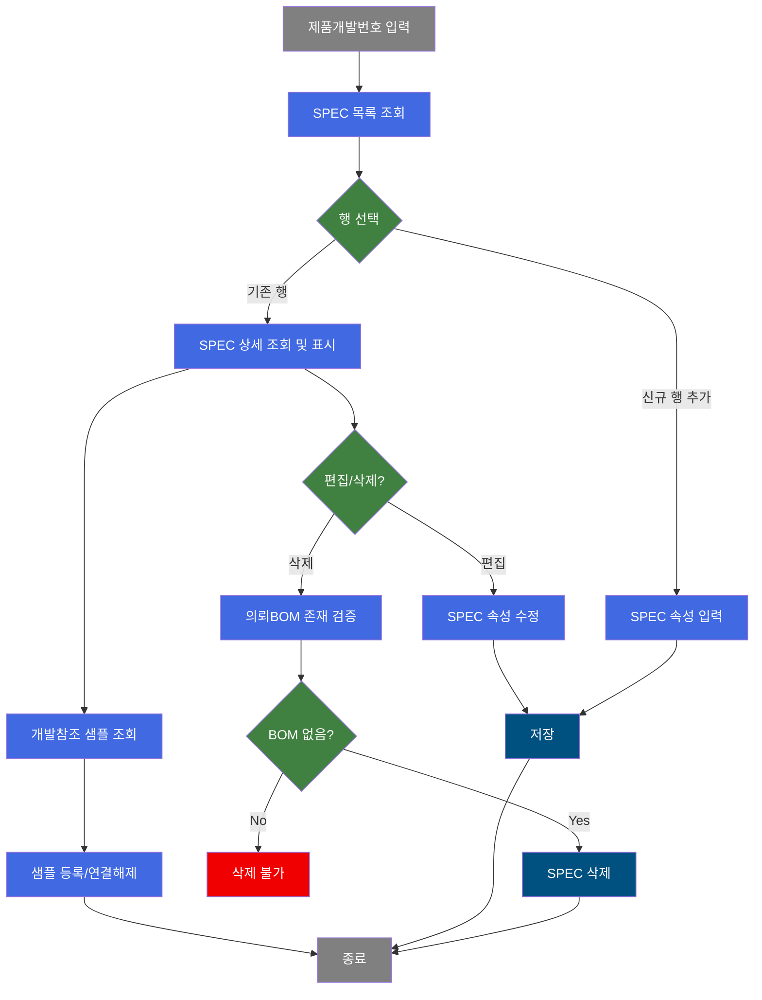
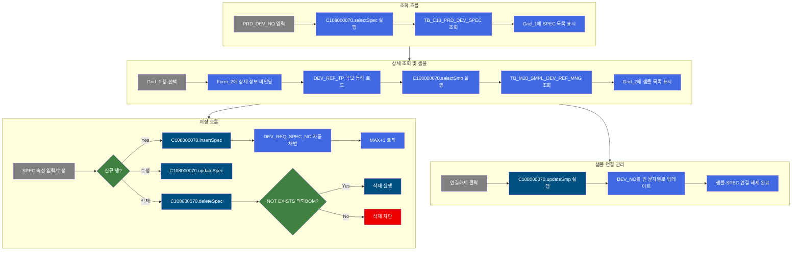
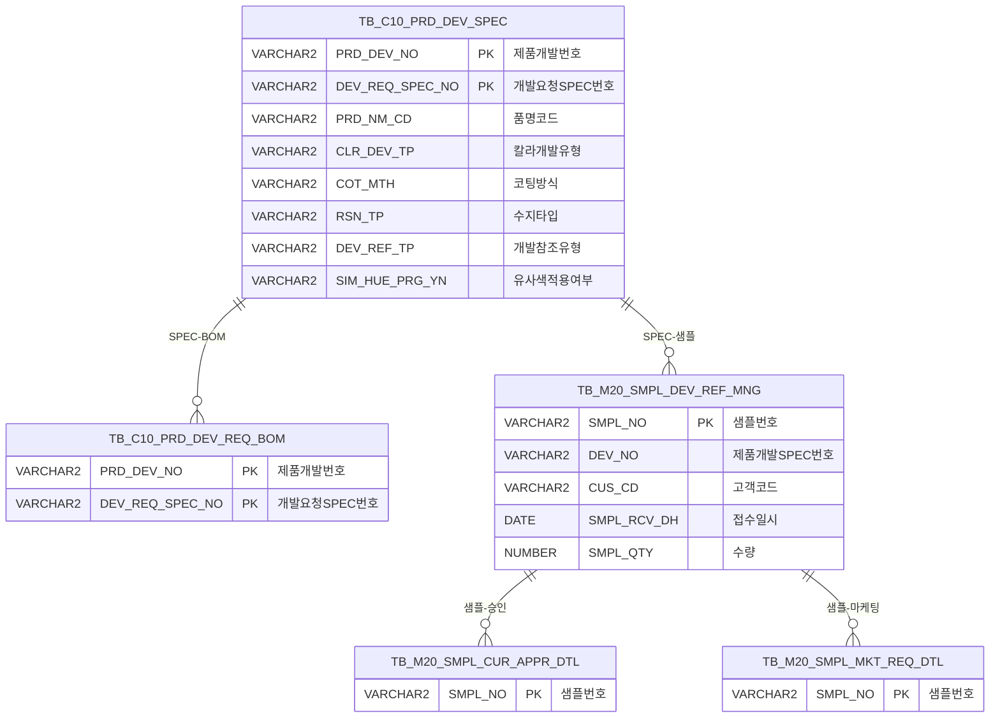

<h1 style="font-size: 40px; text-align: center; font-weight:
   bold; margin: 30px 0;">
  C108000070 레거시 시스템 분석 종합 보고서
</h1>


# 1. 시스템 개요
- **서비스 ID**: C108000070
- **업무명**: 제품개발 SPEC 관리
- **분석 일시**: 2026-03-17 09:34 KST
- **분석 시간**: ~5분
- **전체 Activity 수**: 5개 (Built-in 5개, Custom 0개)
- **분석자**: Claude Opus 4.6 / Sonnet (Phase별 혼합)
- **분석 도구**: /analyze-service C108000070
- **문서 버전**: 1.0

# 📊 비즈니스 프로세스 분석

## 시스템 목적

C108000070은 CCL(Color Coating Line) 제품개발 SPEC 관리 화면으로, 제품개발번호(PRD_DEV_NO) 기준으로 개발요청 SPEC을 조회·등록·수정·삭제하고, 각 SPEC에 연결된 개발참조 샘플(Sample) 정보를 관리하는 기능을 제공한다.

제품개발 담당자는 이 화면을 통해 색상개발(C) 또는 디자인개발(D) 유형별로 SPEC을 생성하고, 품명·코팅방식·수지·무독성구분·광택값·도막두께·보호필름 유무 등 제품 사양 속성을 관리한다. 또한 각 SPEC에 대해 참조 칼라코드, 참조 CCL BOM, 유사색상 적용 가능 여부 등의 개발 참조 정보를 설정할 수 있다.

하단 영역에서는 선택한 SPEC과 연결된 개발참조 샘플 목록을 조회하며, 샘플 등록 화면(M205040040)으로의 이동 및 샘플-SPEC 연결 해제 기능을 제공한다.

## 핵심 워크플로우 다이어그램



### 상세 워크플로우 다이어그램



## 주요 유즈케이스

### UC-01: 제품개발 SPEC 조회
- **Actor**: 제품개발 담당자
- **목적**: 특정 제품개발번호에 대한 개발요청 SPEC 목록 및 상세 사양을 조회하여 현재 개발 현황을 파악

- **전제조건**:
  - 사용자가 시스템에 로그인되어 있음
  - 조회 대상 제품개발번호(PRD_DEV_NO)를 알고 있음

- **주요 흐름**:
  1. 사용자가 Form_1에 제품개발번호(PRD_DEV_NO) 입력
  2. 조회 버튼 클릭 → PRD_DEV_NO 필수값 검증
  3. C108000070.selectSpec 쿼리 실행 → TB_C10_PRD_DEV_SPEC 테이블에서 SPEC 목록 조회
  4. Grid_1에 개발요청 SPEC 목록(칼라개발유형, 품명, 코팅방식, 수지, 도막두께 등) 표시
  5. Grid_1 행 선택 시 Form_2에 상세 정보 바인딩 및 Grid_2에 연결 샘플 자동 조회

- **대체 흐름**:
  - PRD_DEV_NO 미입력 시: 필수값 검증 실패 → 알림 메시지
  - 조회 결과 없음: Grid_1 빈 상태 유지
  - URL 파라미터로 PRD_DEV_NO 전달 시: Form_1에 자동 세팅 후 자동 조회

- **후행조건**:
  - Grid_1에 SPEC 목록이 표시됨
  - 행 선택 시 상세 편집 및 샘플 조회가 가능한 상태

### UC-02: 제품개발 SPEC 등록/수정
- **Actor**: 제품개발 담당자
- **목적**: 신규 개발요청 SPEC을 등록하거나 기존 SPEC의 사양 속성을 수정

- **전제조건**:
  - UC-01에서 SPEC 목록이 조회된 상태
  - 제품개발번호가 설정되어 있음

- **주요 흐름**:
  1. 컨텍스트 메뉴에서 "행추가" 선택 또는 기존 행에서 "편집" 선택
  2. Form_2가 unlock 상태로 전환 (신규 행은 자동 unlock, 기존 행은 편집 메뉴 선택 필요)
  3. 칼라개발유형(CLR_DEV_TP) 선택 → C/D에 따라 개발참조유형(DEV_REF_TP) 콤보 동적 로드
  4. 품명, 코팅방식, 수지, 무독성구분, 광택값, 도막두께, 보호필름 유무, 예상수주량 등 입력
  5. Form_2 필드 변경 시 bindingFormToGrid()로 Grid_1에 즉시 반영
  6. 저장 버튼 클릭 → PRD_DEV_NO, CLR_DEV_TP, DEV_REF_TP 필수값 검증 → confirm 확인
  7. 신규: C108000070.insertSpec (DEV_REQ_SPEC_NO 자동채번 MAX+1) / 수정: C108000070.updateSpec 실행

- **대체 흐름**:
  - 필수값 미입력 시: "값이 올바르지 않습니다" 알림
  - 저장 confirm에서 취소 시: 저장 중단
  - 동시 수정 충돌: 감시 컬럼(ObjectType, ObjectId, ProgramId, Timestamp) 기반 충돌 감지

- **후행조건**:
  - TB_C10_PRD_DEV_SPEC에 데이터 반영
  - Grid_1 자동 재조회

### UC-03: 제품개발 SPEC 삭제
- **Actor**: 제품개발 담당자
- **목적**: 불필요한 개발요청 SPEC을 삭제 (단, 의뢰BOM이 연결되지 않은 경우만 가능)

- **전제조건**:
  - UC-01에서 SPEC 목록이 조회된 상태
  - 삭제 대상 SPEC에 연결된 의뢰BOM(TB_C10_PRD_DEV_REQ_BOM)이 없어야 함

- **주요 흐름**:
  1. Grid_1에서 삭제할 SPEC 행 선택
  2. 컨텍스트 메뉴에서 "삭제" 선택
  3. 저장 버튼 클릭 → confirm 확인
  4. C108000070.deleteSpec 실행 → NOT EXISTS 조건으로 의뢰BOM 존재 검증
  5. 의뢰BOM 없으면 TB_C10_PRD_DEV_SPEC에서 삭제

- **대체 흐름**:
  - 의뢰BOM이 존재하는 경우: DELETE 쿼리가 NOT EXISTS 조건에 의해 삭제 0건 → 실질적으로 삭제 차단

- **후행조건**:
  - SPEC이 TB_C10_PRD_DEV_SPEC에서 삭제됨
  - Grid_1 자동 재조회

### UC-04: 개발참조 샘플 조회 및 연결해제
- **Actor**: 제품개발 담당자
- **목적**: 선택한 SPEC에 연결된 개발참조 샘플을 조회하고, 필요시 연결을 해제

- **전제조건**:
  - Grid_1에서 SPEC 행이 선택된 상태
  - PRD_DEV_SPEC_NO가 결정됨

- **주요 흐름**:
  1. Grid_1 행 선택 시 자동으로 C108000070.selectSmp 실행
  2. TB_M20_SMPL_DEV_REF_MNG 테이블에서 해당 SPEC의 샘플 목록 조회 (스칼라 서브쿼리로 코드명, 고객명, 승인/마케팅 건수 조회)
  3. Grid_2에 샘플번호, 개발No, 고객사명, 접수일자, 상태, 수량 등 표시
  4. "등록" 버튼 클릭 시 M205040040 탭으로 이동 (샘플 등록 화면)
  5. 연결해제: Grid_2에서 샘플 선택 → "연결해제" 버튼 → confirm → C108000070.updateSmp 실행 (DEV_NO를 빈 문자열로 업데이트)

- **대체 흐름**:
  - 연결된 샘플이 없는 경우: Grid_2 빈 상태, SIM_CNT=0 표시
  - Grid_2 미선택 상태에서 연결해제 시: 필수값 검증 실패

- **후행조건**:
  - 연결해제 후 Grid_2 자동 재조회
  - SPEC 목록(Grid_1)도 재조회하여 변경 반영

---
## 비즈니스 로직 상세

### 1. DEV_REQ_SPEC_NO 자동채번 로직

- **목적**: 신규 SPEC 등록 시 개발요청 SPEC 번호를 자동으로 부여
- **처리 케이스**:

  **[케이스 1: 기존 SPEC 존재]**
  ```
    조건: 해당 PRD_DEV_NO에 이미 등록된 SPEC이 있는 경우
    처리:
      1. TB_C10_PRD_DEV_SPEC에서 MAX(DEV_REQ_SPEC_NO) 조회
      2. TO_NUMBER 변환 후 +1 증가
      3. TO_CHAR로 문자열 변환하여 새 SPEC 번호 생성
    예시: 기존 MAX='12' → 새 번호='13'
  ```

  **[케이스 2: 최초 SPEC 등록]**
  ```
    조건: 해당 PRD_DEV_NO에 등록된 SPEC이 없는 경우
    처리:
      1. NVL(MAX(DEV_REQ_SPEC_NO), '10')에 의해 기본값 '10' 적용
      2. 10 + 1 = 11이 첫 번째 SPEC 번호
    예시: 첫 등록 → 번호='11'
  ```

- **계산 공식**:
  ```
  새 SPEC 번호 = TO_CHAR(TO_NUMBER(NVL(MAX(DEV_REQ_SPEC_NO), '10')) + 1)
  초기값: '10' (실제 첫 번호는 '11'부터 시작)
  ```

### 2. SPEC 삭제 시 의뢰BOM 참조 무결성 검증

- **목적**: 의뢰BOM이 참조하고 있는 SPEC의 삭제를 방지하여 데이터 무결성 보장
- **처리 케이스**:

  **[케이스 1: 삭제 가능]**
  ```
    조건: TB_C10_PRD_DEV_REQ_BOM에 해당 PRD_DEV_NO + DEV_REQ_SPEC_NO 조합이 없음
    처리:
      1. NOT EXISTS 서브쿼리 통과
      2. TB_C10_PRD_DEV_SPEC에서 해당 행 삭제
  ```

  **[케이스 2: 삭제 차단]**
  ```
    조건: TB_C10_PRD_DEV_REQ_BOM에 해당 SPEC을 참조하는 BOM 데이터가 존재
    처리:
      1. NOT EXISTS 조건 불충족
      2. DELETE 쿼리 실행 시 WHERE 조건 불일치로 0건 삭제
      3. 사실상 삭제가 차단됨 (에러 메시지 없이 무시)
  ```

### 3. 개발참조유형(DEV_REF_TP) 콤보 동적 로드

- **목적**: 칼라개발유형(CLR_DEV_TP)에 따라 적절한 개발참조유형 선택지를 제공
- **처리 케이스**:

  **[케이스 1: 색상 개발 (C)]**
  ```
    조건: CLR_DEV_TP = 'C'
    처리: SZ0000 카테고리의 DEV_REF_TP_CLR 코드 목록 로드
  ```

  **[케이스 2: 디자인 개발 (D)]**
  ```
    조건: CLR_DEV_TP = 'D'
    처리: SZ0000 카테고리의 DEV_REF_TP_DESN 코드 목록 로드
  ```

### 4. 스칼라 서브쿼리 기반 코드 변환 (selectSmp)

- **목적**: 샘플 조회 시 코드값을 사용자가 읽을 수 있는 명칭으로 변환
- **처리 케이스**:

  **[코드 변환 대상]**
  ```
    - SMPL_TP → SMPL_TP_NM: VI_M00_CODE_ACCESS 뷰에서 샘플유형명 조회
    - CUS_CD → CUS_CD_NM: 고객코드를 고객사명으로 변환
    - SMPL_STS_CD → SMPL_STS_CD_NM: 샘플 상태 코드명 변환
    - SMPL_SZ_CD → SMPL_SZ_CD_NM: 샘플 크기 코드명 변환
    - APPR_CNT: TB_M20_SMPL_CUR_APPR_DTL에서 승인 건수 COUNT 서브쿼리
    - MKT_CNT: TB_M20_SMPL_MKT_REQ_DTL에서 마케팅 건수 COUNT 서브쿼리
  ```

---

# 💾 데이터 요구사항

## 핵심 테이블

### 1. TB_C10_PRD_DEV_SPEC - 제품개발 SPEC 마스터
| 컬럼명 | 타입 | PK | 설명 |
|--------|------|----|-----|
| PRD_DEV_NO | VARCHAR2 | ✅ | 제품개발번호 |
| DEV_REQ_SPEC_NO | VARCHAR2 | ✅ | 개발요청 SPEC 번호 (자동채번) |
| PRD_NM_CD | VARCHAR2 | | 품명코드 (SJ0001 마스터) |
| CLR_DEV_TP | VARCHAR2 | | 칼라개발유형 (C: 색상, D: 디자인) |
| CUS_REQ_HUE_TXT | VARCHAR2 | | 고객정의품명(색상명) |
| COT_MTH | VARCHAR2 | | 코팅방식 (SZ0000 마스터) |
| RSN_TP | VARCHAR2 | | 수지타입 (SZ0000 마스터, 팝업검색) |
| TLP_TP | VARCHAR2 | | 무독성구분/탑코트타입 (SZ0000 마스터) |
| RL_LUS_RT | VARCHAR2 | | 실광택값 |
| PNT_FLM_THK_TXT | VARCHAR2 | | 도막두께 텍스트 |
| PTT_FLM_YN | VARCHAR2 | | 보호필름 유무 (SZ0000 마스터) |
| ORD_PRE_WGT | NUMBER | | 예상수주량 |
| DEV_REF_TP | VARCHAR2 | | 개발참조유형 (CLR_DEV_TP에 따라 동적) |
| REF_CLR_CD_TXT | VARCHAR2 | | 참조 칼라코드 |
| REF_CCL_BOM | VARCHAR2 | | 참조 CCL BOM |
| SIM_HUE_PRG_YN | VARCHAR2 | | 유사색상 적용가능여부 (Y/N) |

### 2. TB_M20_SMPL_DEV_REF_MNG - 개발참조 샘플 관리
| 컬럼명 | 타입 | PK | 설명 |
|--------|------|----|-----|
| SMPL_NO | VARCHAR2 | ✅ | 샘플번호 |
| SMPL_TP | VARCHAR2 | | 샘플유형 |
| DEV_NO | VARCHAR2 | | 제품개발 SPEC 번호 (PRD_DEV_SPEC_NO 참조) |
| CUS_CD | VARCHAR2 | | 고객코드 |
| SMPL_RCV_DH | DATE | | 샘플 접수일시 |
| SMPL_STS_CD | VARCHAR2 | | 샘플 상태코드 |
| SMPL_SZ_CD | VARCHAR2 | | 샘플 크기코드 |
| SMPL_QTY | NUMBER | | 샘플 수량 |
| SMPL_PUB_YN | VARCHAR2 | | Tag 발행 여부 |
| REMARK | VARCHAR2 | | 특기사항 |

### 3. TB_C10_PRD_DEV_REQ_BOM - 제품개발 의뢰 BOM
| 컬럼명 | 타입 | PK | 설명 |
|--------|------|----|-----|
| PRD_DEV_NO | VARCHAR2 | ✅ | 제품개발번호 |
| DEV_REQ_SPEC_NO | VARCHAR2 | ✅ | 개발요청 SPEC 번호 |

### 4. TB_M20_SMPL_CUR_APPR_DTL - 샘플 현재 승인 상세
| 컬럼명 | 타입 | PK | 설명 |
|--------|------|----|-----|
| SMPL_NO | VARCHAR2 | ✅ | 샘플번호 |

### 5. TB_M20_SMPL_MKT_REQ_DTL - 샘플 마케팅 요청 상세
| 컬럼명 | 타입 | PK | 설명 |
|--------|------|----|-----|
| SMPL_NO | VARCHAR2 | ✅ | 샘플번호 |

## 데이터 플로우

### 1. SPEC 조회
```
[제품개발 SPEC 목록 조회]
PRD_DEV_NO 입력
→ C108000070.selectSpec
  FROM TB_C10_PRD_DEV_SPEC SP
  WHERE SP.PRD_DEV_NO = :PRD_DEV_NO
    AND (DEV_REQ_SPEC_NO = :DEV_REQ_SPEC_NO -- 선택사항)
  ORDER BY SP.DEV_REQ_SPEC_NO
→ Grid_1에 SPEC 목록 표시
```

### 2. 샘플 조회
```
[개발참조 샘플 조회]
Grid_1 행 선택 (PRD_DEV_SPEC_NO 결정)
→ C108000070.selectSmp
  FROM TB_M20_SMPL_DEV_REF_MNG A
  WHERE A.DEV_NO = :PRD_DEV_SPEC_NO (스칼라 서브쿼리: VI_M00_CODE_ACCESS)
  + 스칼라 서브쿼리: 코드명 변환 (유형, 고객, 상태, 크기)
  + 스칼라 서브쿼리: COUNT(승인건수), COUNT(마케팅건수)
→ Grid_2에 샘플 목록 표시
→ Form_3 SIM_CNT에 건수 표시
```

### 3. SPEC 저장 (신규/수정/삭제)
```
[SPEC 신규 등록]
Grid_1 행추가 → Form_2 입력
→ C108000070.insertSpec
  INSERT INTO TB_C10_PRD_DEV_SPEC
  DEV_REQ_SPEC_NO = TO_CHAR(NVL(MAX(DEV_REQ_SPEC_NO),'10') + 1)
→ 자동채번으로 SPEC 등록

[SPEC 수정]
Grid_1 행 선택 → Form_2 편집
→ C108000070.updateSpec
  UPDATE TB_C10_PRD_DEV_SPEC
  SET 전체 속성 컬럼 갱신
  WHERE PRD_DEV_NO = :PRD_DEV_NO AND DEV_REQ_SPEC_NO = :DEV_REQ_SPEC_NO

[SPEC 삭제]
Grid_1 행 삭제
→ C108000070.deleteSpec
  DELETE FROM TB_C10_PRD_DEV_SPEC SP
  WHERE SP.PRD_DEV_NO = :PRD_DEV_NO
    AND SP.DEV_REQ_SPEC_NO = :DEV_REQ_SPEC_NO
    AND NOT EXISTS (SELECT 1 FROM TB_C10_PRD_DEV_REQ_BOM RB
                    WHERE RB.PRD_DEV_NO = SP.PRD_DEV_NO
                      AND RB.DEV_REQ_SPEC_NO = SP.DEV_REQ_SPEC_NO)
```

### 4. 샘플 연결해제
```
[샘플-SPEC 연결해제]
Grid_2 행 선택 → 연결해제 버튼
→ C108000070.updateSmp
  UPDATE TB_M20_SMPL_DEV_REF_MNG
  SET DEV_NO = ''
  WHERE SMPL_NO = :SMPL_NO AND DEV_NO = :PRD_DEV_SPEC_NO
→ 샘플의 DEV_NO를 빈 문자열로 변경하여 연결 해제
```

## SQL 일람표
| SQL 이름 | 쿼리 ID | 타입 | 출처 | 테이블 |
|---------|---------|------|------|--------|
| 제품개발SPEC 조회 | C108000070.selectSpec | SELECT | Service | TB_C10_PRD_DEV_SPEC |
| SPEC 신규 등록 | C108000070.insertSpec | INSERT | Service | TB_C10_PRD_DEV_SPEC |
| SPEC 수정 | C108000070.updateSpec | UPDATE | Service | TB_C10_PRD_DEV_SPEC |
| SPEC 삭제 | C108000070.deleteSpec | DELETE | Service | TB_C10_PRD_DEV_SPEC, TB_C10_PRD_DEV_REQ_BOM |
| 개발참조 샘플 조회 | C108000070.selectSmp | SELECT | Service | TB_M20_SMPL_DEV_REF_MNG, VI_M00_CODE_ACCESS, TB_M20_SMPL_CUR_APPR_DTL, TB_M20_SMPL_MKT_REQ_DTL |
| 샘플 연결해제 | C108000070.updateSmp | UPDATE | Service | TB_M20_SMPL_DEV_REF_MNG |

## ER 다이어그램 (핵심 관계)



관계 설명:
- TB_C10_PRD_DEV_SPEC이 중심 테이블로, 제품개발번호(PRD_DEV_NO) + SPEC번호(DEV_REQ_SPEC_NO) 복합 PK
- TB_C10_PRD_DEV_REQ_BOM: SPEC에 대한 의뢰 BOM (삭제 시 참조 무결성 검증에 사용)
- TB_M20_SMPL_DEV_REF_MNG: DEV_NO 컬럼으로 SPEC과 연결 (PRD_DEV_NO||DEV_REQ_SPEC_NO 형태)
- 샘플 승인/마케팅 상세 테이블: SMPL_NO 기반 1:N 관계

---

# 🖥️ 사용자 인터페이스 요구사항

## 화면 레이아웃 상세

### Layout 구조 (initLayout)
```javascript
{
  itemType: "layout",
  dirType: "row",           // 세로 배치
  childSize: "35",          // 첫 번째 컴포넌트 35px
  splitter: false,
  components: [
    {
      id: "C108000070_Form_1",      // 검색 폼 (35px)
      type: "form",
      service: "C108000070-service",
      actionType: "find"
    },
    {
      itemType: "layout",
      dirType: "row",               // 세로 배치
      childSize: "300,150",         // Grid_1: 300px, Form_2: 150px
      splitter: true,               // 크기 조절 가능
      components: [
        {
          id: "C108000070_Grid_1",   // SPEC 목록 그리드 (300px)
          type: "grid",
          service: "C108000070-service",
          actionType: "save",
          contextmenu: true
        },
        {
          id: "C108000070_Form_2",   // SPEC 상세 편집 폼 (150px)
          type: "form",
          service: "C108000070-service",
          actionType: "find"
        },
        {
          itemType: "layout",
          dirType: "row",            // 세로 배치
          childSize: "30",           // Form_3: 30px
          splitter: true,
          components: [
            {
              id: "C108000070_Form_3", // 샘플 정보 바 (30px)
              type: "form"
            },
            {
              id: "C108000070_Grid_2", // 샘플 목록 그리드 (나머지)
              type: "grid",
              actionType: "save",
              contextmenu: true
            }
          ]
        }
      ]
    }
  ]
}
```

## 입출력 요소

### Form 컴포넌트

**C108000070_Form_1 (검색 폼)**
- PRD_DEV_NO: input - 개발번호 (labelWidth:75, inputWidth:100, 우측정렬)
- DEV_REQ_SPEC_NO: input - SPEC번호 (labelWidth:75, inputWidth:100, 우측정렬)
- find: button - 조회 (초기 disabled, 권한 기반 활성화)
- save: button - 저장 (초기 disabled, 권한 기반 활성화)
- winClose: button - 닫기

**C108000070_Form_2 (SPEC 상세 편집 폼)**
- DEV_REQ_SPEC_NO: input - SPEC번호 (readonly, 자동채번)
- CLR_DEV_TP: combo - 개발유형 (C-색상, D-디자인, 초기 readonly → 신규 행 시 unlock, 배경색:#FFFFC0)
- PRD_NM_CD: combo - 품명 (마스터콤보 SJ0001, 배경색:#FFFFC0)
- CUS_REQ_HUE_TXT: input - 고객정의품명(색상명)
- COT_MTH: combo - 코팅방식 (마스터콤보 SZ0000, 배경색:#FFFFC0)
- RSN_TP: input - 수지 (검색아이콘 → masterPopup 팝업, 배경색:#FFFFC0)
- TLP_TP: combo - 무독성구분 (마스터콤보 SZ0000, 배경색:#FFFFC0)
- RL_LUS_RT: input - 실광택값 (배경색:#FFFFC0)
- PNT_FLM_THK_TXT: input - 도막두께 (배경색:#FFFFC0)
- PTT_FLM_YN: combo - 보호필름 유무 (마스터콤보 SZ0000, 배경색:#FFFFC0)
- ORD_PRE_WGT: input - 예상수주량
- DEV_REF_TP: combo - 개발참조유형 (CLR_DEV_TP에 따라 동적 로드, 배경색:#FFFFC0)
- REF_CLR_CD_TXT: input - 참조 칼라코드
- REF_CCL_BOM: input - 참조 CCLBOM
- SIM_HUE_PRG_YN: combo - 유사색상적용가능여부 (Y-가능, N-불가능, 배경색:#FFFFC0)
- PRD_DEV_NO: hidden - 개발번호 (readonly)

**C108000070_Form_3 (개발참조 Sample 정보 바)**
- label_smp: label - "[개발참조 Sample]"
- SIM_CNT: input - 건 (readonly, 기본값:0, 우측정렬)
- simple_call: linkbutton - 등록 → M205040040 탭 오픈
- removeSmp: custombutton - 연결해제 (width:70, 배경색:#D2FFD2)

### Grid 컴포넌트

**C108000070_Grid_1 (개발요청 SPEC 목록)**
- 편집 가능 여부: 아니오 (모든 컬럼 ro)
- Split: 없음
- 기능: multiselect, validation, rowspan, colspan, stableSorting, editEvents, colWidthUnit=%
- 컨텍스트 메뉴: Menu_1 (새로고침, 행추가, 행복사, 삭제, 편집)
- 주요 컬럼 (17개):

  **기본 정보**:
  - DEV_REQ_SPEC_NO: ro - 개발요청 SPEC번호 (8%, 좌측정렬)
  - CLR_DEV_TP: ro - 칼라개발유형 (10%, 좌측정렬)
  - PRD_NM_CD: ro - 품명 (12%, 좌측정렬)
  - CUS_REQ_HUE_TXT: ro - 고객정의품명(색상명) (15%, 좌측정렬)

  **SPEC 사양 정보**:
  - COT_MTH: ro - 코팅방식 (10%, 좌측정렬)
  - RSN_TP: ro - 수지 (8%, 좌측정렬)
  - TLP_TP: ro - 무독성구분 (12%, 좌측정렬)
  - RL_LUS_RT: ro - 실광택값 (12%, 좌측정렬)
  - PNT_FLM_THK_TXT: ro - 도막두께 (12%, 좌측정렬)
  - PTT_FLM_YN: ro - 보호필름 유무 (12%, 좌측정렬)
  - ORD_PRE_WGT: ro - 예상수주량 (12%, 좌측정렬)

  **개발참조 정보**:
  - DEV_REF_TP: ro - 개발참조 유형 (12%, 좌측정렬)
  - REF_CLR_CD_TXT: ro - 참조 칼라코드 (15%, 좌측정렬)
  - REF_CCL_BOM: ro - 참조 CCLBOM (12%, 좌측정렬)
  - SIM_HUE_PRG_YN: ro - 유사색상 적용가능여부 (12%, 좌측정렬)

  **숨김 컬럼**:
  - PRD_DEV_NO: ro - 제품개발 번호 (12%, 숨김)
  - PRD_DEV_SPEC_NO: ro - (헤더 없음) (12%, 숨김)

**C108000070_Grid_2 (개발참조 Sample 목록)**
- 편집 가능 여부: 아니오 (모든 컬럼 ro)
- Split: 없음
- 기능: multiselect, validation, smartRendering, editEvents, colWidthUnit=%
- 멀티라인 헤더: attachHeader로 "상태/Size/수량" 그룹 헤더 적용
- 주요 컬럼 (13개):

  **기본 정보**:
  - SMPL_NO: ro - 샘플번호 (12%, 중앙정렬)
  - PRD_DEV_SPEC_NO: ro - 개발No (12%, 좌측정렬)
  - CUS_CD_NM: ro - 고객사명 (14%, 좌측정렬)
  - SMPL_RCV_DH: ro - 접수일자 (8%, 중앙정렬)

  **상태/Size/수량 그룹**:
  - SMPL_STS_CD_NM: ro - 샘플 상태 (5%, 좌측정렬)
  - SMPL_SZ_CD_NM: ro - Size (5%, 좌측정렬)
  - SMPL_QTY: ro - 수량 (5%, 우측정렬)

  **부가 정보**:
  - SMPL_PUB_YN: ro - Tag 발행 (5%, 중앙정렬)
  - REMARK: ro - 특기사항 (*, 좌측정렬)

  **숨김 컬럼**:
  - SMPL_TP: ro - 샘플유형 (4%, 숨김)
  - SMPL_TP_NM: ro - 샘플유형명 (6%, 숨김)
  - APPR_CNT: ro - 승인CNT (4%, 숨김)
  - MKT_CNT: ro - 마케팅CNT (4%, 숨김)

## 화면 동작 흐름

### 1. 화면 초기 로딩
```
1. 화면 진입 (C108000070.jsp)
2. initLayout으로 DHTMLX 레이아웃 초기화
3. Form_1 로드 완료 (onFormLoadFunction)
   - URL 파라미터에서 PRD_DEV_NO, DEV_REQ_SPEC_NO 추출
   - Form_1에 값 세팅, formLoadFlag=true
4. Grid_1 로드 완료 (onGridLoadFunction)
   - PRD_DEV_NO 존재 시 findSpecGrid() 자동 실행
   - onAfterUpdateFinishEvent 등록
5. Form_2 로드 완료 (onFormLoadFunction2)
   - Form_2를 Grid_1에 바인딩
   - onInputChange/onChange 이벤트 등록
   - 마스터 콤보 초기화 (PRD_NM_CD:SJ0001, COT_MTH:SZ0000, TLP_TP:SZ0000, PTT_FLM_YN:SZ0000)
6. Grid_2 로드 완료 (onGridLoadFunction2)
   - 업데이트 완료 후 findSpecGrid() 재조회 등록
```

### 2. SPEC 조회
```
1. 사용자가 Form_1에 PRD_DEV_NO 입력
2. 조회(find) 버튼 클릭
3. findSpecGrid() 호출
   - PRD_DEV_NO 필수값 검증
   - uiCommon.parameters() 호출하여 파라미터 구성
4. basicGridData.do 서비스 호출 (C108000070-service, find)
5. C108000070.selectSpec 쿼리 실행
6. Grid_1에 SPEC 목록 바인딩
```

### 3. Grid_1 행 선택 및 상세 조회
```
1. Grid_1에서 행 클릭
2. onSelectGrid() 호출
   - inserted 행 여부 확인: 신규면 Form_2 unlock, 기존이면 lock
   - CLR_DEV_TP 값 확인 → DEV_REF_TP 콤보 동적 로드 (C→DEV_REF_TP_CLR, D→DEV_REF_TP_DESN)
3. Form_2에 선택 행 데이터 자동 바인딩 (Grid-Form 연동)
4. findSmpGrid() 호출
   - Grid_1 선택 행의 PRD_DEV_SPEC_NO 추출
   - basicGridData.do 서비스 호출 (findSmp 명령)
5. C108000070.selectSmp 쿼리 실행
6. Grid_2에 샘플 목록 표시, Form_3 SIM_CNT 갱신
```

### 4. 샘플 등록 화면 이동
```
1. Form_3의 "등록" linkbutton 클릭
2. simple_call() 호출
   - Grid_1 선택 행의 PRD_DEV_SPEC_NO 추출
3. parent.newRemoveOpenTab("M205040040", {...}) 호출
4. M205040040 탭이 새로 열리며 파라미터 전달
```

### 5. 수지(RSN_TP) 팝업 검색
```
1. Form_2의 RSN_TP 필드 검색 아이콘 클릭
2. masterPopup('RSN_TP','SZ0000','RSN_TP','C108000070_Form_2') 호출
3. masterGridData.do 팝업창 오픈 (469x532)
4. 팝업에서 선택 후 Form_2 RSN_TP 필드에 값 반환
```

## JavaScript 모듈

**C108000070.jsp (메인 화면 스크립트)**
- initLayout: 화면 레이아웃 초기화 (DHTMLX initLayout 객체 정의)
- findSpecGrid(): SPEC 목록 조회 (PRD_DEV_NO 필수 검증 → basicGridData.do)
- findSmpGrid(): 샘플 목록 조회 (PRD_DEV_SPEC_NO 기반 → basicGridData.do, findSmp)
- save(): 저장 처리 (inserted 행 필수값 검증 → confirm → Grid_1.sendGrid())
- onSelectGrid(): Grid_1 행 선택 이벤트 (Form_2 lock/unlock, DEV_REF_TP 동적 콤보, findSmpGrid)
- onFormLoadFunction(): Form_1 로드 완료 (URL 파라미터 세팅)
- onGridLoadFunction(): Grid_1 로드 완료 (자동 조회, 이벤트 등록)
- onFormLoadFunction2(): Form_2 로드 완료 (Grid 바인딩, 마스터 콤보 초기화)
- onGridLoadFunction2(): Grid_2 로드 완료 (업데이트 후 재조회 등록)
- bindingFormToGrid(value, text): Form_2 변경값 → Grid_1 선택 행 즉시 반영
- simple_call(): 샘플 등록 화면 이동 (M205040040 탭 오픈)
- removeSmp(): 샘플 연결해제 (confirm → Grid_2.sendGrid('removeSmp'))
- masterPopup(): 수지(RSN_TP) 팝업 검색 (masterGridData.do)
- onGridContextMenuClick(id, gridObj, menuObj): 컨텍스트 메뉴 (copy_row, excel_grid)
- refresh(referenceItem): 새로고침 (clearDataProcess → findSpecGrid)
- add(referenceItem): 행추가
- remove(referenceItem): 행삭제
- copy(referenceItem): 행복사
- edit(referenceItem): 편집 모드 토글

## 주요 이벤트 핸들러

**onSelectGrid (SPEC 행 선택)**
- 이벤트 타입: Grid Row Click
- 처리 내용:
  1. 선택된 행의 inserted 여부 확인
  2. inserted 행: Form_2 전체 필드 unlock (편집 가능)
  3. 기존 행: Form_2 전체 필드 lock (readonly)
  4. CLR_DEV_TP 값 확인 → DEV_REF_TP 콤보 동적 교체 (C→DEV_REF_TP_CLR, D→DEV_REF_TP_DESN, SZ0000)
  5. findSmpGrid() 호출하여 연결 샘플 조회

**bindingFormToGrid (Form→Grid 동기화)**
- 이벤트 타입: Form onInputChange / onChange
- 처리 내용:
  1. Form_2에서 변경된 필드 ID와 값 감지
  2. Grid_1의 현재 선택 행에서 해당 컬럼 찾기
  3. Grid_1 셀에 변경값 즉시 반영 (실시간 동기화)

**save (저장)**
- 이벤트 타입: Button Click
- 처리 내용:
  1. Grid_1의 inserted 행 순회
  2. PRD_DEV_NO, CLR_DEV_TP, DEV_REF_TP 필수값 검증
  3. 미입력 시 "값이 올바르지 않습니다" 알림 후 중단
  4. confirm("저장하시겠습니까?") 확인
  5. Grid_1.sendGrid() 실행 → handleDataProcess.do 호출

**removeSmp (샘플 연결해제)**
- 이벤트 타입: Custom Button Click
- 처리 내용:
  1. Grid_2 선택 행의 SMPL_NO, PRD_DEV_SPEC_NO 추출
  2. 미선택 시 검증 실패 처리
  3. confirm("연결을 해제하시겠습니까?") 확인
  4. Grid_2.sendGrid('removeSmp') 실행
  5. 완료 후 findSpecGrid() 재조회

---

# 📌 특이사항 및 주의사항

## 1. DEV_REQ_SPEC_NO 자동채번 동시성 이슈
- **MAX+1 채번 방식**: `TO_NUMBER(NVL(MAX(DEV_REQ_SPEC_NO), '10')) + 1` 로직은 동시 등록 시 중복 번호가 발생할 수 있음
- 시퀀스(SEQUENCE) 대신 MAX+1 패턴을 사용하고 있어, 동시 사용자 환경에서 PK 충돌 가능성 존재
- 현대화 시 DB 시퀀스 또는 채번 테이블 방식으로 변경 검토 필요

## 2. SPEC 삭제 시 무조건 성공 응답
- **NOT EXISTS 기반 삭제 차단**: 의뢰BOM이 존재하면 DELETE 쿼리가 0건을 처리하지만, 사용자에게 명시적인 에러 메시지가 표시되지 않음
- 사용자는 삭제가 완료된 것으로 인식하나 실제로는 데이터가 남아있을 수 있음
- 현대화 시 삭제 전 BOM 존재 여부를 사전 검증하고 명확한 에러 메시지 제공 필요

## 3. 크로스 모듈 데이터 참조
- **TB_M20_SMPL_DEV_REF_MNG**: M20(샘플관리) 모듈의 테이블을 C10(CCL) 모듈에서 직접 참조
- DEV_NO 컬럼이 PRD_DEV_NO||DEV_REQ_SPEC_NO 형태의 복합 문자열로 연결되어 있어, FK 제약조건 없이 문자열 매칭에 의존
- 데이터 정합성은 애플리케이션 레벨에서만 관리됨

## 4. Form-Grid 양방향 바인딩 패턴
- Form_2 변경 시 bindingFormToGrid()로 Grid_1에 즉시 반영하는 비표준 패턴 사용
- Grid_1 행 선택 시 Form_2에 자동 바인딩되는 DHTMLX 프레임워크 기본 기능과 결합
- inserted 행만 unlock하고 기존 행은 lock하는 편집 제어 로직이 JavaScript에서 관리됨

## 5. DEV_REF_TP 콤보 동적 로드 로직
- CLR_DEV_TP(칼라개발유형)에 따라 DEV_REF_TP(개발참조유형) 콤보의 데이터 소스가 변경됨
- C(색상) → SZ0000/DEV_REF_TP_CLR, D(디자인) → SZ0000/DEV_REF_TP_DESN
- 하드코딩된 분기 로직으로, 유형 추가 시 JavaScript 수정 필요

## 6. 감시 컬럼(Audit Trail) 패턴
- INSERT/UPDATE 쿼리에 ObjectType, ObjectId, ProgramId, Timestamp 감시 컬럼 포함
- 동시 수정 충돌 감지 및 변경 이력 추적에 사용되는 프레임워크 표준 패턴

---

# 📚 참고 문서

- **Query SQL**: `src/query/C108000070-query.glue_sql`
- **Service XML**: `src/service/C108000070-service.xml`
- **JSP**: `WebContents/C108000070.jsp`
- **UI XML 컴포넌트**:
  - `WebContents/header/kr/C108000070/C108000070_Form_1.xml`
  - `WebContents/header/kr/C108000070/C108000070_Form_2.xml`
  - `WebContents/header/kr/C108000070/C108000070_Form_3.xml`
  - `WebContents/header/kr/C108000070/C108000070_Grid_1.xml`
  - `WebContents/header/kr/C108000070/C108000070_Grid_2.xml`
  - `WebContents/header/kr/C108000070/C108000070_Menu_1.xml`
