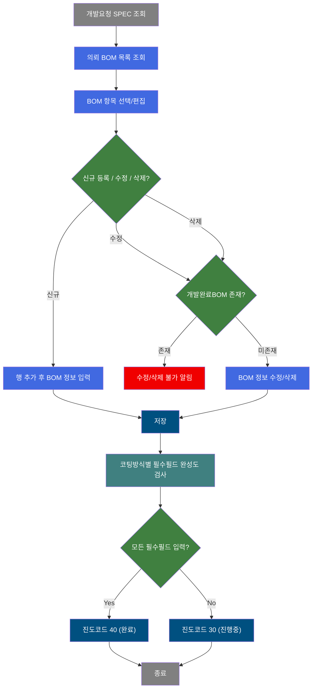
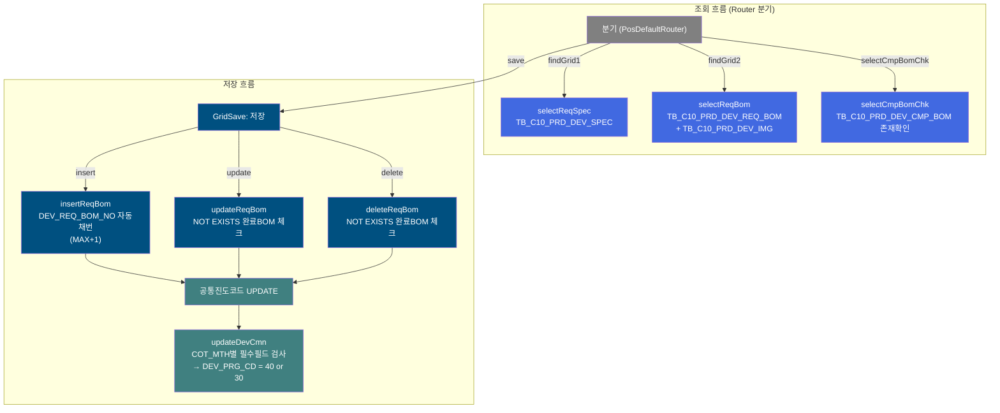
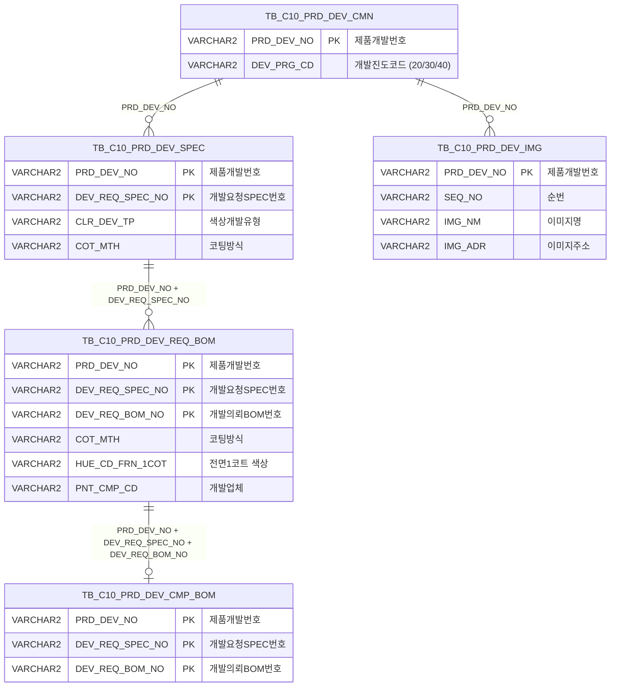

<h1 style="font-size: 40px; text-align: center; font-weight:
   bold; margin: 30px 0;">
  C108000090 레거시 시스템 분석 종합 보고서
</h1>


# 1. 시스템 개요
- **서비스 ID**: C108000090
- **업무명**: 개발의뢰 BOM
- **분석 일시**: 2026-03-17 09:42 KST
- **분석 시간**: ~5분
- **전체 Activity 수**: 6개
- **분석자**: Claude Opus 4.6
- **분석 도구**: /analyze-service C108000090
- **문서 버전**: 1.0

# 📊 비즈니스 프로세스 분석

## 시스템 목적

CCL(Color Coating Line) 제품개발 프로세스에서 **개발의뢰 BOM(Bill of Materials)**을 관리하는 화면이다. 제품개발 담당자가 개발요청 SPEC(사양)에 대한 코팅 BOM 정보(색상코드, 프린트 롤/잉크, 라미네이션, 수지 등)를 등록·수정·삭제할 수 있다.

핵심 비즈니스 규칙은 **코팅방식(COT_MTH)**에 따라 필수 입력 필드가 달라지는 것이다. 단면 1코트(COT_MTH='1')부터 양면 4코트+프린트(COT_MTH='F'~'J'), 라미네이션(COT_MTH='X'/'Y'/'Z')까지 18가지 코팅방식별로 색상코드, 프린트, 롤 정보 등의 필수 조합이 다르며, 모든 필수 필드가 채워지면 개발진도코드(DEV_PRG_CD)가 자동으로 '30'(진행중)에서 '40'(완료)으로 갱신된다.

또한, 개발완료BOM(TB_C10_PRD_DEV_CMP_BOM)이 이미 존재하는 의뢰BOM은 수정·삭제가 불가능하여, 확정 이후 데이터 무결성을 보호한다.

## 핵심 워크플로우 다이어그램



### 상세 워크플로우 다이어그램



## 주요 유즈케이스

### UC-01: 개발요청 SPEC 기반 의뢰 BOM 조회
- **Actor**: 제품개발 담당자 (품질설계팀)
- **목적**: 특정 제품개발번호의 SPEC 목록과 각 SPEC에 연결된 의뢰 BOM 정보를 조회하여 현재 BOM 등록 상태를 파악

- **전제조건**:
  - 제품개발번호(PRD_DEV_NO)가 이미 발번되어 있음
  - 개발요청 SPEC(TB_C10_PRD_DEV_SPEC)이 등록되어 있음

- **주요 흐름**:
  1. 사용자가 Form_1에 개발번호(PRD_DEV_NO)를 입력하고 조회 버튼 클릭
  2. Grid_1에 해당 개발번호의 SPEC 목록이 표시됨 (selectReqSpec 쿼리 - 개발유형, 품명, 코팅방식, 수지, 무독성구분 등)
  3. Grid_1에서 특정 SPEC 행을 선택하면 Form_2에 SPEC 상세 정보가 자동 바인딩됨
  4. 선택된 SPEC의 의뢰 BOM 목록이 Grid_2에 로드됨 (selectReqBom 쿼리 - 색상코드, 프린트 롤/잉크, 라미나 등)
  5. Grid_2에서 BOM 행 선택 시 Form_3에 BOM 상세 정보가 바인딩됨

- **대체 흐름**:
  - 개발번호 미입력 시: "개발번호를 입력하세요" 알림
  - SPEC이 없는 경우: Grid_1 빈 목록 표시
  - URL 파라미터로 PRD_DEV_NO, DEV_REQ_SPEC_NO가 전달된 경우: 자동으로 폼에 값 세팅 후 조회 실행

- **후행조건**:
  - Grid_1에 SPEC 목록, Grid_2에 의뢰 BOM 목록이 표시됨
  - 사용자가 BOM 추가/수정/삭제 작업을 수행할 수 있는 상태

### UC-02: 의뢰 BOM 신규 등록
- **Actor**: 제품개발 담당자
- **목적**: 특정 SPEC에 대한 새로운 코팅 BOM을 등록하여 CCL 생산에 필요한 도료·롤·잉크 정보를 확정

- **전제조건**:
  - Grid_1에서 SPEC이 선택되어 있음
  - 해당 SPEC에 대한 의뢰 BOM 추가 권한이 있음

- **주요 흐름**:
  1. Menu_1에서 "행추가" 클릭 → Grid_2에 신규 행 추가
  2. Form_3가 unlock되어 편집 가능 상태로 전환
  3. 코팅방식(COT_MTH) 콤보에서 코팅방식 선택 → onFormCotMthEnable에 의해 해당 코팅방식에 맞는 필드만 활성화
  4. 활성화된 필드에 색상코드(TOP/Back), 프린트 롤/잉크, 라미나 정보 등을 입력
  5. 개발업체(PNT_CMP_CD), 수지(RSN_TP), 라미나 개발업체(LMN_BND_CMP_CD) 등은 마스터 팝업으로 선택
  6. 저장 버튼 클릭 → insertReqBom 실행 (DEV_REQ_BOM_NO 자동채번: MAX+1, 기본값 21부터)
  7. 저장 후 updateDevCmn이 자동 실행되어 COT_MTH별 필수필드 완성도에 따라 진도코드(DEV_PRG_CD) 갱신

- **대체 흐름**:
  - Grid_1에서 SPEC 미선택 시: "개발요청SPEC을 먼저 선택하세요" 알림
  - 디자인 시안 첨부: 디자인 시안 아이콘 클릭 → C108000010pop02.jsp 팝업에서 이미지 등록

- **후행조건**:
  - 의뢰 BOM이 TB_C10_PRD_DEV_REQ_BOM에 등록됨
  - 필수필드 완성 시 DEV_PRG_CD가 '40'으로 갱신됨
  - Grid_2가 자동 재조회됨

### UC-03: 의뢰 BOM 수정
- **Actor**: 제품개발 담당자
- **목적**: 기존 의뢰 BOM의 코팅 정보를 변경 (개발완료BOM 확정 전까지만 가능)

- **전제조건**:
  - Grid_2에서 기존 BOM 행이 선택되어 있음
  - 해당 BOM에 대한 개발완료BOM(TB_C10_PRD_DEV_CMP_BOM)이 존재하지 않음

- **주요 흐름**:
  1. Grid_2에서 기존 BOM 행 선택 → Form_3이 lock 상태로 표시
  2. Menu_1에서 "편집" 클릭 → Form_3 unlock, onFormCotMthEnable 호출로 활성 필드 설정
  3. 필요한 필드 값 수정
  4. 저장 버튼 클릭
  5. 저장 전 c10AjaxData.do로 selectCmpBomChk 호출하여 개발완료BOM 존재 여부 확인
  6. DEV_CMP_BOM_YN = 'N'이면 updateReqBom 실행 (NOT EXISTS 조건으로 이중 보호)
  7. 저장 후 updateDevCmn 자동 실행

- **대체 흐름**:
  - 개발완료BOM 존재(DEV_CMP_BOM_YN = 'Y') 시: 저장 불가 알림 표시

- **후행조건**:
  - BOM 정보가 갱신됨
  - 진도코드가 필수필드 완성도에 따라 재계산됨

### UC-04: 의뢰 BOM 삭제
- **Actor**: 제품개발 담당자
- **목적**: 불필요한 의뢰 BOM을 삭제 (개발완료BOM 확정 전까지만 가능)

- **전제조건**:
  - Grid_2에서 BOM 행이 선택되어 있음
  - 해당 BOM에 대한 개발완료BOM이 존재하지 않음

- **주요 흐름**:
  1. Grid_2에서 삭제할 BOM 행 선택
  2. Menu_1에서 "삭제" 클릭 → 행 삭제 표시
  3. 저장 버튼 클릭
  4. selectCmpBomChk로 개발완료BOM 존재 여부 확인
  5. DEV_CMP_BOM_YN = 'N'이면 deleteReqBom 실행 (NOT EXISTS 이중 보호)
  6. 저장 후 updateDevCmn 자동 실행

- **대체 흐름**:
  - 개발완료BOM 존재 시: 삭제 불가 알림
  - 행복사(copy) 기능으로 기존 BOM을 복제하여 변형 등록 가능

- **후행조건**:
  - 의뢰 BOM이 삭제됨
  - 진도코드가 재계산됨

---

## 비즈니스 로직 상세

### 1. 코팅방식(COT_MTH)별 필수필드 완성도 검사 (updateDevCmn)

- **목적**: 의뢰 BOM 저장 시 코팅방식에 따른 필수 필드의 입력 완성도를 자동 검사하여, 모든 필수 항목이 채워졌을 때 개발진도를 '완료(40)'로 자동 갱신

- **처리 케이스**:

  **[케이스 1: 단면 코팅 (COT_MTH = '1')]**
  ```
    조건: COT_MTH = '1' (단면 1코트)
    필수 필드:
      - TOP: HUE_CD_FRN_1COT (전면 1코트 색상)
      - 롤: UNI_TEX_ROLL_NO, PICK_UP_ROLL_NO, IMPT_ROLL_NO
      - 기타: SIM_HUE_PRG_YN, PNT_CMP_CD, RSN_TP, TLP_TP, RL_LUS_RT, PNT_FLM_THK_TXT
    결과: 모든 필드 NOT NULL → DEV_PRG_CD = '40'
  ```

  **[케이스 2: 양면 코팅 (COT_MTH = '2')]**
  ```
    조건: COT_MTH = '2' (양면 1코트)
    추가 필수 필드: HUE_CD_FRN_1COT + HUE_CD_BAK_1COT (전면+후면 각 1코트)
    나머지: 케이스 1과 동일한 롤/기타 필드
  ```

  **[케이스 3: 다단 코팅 (COT_MTH = '3'~'9')]**
  ```
    조건: COT_MTH = '3'~'9' (전면 2~3코트 + 후면 0~3코트 조합)
    패턴: COT_MTH 숫자가 증가할수록 필수 색상코드 수 증가
      - '3': 전면 2코트 (FRN_1COT, FRN_2COT)
      - '4': 전면 2코트 + 후면 1코트
      - '5': 전면 2코트 + 후면 2코트
      - '6': 전면 3코트
      - '7': 전면 3코트 + 후면 1코트
      - '8': 전면 3코트 + 후면 2코트
      - '9': 전면 3코트 + 후면 3코트
  ```

  **[케이스 4: 전면 4코트 (COT_MTH = 'A'~'E')]**
  ```
    조건: COT_MTH = 'A'~'E'
    패턴: 전면 4코트(FRN_1~4COT) + 후면 코트 수 증가
      - 'A': 전면 4코트
      - 'B': 전면 4코트 + 후면 1코트
      - 'C': 전면 4코트 + 후면 2코트
      - 'D': 전면 4코트 + 후면 3코트
      - 'E': 전면 4코트 + 후면 4코트
  ```

  **[케이스 5: 프린트 포함 코팅 (COT_MTH = 'F'~'J')]**
  ```
    조건: COT_MTH = 'F'~'J'
    추가 필수 필드: 전면4코트 + 후면4코트 + 프린트 롤/잉크 + PRT_BY_ROLL_CMP_CD
      - 'F': 프린트 1~4도 전체 (PRT_ROLL_NO1~4, PRT_INK_CD1~4)
      - 'G': 프린트 2~4도 (PRT_ROLL_NO2~4, PRT_INK_CD2~4)
      - 'H': 프린트 3~4도 (PRT_ROLL_NO3~4, PRT_INK_CD3~4)
      - 'J': 프린트 4도만 (PRT_ROLL_NO4, PRT_INK_CD4)
  ```

  **[케이스 6: 라미네이션 (COT_MTH = 'X', 'Y', 'Z')]**
  ```
    조건: COT_MTH IN ('X','Y','Z')
    필수 필드 (도장과 상이):
      - 후면: HUE_CD_BAK_1~4COT
      - 라미나: HUE_CD_LMN, LMN_BND_CMP_CD, LMN_KND_TP, LMN_FLM_THK
      - 롤: UNI_TEX_ROLL_NO, PICK_UP_ROLL_NO, IMPT_ROLL_NO
      - 기타: SIM_HUE_PRG_YN, PNT_CMP_CD, TLP_TP, RL_LUS_RT
    주의: RSN_TP(수지)와 PNT_FLM_THK_TXT(도막두께) 불필요, 대신 라미나 관련 필드 필수
  ```

- **진도코드 갱신 규칙**:
  ```
  해당 PRD_DEV_NO의 모든 의뢰 BOM이 각자의 COT_MTH별 필수필드를 모두 충족:
    → DEV_PRG_CD = '40' (BOM 입력 완료)
  하나라도 미충족:
    → DEV_PRG_CD = '30' (BOM 입력 중)
  적용 대상: DEV_PRG_CD IN ('20', '30') 상태의 건만 갱신
  ```

### 2. 개발완료BOM 존재 시 수정/삭제 방어 로직

- **목적**: 개발완료 단계에서 확정된 BOM이 있는 경우, 의뢰 BOM의 변경을 차단하여 데이터 정합성 보호
- **처리 케이스**:

  **[케이스 1: 저장 전 사전 검증 (JavaScript)]**
  ```
    조건: Grid_2에서 updated/deleted 상태의 행이 있을 때
    처리:
      1. c10AjaxData.do로 selectCmpBomChk 호출
      2. DEV_CMP_BOM_YN = 'Y' 반환 시 → 저장 차단, 알림 표시
      3. DEV_CMP_BOM_YN = 'N' 반환 시 → 저장 진행
  ```

  **[케이스 2: SQL 레벨 이중 방어]**
  ```
    조건: updateReqBom / deleteReqBom 실행 시
    처리:
      1. NOT EXISTS (SELECT 'X' FROM TB_C10_PRD_DEV_CMP_BOM CB ...) 조건 포함
      2. 완료BOM이 존재하면 WHERE 조건 불일치로 UPDATE/DELETE 실행되지 않음
      3. JavaScript 검증 우회 시에도 데이터 보호
  ```

### 3. BOM 번호 자동채번 로직

- **목적**: 의뢰 BOM 신규 등록 시 BOM 번호를 자동으로 순차 발번
- **계산 공식**:
  ```
  DEV_REQ_BOM_NO = TO_CHAR(TO_NUMBER(NVL(MAX(DEV_REQ_BOM_NO), '20')) + 1)

  예시:
  - 기존 BOM 없음: MAX = NULL → NVL('20') → 20 + 1 = '21' (첫 번째 BOM)
  - 기존 BOM '21', '22' 존재: MAX = '22' → 22 + 1 = '23'
  ```

### 4. 코드값 → 의미명 변환 (selectReqSpec)

- **목적**: SPEC 조회 시 코드값을 사용자가 이해할 수 있는 의미명으로 변환하여 표시
- **처리 케이스**:

  **[케이스 1: 개발유형 변환 (DECODE)]**
  ```
    CLR_DEV_TP: 'D' → '디자인', 'C' → '색상'
  ```

  **[케이스 2: 스칼라 서브쿼리 코드명 조회]**
  ```
    PRD_NM_CD → VI_M00_CODE_ACCESS (CD_TP='PRD_NM_CD', CATEGORY_GROUP_NM='SZ0000')
    TLP_TP → VI_M00_CODE_ACCESS (CD_TP='TLP_TP')
    DEV_REF_TP → VI_M00_CODE_ACCESS (CD_TP IN ('DEV_REF_TP_CLR','DEV_REF_TP_DESN'))
  ```

  **[케이스 3: 코드+명칭 결합 표시]**
  ```
    COT_MTH: SP.COT_MTH || '-' || (코드명 서브쿼리)
    예시: '1-단면1코트', 'F-양면4코트+프린트4도'
  ```

---

# 💾 데이터 요구사항

## 핵심 테이블

### 1. TB_C10_PRD_DEV_REQ_BOM - (제품개발 의뢰 BOM)
| 컬럼명 | 타입 | PK | 설명 |
|--------|------|----|------|
| PRD_DEV_NO | VARCHAR2 | ✅ | 제품개발번호 |
| DEV_REQ_SPEC_NO | VARCHAR2 | ✅ | 개발요청SPEC번호 |
| DEV_REQ_BOM_NO | VARCHAR2 | ✅ | 개발의뢰BOM번호 (자동채번, '21'부터) |
| HUE_CD_FRN_1COT | VARCHAR2 | | 전면 1코트 색상코드 |
| HUE_CD_FRN_2COT | VARCHAR2 | | 전면 2코트 색상코드 |
| HUE_CD_FRN_3COT | VARCHAR2 | | 전면 3코트 색상코드 |
| HUE_CD_FRN_4COT | VARCHAR2 | | 전면 4코트 색상코드 |
| HUE_CD_BAK_1COT | VARCHAR2 | | 후면 1코트 색상코드 |
| HUE_CD_BAK_2COT | VARCHAR2 | | 후면 2코트 색상코드 |
| HUE_CD_BAK_3COT | VARCHAR2 | | 후면 3코트 색상코드 |
| HUE_CD_BAK_4COT | VARCHAR2 | | 후면 4코트 색상코드 |
| HUE_CD_LMN | VARCHAR2 | | 라미네이션 색상코드 |
| PRT_ROLL_NO1~4 | VARCHAR2 | | 프린트 1~4도 롤번호 |
| PRT_INK_CD1~4 | VARCHAR2 | | 프린트 1~4도 잉크코드 |
| UNI_TEX_ROLL_NO | VARCHAR2 | | 유니텍스 롤번호 |
| PICK_UP_ROLL_NO | VARCHAR2 | | 픽업 롤번호 |
| IMPT_ROLL_NO | VARCHAR2 | | 임프린트 롤번호 |
| SIM_HUE_PRG_YN | VARCHAR2 | | 유사색상 적용가능여부 (Y/N) |
| PNT_CMP_CD | VARCHAR2 | | 페인트 개발업체코드 |
| COT_MTH | VARCHAR2 | | 코팅방식 (1~9, A~J, X/Y/Z) |
| RSN_TP | VARCHAR2 | | 수지타입 |
| TLP_TP | VARCHAR2 | | 무독성구분 |
| RL_LUS_RT | VARCHAR2 | | 실광택값 |
| PNT_FLM_THK_TXT | VARCHAR2 | | 도막두께 텍스트 |
| LMN_BND_CMP_CD | VARCHAR2 | | 라미나 접착제 개발업체코드 |
| LMN_KND_TP | VARCHAR2 | | 라미나유형 |
| LMN_FLM_THK | NUMBER | | 라미나 필름두께 |
| DSN_SIM_FILE | VARCHAR2 | | 디자인 시뮬레이션 파일 |
| PRT_BY_ROLL_CMP_CD | VARCHAR2 | | 프린트 베이비롤 제작업체코드 |
| SPC_PRD_AF_WK | VARCHAR2 | | 특수제품 후처리작업 |
| CREATED_OBJECT_TYPE | VARCHAR2 | | 생성자 객체유형 |
| CREATED_OBJECT_ID | VARCHAR2 | | 생성자 객체ID |
| CREATED_PROGRAM_ID | VARCHAR2 | | 생성 프로그램ID |
| CREATION_TIMESTAMP | DATE | | 생성 타임스탬프 |
| LAST_UPDATED_OBJECT_TYPE | VARCHAR2 | | 최종수정자 객체유형 |
| LAST_UPDATED_OBJECT_ID | VARCHAR2 | | 최종수정자 객체ID |
| LAST_UPDATE_PROGRAM_ID | VARCHAR2 | | 최종수정 프로그램ID |
| LAST_UPDATE_TIMESTAMP | DATE | | 최종수정 타임스탬프 |

### 2. TB_C10_PRD_DEV_SPEC - (제품개발 SPEC)
| 컬럼명 | 타입 | PK | 설명 |
|--------|------|----|------|
| PRD_DEV_NO | VARCHAR2 | ✅ | 제품개발번호 |
| DEV_REQ_SPEC_NO | VARCHAR2 | ✅ | 개발요청SPEC번호 |
| CLR_DEV_TP | VARCHAR2 | | 색상개발유형 ('D'=디자인, 'C'=색상) |
| PRD_NM_CD | VARCHAR2 | | 품명코드 |
| CUS_REQ_HUE_TXT | VARCHAR2 | | 고객요청 색상명 |
| COT_MTH | VARCHAR2 | | 코팅방식 |
| RSN_TP | VARCHAR2 | | 수지타입 |
| TLP_TP | VARCHAR2 | | 무독성구분 |
| RL_LUS_RT | VARCHAR2 | | 실광택값 |
| PNT_FLM_THK_TXT | VARCHAR2 | | 도막두께 |
| PTT_FLM_YN | VARCHAR2 | | 보호필름 유무 |
| ORD_PRE_WGT | VARCHAR2 | | 예상수주량 |
| DEV_REF_TP | VARCHAR2 | | 개발참조유형 |
| REF_CLR_CD_TXT | VARCHAR2 | | 참조 칼라코드 |
| REF_CCL_BOM | VARCHAR2 | | 참조 CCL BOM |
| SIM_HUE_PRG_YN | VARCHAR2 | | 유사색상 적용가능여부 |

### 3. TB_C10_PRD_DEV_CMN - (제품개발 공통)
| 컬럼명 | 타입 | PK | 설명 |
|--------|------|----|------|
| PRD_DEV_NO | VARCHAR2 | ✅ | 제품개발번호 |
| DEV_PRG_CD | VARCHAR2 | | 개발진도코드 ('20'=SPEC입력, '30'=BOM입력중, '40'=BOM완료) |
| LAST_UPDATED_OBJECT_TYPE | VARCHAR2 | | 최종수정자 객체유형 |
| LAST_UPDATED_OBJECT_ID | VARCHAR2 | | 최종수정자 객체ID |
| LAST_UPDATE_PROGRAM_ID | VARCHAR2 | | 최종수정 프로그램ID |
| LAST_UPDATE_TIMESTAMP | DATE | | 최종수정 타임스탬프 |

### 4. TB_C10_PRD_DEV_CMP_BOM - (제품개발 완료 BOM)
| 컬럼명 | 타입 | PK | 설명 |
|--------|------|----|------|
| PRD_DEV_NO | VARCHAR2 | ✅ | 제품개발번호 |
| DEV_REQ_SPEC_NO | VARCHAR2 | ✅ | 개발요청SPEC번호 |
| DEV_REQ_BOM_NO | VARCHAR2 | ✅ | 개발의뢰BOM번호 |

### 5. TB_C10_PRD_DEV_IMG - (제품개발 이미지)
| 컬럼명 | 타입 | PK | 설명 |
|--------|------|----|------|
| PRD_DEV_NO | VARCHAR2 | ✅ | 제품개발번호 (복합키의 일부로 사용) |
| SEQ_NO | VARCHAR2 | | 순번 |
| IMG_NM | VARCHAR2 | | 이미지명 |
| IMG_ADR | VARCHAR2 | | 이미지주소 |

### 6. VI_M00_CODE_ACCESS - (공통코드 뷰, M00APUSER)
| 컬럼명 | 타입 | PK | 설명 |
|--------|------|----|------|
| CD_TP | VARCHAR2 | | 코드유형 (PRD_NM_CD, COT_MTH, TLP_TP, DEV_REF_TP_CLR 등) |
| CATEGORY_GROUP_NM | VARCHAR2 | | 카테고리그룹명 ('SZ0000') |
| CD_V | VARCHAR2 | | 코드값 |
| CD_V_MEANING | VARCHAR2 | | 코드 의미명 |

## 데이터 플로우

### 1. 조회
```
[SPEC 목록 조회]
화면 진입 → Form_1에 PRD_DEV_NO 입력 → 조회 버튼 클릭
→ selectReqSpec
  FROM C10APUSER.TB_C10_PRD_DEV_SPEC SP
  스칼라 서브쿼리: M00APUSER.VI_M00_CODE_ACCESS (PRD_NM_CD, COT_MTH, TLP_TP, DEV_REF_TP 코드명 변환)
  WHERE SP.PRD_DEV_NO = :PRD_DEV_NO
    AND SP.DEV_REQ_SPEC_NO = NVL(:DEV_REQ_SPEC_NO, SP.DEV_REQ_SPEC_NO)
→ Grid_1에 SPEC 목록 표시

[의뢰 BOM 목록 조회]
Grid_1에서 SPEC 행 선택
→ selectReqBom
  FROM C10APUSER.TB_C10_PRD_DEV_REQ_BOM BM
  LEFT JOIN (TB_C10_PRD_DEV_IMG 서브쿼리 - MAX 집계) IMG
    ON BM.PRD_DEV_NO||BM.DEV_REQ_SPEC_NO||BM.DEV_REQ_BOM_NO = IMG.PRD_DEV_NO (+)
  WHERE BM.PRD_DEV_NO = :PRD_DEV_NO
    AND BM.DEV_REQ_SPEC_NO = :DEV_REQ_SPEC_NO
→ Grid_2에 BOM 목록 표시 (이미지 존재여부 FILE_YN 포함)
```

### 2. 저장 (신규/수정/삭제)
```
[사전 검증 - 수정/삭제 시]
저장 버튼 클릭 → updated/deleted 행에 대해
→ selectCmpBomChk (c10AjaxData.do)
  FROM DUAL, C10APUSER.TB_C10_PRD_DEV_CMP_BOM (서브쿼리)
  WHERE PRD_DEV_NO = :PRD_DEV_NO AND DEV_REQ_SPEC_NO = :DEV_REQ_SPEC_NO AND DEV_REQ_BOM_NO = :DEV_REQ_BOM_NO
→ DEV_CMP_BOM_YN = 'Y'이면 저장 차단

[신규 등록]
→ insertReqBom
  INSERT INTO C10APUSER.TB_C10_PRD_DEV_REQ_BOM
  DEV_REQ_BOM_NO = MAX(기존) + 1 (서브쿼리 자동채번)

[수정]
→ updateReqBom
  UPDATE C10APUSER.TB_C10_PRD_DEV_REQ_BOM RB
  WHERE PK 조건 AND NOT EXISTS (완료BOM 존재 체크)

[삭제]
→ deleteReqBom
  DELETE C10APUSER.TB_C10_PRD_DEV_REQ_BOM RB
  WHERE PK 조건 AND NOT EXISTS (완료BOM 존재 체크)

[진도코드 자동 갱신 - 저장 후]
→ updateDevCmn
  UPDATE C10APUSER.TB_C10_PRD_DEV_CMN
  SET DEV_PRG_CD = CASE WHEN (COT_MTH별 필수필드 전부 NOT NULL) THEN '40' ELSE '30' END
  WHERE PRD_DEV_NO = :PRD_DEV_NO AND DEV_PRG_CD IN ('20','30')
```

## SQL 일람표
| SQL 이름 | 쿼리 ID | 타입 | 출처 | 테이블 |
|---------|---------|-----|------|-------|
| 제품개발요청Spec 조회 | C108000090.selectReqSpec | SELECT | Service | TB_C10_PRD_DEV_SPEC, VI_M00_CODE_ACCESS |
| 제품개발의뢰BOM 조회 | C108000090.selectReqBom | SELECT | Service | TB_C10_PRD_DEV_REQ_BOM, TB_C10_PRD_DEV_IMG |
| 개발완료BOM 존재확인 | C108000090.selectCmpBomChk | SELECT | Service | DUAL, TB_C10_PRD_DEV_CMP_BOM |
| 의뢰BOM 신규등록 | C108000090.insertReqBom | INSERT | Service | TB_C10_PRD_DEV_REQ_BOM |
| 의뢰BOM 수정 | C108000090.updateReqBom | UPDATE | Service | TB_C10_PRD_DEV_REQ_BOM, TB_C10_PRD_DEV_CMP_BOM |
| 의뢰BOM 삭제 | C108000090.deleteReqBom | DELETE | Service | TB_C10_PRD_DEV_REQ_BOM, TB_C10_PRD_DEV_CMP_BOM |
| 공통진도코드 수정 | C108000090.updateDevCmn | UPDATE | Service | TB_C10_PRD_DEV_CMN, TB_C10_PRD_DEV_REQ_BOM |

## ER 다이어그램 (핵심 관계)



관계 설명:
- **TB_C10_PRD_DEV_CMN**이 중심 테이블로 제품개발 건의 전체 진도를 관리
- **TB_C10_PRD_DEV_SPEC**: PRD_DEV_NO로 1:N 관계 (하나의 개발 건에 여러 SPEC)
- **TB_C10_PRD_DEV_REQ_BOM**: PRD_DEV_NO + DEV_REQ_SPEC_NO로 1:N 관계 (하나의 SPEC에 여러 의뢰 BOM)
- **TB_C10_PRD_DEV_CMP_BOM**: 의뢰 BOM과 1:0..1 관계 (완료 BOM은 의뢰 BOM 확정 시에만 존재)
- **TB_C10_PRD_DEV_IMG**: PRD_DEV_NO 기반 이미지 (selectReqBom에서 문자열 결합으로 조인)

---

# 🖥️ 사용자 인터페이스 요구사항

## 화면 레이아웃 상세

### Layout 구조 (initLayout)
```javascript
{
  itemType: "layout",
  dirType: "row",        // 수직 분할
  childSize: "35,*",     // 상단 35px, 하단 나머지
  components: [
    {
      id: "form_area",
      height: "35px",
      component: {
        itemType: "form",
        formId: "C108000090_Form_1"    // 조회조건 + 버튼
      }
    },
    {
      id: "main_area",
      height: "*",
      component: {
        itemType: "layout",
        dirType: "col",                 // 좌우 분할
        childSize: "40%,*",
        splitter: true,
        components: [
          {
            id: "left_panel",
            header: "[개발요청 Spec]",
            component: {
              itemType: "layout",
              dirType: "row",
              childSize: "*,140",
              splitter: true,
              components: [
                { itemType: "grid", gridId: "C108000090_Grid_1" },   // SPEC 목록
                { itemType: "form", formId: "C108000090_Form_2" }    // SPEC 상세 (읽기전용)
              ]
            }
          },
          {
            id: "right_panel",
            header: "[개발의뢰 BOM]",
            component: {
              itemType: "layout",
              dirType: "row",
              childSize: "*,300",
              splitter: true,
              components: [
                { itemType: "grid", gridId: "C108000090_Grid_2" },   // BOM 목록
                { itemType: "form", formId: "C108000090_Form_3" }    // BOM 상세 편집
              ]
            }
          }
        ]
      }
    }
  ]
}
```

## 입출력 요소

### Form 컴포넌트

**C108000090_Form_1** (조회 조건)
- PRD_DEV_NO: input - 개발번호 (labelWidth:75, inputWidth:100)
- DEV_REQ_SPEC_NO: input - SPEC번호 (labelWidth:75, inputWidth:100)
- find: Button - 조회 (초기 disabled)
- save: Button - 저장 (초기 disabled)
- winClose: Button - 닫기

**C108000090_Form_2** (SPEC 상세, 읽기전용, Grid_1에 bind)
- DEV_REQ_SPEC_NO: input(readonly) - SPEC번호
- CLR_DEV_TP: input(readonly) - 개발유형
- PRD_NM_CD: input(readonly) - 품명
- CUS_REQ_HUE_TXT: input(readonly) - 고객정의품명(색상명)
- COT_MTH: input(readonly) - 코팅방식
- RSN_TP: input(readonly) - 수지
- TLP_TP: input(readonly) - 무독성구분
- RL_LUS_RT: input(readonly) - 실광택값
- PNT_FLM_THK_TXT: input(readonly) - 도막두께
- PTT_FLM_YN: input(readonly) - 보호필름 유무
- ORD_PRE_WGT: input(readonly) - 예상수주량
- DEV_REF_TP: input(readonly) - 개발참조유형
- REF_CLR_CD_TXT: input(readonly) - 참조 칼라코드
- REF_CCL_BOM: input(readonly) - 참조 CCLBOM
- SIM_HUE_PRG_YN: input(readonly) - 유사색상적용가능여부
- PRD_DEV_NO: hidden - 개발번호

**C108000090_Form_3** (BOM 상세 편집, Grid_2에 bind, COT_MTH에 따라 동적 활성화)
- BLOCK1: DEV_REQ_BOM_NO(readonly), PNT_CMP_CD(마스터팝업), COT_MTH(콤보 SZ0000/COT_MTH), PRD_DEV_NO(hidden), DEV_REQ_SPEC_NO(hidden)
- BLOCK2: HUE_CD_FRN_1COT(TOP 1C), HUE_CD_FRN_2COT(TOP 2C), HUE_CD_FRN_3COT(TOP 3C), HUE_CD_FRN_4COT(TOP 4C)
- BLOCK3: HUE_CD_BAK_1COT(Back 1C), HUE_CD_BAK_2COT(Back 2C), HUE_CD_BAK_3COT(Back 3C), HUE_CD_BAK_4COT(Back 4C)
- BLOCK4: PRT_ROLL_NO1~4 (프린트 1~4도 Roll)
- BLOCK5: PRT_INK_CD1~4 (프린트 1~4도 Ink)
- BLOCK6: HUE_CD_LMN(라미나), UNI_TEX_ROLL_NO(U-TEX Roll), PICK_UP_ROLL_NO(PICK-UP Roll), IMPT_ROLL_NO(IMPRINT Roll)
- BLOCK7: SIM_HUE_PRG_YN(콤보 Y/N), RSN_TP(마스터팝업), TLP_TP(콤보 SZ0000/TLP_TP)
- BLOCK8: RL_LUS_RT, LMN_FLM_THK, LMN_KND_TP(콤보 SZ0000/LMN_KND_TP), LMN_BND_CMP_CD(마스터팝업)
- BLOCK9: PNT_FLM_THK_TXT, FILE_YN(디자인시안 팝업 아이콘), PRT_BY_ROLL_CMP_CD(마스터팝업), SPC_PRD_AF_WK

### Grid 컴포넌트

**C108000090_Grid_1 (개발요청 SPEC 목록)**
- 편집 가능 여부: 아니오 (읽기 전용)
- Split: 없음
- colwidth: %
- 주요 컬럼 (16개):

  **숨김 컬럼**:
  - PRD_DEV_NO: ro - 제품개발번호 (12%, 좌측정렬, 숨김)

  **SPEC 기본 정보**:
  - DEV_REQ_SPEC_NO: ro - 개발요청 SPEC번호 (8%, 좌측정렬)
  - CLR_DEV_TP: ro - 개발유형 (10%, 좌측정렬)
  - PRD_NM_CD: ro - 품명 (12%, 좌측정렬)
  - CUS_REQ_HUE_TXT: ro - 고객정의품명(색상명) (15%, 좌측정렬)

  **코팅/수지 정보**:
  - COT_MTH: ro - 코팅방식 (10%, 좌측정렬)
  - RSN_TP: ro - 수지 (8%, 좌측정렬)
  - TLP_TP: ro - 무독성구분 (12%, 좌측정렬)

  **물성 정보**:
  - RL_LUS_RT: ro - 실광택값 (12%, 좌측정렬)
  - PNT_FLM_THK_TXT: ro - 도막두께 (12%, 좌측정렬)
  - PTT_FLM_YN: ro - 보호필름 유무 (12%, 좌측정렬)
  - ORD_PRE_WGT: ro - 예상수주량 (12%, 좌측정렬)

  **참조 정보**:
  - DEV_REF_TP: ro - 개발참조 유형 (12%, 좌측정렬)
  - REF_CLR_CD_TXT: ro - 참조 칼라코드 (15%, 좌측정렬)
  - REF_CCL_BOM: ro - 참조 CCLBOM (12%, 좌측정렬)
  - SIM_HUE_PRG_YN: ro - 유사색상 적용가능여부 (12%, 좌측정렬)

**C108000090_Grid_2 (개발의뢰 BOM 목록)**
- 편집 가능 여부: 예 (Form_3 통해 편집, 컨텍스트 메뉴 사용)
- contextmenu: Menu_1 연결
- Split: 없음
- colwidth: %
- 주요 컬럼 (37개):

  **숨김 컬럼**:
  - PRD_DEV_NO: ro - 제품개발번호 (12%, 좌측정렬, 숨김)
  - DEV_REQ_SPEC_NO: ro - 개발요청SPEC번호 (12%, 좌측정렬, 숨김)
  - IMG_NM: ro - 이미지명 (12%, 좌측정렬, 숨김)

  **BOM 기본 정보**:
  - DEV_REQ_BOM_NO: ro - 개발의뢰BOM번호 (12%, 좌측정렬)

  **전면(TOP) 색상코드**:
  - HUE_CD_FRN_1COT: ro - TOP 1C (12%, 좌측정렬)
  - HUE_CD_FRN_2COT: ro - TOP 2C (12%, 좌측정렬)
  - HUE_CD_FRN_3COT: ro - TOP 3C (12%, 좌측정렬)
  - HUE_CD_FRN_4COT: ro - TOP 4C (12%, 좌측정렬)

  **후면(Back) 색상코드**:
  - HUE_CD_BAK_1COT: ro - Back 1C (12%, 좌측정렬)
  - HUE_CD_BAK_2COT: ro - Back 2C (12%, 좌측정렬)
  - HUE_CD_BAK_3COT: ro - Back 3C (12%, 좌측정렬)
  - HUE_CD_BAK_4COT: ro - Back 4C (12%, 좌측정렬)

  **라미나/롤 정보**:
  - HUE_CD_LMN: ro - 라미나 (12%, 좌측정렬)
  - UNI_TEX_ROLL_NO: ro - U-TEX Roll (12%, 좌측정렬)
  - PICK_UP_ROLL_NO: ro - PICK-UP Roll (12%, 좌측정렬)
  - IMPT_ROLL_NO: ro - IMPRINT Roll (12%, 좌측정렬)

  **프린트 정보**:
  - PRT_ROLL_NO1: ro - Print1도 Roll (12%, 좌측정렬)
  - PRT_INK_CD1: ro - Print1도 Ink (12%, 좌측정렬)
  - PRT_ROLL_NO2: ro - Print2도 Roll (12%, 좌측정렬)
  - PRT_INK_CD2: ro - Print2도 Ink (12%, 좌측정렬)
  - PRT_ROLL_NO3: ro - Print3도 Roll (12%, 좌측정렬)
  - PRT_INK_CD3: ro - Print3도 Ink (12%, 좌측정렬)
  - PRT_ROLL_NO4: ro - Print4도 Roll (12%, 좌측정렬)
  - PRT_INK_CD4: ro - Print4도 Ink (12%, 좌측정렬)

  **기타 정보**:
  - SIM_HUE_PRG_YN: ro - 유사색상 적용여부 (12%, 좌측정렬)
  - PNT_CMP_CD: ro - 개발업체 (12%, 좌측정렬)
  - COT_MTH: ro - 코팅방식 (12%, 좌측정렬)
  - RSN_TP: ro - 수지 (12%, 좌측정렬)
  - TLP_TP: ro - 무독성구분 (12%, 좌측정렬)
  - RL_LUS_RT: ro - 실광택값 (12%, 좌측정렬)
  - PNT_FLM_THK_TXT: ro - 도막두께 (12%, 좌측정렬)
  - LMN_BND_CMP_CD: ro - 라미나유형 접착제개발업체 (12%, 좌측정렬)
  - LMN_KND_TP: ro - 라미나유형 (12%, 좌측정렬)
  - LMN_FLM_THK: ro - 라미나 필름두께 (12%, 좌측정렬)
  - FILE_YN: ro - 디자인 시안(첨부파일) (12%, 좌측정렬)
  - PRT_BY_ROLL_CMP_CD: ro - Print Baby Roll 제작업체 (12%, 좌측정렬)
  - SPC_PRD_AF_WK: ro - 특수제품 후처리작업 (12%, 좌측정렬)

**C108000090_Menu_1 (Grid_2 컨텍스트 메뉴)**
- refresh: 새로고침 (refresh.gif)
- add: 행추가 (new.gif)
- copy: 행복사 (copy.gif)
- remove: 삭제 (remove.gif)
- edit: 편집 (modify.gif)

## 화면 동작 흐름

### 1. 화면 초기 로딩
```
1. 화면 진입 (JSP 로드)
2. initLayout() 호출 → 레이아웃 초기화
3. Form_1 로드 완료 (onFormLoadFunction):
   - URL 파라미터 PRD_DEV_NO, DEV_REQ_SPEC_NO가 있으면 Form_1에 값 세팅
   - formLoadFlag = true
4. Grid_1 로드 완료 (onGridLoadFunction):
   - PRD_DEV_NO 파라미터 있고 formLoadFlag가 true이면 자동 조회 실행
5. Form_2 로드 완료 (onFormLoadFunction2):
   - Form_2를 Grid_1에 bind (선택행 자동 바인딩)
6. Grid_2 로드 완료 (onGridLoadFunction2):
   - 저장 완료 후 자동 재조회 이벤트 등록 (onGridAfterUpdateFinishEvent2)
7. Form_3 로드 완료 (onFormLoadFunction3):
   - Form_3를 Grid_2에 bind
   - onInputChange 이벤트: 변경값을 Grid_2 선택행에 반영
   - onChange 이벤트: 콤보 변경을 Grid_2에 반영, COT_MTH 변경 시 onFormCotMthEnable 호출
   - COT_MTH, TLP_TP, LMN_KND_TP 마스터 콤보 초기화
   - onFormCotMthEnable('') 호출 → 모든 필드 초기 비활성화
```

### 2. SPEC 기반 BOM 조회
```
1. 사용자가 Form_1에 개발번호(PRD_DEV_NO) 입력
2. 조회 버튼 클릭
3. PRD_DEV_NO 필수 입력 검증
4. findReqBomGrid() 호출
   - Form_1 파라미터로 Grid_1 데이터 로드 (basicGridData.do, C108000090-service)
5. 로드 완료 후 Grid_1 첫 번째 행 자동 선택
6. Grid_1 행 선택 이벤트 (onSelectGrid1):
   - 선택행 파라미터로 Grid_2 로드 (gridC10Data.do, findGrid2)
   - Grid_2 첫 번째 행 자동 선택
7. Grid_2 행 선택 이벤트 (onSelectGrid2):
   - 기존 행이면 Form_3 lock (조회 모드)
   - inserted 행이면 Form_3 unlock + onFormCotMthEnable 호출
```

### 3. BOM 편집 및 저장
```
1. Grid_2에서 기존 행 선택 후 Menu_1 "편집" 클릭
   - Form_3 잠금 상태이면 unlock → onFormCotMthEnable 호출
   - unlock 상태이면 lock
2. 또는 Menu_1 "행추가" 클릭 → Grid_2에 신규 행 추가, Form_3 자동 unlock
3. COT_MTH 콤보 선택 → onFormCotMthEnable에서 해당 코팅방식에 맞는 필드만 활성화
4. Form_3에서 데이터 입력/수정 → onChange/onInputChange로 Grid_2 선택행에 실시간 반영
5. 저장 버튼 클릭:
   - Grid_1 선택행에서 PRD_DEV_NO, DEV_REQ_SPEC_NO 추출
   - Grid_2 변경행 순회 (inserted/updated/deleted)
   - inserted 행: PRD_DEV_NO, DEV_REQ_SPEC_NO 값 세팅
   - updated/deleted 행: c10AjaxData.do로 개발완료BOM 체크 → DEV_CMP_BOM_YN != 'N'이면 저장 불가
   - 확인 다이얼로그 표시 후 Grid_2.sendGrid 호출 (handleDataProcess.do)
6. 저장 완료 → onGridAfterUpdateFinishEvent2 → Grid_2 자동 재조회
```

### 4. 마스터 팝업 및 디자인 시안 등록
```
[마스터 팝업]
1. Form_3의 검색 아이콘(template) 클릭 (PNT_CMP_CD, RSN_TP, LMN_BND_CMP_CD, PRT_BY_ROLL_CMP_CD)
2. masterGridData.do 팝업 윈도우 열기 (469x532)
3. CD_TP, CATEGORY_GROUP_NM, targetName, targetFormID 파라미터 전달
4. 팝업에서 masterSetValue 콜백으로 선택값 Form_3에 세팅

[디자인 시안 등록]
1. Form_3의 디자인 시안 저장 아이콘 클릭
2. Grid_1에서 PRD_DEV_NO, DEV_REQ_SPEC_NO 추출
3. Grid_2에서 DEV_REQ_BOM_NO 추출 (없으면 알림)
4. C108000010pop02.jsp 팝업 열기 (465x405, IMG_RGS_TP=1)
```

## JavaScript 모듈

**C108000090.jsp** (메인 화면 스크립트 - JSP 내장)
- initLayout(): 화면 레이아웃 초기화 (row → col → row 중첩 구조)
- findReqBomGrid(): SPEC/BOM 조회 (PRD_DEV_NO 필수 검증 → basicGridData.do 호출)
- findMessage(): 조회 결과 메시지 처리
- onFormCotMthEnable(cotMth): COT_MTH 값에 따른 Form_3 필드 활성/비활성 동적 제어 (18가지 분기)
- onFormLoadFunction(): Form_1 초기 로드 - URL 파라미터 처리
- onGridLoadFunction(): Grid_1 초기 로드 - 자동 조회
- onFormLoadFunction2(): Form_2 → Grid_1 바인딩
- onGridLoadFunction2(): Grid_2 저장 완료 이벤트 등록
- onFormLoadFunction3(): Form_3 → Grid_2 바인딩, 콤보 초기화, 이벤트 등록
- onSelectGrid1(): Grid_1 행 선택 → Grid_2 로드
- onSelectGrid2(): Grid_2 행 선택 → Form_3 lock/unlock 제어
- onGridAfterUpdateFinishEvent2(): Grid_2 저장 완료 → 재조회
- masterPopup(cdTp, categoryNm, targetName, formId): 마스터 코드 팝업 호출
- masterSetValue(key, value): 팝업 선택값 콜백
- C10_linkC108000010pop02(): 디자인 시안 이미지 등록 팝업 호출

## 주요 이벤트 핸들러

**onFormCotMthEnable (코팅방식 변경)**
- 이벤트 타입: COT_MTH Combo Change / 초기화 호출
- 처리 내용:
  1. COT_MTH 값 확인 (1~9, A~J, X/Y/Z, 빈값)
  2. PNT_CMP_CD, COT_MTH 항상 활성
  3. COT_MTH 빈값 → 모든 필드 비활성
  4. 코팅방식별 활성화 필드 조합:
     - '1': FRN_1COT + 롤3종 + 기본속성
     - '2': FRN_1COT + BAK_1COT + 롤3종 + 기본속성
     - 'F': 전면4 + 후면4 + 프린트4도 롤/잉크 + PRT_BY_ROLL_CMP_CD + 롤3종 + 기본속성
     - 'X/Y/Z': 후면4 + 라미나(HUE_CD_LMN, LMN_*) + 롤3종 + 일부 기본속성(RSN_TP, PNT_FLM_THK_TXT 제외)

**onSelectGrid2 (BOM 행 선택)**
- 이벤트 타입: Grid Row Click
- 처리 내용:
  1. 선택행 상태 확인 (inserted / 기존)
  2. 기존 행 → Form_3 lock (조회 모드)
  3. inserted 행 → Form_3 unlock + onFormCotMthEnable 호출 (편집 모드)

**onChange (Form_3 콤보 변경)**
- 이벤트 타입: Combo Change
- 처리 내용:
  1. 변경된 콤보값을 Grid_2 선택행에 반영
  2. COT_MTH 변경 시 onFormCotMthEnable 추가 호출


---

# 📌 특이사항 및 주의사항

## 1. 코팅방식(COT_MTH)별 필수필드 완성도 검사의 복잡성
- **18가지 분기 로직**: updateDevCmn 쿼리에 COT_MTH='1'~'9', 'A'~'J', 'X'/'Y'/'Z' 총 18가지 조건이 하나의 CASE WHEN 안에 OR 체인으로 연결되어 있어, SQL 약 120줄 분량의 거대한 조건문을 형성한다. 유지보수 시 조건 누락 또는 오류 가능성이 높다.
- **UI-SQL 이중 관리**: Form_3의 onFormCotMthEnable(JS)과 updateDevCmn(SQL) 양쪽에서 COT_MTH별 필수필드 목록을 각각 관리하며, 두 곳의 로직이 불일치하면 UI에서는 활성화되지 않은 필드가 SQL에서는 필수로 체크되거나 그 반대 상황이 발생할 수 있다.

## 2. 개발완료BOM(CMP_BOM) 존재 시 이중 방어 전략
- **JS 사전 검증 + SQL NOT EXISTS**: 수정/삭제 시 JavaScript(c10AjaxData.do → selectCmpBomChk)와 SQL(NOT EXISTS 서브쿼리) 양쪽에서 완료BOM 존재를 검증하는 이중 방어 구조이다. JavaScript 검증이 무력화되더라도 SQL 레벨에서 데이터를 보호한다.

## 3. 이미지 조인 방식의 비정규성
- **문자열 결합 키 조인**: selectReqBom에서 `BM.PRD_DEV_NO||BM.DEV_REQ_SPEC_NO||BM.DEV_REQ_BOM_NO = IMG.PRD_DEV_NO (+)` 방식으로 3개 컬럼을 문자열 결합하여 조인한다. TB_C10_PRD_DEV_IMG의 PRD_DEV_NO가 실제로는 3개 키를 결합한 값을 저장하는 비정규 구조이며, 인덱스 활용이 불가능하여 성능 이슈가 있을 수 있다.

## 4. BOM 번호 채번 시 동시성 이슈
- **MAX+1 채번**: insertReqBom에서 `MAX(DEV_REQ_BOM_NO) + 1`으로 채번하므로, 동일 SPEC에 대해 동시에 BOM을 추가하면 중복 키 충돌이 발생할 수 있다. Oracle의 시퀀스 대신 MAX+1 방식을 사용하는 것은 동시성이 낮은 업무(제품개발)에서의 관행이나, 주의가 필요하다.

## 5. 스키마 혼용
- 쿼리에서 `C10APUSER.TB_C10_*` 스키마를 명시적으로 사용하지만, 일부 테이블(TB_C10_PRD_DEV_IMG, TB_C10_PRD_DEV_REQ_BOM 등)은 스키마 접두어 없이 사용되어, 실행 계정의 기본 스키마에 따라 다른 테이블을 참조할 수 있다.

## 6. 기본 BOM 번호 시작값 '21'의 하드코딩
- insertReqBom에서 `NVL(MAX(DEV_REQ_BOM_NO), '20')` → 첫 BOM은 '21'부터 시작. 이 시작값 '20'이 하드코딩되어 있어 업무 규칙 변경 시 SQL 수정이 필요하다. '01'~'20'은 예약 번호대로 보이며, 이에 대한 문서화가 없다.

---

# 📚 참고 문서

- **Query SQL**: `src/query/C108000090-query.glue_sql`
- **Service XML**: `src/service/C108000090-service.xml`
- **JS**: `WebContents/C108000090.jsp` (JSP 내장 스크립트)
- **UI 컴포넌트 XML**:
  - `WebContents/C108000090_Menu_1.xml`
  - `WebContents/C108000090_Form_1.xml`
  - `WebContents/C108000090_Form_2.xml`
  - `WebContents/C108000090_Form_3.xml`
  - `WebContents/C108000090_Grid_1.xml`
  - `WebContents/C108000090_Grid_2.xml`
- **관련 팝업**: `WebContents/C108000010pop02.jsp` (디자인 시안 이미지 등록)
