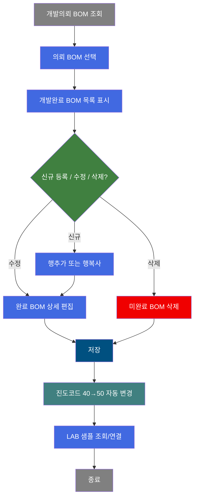
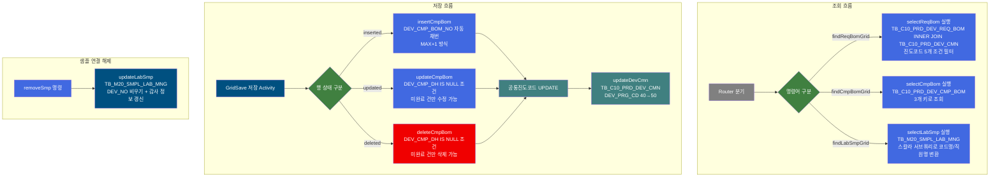
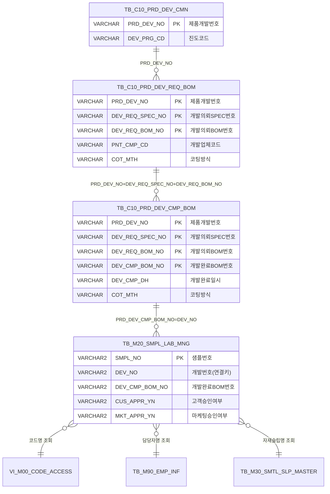

<h1 style="font-size: 40px; text-align: center; font-weight:
   bold; margin: 30px 0;">
  C108000110 레거시 시스템 분석 종합 보고서
</h1>

# 1. 시스템 개요
- **서비스 ID**: C108000110
- **업무명**: 개발완료 BOM 관리
- **분석 일시**: 2026-03-17 (KST)
- **전체 Activity 수**: 7개 (Built-in 7개, Custom 0개)
- **분석자**: Claude Opus 4.6 / Sonnet (UI), Haiku (SQL)
- **분석 도구**: /analyze-service C108000110
- **문서 버전**: 1.0

# 📊 비즈니스 프로세스 분석

## 시스템 목적

CCL(Color Coated Line) 제품개발 프로세스에서 **개발의뢰 BOM을 기반으로 개발완료 BOM을 생성·관리**하는 화면이다. 제품개발 담당자가 개발의뢰 BOM(색상, 코팅, 프린트, 롤 등 상세 사양)을 참조하여 실제 개발이 완료된 BOM 정보를 등록·수정·삭제하고, 이를 LAB 샘플과 연결하여 승인 프로세스를 진행한다.

주요 업무 흐름은 다음과 같다: (1) 개발번호/SPEC번호/BOM번호와 진도코드 조건으로 개발의뢰 BOM을 조회하고, (2) 선택된 의뢰 BOM에 대해 개발완료 BOM을 신규 추가(행추가/행복사)하거나 수정하며, (3) 저장 시 해당 제품개발의 진도코드를 40(개발의뢰)에서 50(개발진행)으로 자동 변경한다. 또한 개발완료 BOM과 연결된 LAB 샘플을 조회하고, 샘플 승인 요청 및 연결 해제 기능을 제공한다.

## 핵심 워크플로우 다이어그램



### 상세 워크플로우 다이어그램



## 주요 유즈케이스

### UC-01: 개발의뢰 BOM 조회

- **Actor**: 제품개발 담당자
- **목적**: 진도코드 조건에 따라 개발의뢰 BOM 목록을 조회하여 개발완료 BOM 작성 대상을 선택

- **전제조건**:
  - 사용자가 MES 시스템에 로그인되어 있음
  - 해당 개발업체 권한이 있음 (PNT_CMP_CD 자동 필터)
  - 제품개발 의뢰 데이터가 존재함

- **주요 흐름**:
  1. 사용자가 개발번호(PRD_DEV_NO), SPEC번호, BOM번호, 개발업체를 입력
  2. 진도코드 체크박스로 조회 범위 설정 (개발의뢰/개발진행/승인시편등록/개발반려/개발완료)
  3. 조회 버튼 클릭 → C108000110-service findReqBomGrid 호출
  4. selectReqBom 쿼리 실행 (TB_C10_PRD_DEV_REQ_BOM INNER JOIN TB_C10_PRD_DEV_CMN)
  5. Grid_1에 개발의뢰 BOM 목록 표시 (색상코드, 롤번호, 잉크코드 등 36개 컬럼)

- **대체 흐름**:
  - 조회 결과 없음: Grid_1 비어있는 상태로 표시
  - URL 파라미터로 진입 시: 자동으로 조회 조건 설정 후 조회 실행

- **후행조건**:
  - Grid_1에 의뢰 BOM 목록이 표시됨
  - 사용자가 의뢰 BOM을 선택하여 개발완료 BOM 작업을 시작할 수 있는 상태

### UC-02: 개발완료 BOM 등록/수정

- **Actor**: 제품개발 담당자
- **목적**: 개발의뢰 BOM을 기반으로 실제 개발 완료된 BOM 정보(색상, 코팅방식, 프린트 롤/잉크 등)를 등록하거나 수정

- **전제조건**:
  - UC-01에서 개발의뢰 BOM이 조회되어 Grid_1에 선택된 상태
  - 개발완료 BOM의 DEV_CMP_DH(완료일시)가 NULL인 상태 (미완료 건만 수정 가능)

- **주요 흐름**:
  1. Grid_1에서 의뢰 BOM 행 선택 → Grid_2에 해당 의뢰의 완료 BOM 목록 자동 로드 (selectCmpBom)
  2. 메뉴에서 "행추가" 또는 "행복사" 클릭 → Grid_2에 신규 행 생성
  3. Grid_2에서 완료 BOM 행 선택 → Form_3에 상세 정보 표시
  4. Form_3에서 코팅방식(COT_MTH) 선택 → 코팅방식에 따라 관련 필드 동적 활성/비활성
  5. 색상코드(TOP 1~4C, Back 1~4C, 라미나), 프린트 롤/잉크, 옵션 등 입력
  6. 저장 버튼 클릭 → insertCmpBom(신규) 또는 updateCmpBom(수정) 실행
  7. 저장 성공 시 updateDevCmn으로 진도코드 40→50 자동 변경

- **대체 흐름**:
  - DEV_CMP_DH가 NULL이 아닌 행 선택 시: Form_3 편집 잠금 (읽기 전용)
  - 행추가 시 Grid_1 미선택 상태: 경고 메시지 표시

- **후행조건**:
  - 개발완료 BOM이 TB_C10_PRD_DEV_CMP_BOM에 저장됨
  - DEV_CMP_BOM_NO가 MAX+1로 자동 채번됨
  - 제품개발 진도코드가 50(개발진행)으로 변경됨

### UC-03: LAB 샘플 연결 관리

- **Actor**: 제품개발 담당자
- **목적**: 개발완료 BOM에 연결된 LAB 샘플을 조회하고, 필요 시 연결 해제 또는 외부 화면으로 이동하여 샘플 등록/승인 처리

- **전제조건**:
  - Grid_2에서 개발완료 BOM이 선택된 상태
  - LAB 샘플 데이터가 존재함

- **주요 흐름**:
  1. Grid_2에서 완료 BOM 행 선택 → Grid_3에 연결된 LAB 샘플 자동 조회 (selectLabSmp)
  2. Form_4에 샘플 건수 표시
  3. "등록" 버튼 클릭 → Lab개발 샘플관리 화면(M205040050)으로 이동
  4. "승인요청" 버튼 클릭 → 샘플승인 처리 화면(M205040020)으로 이동
  5. "연결해제" 버튼 클릭 → Grid_3 선택 행의 DEV_NO를 비움 (updateLabSmp)

- **대체 흐름**:
  - 연결된 샘플 없음: Grid_3 비어있는 상태, Form_4에 "0건" 표시
  - 연결해제 시 확인 메시지 표시

- **후행조건**:
  - 연결해제 시 TB_M20_SMPL_LAB_MNG의 DEV_NO가 NULL로 변경됨
  - 감사 컬럼(LAST_UPDATED_OBJECT_TYPE 등) 갱신됨

### UC-04: 칼라 색상개발 화면 이동

- **Actor**: 제품개발 담당자
- **목적**: 현재 개발 건의 색상 관련 상세 개발 화면으로 이동

- **전제조건**:
  - Grid_1에서 의뢰 BOM이 선택된 상태

- **주요 흐름**:
  1. Form_3의 "칼라코드등록" 링크 버튼 클릭
  2. Grid_1 선택 행의 PRD_DEV_NO 추출
  3. uiCommon.screenMove("C108000130", {PRD_DEV_NO}) 호출
  4. 칼라 색상개발 화면(C108000130)으로 이동

- **대체 흐름**:
  - Grid_1 미선택 시: 경고 메시지 표시

- **후행조건**:
  - C108000130 화면으로 전환되어 해당 개발번호의 색상개발 정보 표시

---

## 비즈니스 로직 상세

### 1. 개발완료 BOM 자동 채번 로직

- **목적**: 동일 의뢰 BOM 내에서 개발완료 BOM 번호를 순차적으로 자동 생성
- **처리 케이스**:

  **[케이스 1: 신규 등록 시 자동 채번]**
  ```
    조건: insertCmpBom 실행 시
    처리:
      1. PRD_DEV_NO + DEV_REQ_SPEC_NO + DEV_REQ_BOM_NO 조합으로 기존 MAX(DEV_CMP_BOM_NO) 조회
      2. MAX 값이 NULL이면 기본값 '30' 사용
      3. TO_NUMBER(MAX값) + 1 계산 후 TO_CHAR로 변환하여 DEV_CMP_BOM_NO 설정
  ```

- **계산 공식**:
  ```
  DEV_CMP_BOM_NO = TO_CHAR(TO_NUMBER(NVL(MAX(DEV_CMP_BOM_NO), '30')) + 1)

  예시:
  기존 최대값 없음 → '30' + 1 = '31'
  기존 최대값 '33' → '33' + 1 = '34'
  ```

### 2. 진도코드 자동 변경 로직

- **목적**: 개발완료 BOM 저장 시 제품개발의 진도 상태를 자동으로 진행시킴
- **처리 케이스**:

  **[케이스 1: 40→50 변경]**
  ```
    조건: 현재 DEV_PRG_CD = '40' (개발의뢰 상태)
    처리:
      1. GridSave(저장) Activity 성공 후 공통진도코드 UPDATE Activity 실행
      2. TB_C10_PRD_DEV_CMN의 DEV_PRG_CD를 '50'(개발진행)으로 UPDATE
      3. 감시 컬럼(ObjectType, ObjectId, ProgramId, Timestamp) 동시 갱신
  ```

  **[케이스 2: 40이 아닌 경우]**
  ```
    조건: DEV_PRG_CD ≠ '40'
    처리: WHERE 조건 불일치로 UPDATE 실행 안 됨 (0건 변경)
  ```

### 3. 코팅방식(COT_MTH) 기반 동적 필드 제어

- **목적**: 코팅방식에 따라 관련 없는 입력 필드를 비활성화하여 데이터 정합성 확보
- **처리 케이스**:

  **[케이스: COT_MTH 값에 따른 필드 활성/비활성]**
  ```
    코팅방식 코드 1~9, A~Z에 따라 Form_3의 필드 그룹별 활성/비활성 제어:
    - BLOCK2 (TOP 색상 1~4C): 코팅방식에 따라 활성화
    - BLOCK3 (Back 색상 1~4C): 양면 코팅 시만 활성화
    - BLOCK4 (Print Roll 1~4도): 프린트 관련 코팅 시만 활성화
    - BLOCK5 (Print Ink 1~4도): 프린트 관련 코팅 시만 활성화
    - BLOCK6 (라미나, U-TEX, PICK-UP, IMPRINT Roll): 해당 공정 적용 시만 활성화
  ```

### 4. 수정/삭제 제한 로직

- **목적**: 개발완료 처리된 BOM의 무단 변경 방지
- **처리 케이스**:

  **[케이스 1: 수정 제한]**
  ```
    조건: updateCmpBom SQL의 WHERE 절
    처리: DEV_CMP_DH IS NULL 조건 포함
    → 개발완료일시가 설정되지 않은(미완료) 건만 수정 가능
  ```

  **[케이스 2: 삭제 제한]**
  ```
    조건: deleteCmpBom SQL의 WHERE 절
    처리: DEV_CMP_DH IS NULL 조건 포함
    → 개발완료일시가 설정되지 않은(미완료) 건만 삭제 가능
  ```

### 5. LAB 샘플 코드값 변환 로직 (SQL 기반)

- **목적**: LAB 샘플 조회 시 코드값을 사람이 읽을 수 있는 명칭으로 변환
- **처리 케이스**:

  **[케이스 1: 스칼라 서브쿼리 코드명 변환]**
  ```
    처리:
      1. SMPL_TP → SMPL_TP_NM: VI_M00_CODE_ACCESS에서 샘플유형 코드명 조회
      2. SMPL_CHG_TP → SMPL_CHG_TP_NM: 변경유형 코드명 조회
      3. SMPL_STS_CD → SMPL_STS_CD_NM: 상태 코드명 조회
      4. SMPL_SZ_CD → SMPL_SZ_CD_NM: 크기 코드명 조회
      5. SMTL_SLP_NM: TB_M30_SMTL_SLP_MASTER에서 자재 슬립명 조회
      6. SMPL_PRD_NM: TB_M90_EMP_INF에서 생산 담당자명 조회
      7. CUS_CD_NM: 고객명 조회
      8. CUS_APPR_NM / MKT_APPR_NM: 승인자명 조회
  ```

  **[케이스 2: 집계 서브쿼리]**
  ```
    처리:
      1. APPR_CNT: TB_M20_SMPL_CUR_APPR_DTL에서 고객 승인 건수 COUNT
      2. MKT_CNT: TB_M20_SMPL_MKT_REQ_DTL에서 마케팅 요청 건수 COUNT
  ```

---

# 💾 데이터 요구사항

## 핵심 테이블

### 1. TB_C10_PRD_DEV_CMP_BOM - 제품개발완료BOM
| 컬럼명 | 타입 | PK | 설명 |
|--------|------|----|------|
| PRD_DEV_NO | VARCHAR | ✅ | 제품개발번호 |
| DEV_REQ_SPEC_NO | VARCHAR | ✅ | 개발의뢰SPEC번호 |
| DEV_REQ_BOM_NO | VARCHAR | ✅ | 개발의뢰BOM번호 |
| DEV_CMP_BOM_NO | VARCHAR | ✅ | 개발완료BOM번호 (자동채번 MAX+1) |
| DEV_CMP_DH | VARCHAR | | 개발완료일시 (NULL이면 미완료) |
| DEV_CHR_UID | VARCHAR | | 개발담당자UID |
| HUE_CD_FRN_1COT ~ 4COT | VARCHAR | | TOP 색상코드 1~4C |
| HUE_CD_BAK_1COT ~ 4COT | VARCHAR | | Back 색상코드 1~4C |
| HUE_CD_LMN | VARCHAR | | 라미나 색상코드 |
| PRT_ROLL_NO1 ~ 4 | VARCHAR | | 프린트 롤번호 1~4도 |
| PRT_INK_CD1 ~ 4 | VARCHAR | | 프린트 잉크코드 1~4도 |
| UNI_TEX_ROLL_NO | VARCHAR | | U-TEX 롤번호 |
| PICK_UP_ROLL_NO | VARCHAR | | PICK-UP 롤번호 |
| IMPT_ROLL_NO | VARCHAR | | IMPRINT 롤번호 |
| UNFIX_NO | VARCHAR | | Unfixed 번호 |
| COT_MTH | VARCHAR | | 코팅방식 |
| TLP_TP | VARCHAR | | 무독성구분(탑코트타입) |
| CCL_BOM_WR_YN | VARCHAR | | 내후성보증여부 |
| DISC_PTN_WTH_CD | VARCHAR | | 불연속패턴 및 폭관리코드 |
| UNI_TEX_PTN_CD | VARCHAR | | UNI-TEX 패턴코드 |
| CUT_LN_YN | VARCHAR | | 재단선유무 |
| PT_TP | VARCHAR | | 핀트종류 |
| PRT_USG_CD | VARCHAR | | 프린트용도코드 |
| PRT_PTN_CD | VARCHAR | | 프린트패턴코드 |
| SPC_PRD_AF_NO | VARCHAR | | 특수제품 후처리번호 |
| INK_DEV_NO | VARCHAR | | 잉크젯개발번호 |
| DEV_CMP_RMK | VARCHAR | | 개발완료 비고 |

### 2. TB_C10_PRD_DEV_REQ_BOM - 제품개발의뢰BOM
| 컬럼명 | 타입 | PK | 설명 |
|--------|------|----|------|
| PRD_DEV_NO | VARCHAR | ✅ | 제품개발번호 |
| DEV_REQ_SPEC_NO | VARCHAR | ✅ | 개발의뢰SPEC번호 |
| DEV_REQ_BOM_NO | VARCHAR | ✅ | 개발의뢰BOM번호 |
| HUE_CD_FRN_1COT ~ 4COT | VARCHAR | | TOP 색상코드 |
| HUE_CD_BAK_1COT ~ 4COT | VARCHAR | | Back 색상코드 |
| PRT_ROLL_NO1 ~ 4 | VARCHAR | | 프린트 롤번호 |
| PRT_INK_CD1 ~ 4 | VARCHAR | | 프린트 잉크코드 |
| COT_MTH | VARCHAR | | 코팅방식 |
| PNT_CMP_CD | VARCHAR | | 개발업체코드 |

### 3. TB_C10_PRD_DEV_CMN - 제품개발공통정보
| 컬럼명 | 타입 | PK | 설명 |
|--------|------|----|------|
| PRD_DEV_NO | VARCHAR | ✅ | 제품개발번호 |
| DEV_PRG_CD | VARCHAR | | 진도코드 (40:의뢰, 50:진행, 51:승인시편, 60:완료, 91:반려) |

### 4. TB_M20_SMPL_LAB_MNG - LAB 샘플 관리
| 컬럼명 | 타입 | PK | 설명 |
|--------|------|----|------|
| SMPL_NO | VARCHAR2 | ✅ | 샘플번호 |
| SMPL_TP | VARCHAR2 | | 샘플유형 |
| SMPL_CHG_TP | VARCHAR2 | | 전환유형 |
| DEV_NO | VARCHAR2 | | 개발번호 (PRD_DEV_CMP_BOM_NO와 연결) |
| DEV_CMP_BOM_NO | VARCHAR2 | | 개발완료BOM번호 |
| CCL_BOM_NO | VARCHAR2 | | CCL BOM번호 |
| CLR_SUB_MTL_CD | VARCHAR2 | | 색상 부자재코드 |
| CUS_APPR_YN | VARCHAR2 | | 고객승인여부 |
| CUS_APPR_DH | DATE | | 고객승인일시 |
| MKT_APPR_YN | VARCHAR2 | | 마케팅승인여부 |
| MKT_APPR_DH | DATE | | 마케팅승인일시 |
| SMPL_PUB_YN | VARCHAR2 | | Tag 발행여부 |
| SMPL_QTY | NUMBER | | 샘플수량 |
| REMARK | VARCHAR2 | | 특기사항 |

## 데이터 플로우

### 1. 개발의뢰 BOM 조회
```
[개발의뢰 BOM 목록 조회]
조회 버튼 클릭
→ C108000110.selectReqBom
  FROM TB_C10_PRD_DEV_REQ_BOM RBM
  INNER JOIN TB_C10_PRD_DEV_CMN CMN ON RBM.PRD_DEV_NO = CMN.PRD_DEV_NO
  WHERE RBM.PRD_DEV_NO = :PRD_DEV_NO
    AND (DEV_REQ_SPEC_NO = :DEV_REQ_SPEC_NO -- 선택)
    AND (DEV_REQ_BOM_NO = :DEV_REQ_BOM_NO -- 선택)
    AND (PNT_CMP_CD = :PNT_CMP_CD)
    AND DEV_PRG_CD IN (활성화된 진도코드 체크박스 값)
→ Grid_1에 의뢰 BOM 목록 표시
```

### 2. 개발완료 BOM 조회
```
[Grid_1 행 선택 시 완료 BOM 로드]
Grid_1 행 선택
→ C108000110.selectCmpBom
  FROM TB_C10_PRD_DEV_CMP_BOM CBM
  WHERE PRD_DEV_NO = :PRD_DEV_NO
    AND DEV_REQ_SPEC_NO = :DEV_REQ_SPEC_NO
    AND DEV_REQ_BOM_NO = :DEV_REQ_BOM_NO
  ORDER BY PRD_DEV_NO, DEV_REQ_SPEC_NO, DEV_REQ_BOM_NO, DEV_CMP_BOM_NO
→ Grid_2에 완료 BOM 목록 표시
```

### 3. 개발완료 BOM 저장
```
[저장 처리 흐름]
저장 버튼 클릭
→ GridSave Activity (저장)
  INSERT: C108000110.insertCmpBom → TB_C10_PRD_DEV_CMP_BOM (DEV_CMP_BOM_NO 자동채번)
  UPDATE: C108000110.updateCmpBom → TB_C10_PRD_DEV_CMP_BOM (DEV_CMP_DH IS NULL 조건)
  DELETE: C108000110.deleteCmpBom → TB_C10_PRD_DEV_CMP_BOM (DEV_CMP_DH IS NULL 조건)
→ GridSave Activity (공통진도코드 UPDATE)
  UPDATE: C108000110.updateDevCmn → TB_C10_PRD_DEV_CMN (DEV_PRG_CD 40→50)
```

### 4. LAB 샘플 조회
```
[Grid_2 행 선택 시 LAB 샘플 조회]
Grid_2 행 선택
→ C108000110.selectLabSmp
  FROM TB_M20_SMPL_LAB_MNG A
  WHERE DEV_NO = :PRD_DEV_CMP_BOM_NO (PRD_DEV_NO||DEV_REQ_SPEC_NO||DEV_REQ_BOM_NO||DEV_CMP_BOM_NO)
  + 스칼라 서브쿼리: VI_M00_CODE_ACCESS, TB_M30_SMTL_SLP_MASTER, TB_M90_EMP_INF
  + 집계 서브쿼리: TB_M20_SMPL_CUR_APPR_DTL, TB_M20_SMPL_MKT_REQ_DTL
→ Grid_3에 샘플 목록 표시
```

### 5. LAB 샘플 연결 해제
```
[연결해제 버튼 클릭]
→ C108000110.updateLabSmp
  UPDATE TB_M20_SMPL_LAB_MNG
  SET DEV_NO = '' + 감사 컬럼 갱신
  WHERE SMPL_NO = :SMPL_NO
    AND DEV_NO = :PRD_DEV_CMP_BOM_NO
```

## SQL 일람표
| SQL 이름 | 쿼리 ID | 타입 | 출처 | 테이블 |
|---------|---------|-----|------|-------|
| 개발의뢰BOM 조회 | C108000110.selectReqBom | SELECT | Service | TB_C10_PRD_DEV_REQ_BOM, TB_C10_PRD_DEV_CMN |
| 개발완료BOM 조회 | C108000110.selectCmpBom | SELECT | Service | TB_C10_PRD_DEV_CMP_BOM |
| LAB 샘플 조회 | C108000110.selectLabSmp | SELECT | Service | TB_M20_SMPL_LAB_MNG, VI_M00_CODE_ACCESS, TB_M30_SMTL_SLP_MASTER, TB_M90_EMP_INF |
| 진도코드 UPDATE | C108000110.updateDevCmn | UPDATE | Service | TB_C10_PRD_DEV_CMN |
| LAB샘플 연결해제 | C108000110.updateLabSmp | UPDATE | Service | TB_M20_SMPL_LAB_MNG |
| 완료BOM 등록 | C108000110.insertCmpBom | INSERT | Service | TB_C10_PRD_DEV_CMP_BOM |
| 완료BOM 수정 | C108000110.updateCmpBom | UPDATE | Service | TB_C10_PRD_DEV_CMP_BOM |
| 완료BOM 삭제 | C108000110.deleteCmpBom | DELETE | Service | TB_C10_PRD_DEV_CMP_BOM |

## ER 다이어그램 (핵심 관계)



관계 설명:
- TB_C10_PRD_DEV_CMN이 중심 테이블로 제품개발의 진도 상태를 관리
- TB_C10_PRD_DEV_REQ_BOM: 의뢰 BOM은 PRD_DEV_NO로 공통정보에 연결 (1:N)
- TB_C10_PRD_DEV_CMP_BOM: 완료 BOM은 의뢰 BOM 3개 키로 연결 (1:N)
- TB_M20_SMPL_LAB_MNG: LAB 샘플은 PRD_DEV_CMP_BOM_NO(4개 키 연결) = DEV_NO로 완료 BOM에 연결

---

# 🖥️ 사용자 인터페이스 요구사항

## 화면 레이아웃 상세

### Layout 구조 (initLayout)
```javascript
{
  itemType: "layout",
  dirType: "row",       // 수직 분할
  childSize: "60",      // 상단 Form 60px
  splitter: false,
  messageBox: true,     // 하단 상태바
  components: [
    {
      id: "form_area",
      height: "60px",
      component: {
        itemType: "form",
        formId: "C108000110_Form_1"  // 조회조건
      }
    },
    {
      id: "main_area",
      height: "*",
      component: {
        itemType: "layout",
        dirType: "row",         // 가로 3열 분할
        childSize: "400,490",   // 좌:400px, 중:490px, 우:나머지
        splitter: true,
        components: [
          {
            header: "*[개발의뢰 BOM]",
            dirType: "row",
            childSize: ",283",    // 상:나머지, 하:283px
            splitter: true,
            components: [
              { itemType: "grid", gridId: "C108000110_Grid_1" },   // 의뢰 BOM 그리드
              { itemType: "form", formId: "C108000110_Form_2" }    // 의뢰 BOM 상세
            ]
          },
          {
            header: "*[개발완료 BOM]",
            dirType: "row",
            childSize: ",335",
            splitter: true,
            components: [
              { itemType: "grid", gridId: "C108000110_Grid_2", menu: "C108000110_Menu_1" },  // 완료 BOM 그리드
              { itemType: "form", formId: "C108000110_Form_3" }    // 완료 BOM 입력 폼
            ]
          },
          {
            dirType: "row",
            childSize: "30",
            splitter: true,
            components: [
              { itemType: "form", formId: "C108000110_Form_4" },   // 승인 Sample 요약
              { itemType: "grid", gridId: "C108000110_Grid_3" }    // 승인 샘플 그리드
            ]
          }
        ]
      }
    }
  ]
}
```

## 입출력 요소

### Form 컴포넌트

**C108000110_Form_1 (조회조건)**
- PRD_DEV_NO: input - 개발번호
- DEV_REQ_SPEC_NO: input - 개발SPEC번호
- DEV_REQ_BOM_NO: input - 개발의뢰BOM
- PNT_CMP_CD: input - 개발업체
- DEV_PRG_CD_40: checkbox - 개발의뢰 (기본 체크)
- DEV_PRG_CD_50: checkbox - 개발진행 (기본 체크)
- DEV_PRG_CD_51: checkbox - 승인시편등록 (기본 체크)
- DEV_PRG_CD_91: checkbox - 개발반려 (기본 체크)
- DEV_PRG_CD_60: checkbox - 개발완료 (기본 미체크)
- find: button - 조회
- save: button - 저장
- winClose: button - 닫기

**C108000110_Form_2 (개발의뢰 BOM 상세 - 읽기전용)**
- Grid_1에 바인딩되어 선택 행 데이터 표시
- 35개 필드 (전체 readonly): DEV_REQ_BOM_NO, PNT_CMP_CD, 색상코드(FRN/BAK 1~4C), 프린트 롤/잉크 1~4도, 라미나, U-TEX/PICK-UP/IMPRINT 롤, 코팅방식, 수지, 무독성구분, 광택값, 도막두께 등
- PRD_DEV_NO, DEV_REQ_SPEC_NO: hidden

**C108000110_Form_3 (개발완료 BOM 입력 폼)**
- Grid_2에 바인딩, COT_MTH 값에 따라 동적 필드 활성/비활성 제어
- BLOCK1: DEV_CMP_BOM_NO(readonly), DEV_CMP_DH(readonly), DEV_CHR_UID, COT_MTH(combo, 배경색 #FFFFC0)
- BLOCK2: HUE_CD_FRN_1~4COT (TOP 색상)
- BLOCK3: HUE_CD_BAK_1~4COT (Back 색상)
- BLOCK4: PRT_ROLL_NO1~4 (프린트 롤)
- BLOCK5: PRT_INK_CD1~4 (프린트 잉크)
- BLOCK6: HUE_CD_LMN, UNI_TEX_ROLL_NO, PICK_UP_ROLL_NO, IMPT_ROLL_NO
- BLOCK7: UNFIX_NO, CCL_BOM_WR_YN(combo Y/N), TLP_TP(combo)
- BLOCK8: CUT_LN_YN(combo), PT_TP(combo), DISC_PTN_WTH_CD(combo), UNI_TEX_PTN_CD
- BLOCK9: PRT_USG_CD(combo), PRT_PTN_CD(combo), INK_DEV_NO, SPC_PRD_AF_NO + hidden 키 필드
- BLOCK10: DEV_CMP_RMK(textarea, 2행), clr_dev_call(linkbutton - 칼라코드등록)

**C108000110_Form_4 (승인용 Sample 요약)**
- CMP_SIM_CNT: input(readonly) - 건수 표시 (Grid_3 행 수)
- lab_simple_call: linkbutton - 등록 → M205040050 화면 이동
- cnf_simple_call: linkbutton - 승인요청 → M205040020 화면 이동
- removeSmp: custombutton - 연결해제 (배경색 #D2FFD2)

### Grid 컴포넌트

**C108000110_Grid_1 (개발의뢰 BOM 목록)**
- 편집 가능 여부: 아니오 (읽기 전용)
- 주요 컬럼 (36개):

  **숨김 컬럼**:
  - PRD_DEV_NO: ro - 제품개발번호 (숨김)
  - DEV_REQ_SPEC_NO: ro - 개발요청SPEC번호 (숨김)

  **BOM 기본 정보**:
  - DEV_REQ_BOM_NO: ro - 개발의뢰BOM번호 (12px, 좌측정렬)

  **색상 정보 (TOP)**:
  - HUE_CD_FRN_1COT: ro - TOP 1C (12px, 좌측정렬)
  - HUE_CD_FRN_2COT: ro - TOP 2C (12px, 좌측정렬)
  - HUE_CD_FRN_3COT: ro - TOP 3C (12px, 좌측정렬)
  - HUE_CD_FRN_4COT: ro - TOP 4C (12px, 좌측정렬)

  **색상 정보 (Back)**:
  - HUE_CD_BAK_1COT: ro - Back 1C (12px, 좌측정렬)
  - HUE_CD_BAK_2COT: ro - Back 2C (12px, 좌측정렬)
  - HUE_CD_BAK_3COT: ro - Back 3C (12px, 좌측정렬)
  - HUE_CD_BAK_4COT: ro - Back 4C (12px, 좌측정렬)
  - HUE_CD_LMN: ro - 라미나 (12px, 좌측정렬)

  **프린트 정보**:
  - PRT_ROLL_NO1: ro - Print1도 Roll (12px, 좌측정렬)
  - PRT_INK_CD1: ro - Print1도 Ink (12px, 좌측정렬)
  - PRT_ROLL_NO2: ro - Print2도 Roll (12px, 좌측정렬)
  - PRT_INK_CD2: ro - Print2도 Ink (12px, 좌측정렬)
  - PRT_ROLL_NO3: ro - Print3도 Roll (12px, 좌측정렬)
  - PRT_INK_CD3: ro - Print3도 Ink (12px, 좌측정렬)
  - PRT_ROLL_NO4: ro - Print4도 Roll (12px, 좌측정렬)
  - PRT_INK_CD4: ro - Print4도 Ink (12px, 좌측정렬)

  **롤/기타 정보**:
  - UNI_TEX_ROLL_NO: ro - U-TEX Roll (12px, 좌측정렬)
  - PICK_UP_ROLL_NO: ro - PICK-UP Roll (12px, 좌측정렬)
  - IMPT_ROLL_NO: ro - IMPRINT Roll (12px, 좌측정렬)
  - SIM_HUE_PRG_YN: ro - 유사색상 적용여부 (12px, 좌측정렬)
  - PNT_CMP_CD: ro - 개발업체 (12px, 좌측정렬)
  - COT_MTH: ro - 코팅방식 (12px, 좌측정렬)
  - RSN_TP: ro - 수지 (12px, 좌측정렬)
  - TLP_TP: ro - 무독성구분 (12px, 좌측정렬)
  - RL_LUS_RT: ro - 실광택값 (12px, 좌측정렬)
  - PNT_FLM_THK_TXT: ro - 도막두께 (12px, 좌측정렬)
  - LMN_BND_CMP_CD: ro - 라미나유형 접착제개발업체 (12px, 좌측정렬)
  - LMN_KND_TP: ro - 라미나유형 (12px, 좌측정렬)
  - LMN_FLM_THK: ro - 라미나 필름두께 (12px, 좌측정렬)
  - DSN_SIM_FILE: ro - 디자인 시안 적용가능여부 (12px, 좌측정렬)
  - PRT_BY_ROLL_CMP_CD: ro - Print Baby Roll 제작업체 (12px, 좌측정렬)
  - SPC_PRD_AF_WK: ro - 특수제품 후처리작업 (12px, 좌측정렬)

**C108000110_Grid_2 (개발완료 BOM 목록)**
- 편집 가능 여부: 메뉴(Menu_1)를 통한 행 추가/복사/삭제 가능
- 저장 URL: handleDataProcess.do
- 주요 컬럼 (40개):

  **숨김 컬럼**:
  - PRD_DEV_NO: ro - 제품개발번호 (숨김)
  - DEV_REQ_SPEC_NO: ro - 개발요청SPEC번호 (숨김)
  - DEV_REQ_BOM_NO: ro - 개발의뢰BOM번호 (숨김)
  - PRD_DEV_CMP_BOM_NO: ro - 연결키 (숨김)

  **BOM 기본 정보**:
  - DEV_CMP_BOM_NO: ro - 개발완료BOM번호 (12px, 좌측정렬)
  - DEV_CMP_DH: ro - 개발완료일시 (12px, 좌측정렬)
  - DEV_CHR_UID: ro - 개발담당자 (12px, 좌측정렬)

  **색상 정보 (TOP/Back)**:
  - HUE_CD_FRN_1~4COT: ro - TOP 1~4C (각 12px, 좌측정렬)
  - HUE_CD_BAK_1~4COT: ro - Back 1~4C (각 12px, 좌측정렬)
  - HUE_CD_LMN: ro - 라미나 (12px, 좌측정렬)

  **프린트 정보**:
  - PRT_ROLL_NO1~4: ro - Print 1~4도 Roll (각 12px, 좌측정렬)
  - PRT_INK_CD1~4: ro - Print 1~4도 Ink (각 12px, 좌측정렬)

  **롤/옵션 정보**:
  - UNI_TEX_ROLL_NO: ro - U-TEX Roll (12px, 좌측정렬)
  - PICK_UP_ROLL_NO: ro - PICK-UP Roll (12px, 좌측정렬)
  - IMPT_ROLL_NO: ro - IMPRINT Roll (12px, 좌측정렬)
  - UNFIX_NO: ro - Unfixed No (12px, 좌측정렬)
  - COT_MTH: ro - 코팅방식 (12px, 좌측정렬)
  - TLP_TP: ro - 무독성구분 (12px, 좌측정렬)
  - CCL_BOM_WR_YN: ro - 내후성보증여부 (12px, 좌측정렬)
  - DISC_PTN_WTH_CD: ro - 불연속패턴 및 폭관리 (12px, 좌측정렬)
  - UNI_TEX_PTN_CD: ro - UNI-TEX패턴 (12px, 좌측정렬)
  - CUT_LN_YN: ro - 재단선유무 (12px, 좌측정렬)
  - PT_TP: ro - 핀트종류 (12px, 좌측정렬)
  - PRT_USG_CD: ro - 프린트용도 (12px, 좌측정렬)
  - PRT_PTN_CD: ro - 프린트패턴 (12px, 좌측정렬)
  - SPC_PRD_AF_NO: ro - 특수제품 후처리 No (12px, 좌측정렬)
  - INK_DEV_NO: ro - 잉크젯 개발 No (12px, 좌측정렬)
  - DEV_CMP_RMK: ro - 개발완료 비고 (12px, 좌측정렬)

**C108000110_Grid_3 (승인용 샘플 그리드)**
- 편집 가능 여부: 아니오 (읽기 전용)
- 다중 헤더 적용 (업체, 담당, 일자, 상태, Size, 수량, 고객승인, 마케팅승인 등)
- 주요 컬럼 (27개):

  **숨김 컬럼**:
  - SMPL_TP: ro - 샘플유형 (숨김)
  - APPR_CNT: ro - 승인CNT (숨김)
  - MKT_CNT: ro - 마케팅CNT (숨김)
  - SMPL_TP_NM: ro - 유형명 (숨김)
  - SMPL_CHG_TP: ro - 전환유형 (숨김)
  - PRD_NM: ro - 전환유형 (숨김)

  **샘플 기본 정보**:
  - SMPL_NO: ro - 샘플번호 (8px, 중앙정렬)
  - SMPL_CHG_TP_NM: ro - 전환 (6px, 중앙정렬)
  - PRD_DEV_CMP_BOM_NO: ro - 개발No (14px, 좌측정렬)
  - SMTL_SLP_NM: ro - 샘플제작 (14px, 좌측정렬)
  - SMPL_PRD_NM: ro - 담당 (#cspan, 6px, 중앙정렬)
  - SMPL_PRD_CMP_DH: ro - 일자 (#cspan, 10px, 중앙정렬)
  - CUS_CD_NM: ro - 고객사명 (14px, 좌측정렬)

  **상태/규격 정보**:
  - SMPL_STS_CD_NM: ro - 샘플상태 (5px, 좌측정렬)
  - SMPL_SZ_CD_NM: ro - Size (#cspan, 5px, 좌측정렬)
  - SMPL_QTY: ro - 수량 (#cspan, 5px, 우측정렬)

  **BOM 연결 정보**:
  - DEV_CMP_BOM_NO: ro - 개발완료 BOM (10px, 좌측정렬)
  - CCL_BOM_NO: ro - CCL BOM (7px, 중앙정렬)
  - CLR_SUB_MTL_CD: ro - 색상 (6px, 중앙정렬)

  **승인 정보**:
  - CUS_APPR_YN: ro - 고객승인 (4px, 중앙정렬)
  - CUS_APPR_NM: ro - 고객승인자 (#cspan, 6px, 중앙정렬)
  - CUS_APPR_DH: ro - 고객승인일 (#cspan, 8px, 중앙정렬)
  - MKT_APPR_YN: ro - 마케팅승인 (4px, 중앙정렬)
  - MKT_APPR_NM: ro - 마케팅승인자 (#cspan, 6px, 중앙정렬)
  - MKT_APPR_DH: ro - 마케팅승인일 (#cspan, 8px, 중앙정렬)
  - SMPL_PUB_YN: ro - Tag 발행 (5px, 중앙정렬)
  - REMARK: ro - 특기사항 (20px, 좌측정렬)

## 화면 동작 흐름

### 1. 화면 초기 로딩
```
1. 화면 진입 (initLayout 실행)
2. Form_1 로드 완료 (onFormLoadFunction)
   - URL 파라미터 확인 (PRD_DEV_NO, DEV_REQ_SPEC_NO 등)
   - 개발업체(PNT_CMP_CD) 권한 체크 및 자동 설정
   - 진도코드 체크박스 기본값 설정 (40,50,51,91 체크)
3. Form_2 로드 완료 (onFormLoadFunction2) → Grid_1에 바인딩
4. Form_3 로드 완료 (onFormLoadFunction3)
   - Grid_2에 바인딩
   - 콤보 마스터 데이터 로드 (COT_MTH, TLP_TP 등)
   - onInputChange/onChange 이벤트 등록
5. Grid_1 로드 완료 (onGridLoadFunction)
   - URL 파라미터 있으면 자동 조회 실행
6. Grid_2 로드 완료 (onGridLoadFunction2) → afterUpdateFinish 이벤트 등록
7. Grid_3 로드 완료 (onGridLoadFunction3) → afterUpdateFinish 이벤트 등록
8. 상태바 초기화
```

### 2. 개발의뢰 BOM 조회
```
1. 사용자가 개발번호/SPEC번호/BOM번호/개발업체 입력
2. 진도코드 체크박스로 조회 범위 선택
3. 조회(find) 버튼 클릭
4. uiCommon.parameters(C108000110_Form_1) 호출하여 파라미터 구성
5. C108000110-service 서비스 호출 (findReqBomGrid)
6. selectReqBom 쿼리 실행 → Grid_1에 결과 바인딩
```

### 3. 개발완료 BOM 편집 및 저장
```
1. Grid_1에서 의뢰 BOM 행 선택 (onSelectGrid1)
2. selectCmpBom 실행 → Grid_2에 완료 BOM 목록 로드
3. 메뉴에서 행추가/행복사 → Grid_2에 신규 행 생성
4. Grid_2에서 행 선택 (onSelectGrid2)
   - DEV_CMP_DH 확인 → NULL이면 Form_3 편집 활성, 아니면 읽기전용
5. Form_3에서 COT_MTH(코팅방식) 변경 (onFormCotMthEnable)
   - 코팅방식 코드에 따라 BLOCK2~6 필드 동적 활성/비활성
6. 색상코드, 롤번호, 잉크코드 등 입력
7. 저장(save) 버튼 클릭
   - INSERT/UPDATE/DELETE 분기 처리 → 공통진도코드 UPDATE 후속 실행
```

### 4. 외부 화면 이동
```
1. 칼라코드등록(clr_dev_call) 클릭
   - Grid_1 선택 행의 PRD_DEV_NO 추출
   - uiCommon.screenMove("C108000130", {PRD_DEV_NO}) 호출
   - 칼라 색상개발 화면으로 이동

2. Lab개발 샘플관리(lab_simple_call) 클릭
   - Grid_2 선택 행의 PRD_DEV_CMP_BOM_NO 추출
   - uiCommon.screenMove("M205040050", {params}) 호출

3. 샘플승인(cnf_simple_call) 클릭
   - Grid_2 선택 행의 PRD_DEV_CMP_BOM_NO 추출
   - uiCommon.screenMove("M205040020", {params}) 호출
```

## JavaScript 모듈

**C108000110.jsp (메인 화면 스크립트)**
- initLayout(): 화면 레이아웃 초기화 (ui.initializeDHTMLX 호출)
- findReqBomGrid(): 개발의뢰 BOM 조회 (uiCommon.parameters 파라미터 구성 → 서비스 호출)
- findCmpBomGrid(): 개발완료 BOM 조회
- findLabSmpGrid(): LAB 샘플 조회
- onSelectGrid1(): Grid_1 행 선택 이벤트 → Grid_2 데이터 로드
- onSelectGrid2(): Grid_2 행 선택 이벤트 → Form_3 편집 제어 + Grid_3 로드
- onFormCotMthEnable(): COT_MTH 변경 시 필드 동적 활성/비활성
- onFormLoadFunction(): Form_1 로드 완료 → URL 파라미터/권한 처리
- onFormLoadFunction2(): Form_2 로드 완료 → Grid_1 바인딩
- onFormLoadFunction3(): Form_3 로드 완료 → Grid_2 바인딩, 콤보/이벤트 등록
- onGridLoadFunction(): Grid_1 로드 완료 → URL 파라미터 시 자동 조회
- onGridLoadFunction2(): Grid_2 로드 완료 → afterUpdateFinish 등록
- onGridLoadFunction3(): Grid_3 로드 완료 → afterUpdateFinish 등록
- lab_simple_call(): M205040050 화면 이동
- cnf_simple_call(): M205040020 화면 이동
- clr_dev_call(): C108000130 화면 이동
- removeSmp(): LAB 샘플 연결 해제
- onGridContextMenuClick(): 컨텍스트 메뉴 (셀 복사, 엑셀 내보내기)

## 주요 이벤트 핸들러

**onSelectGrid1 (Grid_1 행 선택)**
- 이벤트 타입: Grid Row Click
- 처리 내용:
  1. 선택된 행의 PRD_DEV_NO, DEV_REQ_SPEC_NO, DEV_REQ_BOM_NO 추출
  2. Context에 키 값 설정
  3. findCmpBomGrid 호출하여 완료 BOM 조회
  4. Grid_2에 데이터 바인딩
  5. Form_2에 선택 행 상세 표시

**onSelectGrid2 (Grid_2 행 선택)**
- 이벤트 타입: Grid Row Click
- 처리 내용:
  1. 선택된 행의 DEV_CMP_DH 확인
  2. DEV_CMP_DH IS NULL → Form_3 편집 모드 활성화
  3. DEV_CMP_DH IS NOT NULL → Form_3 읽기 전용 모드
  4. PRD_DEV_CMP_BOM_NO로 findLabSmpGrid 호출
  5. Grid_3에 LAB 샘플 데이터 바인딩
  6. Form_4에 샘플 건수 표시

**onFormCotMthEnable (코팅방식 변경)**
- 이벤트 타입: Combo Change
- 처리 내용:
  1. 선택된 COT_MTH 코드값 확인
  2. 코팅방식에 따라 BLOCK2~6 필드 그룹 활성/비활성 전환
  3. 비활성화된 필드의 값 초기화

**removeSmp (샘플 연결 해제)**
- 이벤트 타입: Custom Button Click
- 처리 내용:
  1. Grid_3 선택 행 확인
  2. 확인 다이얼로그 표시
  3. C108000110-service removeSmp 명령 호출
  4. updateLabSmp 실행 (DEV_NO = '' + 감사 정보 갱신)
  5. Grid_3 새로고침

---

# 📌 특이사항 및 주의사항

## 1. DEV_CMP_BOM_NO 자동채번 동시성 이슈
- **MAX+1 채번 방식**: `SELECT TO_NUMBER(NVL(MAX(DEV_CMP_BOM_NO), '30')) + 1`로 자동채번하므로, 동시에 같은 의뢰 BOM에 완료 BOM을 등록하면 **번호 충돌** 가능
- INSERT 시 PK 중복 에러 발생 가능성이 있으며, 시퀀스 기반 채번이 아닌 MAX+1 방식은 레거시 패턴의 전형적인 약점

## 2. DEV_CMP_DH 기반 수정/삭제 제한의 암묵적 규칙
- UPDATE/DELETE SQL에 `DEV_CMP_DH IS NULL` 조건이 WHERE절에 포함되어, **개발완료일시가 설정된 레코드는 자동으로 보호**됨
- 이 제한은 UI에서 명시적으로 안내하지 않으며, SQL 레벨에서 0건 UPDATE/DELETE로 조용히 무시됨
- Form_3의 편집 잠금(DEV_CMP_DH 존재 시 readonly)과 이중으로 보호하지만, API 직접 호출 시에는 SQL 조건만으로 보호

## 3. 진도코드 40→50 자동 변경의 부수 효과
- 개발완료 BOM 저장 시 `updateDevCmn`이 **매번** 실행되어 진도코드를 40→50으로 변경
- 이미 50 이상인 건은 WHERE 조건(`DEV_PRG_CD = '40'`)에 의해 자동 스킵
- 그러나 저장 Activity 체인이 `저장 → 공통진도코드 UPDATE` 순서로 항상 실행되므로, 불필요한 UPDATE 쿼리가 매 저장마다 발생

## 4. LAB 샘플 연결 구조의 복잡성
- LAB 샘플(TB_M20_SMPL_LAB_MNG)의 DEV_NO는 PRD_DEV_NO + DEV_REQ_SPEC_NO + DEV_REQ_BOM_NO + DEV_CMP_BOM_NO의 **4개 키를 연결한 문자열**
- 정규화되지 않은 연결 방식으로, FK 제약 조건이 아닌 문자열 매칭으로 관계 유지
- 연결 해제 시 DEV_NO를 빈 문자열('')로 설정 (NULL이 아님)

## 5. 다중 외부 화면 연동
- 3개 외부 화면과 연동: C108000130(칼라 색상개발), M205040050(Lab개발 샘플관리), M205040020(샘플승인 처리)
- 모듈 경계를 넘는 연동(C10↔M20)이 존재하며, 화면 간 데이터 전달은 uiCommon.screenMove의 파라미터로 처리

## 6. 코팅방식 코드 체계
- COT_MTH 코드가 1~9, A~Z까지 확장 가능한 넓은 범위
- 각 코드에 따라 Form_3의 필드 10개 블록(BLOCK1~10)의 활성/비활성이 달라지므로, 코팅방식 추가 시 onFormCotMthEnable 함수 수정 필요
- 마스터 콤보(SZ0000 그룹)로 코팅방식 목록 관리

# 📚 참고 문서

- **Service XML**: `src/service/C108000110-service.xml`
- **Query SQL**: `src/query/C108000110-query.glue_sql`
- **JSP**: `WebContents/C108000110.jsp`
- **UI XML**: `WebContents/header/kr/C108000110/C108000110_*.xml`
