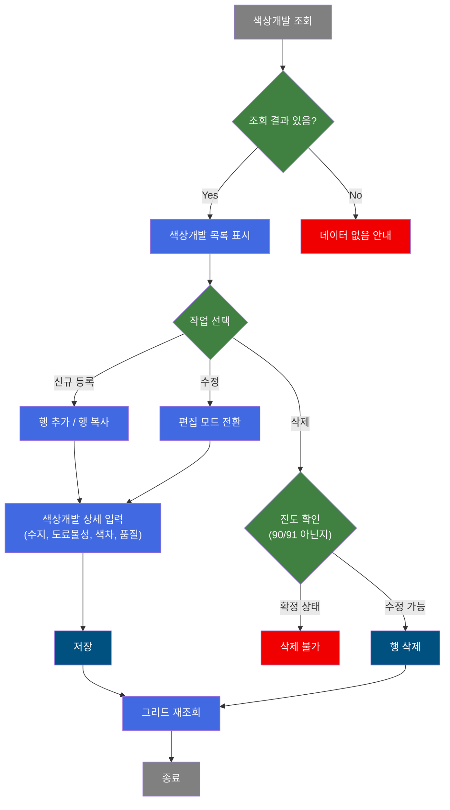
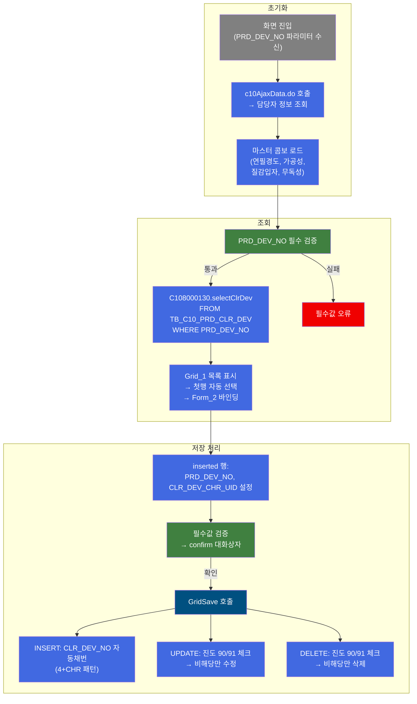
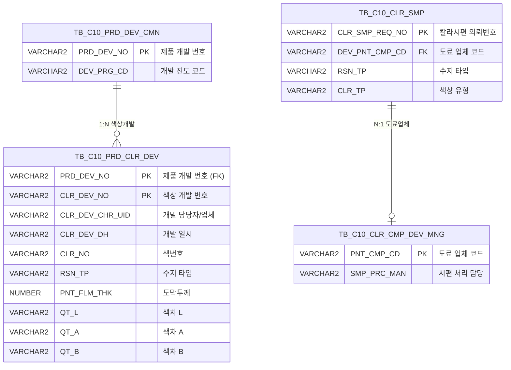

<h1 style="font-size: 40px; text-align: center; font-weight:
   bold; margin: 30px 0;">
  C108000130 레거시 시스템 분석 종합 보고서
</h1>


# 1. 시스템 개요
- **서비스 ID**: C108000130
- **업무명**: 제품 색상개발 관리
- **분석 일시**: 2026-03-17 10:36 KST
- **분석 시간**: ~3분
- **전체 Activity 수**: 4개 (Built-in 4개, Custom 0개)
- **분석자**: Claude Opus 4.6
- **분석 도구**: /analyze-service C108000130
- **문서 버전**: 1.0

# 📊 비즈니스 프로세스 분석

## 시스템 목적

C108000130은 CCL(Color Coating Line) 공정에서 사용하는 **제품 색상개발 정보를 관리**하는 화면이다. 제품개발번호(PRD_DEV_NO) 단위로 색상개발 이력을 조회하고, 색상별 수지 타입, 도료 물성(도막두께, 비중, 점도 등), 색차값(L/A/B), 품질 특성(연필경도, MEK, 가공성 등)을 등록·수정·삭제할 수 있다.

이 화면은 칼라강판 생산을 위한 색상개발 단계에서 도료 업체(CLR_DEV_CHR_UID)가 제출한 색상 시편의 물성 데이터를 체계적으로 관리하며, 개발 진도(DEV_PRG_CD)가 90(완료) 또는 91인 경우 수정·삭제가 제한되어 확정된 색상개발 데이터를 보호한다. 상위 화면에서 제품개발번호를 전달받아 해당 제품의 색상개발 목록을 조회하는 팝업 형태로 운영된다.

## 핵심 워크플로우 다이어그램



### 상세 워크플로우 다이어그램



## 주요 유즈케이스

### UC-01: 색상개발 목록 조회
- **Actor**: CCL 색상개발 담당자
- **목적**: 특정 제품개발번호에 대한 색상개발 이력을 조회하여 현재 등록된 색상별 도료 물성과 품질 특성을 확인

- **전제조건**:
  - 상위 화면(제품개발 관리)에서 제품개발번호(PRD_DEV_NO)가 전달됨
  - TB_C10_PRD_CLR_DEV 테이블에 해당 제품의 색상개발 데이터가 존재함

- **주요 흐름**:
  1. 화면 진입 시 URL 파라미터로 PRD_DEV_NO 자동 설정 - onFormLoadFunction에서 처리
  2. c10AjaxData.do 호출하여 담당자(CLR_DEV_CHR_UID) 정보 조회 - 표시/숨김 처리
  3. 조회 버튼 클릭 또는 자동 조회 - findClrDevGrid() 호출
  4. C108000130.selectClrDev 쿼리 실행 - PRD_DEV_NO 기준, CLR_DEV_NO/CLR_DEV_CHR_UID LIKE 검색 지원
  5. Grid_1에 색상개발 목록 표시 (26개 컬럼) → 첫 번째 행 자동 선택
  6. Form_2에 선택 행의 상세 정보 바인딩 표시

- **대체 흐름**:
  - PRD_DEV_NO 미입력 시: 필수값 검증 실패, 조회 중단
  - 조회 결과 없는 경우: "조회된 데이터가 없습니다" 메시지 표시

- **후행조건**:
  - 조회된 색상개발 목록이 Grid에 표시됨
  - 사용자가 행 추가/편집/삭제 작업을 수행할 수 있는 상태

### UC-02: 색상개발 신규 등록
- **Actor**: CCL 색상개발 담당자
- **목적**: 새로운 색상개발 건을 등록하여 도료 물성, 색차값, 품질 특성 데이터를 기록

- **전제조건**:
  - 제품개발번호(PRD_DEV_NO)가 조회된 상태
  - 담당자 정보(CLR_DEV_CHR_UID)가 설정된 상태

- **주요 흐름**:
  1. Menu의 "행추가" 클릭 → Grid_1에 새 행 추가 (또는 "행복사"로 기존 행 복제)
  2. Form_2가 편집 모드로 자동 전환 (inserted 행 감지)
  3. RSN_TP(수지 타입) 검색 아이콘 클릭 → masterPopup으로 수지 코드 선택
  4. onFormRsnTpEnable(rsnTp) 호출 - 수지 타입에 따라 관련 필드 활성/비활성 제어
  5. Form_2에서 도료 물성 입력 (도막두께, 비중, 점도, 색차L/A/B 등) → bindingFormToGrid로 Grid에 실시간 반영
  6. 저장 버튼 클릭 → PRD_DEV_NO, CLR_DEV_CHR_UID 자동 설정 → confirm 대화상자
  7. C108000130.insertClrDev 실행 → CLR_DEV_NO 자동 채번 ('4' + CHR(ASCII값) 패턴)
  8. 저장 완료 후 Grid 자동 재조회

- **대체 흐름**:
  - 필수값(PRD_DEV_NO, CLR_DEV_CHR_UID) 미설정 시: 저장 실패 안내
  - confirm 대화상자에서 취소: 저장 중단

- **후행조건**:
  - TB_C10_PRD_CLR_DEV에 새 레코드 INSERT됨
  - Grid가 재조회되어 신규 데이터 반영

### UC-03: 색상개발 정보 수정
- **Actor**: CCL 색상개발 담당자
- **목적**: 기존 색상개발 건의 도료 물성, 품질 특성 데이터를 수정

- **전제조건**:
  - 수정 대상 색상개발 데이터가 Grid에 표시된 상태
  - 개발 진도(DEV_PRG_CD)가 90(완료) 또는 91이 아닌 상태

- **주요 흐름**:
  1. Grid_1에서 수정 대상 행 선택 → Form_2에 상세 정보 표시 (lock 상태)
  2. Menu의 "편집" 클릭 → Form_2 unlock (편집 가능 상태로 전환)
  3. Form_2에서 필드 값 변경 → bindingFormToGrid로 Grid 행에 실시간 반영
  4. 저장 버튼 클릭 → C108000130.updateClrDev 실행
  5. UPDATE 쿼리 내 진도코드 체크: DEV_PRG_CD NOT IN ('90', '91') 조건 충족 시에만 수정

- **대체 흐름**:
  - 진도코드 90/91인 행: UPDATE WHERE 절 불일치로 수정 0건 (데이터 보호)

- **후행조건**:
  - TB_C10_PRD_CLR_DEV 레코드 갱신됨
  - Grid 자동 재조회

### UC-04: 색상개발 삭제
- **Actor**: CCL 색상개발 담당자
- **목적**: 불필요한 색상개발 데이터를 삭제

- **전제조건**:
  - 삭제 대상 행이 Grid에서 선택된 상태
  - 개발 진도가 완료(90/91) 상태가 아닌 경우만 삭제 가능

- **주요 흐름**:
  1. Grid_1에서 삭제 대상 행 선택
  2. Menu의 "삭제" 클릭 → Grid_1.removeRow()
  3. 저장 버튼 클릭 → C108000130.deleteClrDev 실행
  4. DELETE 쿼리 내 진도코드 체크: TB_C10_PRD_DEV_CMN의 DEV_PRG_CD NOT IN ('90', '91') 조건 충족 시에만 삭제

- **대체 흐름**:
  - 진도코드 90/91인 경우: DELETE WHERE 절 불일치로 삭제 0건

- **후행조건**:
  - TB_C10_PRD_CLR_DEV에서 레코드 삭제됨
  - Grid 재조회

### UC-05: 엑셀 내보내기
- **Actor**: CCL 색상개발 담당자
- **목적**: 칼라시편 관리 데이터를 엑셀 파일로 다운로드

- **전제조건**:
  - Grid 컨텍스트 메뉴가 활성화된 상태

- **주요 흐름**:
  1. Grid_1에서 우클릭 → 컨텍스트 메뉴 표시
  2. "excel_grid" 선택 → C106000010xls.select 쿼리 호출
  3. TB_C10_CLR_SMP LEFT JOIN TB_C10_CLR_CMP_DEV_MNG 조회
  4. Excel 파일 다운로드 (color 모드)

- **대체 흐름**:
  - 데이터 없는 경우: 빈 엑셀 파일 생성

- **후행조건**:
  - 엑셀 파일 다운로드 완료

---
## 비즈니스 로직 상세

### 1. 색상개발번호(CLR_DEV_NO) 자동 채번 로직

- **목적**: 제품개발번호 내에서 색상개발 건별로 고유한 번호를 자동 생성
- **처리 케이스**:

  **[케이스 1: 신규 채번]**
  ```
    조건: 해당 PRD_DEV_NO에 기존 색상개발 레코드가 없음
    처리:
      1. CLR_DEV_NO = '4' + CHR(ASCII 시작값) 패턴으로 초기값 생성
  ```

  **[케이스 2: 순차 증가]**
  ```
    조건: 기존 색상개발 레코드가 존재함
    처리:
      1. 기존 최대 CLR_DEV_NO에서 마지막 문자의 ASCII값 + 1
      2. '4' + CHR(기존MAX의 ASCII값 + 1) 로 새 번호 생성
      3. 숫자 '9' 이후 알파벳 'A'로 자연스럽게 전환 (ASCII 코드 특성)
  ```

- **계산 공식**:
  ```
  새 CLR_DEV_NO = '4' + CHR(
    NVL(
      MAX(ASCII(SUBSTR(CLR_DEV_NO, 2, 1))),
      ASCII 시작값
    ) + 1
  )

  예시:
  첫 번째 색상개발 → '41' (4 + CHR(49))
  두 번째 → '42' (4 + CHR(50))
  ...
  '49' 이후 → '4A' (4 + CHR(65), 9→A 전환 포함)
  ```

### 2. 진도코드 기반 데이터 보호 로직

- **목적**: 개발 완료된 색상개발 데이터의 무단 수정·삭제를 방지
- **처리 케이스**:

  **[케이스 1: UPDATE 보호]**
  ```
    조건: TB_C10_PRD_DEV_CMN.DEV_PRG_CD IN ('90', '91')
    처리:
      1. UPDATE 쿼리의 WHERE 절에 EXISTS 서브쿼리로 진도코드 체크
      2. 진도 90(완료) 또는 91인 경우 UPDATE 대상 행 0건 → 실질적 수정 차단
  ```

  **[케이스 2: DELETE 보호]**
  ```
    조건: TB_C10_PRD_DEV_CMN.DEV_PRG_CD IN ('90', '91')
    처리:
      1. DELETE 쿼리의 WHERE 절에 NOT EXISTS 서브쿼리
      2. 진도 90/91이면 삭제 대상 0건 → 실질적 삭제 차단
  ```

### 3. 수지 타입(RSN_TP) 기반 필드 활성화 제어

- **목적**: 수지 타입에 따라 불필요한 입력 필드를 비활성화하여 데이터 무결성 확보
- **처리 케이스**:

  **[케이스 1: 'I'로 시작하는 수지 타입]**
  ```
    조건: RSN_TP가 'I'로 시작 (예: Ink 계열)
    처리:
      1. onFormRsnTpEnable(rsnTp) 함수에서 RSN_TP 첫 글자 확인
      2. Ink 계열에 해당하지 않는 물성 필드 비활성화
  ```

  **[케이스 2: 기타 수지 타입]**
  ```
    조건: RSN_TP가 'I'로 시작하지 않음
    처리:
      1. 모든 물성 필드 활성화
  ```

### 4. 코드값→의미명 변환 (엑셀 조회)

- **목적**: 엑셀 내보내기 시 코드값을 사람이 읽을 수 있는 명칭으로 변환
- **처리 케이스**:

  **[케이스 1: 스칼라 서브쿼리 코드 변환]**
  ```
    조건: DEV_PNT_CMP_CD (도료업체코드), CLR_TP (색상유형) 컬럼
    처리:
      1. VI_M00_CODE_ACCESS 뷰에서 CD_TP = 'PNT_CMP_CD' / 'CLR_TP' 조건
      2. CATEGORY_GROUP_NM = 'SZ0000' 필터
      3. CD_V_MEANING 값을 DEV_PNT_CMP_CD_NM / CLR_TP_NM 컬럼으로 표시
  ```

  **[케이스 2: DECODE 기반 변환]**
  ```
    조건: PRJ_DEV_CD (프로젝트 개발코드) 컬럼
    처리:
      1. DECODE(PRJ_DEV_CD, '1', '1~3회', '2', '반복', '') 패턴 적용
      2. 코드 '1' → '1~3회', '2' → '반복', 기타 → 공백
  ```

---

# 💾 데이터 요구사항

## 핵심 테이블

### 1. TB_C10_PRD_CLR_DEV - (제품 색상개발 정보)
| 컬럼명 | 타입 | PK | 설명 |
|--------|------|----|-----|
| PRD_DEV_NO | VARCHAR2 | ✅ | 제품 개발 번호 |
| CLR_DEV_NO | VARCHAR2 | ✅ | 색상 개발 번호 (자동채번: '4'+CHR) |
| CLR_DEV_CHR_UID | VARCHAR2 | | 색상 개발 담당자/업체 UID |
| CLR_DEV_DH | VARCHAR2 | | 색상 개발 일시 (YYYYMMDD, 하이픈 제거 저장) |
| CLR_NO | VARCHAR2 | | 색번호 |
| RSN_TP | VARCHAR2 | | 수지 타입 (Form_2 필드 활성화 제어 기준) |
| LUS_RT_CD | VARCHAR2 | | 실광택값 |
| PNT_FLM_THK | NUMBER | | 도막두께 |
| PMT | VARCHAR2 | | PMT |
| PNT_GRA | VARCHAR2 | | 도료비중 |
| NV | VARCHAR2 | | 고형분 |
| SLV_GRA | VARCHAR2 | | 용제비중 |
| THR_CD | VARCHAR2 | | 신너 코드 |
| VISCO | VARCHAR2 | | 점도 |
| WK_VISCO | VARCHAR2 | | 작업점도 |
| QT_L | VARCHAR2 | | 색차값 L |
| QT_A | VARCHAR2 | | 색차값 A |
| QT_B | VARCHAR2 | | 색차값 B |
| MPR_BAS_PNCL_HRDN | VARCHAR2 | | 연필경도 (마스터 콤보) |
| MPR_BAS_MEK | VARCHAR2 | | MEK 내용제성 |
| CLR_BND_TST_STD_CD | VARCHAR2 | | 가공성 (마스터 콤보) |
| SRI_TXT | VARCHAR2 | | SRI (Solar Reflectance Index) |
| COOL_FUNC_YN | VARCHAR2 | | COOL기능 여부 (Y/N) |
| TEX_PTC_TP | VARCHAR2 | | 질감 입자 종류 (마스터 콤보) |
| TLP_YN | VARCHAR2 | | 무독성 여부 (마스터 콤보) |
| PRT_ROLL_NO | VARCHAR2 | | BabyRoll 번호 |

### 2. TB_C10_PRD_DEV_CMN - (제품개발 공통 정보)
| 컬럼명 | 타입 | PK | 설명 |
|--------|------|----|-----|
| PRD_DEV_NO | VARCHAR2 | ✅ | 제품 개발 번호 |
| DEV_PRG_CD | VARCHAR2 | | 개발 진도 코드 (90=완료, 91=확정) |

### 3. TB_C10_CLR_SMP - (칼라시편 정보, 엑셀 조회용)
| 컬럼명 | 타입 | PK | 설명 |
|--------|------|----|-----|
| CLR_SMP_REQ_NO | VARCHAR2 | ✅ | 칼라시편 의뢰번호 |
| CLR_SMP_RCP_NO | VARCHAR2 | | 칼라시편 접수번호 |
| DEV_PNT_CMP_CD | VARCHAR2 | | 개발 도료 업체 코드 |
| RSN_TP | VARCHAR2 | | 수지 타입 |
| CLR_TP | VARCHAR2 | | 색상 유형 |
| SAL_CHR_PRS_ID | VARCHAR2 | | 영업 담당자 ID |
| HUE_CD | VARCHAR2 | | 색조 코드 |
| CCL_BOM_NO | VARCHAR2 | | CCL BOM 번호 |

### 4. TB_C10_CLR_CMP_DEV_MNG - (칼라 업체 개발 관리, 엑셀 조회용)
| 컬럼명 | 타입 | PK | 설명 |
|--------|------|----|-----|
| PNT_CMP_CD | VARCHAR2 | ✅ | 도료 업체 코드 |
| SMP_PRC_MAN | VARCHAR2 | | 시편 처리 담당 |
| MGR_CAL | VARCHAR2 | | 관리 일정 |

## 데이터 플로우

### 1. 조회
```
[색상개발 목록 조회]
화면 진입 (PRD_DEV_NO 파라미터)
→ C108000130.selectClrDev
  FROM TB_C10_PRD_CLR_DEV CD
  WHERE CD.PRD_DEV_NO = :PRD_DEV_NO
    AND CD.CLR_DEV_NO LIKE '%' || :CLR_DEV_NO || '%' (선택)
    AND NVL(CD.CLR_DEV_CHR_UID, ' ') LIKE '%' || :CLR_DEV_CHR_UID || '%' (선택)
→ Grid_1에 색상개발 목록 표시 (26개 컬럼)
→ Form_2에 첫 행 상세 정보 바인딩
```

### 2. 저장 (신규 등록)
```
[색상개발 신규 등록]
행 추가 → Form_2에서 상세 입력 → 저장 버튼
→ C108000130.insertClrDev
  INSERT INTO TB_C10_PRD_CLR_DEV
    (PRD_DEV_NO, CLR_DEV_NO, CLR_DEV_CHR_UID, CLR_DEV_DH, CLR_NO, RSN_TP, ...)
  VALUES (:PRD_DEV_NO, 자동채번, :CLR_DEV_CHR_UID, REPLACE(:CLR_DEV_DH,'-',''), ...)
  * CLR_DEV_NO = '4' + CHR(MAX(ASCII) + 1)
→ 저장 완료 → Grid 재조회
```

### 3. 저장 (수정)
```
[색상개발 정보 수정]
행 선택 → 편집 모드 → Form_2에서 수정 → 저장 버튼
→ C108000130.updateClrDev
  UPDATE TB_C10_PRD_CLR_DEV
  SET CLR_DEV_CHR_UID = :CLR_DEV_CHR_UID,
      CLR_DEV_DH = REPLACE(:CLR_DEV_DH,'-',''),
      CLR_NO = :CLR_NO, RSN_TP = :RSN_TP, ...
  WHERE PRD_DEV_NO = :PRD_DEV_NO
    AND CLR_DEV_NO = :CLR_DEV_NO
    AND EXISTS (SELECT 1 FROM TB_C10_PRD_DEV_CMN
                WHERE PRD_DEV_NO = :PRD_DEV_NO
                  AND DEV_PRG_CD NOT IN ('90','91'))
→ 진도 90/91이면 수정 0건 (보호)
```

### 4. 삭제
```
[색상개발 삭제]
행 선택 → 삭제 → 저장 버튼
→ C108000130.deleteClrDev
  DELETE FROM TB_C10_PRD_CLR_DEV
  WHERE PRD_DEV_NO = :PRD_DEV_NO
    AND CLR_DEV_NO = :CLR_DEV_NO
    AND NOT EXISTS (SELECT 1 FROM TB_C10_PRD_DEV_CMN
                    WHERE PRD_DEV_NO = :PRD_DEV_NO
                      AND DEV_PRG_CD IN ('90','91'))
→ 진도 90/91이면 삭제 0건 (보호)
```

## SQL 일람표
| SQL 이름 | 쿼리 ID | 타입 | 출처 | 테이블 |
|---------|---------|-----|------|-------|
| 색상개발 조회 | C108000130.selectClrDev | SELECT | Service | TB_C10_PRD_CLR_DEV |
| 칼라시편 엑셀 조회 | C106000010xls.select | SELECT | Service | TB_C10_CLR_SMP, TB_C10_CLR_CMP_DEV_MNG |
| 색상개발 등록 | C108000130.insertClrDev | INSERT | Service | TB_C10_PRD_CLR_DEV |
| 색상개발 삭제 | C108000130.deleteClrDev | DELETE | Service | TB_C10_PRD_CLR_DEV, TB_C10_PRD_DEV_CMN |
| 색상개발 수정 | C108000130.updateClrDev | UPDATE | Service | TB_C10_PRD_CLR_DEV, TB_C10_PRD_DEV_CMN |

## ER 다이어그램 (핵심 관계)



관계 설명:
- **TB_C10_PRD_DEV_CMN**이 중심 테이블로 제품개발 단위를 관리하며, PRD_DEV_NO를 통해 TB_C10_PRD_CLR_DEV와 1:N 관계
- **TB_C10_PRD_CLR_DEV**: 제품개발번호 + 색상개발번호 복합 PK, 색상별 도료 물성·품질 데이터 저장
- **TB_C10_CLR_SMP ↔ TB_C10_CLR_CMP_DEV_MNG**: 엑셀 조회 시 DEV_PNT_CMP_CD를 통한 LEFT OUTER JOIN 관계

---

# 🖥️ 사용자 인터페이스 요구사항

## 화면 레이아웃 상세

### Layout 구조 (initLayout)
```javascript
{
  itemType: "layout",
  programId: "C108000130",
  dirType: "row",        // 수직 분할
  childSize: "35",       // Form_1 영역 35px
  splitter: false,       // 상단 영역 크기 고정
  messageBox: true,      // 하단 상태바 표시
  components: [
    {
      id: "C108000130_Form_1",
      height: "35px",
      component: {
        itemType: "form",
        formId: "C108000130_Form_1"
      }
    },
    {
      id: "content_area",
      height: "*",        // 나머지 전체
      component: {
        itemType: "layout",
        dirType: "row",    // 수직 분할
        childSize: "350",  // Grid 영역 350px
        splitter: true,    // Grid/Form 크기 조절 가능
        components: [
          {
            id: "C108000130_Grid_1",
            height: "350px",
            component: { itemType: "grid" }
          },
          {
            id: "C108000130_Form_2",
            height: "*",
            component: {
              itemType: "form",
              header: "*[색상개발]",
              arrow: true
            }
          }
        ]
      }
    }
  ]
}
```

## 입출력 요소

### Form 컴포넌트
**C108000130_Form_1 (검색 조건)**
- PRD_DEV_NO: Input - 개발번호 (labelWidth:75, inputWidth:100)
- CLR_DEV_NO: Input - 색상개발번호 (labelWidth:75, inputWidth:100)
- CLR_DEV_CHR_UID: Input - 개발업체 (labelWidth:75, inputWidth:100)
- find: Button - 조회 → findClrDevGrid() 호출
- save: Button - 저장 → Grid_1.sendGrid()
- winClose: Button - 닫기 → 창 닫기

**C108000130_Form_2 (색상개발 상세 편집, Grid_1에 bind)**
- *BLOCK1 - 기본 정보*:
  - CLR_DEV_NO: Input(readonly) - 색상개발 번호
  - CLR_DEV_CHR_UID: Input(readonly) - 개발업체
  - CLR_DEV_DH: Calendar - 개발일시 (dateFormat: %Y-%m-%d)
  - RSN_TP: Input - 수지 + 검색 아이콘(serchIcon_RSN_TP → masterPopup)
- *BLOCK2 - 색상/도료 정보*:
  - CLR_NO: Input - 색번호
  - LUS_RT_CD: Input - 실광택값
  - PNT_FLM_THK: Input - 도막두께
  - PMT: Input - PMT
- *BLOCK3 - 도료 물성*:
  - PNT_GRA: Input - 도료비중
  - NV: Input - 고형분
  - SLV_GRA: Input - 용제비중
  - THR_CD: Input - 신너
- *BLOCK4 - 점도/롤*:
  - VISCO: Input - 점도
  - WK_VISCO: Input - 작업점도
  - PRT_ROLL_NO: Input - BabyRoll No
- *BLOCK5 - 색차값*:
  - QT_L: Input - L값
  - QT_A: Input - A값
  - QT_B: Input - B값
- *BLOCK6 - 품질 특성*:
  - MPR_BAS_PNCL_HRDN: Combo(마스터) - 연필경도 (SZ0000, code-code)
  - MPR_BAS_MEK: Input - MEK
  - CLR_BND_TST_STD_CD: Combo(마스터) - 가공성 (SZ0000, code-code)
  - SRI_TXT: Input - SRI
- *BLOCK7 - 기능 정보*:
  - COOL_FUNC_YN: Combo - COOL기능여부 (Y-여/N-부)
  - TEX_PTC_TP: Combo(마스터) - 질감 입자종류 (SZ0000, all-code)
  - TLP_YN: Combo(마스터) - 무독성 여부 (SZ0000, all-code)
  - PRD_DEV_NO: Hidden - 개발번호

### Grid 컴포넌트

**C108000130_Grid_1 (색상개발 목록)**
- 편집 가능 여부: 아니오 (모든 컬럼 ro 타입, Form_2 bind로 편집)
- Split: 없음
- contextmenu: true (우클릭 메뉴 지원)
- borderline: true
- 주요 컬럼 (26개):

  **숨김 컬럼**:
  - PRD_DEV_NO: ro - 제품개발 번호 (12px, 좌측정렬, 숨김)

  **기본 정보**:
  - CLR_DEV_NO: ro - 색상개발 번호 (12px, 좌측정렬)
  - CLR_DEV_CHR_UID: ro - 색상개발 업체(담당자) (12px, 좌측정렬)
  - CLR_DEV_DH: ro - 색상개발 일시 (15px, 좌측정렬)
  - CLR_NO: ro - 색번호 (10px, 좌측정렬)

  **수지/도료 정보**:
  - RSN_TP: ro - 수지 (8px, 좌측정렬)
  - LUS_RT_CD: ro - 실광택값 (12px, 좌측정렬)
  - PNT_FLM_THK: ro - 도막두께 (12px, 좌측정렬)
  - PMT: ro - PMT (12px, 좌측정렬)
  - PNT_GRA: ro - 도료비중 (12px, 좌측정렬)
  - NV: ro - 고형분 (12px, 좌측정렬)
  - SLV_GRA: ro - 용제비중 (12px, 좌측정렬)
  - THR_CD: ro - 신너 (15px, 좌측정렬)
  - VISCO: ro - 점도 (12px, 좌측정렬)
  - WK_VISCO: ro - 작업점도 (12px, 좌측정렬)

  **색차값 (L*a*b*)**:
  - QT_L: ro - L (12px, 좌측정렬)
  - QT_A: ro - A (12px, 좌측정렬)
  - QT_B: ro - B (12px, 좌측정렬)

  **품질 특성**:
  - MPR_BAS_PNCL_HRDN: ro - 연필경도 (5px, 좌측정렬)
  - MPR_BAS_MEK: ro - MEK (5px, 좌측정렬)
  - CLR_BND_TST_STD_CD: ro - 가공성 (5px, 좌측정렬)
  - SRI_TXT: ro - SRI (5px, 좌측정렬)

  **기능 정보**:
  - COOL_FUNC_YN: ro - COOL기능 여부 (5px, 좌측정렬)
  - TEX_PTC_TP: ro - 질감 입자 종류 (5px, 좌측정렬)
  - TLP_YN: ro - 무독성 여부 (5px, 좌측정렬)
  - PRT_ROLL_NO: ro - BabyRoll번호 (12px, 좌측정렬)

### Menu 컴포넌트

**C108000130_Menu_1 (그리드 조작 메뉴)**
- refresh: 새로고침 (refresh.gif) → Grid 초기화 후 재조회
- add: 행추가 (new.gif) → Grid_1.addRow()
- copy: 행복사 (copy.gif) → Grid_1.copyRowContent()
- remove: 삭제 (remove.gif) → Grid_1.removeRow()
- edit: 편집 (modify.gif) → Form_2 lock/unlock 토글

## 화면 동작 흐름

### 1. 화면 초기 로딩
```
1. 화면 진입 (상위 화면에서 PRD_DEV_NO 파라미터 전달)
2. onFormLoadFunction 실행
   - URL 파라미터에서 PRD_DEV_NO 추출 → Form_1에 설정
   - c10AjaxData.do 호출 → 담당자(CLR_DEV_CHR_UID) 정보 조회
   - CLR_DEV_CHR_UID 표시/숨김 처리
3. onFormLoadFunction2 실행
   - Form_2를 Grid_1에 bind (bindingFormToGrid 연동)
   - 마스터 콤보 로드: MPR_BAS_PNCL_HRDN, CLR_BND_TST_STD_CD, TEX_PTC_TP, TLP_YN
   - onInputChange/onChange 이벤트 등록
4. onGridLoadFunction 실행
   - PRD_DEV_NO 있으면 자동 조회 (findClrDevGrid)
   - onGridAfterUpdateFinishEvent 등록
5. Grid_1에 색상개발 목록 표시
6. 첫 행 자동 선택 → Form_2에 상세 정보 바인딩
7. 상태바(messageBox) 초기화
```

### 2. 색상개발 조회
```
1. 사용자가 검색 조건 입력 (개발번호, 색상개발번호, 개발업체)
2. 조회 버튼 클릭
3. findClrDevGrid() 호출 → PRD_DEV_NO 필수 검증
4. Grid_1.loadData(findUrl) → C108000130.selectClrDev 호출
5. loadAfterEvent 콜백 실행
   - progressOff
   - 첫 번째 행 자동 선택
   - findMessage (상태바에 조회 결과 메시지 표시)
6. Grid_1에 결과 표시 → Form_2에 첫 행 바인딩
```

### 3. 색상개발 등록/수정 저장
```
1. 행추가(add) 또는 편집(edit) 모드 진입
2. inserted 행: PRD_DEV_NO, CLR_DEV_CHR_UID 자동 설정
3. Form_2에서 데이터 입력/수정 → bindingFormToGrid로 Grid 행에 실시간 동기화
4. RSN_TP 변경 시: onFormRsnTpEnable(rsnTp)로 필드 활성/비활성 동적 제어
5. 저장 버튼 클릭 → 필수값 검증
6. dhtmlx.confirm 대화상자 표시
7. 확인 → Grid_1.sendGrid() → handleDataProcess.do 호출
8. INSERT/UPDATE/DELETE 쿼리 일괄 실행
9. onGridAfterUpdateFinishEvent → refresh('C108000130_Grid_1') → 그리드 재조회
```

### 4. 수지 타입 팝업 검색
```
1. Form_2의 RSN_TP 옆 검색 아이콘(serchIcon_RSN_TP) 클릭
2. masterPopup() 호출 → masterGridData.do 팝업 윈도우 오픈
3. 팝업에서 수지 코드 검색 및 선택
4. masterSetValue 콜백으로 선택된 값 수신
5. RSN_TP 필드에 값 설정 → onFormRsnTpEnable 호출
```


## JavaScript 모듈

**C108000130.jsp (메인 화면 스크립트)**
- findClrDevGrid(): 색상개발 목록 조회 (PRD_DEV_NO 필수 검증 → Grid_1.loadData)
- loadAfterEvent(): Grid 로드 완료 후 처리 (progressOff → 첫행 선택 → findMessage)
- onSelectGrid(): Grid_1 행 선택 이벤트 (inserted 행이면 Form_2 unlock, 아니면 lock)
- onFormLoadFunction(): Form_1 로드 완료 (URL 파라미터 설정, 담당자 조회)
- onFormLoadFunction2(): Form_2 로드 완료 (Grid bind, 마스터 콤보 로드, 이벤트 등록)
- onGridLoadFunction(): Grid_1 로드 완료 (자동 조회, 저장 완료 이벤트 등록)
- bindingFormToGrid(): Form_2 입력값 변경 시 Grid_1 선택 행에 동기화
- onFormRsnTpEnable(rsnTp): RSN_TP 값에 따른 Form_2 필드 활성/비활성 제어
- masterPopup(): RSN_TP 검색 팝업 (masterGridData.do)
- masterSetValue(): 팝업 콜백으로 선택 값 수신
- onGridContextMenuClick(): 컨텍스트 메뉴 (copy_row: 클립보드 복사, excel_grid: Excel 내보내기)
- onGridAfterUpdateFinishEvent(): 저장 완료 후 Grid 재조회

## 주요 이벤트 핸들러

**find (조회 버튼 클릭)**
- 이벤트 타입: Button Click (command=find)
- 처리 내용:
  1. findClrDevGrid() 호출
  2. PRD_DEV_NO 필수값 검증
  3. Grid_1.loadData(findUrl) 실행
  4. loadAfterEvent 콜백 → 첫행 선택 → 상태바 메시지

**save (저장 버튼 클릭)**
- 이벤트 타입: Button Click (command=save)
- 처리 내용:
  1. inserted 행에 PRD_DEV_NO, CLR_DEV_CHR_UID 자동 설정
  2. 필수값 검증
  3. dhtmlx.confirm 대화상자 표시
  4. Grid_1.sendGrid() → handleDataProcess.do 호출
  5. 저장 완료 → onGridAfterUpdateFinishEvent → 재조회

**onSelectGrid (Grid 행 선택)**
- 이벤트 타입: Grid Row Click
- 처리 내용:
  1. 선택 행의 상태 확인 (inserted / 기존)
  2. inserted 행: Form_2 unlock + onFormRsnTpEnable(rsnTp) 호출
  3. 기존 행: Form_2 lock (읽기 전용)

**edit (편집 메뉴 클릭)**
- 이벤트 타입: Menu Click
- 처리 내용:
  1. Form_2 lock/unlock 토글
  2. unlock 시 onFormRsnTpEnable(rsnTp) 호출하여 수지 타입 기반 필드 제어

**bindingFormToGrid (Form→Grid 연동)**
- 이벤트 타입: onInputChange / onChange
- 처리 내용:
  1. Form_2에서 변경된 필드 식별
  2. Grid_1 현재 선택 행의 해당 셀에 값 반영
  3. Grid 행을 "updated" 상태로 마킹


# 📌 특이사항 및 주의사항

## 1. 색상개발번호(CLR_DEV_NO) 자동 채번의 특수 패턴
- **비표준 채번 방식**: '4' + CHR(ASCII값) 패턴으로 채번하여 '41', '42', ..., '49', '4A', '4B', ... 순서로 생성된다. 이는 숫자와 알파벳이 혼합된 비직관적인 채번 방식으로, 9→A 전환 시 ASCII 코드 갭(':' ~ '@')이 건너뛰어지는 것에 의존한다.
- **채번 한계**: ASCII 값 기반이므로 이론적으로 'Z'(90번째) 이후 특수문자가 생성될 수 있어 대량 색상개발 시 번호 충돌 가능성이 있다.

## 2. 진도코드 기반 보호 로직의 사일런트 실패
- **사용자 피드백 부재**: UPDATE/DELETE 쿼리에서 진도코드 90/91 체크가 WHERE 절 서브쿼리로 구현되어 있어, 보호 대상 데이터에 대한 수정/삭제 시도 시 에러 없이 0건 처리된다. 사용자에게 "완료 상태이므로 수정 불가" 등의 명시적 안내가 없다.
- **TB_C10_PRD_DEV_CMN 참조**: 진도코드가 색상개발 테이블 자체가 아닌 상위 제품개발공통 테이블에 존재하여, EXISTS 서브쿼리로 교차 참조한다.

## 3. Form-Grid 바인딩을 통한 간접 편집 패턴
- **Grid 컬럼 전체 ro(읽기전용)**: Grid_1의 모든 26개 컬럼이 ro 타입이어서 직접 편집이 불가능하다. 대신 Form_2가 Grid_1에 bind되어, Form_2에서의 입력 변경이 bindingFormToGrid 함수를 통해 Grid 행에 실시간 반영되는 간접 편집 방식을 사용한다.
- **편집 모드 전환 필요**: 기존 행 수정 시 반드시 Menu의 "편집" 버튼으로 Form_2를 unlock해야 하며, inserted(신규) 행만 자동 unlock된다.

## 4. 수지 타입(RSN_TP) 기반 동적 필드 제어
- **조건부 UI**: RSN_TP 값의 첫 글자가 'I'(Ink 계열)인지에 따라 Form_2의 일부 필드가 동적으로 활성/비활성 제어된다. 이는 수지 타입별로 관리해야 하는 물성 항목이 다르기 때문이다.
- **masterPopup 의존**: RSN_TP 코드 입력이 직접 타이핑이 아닌 팝업 검색(masterGridData.do)을 통해 이루어져, 코드 체계에 대한 별도 마스터 관리가 필요하다.

## 5. 엑셀 내보내기의 서비스 간 쿼리 참조
- **C106000010xls.select**: 엑셀 내보내기 시 현재 서비스(C108000130)의 쿼리가 아닌 C106000010xls 서비스의 쿼리를 호출한다. 이는 칼라시편(CLR_SMP) 테이블 기반 조회로, 색상개발(PRD_CLR_DEV) 테이블과는 별도의 데이터 범위를 가진다. 현재 화면의 Grid 내용과 엑셀 출력 내용이 일치하지 않을 수 있다.

---

# 📚 참고 문서

- **Query SQL**: `src/query/C108000130-query.glue_sql`, `src/query/C106000010xls-query.glue_sql`
- **Service XML**: `src/service/C108000130-service.xml`
- **JS**: `WebContents/C108000130.jsp` (인라인 스크립트)
- **UI XML**: `WebContents/header/kr/C108000130/C108000130_Form_1.xml`, `C108000130_Form_2.xml`, `C108000130_Grid_1.xml`, `C108000130_Menu_1.xml`
