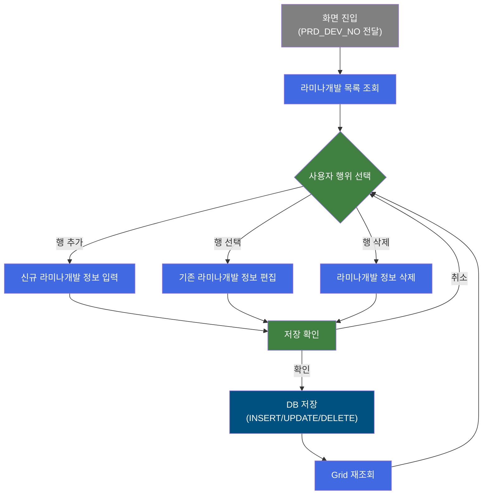
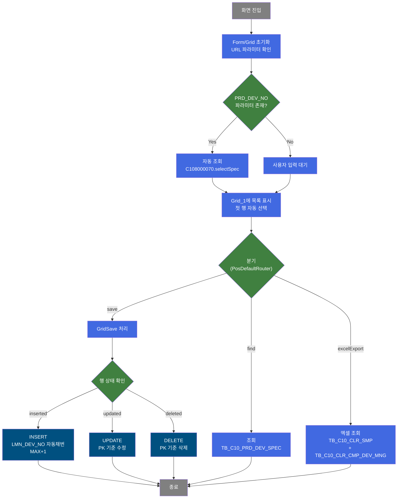
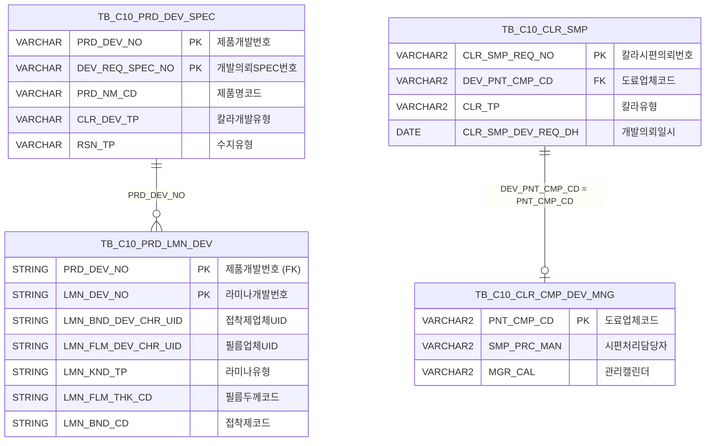

<h1 style="font-size: 40px; text-align: center; font-weight:
   bold; margin: 30px 0;">
  C108000170 레거시 시스템 분석 종합 보고서
</h1>


# 1. 시스템 개요
- **서비스 ID**: C108000170
- **업무명**: 라미나개발 관리
- **분석 일시**: 2026-03-17 10:36 (KST)
- **분석 시간**: 약 5분
- **전체 Activity 수**: 4개 (Built-in 4, Custom 0)
- **분석자**: Claude Opus 4.6
- **분석 도구**: /analyze-service C108000170
- **문서 버전**: 1.0

# 📊 비즈니스 프로세스 분석

## 시스템 목적

라미나개발 관리 화면(C108000170)은 제품개발 과정에서 라미나(Lamina) 관련 개발 정보를 등록, 조회, 수정, 삭제하는 CRUD 화면이다. 라미나는 철강 컬러강판 제조에서 필름을 접착하는 공정에 사용되는 소재로, 접착제 업체, 라미나필름 업체, 필름 두께, 접착제 종류, 시너, 원단위 등 다양한 개발 특성 정보를 관리한다.

이 화면은 제품개발SPEC 조회(C108000070) 화면과 연계하여, 특정 제품개발번호(PRD_DEV_NO)에 대한 라미나개발 상세 정보를 관리한다. URL 파라미터로 PRD_DEV_NO가 전달되면 자동으로 해당 개발번호의 라미나 목록을 조회하며, 사용자는 Grid와 Form을 통해 라미나개발 정보를 편집할 수 있다.

## 핵심 워크플로우 다이어그램



### 상세 워크플로우 다이어그램



## 주요 유즈케이스

### UC-01: 라미나개발 목록 조회
- **Actor**: 제품개발 담당자
- **목적**: 특정 제품개발번호에 대한 라미나개발 상세 정보 목록을 조회하여 개발 현황을 파악

- **전제조건**:
  - 사용자가 시스템에 로그인되어 있음
  - 조회할 제품개발번호(PRD_DEV_NO)가 존재함
  - 제품개발SPEC 화면(C108000070)에서 PRD_DEV_NO가 전달되었거나, 사용자가 직접 입력

- **주요 흐름**:
  1. 화면 진입 시 URL 파라미터로 PRD_DEV_NO가 전달되면 Form_1에 자동 설정
  2. 조회 버튼 클릭 (PRD_DEV_NO 필수 검증)
  3. C108000070.selectSpec 쿼리로 TB_C10_PRD_DEV_SPEC 테이블 조회
  4. Grid_1에 라미나개발 목록 표시, 첫 행 자동 선택
  5. 선택된 행의 상세 정보가 Form_2에 바인딩되어 표시

- **대체 흐름**:
  - PRD_DEV_NO 미입력 시: 필수값 검증 실패 메시지 표시
  - 조회 결과 없는 경우: 빈 Grid 표시, 메시지 박스에 "조회된 데이터가 없습니다" 표시

- **후행조건**:
  - Grid_1에 라미나개발 목록이 표시됨
  - Form_2에 선택 행의 상세 정보가 표시됨

### UC-02: 라미나개발 정보 신규 등록
- **Actor**: 제품개발 담당자
- **목적**: 특정 제품개발번호에 대한 새로운 라미나개발 정보를 등록

- **전제조건**:
  - 라미나개발 목록이 조회된 상태
  - PRD_DEV_NO가 설정된 상태

- **주요 흐름**:
  1. 메뉴(Menu_1)에서 "행추가" 클릭 → Grid_1에 신규 행 추가
  2. Grid_1에서 신규 행 선택 → Form_2가 unlock 상태로 전환 (편집 가능)
  3. Form_2에서 라미나 개발 정보 입력 (접착제 개발완료일시, 접착제 업체, 라미나필름 업체, 라미나유형, 필름두께, 접착제, 시너, 원단위)
  4. Form_2 입력값이 onChange 이벤트로 Grid_1 셀에 실시간 동기화
  5. "저장" 버튼 클릭 → 확인 다이얼로그 표시
  6. 확인 시 C108000170.insertLmnDev 쿼리 실행 → LMN_DEV_NO는 MAX+1 자동채번

- **대체 흐름**:
  - 저장 확인 다이얼로그에서 취소: 저장 중단, 편집 상태 유지
  - 필수값 미입력: Grid 유효성 검사(NotEmpty) 실패 메시지 표시

- **후행조건**:
  - TB_C10_PRD_LMN_DEV에 신규 레코드 INSERT됨
  - Grid_1에 저장된 데이터 반영

### UC-03: 라미나개발 정보 수정
- **Actor**: 제품개발 담당자
- **목적**: 기존 라미나개발 정보의 특성값을 수정

- **전제조건**:
  - 라미나개발 목록이 조회된 상태
  - 수정 대상 행이 존재

- **주요 흐름**:
  1. Grid_1에서 수정할 행 선택
  2. 메뉴(Menu_1)에서 "편집" 클릭 → Form_2 unlock (편집 모드 전환)
  3. Form_2에서 값 수정 → Grid_1에 실시간 동기화
  4. "저장" 버튼 클릭 → 확인 다이얼로그
  5. 확인 시 C108000170.updateLmnDev 쿼리 실행 (PRD_DEV_NO + LMN_DEV_NO 기준)

- **대체 흐름**:
  - 편집 모드에서 다시 "편집" 클릭: Form_2 lock (편집 모드 해제)

- **후행조건**:
  - TB_C10_PRD_LMN_DEV 해당 레코드 UPDATE됨

### UC-04: 라미나개발 정보 삭제
- **Actor**: 제품개발 담당자
- **목적**: 불필요한 라미나개발 정보를 삭제

- **전제조건**:
  - 라미나개발 목록이 조회된 상태
  - 삭제 대상 행이 선택된 상태

- **주요 흐름**:
  1. Grid_1에서 삭제할 행 선택 (다중선택 가능)
  2. 메뉴(Menu_1)에서 "삭제" 클릭 → 선택 행 삭제 표시
  3. "저장" 버튼 클릭 → 확인 다이얼로그
  4. 확인 시 C108000170.deleteLmnDev 쿼리 실행 (PRD_DEV_NO + CLR_DEV_NO 기준)

- **대체 흐름**:
  - 삭제 확인 취소: 삭제 표시 해제

- **후행조건**:
  - TB_C10_PRD_LMN_DEV에서 해당 레코드 DELETE됨

### UC-05: 엑셀 내보내기
- **Actor**: 제품개발 담당자
- **목적**: 칼라시편 관리 정보를 엑셀 파일로 내보내기

- **전제조건**:
  - 조회 조건이 입력된 상태

- **주요 흐름**:
  1. 엑셀 내보내기 기능 실행
  2. C106000010xls.select 쿼리로 TB_C10_CLR_SMP + TB_C10_CLR_CMP_DEV_MNG 데이터 조회
  3. 엑셀 파일로 변환 및 다운로드

- **대체 흐름**:
  - 데이터 없는 경우: 빈 엑셀 파일 생성

- **후행조건**:
  - 사용자 PC에 엑셀 파일 다운로드됨

---
## 비즈니스 로직 상세

### 1. 라미나개발번호(LMN_DEV_NO) 자동채번 로직

- **목적**: 신규 라미나개발 정보 등록 시 제품개발번호별로 고유한 라미나개발번호를 자동 생성
- **처리 케이스**:

  **[케이스 1: 최초 등록]**
  ```
    조건: 해당 PRD_DEV_NO에 라미나개발 데이터가 없음 (MAX(LMN_DEV_NO) = NULL)
    처리:
      1. NVL(MAX(LMN_DEV_NO), '70') → '70' 반환
      2. TO_NUMBER('70') + 1 = 71
      3. TO_CHAR(71) = '71'이 LMN_DEV_NO로 설정
  ```

  **[케이스 2: 추가 등록]**
  ```
    조건: 해당 PRD_DEV_NO에 기존 데이터 존재 (MAX(LMN_DEV_NO) = 'NN')
    처리:
      1. MAX(LMN_DEV_NO) 조회 (예: '75')
      2. TO_NUMBER('75') + 1 = 76
      3. TO_CHAR(76) = '76'이 LMN_DEV_NO로 설정
  ```

- **계산 공식**:
  ```
  LMN_DEV_NO = TO_CHAR(TO_NUMBER(NVL(MAX(LMN_DEV_NO), '70')) + 1)

  예시:
  기존 최대값 없음 → NVL(NULL, '70') = '70' → 70 + 1 = 71
  기존 최대값 '73' → TO_NUMBER('73') + 1 = 74
  ```

- **예외 처리**:
  - LMN_DEV_NO가 숫자가 아닌 경우 → TO_NUMBER 변환 실패 오류 가능
  - 동시 INSERT 시 → 동일 채번 중복 가능 (시퀀스 미사용)

### 2. 코드값 의미명 변환 (엑셀 Export 쿼리)

- **목적**: 코드 테이블의 코드값을 사용자가 이해할 수 있는 의미명으로 변환하여 엑셀에 표시
- **처리 케이스**:

  **[케이스 1: 도료업체코드(DEV_PNT_CMP_CD) 변환]**
  ```
    조건: DEV_PNT_CMP_CD 컬럼에 도료업체 코드값이 저장됨
    처리:
      1. VI_M00_CODE_ACCESS 뷰에서 CD_TP='PNT_CMP_CD', CATEGORY_GROUP_NM='SZ0000' 조건으로 조회
      2. CD_V = DEV_PNT_CMP_CD인 레코드의 CD_V_MEANING 반환
      3. DEV_PNT_CMP_CD_NM 컬럼으로 표시
  ```

  **[케이스 2: 칼라유형(CLR_TP) 변환]**
  ```
    조건: CLR_TP 컬럼에 칼라유형 코드값이 저장됨
    처리:
      1. VI_M00_CODE_ACCESS 뷰에서 CD_TP='CLR_TP', CATEGORY_GROUP_NM='SZ0000' 조건으로 조회
      2. CD_V = CLR_TP인 레코드의 CD_V_MEANING 반환
      3. CLR_TP_NM 컬럼으로 표시
  ```

  **[케이스 3: 프로젝트개발코드(PRJ_DEV_CD) 변환]**
  ```
    조건: PRJ_DEV_CD 값에 따라 DECODE 변환
    처리:
      1. PRJ_DEV_CD = '1' → '1~3회'
      2. PRJ_DEV_CD = '2' → '반복'
      3. 그 외 → 빈 문자열('')
  ```

### 3. 미의뢰현황 필터링 (엑셀 Export 쿼리)

- **목적**: 도료업체/의뢰일/예정일 중 하나라도 누락된 칼라시편을 필터링하여 관리 누락 방지
- **처리 케이스**:

  **[케이스 1: 미의뢰 필터 ON]**
  ```
    조건: NOT_REC_YN = '1'
    처리:
      1. DEV_PNT_CMP_CD IS NULL (도료업체 미지정) OR
      2. CLR_SMP_DEV_REQ_DH IS NULL (의뢰일 미입력) OR
      3. CLR_SMP_DEV_LMT_DH IS NULL (예정일 미입력)
      4. 위 3개 중 하나라도 해당하는 데이터만 표시
  ```

---

# 💾 데이터 요구사항

## 핵심 테이블

### 1. TB_C10_PRD_LMN_DEV - (라미나 개발 정보)
| 컬럼명 | 타입 | PK | 설명 |
|--------|------|----|------|
| PRD_DEV_NO | STRING | ✅ | 제품개발번호 (PK) |
| LMN_DEV_NO | STRING | ✅ | 라미나개발번호 (PK, 자동채번 MAX+1) |
| LMN_BND_DEV_CMP_DH | STRING | | 접착제 개발완료 일시 |
| LMN_BND_DEV_CHR_UID | STRING | | 접착제 개발 업체(담당자) UID |
| LMN_FLM_DEV_CHR_UID | STRING | | 라미나필름 개발 업체(담당자) UID |
| LMN_KND_TP | STRING | | 라미나 종류 유형 |
| LMN_FLM_THK_CD | STRING | | 라미나 필름 두께 코드 |
| LMN_BND_CD | STRING | | 라미나 접착제 코드 |
| LMN_BND_THR_CD | STRING | | 라미나 접착제 시너 코드 |
| LMN_UNT | STRING | | 라미나 원단위 |
| PRT_ROLL_NO | STRING | | 인쇄롤 번호 |
| CREATED_OBJECT_TYPE | STRING | | 생성 객체 타입 |
| CREATED_OBJECT_ID | STRING | | 생성 객체 ID |
| CREATION_PROGRAM_ID | STRING | | 생성 프로그램 ID |
| CREATION_TIMESTAMP | DATE | | 생성 타임스탬프 |
| LAST_UPDATED_OBJECT_TYPE | STRING | | 최종 수정 객체 타입 |
| LAST_UPDATED_OBJECT_ID | STRING | | 최종 수정 객체 ID |
| LAST_UPDATE_PROGRAM_ID | STRING | | 최종 수정 프로그램 ID |
| LAST_UPDATE_TIMESTAMP | DATE | | 최종 수정 타임스탬프 |

### 2. TB_C10_PRD_DEV_SPEC - (제품개발 SPEC)
| 컬럼명 | 타입 | PK | 설명 |
|--------|------|----|------|
| PRD_DEV_NO | VARCHAR | ✅ | 제품개발번호 (PK) |
| DEV_REQ_SPEC_NO | VARCHAR | ✅ | 개발의뢰SPEC번호 (PK) |
| PRD_DEV_SPEC_NO | VARCHAR | | 제품개발SPEC번호 (PRD_DEV_NO+DEV_REQ_SPEC_NO 연결) |
| PRD_NM_CD | VARCHAR | | 제품명코드 |
| CLR_DEV_TP | VARCHAR | | 칼라개발유형 |
| CUS_REQ_HUE_TXT | VARCHAR | | 고객요청색상텍스트 |
| COT_MTH | VARCHAR | | 코팅방법 |
| RSN_TP | VARCHAR | | 수지유형 |
| TLP_TP | VARCHAR | | 톱코트유형 |
| RL_LUS_RT | VARCHAR | | 실제광택도 |
| PNT_FLM_THK_TXT | VARCHAR | | 도막두께텍스트 |
| PTT_FLM_YN | VARCHAR | | 패턴필름여부 |
| ORD_PRE_WGT | NUMBER | | 주문예상중량 |
| DEV_REF_TP | VARCHAR | | 개발참조유형 |
| REF_CLR_CD_TXT | VARCHAR | | 참조칼라코드텍스트 |
| REF_CCL_BOM | VARCHAR | | 참조CCL BOM |
| SIM_HUE_PRG_YN | VARCHAR | | 유사색상진행여부 |

### 3. TB_C10_CLR_SMP - (칼라시편, 엑셀 Export용)
| 컬럼명 | 타입 | PK | 설명 |
|--------|------|----|------|
| CLR_SMP_REQ_NO | VARCHAR2 | ✅ | 칼라시편 의뢰번호 (PK) |
| CLR_SMP_RCP_NO | VARCHAR2 | | 칼라시편 접수번호 |
| CUS_REQ_HUE_TXT | VARCHAR2 | | 고객요청색상 |
| DEV_PNT_CMP_CD | VARCHAR2 | | 개발 도료업체 코드 (FK → VI_M00_CODE_ACCESS) |
| RSN_TP | VARCHAR2 | | 수지유형 (FK) |
| CLR_TP | VARCHAR2 | | 칼라유형 (FK) |
| SAL_CHR_PRS_ID | VARCHAR2 | | 영업담당자 ID (FK) |
| HUE_CD | VARCHAR2 | | 색상코드 (FK) |
| CCL_BOM_NO | VARCHAR2 | | CCL BOM 번호 (FK) |
| PRD_NM_CD | VARCHAR2 | | 제품명코드 (FK) |
| SAL_CHR_REQ_DH | DATE | | 영업담당 의뢰일시 |
| CLR_SMP_DEV_REQ_DH | DATE | | 시편 개발 의뢰일시 |
| CLR_SMP_DEV_LMT_DH | DATE | | 시편 개발 예정일시 |
| CLR_SMP_DEV_END_DH | DATE | | 시편 개발 완료일시 |
| PRJ_DEV_CD | VARCHAR2 | | 프로젝트개발코드 ('1'=1~3회, '2'=반복) |

### 4. TB_C10_CLR_CMP_DEV_MNG - (칼라 업체 개발 관리, 엑셀 Export용)
| 컬럼명 | 타입 | PK | 설명 |
|--------|------|----|------|
| PNT_CMP_CD | VARCHAR2 | ✅ | 도료업체코드 (PK) |
| SMP_PRC_MAN | VARCHAR2 | | 시편 처리 담당자 |
| MGR_CAL | VARCHAR2 | | 관리 캘린더 |

## 데이터 플로우

### 1. 조회
```
[라미나개발 목록 조회]
화면 진입 (PRD_DEV_NO 파라미터 전달)
→ C108000070.selectSpec
  FROM TB_C10_PRD_DEV_SPEC SP
  WHERE PRD_DEV_NO = :PRD_DEV_NO
    AND (DEV_REQ_SPEC_NO = :DEV_REQ_SPEC_NO OR :DEV_REQ_SPEC_NO IS NULL)
  ORDER BY DEV_REQ_SPEC_NO
→ Grid_1에 라미나개발 목록 표시
→ 첫 행 자동 선택 → Form_2에 상세 정보 바인딩
```

### 2. 저장 (INSERT/UPDATE/DELETE)
```
[신규 등록]
Menu_1 "행추가" → Grid에 신규 행 추가
→ Form_2 편집 모드 활성화
→ 라미나 개발 정보 입력 (Form_2 → Grid_1 실시간 동기화)
→ "저장" 버튼 클릭 → 확인 다이얼로그
→ C108000170.insertLmnDev
  INSERT INTO C10APUSER.TB_C10_PRD_LMN_DEV
  VALUES (PRD_DEV_NO, 자동채번(MAX+1), 입력값들, 감사컬럼)
→ Grid 재조회

[수정]
Grid_1 행 선택 → Menu_1 "편집" → Form_2 unlock
→ 값 수정 (Form_2 → Grid_1 동기화)
→ "저장" 버튼 → 확인
→ C108000170.updateLmnDev
  UPDATE C10APUSER.TB_C10_PRD_LMN_DEV
  SET 라미나 특성 컬럼들, 감사컬럼들
  WHERE PRD_DEV_NO = :PRD_DEV_NO AND LMN_DEV_NO = :LMN_DEV_NO

[삭제]
Grid_1 행 선택 → Menu_1 "삭제" → 행 삭제 표시
→ "저장" 버튼 → 확인
→ C108000170.deleteLmnDev
  DELETE FROM C10APUSER.TB_C10_PRD_LMN_DEV
  WHERE PRD_DEV_NO = :PRD_DEV_NO AND CLR_DEV_NO = :CLR_DEV_NO
```

### 3. 엑셀 내보내기
```
[칼라시편 엑셀 Export]
엑셀 내보내기 기능 실행
→ C106000010xls.select
  FROM TB_C10_CLR_SMP A
  LEFT OUTER JOIN TB_C10_CLR_CMP_DEV_MNG B
    ON A.DEV_PNT_CMP_CD = B.PNT_CMP_CD(+)
  WHERE CLR_SMP_DEV_RCP_DH BETWEEN :START AND :END
    AND 선택적 필터 (의뢰번호, 접수번호, 도료업체, 영업담당자, 미의뢰현황)
→ 엑셀 파일 다운로드
```

## SQL 일람표
| SQL 이름 | 쿼리 ID | 타입 | 출처 | 테이블 |
|---------|---------|-----|-------|-------|
| 제품개발SPEC 조회 | C108000070.selectSpec | SELECT | Service | TB_C10_PRD_DEV_SPEC |
| 칼라시편 엑셀 조회 | C106000010xls.select | SELECT | Service | TB_C10_CLR_SMP, TB_C10_CLR_CMP_DEV_MNG |
| 라미나개발 등록 | C108000170.insertLmnDev | INSERT | Service | TB_C10_PRD_LMN_DEV |
| 라미나개발 수정 | C108000170.updateLmnDev | UPDATE | Service | TB_C10_PRD_LMN_DEV |
| 라미나개발 삭제 | C108000170.deleteLmnDev | DELETE | Service | TB_C10_PRD_LMN_DEV |

## ER 다이어그램 (핵심 관계)



관계 설명:
- TB_C10_PRD_DEV_SPEC가 중심 테이블로, PRD_DEV_NO를 통해 TB_C10_PRD_LMN_DEV와 1:N 관계
- TB_C10_CLR_SMP는 DEV_PNT_CMP_CD를 통해 TB_C10_CLR_CMP_DEV_MNG와 N:1 관계 (LEFT OUTER JOIN)
- TB_C10_PRD_LMN_DEV는 직접적인 FK 제약은 없지만, PRD_DEV_NO로 TB_C10_PRD_DEV_SPEC과 논리적 참조 관계

---

# 🖥️ 사용자 인터페이스 요구사항

## 화면 레이아웃 상세

### Layout 구조 (initLayout)
```javascript
{
  itemType: "layout",
  programId: "C108000170",
  dirType: "row",       // 세로 배치
  childSize: "35",      // Form_1: 35px 높이
  splitter: false,
  messageBox: true,     // 상태바 있음
  components: [
    {
      id: "form_area",
      height: "35px",
      component: {
        itemType: "form",
        formId: "C108000170_Form_1"  // 검색 폼
      }
    },
    {
      id: "content_area",
      height: "*",       // 나머지 전체 공간
      component: {
        itemType: "layout",
        dirType: "row",  // 내부 세로 분할
        childSize: "300", // Grid: 300px
        splitter: true,   // 크기 조절 가능
        components: [
          {
            id: "grid_area",
            height: "300px",
            component: {
              itemType: "grid",
              gridId: "C108000170_Grid_1",  // 라미나개발 목록
              menu: "C108000170_Menu_1"
            }
          },
          {
            id: "form2_area",
            height: "*",
            component: {
              itemType: "form",
              formId: "C108000170_Form_2",  // 상세 편집 폼
              bindToGrid: "C108000170_Grid_1"
            }
          }
        ]
      }
    }
  ]
}
```

## 입출력 요소

### Form 컴포넌트
**C108000170_Form_1 (검색 폼)**
- PRD_DEV_NO: input - 개발번호 (labelWidth:75, inputWidth:80)
- LMN_DEV_NO: input - 라미나번호 (labelWidth:75, inputWidth:80)
- LMN_BND_DEV_CHR_UID: input - 접착제업체 (labelWidth:75, inputWidth:80)
- LMN_FLM_DEV_CHR_UID: input - 라미나업체 (labelWidth:75, inputWidth:80)
- find: button - 조회 → findLmnDevGrid 호출
- save: button - 저장 → Grid sendGrid 호출
- winClose: button - 닫기 → 창 닫기

**C108000170_Form_2 (상세 편집 폼, Grid_1에 양방향 바인딩)**
- LMN_DEV_NO: input (readonly) - 라미나개발 번호 (labelWidth:130, inputWidth:100)
- LMN_BND_DEV_CMP_DH: input - 접착제 개발완료 일시 (labelWidth:130, inputWidth:100)
- LMN_BND_DEV_CHR_UID: input - 접착제 개발업체 (labelWidth:130, inputWidth:100)
- LMN_FLM_DEV_CHR_UID: input - 라미나필름 개발업체 (labelWidth:130, inputWidth:100)
- LMN_KND_TP: input - 라미나유형 (labelWidth:130, inputWidth:100)
- LMN_FLM_THK_CD: input - 라미나필름두께 (labelWidth:130, inputWidth:100)
- LMN_BND_CD: input - 라미나접착제 (labelWidth:130, inputWidth:100)
- LMN_BND_THR_CD: input - 라미나접착제시너 (labelWidth:130, inputWidth:100)
- LMN_UNT: input - 라미나원단위 (labelWidth:130, inputWidth:100)
- PRD_DEV_NO: hidden (readonly) - 개발번호 (숨김)

### Grid 컴포넌트

**C108000170_Grid_1 (라미나개발 목록)**
- 편집 가능 여부: 아니오 (읽기 전용, ro 타입)
- Split: 없음
- 다중선택: 예 (multiselect: true)
- 유효성검사: 예 (NotEmpty)
- 주요 컬럼 (10개):

  **숨김 컬럼**:
  - PRD_DEV_NO: ro - 제품개발 번호 (12%, 좌측정렬, 숨김)

  **기본 정보**:
  - LMN_DEV_NO: ro - 라미나개발 번호 (12%, 좌측정렬)
  - LMN_BND_DEV_CMP_DH: ro - 접착제 개발완료 일시 (12%, 좌측정렬)
  - LMN_BND_DEV_CHR_UID: ro - 접착제 개발 업체(담당자) (15%, 좌측정렬)
  - LMN_FLM_DEV_CHR_UID: ro - 라미나필름 개발 업체(담당자) (10%, 좌측정렬)

  **라미나 특성 정보**:
  - LMN_KND_TP: ro - 라미나유형 (8%, 좌측정렬)
  - LMN_FLM_THK_CD: ro - 라미나필름두께 (12%, 좌측정렬)
  - LMN_BND_CD: ro - 라미나접착제 (12%, 좌측정렬)
  - LMN_BND_THR_CD: ro - 라미나접착제시너 (12%, 좌측정렬)
  - LMN_UNT: ro - 라미나원단위 (12%, 좌측정렬)

### Menu 컴포넌트
**C108000170_Menu_1 (Grid 컨텍스트 메뉴)**
- refresh: 새로고침 (refresh.gif) → Grid 재조회
- add: 행추가 (new.gif) → Grid에 신규 행 추가
- remove: 삭제 (remove.gif) → 선택 행 삭제
- edit: 편집 (modify.gif) → Form_2 편집 모드 토글

## 화면 동작 흐름

### 1. 화면 초기 로딩
```
1. 화면 진입
2. Form_1 XLE 로드 완료 (onFormLoadFunction)
   - URL 파라미터에서 PRD_DEV_NO 확인
   - PRD_DEV_NO 존재 시 Form_1에 값 설정, formLoadFlag = true
3. Grid_1 XLE 로드 완료 (onGridLoadFunction)
   - PRD_DEV_NO 파라미터 존재 + formLoadFlag=true → 자동 조회
   - AfterUpdateFinish 이벤트 등록
4. Form_2 XLE 로드 완료 (onFormLoadFunction2)
   - Form_2를 Grid_1에 바인딩 (formObj2.bind)
   - onInputChange/onChange 이벤트로 Grid 셀 값 동기화 설정
5. 상태바(messageBox) 초기화
```

### 2. 라미나개발 조회
```
1. 사용자가 Form_1에 PRD_DEV_NO 입력
2. "조회" 버튼 클릭
3. PRD_DEV_NO 필수값 검증
4. findLmnDevGrid() 함수 호출
5. C108000170-service 서비스 호출 (find 명령)
6. C108000070.selectSpec 쿼리 실행
7. Grid_1에 결과 바인딩
8. loadAfterEvent 콜백:
   - uiCommon.progressOff() 호출
   - 첫 행 자동 선택 (getDhxGrid().selectRow)
   - 메시지 박스에 조회 결과 표시 (findMessage)
```

### 3. 라미나개발 정보 편집 및 저장
```
1. Grid_1에서 행 선택 → onSelectGrid 이벤트
   - inserted 행: Form_2 unlock + CLR_DEV_NO 비활성화
   - 기존 행: Form_2 lock (읽기 전용)
2. Menu_1 "편집" 클릭 → Form_2 lock/unlock 토글
3. Form_2에서 값 수정
   - onInputChange/onChange → bindingFormToGrid로 Grid 셀 동기화
4. Form_1 "저장" 버튼 클릭
   - 신규 행에 PRD_DEV_NO 설정
   - 확인 다이얼로그 표시
   - 확인 시 items[referenceItem].sendGrid() 호출
   - C108000170-service (save 명령) → INSERT/UPDATE/DELETE 실행
```

### 4. 컨텍스트 메뉴 (우클릭)
```
1. Grid_1에서 우클릭 → 컨텍스트 메뉴 표시
2. copy_row: 셀 내용을 클립보드에 복사 (gridObj.cellToClipboard)
3. excel_grid: 현재 Grid 데이터를 엑셀로 내보내기 (gridObj.toExcel)
```

## JavaScript 모듈

**C108000170.jsp (메인 화면 스크립트)**
- findLmnDevGrid(): 라미나개발 목록 조회 (PRD_DEV_NO 필수 검증 후 서비스 호출)
- onFormLoadFunction(): Form_1 XLE 로드 후 URL 파라미터 PRD_DEV_NO 설정
- onGridLoadFunction(): Grid_1 로드 후 자동 조회 및 AfterUpdateFinish 이벤트 등록
- onFormLoadFunction2(): Form_2 → Grid_1 바인딩 및 onChange 동기화 설정
- onSelectGrid(): Grid_1 행 선택 시 Form_2 lock/unlock 처리
- onGridContextMenuClick(): 컨텍스트 메뉴 (복사/엑셀) 처리
- loadAfterEvent(): Grid 로드 완료 후 첫 행 선택, 메시지 표시
- bindingFormToGrid(): Form_2 입력값을 Grid_1 셀에 동기화
- onAfterUpdateFinishEvent(): 저장 완료 후 후처리

## 주요 이벤트 핸들러

**find (조회 버튼 클릭)**
- 이벤트 타입: Form Button
- 처리 내용:
  1. PRD_DEV_NO 필수값 검증
  2. findLmnDevGrid() 호출
  3. C108000170-service (find) 서비스 호출
  4. Grid_1에 결과 데이터 바인딩

**save (저장 버튼 클릭)**
- 이벤트 타입: Form Button
- 처리 내용:
  1. 신규 행(inserted)에 PRD_DEV_NO 설정
  2. 확인 다이얼로그 표시
  3. 확인 시 items[referenceItem].sendGrid() 호출
  4. GridSave Activity → INSERT/UPDATE/DELETE 실행

**onSelectGrid (Grid 행 선택)**
- 이벤트 타입: Grid Row Click
- 처리 내용:
  1. 선택 행의 상태 확인 (inserted/기존)
  2. inserted 행: Form_2 unlock, CLR_DEV_NO 비활성화 (disableItem)
  3. 기존 행: Form_2 lock (읽기 전용)

**edit (편집 메뉴 클릭)**
- 이벤트 타입: Menu Item
- 처리 내용:
  1. Form_2 현재 상태 확인
  2. lock 상태 → unlock (편집 가능)
  3. unlock 상태 → lock (읽기 전용)


---

# 📌 특이사항 및 주의사항

## 1. LMN_DEV_NO 자동채번의 동시성 문제
- **시퀀스 미사용**: LMN_DEV_NO는 `MAX(LMN_DEV_NO) + 1`로 채번하므로, 동시에 여러 사용자가 동일 PRD_DEV_NO에 대해 INSERT 시 중복 채번이 발생할 수 있다
- **초기값 71**: NVL(MAX, '70') + 1 = 71부터 시작하는 특이한 채번 규칙. 기존 데이터와의 호환성을 위한 것으로 추정
- **채번 스키마 차이**: INSERT 쿼리에서 자동채번 시 `C10APUSER.TB_C10_PRD_LMN_DEV` 스키마를 명시적으로 지정하여 서브쿼리 실행

## 2. DELETE 쿼리의 파라미터 불일치
- **삭제 쿼리 파라미터**: `C108000170.deleteLmnDev`에서 WHERE 조건이 `PRD_DEV_NO = :PRD_DEV_NO AND CLR_DEV_NO = :CLR_DEV_NO`로 되어 있음
- **CLR_DEV_NO vs LMN_DEV_NO**: 삭제 시 LMN_DEV_NO가 아닌 CLR_DEV_NO를 파라미터로 사용하는데, 이는 라미나개발번호와 칼라개발번호의 관계에서 비롯된 것으로 추정. 실제 의도와 다를 수 있어 확인 필요

## 3. 엑셀 Export 쿼리의 크로스 서비스 참조
- **C106000010xls.select**: 이 쿼리는 C106000010 서비스의 쿼리 파일에 정의되어 있으나, C108000170 서비스에서 참조하여 사용. 칼라시편 관련 데이터를 공유하는 구조
- **C108000070.selectSpec**: 마찬가지로 C108000070 서비스의 쿼리를 참조. 이런 크로스 참조 패턴은 쿼리 변경 시 영향범위 파악이 어렵게 만듬

## 4. Form_2 ↔ Grid_1 양방향 바인딩
- **실시간 동기화**: Form_2의 onInputChange/onChange 이벤트로 Grid_1 셀 값이 실시간 동기화되는 구조
- **편집 모드 관리**: inserted 행과 기존 행의 편집 모드가 다르게 처리됨 (inserted → 자동 unlock, 기존 → 수동 편집 버튼 필요)
- **CLR_DEV_NO 비활성화**: 신규 행 선택 시 CLR_DEV_NO(LMN_DEV_NO) 필드가 disableItem으로 비활성화되어 자동채번값 수정 방지

## 5. Grid 컬럼 전체 읽기 전용 (ro)
- Grid_1의 모든 컬럼이 `ro` (읽기 전용) 타입으로 설정되어 있어, Grid 직접 편집이 불가하고 반드시 Form_2를 통해서만 데이터 입력/수정 가능
- 이는 Form_2 바인딩을 통한 데이터 무결성 보장을 위한 설계로 보임

---

# 📚 참고 문서

- **Service XML**: `src/service/C108000170-service.xml`
- **Query SQL**:
  - `src/query/C108000170-query.glue_sql`
  - `src/query/C108000070-query.glue_sql` (selectSpec)
  - `src/query/C106000010xls-query.glue_sql` (엑셀 Export)
- **JSP**: `WebContents/C108000170.jsp`
- **UI XML**:
  - `WebContents/header/kr/C108000170/C108000170_Form_1.xml`
  - `WebContents/header/kr/C108000170/C108000170_Form_2.xml`
  - `WebContents/header/kr/C108000170/C108000170_Grid_1.xml`
  - `WebContents/header/kr/C108000170/C108000170_Menu_1.xml`
