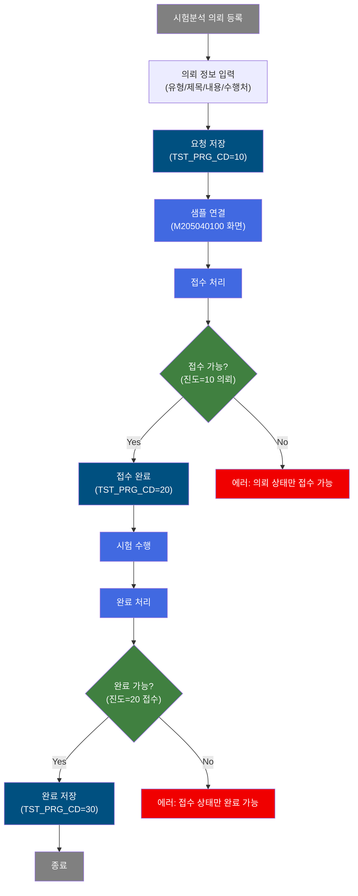
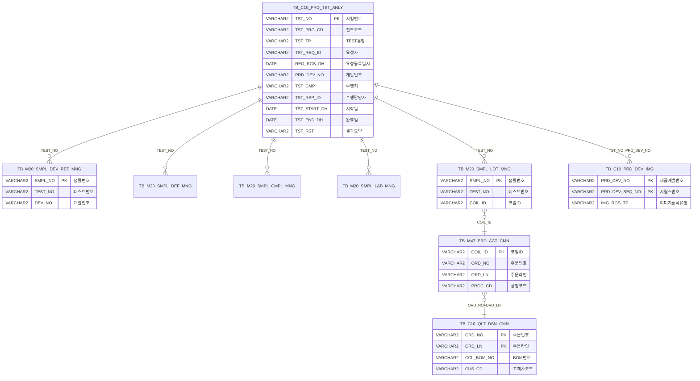

<h1 style="font-size: 40px; text-align: center; font-weight:
   bold; margin: 30px 0;">
  C108000230 레거시 시스템 분석 종합 보고서
</h1>


# 1. 시스템 개요
- **서비스 ID**: C108000230
- **업무명**: 시험/분석 - 개발요청 SPEC 관리
- **분석 일시**: 2026-03-17 10:44 KST
- **전체 Activity 수**: 12개 (Built-in 12개, Custom 0개)
- **분석자**: Claude Opus 4.6 + Sonnet (Phase 3/4)
- **분석 도구**: /analyze-service C108000230
- **문서 버전**: 1.0

# 📊 비즈니스 프로세스 분석

## 시스템 목적

C108000230 서비스는 제품 개발 과정에서 발생하는 시험/분석(TEST) 의뢰를 관리하는 화면이다. 품질 담당자 또는 개발 담당자가 시험 분석을 요청하면, 수행 담당자가 접수하고 시험을 진행한 후 완료 처리하는 워크플로우를 지원한다.

시험 유형에는 개발참조, 부적합, 불만, LAB, LOT 등 다양한 샘플 유형이 존재하며, 각 샘플은 별도의 샘플 관리 테이블(TB_M20_SMPL_*)에서 관리된다. 시험 요청 시 샘플과 테스트 번호를 연결하고, 샘플 연결 해제 시에는 5종 샘플 테이블의 TEST_NO를 일괄 해제하는 체인 처리가 이루어진다.

수행처는 사내/외부기관으로 구분되며, 시험 유형(TST_TP)에 따라 입력 필드의 활성/비활성이 동적으로 제어된다. 첨부파일 관리(요청/완료 구분)와 외부 샘플 관리 화면(M205040100) 연동도 포함한다.

## 핵심 워크플로우 다이어그램



### 상세 워크플로우 다이어그램

```mermaid
flowchart TD
    subgraph 조회기능["조회 기능"]
        F1["조회 (find)"]
        F2["샘플조회 (findSmp)"]
        F3["공급업체 체크 (checkUser)"]
    end

    subgraph 요청등록["요청 등록"]
        R1["행추가 → Grid_1에 신규 행"]
        R1 --> R2["Form_2에서 정보 입력<br/>TST_TP, TST_TITLE, TST_CMP 필수"]
        R2 --> R3["요청저장 → insertDevTest<br/>TST_NO 자동생성(연월일+SEQ)<br/>TST_PRG_CD=10, REQ_RGS_DH=SYSDATE"]
    end

    subgraph 접수처리["접수 처리"]
        A1["접수 버튼 클릭"]
        A1 --> A2{"TST_PRG_CD = 10?"}:::decision
        A2 -->|Yes| A3["필수값 검증<br/>TST_NO, TST_RSP_ID, TST_CMP_DH"]
        A2 -->|No| A4["에러 표시"]:::error
        A3 --> A5["updateReceive 실행<br/>TST_PRG_CD=20<br/>TST_START_DH=SYSDATE"]:::save
    end

    subgraph 완료처리["완료 처리"]
        C1["완료 버튼 클릭"]
        C1 --> C2{"TST_PRG_CD = 20?"}:::decision
        C2 -->|Yes| C3["필수값 검증<br/>TST_NO, TST_RST"]
        C2 -->|No| C4["에러 표시"]:::error
        C3 --> C5["updateComplete 실행<br/>TST_PRG_CD=30<br/>TST_END_DH=SYSDATE"]:::save
    end

    subgraph 샘플연결해제["샘플 연결 해제 체인"]
        S1["removeSmp 실행"]
        S1 --> S2["개발참조샘플 해제<br/>TB_M20_SMPL_DEV_REF_MNG.TEST_NO = ''"]
        S2 --> S3["불만샘플 해제<br/>TB_M20_SMPL_CMPL_MNG.TEST_NO = ''"]
        S3 --> S4["부적합샘플 해제<br/>TB_M20_SMPL_DEF_MNG.TEST_NO = ''"]
        S4 --> S5["LAB샘플 해제<br/>TB_M20_SMPL_LAB_MNG.TEST_NO = ''"]
        S5 --> S6["LOT샘플 해제<br/>TB_M20_SMPL_LOT_MNG.TEST_NO = ''<br/>→ Lot샘플 Test번호 지정"]
    end

    classDef decision fill:#408040,color:#fff
    classDef save fill:#005080,color:#fff
    classDef error fill:#F00000,color:#fff
```



## 주요 유즈케이스

### UC-01: 시험분석 의뢰 조회
- **Actor**: 품질 담당자 / 개발 담당자
- **목적**: 등록된 시험분석 의뢰 목록을 조건별로 조회하여 현재 진행 상태를 확인

- **전제조건**:
  - 사용자가 시스템에 로그인되어 있음
  - 화면 초기화 시 콤보박스(TST_CMP, TST_PRG_CD)가 로드됨
  - 사용자 권한에 따라 공급업체 여부(DIR_INP_YN) 확인 완료

- **주요 흐름**:
  1. 요청일(TST_RGS_DH_FR/TO), 요청자, 개발번호, 진도코드, 수행처 등 검색 조건 입력
  2. 조회 버튼 클릭 → `find()` → `findTestGrid()` 호출
  3. `uiCommon.parameters(C108000230_Form_1)` 로 파라미터 구성
  4. `C108000230_Grid_1.loadData(gridC10Data.do)` → `selectDevTest` 쿼리 실행
  5. Grid_1에 시험분석 목록 표시 (TEST번호, 진도, 유형, 요청자, 의뢰제목 등 25개 컬럼)

- **대체 흐름**:
  - 조회 결과 없음: 빈 Grid 표시, 메시지박스에 건수 0 표시
  - 개발번호(PRD_DEV_NO) 파라미터로 화면 진입 시: 자동 조회 실행

- **후행조건**:
  - Grid_1 첫 행 자동 선택 → Form_2에 상세 정보 바인딩
  - Grid_2에 해당 테스트의 샘플 목록 자동 조회

### UC-02: 시험분석 의뢰 등록 및 수정
- **Actor**: 품질 담당자 / 개발 담당자
- **목적**: 신규 시험분석 의뢰를 등록하거나 기존 의뢰 정보를 수정

- **전제조건**:
  - 사용자가 시스템에 로그인되어 있음
  - 신규 등록 시 행추가(add) 또는 기존 행 선택 후 편집(edit)

- **주요 흐름**:
  1. 메뉴에서 "행추가" 클릭 → Grid_1에 빈 행 추가
  2. Grid_1 행 선택 → Form_2에 상세 정보 표시 → "편집" 메뉴로 잠금 해제
  3. Form_2에서 필수 정보 입력: 의뢰제목(TST_TITLE, 노란배경), 수행처(TST_CMP, 노란배경), 완료기한(CMP_RGS_DH, 노란배경)
  4. TEST유형(TST_TP) 선택 → `onFormtstTpEnable()` 호출로 필드 활성/비활성 제어
  5. "요청저장" 클릭 → `save()` → 필수값 검증 → `dhtmlx.confirm()` 확인
  6. `C108000230_Grid_1.sendGrid(handleDataProcess.do)` → 신규행: `insertDevTest`, 수정행: `updateDevTest` 실행

- **대체 흐름**:
  - 필수값 미입력 시: alert 메시지 표시 (완료기한/의뢰제목/수행처)
  - 삭제 시: "삭제" 메뉴 → `deleteDevTest` 실행 (TST_PRG_CD=10 의뢰 상태만 삭제 가능)

- **후행조건**:
  - 신규 등록 시 TST_NO 자동 생성 (연월일 + 시퀀스)
  - TST_PRG_CD = '10' (의뢰 상태)로 설정
  - 수정 시 콤보값의 '-' 앞부분만 코드로 저장 (SUBSTR 처리)

### UC-03: 시험분석 접수 처리
- **Actor**: 시험 수행 담당자
- **목적**: 의뢰된 시험분석을 접수하여 수행 담당자 및 완료 예정일을 등록

- **전제조건**:
  - 대상 시험분석이 의뢰 상태(TST_PRG_CD = '10')
  - 수행담당자(TST_RSP_ID), 완료예정일(TST_CMP_DH) 입력 완료

- **주요 흐름**:
  1. Grid_1에서 접수할 시험 선택 → Form_2에 상세 표시
  2. "접수" 필드셋에서 수행담당자(TST_RSP_ID, 노란배경), 완료예정일(TST_CMP_DH, 노란배경) 입력
  3. "접수" 버튼 클릭 → `receive()` 호출
  4. 진도코드 검증: TST_PRG_CD가 '10'(의뢰)인지 확인
  5. 필수값 검증: TST_NO, TST_RSP_ID, TST_CMP_DH
  6. `dhtmlx.confirm()` → `sendGrid(handleDataProcess.do, receive)` → `updateReceive` 실행

- **대체 흐름**:
  - TST_PRG_CD ≠ '10': "의뢰 상태에서만 접수할 수 있습니다" 메시지
  - 필수값 미입력: alert 표시

- **후행조건**:
  - TST_PRG_CD = '20' (접수 상태)로 변경
  - TST_START_DH = SYSDATE (시험 시작일 자동 기록)

### UC-04: 시험분석 완료 처리
- **Actor**: 시험 수행 담당자
- **목적**: 시험 완료 후 결과를 기록하고 완료 상태로 전환

- **전제조건**:
  - 대상 시험분석이 접수 상태(TST_PRG_CD = '20')
  - 결과(요약)(TST_RST) 입력 완료

- **주요 흐름**:
  1. Grid_1에서 완료할 시험 선택 → Form_2에 상세 표시
  2. "완료" 필드셋에서 결과(요약)(TST_RST, 노란배경) 입력
  3. "완료" 버튼 클릭 → `complete()` 호출
  4. 진도코드 검증: TST_PRG_CD가 '20'(접수)인지 확인
  5. 필수값 검증: TST_NO, TST_RST
  6. `dhtmlx.confirm()` → `sendGrid(handleDataProcess.do, complete)` → `updateComplete` 실행

- **대체 흐름**:
  - TST_PRG_CD ≠ '20': "접수 상태에서만 완료할 수 있습니다" 메시지

- **후행조건**:
  - TST_PRG_CD = '30' (완료 상태)로 변경
  - TST_END_DH = SYSDATE (시험 완료일 자동 기록)

### UC-05: 샘플 연결 관리
- **Actor**: 품질 담당자
- **목적**: 시험분석에 샘플을 연결(등록)하거나 연결 해제

- **전제조건**:
  - Grid_1에서 시험분석이 선택되어 있음
  - 연결 해제 시 Grid_2에서 대상 샘플이 선택됨

- **주요 흐름**:
  1. "등록" 버튼 클릭 → `simple_call()` → `parent.newRemoveOpenTab(M205040100)` 호출
  2. 샘플 관리 화면(M205040100)에서 TST_NO, PRD_DEV_NO, CLAIM_NO를 파라미터로 전달하여 새 탭 오픈
  3. 샘플 등록 완료 후 Grid_2에 연결된 샘플 목록 표시 (selectTstSmp 쿼리)

- **대체 흐름**:
  - "연결해제" 클릭 → `removeSmp()` → Grid_2 선택행의 SMPL_NO, TST_NO 검증 → 확인 후 체인 실행
  - 연결해제 체인: 개발참조샘플(joinDevTest) → 불만샘플(joinCmplTest) → 부적합샘플(joinDefTest) → LAB샘플(joinLabTest) → LOT샘플(joinLotTest) 순차 UPDATE

- **후행조건**:
  - 연결해제 시 5개 샘플 테이블의 TEST_NO 컬럼이 공백으로 업데이트
  - Grid_2 새로고침으로 변경 반영

### UC-06: 첨부파일 관리
- **Actor**: 품질 담당자 / 시험 수행 담당자
- **목적**: 시험 요청 또는 완료 시 관련 첨부파일(이미지)을 등록/조회

- **전제조건**:
  - Grid_1에서 시험분석이 선택되어 있음
  - TST_NO가 존재

- **주요 흐름**:
  1. Grid_1의 요청첨부파일(FILE_YN) 또는 완료첨부파일(DOC_YN) 아이콘 클릭
  2. `C10_linkC108000010pop02(val)` 호출 → TST_NO 검증
  3. `ui.window` 팝업 오픈: C108000010pop02.jsp (IMG_RGS_TP=1, PRD_DEV_NO=tstNo, PRD_DEV_SEQ_NO=val)

- **대체 흐름**:
  - TST_NO 미존재: 동작 안 함

- **후행조건**:
  - 첨부파일 등록/조회 팝업 표시

---
## 비즈니스 로직 상세

### 1. 시험 진도 상태 관리 (3단계 워크플로우)

- **목적**: 시험분석 의뢰의 생명주기를 3단계(의뢰→접수→완료)로 관리
- **처리 케이스**:

  **[케이스 1: 의뢰 등록 (TST_PRG_CD = '10')]**
  ```
    조건: 신규 행 추가 후 저장
    처리:
      1. TST_NO = TO_CHAR(SYSDATE,'YYYYMMDD') || LPAD(SQ_C10_PRD_TST_ANLY.NEXTVAL, 4, '0') 자동 생성
      2. TST_PRG_CD = '10' 고정
      3. REQ_RGS_DH = SYSDATE (요청등록일시)
      4. TST_REQ_ID = 현재 사용자 ID (VI_M00_CODE_ACCESS에서 로그인ID → 사원번호 변환)
  ```

  **[케이스 2: 접수 처리 (TST_PRG_CD 10→20)]**
  ```
    조건: TST_PRG_CD = '10' (의뢰 상태)
    처리:
      1. TST_PRG_CD = '20' 으로 변경
      2. TST_START_DH = SYSDATE (시험 시작일 자동 기록)
      3. TST_RSP_ID (수행담당자), TST_CMP_DH (완료예정일) 저장
      4. TST_FLD_LOC (Field Test 위치) 저장
  ```

  **[케이스 3: 완료 처리 (TST_PRG_CD 20→30)]**
  ```
    조건: TST_PRG_CD IN ('20','30') (접수 또는 완료 상태)
    처리:
      1. TST_PRG_CD = '30' 으로 변경
      2. TST_END_DH = SYSDATE (시험 완료일 자동 기록)
      3. TST_RST (결과 요약) 저장
  ```

- **예외 처리**:
  - 의뢰 상태가 아닌 건의 접수 시도: "의뢰(10) 상태에서만 접수 가능" 경고
  - 접수 상태가 아닌 건의 완료 시도: "접수(20) 상태에서만 완료 가능" 경고
  - 삭제는 의뢰(10) 상태에서만 가능: WHERE TST_PRG_CD = '10' 조건

### 2. TEST유형(TST_TP)별 필드 제어 로직

- **목적**: 시험 유형에 따라 불필요한 입력 필드를 비활성화하여 데이터 정합성 확보
- **처리 케이스**:

  **[케이스 1: TST_TP = 10/50/60 (개발시험/현장시험/기타)]**
  ```
    처리: TST_LINE(공정), ORD_NO(주문번호) 필드 비활성화
  ```

  **[케이스 2: TST_TP = 20/40 (품질불만시험/LAB시험)]**
  ```
    처리: TST_LINE(공정), ORD_NO(주문번호) 필드 비활성화
  ```

  **[케이스 3: TST_TP = 30 (외부시험)]**
  ```
    처리: TST_OUT_CMP(외부기관), TST_FLD_LOC(Field Test 위치) 필드 비활성화
  ```

### 3. 콤보값 코드 추출 (SUBSTR 패턴)

- **목적**: DHTMLX 콤보박스에서 "코드-명칭" 형태로 전달되는 값에서 코드만 추출하여 저장
- **처리 케이스**:

  **[케이스 1: updateDevTest의 코드 추출]**
  ```
    처리:
      1. TST_TP = SUBSTR(:TST_TP, 0, INSTR(:TST_TP, '-') - 1)
      2. TST_CMP = SUBSTR(:TST_CMP, 0, INSTR(:TST_CMP, '-') - 1)
      3. TST_LINE = SUBSTR(:TST_LINE, 0, INSTR(:TST_LINE, '-') - 1)
    예시: "10-개발시험" → "10"
  ```

### 4. 샘플 통합 조회 (UNION ALL 5종)

- **목적**: 하나의 테스트에 연결된 모든 유형의 샘플을 단일 결과셋으로 조회
- **처리 케이스**:

  **[케이스 1: selectTstSmp UNION ALL 구조]**
  ```
    처리:
      1. TB_M20_SMPL_DEV_REF_MNG (개발참조샘플) - TEST_NO 기준 조회, COIL_ID/CUS_CD 빈값
      2. TB_M20_SMPL_DEF_MNG (부적합샘플) - TEST_NO 기준, COIL_ID/CUS_CD 빈값
      3. TB_M20_SMPL_CMPL_MNG (불만샘플) - TEST_NO 기준, CUS_CD 컬럼값 사용
      4. TB_M20_SMPL_LAB_MNG (LAB샘플) - TEST_NO 기준, COIL_ID/CUS_CD 빈값
      5. TB_M20_SMPL_LOT_MNG (LOT샘플) - TEST_NO 기준, TB_M47_PRD_ACT_CMN(COIL) JOIN, TB_C10_QLT_DSN_CMN(DSN) JOIN
    코드 변환:
      - SMPL_TP → VI_M00_CODE_ACCESS(CD_TP='SMPL_TP') → SMPL_TP_NM
      - CUS_CD → VI_M00_CODE_ACCESS(CD_TP='CUS_CD') → CUS_CD_NM
      - SMPL_STS_CD → VI_M00_CODE_ACCESS(CD_TP='SMPL_STS_CD' 또는 'SMPL_CMPL_STS_CD') → SMPL_STS_CD_NM
      - SMPL_SZ_CD → VI_M00_CODE_ACCESS(CD_TP='SMPL_SZ_CD') → SMPL_SZ_CD_NM
      - PRD_NM_CD → VI_M00_CODE_ACCESS(CD_TP='PRD_NM_CD') → PRD_NM_CD_NM
  ```

### 5. 첨부파일 존재 여부 확인 (스칼라 서브쿼리)

- **목적**: 시험분석 목록 조회 시 요청/완료 첨부파일 존재 여부를 아이콘으로 표시
- **처리 케이스**:

  **[케이스 1: selectDevTest 내 스칼라 서브쿼리]**
  ```
    처리:
      1. TST_REQ_FILE: TB_C10_PRD_DEV_IMG에서 IMG_RGS_TP=1인 요청 첨부 존재 여부 조회
      2. TST_END_FILE: TB_C10_PRD_DEV_IMG에서 완료 첨부 존재 여부 조회
      3. FILE_YN: 요청 첨부파일 존재 여부 (Y/N)
      4. DOC_YN: 완료 첨부파일 존재 여부 (Y/N)
  ```

---

# 💾 데이터 요구사항

## 핵심 테이블

### 1. TB_C10_PRD_TST_ANLY - 시험분석 마스터
| 컬럼명 | 타입 | PK | 설명 |
|--------|------|----|-----|
| TST_NO | VARCHAR2 | ✅ | 시험번호 (YYYYMMDD+SEQ 자동생성) |
| TST_PRG_CD | VARCHAR2 |  | 진도코드 (10:의뢰, 20:접수, 30:완료) |
| TST_TP | VARCHAR2 |  | TEST유형 (10~60) |
| TST_REQ_ID | VARCHAR2 |  | 요청자 사원번호 |
| REQ_RGS_DH | DATE |  | 요청등록일시 |
| PRD_DEV_NO | VARCHAR2 |  | 제품개발번호 |
| CLAIM_NO | VARCHAR2 |  | 불만번호 |
| TST_TITLE | VARCHAR2 |  | 의뢰제목 |
| TST_CONTENT | CLOB |  | 의뢰내용 |
| TST_CMP | VARCHAR2 |  | 수행처 코드 |
| TST_OUT_CMP | VARCHAR2 |  | 외부기관명 |
| TST_LINE | VARCHAR2 |  | 공정 코드 |
| CMP_RGS_DH | DATE |  | 완료기한 |
| ORD_NO | VARCHAR2 |  | 주문번호 |
| TST_RMK | CLOB |  | 특기사항 |
| TST_RSP_ID | VARCHAR2 |  | 수행담당자 사원번호 |
| TST_CMP_DH | DATE |  | 완료예정일 |
| TST_FLD_LOC | VARCHAR2 |  | Field Test 위치 |
| TST_START_DH | DATE |  | Test 시작일 (접수 시 SYSDATE) |
| TST_END_DH | DATE |  | Test 완료일 (완료 시 SYSDATE) |
| TST_RST | VARCHAR2 |  | 결과(요약) |
| CREATED_OBJECT_TYPE | VARCHAR2 |  | 생성 객체 타입 (감사) |
| CREATED_OBJECT_ID | VARCHAR2 |  | 생성 객체 ID (감사) |
| CREATED_PROGRAM_ID | VARCHAR2 |  | 생성 프로그램 ID (감사) |
| CREATION_TIMESTAMP | DATE |  | 생성 타임스탬프 (감사) |
| LAST_UPDATED_OBJECT_TYPE | VARCHAR2 |  | 최종 수정 객체 타입 (감사) |
| LAST_UPDATED_OBJECT_ID | VARCHAR2 |  | 최종 수정 객체 ID (감사) |
| LAST_UPDATE_PROGRAM_ID | VARCHAR2 |  | 최종 수정 프로그램 ID (감사) |
| LAST_UPDATE_TIMESTAMP | DATE |  | 최종 수정 타임스탬프 (감사) |

### 2. TB_M20_SMPL_DEV_REF_MNG - 개발참조 샘플 관리
| 컬럼명 | 타입 | PK | 설명 |
|--------|------|----|-----|
| SMPL_NO | VARCHAR2 | ✅ | 샘플번호 |
| TEST_NO | VARCHAR2 |  | 테스트번호 (시험분석 연결 키) |
| DEV_NO | VARCHAR2 |  | 개발번호 |
| SMPL_TP | VARCHAR2 |  | 샘플유형 |
| SMPL_RCV_DH | DATE |  | 샘플 수령일 |
| SMPL_STS_CD | VARCHAR2 |  | 샘플 상태코드 |
| SMPL_SZ_CD | VARCHAR2 |  | 샘플 사이즈코드 |
| SMPL_QTY | NUMBER |  | 수량 |

### 3. TB_M20_SMPL_DEF_MNG - 부적합 샘플 관리
| 컬럼명 | 타입 | PK | 설명 |
|--------|------|----|-----|
| SMPL_NO | VARCHAR2 | ✅ | 샘플번호 |
| TEST_NO | VARCHAR2 |  | 테스트번호 |

### 4. TB_M20_SMPL_CMPL_MNG - 불만 샘플 관리
| 컬럼명 | 타입 | PK | 설명 |
|--------|------|----|-----|
| SMPL_NO | VARCHAR2 | ✅ | 샘플번호 |
| TEST_NO | VARCHAR2 |  | 테스트번호 |
| CUS_CD | VARCHAR2 |  | 고객사코드 |

### 5. TB_M20_SMPL_LAB_MNG - LAB 샘플 관리
| 컬럼명 | 타입 | PK | 설명 |
|--------|------|----|-----|
| SMPL_NO | VARCHAR2 | ✅ | 샘플번호 |
| TEST_NO | VARCHAR2 |  | 테스트번호 |

### 6. TB_M20_SMPL_LOT_MNG - LOT 샘플 관리
| 컬럼명 | 타입 | PK | 설명 |
|--------|------|----|-----|
| SMPL_NO | VARCHAR2 | ✅ | 샘플번호 |
| TEST_NO | VARCHAR2 |  | 테스트번호 |
| COIL_ID | VARCHAR2 |  | 코일 ID |
| SMTL_SLP_CD | VARCHAR2 |  | 공급업체코드 |
| CUS_APPR_REQ_NO | VARCHAR2 |  | 고객승인요청번호 |

### 7. TB_C10_PRD_DEV_IMG - 제품개발 이미지(첨부파일)
| 컬럼명 | 타입 | PK | 설명 |
|--------|------|----|-----|
| PRD_DEV_NO | VARCHAR2 | ✅ | 제품개발번호 (= TST_NO) |
| PRD_DEV_SEQ_NO | VARCHAR2 | ✅ | 시퀀스번호 |
| IMG_RGS_TP | VARCHAR2 |  | 이미지 등록 유형 (1: 요청) |

### 8. TB_M30_SMTL_SLP_MASTER - 공급업체 마스터
| 컬럼명 | 타입 | PK | 설명 |
|--------|------|----|-----|
| SMTL_SLP_CD | VARCHAR2 | ✅ | 공급업체코드 |
| SMTL_SLP_NM | VARCHAR2 |  | 공급업체명 |
| DIR_INP_YN | VARCHAR2 |  | 직접입력여부 (Y/N, 기본 N) |

### 9. TB_M90_EMP_INF - 직원 정보
| 컬럼명 | 타입 | PK | 설명 |
|--------|------|----|-----|
| EMP_NO | VARCHAR2 | ✅ | 사원번호 |
| EMP_NM | VARCHAR2 |  | 사원명 |

### 10. TB_M47_PRD_ACT_CMN - 생산실적 공통 (코일)
| 컬럼명 | 타입 | PK | 설명 |
|--------|------|----|-----|
| COIL_ID | VARCHAR2 | ✅ | 코일 ID |
| ORD_NO | VARCHAR2 |  | 주문번호 |
| ORD_LN | VARCHAR2 |  | 주문라인 |
| PROC_CD | VARCHAR2 |  | 공정코드 |

### 11. TB_C10_QLT_DSN_CMN - 품질설계 공통
| 컬럼명 | 타입 | PK | 설명 |
|--------|------|----|-----|
| ORD_NO | VARCHAR2 | ✅ | 주문번호 |
| ORD_LN | VARCHAR2 | ✅ | 주문라인 |
| CCL_BOM_NO | VARCHAR2 |  | CCL BOM 번호 |
| CUS_CD | VARCHAR2 |  | 고객사코드 |

## 데이터 플로우

### 1. 조회
```
[시험분석 목록 조회]
조회 버튼 클릭
→ C108000230.selectDevTest
  FROM TB_C10_PRD_TST_ANLY
  LEFT JOIN VI_M00_CODE_ACCESS ON 코드값 변환 (TST_PRG_CD, TST_CMP, TST_LINE)
  LEFT JOIN TB_M90_EMP_INF ON 요청자 사원명 조회
  서브쿼리: TB_C10_PRD_DEV_IMG에서 첨부파일 존재 여부
  WHERE TST_RGS_DH BETWEEN :FR AND :TO
    AND NVL(:TST_REQ_ID, TST_REQ_ID) = TST_REQ_ID
    AND NVL(:PRD_DEV_NO, PRD_DEV_NO) = PRD_DEV_NO
→ Grid_1에 목록 표시

[샘플 목록 조회]
Grid_1 행 선택
→ C108000230.selectTstSmp
  FROM TB_M20_SMPL_DEV_REF_MNG UNION ALL
       TB_M20_SMPL_DEF_MNG UNION ALL
       TB_M20_SMPL_CMPL_MNG UNION ALL
       TB_M20_SMPL_LAB_MNG UNION ALL
       TB_M20_SMPL_LOT_MNG (JOIN TB_M47_PRD_ACT_CMN, TB_C10_QLT_DSN_CMN)
  WHERE TEST_NO = :TST_NO
→ Grid_2에 샘플 목록 표시

[공급업체 체크]
화면 초기화 시
→ C108000230.checkUser
  FROM TB_M30_SMTL_SLP_MASTER
  WHERE SMTL_SLP_CD = :SMTL_SLP_CD
→ DIR_INP_YN 값으로 외부기관 표시/숨김 제어
```

### 2. 등록
```
[신규 시험분석 등록]
요청저장 버튼 클릭 (신규행)
→ C108000230.insertDevTest
  INSERT INTO TB_C10_PRD_TST_ANLY
  (TST_NO = YYYYMMDD+SEQ 자동생성, TST_PRG_CD = '10',
   TST_TP, TST_REQ_ID, REQ_RGS_DH = SYSDATE,
   PRD_DEV_NO, CLAIM_NO, TST_TITLE, TST_CONTENT,
   TST_CMP, TST_OUT_CMP, TST_LINE, CMP_RGS_DH, ORD_NO, TST_RMK,
   감사정보)
→ 의뢰 상태로 등록 완료
```

### 3. 수정
```
[시험분석 수정]
요청저장 버튼 클릭 (기존행)
→ C108000230.updateDevTest
  UPDATE TB_C10_PRD_TST_ANLY
  SET TST_TP = SUBSTR(:TST_TP, 0, INSTR(:TST_TP,'-')-1),
      TST_CMP = SUBSTR(:TST_CMP, 0, INSTR(:TST_CMP,'-')-1),
      TST_LINE = SUBSTR(:TST_LINE, 0, INSTR(:TST_LINE,'-')-1),
      PRD_DEV_NO, CLAIM_NO, TST_TITLE, TST_CONTENT, ...
  WHERE TST_NO = :TST_NO AND TST_PRG_CD = '10'
→ 의뢰 상태 레코드만 수정 가능
```

### 4. 상태 전환 (접수/완료)
```
[접수 처리]
접수 버튼 클릭
→ C108000230.updateReceive
  UPDATE TB_C10_PRD_TST_ANLY
  SET TST_PRG_CD = '20', TST_START_DH = SYSDATE,
      TST_RSP_ID, TST_CMP_DH, TST_FLD_LOC, 감사정보
  WHERE TST_NO = :TST_NO AND TST_PRG_CD = '10'
→ 접수 상태로 전환

[완료 처리]
완료 버튼 클릭
→ C108000230.updateComplete
  UPDATE TB_C10_PRD_TST_ANLY
  SET TST_PRG_CD = '30', TST_END_DH = SYSDATE,
      TST_RST, 감사정보
  WHERE TST_NO = :TST_NO AND TST_PRG_CD IN ('20','30')
→ 완료 상태로 전환
```

### 5. 삭제
```
[시험분석 삭제]
삭제 메뉴 클릭
→ C108000230.deleteDevTest
  DELETE FROM TB_C10_PRD_TST_ANLY
  WHERE TST_NO = :TST_NO AND TST_PRG_CD = '10'
→ 의뢰 상태 레코드만 삭제 가능
```

### 6. 샘플 연결 해제 (체인)
```
[샘플 연결 해제]
연결해제 버튼 클릭 → 5단계 체인 순차 실행:
→ 1. C108000230.joinDevTest: UPDATE TB_M20_SMPL_DEV_REF_MNG SET TEST_NO = '' WHERE SMPL_NO = :SMPL_NO
→ 2. C108000230.joinCmplTest: UPDATE TB_M20_SMPL_CMPL_MNG SET TEST_NO = '' WHERE SMPL_NO = :SMPL_NO
→ 3. C108000230.joinDefTest: UPDATE TB_M20_SMPL_DEF_MNG SET TEST_NO = '' WHERE SMPL_NO = :SMPL_NO
→ 4. C108000230.joinLabTest: UPDATE TB_M20_SMPL_LAB_MNG SET TEST_NO = '' WHERE SMPL_NO = :SMPL_NO
→ 5. C108000230.joinLotTest: UPDATE TB_M20_SMPL_LOT_MNG SET TEST_NO = '' WHERE SMPL_NO = :SMPL_NO
→ 이후 Lot샘플 Test번호 지정 Activity 실행
```

## SQL 일람표
| SQL 이름 | 쿼리 ID | 타입 | 출처 | 테이블 |
|---------|---------|-----|-------|-------|
| 샘플 통합 조회 | C108000230.selectTstSmp | SELECT | Service | TB_M20_SMPL_DEV_REF_MNG, TB_M20_SMPL_DEF_MNG, TB_M20_SMPL_CMPL_MNG, TB_M20_SMPL_LAB_MNG, TB_M20_SMPL_LOT_MNG, TB_M47_PRD_ACT_CMN, TB_C10_QLT_DSN_CMN |
| 시험분석 목록 조회 | C108000230.selectDevTest | SELECT | Service | TB_C10_PRD_TST_ANLY, VI_M00_CODE_ACCESS, TB_M90_EMP_INF, TB_C10_PRD_DEV_IMG |
| 공급업체 정보 조회 | C108000230.checkUser | SELECT | Service | TB_M30_SMTL_SLP_MASTER |
| 부적합샘플 시험번호 해제 | C108000230.joinDefTest | UPDATE | Service | TB_M20_SMPL_DEF_MNG |
| 불만샘플 시험번호 해제 | C108000230.joinCmplTest | UPDATE | Service | TB_M20_SMPL_CMPL_MNG |
| LAB샘플 시험번호 해제 | C108000230.joinLabTest | UPDATE | Service | TB_M20_SMPL_LAB_MNG |
| LOT샘플 시험번호 해제 | C108000230.joinLotTest | UPDATE | Service | TB_M20_SMPL_LOT_MNG |
| 시험분석 완료 처리 | C108000230.updateComplete | UPDATE | Service | TB_C10_PRD_TST_ANLY |
| 시험분석 신규 등록 | C108000230.insertDevTest | INSERT | Service | TB_C10_PRD_TST_ANLY, SQ_C10_PRD_TST_ANLY |
| 시험분석 삭제 | C108000230.deleteDevTest | DELETE | Service | TB_C10_PRD_TST_ANLY |
| 시험분석 수정 | C108000230.updateDevTest | UPDATE | Service | TB_C10_PRD_TST_ANLY |
| 시험분석 접수 처리 | C108000230.updateReceive | UPDATE | Service | TB_C10_PRD_TST_ANLY |
| 개발참조샘플 시험번호 해제 | C108000230.joinDevTest | UPDATE | Service | TB_M20_SMPL_DEV_REF_MNG |

## ER 다이어그램 (핵심 관계)



관계 설명:
- **TB_C10_PRD_TST_ANLY**가 중심 테이블로 모든 관계의 허브 역할
- **샘플 관계**: TST_NO(TEST_NO)를 통해 5종 샘플 테이블과 1:N 관계
- **코일 관계**: LOT 샘플 → COIL_ID → 생산실적(TB_M47_PRD_ACT_CMN) → ORD_NO+ORD_LN → 품질설계(TB_C10_QLT_DSN_CMN)
- **첨부파일 관계**: TST_NO = PRD_DEV_NO를 통한 1:N 관계

---

# 🖥️ 사용자 인터페이스 요구사항

## 화면 레이아웃 상세

### Layout 구조 (initLayout)
```javascript
{
  itemType: "layout",
  dirType: "row",           // 수직 분할
  childSize: "60",          // Form_1: 60px
  splitter: false,
  messageBox: true,         // 하단 상태바
  components: [
    {
      id: "C108000230_Form_1",    // 검색폼 (60px)
      component: { itemType: "form" }
    },
    {
      itemType: "layout",
      dirType: "row",             // 수직 분할
      childSize: "150,450",       // Grid_1: 150px, 나머지: 450px
      splitter: true,             // 크기 조정 가능
      components: [
        {
          id: "C108000230_Grid_1",  // 시험분석 목록 (150px)
          component: { itemType: "grid" }
        },
        {
          id: "C108000230_Form_2",  // 진행 처리 폼 (450px)
          component: { itemType: "form" }
        },
        {
          itemType: "layout",
          dirType: "row",           // 수직 분할
          childSize: "30",          // Form_3: 30px
          splitter: true,
          components: [
            {
              id: "C108000230_Form_3",  // 샘플 건수/버튼 (30px)
              component: { itemType: "form" }
            },
            {
              id: "C108000230_Grid_2",  // 샘플 목록 (나머지)
              component: { itemType: "grid" }
            }
          ]
        }
      ]
    }
  ]
}
```

## 입출력 요소

### Form 컴포넌트

**C108000230_Form_1 (검색 조건)**
- TST_RGS_DH_FR: calendar - 요청일 시작 (80px, YYYY-MM-DD)
- TST_RGS_DH_TO: calendar - 요청일 종료 (80px, YYYY-MM-DD)
- TST_REQ_ID: input - 요청자 (80px, maxLength 10)
- PRD_DEV_NO: input - 개발번호 (80px, maxLength 10)
- TST_PRG_CD: combo - 진도코드 (80px)
- TST_CMP: combo - 수행처 (80px)
- TST_OUT_CMP: input - 외부기관 (80px, maxLength 10)
- receive: linkbutton - 접수 → `receive()` 이벤트
- complete: linkbutton - 완료 → `complete()` 이벤트
- find: button - 조회 → `find()` 이벤트
- save: button - 요청저장 → `save()` 이벤트
- winClose: button - 닫기 → `winClose()` 이벤트

**C108000230_Form_2 (진행 처리 - 3개 필드셋)**

*요청 필드셋*:
- TST_NO: input - TEST번호 (100px, readonly)
- TST_PRG_CD: input - 진도Code (100px, readonly)
- TST_TP: combo - TEST유형 (100px) → onFormtstTpEnable 이벤트
- TST_REQ_ID: input - 요청자 (100px, readonly)
- REQ_RGS_DH: input - 요청일시 (100px, readonly)
- PRD_DEV_NO: input - 개발번호 (100px)
- CLAIM_NO: input - 불만번호 (100px)
- TST_TITLE: input - 의뢰제목 (800px, 노란배경 필수)
- TST_CONTENT: input - 의뢰내용 (800px, rows=3)
- TST_CMP: combo - 수행처 (100px, 노란배경 필수)
- TST_OUT_CMP: input - 외부기관 (100px) + searchIcon 템플릿 (masterPopup)
- TST_LINE: combo - 공정 (90px)
- CMP_RGS_DH: calendar - 완료기한 (100px, 노란배경 필수)
- ORD_NO: input - 주문번호 (100px)
- TST_RMK: input - 특기사항 (500px)

*접수 필드셋*:
- TST_RSP_ID: input - 수행담당자 (100px, 노란배경 필수)
- TST_CMP_DH: calendar - 완료예정일 (100px, 노란배경 필수)
- TST_FLD_LOC: input - Field위치 (100px)

*완료 필드셋*:
- TST_START_DH: input - 시작일 (100px, readonly)
- TST_END_DH: input - 완료일 (100px, readonly)
- TST_RST: input - 결과(요약) (600px, rows=2, 노란배경 필수)

**C108000230_Form_3 (샘플 건수/버튼)**
- SIM_CNT: input - 건 (100px, readonly, 기본값 "0")
- lab_simple_call: linkbutton - 등록 → `simple_call()` 이벤트
- removeSmp: custombutton - 연결해제 (70px, 녹색배경 #D2FFD2) → `removeSmp()` 이벤트

### Grid 컴포넌트

**C108000230_Grid_1 (시험분석 목록)**
- 편집 가능 여부: 아니오 (읽기 전용, ro)
- 컨텍스트 메뉴: C108000230_Menu_1 연결
- 주요 컬럼 (25개):

  **기본 정보**:
  - TST_NO: ro - TEST번호 (10px, 좌측정렬)
  - TST_PRG_CD: ro - 진도 (10px, 좌측정렬)
  - TST_TP: ro - TEST유형 (10px, 좌측정렬)
  - TST_REQ_ID: ro - 요청자 (10px, 좌측정렬)
  - REQ_RGS_DH: ro - 요청일시 (10px, 좌측정렬)
  - PRD_DEV_NO: ro - 개발번호 (10px, 좌측정렬)
  - CLAIM_NO: ro - 불만번호 (10px, 좌측정렬)

  **의뢰 정보**:
  - TST_TITLE: ro - 의뢰제목 (10px, 좌측정렬)
  - TST_CONTENT: ro - 의뢰 내용 (15px, 좌측정렬)
  - TST_CMP: ro - 수행처 (10px, 좌측정렬)
  - TST_OUT_CMP: ro - 수행 외부기관명 (10px, 좌측정렬)
  - TST_LINE: ro - 공정 (5px, 좌측정렬)
  - CMP_RGS_DH: ro - 완료기한 (10px, 좌측정렬)
  - ORD_NO: ro - 주문번호 (12px, 좌측정렬)
  - TST_RMK: ro - 특기사항 (15px, 좌측정렬)

  **첨부/수행 정보**:
  - FILE_YN: ro - 요청첨부파일 (6px, 좌측정렬) → 아이콘 클릭 시 첨부파일 팝업
  - TST_RSP_ID: ro - 수행담당자 (12px, 좌측정렬)
  - TST_CMP_DH: ro - 완료예정일 (12px, 좌측정렬)
  - TST_FLD_LOC: ro - Field Test 위치 (12px, 좌측정렬)
  - TST_START_DH: ro - Test 시작일 (12px, 좌측정렬)
  - TST_END_DH: ro - Test 완료일 (12px, 좌측정렬)
  - TST_RST: ro - 결과(요약) (12px, 좌측정렬)
  - DOC_YN: ro - 완료첨부파일 (12px, 좌측정렬) → 아이콘 클릭 시 첨부파일 팝업

  **숨김 컬럼**:
  - TST_REQ_FILE: ro - 요청YN (숨김)
  - TST_END_FILE: ro - 완료YN (숨김)

**C108000230_Grid_2 (샘플 목록)**
- 편집 가능 여부: 아니오 (읽기 전용, ro)
- 컨텍스트 메뉴: 있음
- 주요 컬럼 (18개):

  **샘플 기본 정보**:
  - SMPL_NO: ro - 샘플번호 (8px, 중앙정렬)
  - TST_NO: ro - 테스트No (8px, 중앙정렬)
  - DEV_NO: ro - 개발No (8px, 중앙정렬)
  - CMPL_NO: ro - 불만No (8px, 중앙정렬)
  - SMPL_TP_NM: ro - 샘플유형 (8px, 좌측정렬)
  - SMPL_DH: ro - 등록일자 (8px, 중앙정렬)

  **코일/제품 정보**:
  - COIL_ID: ro - 코일정보(코일ID) (6px, 중앙정렬)
  - PRD_NM_CD_NM: ro - 품명 (5px, 중앙정렬)
  - CCL_BOM_NO: ro - BOM (7px, 중앙정렬)
  - PROC_CD: ro - 공정 (5px, 중앙정렬)

  **고객/상태 정보**:
  - CUS_CD_NM: ro - 고객사 (-1=나머지공간, 좌측정렬)
  - SMPL_STS_CD_NM: ro - 샘플(상태) (7px, 좌측정렬)
  - SMPL_SZ_CD_NM: ro - Size (6px, 좌측정렬)
  - SMPL_QTY: ro - 수량 (5px, 우측정렬)

  **숨김 컬럼**:
  - SMTL_SLP_CD: ro - 공급업체 (숨김)
  - SMPL_SZ_CD: ro - 샘플size (숨김)
  - SMPL_TP: ro - 샘플유형 (숨김)
  - CUS_APPR_REQ_NO: ro - 고객승인요청No (숨김)

### Menu 컴포넌트

**C108000230_Menu_1 (Grid_1 컨텍스트 메뉴)**
- refresh: 새로고침 (refresh.gif) → `refresh()` 이벤트
- add: 행추가 (new.gif) → `add()` 이벤트
- remove: 삭제 (remove.gif) → `remove()` 이벤트
- edit: 편집 (modify.gif) → `edit()` 이벤트

## 화면 동작 흐름

### 1. 화면 초기 로딩
```
1. 화면 진입 → onFormLoadFunction() 실행
2. PRD_DEV_NO 파라미터 확인 (외부 화면에서 전달된 경우)
3. 사용자 권한 확인: c10AjaxData.do 호출 → checkUser 쿼리 실행
   - DIR_INP_YN 값으로 TST_OUT_CMP 필드 표시/숨김 제어
4. 날짜 초기화 (TST_RGS_DH_FR/TO 기본값 설정)
5. 콤보박스 초기화: TST_CMP(수행처), TST_PRG_CD(진도코드)
6. onFormLoadFunction2() → Form_2를 Grid_1에 바인딩
   - onInputChange, onChange 이벤트 연결
   - 콤보박스 초기화: TST_TP(TEST유형), TST_CMP(수행처), TST_LINE(공정)
   - onFormtstTpEnable() 호출
7. onGridLoadFunction() → PRD_DEV_NO 존재 시 findTestGrid() 자동 조회
8. 상태바 초기화 (messageBox)
```

### 2. 조회 후 상세 보기
```
1. 사용자가 검색 조건 입력 (요청일, 요청자, 개발번호, 진도코드, 수행처)
2. "조회" 버튼 클릭 → find() → findTestGrid()
3. uiCommon.parameters(C108000230_Form_1) 호출하여 파라미터 구성
4. C108000230_Grid_1.loadData(gridC10Data.do) → selectDevTest 실행
5. loadAfterEvent() → 첫 행 자동 선택 → findMessage()로 건수 메시지 표시
6. onSelectGrid() 자동 트리거:
   - Form_2 잠금/해제 상태 설정
   - findSmpGrid() → parameters14() → Grid_2 데이터 로드 (selectTstSmp)
   - 첨부파일 이미지 아이콘 상태 업데이트 (TST_REQ_FILE, TST_END_FILE 기반)
7. loadAfterEvent2() → Grid_2 첫 행 자동 선택, Form_3 SIM_CNT에 샘플 건수 설정
```

### 3. 요청 등록/수정 프로세스
```
1. "행추가" 메뉴 클릭 → add() → Grid_1.addRow()
   또는 기존 행 선택 후 "편집" 메뉴 → edit() → Form_2 잠금 해제
2. Form_2에서 정보 입력:
   - TST_TP 선택 → onFormtstTpEnable() → 유형별 필드 활성/비활성 제어
   - 필수값: TST_TITLE(의뢰제목), TST_CMP(수행처), CMP_RGS_DH(완료기한)
   - bindingFormToGrid() → Form_2 값 변경 시 Grid_1 선택행에 즉시 반영
3. "요청저장" 클릭 → save()
4. 필수값 검증: CMP_RGS_DH, TST_TITLE, TST_CMP
5. dhtmlx.confirm() 확인 다이얼로그
6. C108000230_Grid_1.sendGrid(handleDataProcess.do)
   - 신규행(inserted): insertDevTest 실행
   - 수정행(updated): updateDevTest 실행
   - 삭제행(deleted): deleteDevTest 실행
7. onAfterUpdateFinishEvent → 그리드 새로고침
```

### 4. 샘플 관리 (외부 화면 연동)
```
1. "등록" 링크버튼 클릭 → simple_call()
2. Grid_1에서 TST_NO, PRD_DEV_NO, CLAIM_NO 추출
3. parent.newRemoveOpenTab("M205040100") → 샘플 관리 화면 새 탭 오픈
   - 파라미터: TST_NO, PRD_DEV_NO, CLAIM_NO
4. 샘플 관리 화면에서 작업 완료 후 복귀
5. Grid_2 새로고침으로 연결된 샘플 확인
```

### 5. 첨부파일 팝업
```
1. Grid_1에서 FILE_YN 또는 DOC_YN 아이콘 클릭
2. C10_linkC108000010pop02(val) 호출
3. TST_NO 검증 (빈값이면 무시)
4. ui.window 팝업 오픈: C108000010pop02.jsp
   - IMG_RGS_TP=1, PRD_DEV_NO=tstNo, PRD_DEV_SEQ_NO=val(1 또는 2)
```

## JavaScript 모듈

**C108000230.jsp (메인 화면 스크립트 - JSP 내장)**
- find(): 조회 → findTestGrid() 호출
- findTestGrid(): uiCommon.parameters(Form_1) → Grid_1.loadData(gridC10Data.do)
- save(): 필수값 검증(CMP_RGS_DH, TST_TITLE, TST_CMP) → dhtmlx.confirm() → Grid_1.sendGrid()
- receive(): 진도코드 검증(10) → 필수값 검증(TST_NO, TST_RSP_ID, TST_CMP_DH) → Grid_1.sendGrid(receive)
- complete(): 진도코드 검증(20) → 필수값 검증(TST_NO, TST_RST) → Grid_1.sendGrid(complete)
- onSelectGrid(): Grid_1 행 선택 → Form_2 바인딩 + Grid_2 로드 + 첨부파일 아이콘 상태
- findSmpGrid(): parameters14() → Grid_2.loadData(basicGridData.do, findSmp)
- onFormLoadFunction(): PRD_DEV_NO 파라미터 설정, 권한 확인, 날짜/콤보 초기화
- onFormLoadFunction2(): Form_2↔Grid_1 바인딩, 이벤트 연결, 콤보 초기화
- onGridLoadFunction(): PRD_DEV_NO 존재 시 자동 조회
- bindingFormToGrid(): Form_2 값 변경 → Grid_1 선택행 컬럼 업데이트
- edit(): Form_2 잠금/해제 토글 + onFormtstTpEnable()
- refresh(): Grid_1 클리어 + findTestGrid()
- add(): Grid_1.addRow() 행 추가
- remove(): Grid_1.removeRow() 행 삭제
- simple_call(): Grid_1에서 키값 추출 → parent.newRemoveOpenTab(M205040100)
- removeSmp(): Grid_2 선택행 SMPL_NO/TST_NO 검증 → dhtmlx.confirm() → Grid_2.sendGrid(removeSmp)
- C10_linkC108000010pop02(val): TST_NO 검증 → 첨부파일 팝업 오픈
- masterPopup(): 외부기관 검색 → ui.window 팝업(masterGridData.do, CD_TP=PNT_CMP_CD)
- onFormtstTpEnable(tstTp): TST_TP 값별 필드 활성/비활성 제어
- onGridContextMenuClick(): copy_row(클립보드 복사), excel_grid(엑셀 내보내기)
- loadAfterEvent(): Grid_1 로드 완료 → 첫 행 선택 + findMessage()
- loadAfterEvent2(): Grid_2 로드 완료 → 첫 행 선택 + SIM_CNT 건수 설정

## 주요 이벤트 핸들러

**onSelectGrid (Grid_1 행 선택)**
- 이벤트 타입: Grid Row Click
- 처리 내용:
  1. 선택된 행의 TST_PRG_CD에 따라 Form_2 잠금/해제 제어
  2. findSmpGrid() 호출하여 Grid_2 샘플 데이터 로드
  3. TST_REQ_FILE/TST_END_FILE 값 기반으로 첨부파일 이미지 아이콘 상태 업데이트

**onFormtstTpEnable (TST_TP 값 변경)**
- 이벤트 타입: Combo Change / Form Load
- 처리 내용:
  1. TST_TP = 10/50/60: TST_LINE, ORD_NO 비활성화
  2. TST_TP = 20/40: TST_LINE, ORD_NO 비활성화
  3. TST_TP = 30: TST_OUT_CMP, TST_FLD_LOC 비활성화

**bindingFormToGrid (Form_2 값 변경 → Grid_1 동기화)**
- 이벤트 타입: Form InputChange
- 처리 내용:
  1. Form_2에서 변경된 필드 감지
  2. Grid_1 선택 행의 해당 컬럼에 즉시 값 반영
  3. Grid_1의 행 상태를 "updated"로 변경

---

# 📌 특이사항 및 주의사항

## 1. 5종 샘플 테이블 일괄 연결 해제 체인
- **체인 실행 패턴**: 개발참조(joinDevTest) → 불만(joinCmplTest) → 부적합(joinDefTest) → LAB(joinLabTest) → LOT(joinLotTest) → Lot 지정 순차 실행
- **비효율**: 실제로는 해당 샘플의 유형에 관계없이 5개 테이블 모두에 UPDATE를 실행. 해당 SMPL_NO가 존재하지 않는 테이블에서는 0건 UPDATE가 됨
- **트랜잭션**: 하나의 체인으로 묶여 있어 중간 실패 시 전체 롤백됨

## 2. 콤보값 SUBSTR 코드 추출 패턴
- **패턴**: DHTMLX 콤보박스의 값이 "코드-명칭" 형태(예: "10-개발시험")로 전달됨
- **SQL 처리**: `SUBSTR(:TST_TP, 0, INSTR(:TST_TP, '-') - 1)` 패턴으로 코드 부분만 추출
- **주의**: INSTR 결과가 0인 경우(구분자 없음) SUBSTR 결과가 예상과 다를 수 있으며, 이에 대한 방어 로직 없음
- **적용 컬럼**: TST_TP, TST_CMP, TST_LINE (updateDevTest에서)

## 3. 시험번호(TST_NO) 자동 생성 규칙
- **생성 규칙**: `TO_CHAR(SYSDATE, 'YYYYMMDD') || LPAD(SQ_C10_PRD_TST_ANLY.NEXTVAL, 4, '0')` - 시퀀스 객체(SQ_C10_PRD_TST_ANLY) 사용
- **요청자 ID 변환**: `VI_M00_CODE_ACCESS` 뷰에서 로그인 ID(ObjectId)를 사원번호(TST_REQ_ID)로 변환하는 서브쿼리 포함
- **주의**: 시퀀스 기반으로 동시 등록 시 번호 건너뛰기 가능

## 4. 상태 전환 시 조건 검증의 비대칭
- **접수**: WHERE TST_PRG_CD = '10' (의뢰 상태만 가능)
- **완료**: WHERE TST_PRG_CD IN ('20', '30') (접수 및 완료 상태 모두 가능 - 재완료 허용)
- **삭제**: WHERE TST_PRG_CD = '10' (의뢰 상태만 가능)
- **수정**: WHERE TST_PRG_CD = '10' (의뢰 상태만 가능)
- 완료 처리가 재실행 가능하도록 설계되어 있어, 이미 완료된 건의 결과(TST_RST) 수정이 가능

## 5. 첨부파일 관리의 테이블 공유 패턴
- **TB_C10_PRD_DEV_IMG** 테이블을 제품개발(PRD_DEV_NO)과 시험분석(TST_NO)이 공유하여 사용
- TST_NO 값을 PRD_DEV_NO 컬럼에 저장하는 형태로, 도메인적으로 의미가 다른 값이 같은 컬럼에 혼용됨
- IMG_RGS_TP로 구분: 1=요청 첨부, PRD_DEV_SEQ_NO로 요청/완료 구분(val=1 또는 2)

## 6. 외부 화면 연동 (M205040100)
- 샘플 등록 시 현재 화면이 아닌 별도 탭(M205040100 - 샘플 관리)을 새로 열어 처리
- `parent.newRemoveOpenTab()` 호출로 기존 동일 탭을 닫고 새로 오픈
- 콜백 메커니즘이 없어, 샘플 등록 후 수동으로 Grid_2를 새로고침해야 반영됨

## 7. 공급업체 권한 기반 UI 제어
- 화면 초기화 시 `checkUser` 쿼리로 공급업체 여부(DIR_INP_YN) 확인
- 공급업체 사용자(SMTL_SLP_CD 기반)의 경우 TST_OUT_CMP(외부기관) 필드 표시/숨김 제어
- 이 권한 체크는 AJAX(c10AjaxData.do)로 비동기 처리됨

---

# 📚 참고 문서

- **Query SQL**: `src/query/C108000230-query.glue_sql`
- **Service XML**: `src/service/C108000230-service.xml`
- **JS**: `WebContents/C108000230.jsp` (JSP 내장 JavaScript)
- **Form XML**: `WebContents/header/kr/C108000230/C108000230_Form_1.xml`, `C108000230_Form_2.xml`, `C108000230_Form_3.xml`
- **Grid XML**: `WebContents/header/kr/C108000230/C108000230_Grid_1.xml`, `C108000230_Grid_2.xml`
- **Menu XML**: `WebContents/header/kr/C108000230/C108000230_Menu_1.xml`
