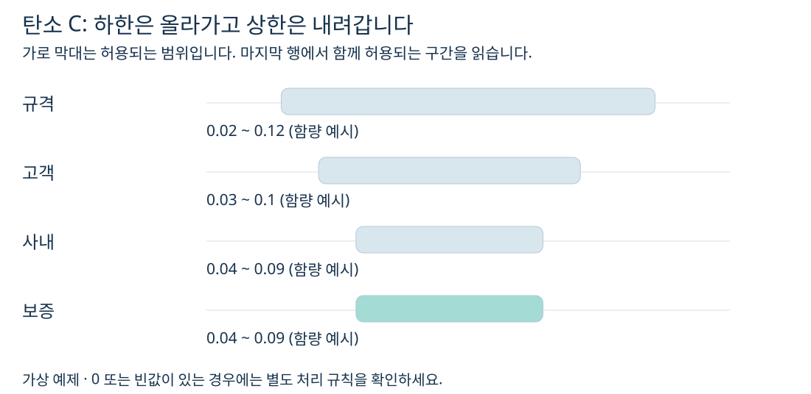
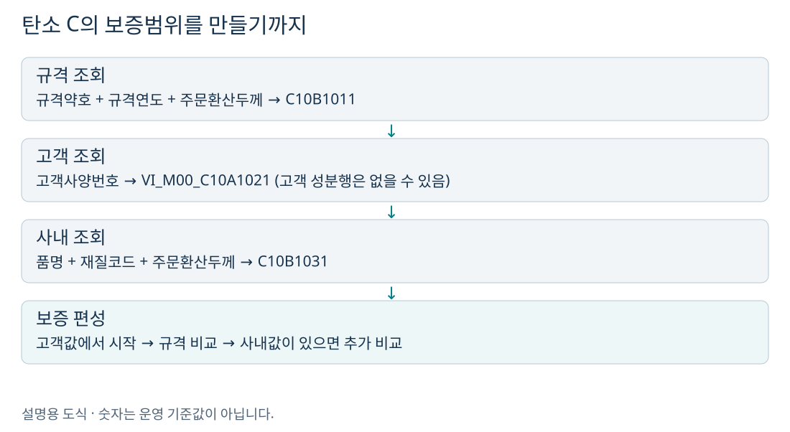
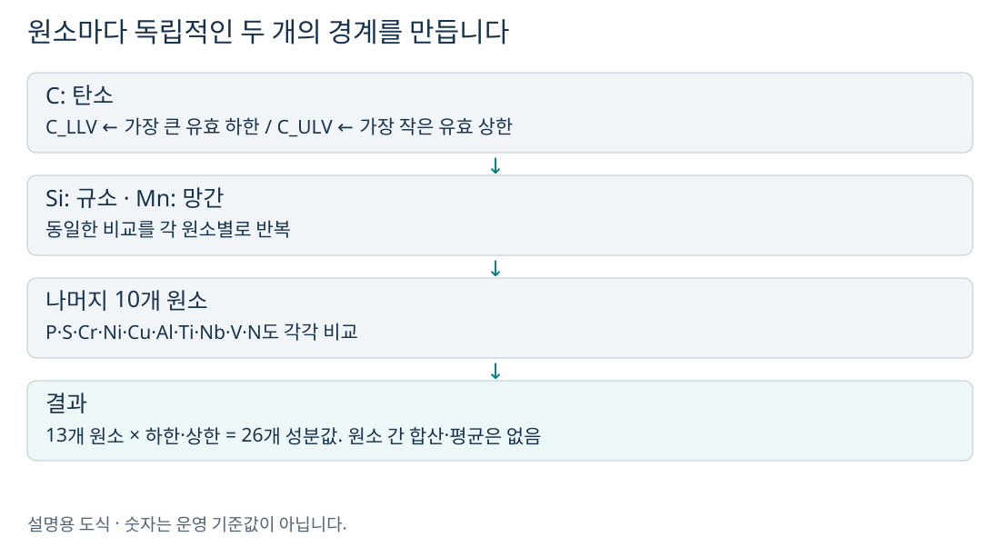
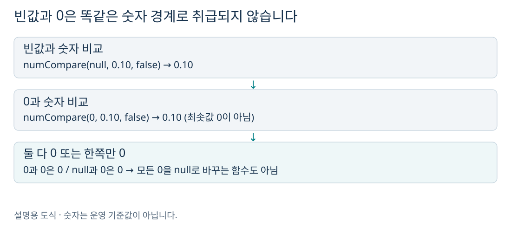
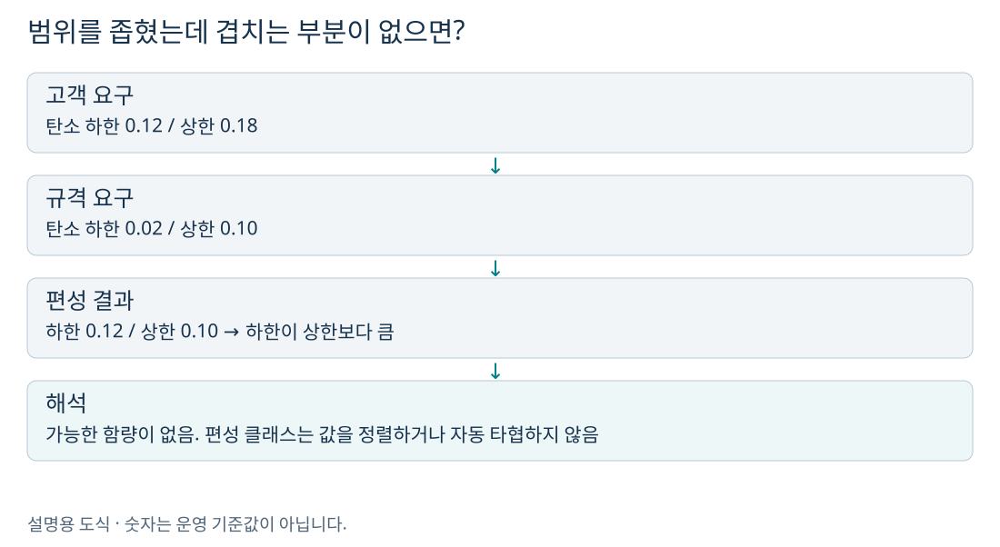

# 세 설계는 어디에 쓰이나요?

성분설계는 **무엇이 얼마나 들어 있는 강재를 허용할지**, 재질설계는 **어떤 강도·연신율·시험조건을 요구할지**, 인수도설계는 **납품 제품의 치수와 형상을 어디까지 허용할지**를 정합니다. 여기서 설계값은 검사 실측값이 아니라, 주문별로 편성하는 요구 사양입니다.

| 구분 | 쉽게 말하면 | 대표 결과 | 저장 테이블 끝 이름 |
|---|---|---|---|
| 성분 | 성분별 허용 함량 | C·Si·Mn 등의 하한/상한 | CHM |
| 재질 | 성능과 시험 요구 | TS·YP·연신율·시험 지시 | MQL |
| 인수도 | 납품 치수·형상 허용 | 두께·폭·길이 공차, 형상값 | DLV |

`QLT_DSN_SPC_TP`는 **1 고객 / 2 규격 / 3 사내 / 4 보증**입니다. 폭설계에서 보았던 적정·차선 구분 `QLT_DSN_MNF_TP`와 별개입니다. 이 세 사양은 주문번호·주문행·사양구분으로 저장하며, 적정·차선 원자재마다 같은 방식으로 별도 행을 만드는 구조가 아닙니다.

메인 서비스의 실행 순서는 **설계 Key → 규격 → 고객 → 사내 → 보증 성분 → 보증 재질 → 보증 인수도 → 제조·원자재·치수 설계 → 타당성 검사**입니다. 사양구분 숫자 순서와 실행 순서를 혼동하지 마세요. 사내 단계는 성분·재질을 다루며 인수도에는 이 클래스의 사내 분기가 없습니다.

> 이 문서는 현재 저장소의 Java·서비스 XML·SQL을 분석했습니다. 예제 숫자와 문자 코드 A/B/C는 설명용 가상값입니다. 운영 MD(기준정보)의 실제 행, 계산식 실행 결과, DB 저장 결과를 조회한 문서는 아닙니다.

# 그림으로 먼저 이해하기: 성분의 허용범위를 정합니다

예를 들어 고객이 “탄소는 0.03~0.10”, 규격은 “0.02~0.12”, 사내는 “0.04~0.09”를 요구한다고 해봅시다. 세 조건을 함께 만족하는 범위는 **0.04~0.09**입니다. 탄소 투입량이나 배합 비율을 계산하는 단계가 아니라, 성분별 요구 하한·상한을 정하는 단계입니다.

하한은 “이 값 이상이어야 한다”이므로 큰 값을, 상한은 “이 값 이하여야 한다”이므로 작은 값을 고릅니다. 평균을 내지 않습니다. 다만 코드의 0·빈값 처리 때문에 모든 경우를 수학적 교집합으로 설명할 수는 없습니다.

# 입력값은 어떻게 기준을 찾아가나요?

| 사양 | 조회처 | 입력 키 | 결과 처리 |
|---|---|---|---|
| 고객 1 | VI_M00_C10A1021 | CUS_BTH_PAP_NO | 1행이면 복사, 0행이면 false로 해당 하위 서비스 종료 |
| 규격 2 | C10B1011 | SPC_AVR, SPC_YR, ORD_EXC_THK | 정확히 1개 기준을 요구 |
| 사내 3 | C10B1031 | PRD_NM_CD, MQL_CD, ORD_EXC_THK | 정확히 1개 기준을 요구 |
| 보증 4 | C102100CHM.select | ORD_NO, ORD_LN, 사양구분 | 고객 → 규격 → 사내 순서로 비교 |

고객사양번호가 없으면 바깥 고객 서비스에서 성분·재질 조회를 건너뜁니다. 번호가 있어도 고객 성분 조회 결과가 0행이면 이 성분 하위 서비스는 저장 없이 끝납니다. 보증 편성에서는 **규격행이 반드시 있어야 하며**, 고객행·사내행은 있을 때 반영합니다. 다만 “보증 단계에서 사내행 생략 가능”과 “앞선 사내 기준 조회 실패가 정상”은 서로 다른 이야기입니다.

# 실제 비교를 한 줄씩 따라가기

| 단계 | C 하한 | C 상한 | 선택 이유 |
|---|---:|---:|---|
| 고객으로 시작 | 0.03 | 0.10 | 고객행 값을 작업 문맥에 복사 |
| 규격 0.02~0.12 비교 | 0.03 | 0.10 | max(0.03,0.02), min(0.10,0.12) |
| 사내 0.04~0.09 비교 | 0.04 | 0.09 | 사내 요구가 양쪽을 더 좁힘 |
| 보증행 저장 | 0.04 | 0.09 | 사양구분 4로 INSERT |

숫자가 비어 있지 않고 0도 아닐 때: **보증 하한 = max(고객, 규격, 사내 하한)**, **보증 상한 = min(고객, 규격, 사내 상한)**입니다. 각 항목을 따로 비교하므로 탄소 하한은 사내, 탄소 상한은 고객 등 출처가 달라도 됩니다.

| 기호 | 원소 | 기호 | 원소 |
|---|---|---|---|
| C | 탄소 | Si | 규소 |
| Mn | 망간 | P | 인 |
| S | 황 | Cr | 크롬 |
| Ni | 니켈 | Cu | 구리 |
| Al | 알루미늄 | Ti | 티타늄 |
| Nb | 니오븀 | V | 바나듐 |
| N | 질소 | LLV / ULV | 하한 / 상한 |

함량 단위와 자릿수는 실제 MD·화면 정의와 함께 확인해야 합니다. 이 클래스는 단위 변환이나 13개 원소 총합 100% 검사를 하지 않습니다.

# 빈값·0·충돌은 어떻게 읽나요?

`numCompare(Object,Object,mode)`는 먼저 빈값을 검사합니다. 두 번째가 비면 첫 번째를, 첫 번째가 비면 두 번째를 반환합니다. 둘 다 있으면 0을 제외한 뒤 큰 값/작은 값을 선택합니다. 따라서 0을 엄격한 상한으로 사용하려는 경우 코드 해석에 주의해야 합니다.

`DbSearchChemData` 자체에는 최종 하한 > 상한을 자동으로 뒤집거나 범위를 완화하는 처리가 없습니다. 뒤의 `DbSearchDsnValidData`가 성분 범위 및 규격·고객과 보증의 관계를 검사하지만, 실제 오류 검출은 검사 구현과 데이터 조건을 함께 확인해야 합니다.

# 예제 선택으로 비교하기

# 코드·저장 구조와 오류 찾기

성분 결과는 `TB_C10_QLT_DSN_CHM`에 저장됩니다. `C102100CHM.select`는 주문번호·주문행·사양구분으로 성분값만 읽습니다. 보증 서비스 `C102100130`은 성분 26개를 초기화하고 편성 클래스를 실행한 뒤 `C102100CHM.insert`로 보증행을 등록합니다.

| 확인 지점 | 대표 코드 | 의미 |
|---|---|---|
| 고객 조회 중복 | KC11 | 고객 성분이 2행 이상 |
| 규격 조회 | KS02 / KS12 | 기준 없음·조회 문제 / 중복 |
| 사내 조회 | KN01 / KN11 | 기준 0건 / 중복 |
| 보증 편성 | KS22 | 규격 성분 결과행 없음 |
| 저장 실패 | TB02 | 보증 성분 INSERT 실패 경로 |

오류코드 이름만으로 원인을 단정하지 마세요. 예를 들어 사내 조회의 필수 입력 누락에는 코드상 KS11이 사용되기도 합니다. 서비스 단계·입력 키·오류 메시지를 같이 확인해야 합니다.

# 실제 주문을 확인하는 순서

1. 주문번호와 주문행으로 대상 한 건을 고정합니다.
2. 공통정보에서 규격약호·연도·고객사양번호·품명·재질코드·주문환산치수를 확인합니다.
3. 아래 기준정보의 조회 키와 일치하는 MD 행을 확인합니다. 실제 임계값은 이 MD에 있습니다.
4. 결과 테이블의 사양구분 1·2·3·4를 나란히 봅니다. 인수도에는 이 경로의 3번 사양이 없습니다.
5. 한 항목씩 보증값의 출처를 추적합니다. 빈값과 0을 구별하고, 재질은 후속 수정 여부도 확인합니다.
6. 설계 오류 로그와 상태, 최종 저장값을 함께 봅니다. 이 문서의 계산 예제가 실제 서비스의 정상 완료를 보장하지는 않습니다.

# 함께 읽기

- [성분설계 분석서](성분설계_쉽게이해하기.html)
- [재질설계 분석서](재질설계_쉽게이해하기.html)
- [인수도설계 분석서](인수도설계_쉽게이해하기.html)
- [적정·차선 원자재 폭설계 분석서](적정_차선_원자재_폭설계_쉽게이해하기.html)
- [용융·전기 제조표준 설계 분석서](용융_전기_제조표준_설계_쉽게이해하기.html)
- [후공정 제조표준 설계 분석서](후공정_제조표준_설계_쉽게이해하기.html)

# 소스 근거 찾아보기

행 번호는 분석 시점 기준입니다. 파일을 열어 클래스명·조건문·SQL ID로도 찾을 수 있습니다.

- [성분 조회·보증 편성: 99~491행](../../src/com/unionsteel/mes/c10/activity/nui/DbSearchChemData.java)
- [보증 성분 서비스](../../src/service/C102100130-service.xml)
- [성분 INSERT·SELECT](../../src/query/C102100CHM-query.glue_sql)
- [전체 실행 순서](../../src/service/C102100000-service.xml)
- [고객사양 분기와 인수도 연결](../../src/service/C102100030-service.xml)
- [공통 비교: numCompare 219~249행](../../src/com/unionsteel/mes/c10/activity/common/DbCommonUtil.java)
- [후속 검사 및 상태 처리; 재질 갱신 2558·2605·2655행](../../src/com/unionsteel/mes/c10/activity/nui/DbSearchDsnValidData.java)
