# 읽기 전에: 이 문서는 무엇을 설명하나?

**제조표준 설계는 주문 한 건을 어떤 공정 조건으로 만들지 정하는 과정입니다.** 소둔 사이클, 도금량, 수지부착량, 조도, ECL 약품, PLTCM 설정처럼 설비에 넘길 작업조건을 적정·차선 원자재별로 한 행에 모읍니다. 이 값들은 대부분 **계산이 아니라 업무기준 조회의 결과**이며, 두께 항목만 산식으로 만들어집니다.

화면에서는 **용융도금-제조표준(TAB05)** 과 **전기도금-제조표준(TAB06)** 두 탭으로 나뉘어 보이지만, 저장 테이블은 `TB_C10_QLT_DSN_MNF` 하나입니다. 이 문서는 [적정·차선 원자재 폭설계 해설서](적정_차선_원자재_폭설계_쉽게이해하기.html)의 구성과 표현 방식을 따라, 용어 → 단계 → 예제 → 화면 → 예외 → 코드 근거 순서로 작성했습니다. 처음 읽는 분은 앞의 **‘그림으로 먼저 이해하기’**에서 GI·EGI 주문 한 건이 제조표준이 되는 흐름을 익히고, 실제 주문의 값을 조사하는 분은 뒤의 **상세 분석 1~12장과 부록**을 함께 읽으면 됩니다.

분석 기준은 **2026-09-09 현재 이 작업 폴더의 Java·서비스 XML·SQL·화면 소스**입니다. 운영 배포본이나 운영 DB의 업무기준 행은 조회하지 않았습니다. 모든 숫자 예제와 기준 조회값은 **설명용 가정**이며 실적이나 표준값이 아닙니다. 두께 단위는 mm, 도금두께는 μm, 도금량은 g/m²로 표기하되 단위 자체는 코드가 검증하지 않습니다. 폭 항목의 산식은 폭설계 해설서가 다루므로 여기서는 두께·조건 항목에 집중합니다. 기존 분석서와 실행 코드는 수정하지 않았습니다.

# 그림으로 먼저 이해하기: 주문 한 건이 제조표준이 되기까지

**처음 읽는 분은 이 부분부터 보세요.** 아래에서는 코드명을 잠시 내려놓고, **GI 주문 한 건과 EGI 주문 한 건이 어떤 조건표로 바뀌는지**를 따라갑니다. 이후 본문 1~12장은 이 그림의 정확한 조건·코드 근거를 설명합니다.

## 가. 제조표준은 ‘계산’보다 ‘조회’로 만들어진다

주문에는 품명, 재질, 두께, 폭, 도금량코드, 표면처리, Spangle, 조도코드 같은 요구가 적혀 있습니다. 제조표준은 이 요구를 열쇠로 삼아 **업무기준(MD)에서 조건표 한 행을 찾아 복사**하고, 두께처럼 산식이 필요한 항목만 계산합니다.

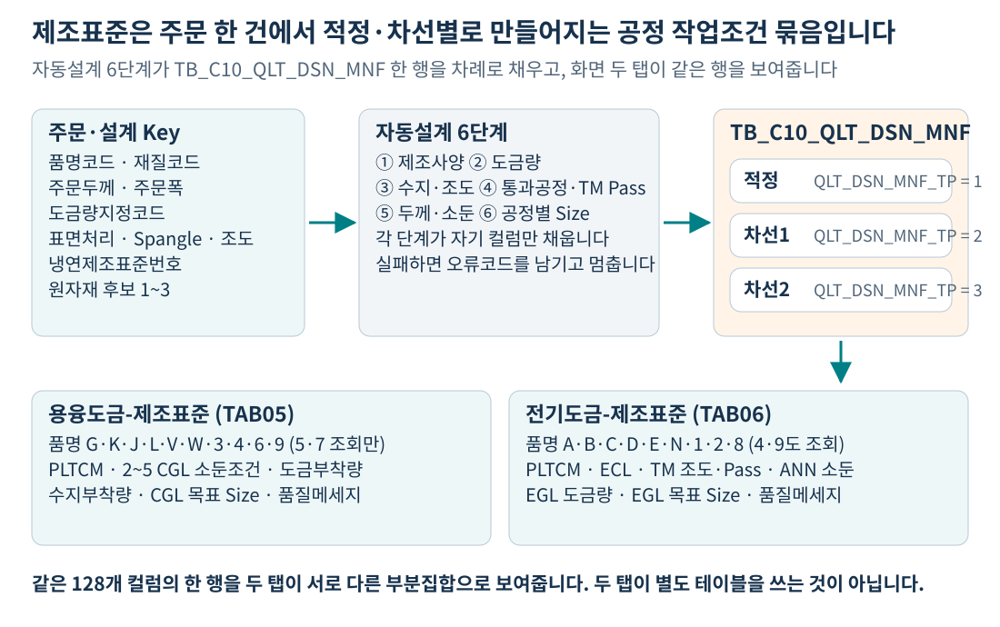

행은 **주문번호 + 주문행 + 제조구분**으로 구분됩니다. 제조구분 1은 적정, 2는 차선1, 3은 차선2이며 원자재 후보마다 한 행입니다. 두 탭은 같은 행의 서로 다른 컬럼을 보여줄 뿐, 별도의 표를 쓰지 않습니다. [근거 S1, S12]

## 나. 어느 탭에 보이는지는 품명이 정한다

용융도금 계열(GI·G/A·G/L·GIX·GLX와 그 칼라)은 TAB05, 전기도금·냉연 계열(EGI·ZnNi와 그 칼라, CR·CR칼라·P/O·F/H)은 TAB06에서 조회됩니다. 조회 SQL의 품명 필터가 이 구분을 만듭니다.

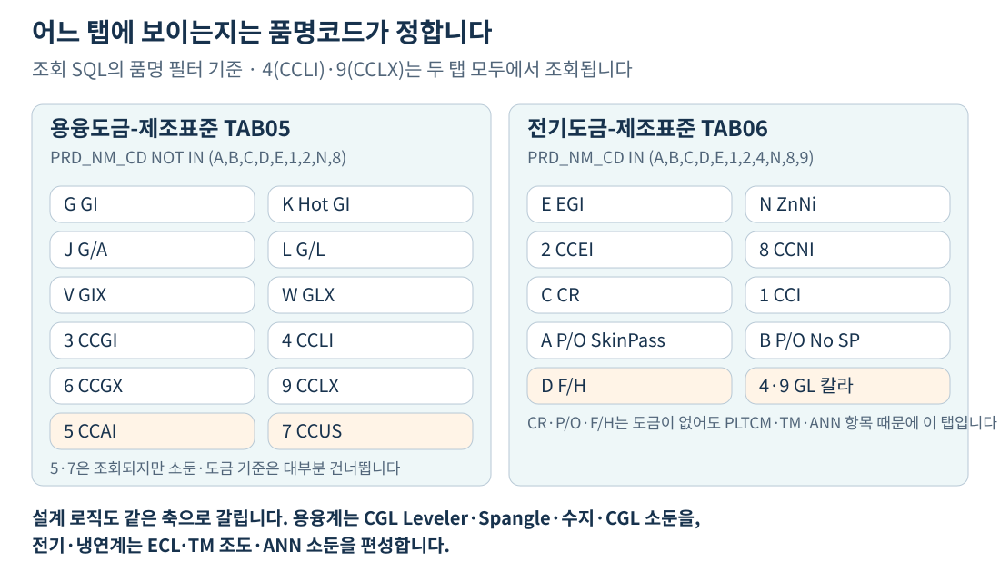

CCLI(4)·CCLX(9)는 **두 탭 모두**에서 조회됩니다. TAB06의 소둔 저장 버튼도 품명 첫 글자가 4일 때만 나타납니다. 알루미늄칼라(5)·스테인레스칼라(7)는 TAB05에서 조회되지만 소둔·도금 기준 조회를 대부분 건너뛰므로 값이 비어 있을 수 있습니다. [근거 S10, S11]

## 다. 여섯 단계가 한 행을 나눠 채운다

자동설계는 한 번에 행을 완성하지 않습니다. 메인 서비스가 여섯 개의 하위 서비스를 차례로 부르고, 각 단계가 자기 컬럼만 UPDATE 합니다.

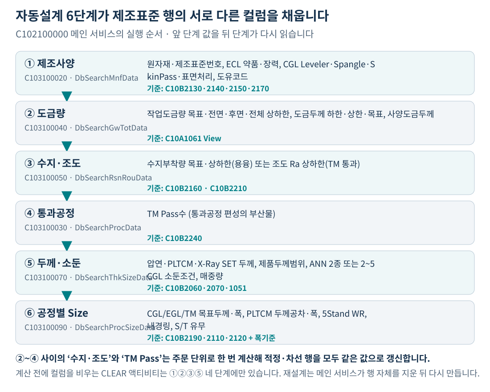

1. **제조사양**이 행을 만듭니다. 원자재·제조표준번호와 ECL 약품·장력, CGL Leveler·Spangle·Skin Pass·표면처리, 도유코드를 넣습니다.
2. **도금량**이 작업도금량과 도금두께를 넣습니다. 도금제품이 아니면 건너뜁니다.
3. **수지·조도**가 용융계에는 수지부착량, TM 통과 제품에는 조도 Ra를 넣습니다.
4. **통과공정** 편성이 부산물로 TM Pass수를 넣습니다.
5. **두께·소둔**이 압연·PLTCM·X-Ray SET 두께와 제품두께범위, 그리고 소둔조건을 넣습니다.
6. **공정별 Size**가 CGL·EGL·TM 목표두께와 PLTCM 공차·5Stand WR·내경링·S/T 유무를 넣습니다. 폭 항목도 이 단계입니다.

앞 단계의 실패는 오류코드를 남기고 그 주문의 설계를 멈춥니다. 따라서 화면에서 특정 항목만 비어 있다면 **그 항목을 채우는 단계가 어디까지 왔는지**부터 확인해야 합니다. [근거 S2]

## 라. GI 주문 한 건은 이런 조건표가 된다

설명용 GI 주문(주문두께 0.500 TCT, 도금량코드 Z1, Spangle 4, Edge S, 2 CGL 통과)을 예로 들면 용융도금 제조표준은 아래처럼 채워집니다.

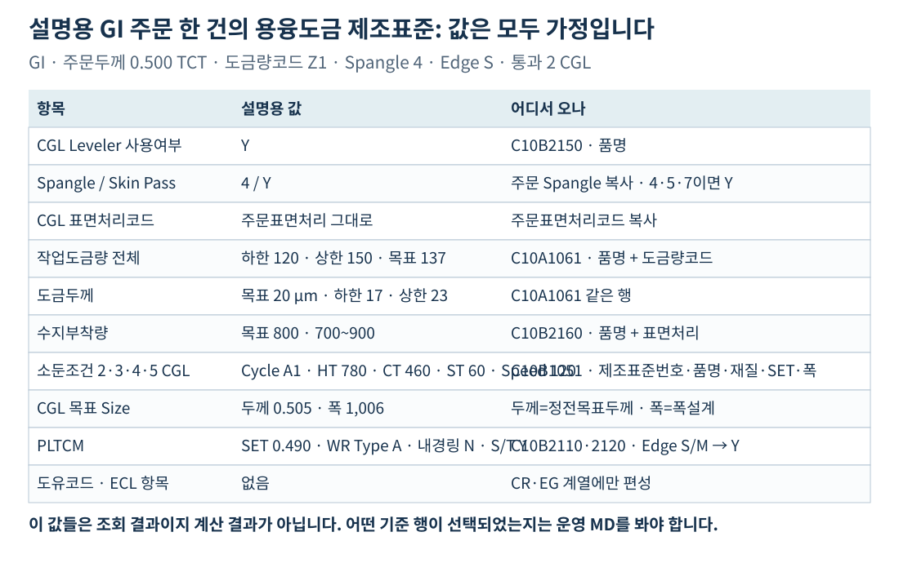

여기서 **Leveler 사용여부·수지부착량·소둔조건은 기준 조회 결과**이고, **Skin Pass는 주문 Spangle이 4·5·7이면 Y**라는 하드코딩 분기입니다. 도금량과 도금두께는 같은 도금량 기준 한 행에서 함께 옵니다. [근거 S3, S4, S5b, S7]

## 마. EGI 주문 한 건은 다른 항목이 채워진다

같은 표를 EGI 주문(주문두께 0.800 BMT, 도금량코드 E3, 조도코드 R1, EGL·일반ANN·TM 통과)으로 바꾸면 조회하는 기준 자체가 달라집니다.

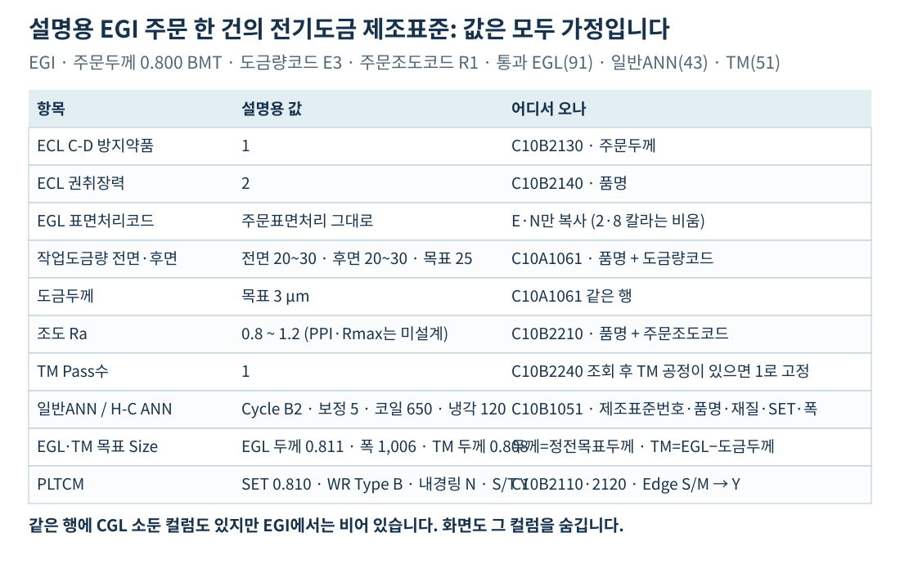

EGI에는 **ECL 약품·권취장력, 조도 Ra, TM Pass수, ANN 소둔조건**이 들어가고 CGL 소둔·수지부착량 컬럼은 비어 있습니다. 도금량은 GI가 전체값(TOT), EGI가 전면·후면값(FRN·BAK)을 씁니다. **조도는 Ra 상하한만 편성되고 PPI·Rmax는 자동설계에서 채우지 않습니다.** 화면에서는 편집할 수 있습니다. [근거 S3, S5b, S6, S7]

## 바. 두께는 주문두께에서 거슬러 올라간다

두께는 유일하게 산식으로 만들어지는 축입니다. 주문두께에서 도금두께와 보정값을 반영해 압연목표를 만들고, SP보정률을 곱해 PLTCM 출측두께를, 소수 셋째 자리를 0이나 5로 바꿔 X-Ray SET 값을 만듭니다.

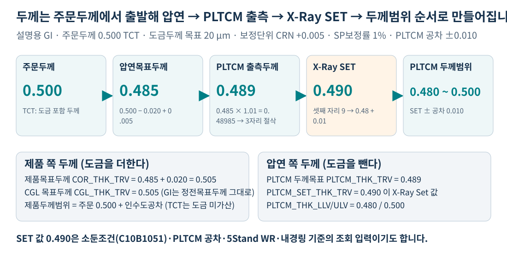

**X-Ray SET 값은 단순한 표시값이 아닙니다.** 소둔조건·PLTCM 두께공차·5Stand WR Type·내경링 기준을 조회할 때 이 값을 열쇠로 씁니다. 두께가 조금 달라지면 구간이 바뀌어 소둔 사이클까지 달라질 수 있습니다. [근거 S7, S8, S15]

## 사. TCT와 BMT는 도금두께를 빼는지가 다르다

주문두께가 도금을 포함한 값(TCT)인지 소지 두께(BMT)인지에 따라 압연목표두께 산식이 갈립니다.

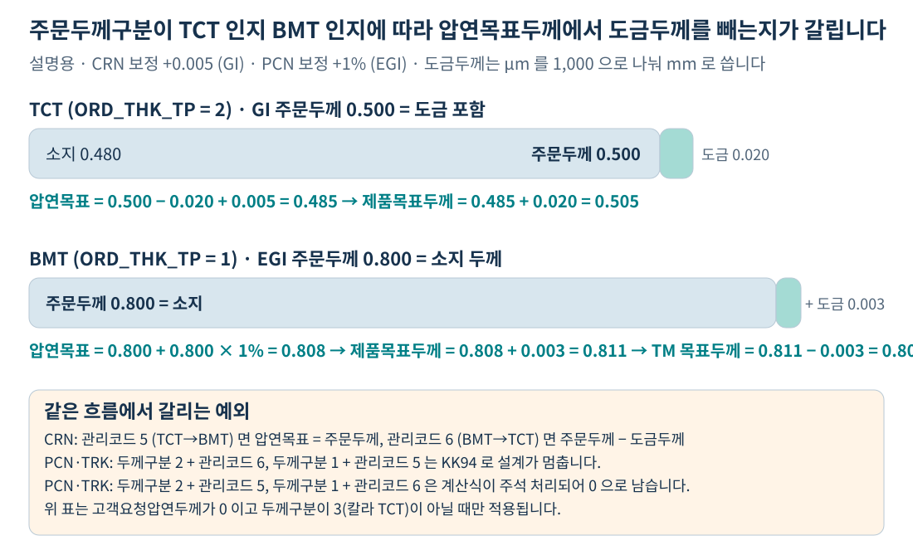

여기에 **주문두께관리코드 5·6(TCT↔BMT 전환)** 예외가 겹칩니다. 보정단위가 CRN이면 전환 코드에 따라 다른 식을 쓰고, PCN·TRK에서 두께구분과 관리코드가 어긋나면 **KK94로 설계가 멈춥니다.** 두께가 예상과 다르면 이 세 값(두께구분·관리코드·보정단위)을 함께 확인합니다. [근거 S7: 503~640행]

## 아. 소둔조건은 계산하지 않고 한 행을 복사한다

소둔 사이클·온도·시간은 제조표준기준(C10B1051) 한 행에서 그대로 옵니다. 조회 입력은 다섯 개이고 결과가 정확히 1건이어야 합니다.

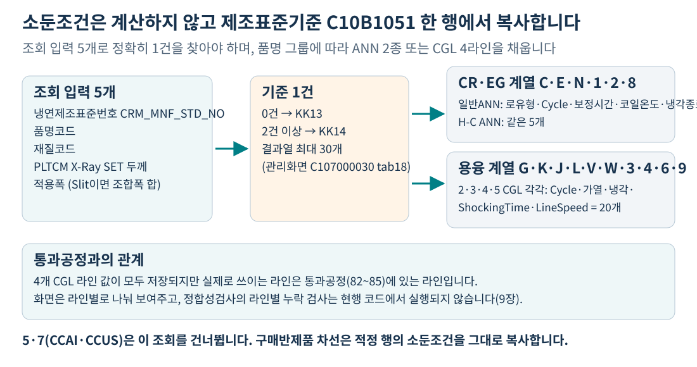

CR·EG 계열은 **일반ANN·H-C ANN 두 벌**, 용융 계열은 **2·3·4·5 CGL 네 라인 20개 항목**을 받습니다. 네 라인이 모두 저장되지만 실제 사용하는 라인은 통과공정에 있는 라인입니다. [근거 S7: 780~855행]

### 같은 항목을 품명별로 바꿔 보기

아래에서 주문 유형을 바꾸면 두께 사슬과 채워지는 조건 항목이 어떻게 달라지는지 바로 비교할 수 있습니다. **모든 선택지는 기준값을 고정한 설명용 예제**이며, 운영 주문의 업무기준을 조회하는 계산기는 아닙니다. JavaScript가 꺼져 있거나 Markdown으로 읽는 경우에는 입문 그림 D·E와 본문 3~9장의 표를 이용하세요.

### 그림을 읽고 나서 실제 주문에 대입할 네 가지

| 먼저 확인할 것 | 이 질문에 답하면 다음이 정해진다 |
|---|---|
| 품명코드 | 어느 탭에서 보이나? ECL·ANN을 쓰나, CGL·수지를 쓰나? |
| 도금량지정코드 | 도금량·도금두께 기준 행이 있나? 없으면 KK31로 멈춘다 |
| 주문두께구분·관리코드·보정단위 | 압연목표두께 산식과 KK94 실패 여부 |
| 제조표준번호·재질·SET두께·폭 | 소둔조건 기준 1건을 찾을 수 있나? 없으면 KK13 |

아래 상세 분석에서는 이 네 질문을 실제 필드·업무기준·저장 경로와 연결합니다.

# 코드와 연결해서 읽는 상세 분석

## 1. 먼저 ‘제조표준’이라는 이름의 값을 구별하자

### 1.1 제조표준, 제조표준번호, 제조표준기준은 서로 다르다

| 이름 | 쉽게 말하면 | 코드에서 찾는 이름 |
|---|---|---|
| 제조표준(결과) | 이 주문 이 원자재로 만들 때의 공정 조건 묶음 | `TB_C10_QLT_DSN_MNF` 한 행 |
| 냉연제조표준번호 | 조건표를 찾을 때 쓰는 열쇠 코드 | `CRM_MNF_STD_NO` (설계 Key 단계에서 결정) |
| 제조표준기준(MD) | 회사가 관리하는 조건표 원본 | 업무기준 `C10B1051`, 관리화면 C107000030 tab18 |
| 제조사양 편성 | 6단계 중 첫 번째 단계의 이름 | `DbSearchMnfData`, 서비스 C103100020 |
| 제조표준 수정이력 | 화면에서 고친 값의 전후 기록 | `TB_C10_QLT_DSN_MNF_MDF_LOG` |

`TB_C10_QLT_DSN_MNF`의 한글 코멘트는 **‘품질설계제조표준’**이지만, 코드와 SQL 주석은 같은 표를 **‘제조사양’**으로도 부릅니다. 두 이름은 같은 대상입니다. [근거 S12]

### 1.2 적정·차선은 행이고, 라인 번호는 컬럼이다

`QLT_DSN_MNF_TP`는 적정(1)·차선1(2)·차선2(3)입니다. 반면 **2CGL·3CGL·4CGL·5CGL은 같은 행 안의 서로 다른 컬럼 묶음**입니다. ‘차선 = 다른 CGL 라인’이 아닙니다.

한 행에는 네 라인의 소둔조건이 모두 들어 있고, 화면은 이를 두 그리드(2·4 CGL / 3·5 CGL)로 나눠 보여줍니다. 어떤 라인을 실제로 쓰는지는 통과공정(82~85)이 정합니다. [근거 S10, S12]

## 2. 자동설계는 어떤 순서로 어떤 컬럼을 채우나?

### 2.1 메인 서비스의 실행 순서

메인 서비스는 삭제 → 설계 Key → 사양 → 원자재/제조사양 → 치수 → 검사 순서로 진행합니다. 제조표준과 직접 관련된 구간만 뽑으면 다음과 같습니다. [근거 S2]

| 순서 | 서비스 | 클래스 | 이 단계가 넣는 값 | 저장 SQL |
|---|---|---|---|---|
| 1 | C103100010 | DbSearchRmtlCdData | 원자재 후보 행 | (원자재표) |
| 2 | C103100020 | DbSearchMnfData | 제조표준 행 생성, ECL·CGL 조건 | `C102100MNF.insert` |
| 3 | C103100040 | DbSearchGwTotData | 작업도금량·도금두께 | `C102100MNF.gw_update` |
| 4 | C103100050 | DbSearchRsnRouData | 수지부착량 또는 조도 Ra | `C102100MNF.RR_update` |
| 5 | C102100160 | (CCL 제조사양) | 칼라 전용 항목 | — |
| 6 | C103100030 | DbSearchProcData | 통과공정, TM Pass수 | `C102100PROC.MNFupdate` |
| 7 | C103100070 | DbSearchThkSizeData | 두께·소둔조건·매중량 | `THK_MNFupdate` / `THK_MNFupdate1` |
| 8 | C103100080 | DbSearchWthSizeData | 제품폭·CCL폭 | `WTHupdate` / `WTHupdate1` |
| 9 | C103100090 | DbSearchProcSizeData | 공정별 두께·폭, PLTCM 설정 | `PROCupdate` / `PROCupdate1` |
| 10 | C103100100 | DbSearchRmtSizeData | 원자재 목표두께·폭 | `C102100RMTL.update` |
| 11 | C103100130 | DbSearchDsnValidData | 정합성검사 | (오류 기록) |

**CLEAR 액티비티가 있는 단계는 네 개뿐입니다.** 제조사양(020)·도금량(040)·수지·조도(050)·두께·소둔(070)만 계산 전에 해당 컬럼을 비웁니다. 통과공정(030)·폭(080)·공정별 Size(090)·원자재 Size(100)에는 CLEAR가 없습니다.

그래도 재설계에서 이전 값이 남지 않는 이유는 **메인 서비스가 시작 부분에서 제조표준 행 자체를 삭제**하기 때문입니다. `C102100000.MNF_ADELETE`로 그 주문의 행을 지운 뒤 제조사양 단계가 새로 INSERT 합니다. [근거 S1: 87행 삭제, S2: 020 60행, 040 74행, 050 49행, 070 216행]

### 2.2 행 단위 계산과 주문 단위 계산을 구별한다

| 단계 | 반복 단위 | 결과 |
|---|---|---|
| 제조사양 | 원자재 후보별 | 후보마다 별도 INSERT (제조구분 1·2·3) |
| 도금량 | 제조표준 행별 (MNF_LOOP) | 행마다 UPDATE, 조회 키가 같으면 값도 같음 |
| 수지·조도 | **주문 단위 1회** | `RR_update`에 제조구분 조건이 없어 모든 행이 같은 값 |
| TM Pass수 | **주문 단위 1회** | `C102100PROC.MNFupdate`도 제조구분 조건 없음 |
| 두께·소둔 | 제조표준 행별 | 구매반제품 차선은 적정 행 복사 |
| 공정별 Size | 제조표준 행별 | 구매반제품 차선은 적정 행 복사 |

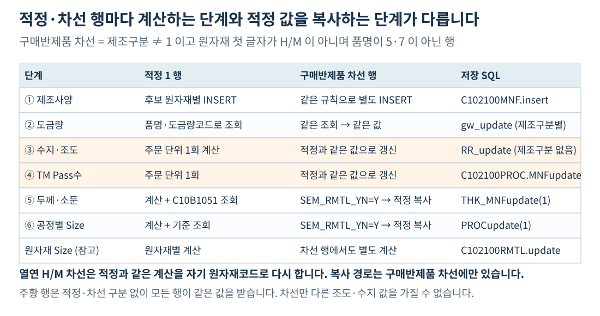

**차선만 다른 조도나 수지부착량을 가질 수 없습니다.** 화면에서 고치면 그 행만 바뀌지만, 재설계하면 다시 모든 행이 같아집니다. [근거 S2: 050 149행, S6: 1183~1189행, S13]

## 3. 제조사양 편성: 행을 만들고 조건 코드를 넣는다

### 3.1 원자재 후보 수만큼 행을 만든다

`DbSearchMnfData`는 Context의 `RMTL_CD`, `RMTL_CD1`, `RMTL_CD2`를 순서대로 리스트에 담고, 인덱스+1을 제조구분으로 씁니다. **빈 코드 검사는 차선1·차선2에만 걸려 있습니다.** 적정(`RMTL_CD`)은 비어 있어도 조건 없이 첫 후보로 담깁니다. 그래서 **차선1이 비고 차선2만 있으면 두 번째 후보가 제조구분 2가 될 수 있습니다.** [근거 S3: 118~131행]

각 후보에 대해 `C102100MNF.insert`로 13개 값과 감사속성을 INSERT 합니다. 이 시점에는 두께·폭·소둔 컬럼이 모두 비어 있습니다. [근거 S3: 346~377행]

### 3.2 품명 그룹에 따라 다른 기준을 조회한다

편성 대상 품명은 16종(C·E·N·1·2·8·G·J·K·L·V·W·3·4·6·9)이며, 그 안에서 다시 두 갈래로 나뉩니다. 도유코드 분기는 그 바깥에 따로 있습니다. [근거 S3: 137~344행]

| 품명 그룹 | 조회 기준 | 조회 조건 | 결과 컬럼 |
|---|---|---|---|
| C·E·N·1·2·8 (CR·EG 계열) | `C10B2130` | 주문두께 | `ECL_CDR_CD` ECL C-D 방지약품 |
| C·E·N·1·2·8 | `C10B2140` | 품명코드 | `ECL_COILG_TS_CD` ECL 권취장력 |
| E·N만 | (조회 없음) | — | `EGL_SUR_HND_CD` = 주문표면처리코드 |
| G·J·K·L·V·W·3·4·6·9 (용융 계열) | `C10B2150` | 품명코드 | `CGL_LVL_YN` Leveler 사용여부 |
| 용융 계열 | (조회 없음) | 주문 Spangle | `SPNL_TP` 복사, `CGL_SP_ASG_YN` Y/N |
| 용융 계열 | (조회 없음) | — | `CGL_SUR_HND_CD` = 주문표면처리코드 |
| C·1만 (CR·CCI) | `C10B2170` | 품명 + 주문표면처리 + 제품형태 | `OIL_PNT_CD` 도유코드 |

**Skin Pass 여부는 기준 조회가 아니라 하드코딩 분기입니다.** 주문 Spangle이 4·5·7이면 Y, 그 외에는 N입니다. 5는 2014-11-25, 7은 2018-03-30에 추가되었다는 주석이 남아 있습니다. 업무 변경 시 소스 수정이 필요합니다. [근거 S3: 275~296행]

**2·8(EG 칼라 계열)은 EGL 표면처리코드를 받지 않습니다.** E·N 조건에만 들어 있기 때문입니다. 화면에서는 조회·표시되므로 값이 비어 보이면 이 분기를 확인합니다.

### 3.3 조회 결과가 1건이 아니면 즉시 멈춘다

네 기준 모두 **RecordCount가 정확히 1**이어야 합니다. 0건이면 ‘없음’ 오류, 2건 이상이면 ‘중복’ 오류로 `FAILURE`를 반환하고 그 주문의 설계가 중단됩니다.

| 기준 | 없음 | 중복 |
|---|---|---|
| C10B2130 ECL C-D 방지약품 | KK58 | KK59 |
| C10B2140 ECL 권취장력 | KK54 | KK55 |
| C10B2150 CGL Leveler | KK56 | KK57 |
| C10B2170 정전공정 방청유 | KK68 | KK69 |
| INSERT 실패 | TB06 | — |

**16종 밖의 품명(A·B·D·5·7 등)은 이 조회를 모두 건너뛰고 INSERT만 합니다.** 그래서 F/H나 P/O 주문의 ECL·CGL 컬럼이 비어 있는 것은 정상입니다. [근거 S3: 137~377행]

## 4. 도금량: 한 기준 행에서 열한 값을 가져온다

### 4.1 도금제품만 편성한다

`DbSearchGwTotData`는 품명이 E·G·K·J·L·V·N·W·2·3·4·6·8·9가 아니면 `FALSE`를 반환하고 아무것도 하지 않습니다. CR·P/O·F/H·알루미늄칼라·스테인레스칼라는 도금량 컬럼이 비어 있습니다. [근거 S4: 84~101행]

### 4.2 칼라 제품은 원판 품명으로 조회한다

조회 키는 **품명코드 + 도금량지정코드**이며, 칼라 제품은 원판 품명으로 바꿔서 조회합니다.

| 주문 품명 | 조회에 쓰는 품명 |
|---|---|
| G(GI), 3(CCGI) | G |
| K(Hot GI) | K |
| J(G/A) | J |
| L(G/L), 4(CCLI) | L |
| V(GIX), 6(CCGX) | V |
| W(GLX), 9(CCLX) | W |
| E(EGI), 2(CCEI) | E |
| N(ZnNi), 8(CCNI) | N |

**칼라 제품의 도금량은 원판과 같은 기준을 씁니다.** 칼라 도장이 도금량을 바꾸지 않는다는 뜻입니다. [근거 S4: 103~121행]

### 4.3 용융계는 전체값, 전기계는 전면·후면값을 쓴다

조회한 행에서 다음 값들을 Context에 넣습니다. 시험도금량(재질사양)과 작업도금량(제조표준)은 **다른 컬럼**입니다.

| 대상 | 시험도금량 (재질 MQL) | 작업도금량 (제조표준 MNF) |
|---|---|---|
| G·K·J·L·V·W·3·4·6·9 | 전체 상하한만 채움 | 전체·전면·후면 모두 저장 |
| E·N·2·8 | 전면·후면 상하한만 채움 | 전체·전면·후면 모두 저장 |

작업도금량은 품명과 무관하게 7개 값(목표·전면 상하한·후면 상하한·전체 상하한)이 모두 저장되고, 도금두께 3개(하한·상한·목표)와 사양도금두께 1개가 함께 들어갑니다. **화면이 품명에 따라 다른 컬럼을 보여줄 뿐입니다.** [근거 S4: 160~202행]

조회 실패는 KK31(없음)·KK32(중복)이며 즉시 중단됩니다. 이 조회는 EasyAccess 규칙이 아니라 **View 직접 조회**(`VI_M00_C10A1061`)입니다. 관리화면은 C107000020 tab06입니다. [근거 S4: 126~157행, S14]

## 5. 수지부착량과 조도: 품명에 따라 하나만 채운다

`DbSearchRsnRouData`는 품명을 보고 셋 중 하나로 갑니다. [근거 S5b]

| 품명 | 조회 기준 | 조회 조건 | 결과 | 다른 항목 처리 |
|---|---|---|---|---|
| G·K·J·L·V·W (용융도금, 칼라 제외) | `C10B2160` | 품명 + 주문표면처리코드 | 수지부착량 목표·하한·상한 | 조도 Ra 하한·상한을 **null로 지움** |
| C·E·N·1·2·8 (TM 통과 계열) | `C10B2210` | 품명 + 주문조도코드 | 조도 Ra 하한·상한 | 수지부착량 하한·상한을 **null로 지움** |
| 그 외 (3·4·6·9 칼라, A·B·D·5·7 등) | 조회 없음 | — | 없음 | `FALSE` 반환 |

**용융도금 칼라(3·4·6·9)는 이 단계에서 제외됩니다.** 수지부착량도 조도도 자동으로 채워지지 않습니다.

**0건은 오류가 아니라 SKIP입니다.** `FALSE`를 반환해 다음 주문으로 넘어가므로, 기준이 없으면 조용히 비어 있게 됩니다. 2건 이상일 때만 KK61(수지)·KK65(조도)로 중단됩니다. 이 점이 다른 단계와 다릅니다. [근거 S5b: 106~178행]

기준 이름과 결과가 어긋나는 부분도 있습니다. `C10B2210`은 이름이 ‘조도설계기준(Ra, PPI, Rmax)’이지만 **코드는 Ra 상하한 두 개만 읽습니다.** PPI·Rmax 컬럼은 자동설계에서 채우지 않으며 화면 편집으로만 값이 들어갑니다.

## 6. TM Pass수: 기준을 조회하지만 결과는 1로 고정된다

`DbSearchProcData`는 통과공정을 편성하면서 `C10B2240`(TM 2Pass 기준)을 품명·규격약호·최종수요가·주문용도·표면처리·광택코드·두께·폭·엠보스 9개 조건으로 조회합니다. 결과 Pass수가 1이 아니면 TM 공정을 한 번 더 추가하는 표시를 남깁니다. [근거 S6: 542~565행]

그런데 통과공정 루프에서 TM 공정(51)을 만나면 다음 코드가 실행됩니다.

> `ctx.put( COL_TM_PASS_CNT, NUM1 ); //TM의 경우는 무조건 1PASS임 (2018.06.20 이돈석)`

**저장되는 TM Pass수는 항상 1입니다.** 기준 조회 결과는 공정을 추가할지 판단하는 데만 쓰이고, 컬럼 값으로는 남지 않습니다. 화면에서 Pass수가 2로 보인다면 자동설계 결과가 아니라 수동 수정입니다. [근거 S6: 1051~1056행]

최종 UPDATE는 품명이 C·1·E·2·8일 때만 실행되며, `C102100PROC.MNFupdate`에는 제조구분 조건이 없어 그 주문의 모든 행이 같은 값을 받습니다. [근거 S6: 1183~1189행, 1406~1425행]

## 7. 두께: 유일하게 산식으로 만들어지는 축

### 7.1 먼저 구매반제품 차선인지 확인한다

`DbSearchThkSizeData`는 시작하자마자 다음 조건을 검사합니다. [근거 S7: 387~393행]

> **제조구분 ≠ 1 AND 원자재 첫 글자가 H/M 아님 AND 품명이 5·7 아님**

해당하면 `SEM_RMTL_YN = Y`로 즉시 성공 반환하고, 서비스가 `THK_MNFupdate1`로 **적정(1) 행의 두께·소둔 값을 통째로 복사**합니다. 복사 대상은 소둔 20개 + ANN 10개 + 두께·길이범위 9개입니다. [근거 S2: 070 204~264행, S13]

### 7.2 SP보정율과 압연두께 보정기준을 조회한다

품명 5·7이 아니면 두 기준을 조회합니다.

| 기준 | 조회 조건 | 결과 | 실패 처리 |
|---|---|---|---|
| `C10B2070` SP두께보정율 | 품명·재질·주문Spangle·주문두께·적용폭 | `THK_CPS_RT` 두께보정율 | **오류 없음** (예외 시 로그만, 값 0) |
| `C10B2060` 압연두께Set치보정 | 품명·규격기관·규격약호·주문용도·최종고객사·주문두께구분·두께관리코드·도금량코드·주문두께·주문폭 | 보정단위·보정치 | 0건 KK82, 중복 KK83 → **중단** |

**SP보정율은 실패해도 진행하지만 압연두께 보정기준은 반드시 1건이어야 합니다.** 조회 조건이 10개로 가장 많아, 기준 정비가 안 되면 여기서 자주 멈춥니다. [근거 S7: 396~500행]

### 7.3 보정단위 × 두께구분으로 압연목표두께가 갈린다

`C10B2060`의 보정단위는 CRN(보정값), PCN(보정율), TRK(확정값) 세 가지입니다. 여기에 주문두께구분(1=BMT, 2=TCT)과 두께관리코드(5=TCT→BMT, 6=BMT→TCT)가 겹칩니다. [근거 S7: 503~640행]

| 보정단위 | 두께구분 | 관리코드 | 압연목표두께 `crm_thk` |
|---|---|---|---|
| CRN | 2 TCT | 5 | 주문두께 그대로 |
| CRN | 2 TCT | 그 외 | 주문두께 − 도금두께 + 보정치, **소수 4자리 반올림** |
| CRN | 1 BMT | 6 | 주문두께 − 도금두께 |
| CRN | 1 BMT | 그 외 | 주문두께 + 보정치 |
| PCN | 2 TCT | 6 | **KK94 실패** |
| PCN | 2 TCT | 5 | 계산 없음 (0으로 남음) |
| PCN | 2 TCT | 그 외 | 주문두께 − 도금두께 + 주문두께 × 보정치/100 |
| PCN | 1 BMT | 5 | **KK94 실패** |
| PCN | 1 BMT | 6 | 계산 없음 (0으로 남음) |
| PCN | 1 BMT | 그 외 | 주문두께 + 주문두께 × 보정치/100 |
| TRK | 2 TCT | 6 | **KK94 실패** |
| TRK | 2 TCT | 5 | 계산 없음 (0으로 남음) |
| TRK | 2 TCT | 그 외 | 보정치 − 도금두께, **SP보정율을 0으로 초기화** |
| TRK | 1 BMT | 5 | **KK94 실패** |
| TRK | 1 BMT | 6 | 계산 없음 (0으로 남음) |
| TRK | 1 BMT | 그 외 | 보정치, **SP보정율을 0으로 초기화** |

**PCN과 TRK에는 같은 KK94 검사가 각각 들어 있습니다.** 두께구분 2에 관리코드 6, 또는 두께구분 1에 관리코드 5이면 그 자리에서 설계가 멈춥니다. 반대 조합인 두께구분 2에 관리코드 5, 두께구분 1에 관리코드 6에서는 계산식이 주석 처리되어 있어 **압연목표두께가 0으로 남습니다.** 두께가 0인 주문을 만나면 이 두 조합을 확인합니다. [근거 S7: 552~558행 PCN, 592~598행 TRK]

**위 표는 고객요청압연두께가 0이면서 주문두께구분이 3(칼라 TCT)이 아닐 때만 적용됩니다.** 고객요청압연두께가 지정되었거나 주문두께구분이 3이면 대신 **고객 두께보정단위**로 계산합니다. 주문두께구분이 3이면 먼저 도막두께와 도금두께를 빼고 라미나두께를 더한 뒤 단위별 산식을 적용합니다. 칼라 TCT 주문은 고객요청압연두께가 없어도 이 경로로 들어옵니다. [근거 S7: 418행 분기 조건, 642~654행 고객 경로]

### 7.4 PLTCM 출측두께와 X-Ray SET 값

| 값 | 산식 | 처리 |
|---|---|---|
| PLTCM 두께목표 `PLTCM_THK_TRV` | **고객 두께보정단위**가 TRK이면 압연목표두께 그대로, 아니면 압연목표두께 × (1 + SP보정율/100) | 소수 **4자리 이하 절삭**(3자리 유지) |
| X-Ray SET `PLTCM_SET_THK_TRV` | 품명 5·7이면 주문두께, 아니면 위 값의 소수 셋째 자리를 0/5로 변환 | 변환 후 다시 3자리 절삭 |

여기의 보정단위는 **7.3절의 `C10B2060` 결과가 아니라 고객요청압연두께단위(`THK_COR_UNT`)**입니다. 고객사양에서 온 값이며, 고객사양이 없으면 빈 값입니다. 다만 `C10B2060`의 보정단위가 TRK인 경로에서는 SP보정율이 0으로 초기화되므로 결과값은 같아집니다. 두 단위를 하나로 읽지 않도록 주의합니다. [근거 S7: 329~330행, 626행, 738~748행]

셋째 자리 변환 규칙은 다음과 같습니다. [근거 S15: 332~366행]

| 소수 셋째 자리 | 결과 | 예 |
|---|---|---|
| 1, 2 | 0으로 내림 | 0.542 → 0.540 |
| 3, 4, 6, 7 | 5로 맞춤 | 0.544 → 0.545, 0.547 → 0.545 |
| 8, 9 | 0으로 하고 둘째 자리 +0.01 | 0.548 → 0.550 |
| 0, 5 | 그대로 | 0.540 → 0.540 |

**5는 그대로 두고 3·4·6·7만 5로 바꿉니다.** 반올림이 아니라 0.005 단위 격자에 붙이는 규칙입니다. 화면(TAB05·TAB06)도 두께를 직접 고칠 때 같은 규칙을 자바스크립트로 다시 적용합니다. [근거 S10: 880~893행]

### 7.5 제품두께범위는 품명 그룹별로 다르다

`PRD_THK_RNG_LLV/ULV`(보증)와 `PRD_THK_SPC_RNG_LLV/ULV`(규격)는 주문두께에 인수도 두께공차를 더해 만듭니다. 여기에 품명별로 도금두께·도막두께·라미나두께가 붙습니다. [근거 S7: 657~736행]

| 품명 그룹 | 제품두께범위 하한 | 제품목표두께 `COR_THK_TRV` |
|---|---|---|
| C·A·B·D (CR·P/O·F/H) | 주문두께 + 공차하한 | 압연목표두께 |
| 1·5·7 (CR칼라·알루미늄·스테인레스) | 주문두께 + 도막 전면 + 도막 후면 + 공차하한 | 1은 압연목표+도막, 5·7은 주문두께+도막 |
| E·N·G·K·J·L·V·W (도금) | 주문두께 + 상당도금두께 + 공차하한 | 압연목표두께 + 도금두께 |
| 2·3·4·6·8·9 (도금칼라) | 주문두께 + 도막 + 상당도금두께 + 공차하한 | 압연목표 + 도막 + 도금두께 |

상당도금두께는 **주문두께구분이 2(TCT)이면 0으로 처리**됩니다. 이미 도금이 포함된 두께이기 때문입니다. 제품두께계산적용코드가 T이면 도금을, C이면 도금과 도막을 모두 0으로 만듭니다.

규격범위 쪽 규격도금두께는 조건이 다릅니다. 주문두께구분이 **2(TCT)이면 규격기관과 무관하게 0**, **3(칼라 TCT)이면 규격기관이 KS·JS가 아닐 때만 0**입니다. 1(BMT)이면 규격기관과 무관하게 조회값을 그대로 씁니다. [근거 S7: 657~680행]

### 7.6 매중량도 이 단계에서 계산한다

제품형태가 코일이면 단위중량을 계산합니다. [근거 S7: 857~871행]

| 품명 | 매중량 산식 |
|---|---|
| 5 알루미늄칼라 | 주문두께 × 2.73 × 주문폭 / 1000 |
| 7 스테인레스칼라 | 주문두께 × 7.74 × 주문폭 / 1000 |
| 그 외 | (X-Ray SET × 7.85 + (작업도금량 전면하한 + 후면하한 + 전체하한) / 1000) × 주문폭 / 1000 |

**여기서 쓰는 폭은 조합폭 합이 아니라 원래 주문폭(`me_exc_wth`)입니다.** 두께 조회에 쓰는 적용폭과 다릅니다. 매중량은 제조표준이 아니라 설계공통(`TB_C10_QLT_DSN_CMN`)에 저장됩니다.

## 8. 공정별 Size: CGL·EGL·TM 두께와 PLTCM 설정

### 8.1 공정 목표두께는 제품목표두께에서 뺀다

`DbSearchProcSizeData`는 두께를 다음처럼 만듭니다. 도막두께는 μm이므로 1000으로 나눠 mm로 바꿉니다. [근거 S8: 1203~1330행]

| 품명 그룹 | CCL 두께 | 중간정전 두께 | CGL/EGL 두께 | TM 두께 |
|---|---|---|---|---|
| G·K·J·L·V·W | — | — | CGL = 제품목표두께 | — |
| E·N | — | — | EGL = 제품목표두께 | EGL − 도금두께/1000 |
| 3·4·6·9 (GI칼라) | 제품목표두께 | 제품목표 − 도막/1000 | CGL = 제품목표 − 도막/1000 | — |
| 2·8 (EG칼라) | 제품목표두께 | 제품목표 − 도막/1000 | EGL = 제품목표 − 도막/1000 | EGL − 도금두께/1000 |
| 1 (CR칼라) | 제품목표두께 | 제품목표 − 도막/1000 | — | 제품목표 − 도막/1000 |
| C (CR) | — | — | — | TM = 제품목표두께 |
| 5·7 | 제품목표두께 | 제품목표 − 도막/1000 | — | — |

**TM 두께는 전기도금 계열에서만 도금두께를 뺍니다.** 조질압연이 도금 전 공정이기 때문입니다.

### 8.2 PLTCM 설정 세 가지는 SET 두께로 조회한다

품명 5·7이 아니면 X-Ray SET 값을 열쇠로 세 기준을 조회합니다. 모두 1건이 아니면 중단합니다. [근거 S8: 1340~1445행]

| 기준 | 조회 조건 | 결과 | 없음 / 중복 |
|---|---|---|---|
| `C10B2190` PLTCM 두께공차 | SET 두께 | 공차 하한·상한 → SET ± 공차로 `PLTCM_THK_LLV/ULV` | KK80 / KK81 |
| `C10B2110` 5Stand WR Type | SET 두께 | `PLTCM_5STD_WR_TP` | KK52 / KK53 |
| `C10B2120` Sleeve 유무 | **품명 + SET 두께** | `PLTCM_SLV_USE_YN` 내경링 사용여부 | KK50 / KK51 |

**두께공차와 5Stand는 SET 두께 하나로, 내경링은 품명까지 두 개로 조회합니다.** 주석에는 세 기준 모두 SET 두께 하나로 적혀 있지만 실제 호출은 다릅니다.

### 8.3 Edge 두 개는 주문 Edge에서 바로 정한다

| 컬럼 | 화면 이름 | 조건 |
|---|---|---|
| `PLTCM_EDG_ASG_TP` | S/T 유무 | 주문 Edge가 S 또는 M이면 Y, 그 외 N |
| `COR_EDG_ASG_TP` | 정전 Edge | 주문 Edge가 S 또는 C이면 Y, 그 외 N |

**같은 Edge 값에서 두 컬럼이 다르게 나옵니다.** Edge M이면 S/T는 Y, 정전은 N입니다. Edge C이면 반대입니다. 기준 조회 없이 코드에서 바로 정합니다. [근거 S8: 1636~1645행]

## 9. 소둔조건: 제조표준기준 한 행을 통째로 복사한다

### 9.1 조회 입력 다섯 개

`C10B1051`을 다음 순서로 조회합니다. 품명 5·7은 이 블록 전체를 건너뜁니다. [근거 S7: 780~800행]

| 순서 | 조건 | 필드 |
|---|---|---|
| 1 | 제조표준번호 | `CRM_MNF_STD_NO` |
| 2 | 품명 | `PRD_NM_CD` |
| 3 | 재질 | `MQL_CD` |
| 4 | 두께 | **X-Ray SET 값** (주문두께 아님) |
| 5 | 폭 | 적용폭 (Slit 조수 > 0이면 조합폭 1~10 합) |

0건과 조회 예외는 모두 KK13, 중복은 KK14입니다. **0건과 예외가 같은 코드를 쓰므로 오류만 보고 원인을 단정할 수 없습니다.** [근거 S7: 789~854행]

### 9.2 품명 그룹에 따라 다른 결과 컬럼을 채운다

| 품명 | 채우는 컬럼 |
|---|---|
| C·E·N·1·2·8 | 일반ANN 5개(로유형·Cycle·보정시간·코일온도·냉각종료온도) + H-C ANN 5개 |
| 그 외 (용융 계열) | 2·3·4·5 CGL 각 5개(Cycle·가열온도·냉각온도·ShockingTime·LineSpeed) = 20개 |

**네 CGL 라인이 모두 채워집니다.** 통과공정에 2CGL만 있어도 3·4·5 CGL 값이 저장됩니다. 화면은 라인별로 보여주므로, 통과하지 않는 라인에 값이 있는 것은 정상입니다.

### 9.3 소둔로유형은 저장하지만 화면에는 고정 문자열이 보인다

`FUR_TP_GEN_ANN`·`FUR_TP_HC_ANN`은 기준에서 읽어 저장하지만, 조회 SQL은 이 컬럼 대신 **`'일반 ANN'`, `'H-C ANN'` 고정 문자열**을 내려줍니다. 화면의 ‘구분’ 열은 항상 이 두 글자입니다. 실제 저장값을 보려면 DB를 직접 조회해야 합니다. [근거 S16: TAB05 55~64행, TAB06 15~22행]

## 10. 화면은 어떻게 보여주고 저장하나?

### 10.1 조회는 한 번, 렌더링은 여러 그리드로

두 탭 모두 같은 구조입니다. 원자재 그리드에서 적정·차선 행을 고르면 `MNF_find`로 제조표준 한 행을 조회하고, **같은 XML을 여러 그리드에 나눠 렌더링**합니다. [근거 S10: 635~668행, S11: 629~677행]

| 탭 | 조회 SQL | 렌더링 대상 |
|---|---|---|
| TAB05 | `C104000020TAB05_MNF.select` | Grid_2(PLTCM) 별도 조회 + Grid_3·4·5·6에 같은 XML |
| TAB06 | `C104000020TAB06_MNF.select` | Grid_3(마스터)·4·5·6·7에 같은 XML |

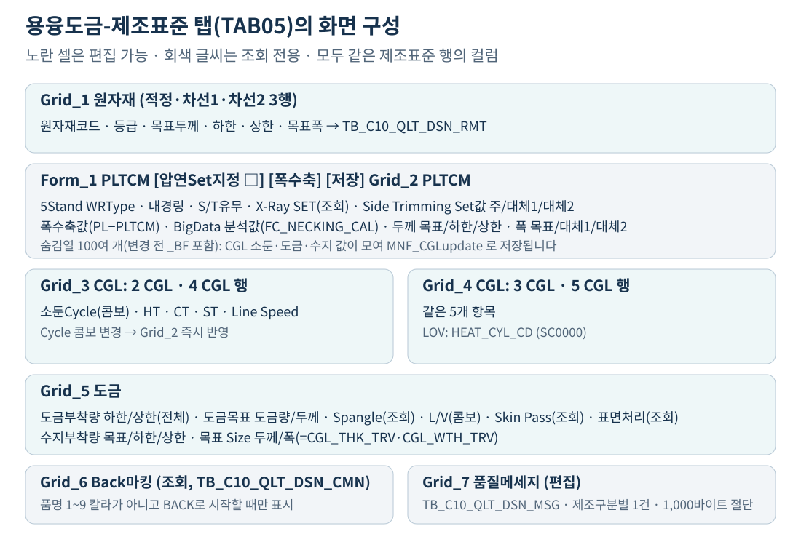

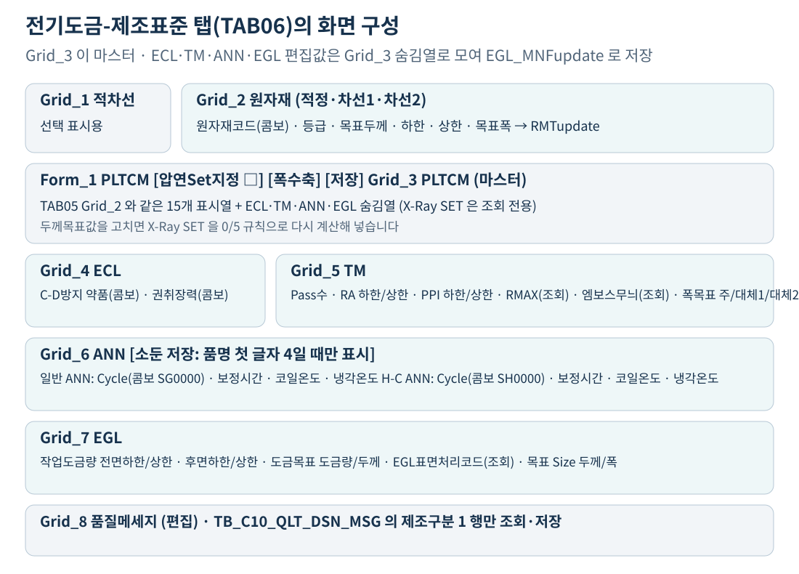

두 탭 모두 **세로형 그리드(vertical grid)**입니다. 한 행의 컬럼들을 여러 줄로 펼쳐 보여주므로, 화면의 ‘행’이 DB의 행이 아닙니다. Grid_3의 2 CGL·4 CGL 두 줄도 같은 DB 행의 다른 컬럼입니다.

### 10.2 편집값은 마스터 그리드 숨김열로 모인다

하위 그리드에서 값을 고치면 즉시 마스터 그리드(TAB05 Grid_2, TAB06 Grid_3)의 숨김열에 복사되고 그 행이 `updated` 상태가 됩니다. 저장은 마스터 그리드 한 번의 전송으로 끝납니다.

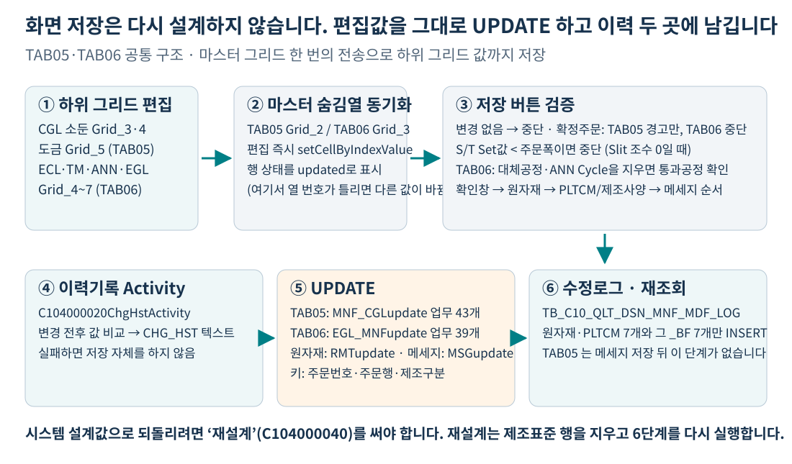

이 구조 때문에 **숨김열 번호가 하나만 어긋나도 다른 항목이 저장됩니다.** 11장에서 실제 불일치를 다룹니다.

### 10.3 저장 전 검증은 탭마다 다르다

| 검증 | TAB05 | TAB06 |
|---|---|---|
| 변경 없음 | 알림 후 중단 | 알림 후 중단 |
| 확정주문(`QLT_DSN_STS_CD='A'`) | **경고만 하고 진행** ("APS에서 설계 상속 받으세요") | **알림 후 중단** |
| S/T Set값 < 주문폭 | 중단 (Slit 조수 0일 때만) | 중단 (Slit 조수 0일 때만) |
| 대체공정 S/T 삭제 시 통과공정 확인 | **주석 처리됨** | 실행됨 |
| CGL·ANN Cycle 삭제 시 통과공정 확인 | **주석 처리됨** | ANN만 실행됨 |

**같은 확정주문이라도 TAB05는 저장되고 TAB06은 막힙니다.** TAB05의 `return`이 주석 처리되어 있기 때문입니다. 운영에서 확정주문 수정 흔적을 조사할 때 이 차이를 고려해야 합니다. [근거 S10: 122~145행, S11: 137~163행]

### 10.4 저장 체인과 이력 두 곳

저장은 **원자재 → 제조사양 → 메세지** 순서의 콜백 체인입니다. 각 저장 앞에는 이력기록 액티비티가 있고, 뒤에는 수정로그 INSERT가 붙습니다. [근거 S9]

| 저장 대상 | TAB05 SQL | TAB06 SQL | 이력 |
|---|---|---|---|
| 원자재 | `RMTupdate` | `RMTupdate` | CHG_HST + MDF_LOG |
| 제조표준 | `MNF_CGLupdate` (업무 컬럼 43개) | `EGL_MNFupdate` (업무 컬럼 39개) | CHG_HST + MDF_LOG |
| 소둔만 | — | `ANN_saveUpdate` (업무 컬럼 8개) | CHG_HST + MDF_LOG |
| 품질메세지 | `MSGupdate` | `MSGupdate` | TAB05 CHG_HST · **TAB06 CHG_HST + MDF_LOG** |
| 압연Set지정 | `PLTCM_update` (설계공통) | `PLTCM_update` | CHG_HST |

**이력기록 액티비티가 실패하면 저장 자체가 실행되지 않습니다.** 전이가 `success → 저장`으로 연결되어 있기 때문입니다. 저장 뒤 수정로그로 이어지는 경로도 탭마다 다릅니다. TAB06은 원자재·제조사양·소둔·메세지 네 저장이 모두 수정로그로 이어지지만, TAB05는 원자재·제조표준 두 저장만 이어지고 메세지와 압연Set지정은 바로 끝납니다. [근거 S9, S17]

수정로그(`TB_C10_QLT_DSN_MNF_MDF_LOG`)는 161개 컬럼으로, 현재값과 `_BF`(변경 전) 값을 쌍으로 저장하도록 설계되어 있습니다. 다만 **INSERT 문이 실제로 넣는 컬럼은 28개**입니다. 업무·키 18개(원자재 4 + PLTCM 3 + 각각의 이전값 7 + 키 4), 수정자·수정일시 2개, 생성·최종변경 감사 8개입니다. **소둔·도금·조도·수지 컬럼은 테이블에만 있고 저장되지 않습니다.** 두 탭의 INSERT 문 구조는 같습니다. [근거 S16: TAB05 495~561행, S12]

### 10.5 TAB06의 소둔 별도 저장

TAB06에는 소둔만 따로 저장하는 버튼이 있습니다. **품명 첫 글자가 4일 때만 보입니다.** 조회 완료 시 부모 화면의 품명코드를 읽어 표시 여부를 정합니다. [근거 S11: 669~676행]

버튼을 누르면 확정주문 검사와 ANN Cycle 삭제 검사를 거쳐 `ANN_saveUpdate`로 ANN 8개 컬럼만 저장합니다. 일반 저장(`EGL_MNFupdate`)에도 같은 컬럼이 들어 있으므로 두 경로가 겹칩니다.

### 10.6 폭수축 버튼과 BigData 분석값

두 탭 모두 폭수축 팝업(C104000020POP02)을 띄웁니다. 원자재코드·S/T폭·PLTCM 두께를 넘겨 넥킹 예측 마트를 조회합니다.

그리드에 보이는 두 값은 출처가 다릅니다.

| 열 | 값 | 출처 |
|---|---|---|
| 폭수축값 | `PL_WTH_TRV − PLTCM_WTH_TRV` | 저장된 두 폭의 단순 차이 |
| BigData 분석값 | `FC_NECKING_CAL(원자재코드, PL폭, X-Ray SET)` | 넥킹 예측 마트 조회 함수 |

**BigData 분석값은 설계에 반영되지 않는 참고값입니다.** 함수는 폭·두께를 구간으로 나눠 전체 메이커('0') 기준의 폭수축 기준값을 반환하며, 없으면 NULL입니다. [근거 S16, S18]

### 10.7 원자재 두께·폭 경고 표시

원자재 그리드에서 값을 고치면 기준값과 비교해 셀을 붉게 칠합니다.

| 항목 | 정상 범위 | 기준값 |
|---|---|---|
| 원자재 목표두께 | 하한기준 ~ 상한기준 | `NVL(RMTL_TAR_THK_LVL_STD, RMTL_TAR_THK_LVL)` 등 |
| 원자재 목표폭 | 기준폭 ~ 기준폭 + 25 | `NVL(RMTL_TAR_WTH_STD, RMTL_TAR_WTH)` |

**붉게 표시되어도 저장은 됩니다.** 경고일 뿐 차단이 아닙니다. [근거 S10: 724~772행]

## 11. 정상 동작만으로 설명하면 안 되는 현행 예외

### 11.1 TAB05에서 CGL 값을 지우면 다른 항목이 비워진다

TAB05의 CGL 그리드(Grid_3·4)에서 값을 **빈 값으로 지울 때**와 **새 값을 입력할 때** 마스터 숨김열 번호가 다릅니다.

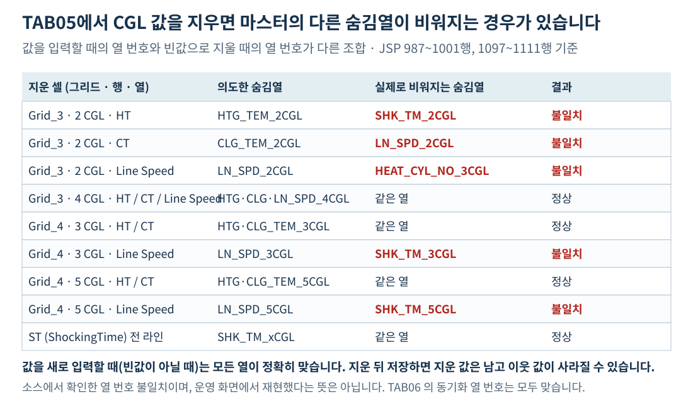

| 지운 셀 | 의도한 컬럼 | 실제로 비워지는 컬럼 |
|---|---|---|
| 2 CGL 가열온도 | `HTG_TEM_2CGL` (열 41) | `SHK_TM_2CGL` (열 43) |
| 2 CGL 냉각온도 | `CLG_TEM_2CGL` (열 42) | `LN_SPD_2CGL` (열 44) |
| 2 CGL Line Speed | `LN_SPD_2CGL` (열 44) | `HEAT_CYL_NO_3CGL` (열 45) |
| 3 CGL Line Speed | `LN_SPD_3CGL` (열 49) | `SHK_TM_3CGL` (열 48) |
| 5 CGL Line Speed | `LN_SPD_5CGL` (열 59) | `SHK_TM_5CGL` (열 58) |

4 CGL의 세 항목과 ST(ShockingTime)는 지울 때도 맞습니다. **새 값을 입력하는 경로는 전부 정확합니다.** TAB06의 동기화 열 번호에는 이 불일치가 없습니다.

이것은 소스에서 확인한 열 번호 불일치이며, 운영 화면에서 재현했다는 뜻은 아닙니다. 소둔 값이 이유 없이 비어 있는 사례를 조사할 때 이 경로를 확인합니다. [근거 S10: 987~1001행, 1097~1111행]

### 11.2 정합성검사의 소둔조건 검사는 실행되지 않는다

`DbSearchDsnValidData.CheckMnf`에는 ANN·CGL 소둔조건 누락 검사(CF36~CF63)가 있지만, 품명 조건이 다음처럼 작성되어 있습니다.

> `if ( PRD_NM_CD.equals("C") && PRD_NM_CD.equals("E") && PRD_NM_CD.equals("N") && ... )`

**하나의 변수가 여러 값과 동시에 같을 수 없으므로 항상 거짓입니다.** OR(`||`)이어야 할 자리에 AND(`&&`)가 들어갔습니다. 두 블록(CR·EG 계열 1950행, 용융 계열 1995행) 모두 같습니다.

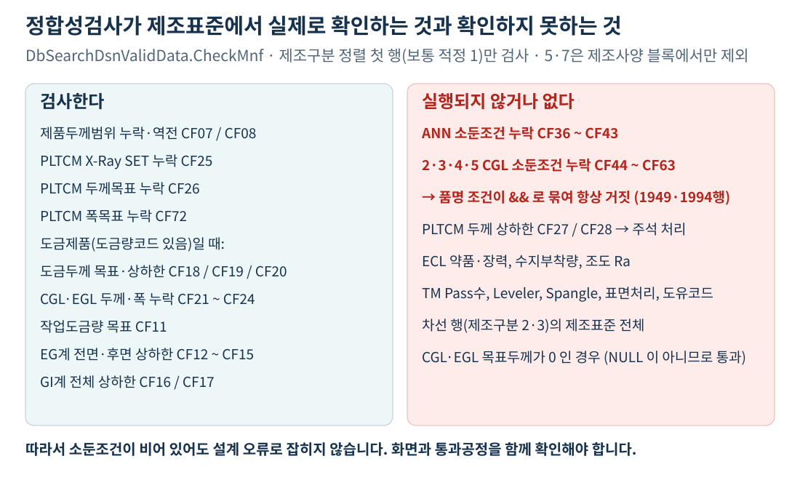

결과적으로 **소둔조건이 비어 있어도 설계 오류로 잡히지 않습니다.** 통과공정 조회(`SELECT_PROC`)는 실행되지만 그 결과를 쓰는 블록에 들어가지 못합니다. [근거 S19: 1950행, 1995행]

### 11.3 검사는 첫 행만 보고 차선은 보지 않는다

`CheckMnf`는 제조구분 정렬 조회 결과의 **첫 행만 한 번** 검사합니다. 정상 구성에서는 적정(1)입니다. 차선1·차선2 행의 제조표준은 검사 대상이 아닙니다. [근거 S19: 1700~1730행]

**품명 5·7이 빠지는 것은 제조사양 검사 블록뿐입니다.** 그 블록이 끝난 뒤의 원자재 검사(CF29~CF32)는 품명 조건 없이 모든 품명에 실행되고, 칼라 BOM 검사(CF35)는 오히려 품명 1~9(5·7 포함)에만 적용됩니다. [근거 S19: 1708~2103행 제조사양 블록, 2105~2162행 원자재, 2164~2194행 칼라 BOM]

또한 PLTCM 두께 상하한 검사(CF27·CF28)는 **주석 처리**되어 있습니다.

### 11.4 조회 실패 처리가 단계마다 다르다

| 단계 | 0건 | 중복 | 예외 |
|---|---|---|---|
| 제조사양 (2130·2140·2150·2170) | 중단 | 중단 | 중단 |
| 도금량 (C10A1061) | 중단 KK31 | 중단 KK32 | 중단 |
| 수지·조도 (2160·2210) | **조용히 SKIP** | 중단 | 중단 |
| TM Pass (2240) | **로그만** | — | **로그만** |
| SP보정율 (2070) | **로그만** | — | **로그만** |
| 압연두께보정 (2060) | 중단 KK82 | 중단 KK83 | 중단 |
| 소둔조건 (1051) | 중단 KK13 | 중단 KK14 | 중단 KK13 |
| PLTCM 설정 (2190·2110·2120) | 중단 | 중단 | 중단 |

**‘모든 기준은 없으면 실패한다’는 하나의 규칙으로 설명할 수 없습니다.** 값이 비어 있는데 오류가 없다면 SKIP 또는 로그 전용 경로일 수 있습니다. [근거 S3~S8]

### 11.5 EG 칼라의 EGL 표면처리코드가 비어 있다

3.2절에서 본 대로 `EGL_SUR_HND_CD`는 품명 E·N에만 편성됩니다. **2(CCEI)·8(CCNI)은 EG 칼라이지만 이 값을 받지 못합니다.** TAB06 조회 SQL은 이 컬럼을 코드명과 함께 조회하므로 화면에는 빈 값이 보입니다. [근거 S3: 236~241행, S16]

### 11.6 클래스 파일 헤더가 다른 파일 이름을 가리킨다

`DbSearchMnfData.java`의 헤더 주석은 `@FileName : DbSearchRsnRouData.java`로 되어 있습니다. 복사 후 수정 누락입니다. 파일을 이름으로 찾을 때 혼동할 수 있습니다. [근거 S3: 1~11행]

## 12. 실제 주문의 제조표준을 추적하는 순서

1. **행을 특정한다.** 주문번호·주문행·제조구분과 그 행의 원자재코드·제조표준번호를 적습니다.
2. **품명 그룹을 확인한다.** 어느 탭인지, ECL·ANN 계열인지 CGL·수지 계열인지 정합니다.
3. **생성 경로를 구별한다.** 자동설계인지, 구매반제품 차선 복사인지, 화면 수정인지, 반복주문 복사인지 확인합니다.
4. **두께 축을 재현한다.** 주문두께·두께구분·관리코드·보정단위·보정치·SP보정율·도금두께를 적고 압연목표 → PLTCM → X-Ray SET 순서로 맞춰 봅니다.
5. **조회 기준을 확인한다.** SET 두께와 적용폭으로 `C10B1051` 한 행을 찾을 수 있는지, 도금량코드로 `C10A1061` 한 행이 나오는지 봅니다.
6. **주문 단위 항목을 구별한다.** 조도·수지·TM Pass는 모든 행이 같아야 정상입니다. 다르면 화면 수정 이력입니다.
7. **저장·이력을 대조한다.** `TB_C10_QLT_DSN_MNF_MDF_LOG`의 `_BF` 값과 `TB_C10_QLT_DSN_CHG_HST`를 함께 봅니다.
8. **정합성검사 결과를 과신하지 않는다.** 소둔조건 누락은 검사되지 않으므로 화면과 통과공정을 직접 확인합니다.

| 확인 항목 | 적정 1에 기록할 값 | 차선1(2)에 기록할 값 |
|---|---|---|
| 대상 | 주문번호 / 주문행 / 제조구분 | 동일 항목 |
| 원자재 | 원자재코드 / 등급 / 제조표준번호 | 동일 항목 |
| 두께 입력 | 주문두께 / 두께구분 / 관리코드 / 보정단위 / 보정치 / SP보정율 | 동일 항목 |
| 두께 결과 | 압연목표 / PLTCM 출측 / X-Ray SET / 두께범위 | 동일 항목 |
| 도금 | 도금량코드 / 작업도금량 / 도금두께 / 사양도금두께 | 동일 항목 |
| 조건 코드 | ECL 약품·장력 / Leveler / Spangle·SkinPass / 표면처리 / 도유 | 동일 항목 |
| 소둔 | ANN 2벌 또는 CGL 4라인 / 통과공정 라인 | 동일 항목 |
| 공정 Size | CGL·EGL·TM 두께 / PLTCM 공차·WR·내경링·S/T | 동일 항목 |
| 최종 대조 | 화면값 / DB값 / 오류코드 / 수정이력 | 동일 항목 |

# 부록 A. 업무기준과 정확한 조회 입력

## A.1 제조표준 기준표

조회 입력의 순서까지 코드에 맞춰 적었습니다. 같은 기준이라도 호출 위치에 따라 입력이 달라집니다. [근거 S3~S8]

| 기준 ID | 역할 | 코드가 넘기는 조건 순서 | 결과 | 관리화면 |
|---|---|---|---|---|
| `C10B2130` | ECL C-D 방지약품 | 주문두께 | `ECL_CDR_CD` | — |
| `C10B2140` | ECL 권취장력 | 품명코드 | `ECL_COILG_TS_CD` | — |
| `C10B2150` | CGL Leveler Set | 품명코드 | `CGL_LVL_YN` | — |
| `C10B2170` | 정전공정 방청유 Set | 품명, 주문표면처리, 제품형태 | `OIL_PNT_CD` | — |
| `C10A1061` | 도금량 (View 조회) | 품명(칼라는 원판), 도금량지정코드 | 작업도금량 7개, 도금두께 3개, 사양도금두께 | C107000020 tab06 |
| `C10B2160` | CGL 표면처리 유형 Set | 품명, 주문표면처리 | 수지부착량 목표·하한·상한 | — |
| `C10B2210` | 조도설계 (Ra·PPI·Rmax) | 품명, 주문조도코드 | **Ra 하한·상한만** | — |
| `C10B2240` | TM 2Pass | 품명, 규격약호, 최종수요가, 주문용도, 표면처리, 광택코드, 두께, 폭, 엠보스 | Pass수 (공정 추가 판단용) | — |
| `C10B2070` | SP 두께보정율 | 품명, 재질, 주문Spangle, 주문두께, 적용폭 | `THK_CPS_RT` | — |
| `C10B2060` | 압연두께Set치보정 | 품명, 규격기관, 규격약호, 주문용도, 최종고객사, 두께구분, 두께관리코드, 도금량코드, 주문두께, 주문폭 | 보정단위, 보정치 | C107000030 tab16 |
| `C10B1051` | 제조표준기준 (소둔) | 제조표준번호, 품명, 재질, **X-Ray SET 두께**, 적용폭 | ANN 10개 또는 CGL 20개 | C107000030 tab18 |
| `C10B2190` | PLTCM 두께공차 | X-Ray SET 두께 | 공차 하한·상한 | — |
| `C10B2110` | PLTCM 5Stand WR Type | X-Ray SET 두께 | `PLTCM_5STD_WR_TP` | — |
| `C10B2120` | PLTCM Sleeve 유무 | **품명, X-Ray SET 두께** | `PLTCM_SLV_USE_YN` | — |

`C10B1051`의 관리화면은 조건 5개(`CON1`~`CON5`)와 결과 30개(`RST1`~`RST30`)를 `TB_M00_RULES010/040`에서 조회합니다. 유효기간(`START_ACTIVE_DATE` ~ `END_ACTIVE_DATE`)이 있으므로 **날짜에 따라 다른 기준이 적용될 수 있습니다.** [근거 S20]

## A.2 폭설계 분석서와 이어서 볼 부분

이 문서는 두께와 조건 항목을 다루고, 폭 항목(`CGL_WTH_TRV`·`EGL_WTH_TRV`·`TM_WTH_TRV`·`PLTCM_WTH_TRV`·`PL_WTH_TRV`)의 산식은 [폭설계 해설서](적정_차선_원자재_폭설계_쉽게이해하기.html)가 다룹니다.

두 문서가 만나는 지점은 **X-Ray SET 두께**입니다. 폭수축 기준(CCL·정전·CGL·EGL) 조회에도 SET 두께가 들어가고, PLTCM 폭수축(`C10B1074`)만 출측두께(`PLTCM_THK_TRV`)를 씁니다. **두께가 바뀌면 폭도 바뀔 수 있습니다.** 반대 방향은 없습니다. 폭은 두께 조회에 적용폭으로만 들어갑니다.

# 부록 B. 오류를 읽는 간단한 사전

| 오류 | 의미 | 먼저 확인할 것 |
|---|---|---|
| KK58 / KK59 | ECL C-D 방지약품 없음 / 중복 | C10B2130, 주문두께 구간 |
| KK54 / KK55 | ECL 권취장력 없음 / 중복 | C10B2140, 품명 |
| KK56 / KK57 | CGL Leveler 없음 / 중복 | C10B2150, 품명 |
| KK68 / KK69 | 정전공정 방청유 없음 / 중복 | C10B2170, 품명·표면처리·제품형태 |
| KK31 / KK32 | 도금량 기준 없음 / 중복 | C10A1061, 품명(칼라는 원판)·도금량코드 |
| KK61 / KK65 | 수지부착량 / 조도 기준 **중복** | 0건은 오류가 아니라 SKIP |
| KK82 / KK83 | 압연두께Set치보정 없음 / 중복 | C10B2060, 조건 10개 |
| KK94 | 주문두께구분 불일치 | 두께구분 2+관리코드 6, 또는 1+5 조합 |
| KK13 / KK14 | 제조표준기준 없음·예외 / 중복 | C10B1051, SET 두께·적용폭·제조표준번호 |
| KK80 / KK81 | PLTCM 두께공차 없음 / 중복 | C10B2190, SET 두께 |
| KK52 / KK53 | 5Stand WR Type 없음 / 중복 | C10B2110, SET 두께 |
| KK50 / KK51 | Sleeve 유무 없음 / 중복 | C10B2120, 품명 + SET 두께 |
| TB06 | 제조표준 테이블 반영 실패 | INSERT/UPDATE 오류, 키 중복 |
| CF25 / CF26 | X-Ray SET / PLTCM 두께목표 누락 | 두께 단계가 완료됐는지 |
| CF11 ~ CF17 | 작업도금량 누락·역전 | 도금량 단계, 품명별 전면/전체 구분 |
| CF18 ~ CF24 | 도금두께·CGL/EGL 두께·폭 누락 | 도금량·공정별 Size 단계 |
| CF36 ~ CF63 | 소둔조건 누락 | **현행 코드에서 검사되지 않음 (11.2절)** |

# 부록 C. 기존 주석·이름을 읽을 때 주의할 설명

| 혼동할 수 있는 설명 | 현재 실행 코드에 맞춘 설명 |
|---|---|
| 제조사양과 제조표준은 다른 표 | 같은 `TB_C10_QLT_DSN_MNF`의 다른 이름 |
| 차선은 다른 CGL 라인 | 차선은 다른 원자재 행. CGL 라인은 같은 행의 다른 컬럼 |
| TM Pass수는 기준에서 온다 | 기준은 공정 추가 판단용. 저장값은 항상 1 |
| 조도설계는 Ra·PPI·Rmax를 채운다 | 코드는 Ra 상하한만 읽음. PPI·Rmax는 화면 입력 |
| 도금량은 칼라 전용 기준이 있다 | 칼라는 원판 품명으로 같은 기준 조회 |
| Sleeve 기준은 SET 두께만 본다 | 실제 호출은 품명 + SET 두께 두 개 |
| X-Ray SET은 반올림 | 셋째 자리를 0/5로 붙이는 별도 규칙. 5는 그대로 |
| 확정주문은 수정할 수 없다 | TAB06만 차단. TAB05는 경고 후 저장됨 |
| 정합성검사가 소둔조건을 본다 | 품명 조건이 `&&`라 항상 거짓. 실행되지 않음 |
| 수정이력에 모든 항목이 남는다 | MDF_LOG INSERT는 원자재 4 + PLTCM 3 항목만 기록 |
| 소둔로유형이 화면에 보인다 | 조회 SQL이 `'일반 ANN'`·`'H-C ANN'` 고정 문자열을 내려줌 |
| 화면 저장이 설계를 다시 한다 | 화면은 편집값 UPDATE만. 재설계는 C104000040 |

# 부록 D. 코드 근거와 재현 범위

## D.1 핵심 코드 위치

행 번호는 현재 로컬 소스 기준입니다. 코드 파일을 수정하면 달라질 수 있습니다.

| ID | 파일 | 확인한 부분 |
|---|---|---|
| S1 | [C102100000-service.xml](../../src/service/C102100000-service.xml) | 전체 설계 순서, 하위 서비스 연결 |
| S2 | [C103100020](../../src/service/C103100020-service.xml), [040](../../src/service/C103100040-service.xml), [050](../../src/service/C103100050-service.xml), [030](../../src/service/C103100030-service.xml), [070](../../src/service/C103100070-service.xml), [090](../../src/service/C103100090-service.xml) | CLEAR·SEARCH_MD·MODIFY 연결, 구매반제품 차선 라우터 |
| S3 | [DbSearchMnfData.java](../../src/com/unionsteel/mes/c10/activity/nui/DbSearchMnfData.java) | 118~131 후보 행 생성, 137~344 품명별 기준 조회, 236~241 EGL 표면처리, 275~296 SkinPass, 346~377 INSERT |
| S4 | [DbSearchGwTotData.java](../../src/com/unionsteel/mes/c10/activity/nui/DbSearchGwTotData.java) | 84~101 도금제품 판정, 103~121 칼라 원판 변환, 126~157 View 조회, 160~202 값 배분 |
| S5b | [DbSearchRsnRouData.java](../../src/com/unionsteel/mes/c10/activity/nui/DbSearchRsnRouData.java) | 86~130 수지부착량, 131~178 조도 Ra, 0건 SKIP 처리 |
| S6 | [DbSearchProcData.java](../../src/com/unionsteel/mes/c10/activity/nui/DbSearchProcData.java) | 542~565 TM 2Pass 조회, 1051~1056 Pass수 1 고정, 1183~1189·1406~1425 저장 |
| S7 | [DbSearchThkSizeData.java](../../src/com/unionsteel/mes/c10/activity/nui/DbSearchThkSizeData.java) | 387~393 차선 복사 분기, 396~500 SP·보정기준, 503~654 압연목표두께, 657~736 제품두께범위, 738~760 PLTCM·SET, 780~855 소둔조건, 857~871 매중량 |
| S8 | [DbSearchProcSizeData.java](../../src/com/unionsteel/mes/c10/activity/nui/DbSearchProcSizeData.java) | 1203~1330 공정 목표두께, 1340~1445 PLTCM 3기준, 1627~1645 Context 저장·Edge |
| S9 | [C104000020TAB05-service.xml](../../src/service/C104000020TAB05-service.xml), [TAB06-service.xml](../../src/service/C104000020TAB06-service.xml) | 라우터 분기, 이력기록 → 저장 → 수정로그 체인 |
| S10 | [C104000020TAB05.jsp](../../WebContents/C104000020TAB05.jsp) | 94~330 저장 검증, 539~615 콤보 동기화, 635~668 조회, 724~772 경고 표시, 919~1136 CGL 편집·열 번호 |
| S11 | [C104000020TAB06.jsp](../../WebContents/C104000020TAB06.jsp) | 111~326 저장 검증, 328~400 소둔 저장, 560~677 조회·버튼 표시, 802~1300 편집 동기화 |
| S12 | 테이블 메타데이터 | `TB_C10_QLT_DSN_MNF` 128컬럼, `TB_C10_QLT_DSN_MNF_MDF_LOG` 161컬럼 |
| S13 | [C102100MNF-query.glue_sql](../../src/query/C102100MNF-query.glue_sql) | insert 3행, gw_update 61행, RR_update 231행, THK_MNFupdate 248행, PROCupdate1 300행, THK_MNFupdate1 361행 |
| S14 | [C10_VI_M00-query.glue_sql](../../src/query/C10_VI_M00-query.glue_sql) | 187~195 C10A1061 도금량 View 조회 |
| S15 | [DbCommonUtil.java](../../src/com/unionsteel/mes/c10/activity/common/DbCommonUtil.java) | 332~366 `pltcm_x_Ray`, 378~396 `thk_dot` |
| S16 | [TAB05-query.glue_sql](../../src/query/C104000020TAB05-query.glue_sql), [TAB06-query.glue_sql](../../src/query/C104000020TAB06-query.glue_sql) | 조회 SQL 품명 필터, 고정 문자열, MNF_MDFinsert 컬럼 |
| S17 | [C104000020ChgHstActivity.java](../../src/com/unionsteel/mes/c10/activity/ui/C104000020ChgHstActivity.java) | trackColumns 비교, OLD select, 실패 시 FAILURE |
| S18 | [FC_NECKING_CAL 분석서](dbms/C10APUSER/function/FC_NECKING_CAL_analysis_report.md) | 폭·두께 구간 분류, 전체 메이커 기준 조회 |
| S19 | [DbSearchDsnValidData.java](../../src/com/unionsteel/mes/c10/activity/nui/DbSearchDsnValidData.java) | 1700~1730 첫 행 검사, 1734~1918 두께·도금 검사, 1950·1995 `&&` 조건, 2209~2230 checkProc |
| S20 | [C107000030tab18-query.glue_sql](../../src/query/C107000030tab18-query.glue_sql), [C107000020tab06-query.glue_sql](../../src/query/C107000020tab06-query.glue_sql) | 제조표준기준·도금량기준 관리 조회, 유효일자 조건 |

## D.2 확인한 것과 운영 확인이 필요한 것

**확인한 것:** 로컬 소스의 실제 실행 분기, 기준 조회 입력과 순서, 두께 산식과 반올림 규칙, 적정·차선의 계산·복사·주문단위 갱신 구분, 화면 저장 체인과 이력 두 곳, 정합성검사의 실행되지 않는 조건식, CGL 삭제 시 열 번호 불일치, 설명용 예제의 독립 계산 재현.

**운영에서 확인할 것:** 실제 주문의 유효 업무기준 행과 구간 연산자, 운영 배포본과 로컬 소스의 일치, 소둔조건 누락이 실제로 발생하는지, CGL 값 삭제 시 이웃 컬럼이 비워지는 현상의 재현, 확정주문 수정 이력, 후속 시스템(APS)이 소비하는 제조표준 컬럼.

계산 재현 코드는 [verify-examples.cjs](mnf-std-guide-assets/verify-examples.cjs), 문서 빌드 방법은 [README.md](mnf-std-guide-assets/README.md)에 있습니다. 재현은 코드에서 확인한 산식을 설명용 입력에 적용한 것으로, **GLUE/Java 전체 클래스 실행이나 운영 DB와 연결한 주문별 검증은 아닙니다.**

# 함께 읽기

- [적정·차선 원자재 폭설계 분석서](적정_차선_원자재_폭설계_쉽게이해하기.html)
- [성분설계 분석서](성분설계_쉽게이해하기.html)
- [재질설계 분석서](재질설계_쉽게이해하기.html)
- [인수도설계 분석서](인수도설계_쉽게이해하기.html)
- [후공정 제조표준 설계 분석서](후공정_제조표준_설계_쉽게이해하기.html)
