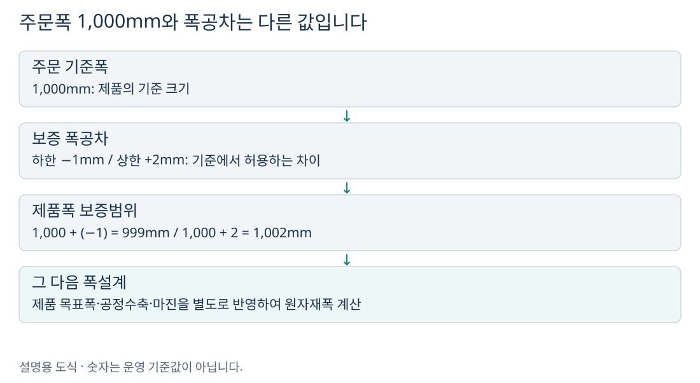
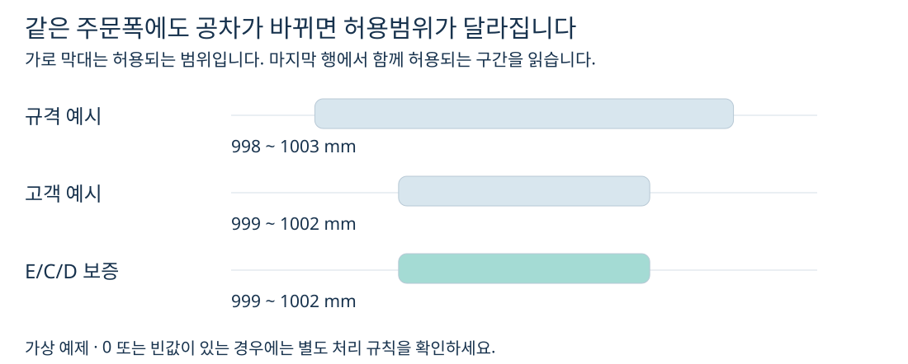
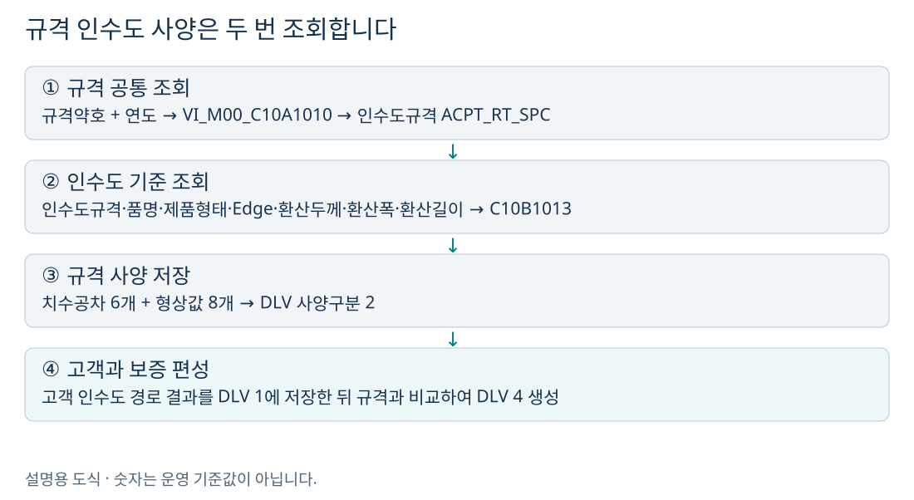
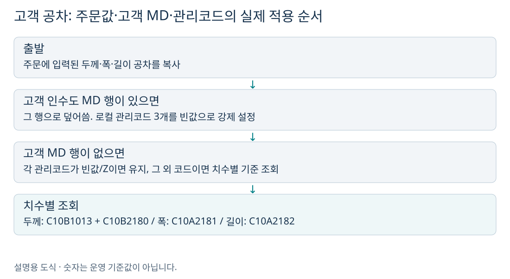
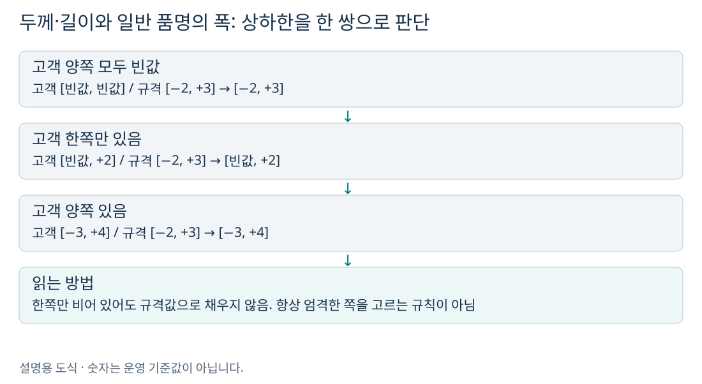
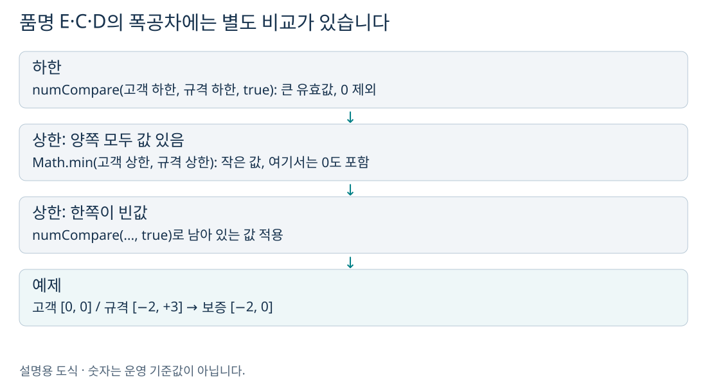
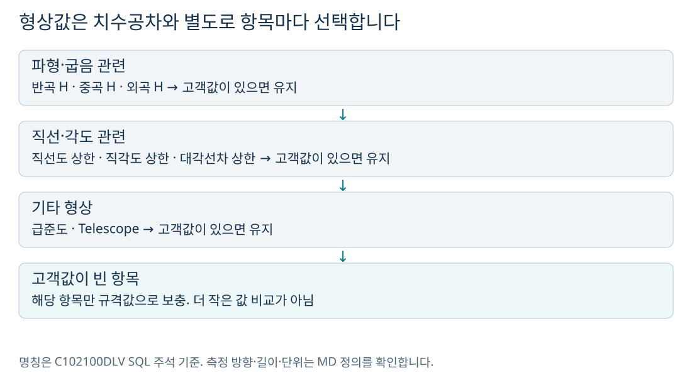

# 세 설계는 어디에 쓰이나요?

성분설계는 **무엇이 얼마나 들어 있는 강재를 허용할지**, 재질설계는 **어떤 강도·연신율·시험조건을 요구할지**, 인수도설계는 **납품 제품의 치수와 형상을 어디까지 허용할지**를 정합니다. 여기서 설계값은 검사 실측값이 아니라, 주문별로 편성하는 요구 사양입니다.

| 구분 | 쉽게 말하면 | 대표 결과 | 저장 테이블 끝 이름 |
|---|---|---|---|
| 성분 | 성분별 허용 함량 | C·Si·Mn 등의 하한/상한 | CHM |
| 재질 | 성능과 시험 요구 | TS·YP·연신율·시험 지시 | MQL |
| 인수도 | 납품 치수·형상 허용 | 두께·폭·길이 공차, 형상값 | DLV |

`QLT_DSN_SPC_TP`는 **1 고객 / 2 규격 / 3 사내 / 4 보증**입니다. 폭설계에서 보았던 적정·차선 구분 `QLT_DSN_MNF_TP`와 별개입니다. 이 세 사양은 주문번호·주문행·사양구분으로 저장하며, 적정·차선 원자재마다 같은 방식으로 별도 행을 만드는 구조가 아닙니다.

메인 서비스의 실행 순서는 **설계 Key → 규격 → 고객 → 사내 → 보증 성분 → 보증 재질 → 보증 인수도 → 제조·원자재·치수 설계 → 타당성 검사**입니다. 사양구분 숫자 순서와 실행 순서를 혼동하지 마세요. 사내 단계는 성분·재질을 다루며 인수도에는 이 클래스의 사내 분기가 없습니다.

> 이 문서는 현재 저장소의 Java·서비스 XML·SQL을 분석했습니다. 예제 숫자와 문자 코드 A/B/C는 설명용 가상값입니다. 운영 MD(기준정보)의 실제 행, 계산식 실행 결과, DB 저장 결과를 조회한 문서는 아닙니다.

# 그림으로 먼저 이해하기: 납품 제품의 허용 오차를 정합니다

이 프로젝트의 인수도설계는 납품 치수공차와 형상 사양을 편성합니다. 먼저 **기준 치수**와 **공차**를 구별하면 이해가 쉽습니다. 주문폭 1,000mm에 공차 −1~+2mm라면 제품폭의 보증범위는 999~1,002mm입니다. 원자재폭 999~1,002mm를 주문한다는 뜻은 아닙니다.

# 규격 공차는 어디서 찾나요?

| 단계 | 조회처 | 입력 |
|---|---|---|
| 규격 공통 | VI_M00_C10A1010 | SPC_AVR, SPC_YR |
| 규격 인수도 | C10B1013 | ACPT_RT_SPC, PRD_NM_CD, PRD_SHP, ORD_EDG_ASG_TP, ORD_EXC_THK, ORD_EXC_WTH, ORD_EXC_LTH |
| 고객 인수도 | VI_M00_C10A1023 | CUS_BTH_PAP_NO |
| 폭 관리코드 | VI_M00_C10A2181 | ORD_WTH_MNG_CD |
| 길이 관리코드 | VI_M00_C10A2182 | ORD_LTH_MNG_CD |
| 두께 관리코드 계산 | C10B2180 | 규격 두께공차 하한·상한, ORD_THK_MNG_CD, L/U 구분 |

`C10B2180`은 외부 MD 계산 호출입니다. 이 Java에는 관리코드별 계산식 본문이 없으므로, 특정 관리코드의 수치를 임의로 공식화하지 않았습니다. 실제 식과 MD 입력·출력을 확인해야 합니다.

# 고객 공차가 만들어지는 순서

1. 주문 공차 `ORD_THK_TLN_*`, `ORD_WTH_TLN_*`, `ORD_LTH_TLN_*`에 값이 있으면 작업값에 복사합니다.
2. 고객사양번호가 있으면 고객 인수도 뷰를 조회합니다. **한 행 이상 있으면 첫 행을 읽고 로컬 두께·폭·길이 관리코드를 모두 빈값으로 바꿉니다.** 이후 고객 MD의 공차를 복사하므로 기존 주문값을 null로 덮어쓸 수도 있습니다.
3. 관리코드가 모두 빈값 또는 Z이면 성공으로 종료합니다. 고객 MD 행을 읽은 경로는 위 강제 초기화로 이 조건을 만족합니다.
4. 고객 MD 행이 없고 관리코드가 빈값/Z가 아니라면 치수별로 기준을 조회해 공차를 다시 정합니다. 두께는 규격 공차에 관리코드를 적용하는 MD 계산을 두 번 호출하고, 폭·길이는 관리코드 뷰의 값을 복사합니다.

따라서 “주문값이 무조건 최우선” 또는 “관리코드가 있으면 언제나 고객 MD보다 우선”으로 설명하면 현재 코드와 맞지 않습니다. 바깥 고객 서비스는 고객사양번호가 없어도 인수도 하위 서비스로 진입할 수 있어 주문 공차·관리코드 경로가 가능합니다.

# 보증사양 선택 규칙을 비교해 봅시다

| 항목 | 고객값 적용 | 고객값이 비었을 때 | 규격과 엄격도 비교 |
|---|---|---|---|
| 두께 공차 한 쌍 | 한쪽이라도 있으면 쌍 유지 | 양쪽 모두 비었을 때만 규격 쌍 적용 | 하지 않음 |
| 길이 공차 한 쌍 | 동일 | 동일 | 하지 않음 |
| E/C/D 외 품명의 폭공차 | 동일 | 동일 | 하지 않음 |
| E/C/D 폭 하한 | 규격과 numCompare(true) | 남아 있는 값 | 큰 유효값, 0 제외 |
| E/C/D 폭 상한 | 양쪽 값이 있으면 Math.min | 한쪽 빈값이면 남아 있는 값 | 작은 값, 0 포함 |
| 형상 8개 항목 | 항목별 고객값 유지 | 해당 항목만 규격 적용 | 하지 않음 |

여기서 “일반 품명”은 단지 이 분기에서 E·C·D를 제외한 품명을 뜻합니다. 제품 분류를 새로 정의한 용어가 아닙니다. **0은 빈값이 아니므로 [0,0]도 고객 쌍이 있는 것으로 간주**됩니다.

예를 들어 고객 −1~+2, 규격 −2~+3이면 E/C/D 보증은 −1~+2입니다. 하지만 고객 하한 0과 규격 하한 −2를 비교하면 공통 함수가 0을 제외하여 **−2**를 선택합니다. 상한에서 고객 0과 규격 +3을 비교하면 이 분기의 직접 `Math.min`은 **0**을 선택합니다. 같은 공차 쌍에서도 0을 다르게 다룹니다.

# 형상은 어떤 항목을 설계하나요?

| 분류 | 필드 | 의미 |
|---|---|---|
| 두께 | THK_TLN_LLV / ULV | 두께 공차 하한·상한 |
| 폭 | WTH_TLN_LLV / ULV | 폭 공차 하한·상한 |
| 길이 | LTH_TLN_LLV / ULV | 길이 공차 하한·상한 |
| 굽음·파형 | HWAV_H / MWAV_H / EWAV_H | 반곡 H / 중곡 H / 외곡 H |
| 직선·각도 | SLR_ULV / RAR_ULV / DGLN_DIF_ULV | 직선도 / 직각도 / 대각선차 상한 |
| 기타 | STPN / TLC | 급준도 / Telescope |

형상값을 모두 mm로 간주하거나 모든 상한에서 작은 값을 고르면 코드와 달라집니다. 예를 들어 고객 직선도 상한 5, 규격 3이면 이 편성 단계에서는 고객 **5**를 유지합니다. 측정 기준길이·단위와 허용 여부는 기준정보 및 후속 검사를 함께 확인합니다.

# 예제 선택으로 비교하기

# 폭·두께 설계와 연결해서 보기

`DbSearchWthSizeData`는 `WTH_TLN_LLV/ULV`, `DbSearchThkSizeData`는 `THK_TLN_LLV/ULV`를 읽습니다. 인수도설계는 제품의 허용범위를 제공하고, 후속 치수설계는 목표치와 공정별 여유·수축 등을 적용합니다. 같은 주문폭이라도 공차와 목표폭은 서로 다른 역할을 하므로 “보증 폭공차 상한 = 원자재 폭여유”로 바꾸어 읽지 마세요.

# 저장·오류·코드상 주의점

인수도 결과는 `TB_C10_QLT_DSN_DLV`에 저장합니다. 보증 서비스 `C102100150`은 14개 값을 초기화하고 보증 편성 후 `C102100DLV.insert`를 실행합니다. 이 클래스의 보증은 고객 1과 규격 2만 읽으며 사내 3을 읽는 분기가 없습니다.

| 확인 지점 | 대표 코드 | 의미 |
|---|---|---|
| 규격 공통 조회 | KS01 / KS11 | 0건 / 중복 |
| 규격 인수도 기준 | KS30 / KS21 | 조회 실패·0건 / 중복 |
| 두께 관리코드 계산 | KS05 | C10B2180 계산 예외 |
| 폭 관리코드 조회 | KS09 / KS19 | 0건 / 중복 |
| 보증 편성 | KS24 | 규격 인수도 결과행 없음 |
| 보증 저장 | TB04 | INSERT 실패 경로 |

고객 인수도 조회는 `count() != 0` 분기가 `count() > 1`보다 먼저 있어 **중복도 첫 행 사용 경로에 들어갑니다**. 뒤에 적힌 중복 오류 KS18이 이 조건에서 실행된다고 설명할 수 없습니다. 첫 행 선택이 운영상 올바른지는 별도 확인이 필요합니다.

또한 후속 `DbSearchDsnValidData`의 인수도 고객 조회 지점은 `SELECT_DLV`가 아니라 `SELECT_CHM`을 호출합니다(1416행). 따라서 보증 편성 클래스의 규칙과 검사 단계의 실제 동작을 구분해야 합니다. 문서는 확인한 코드 동작을 설명하며, 이 잠재 문제를 운영 코드에서 수정하지는 않았습니다.

# 실제 주문을 확인하는 순서

1. 주문번호와 주문행으로 대상 한 건을 고정합니다.
2. 공통정보에서 규격약호·연도·고객사양번호·품명·재질코드·주문환산치수를 확인합니다.
3. 아래 기준정보의 조회 키와 일치하는 MD 행을 확인합니다. 실제 임계값은 이 MD에 있습니다.
4. 결과 테이블의 사양구분 1·2·3·4를 나란히 봅니다. 인수도에는 이 경로의 3번 사양이 없습니다.
5. 한 항목씩 보증값의 출처를 추적합니다. 빈값과 0을 구별하고, 재질은 후속 수정 여부도 확인합니다.
6. 설계 오류 로그와 상태, 최종 저장값을 함께 봅니다. 이 문서의 계산 예제가 실제 서비스의 정상 완료를 보장하지는 않습니다.

# 함께 읽기

- [성분설계 분석서](성분설계_쉽게이해하기.html)
- [재질설계 분석서](재질설계_쉽게이해하기.html)
- [인수도설계 분석서](인수도설계_쉽게이해하기.html)
- [적정·차선 원자재 폭설계 분석서](적정_차선_원자재_폭설계_쉽게이해하기.html)

# 소스 근거 찾아보기

행 번호는 분석 시점 기준입니다. 파일을 열어 클래스명·조건문·SQL ID로도 찾을 수 있습니다.

- [고객: 138~397행 / 규격: 398~521행 / 보증: 522~687행](../../src/com/unionsteel/mes/c10/activity/nui/DbSearchDeliSpec.java)
- [보증 인수도 서비스](../../src/service/C102100150-service.xml)
- [인수도 저장·조회](../../src/query/C102100DLV-query.glue_sql)
- [후속 폭설계의 공차 입력](../../src/com/unionsteel/mes/c10/activity/nui/DbSearchWthSizeData.java)
- [후속 두께설계의 공차 입력](../../src/com/unionsteel/mes/c10/activity/nui/DbSearchThkSizeData.java)
- [전체 실행 순서](../../src/service/C102100000-service.xml)
- [고객사양 분기와 인수도 연결](../../src/service/C102100030-service.xml)
- [공통 비교: numCompare 219~249행](../../src/com/unionsteel/mes/c10/activity/common/DbCommonUtil.java)
- [후속 검사 및 상태 처리; 재질 갱신 2558·2605·2655행](../../src/com/unionsteel/mes/c10/activity/nui/DbSearchDsnValidData.java)
