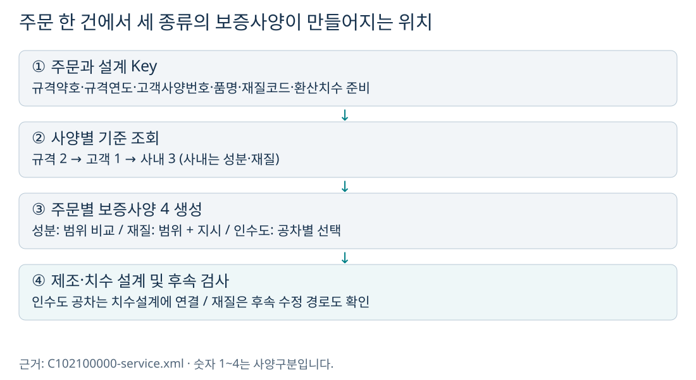
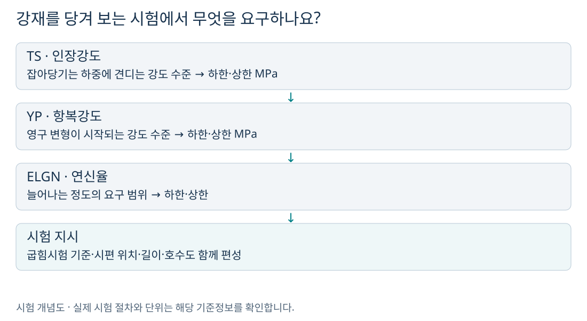
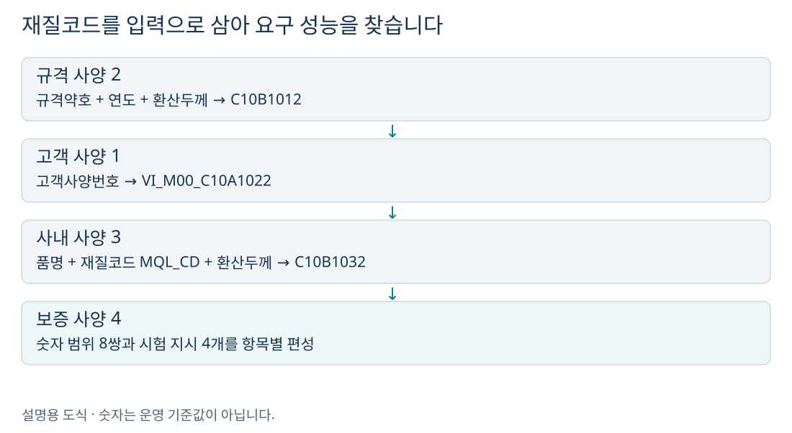
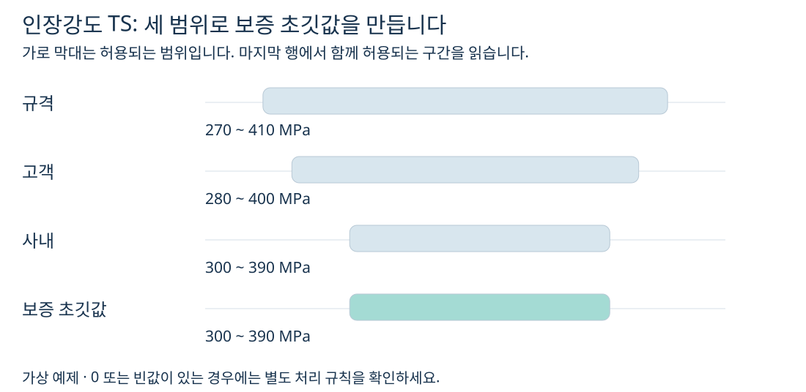
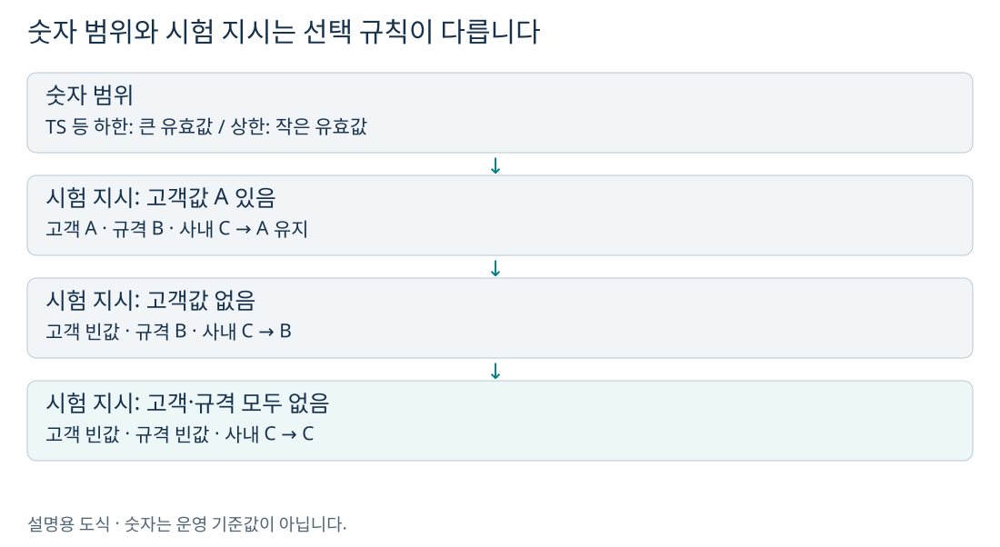
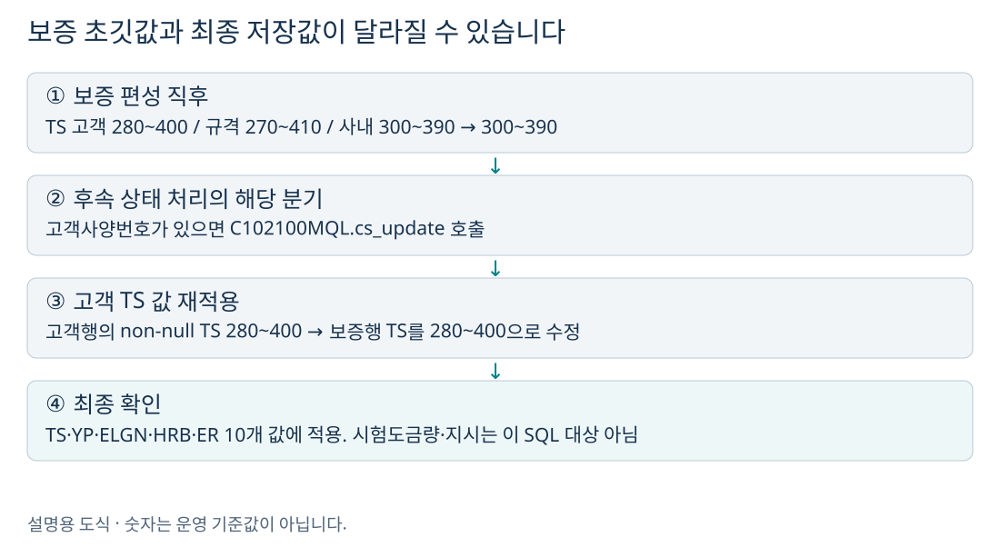

# 세 설계는 어디에 쓰이나요?

성분설계는 **무엇이 얼마나 들어 있는 강재를 허용할지**, 재질설계는 **어떤 강도·연신율·시험조건을 요구할지**, 인수도설계는 **납품 제품의 치수와 형상을 어디까지 허용할지**를 정합니다. 여기서 설계값은 검사 실측값이 아니라, 주문별로 편성하는 요구 사양입니다.

| 구분 | 쉽게 말하면 | 대표 결과 | 저장 테이블 끝 이름 |
|---|---|---|---|
| 성분 | 성분별 허용 함량 | C·Si·Mn 등의 하한/상한 | CHM |
| 재질 | 성능과 시험 요구 | TS·YP·연신율·시험 지시 | MQL |
| 인수도 | 납품 치수·형상 허용 | 두께·폭·길이 공차, 형상값 | DLV |

`QLT_DSN_SPC_TP`는 **1 고객 / 2 규격 / 3 사내 / 4 보증**입니다. 폭설계에서 보았던 적정·차선 구분 `QLT_DSN_MNF_TP`와 별개입니다. 이 세 사양은 주문번호·주문행·사양구분으로 저장하며, 적정·차선 원자재마다 같은 방식으로 별도 행을 만드는 구조가 아닙니다.

메인 서비스의 실행 순서는 **설계 Key → 규격 → 고객 → 사내 → 보증 성분 → 보증 재질 → 보증 인수도 → 제조·원자재·치수 설계 → 타당성 검사**입니다. 사양구분 숫자 순서와 실행 순서를 혼동하지 마세요. 사내 단계는 성분·재질을 다루며 인수도에는 이 클래스의 사내 분기가 없습니다.

> 이 문서는 현재 저장소의 Java·서비스 XML·SQL을 분석했습니다. 예제 숫자와 문자 코드 A/B/C는 설명용 가상값입니다. 운영 MD(기준정보)의 실제 행, 계산식 실행 결과, DB 저장 결과를 조회한 문서는 아닙니다.

# 그림으로 먼저 이해하기: 필요한 성능과 시험조건을 정합니다

재질코드가 같은 제품이라도 두께나 고객 요구가 다르면 적용 사양이 달라질 수 있습니다. 이 분석의 중심인 `DbSearchMechData`는 **이미 정해진 재질코드 등을 입력으로 받아 강도·연신율·시험 지시를 편성**합니다. 재질코드 자체의 선정은 앞선 설계 Key 단계와 구별해서 읽습니다.

# 입력에서 재질사양까지

| 사양 | 조회처 | 입력 키 |
|---|---|---|
| 고객 1 | VI_M00_C10A1022 | CUS_BTH_PAP_NO |
| 규격 2 | C10B1012 | SPC_AVR, SPC_YR, ORD_EXC_THK |
| 사내 3 | C10B1032 | PRD_NM_CD, MQL_CD, ORD_EXC_THK |
| 보증 4 | C102100MQL.select | ORD_NO, ORD_LN, 사양구분 |

규격·사내 MD 조회는 정확히 1건을 요구합니다. 고객 조회 0건은 false로 해당 하위 서비스가 끝나며, 고객사양번호 자체가 없으면 바깥 서비스에서 성분·재질 조회를 생략합니다. 보증 단계는 고객행을 먼저 복사하고 규격행을 반드시 읽은 뒤, 사내행이 있으면 추가로 비교합니다.

# 어떤 항목을 설계하나요?

| 항목 | 저장 필드 | 편성 방식 |
|---|---|---|
| 인장강도 TS | TS_LLV_MPA / TS_ULV_MPA | 하한 큰 값 / 상한 작은 값 |
| 항복강도 YP | YP_LLV_MPA / YP_ULV_MPA | 동일 |
| 연신율 | ELGN_LLV / ELGN_ULV | 동일 |
| HRB 경도 | HRB_LLV / HRB_ULV | 동일 |
| ER 시험값 | ER_LLV / ER_ULV | 동일 |
| 시험도금량 전면·후면·전체 | TST_GW_FRN / BAK / TOT의 LLV·ULV | 각각 독립 비교 |
| 굽힘시험 기준 | MQL_BND_TST_STD_CD | 고객 → 규격 → 사내의 첫 빈값 아닌 값 |
| 시편 채취 위치 | TST_PIC_GTH_INST_LOC | 동일 |
| 시편 채취 길이 | TST_PIC_GTH_INST_LTH | 동일; 길이여도 max/min 아님 |
| 시편 호수 | TPG_RGS_NO | 동일 |

총 **수치 8쌍(16개) + 시험 지시 4개 = 20개**입니다. ER은 소스·SQL에서 ER로 표기하므로 이 문서에서는 검증되지 않은 풀이나 단위를 붙이지 않습니다. 시험도금량도 제조 중 작업 도금량 목표와 구별해야 합니다. 전면·후면을 더해 전체값을 만드는 것이 아니라, 이 클래스는 세 범위를 각각 비교합니다.

# TS 하나로 따라가는 보증 편성

| 단계 | 하한 MPa | 상한 MPa |
|---|---:|---:|
| 고객값으로 시작 | 280 | 400 |
| 규격 270~410 비교 | 280 | 400 |
| 사내 300~390 비교 | 300 | 390 |

양쪽 숫자가 유효하고 0이 아니면 하한은 max, 상한은 min입니다. 공통 `numCompare`는 빈값을 먼저 처리한 뒤 0을 비교에서 제외하므로, 예를 들어 상한 0과 400의 결과는 400입니다. 양쪽 0은 0으로 남습니다. 하한이 상한보다 커지는 충돌을 이 편성 클래스가 자동 조정하지는 않습니다.

# 시험 지시는 어떻게 고르나요?

예를 들어 시편 채취 길이가 고객 80, 규격 100, 사내 120이면 결과는 **80**입니다. 숫자처럼 보여도 이 필드는 범위 비교 목록에 없기 때문입니다. 고객이 비고 규격이 100이면 100입니다. 지시값 0도 `isNull`이 아니면 유지될 수 있어 수치 범위의 0 처리와 다릅니다.

# 꼭 확인할 두 번째 단계: 고객값으로 후속 수정

`DbSearchDsnValidData`의 오류가 없는 쪽 상태 처리에는 고객사양번호가 비어 있지 않으면 `UPDATE_MQL`을 호출하는 경로가 있습니다. 상수는 `C102100MQL.cs_update`이며, 이 SQL은 **보증행 4의 TS·YP·ELGN·HRB·ER 상하한 10개를 고객행 1의 값으로 갱신**합니다. 일반적인 수동/자동 상태 처리와 별도의 자동 처리 경로에 호출이 있습니다. 모든 주문에 무조건 실행된다고 볼 수는 없습니다.

고객 열이 null이면 `NVL(고객값, 기존 보증값)`로 기존값을 유지합니다. 고객값이 0이면 null이 아니므로 0을 적용합니다. 이 규칙은 앞의 `numCompare`와 다릅니다. 특히 **고객행 자체가 없으면 스칼라 하위 쿼리 결과가 null**이므로, “행이 없을 때도 NVL이 기존값을 보존한다”고 읽으면 안 됩니다. 실제 데이터와 실행 분기를 확인해야 합니다.

위 예시에서 보증 편성 직후 300~390이더라도 해당 SQL이 실행되면 고객 TS 280~400이 됩니다. 따라서 결과 화면의 TS가 단순 교집합 계산과 다를 때는 후속 수정부터 추적하세요. 이 SQL은 시험도금량 6개와 시험 지시 4개를 수정하지 않습니다.

# 예제 선택으로 비교하기

# 저장·오류·검사에서 확인할 사항

`C102100140`은 20개 재질값을 초기화하고 보증 편성을 실행한 뒤 `C102100MQL.insert`로 `TB_C10_QLT_DSN_MQL`에 저장합니다. 그 이후 값이 바뀌는지까지 확인해야 최종 결과 설명이 완성됩니다.

| 확인 지점 | 대표 코드·경로 | 확인 내용 |
|---|---|---|
| 고객 조회 중복 | KC11 | 고객 재질행 2건 이상 |
| 규격 조회 | KS03 | 조회 예외·0건·중복에 같은 코드 사용 |
| 사내 조회 | KN02 / KN12 | 기준 없음 등 / 중복 |
| 보증 편성 | KS23 | 규격 재질 결과행 없음 |
| 보증 저장 | TB03 | INSERT 실패 경로 |
| 최종 갱신 | C102100MQL.cs_update | 고객 10개 수치로 수정 여부 |

후속 검사 소스에는 재질 고객사양을 읽는 지점에서 `SELECT_MQL` 대신 **`SELECT_CHM`을 호출하는 코드가 존재**합니다(1116행). 주석상의 의도와 실행 대상이 다릅니다. 검사에서 모든 고객 재질 불일치가 정상 검출된다고 단정하지 않고, 해당 경로의 실행 로그와 조회 결과를 확인해야 합니다. 본 작업은 이 동작을 문서화했으며 운영 코드는 수정하지 않았습니다.

# 실제 주문을 확인하는 순서

1. 주문번호와 주문행으로 대상 한 건을 고정합니다.
2. 공통정보에서 규격약호·연도·고객사양번호·품명·재질코드·주문환산치수를 확인합니다.
3. 아래 기준정보의 조회 키와 일치하는 MD 행을 확인합니다. 실제 임계값은 이 MD에 있습니다.
4. 결과 테이블의 사양구분 1·2·3·4를 나란히 봅니다. 인수도에는 이 경로의 3번 사양이 없습니다.
5. 한 항목씩 보증값의 출처를 추적합니다. 빈값과 0을 구별하고, 재질은 후속 수정 여부도 확인합니다.
6. 설계 오류 로그와 상태, 최종 저장값을 함께 봅니다. 이 문서의 계산 예제가 실제 서비스의 정상 완료를 보장하지는 않습니다.

# 함께 읽기

- [성분설계 분석서](성분설계_쉽게이해하기.html)
- [재질설계 분석서](재질설계_쉽게이해하기.html)
- [인수도설계 분석서](인수도설계_쉽게이해하기.html)
- [적정·차선 원자재 폭설계 분석서](적정_차선_원자재_폭설계_쉽게이해하기.html)
- [용융·전기 제조표준 설계 분석서](용융_전기_제조표준_설계_쉽게이해하기.html)
- [후공정 제조표준 설계 분석서](후공정_제조표준_설계_쉽게이해하기.html)

# 소스 근거 찾아보기

행 번호는 분석 시점 기준입니다. 파일을 열어 클래스명·조건문·SQL ID로도 찾을 수 있습니다.

- [재질 조회·보증 편성: 106~492행](../../src/com/unionsteel/mes/c10/activity/nui/DbSearchMechData.java)
- [보증 재질 서비스](../../src/service/C102100140-service.xml)
- [재질 저장·조회 및 cs_update: 123~143행](../../src/query/C102100MQL-query.glue_sql)
- [전체 실행 순서](../../src/service/C102100000-service.xml)
- [고객사양 분기와 인수도 연결](../../src/service/C102100030-service.xml)
- [공통 비교: numCompare 219~249행](../../src/com/unionsteel/mes/c10/activity/common/DbCommonUtil.java)
- [후속 검사 및 상태 처리; 재질 갱신 2558·2605·2655행](../../src/com/unionsteel/mes/c10/activity/nui/DbSearchDsnValidData.java)
