# 읽기 전에: 이 문서는 무엇을 설명하나?

**폭설계는 완제품에 필요한 폭을 출발점으로 삼아, 공정에서 줄어드는 폭과 마진을 반영해 원자재 목표폭을 정하는 과정입니다.** 다만 적정·차선의 원자재 종류, Edge, Slit, 대체공정에 따라 계산 경로가 달라집니다. ‘주문폭에 일정한 여유를 더한다’는 공식 하나로는 설명할 수 없습니다.

사용자가 제시한 [PLTCM 압연 SET 해설서](PLTCM_압연SET_쉽게이해하기.html)의 구성과 표현 방식을 참고해, 용어 → 분기 → 계산 예제 → 예외 → 코드 근거 순서로 작성했습니다. 처음 읽는 분은 앞의 **‘그림으로 먼저 이해하기’**에서 제품폭을 기준으로 흐름을 익히고, 실제 주문의 차이를 조사하는 분은 뒤의 **상세 분석 1~10장과 부록**을 함께 읽으면 됩니다. 이번 보완에서는 제품폭 출발 그림 8개와 소재 경로 선택 예제를 추가했습니다.

분석 기준은 **2026-09-09 현재 이 작업 폴더의 Java·서비스 XML·SQL·화면 소스**입니다. 운영 배포본이나 운영 DB의 업무기준 행은 조회하지 않았습니다. 모든 숫자 예제와 원자재별 수축·마진 값은 **설명용 가정**이며 실적이나 표준값이 아닙니다. 단위는 별도 표시가 없으면 mm입니다. 기존 두께 분석서와 실행 코드는 수정하지 않았습니다.

# 그림으로 먼저 이해하기: 제품폭에서 원자재폭까지

**처음 읽는 분은 이 부분부터 보세요.** 아래에서는 코드명을 잠시 내려놓고, **제품목표폭 1,002mm를 만들기 위해 어느 폭의 소재를 준비하는지**를 따라갑니다. 이후 본문 1~10장은 이 그림의 정확한 조건·코드 근거를 설명합니다.

여기서 제품폭은 고객이 주문서에 적은 폭과 구별됩니다. **제품목표폭은 주문폭·조합폭에 제품폭여유를 반영한 설계값**입니다. 예를 들어 일반 1폭 주문의 주문폭 1,000에 여유 2를 더하면 제품목표폭은 1,002입니다. **이제부터 1,002에서 출발하므로 제품폭여유 2를 다시 더하지 않습니다.** Slit·재단선이 있으면 제품목표폭의 출발 단위부터 달라질 수 있으며, 입문 그림 H에서 따로 살펴봅니다.

## 가. 먼저 ‘가공 순서’와 ‘계산 순서’를 반대로 읽는다

열연 소재를 사서 압연하고 도금한 뒤 제품을 만드는 경우, 생산은 **원자재 → 압연 → 도금 → 제품** 방향으로 진행됩니다. 폭설계는 제품에서 필요한 폭을 먼저 알고 있으므로 그 순서를 거슬러 계산합니다.

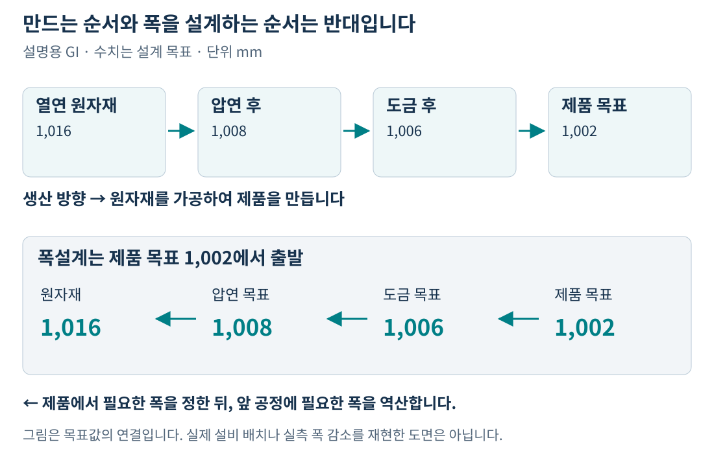

**제품목표폭 1,002 → 도금 목표폭 1,006 → 압연 목표폭 1,008 → 원자재 목표폭 1,016.** 이것이 앞으로 반복해서 볼 기준 예제입니다. GI는 용융도금 제품, CGL은 그 도금 공정, PLTCM은 산세·냉간압연 공정을 가리킵니다. 그림의 ‘도금 목표’는 CGL폭, ‘압연 목표’는 PLTCM폭입니다.

이 연결은 폭설계 값을 설명하기 위한 단순화입니다. 실제 공정 목록 전체나 실측 폭 변화 그래프는 아닙니다. 수축·마진은 모두 설명용 조회값으로 가정했습니다. [근거 S1~S3]

## 나. 제품폭 1,002에 왜 14mm를 더할까?

아래 예제는 **GI, Edge S, 정전 통과, 대체공정 없음, 중간재 미적용 열연 원자재**입니다. 정전은 여기서는 제품 쪽 후공정으로 읽으면 됩니다. 각 단계의 실제 통과 여부는 통과공정 코드를 확인합니다.

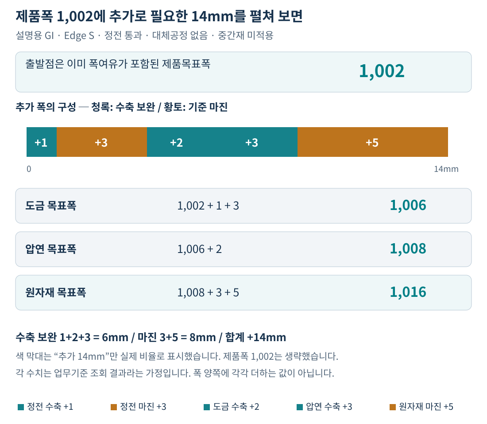

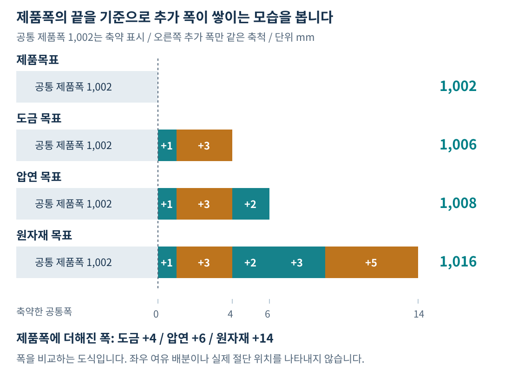

회색은 모든 단계에 공통인 제품폭, 오른쪽 색 부분은 추가로 필요한 폭입니다. 공통폭은 축약했으며 **추가 폭만 동일 축척**으로 그렸습니다. 따라서 좁은 여유가 제품 전체에서 차지하는 실제 비율로 읽지 않습니다.

읽는 순서는 세 번의 덧셈입니다.

1. **제품에서 도금 쪽으로:** 1,002에 정전수축 1과 정전마진 3을 더해 **도금 목표폭 1,006**을 준비합니다.
2. **도금에서 압연 쪽으로:** 1,006에 도금수축 2를 더해 **압연 목표폭 1,008**을 준비합니다.
3. **압연에서 열연 원자재 쪽으로:** 1,008에 압연수축 3과 원자재마진 5를 더해 **원자재 목표폭 1,016**을 정합니다.

> **제품목표폭 1,002 + 수축 보완(1+2+3) + 마진(3+5) = 원자재 목표폭 1,016**

이 식을 모든 제품의 공통식으로 쓰지는 않습니다. **지금 선택한 일반 열연 GI 사례**에서는 이렇게 펼칠 수 있다는 뜻입니다. 구매 소재·Edge·대체공정·Slit 조건이 달라지면 뒤의 그림처럼 경로가 바뀝니다. [근거 S2: 1255~1288행, S3: 641~644행]

## 다. ‘수축’과 ‘마진’을 양쪽에 두 번 더하지 않는다

수축량은 뒤 공정에 필요한 폭을 확보하기 위해 보완하는 값이고, 마진은 별도의 업무기준이 지정하는 추가 폭입니다. 둘 다 폭을 늘리는 항으로 쓰이지만 **조회하는 기준과 의미가 다릅니다.**

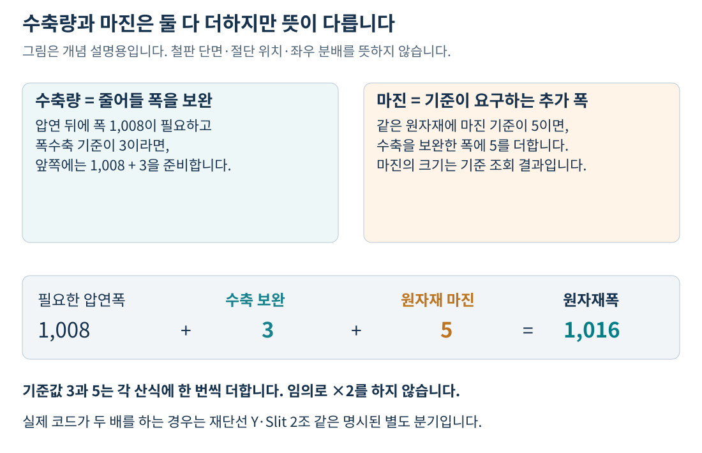

코드가 폭수축 3을 더한다고 해서 ‘왼쪽 3 + 오른쪽 3’으로 6을 더하면 안 됩니다. **산식에는 조회한 값이 한 번씩 들어갑니다.** 좌우에 얼마를 배분하는지는 이 폭설계 산식만으로 설명할 수 없습니다. 또한 마진 전부가 특정 공정에서 실제로 잘려 나간 실적이라는 뜻도 아닙니다. [근거 S3: 413~479, 641~644행]

## 라. 구매 소재를 바꾸면 어느 폭에서 계산을 마칠까?

열연을 사는 경우와 이미 압연·도금된 소재를 사는 경우는 필요한 원자재의 단계가 다릅니다. 그래서 같은 제품을 만들더라도 마지막에 사용할 기준폭이 달라집니다.

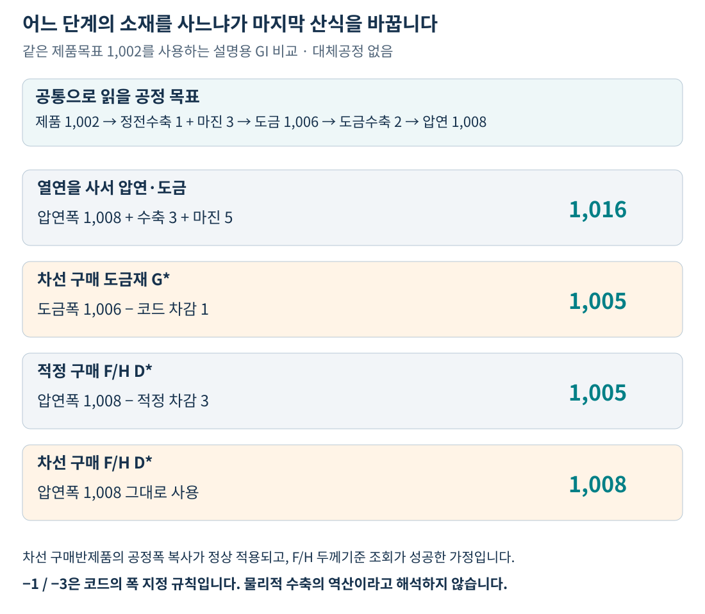

**구매 도금재 차선 1,005가 열연 적정 1,016보다 좁은 이유**는 ‘차선이라 폭을 줄이는 것’이 아닙니다. 열연은 압연 이전에 필요한 폭을 계산하고, 구매 도금재는 이미 도금 단계에 있는 소재의 폭을 지정하기 때문입니다. 다만 **−1이나 −3이라는 숫자 자체는 현행 코드의 지정 규칙**이며, 물리적으로 그만큼 수축하거나 늘어난다는 해석은 하지 않습니다.

이 그림에서 구매반제품 차선은 적정의 공정폭을 정상적으로 복사했다고 가정합니다. F/H(Full Hard, 압연 후 경질 소재)는 두께기준 조회가 성공한 경우입니다. **적정 입력 원자재가 `D*`이면 압연 최대폭−3, 차선 F/H는 그 최대폭 그대로**입니다. 구매 CR(냉연) `C*`은 별도로 TM 주공정 목표폭−3을 사용하며, 원문 6.3절에 반올림까지 정리했습니다. [근거 S1~S5, S10]

### 같은 제품폭으로 경로를 직접 바꿔 보기

아래에서 소재 경로를 바꾸면 제품목표폭에서 원자재폭까지의 단계와 차이를 바로 비교할 수 있습니다. **모든 선택지는 기준값을 고정한 설명용 예제**이며, 운영 주문의 업무기준을 조회하는 계산기는 아닙니다. JavaScript가 꺼져 있거나 Markdown으로 읽는 경우에는 입문 그림 E와 본문 7장의 표를 이용하세요.

## 마. Edge 조건이 C/N이면 마지막 덧셈이 달라진다

Edge는 주문의 가장자리 처리 구분입니다. S=Slit, M=Mill, C=Coil Edge, N=No Slit입니다. **아래는 중간재 미적용 일반 열연 경로에서 마지막 분기만 비교**한 것입니다. 구매 CR·도금재·F/H의 별도 산식에 이 표를 겹쳐 적용하지 않습니다.

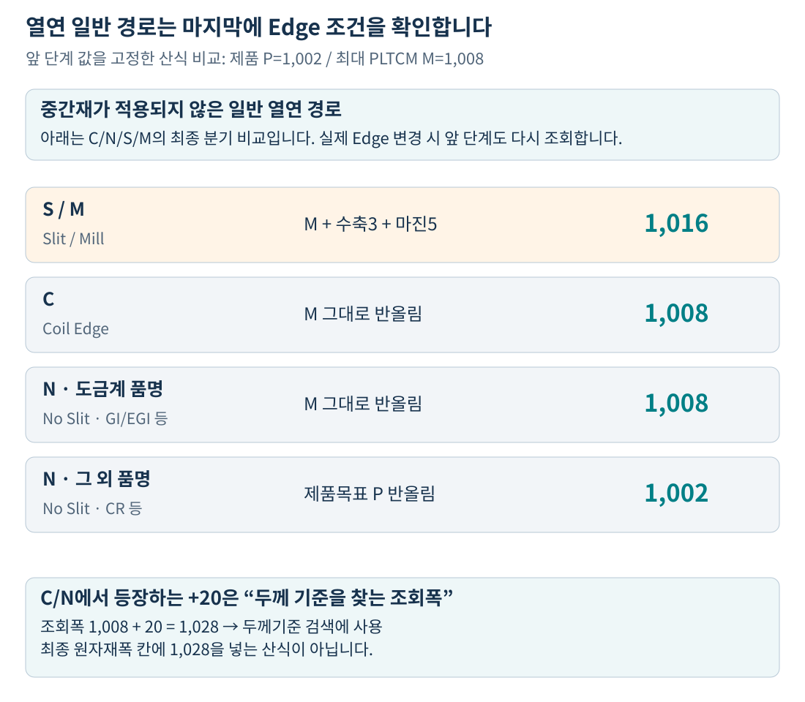

GI 같은 도금계 제품에서 C/N이면 마지막 단계의 수축·마진을 더하지 않고 최대 PLTCM폭을 반올림합니다. N이라도 CR 등 다른 품명은 제품목표폭을 사용하는 분기가 있습니다. **실제 Edge를 바꾸어 재설계하면 앞 단계의 마진과 공정폭도 바뀔 수 있으므로**, 이 그림을 실제 주문의 Edge 변경 결과로 그대로 사용하지는 않습니다.

또한 **‘+20mm’는 원자재두께 기준을 찾는 조회조건**입니다. 폭이 1,008일 때 1,028로 두께기준을 찾더라도, 원자재폭에 20을 직접 더하여 저장하는 공식은 아닙니다. [근거 S3: 324~337, 501~644행]

## 바. 대체공정이 여러 개면 폭을 더하지 않고 가장 큰 폭을 고른다

앞의 설명은 대체공정이 없었습니다. 대체공정이 있으면 같은 제품폭에서 출발하더라도 공정별 수축기준에 따라 필요한 압연폭이 달라질 수 있습니다.

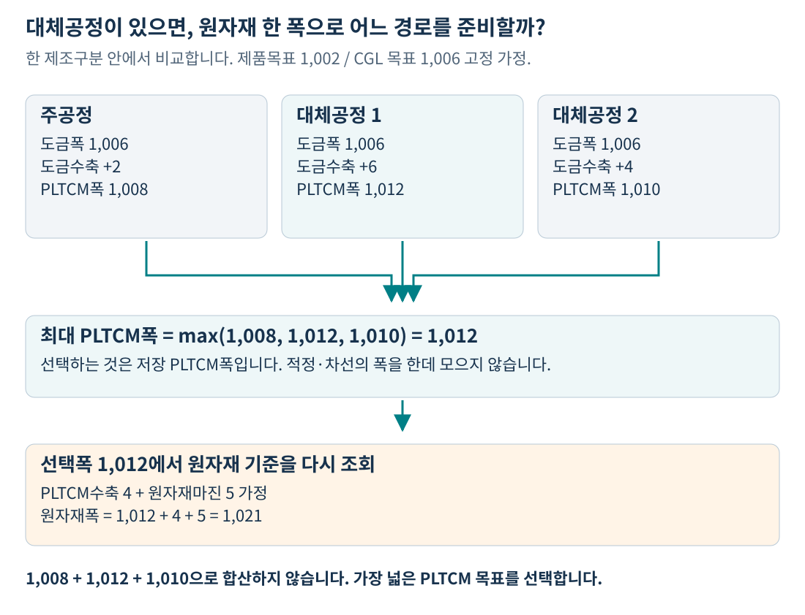

원자재는 1,008·1,012·1,010을 합산한 폭이 아닙니다. **그 행의 저장 PLTCM폭 중 최대인 1,012를 골라**, 그 폭에 맞는 수축·마진 기준을 다시 조회합니다. 예제에서 수축 4, 마진 5가 조회되면 최종 폭은 **1,021**입니다.

이 비교는 적정 행 안에서 한 번, 차선 행 안에서 다시 한 번 이루어집니다. **원자재 후보인 적정·차선과 설비 경로인 주·대체공정은 다른 축**입니다. PL/ST 목표폭의 최대값 제한도 다른 계산이며, 본문 5장에서 구별합니다. [근거 S2, S3: 256~283, 413~449행]

## 사. 제품폭이 한 조 기준이면 먼저 두 조 폭으로 펼친다

재단선 Y·Slit 2조에서는 제품목표폭 602가 한 조 기준으로 계산되는 특례가 있습니다. 이때 원자재는 두 조를 준비하는 폭이므로 ‘602에 조금 더한 값’을 예상하면 크게 어긋납니다.

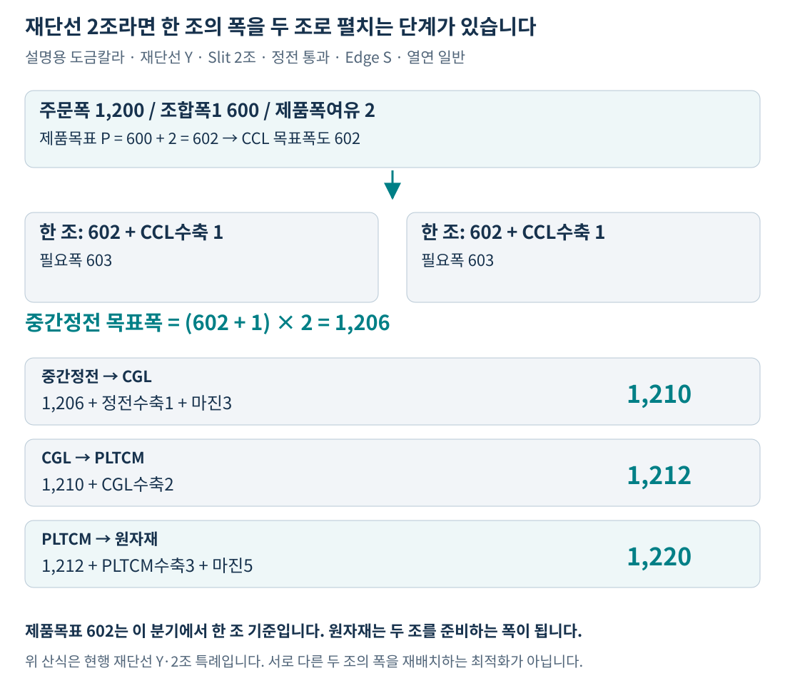

**602 → (602+1)×2=1,206 → 1,210 → 1,212 → 1,220** 순서입니다. 두 배가 되는 위치는 중간정전 목표폭을 만드는 단계입니다. 이후의 수축·마진을 모두 무조건 두 배로 만드는 규칙이 아닙니다. 또한 일반 Slit는 조합폭1~10을 합산하며, 이 재단선 Y·2조 특례와 산식이 다릅니다. [근거 S1: 343~395, 512~558행, S2: 1204~1288행, S3: 641~644행]

### 그림을 읽고 나서 실제 주문에 대입할 네 가지

| 먼저 정할 것 | 이 질문에 답하면 다음 산식이 정해진다 |
|---|---|
| 제품폭의 단위 | 이미 여유가 포함된 목표폭인가? 한 조 폭인가, 조합폭 합인가? |
| 구매 소재의 단계 | 열연인가, F/H인가, 구매 CR인가, 구매 도금재인가? |
| 공정 경로 | 도금·정전·CCL을 거치는가? 대체공정의 최대 PLTCM폭은 얼마인가? |
| 마지막 분기 | Edge C/N 특례인가? F/H 적정 −3인가? 소재별 −1/−3과 반올림은 무엇인가? |

아래 상세 분석에서는 이 네 질문을 실제 필드·업무기준·저장 경로와 연결합니다. 운영 기준값과 일치하는 최종 숫자를 얻으려면 본문 10장의 추적표에 주문별 조회 결과를 채워야 합니다.

# 코드와 연결해서 읽는 상세 분석

## 1. 먼저 ‘폭’이라는 이름의 값을 구별하자

### 1.1 주문폭, 공정폭, 원자재폭은 서로 다른 값이다

설명용 GI 주문폭이 **1,000**이라도 제품목표폭은 **1,002**, PLTCM 목표폭은 **1,008**, 원자재 목표폭은 **1,016**이 될 수 있습니다. 아래 그림은 정전·도금·압연 과정에서 필요한 여유를 거슬러 더하는 예입니다. [근거 S1~S3]

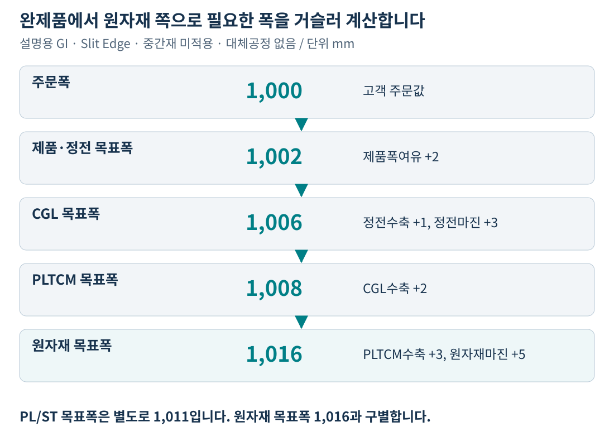

| 이름 | 쉽게 말하면 | 코드에서 찾는 이름 |
|---|---|---|
| 주문폭 | 주문서의 원래 폭 | `ORD_EXC_WTH` |
| 기준적용폭 | Slit·재단선 조건으로 바꾼 기준 조회용 폭 | 지역변수 `ord_exc_wth`, `cegl_exc_wth` 등. 단계마다 재계산 |
| 제품·정전 목표폭 | 제품폭여유를 포함한 제품 쪽 목표 | `COR_WTH_TRV` |
| CCL / 중간정전 목표폭 | 칼라 공정 및 재단선 조건을 반영한 중간 목표 | `CCL_WTH_TRV`, `MID_COR_WTH_TRV` |
| CGL / EGL / TM 목표폭 | 도금·조질압연 등의 공정 목표 | `CGL_WTH_TRV`, `EGL_WTH_TRV`, `TM_WTH_TRV` |
| PLTCM 목표폭 | 각 공정 경로에 필요한 PLTCM 폭 | `PLTCM_WTH_TRV`, `PLTCM_WTH_SUB_PROC1_TRV`, `PLTCM_WTH_SUB_PROC2_TRV` |
| PL/ST 목표폭 | PLTCM 수축·ST 보정·상한 제한을 거친 별도 설정값 | `PL_WTH_TRV`, `PL_WTH_SUB_PROC1_TRV`, `PL_WTH_SUB_PROC2_TRV` |
| 원자재 목표폭 | 이 제조사양 행에 최종 지정하는 원자재 폭 | `RMTL_TAR_WTH` |

여기의 ‘목표폭’은 설계값입니다. 설비가 실제로 측정한 폭을 의미하지 않습니다. 또한 `PL_WTH_TRV`와 `RMTL_TAR_WTH`는 산식이 달라서 서로 같아야 하는 값이 아닙니다.

### 1.2 적정·차선과 주공정·대체공정은 다른 구분이다

**적정·차선은 제조사양의 서로 다른 행**입니다. `QLT_DSN_MNF_TP=1`은 적정, `2`는 차선1, `3`은 차선2입니다. 본문의 두 행 비교 예제는 적정1과 차선1(제조구분2)을 사용하며, 일반적인 ‘제조구분≠1’ 분기는 차선2에도 적용됩니다. 저장 단위는 **주문번호 + 주문행 + 제조구분**입니다. 원자재 선정 로직이 후보 원자재코드를 등록하고, 폭설계는 그 행의 원자재와 공정 조건을 이용합니다. 폭이 작다는 이유로 이 단계에서 적정·차선 순위를 다시 정하는 구조는 아닙니다. 후보는 비어 있지 않은 코드를 순서대로 넣고 인덱스+1로 번호를 매깁니다. 차선1 입력이 비고 차선2만 있다면 두 번째 등록 후보가 제조구분2가 될 수 있습니다. [근거 S4, S10]

**주공정·대체공정 1·2는 각 행에서 고려하는 공정 경로**입니다. ‘차선 원자재’와 ‘대체공정 1’을 같은 뜻으로 읽으면 안 됩니다.

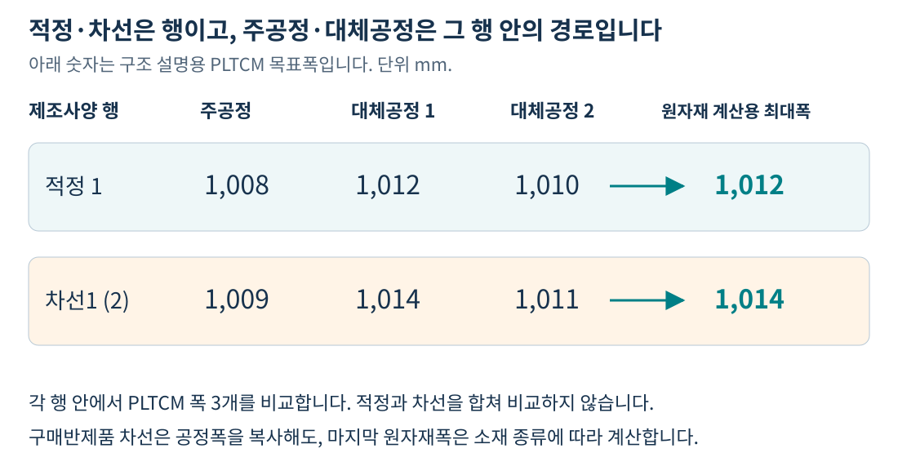

일반 열연 원자재폭을 계산할 때는 **해당 행의 PLTCM 폭 3개 중 최대폭**을 택합니다. 적정의 폭과 차선의 폭을 합쳐 최대값을 구하는 것이 아닙니다. 구매 CR·도금 중간재는 뒤에서 설명하는 TM·CGL·EGL 폭 산식을 사용합니다. [근거 S3: 256~283, 742~814행]

## 2. 적정과 차선은 어디까지 따로 계산하나?

### 2.1 전체 자동설계의 순서

서비스 연결은 다음 순서입니다. 앞 단계가 만든 제조사양 값을 다음 단계가 다시 조회합니다. [근거 S4]

1. **원자재·제조사양을 선정한다.** 적정·차선 행과 원자재코드를 준비합니다.
2. **두께·압연 SET을 계산한다 — C103100070.** 폭수축 기준을 찾을 때 쓸 SET·출측두께가 만들어집니다.
3. **제품폭을 계산한다 — C103100080 / DbSearchWthSizeData.** 제품폭여유, Slit, CCL폭, 중간정전폭을 정합니다.
4. **공정별 폭을 계산한다 — C103100090 / DbSearchProcSizeData.** CGL·EGL·TM·PLTCM·PL/ST 목표폭을 정합니다.
5. **원자재폭을 계산한다 — C103100100 / DbSearchRmtSizeData.** 원자재 종류와 Edge에 따라 최종 폭을 정합니다.

### 2.2 구매반제품 차선에는 ‘앞 단계 복사’가 있다

제품폭·공정폭 클래스는 다음 조건에서 `SEM_RMTL_YN=Y`로 반환합니다.

> **제조구분 ≠ 1 AND 원자재 첫 글자가 H/M 아님 AND 최종품명이 5/7 아님**

해당 서비스는 이 플래그를 보고 `WTHupdate1`, `PROCupdate1`로 **같은 주문의 적정(1) 행에서 해당 설계값들을 복사**합니다. 두께 단계에도 같은 형태의 복사 경로가 있습니다. 여기서 H/M은 코드가 열연 일반 경로로 취급하는 원자재 접두어이며, 최종품명 코드와는 별도입니다. [근거 S1: 246~251행, S2: 529~534행, S5]

**그 다음 원자재 Size 단계는 차선 행에서도 실행합니다.** 따라서 앞의 제품폭·공정폭이 같아도 차선이 구매 CR이면 `TM폭−3`, 구매 도금재이면 `CGL/EGL폭−1` 같은 별도 원자재폭이 나옵니다. ‘차선은 적정의 원자재폭까지 모두 복사한다’고 이해하면 틀립니다.

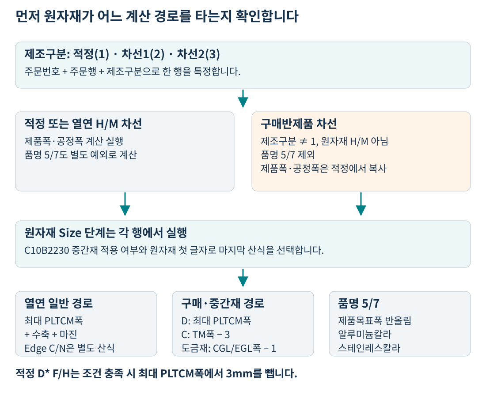

**현재 연결의 주의점:** 위 그림은 클래스의 분기 조건을 나타냅니다. 실제 `C103100080-service`의 제조사양 루프에는 `RMTL_CD` 전달 항목이 없습니다. 제품폭 단계는 공유 Context에 남아 있는 원자재코드를 읽을 수 있어, 현재 행의 코드로 정확히 분기한다고 보장할 수 없습니다. 공정폭 단계(090)는 현재 행의 `RMTL_CD`를 명시적으로 전달합니다. 이 차이는 9.1절에서 설명합니다. [근거 S4, S8]

## 3. 제품목표폭: Slit와 폭여유부터 계산한다

### 3.1 폭여유와 폭공차는 용도가 다르다

`C10A1070` 제품폭여유 기준은 **주문폭관리코드**로 조회하며, 결과 `MRG_WTH`가 제품폭여유입니다. 정확히 1건이어야 하고 0건은 KT03, 중복은 KT13입니다. 이 절에서 폭여유를 `e`, 원래 주문폭을 `W`, Slit 조수를 `n`, 조합폭 1~10의 합을 `ΣMix`라고 하겠습니다. [근거 S1: 303~335행]

제품폭 보증범위는 별도로 **원래 주문폭 W + 인수도폭공차 하한/상한**입니다. 제품목표폭에 공차를 더하는 산식이 아닙니다. [근거 S1: 338~342행]

### 3.2 현재 실행 코드는 조합폭 합산을 사용한다

| 먼저 만족한 조건 | 기준적용폭 B | 제품목표폭 P = COR_WTH_TRV |
|---|---|---|
| 재단선 Y, n=2, W=조합폭1 | W | B + e |
| 재단선 Y, n=2, W≠조합폭1 | 조합폭1 | B + e |
| 위 두 조건이 아니고 n>0 | ΣMix | B + e×n |
| 그 외 | W | W + e |

예를 들어 일반 Slit 2조, 조합폭이 600과 400, 폭여유가 2이면 **600+400+2×2=1,004**입니다. 각 제조사양 조합폭도 원래 조합폭이 양수이면 2씩 더해 602와 402로 저장합니다. [근거 S1: 343~440행]

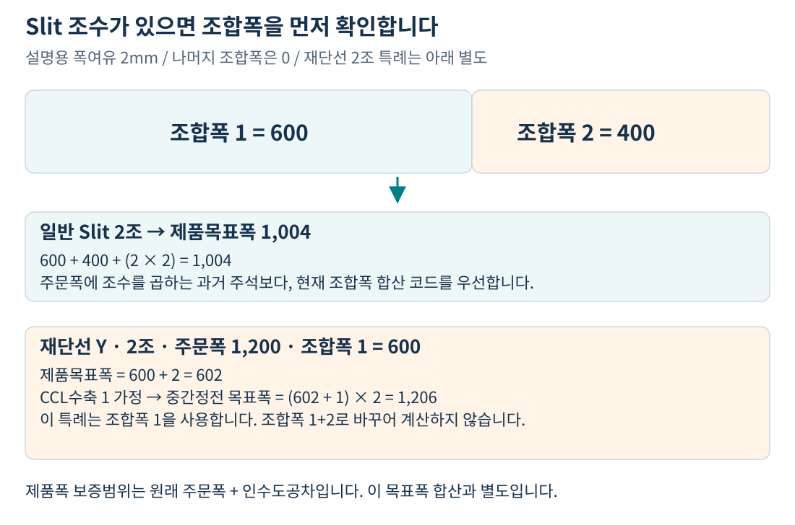

파일 상단 설명과 주석 처리된 옛 계산에는 ‘주문폭×조수’가 나오지만, **현재 실행되는 일반 Slit 분기는 조합폭 1~10의 합**입니다. 조수만 있고 조합폭이 모두 0이라면 코드상 목표폭이 `e×n`만 남을 수 있습니다. 입력을 검증할 때 조수와 조합폭을 함께 확인해야 하는 이유입니다.

### 3.3 칼라 제품은 CCL폭과 중간정전폭을 추가로 만든다

칼라 품명 1~9는 칼라 제조사양에서 재단선유무를 읽습니다. `C10B1079`의 정전폭마진을 `m`, `C10B1078`의 CCL폭수축량을 `c`라고 하면 다음과 같습니다. [근거 S1: 254~300, 446~568행]

| 조건 | CCL 목표폭 | 중간정전 목표폭 |
|---|---|---|
| 재단선 Y, n=2 | P | (P+c)×2 |
| 재단선 Y, n≠2 | P | P+c |
| 재단선 Y 아님 | P+m | 이 단계에서는 초기값 0 |

재단선 Y·2조, W=1,200, 조합폭1=600, e=2, c=1이면 제품목표폭은 **602**, 중간정전 목표폭은 **(602+1)×2=1,206**입니다. 이 특례에서 조합폭 2를 다시 합산하지 않습니다.

정전마진 `m`의 조회조건은 Edge, 품명, 제품형태, 코팅방식, 수지구분전면, **주문두께**, CCL-BOM, 주문스팽글입니다. CCL수축 `c`는 품명, 재질, **PLTCM SET두께**, 기준적용폭으로 조회합니다. 같은 ‘여유’라는 표현을 쓰더라도 조회표와 조건이 서로 다릅니다.

## 4. 공정폭: 공정에서 줄어들 폭을 거슬러 더한다

### 4.1 먼저 통과공정과 수축기준을 읽는다

통과공정의 주공정코드가 `8`로 시작하면 CGL, `9`로 시작하면 EGL로 읽고, 각 대체공정 1·2도 함께 읽습니다. 주공정코드가 `6` 또는 `7`로 시작하는 행이 있으면 정전 통과 플래그를 켭니다. **정전수축(C10B1077)은 이 플래그가 있을 때만 조회**하고, CCL수축(C10B1078)은 칼라 품명1~9에서 조회합니다. 재단선 Y는 중간정전 통과 조건으로 사용합니다. [근거 S2: 574~680행]

| 기호 | 뜻 | 조회 기준 |
|---|---|---|
| m | 정전폭마진 | C10B1079 |
| s정전 | 정전폭수축 | C10B1077 |
| sCCL | CCL폭수축 | C10B1078 |
| sCGLᵢ | 주공정 또는 대체공정 i의 CGL폭수축 | C10B1075 |
| sEGLᵢ | 주공정 또는 대체공정 i의 EGL폭수축 | C10B1076 |
| sTCMᵢ | 경로 i의 PLTCM폭수축 | C10B1074 |

수축량은 여기서 계산하는 물리 모델의 결과가 아니라 **업무기준 조회 결과**입니다. 일반적인 양수 수축량은 앞 공정 폭에 더해집니다. 구체적인 수축 수치는 실제 기준 행을 봐야 합니다.

### 4.2 품명별 공정 목표폭

아래에서 `P=제품목표폭`, `C=CCL목표폭`, `I=중간정전목표폭`, `i=주공정·대체공정 경로`입니다. 수축을 조회하지 않는 조건에서는 해당 지역변수가 초기값 0인 경우가 있습니다. [근거 S2: 731~1337행]

| 최종품명 그룹 | 공정 목표폭 | PLTCM 목표폭 Xᵢ |
|---|---|---|
| GI계열 G/K/J/L/V/W | CGL = P+s정전+m | CGL+sCGLᵢ |
| EGI·ZnNi E/N | EGL = P+s정전+m | EGL+sEGLᵢ, TM도 같은 경로별 폭 |
| GI계열 칼라 3/4/6/9, 재단선 Y | CGL = I+s정전+m | CGL+sCGLᵢ |
| GI계열 칼라 3/4/6/9, 재단선 Y 아님 | CGL = C+sCCL | CGL+sCGLᵢ |
| EGI계열 칼라 2/8, 재단선 Y | EGL = I+s정전+m | EGL+sEGLᵢ, TM도 같은 경로별 폭 |
| EGI계열 칼라 2/8, 재단선 Y 아님 | EGL = C+sCCL | EGL+sEGLᵢ, TM도 같은 경로별 폭 |
| CR칼라 1, 재단선 Y | TM = I+m | TM |
| CR칼라 1, 재단선 Y 아님 | TM = C+sCCL | TM |
| CR C, Edge S/C | TM = P+m+s정전 | TM |
| CR C, Edge S/C 외 | TM = P+s정전 | TM |
| F/H D, P/O A/B | 별도의 TM·도금폭을 거치지 않음 | P |

품명 5/7(알루미늄칼라·스테인레스칼라)은 이 표의 일반 PLTCM 목표폭 계산과 후속 PLTCM 공차·수축 블록에서 제외됩니다. 원자재폭은 제품목표폭을 반올림하는 별도 경로입니다. 그 외 품명이 위 산식에 해당하지 않으면 PLTCM 폭이 초기값 0으로 남을 가능성이 있으므로, 임의로 가장 비슷한 그룹의 공식을 대입하지 않습니다.

### 4.3 같은 주문이라도 기준에 넘기는 폭은 다를 수 있다

`C10B1078` CCL수축과 `C10B1077` 정전수축은 공정폭 단계의 `ord_exc_wth`를, `C10B1075/1076` CGL/EGL수축은 `cegl_exc_wth`를 사용합니다. 재단선 Y·2조에서 두 값이 달라질 수 있습니다. [근거 S2: 584~629행]

| 조건 | CCL·정전 조회폭 | CGL·EGL 조회폭 |
|---|---|---|
| 재단선 Y, n=2, W=조합폭1 | W | W×2 |
| 재단선 Y, n=2, W≠조합폭1 | 조합폭1 | 원래 W |
| 그 외 n>0 | ΣMix | ΣMix |
| 그 외 | W | W |

이 조회폭에는 제품폭여유를 임의로 더하지 않습니다. 한편 **C10B1074는 계산된 PLTCM 목표폭**을 입력으로 받습니다. 모두 ‘폭’이라는 이름이지만 입력 단계가 다릅니다.

## 5. PL/ST 목표폭과 원자재 목표폭은 별도로 계산한다

### 5.1 PL/ST에는 수축·ST 보정·상한 제한이 있다

공정폭 단계에서 경로별 PLTCM 목표폭 `Xᵢ`를 계산한 뒤, `C10B1074`를 **원자재코드 + PLTCM 출측두께 + Xᵢ**로 조회하여 수축량 `sᵢ`를 구합니다. 여기서 두께는 SET이 아니라 `PLTCM_THK_TRV`입니다. [근거 S2: 1447~1608행]

PL/ST 계산을 다음처럼 읽을 수 있습니다.

> **기준상한 B = max(X주+s주, X대체1+s대체1, X대체2+s대체2)**  
> **PL/ST 목표폭ᵢ = round(min(B, Xᵢ+sᵢ+ST보정ᵢ))**

기준상한은 설비의 고정 최대폭이 아니라 **이 주문 행의 경로별 계산값에서 얻은 최대값**입니다. ST보정은 `C10B2191` 조회 결과입니다. 원자재폭의 `C10B1073` 마진과 다른 값입니다. 실제 코드는 대체공정·0값 관련 조건을 두고 각 값을 처리합니다. [근거 S2: 1488~1622행]

대체공정이 없고 `X=1,008`, 수축=3, ST보정=+2이면 기준상한은 1,011이므로 **PL/ST는 1,013이 아니라 1,011**입니다. 양수 보정을 더해도 기준상한에서 제한될 수 있습니다.

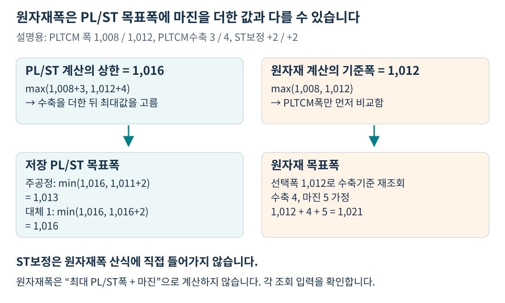

**반올림 시점도 구별합니다.** 공정폭 클래스는 Xᵢ를 소수 그대로 사용해 수축 조회·PL/ST 상한을 계산한 뒤, PL/ST와 PLTCM 목표폭을 각각 정수 mm로 반올림해 저장합니다. TM·CGL·EGL 목표폭은 이 단계에서 정수 반올림하지 않습니다. 따라서 원자재 단계가 읽는 PLTCM폭은 이미 반올림된 값입니다. [근거 S2: 1600~1636행]

### 5.2 원자재 단계는 PLTCM 최대폭을 먼저 고른다

원자재 단계의 `M`은 **max(저장된 PLTCM 주공정폭, 대체1폭, 대체2폭)**입니다. `PL_WTH_TRV` 최대값을 읽는 것이 아닙니다. 일반 열연 경로는 이 `M`으로 **C10B1074를 다시 조회**하고, 원자재두께를 이용해 **C10B1073 원자재 마진**도 조회합니다. [근거 S3: 256~283, 322~480행]

`max(폭+수축)`과 `max(폭)에서 수축 재조회`는 같은 연산이 아닙니다. 최대폭을 가진 경로와 폭+수축이 가장 큰 경로가 다를 수 있기 때문입니다. ST보정값도 원자재폭 산식에 직접 들어가지 않습니다.

예를 들어 공정 계산의 X=1,008.4, PLTCM수축=0.2, ST보정=0이면 PL/ST는 round(1,008.6)=**1,009**, 저장 PLTCM폭은 round(1,008.4)=**1,008**입니다. 원자재 단계가 M=1,008로 재조회하여 수축 0.2, 마진 0을 받으면 최종 원자재폭은 round(1,008.2)=**1,008**입니다. 저장 전 X를 끝까지 사용하면 결과가 달라집니다. 이 예는 연산 순서 설명이며 업무적으로 적합한 기준값이라는 뜻은 아닙니다.

## 6. 원자재 종류와 Edge로 마지막 산식을 선택한다

### 6.1 중간재 적용기준을 먼저 확인한다

품명 5/7 외에는 `C10B2230`을 품명, 주문두께, 적용 주문폭, 최종고객사, 고객사양번호, CCL-BOM으로 조회합니다. 1건이면 `SEM_PRD_NM_CD`를 중간재 종류로 쓰고 Context의 원자재코드 첫 글자를 바꿉니다. 중복은 KK91이며, 0건은 중간재 미적용으로 계속 진행할 수 있습니다. 원래 입력 원자재가 H/M이 아니면 **그 원자재 첫 글자**를 중간재 종류로 사용합니다. [근거 S3: 288~318행]

따라서 아래의 ‘열연 일반’은 **입력 원자재 H/M이면서 중간재 적용 결과가 없는 경로**를 뜻합니다. 원자재코드만 H로 보인다고 항상 일반 가산공식에 들어가는 것은 아닙니다.

### 6.2 열연 일반 경로: Edge를 보고 결정한다

`M=해당 행의 최대 PLTCM폭`, `P=제품목표폭`, `s=최대폭 M으로 재조회한 PLTCM수축`, `a=C10B1073 마진`입니다.

| 주문 Edge | 추가 품명 조건 | 최종 원자재 목표폭 |
|---|---|---|
| C — Coil Edge | 전체 | round(M) |
| N — No Slit | G/K/J/L/V/W/3/4/6/9, E/2/N/8 | round(M) |
| N — No Slit | 위 품명 외 | round(P) |
| 그 외 — 정상 코드에서는 S 또는 M | 전체 | round(M+s+a) |

여기서 Edge `M`과 원자재코드의 첫 글자 `M`은 서로 다른 필드입니다. `round`는 Java `Math.round`이며, 위 경로의 결과는 정수 mm입니다. [근거 S3: 501~644행]

**C/N이면 수축·마진을 마지막에 더하지 않는다고 해서 기준 조회도 생략하는 것은 아닙니다.** 일반 경로에서는 앞서 C10B1071(두께), C10B1074(수축), C10B1073(마진)를 조회합니다. 이 조회가 실패하면 최종 C/N 분기까지 도달하지 못할 수 있습니다.

### 6.3 구매·중간재: 구매하는 공정 단계의 폭을 사용한다

| 중간재 종류 / 최종품명 조건 | 원자재 목표폭 | 반올림 |
|---|---|---|
| D — F/H, 입력 원자재 `D*`, 적정 1 | M−3 | 이 분기에는 반올림 없음 |
| D — F/H, 위 조건 외 | M | 이 분기에는 반올림 없음 |
| C — 구매 CR, 최종품명 E | TM 주공정 목표폭−3 | 정수 mm |
| C — 구매 CR, 최종품명 E 외 | TM 주공정 목표폭−3 | 소수 1자리 |
| G/L/V/W — 구매 GI·GL 계열 | CGL 목표폭−1 | 소수 1자리 |
| E/N — 구매 EGI·ZnNi 계열 | EGL 목표폭−1 | 소수 1자리 |
| 최종품명 5/7 | P | 정수 mm |

구매 CR·도금재 산식에는 위 열연 일반 경로의 Edge별 분기가 없습니다. **TM 대체폭의 최대값을 구매 CR 산식에 쓰는 것도 아닙니다.** 이 코드는 `TM_WTH_TRV`를 사용합니다. 구현된 중간재 종류는 표의 D/C/G/L/V/W/E/N이며, 다른 접두어까지 같은 공식을 적용한다고 확장할 수 없습니다. [근거 S3: 484~488, 646~814행]

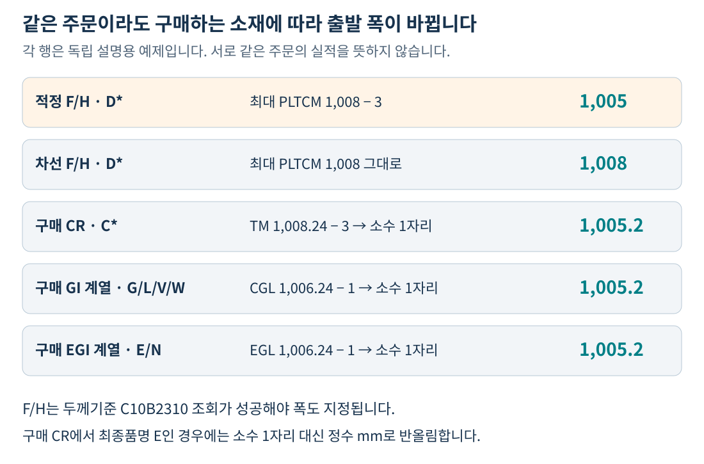

F/H의 폭 지정은 **C10B2310 F/H 두께기준이 성공한 블록 안**에 있습니다. 두께기준을 찾지 못하면 KT37로 실패하므로, 폭 산식 자체가 단순하더라도 두께기준을 먼저 확인해야 합니다.

### 6.4 적정 F/H의 −3과 구매 CR의 −3은 다른 분기다

현재 소스에는 **2026-04-28 적정 F/H 폭 −3mm** 처리가 있습니다. 정확한 조건은 F/H 중간재 분기에서 C10B2310 조회가 성공하고, 제조구분이 1이며, **클래스 시작 시 읽은 지역변수 원자재코드가 D로 시작하는 경우**입니다. 차선 F/H는 같은 분기에서 원값 M을 유지합니다. [근거 S3: 698~718행]

예를 들어 M=1,008이면 적정 `D*`는 **1,005**, 차선 `D*`는 **1,008**입니다. ‘모든 F/H 원자재폭은 PLTCM폭과 같다’는 과거 설명으로는 현행 적정 결과를 설명할 수 없습니다.

또한 C10B2230이 Context의 `H*`를 `D*`로 바꾸어도 지역변수 `rmtl_cd`는 `H*`로 남습니다. 이 경우 F/H 분기에는 들어가면서 **적정 −3 조건은 만족하지 않을 수 있습니다.** 저장된 코드만 보지 말고 입력코드와 중간재 적용 결과를 함께 추적해야 합니다.

## 7. 주문 한 건을 적정·차선으로 비교해 보자

### 7.1 적정 `H*`와 차선 `H*`: 기준 결과가 다르면 최종 폭도 다르다

다음은 **GI G, 주문폭 1,000, Slit조수 0, Edge S, 정전 통과, 중간재 미적용, 대체공정 없음**이라는 설명용 사례입니다. 두 행 모두 필요한 업무기준이 정상적으로 조회된다고 가정합니다. 두께값도 이미 설계되어 있으며, 수축량·마진은 아래 값으로 조회됐다고 가정합니다.

| 단계 | 적정 1 — 열연 후보 A | 차선1(2) — 열연 후보 B |
|---|---|---|
| 제품폭여유 | 2 | 2 |
| 제품목표폭 | 1,000+2 = **1,002** | **1,002** |
| 정전수축 / 정전마진 | 1 / 3 | 1 / 3 |
| CGL 목표폭 | 1,002+1+3 = **1,006** | **1,006** |
| CGL수축 | 2 | 4 |
| PLTCM 목표폭 M | 1,006+2 = **1,008** | 1,006+4 = **1,010** |
| C10B1074 PLTCM수축 | 3 | 5 |
| ST보정 | 0 | 0 |
| PL/ST 목표폭 | round(1,008+3) = **1,011** | round(1,010+5) = **1,015** |
| C10B1073 원자재마진 | 5 | 7 |
| 최종 원자재폭 | round(1,008+3+5) = **1,016** | round(1,010+5+7) = **1,022** |

원자재코드는 CGL/EGL수축·PLTCM수축·원자재마진 등의 조회 입력입니다. 따라서 주문폭이 같아도 기준이 다르면 적정·차선 폭이 달라질 수 있습니다. 반대로 같은 결과가 조회되면 두 폭이 같을 수 있으며, **차선이 반드시 더 넓어야 하는 규칙은 이 산식에 없습니다.**

### 7.2 차선이 구매 도금재이면 마지막 산식이 바뀐다

위 주문의 차선이 구매 GI 계열 `G*`이고, 제품·공정폭 복사 경로가 정상 적용되어 적정의 **CGL 목표폭 1,006**을 가져왔다고 가정하겠습니다.

그 차선의 원자재폭은 **round(10×(1,006−1))/10 = 1,005**입니다. 열연 적정의 1,016과 비교하면 더 작지만, 구매하는 소재가 이미 도금 단계에 있기 때문에 입력하는 공정폭과 산식 자체가 다릅니다. 적정·차선의 폭 차이를 곧바로 설계 오류라고 단정할 수 없습니다.

### 7.3 Edge C/N과 +20의 위치

일반 열연 GI에서 M=1,008이라고 할 때 Edge S라면 예제처럼 `1,008+3+5=1,016`이지만, **Edge C 또는 N의 최종 산식은 round(M)=1,008**입니다. 이는 중간값 M을 고정한 산식 비교이며, 실제 Edge 변경 재설계에서는 앞 단계 마진·목표폭도 달라질 수 있습니다.

같은 C/N 경로에서 원자재두께 룰 **C10B1071에 전달하는 조회폭은 M+20=1,028**입니다. 이 1,028을 원자재 목표폭으로 저장하는 것이 아닙니다. C10B1074와 C10B1073의 폭 입력은 다시 M=1,008입니다. [근거 S3: 324~337, 413~449행]

### 7.4 원자재 최대폭 선택과 ST 상한을 구분하는 반례

두 경로의 PLTCM폭이 1,008 / 1,012이고 수축이 10 / 1이라고 가정하면, PL/ST 기준상한은 **max(1,018,1,013)=1,018**입니다. 원자재 단계는 먼저 PLTCM 최대폭 **1,012**를 택합니다. 이 폭에서 수축 1, 마진 5가 조회되면 원자재폭은 **1,012+1+5=1,018**입니다.

‘최대 PL/ST폭+마진’으로 계산하면 1,018+5=1,023이 되어 현행과 다릅니다. 이 차이 때문에 어느 최대값을 선택했는지 기록해야 합니다.

## 8. 화면·저장값은 어떤 경로로 만들어지나?

### 8.1 자동설계 결과의 저장 위치

**제품폭·공정폭은 `TB_C10_QLT_DSN_MNF`, 원자재 목표폭은 `TB_C10_QLT_DSN_RMT`에 저장합니다.** 원자재 단계는 두 테이블을 주문번호·주문행·제조구분으로 조인해 동일 후보의 공정폭을 가져옵니다. 각 UPDATE도 이 세 키로 행을 구분합니다. [근거 S5, S10]

| 단계 | 저장 SQL | 주요 값 |
|---|---|---|
| 제품폭 자동계산 | `C102100MNF.WTHupdate` | 제품폭범위, 조합폭, COR/CCL/MID_COR 목표폭 |
| 구매반제품 차선 제품폭 복사 | `WTHupdate1` | 적정1의 해당 제품폭 항목 복사 |
| 공정 Size 자동계산 | `PROCupdate` | CGL/EGL/TM/PLTCM/PL 및 대체공정 폭 |
| 구매반제품 차선 공정 Size 복사 | `PROCupdate1` | 적정1의 해당 공정 Size 항목 복사 |
| 원자재 Size | `C102100RMTL.update` | 원자재코드, 목표두께, 목표폭 등 |

### 8.2 제품폭범위와 원자재폭 상·하한을 혼동하지 않는다

제품폭범위는 3장의 `주문폭+인수도공차`로 계산합니다. 반면 **DbSearchRmtSizeData에는 원자재 목표폭 상·하한을 새로 산출하는 대입문이 없습니다.** `RMTL_TAR_WTH_LVL/UVL` 컬럼과 SQL 전달 항목이 존재한다는 사실만으로 `목표폭±공차`가 자동계산된다고 볼 수 없습니다. 이 분석의 주된 결과값은 `RMTL_TAR_WTH`입니다. [근거 S3, S4, S5]

### 8.3 자동계산·수동수정·반복복사는 구별한다

품질설계결과의 TAB05·TAB06 및 연계 화면 저장 경로는 화면에서 받은 제조사양 값을 DB에 반영합니다. 이 직접 저장 경로를 C103100080→090→100의 전체 재설계와 동일하게 볼 수 없습니다. 원자재폭도 자동 산식 이외에 화면 저장·복사 이력을 함께 확인해야 합니다. [근거 S6]

TAB05·TAB06의 원자재폭 편집에서는 기준폭보다 작거나 기준폭+25를 초과하면 붉게 표시합니다. 이때 기준폭은 `NVL(RMTL_TAR_WTH_STD,RMTL_TAR_WTH)`입니다. **이 표시 범위는 화면 경고 기준이며 자동 원자재폭의 상·하한 산식이 아닙니다.** 화면에 보이는 `PL폭−PLTCM폭`이나 BigData 폭수축 예측 조회값도 위 자동설계 산식의 입력과 구별합니다. [근거 S6]

반복주문 복사 경로는 참조 주문의 제조사양·원자재사양을 복사합니다. 반면 재설계는 제조사양을 초기화·재생성하는 경로이므로, 바뀐 업무기준이나 코드가 반영되어 기존 폭과 달라질 수 있습니다. 현재 값이 어떤 경로로 만들어졌는지를 먼저 확인합니다. [근거 S7]

## 9. 정상 공식만으로 설명하면 안 되는 현행 예외

### 9.1 제품폭 단계에 현재 행의 원자재코드 전달이 빠져 있다

`C103100080-service.xml`의 `MNF_LOOP`는 주문번호, 주문행, 제조구분, SET두께 **4개만** Context에 넣습니다. `RMTL_CD`가 없습니다. `DbQualDesignLoop`는 설정된 매핑 항목을 복사할 뿐, 조회행의 모든 컬럼을 자동으로 Context에 펼치지 않습니다. [근거 S4: 080 4~13행, S8: 141~148행]

그런데 `DbSearchWthSizeData`는 Context의 `RMTL_CD`로 구매반제품 차선 여부를 판단합니다. 따라서 **조건문의 원자재코드가 현재 제조사양 행의 코드인지 별도 확인이 필요합니다.** 이전 단계나 앞선 처리의 값이 남아 있으면 제품폭 단계의 계산/복사 선택이 달라질 수 있습니다. 090 단계는 현재 행의 원자재코드를 전달하므로 두 단계가 서로 다른 선택을 할 가능성도 있습니다.

이것은 소스에서 확인한 전달 누락입니다. 특정 운영 주문에서 실제로 오설계가 발생했다고 검증한 결과는 아닙니다. 운영 로그에서 `RMTL_CD`, `QLT_DSN_MNF_TP`, `SEM_RMTL_YN`을 같이 확인해야 합니다.

### 9.2 적정 F/H의 공정폭은 차선 `H*` 코드로 계산할 수 있다

공정폭 클래스에는 **2025-10-24, APS 수정 완료까지 임시 조치**라는 주석이 있습니다. 적정1의 입력 원자재가 `D*`이면 제조구분2(차선1)를 조회하고, 그 원자재가 `H*`이면 **지역변수 원자재코드를 차선 `H*`로 치환**하여 후속 폭 계산에 사용합니다. 조건은 `H*`이며 `M*`까지 포함하지 않습니다. [근거 S2: 478~526행]

이 코드는 차선의 저장된 ST폭 숫자를 직접 복사하는 SQL이 아니라, **차선 코드를 넣어 기준을 다시 조회하는 방식**입니다. Context/DB의 적정 원자재코드를 여기서 `H*`로 영구 변경하는 대입은 없습니다. 이후 원자재 Size 단계의 적정 `D*` −3mm와는 별도 동작입니다.

차선이 없거나 조회 예외가 나면 `rowset.count()`·빈 코드 `substring(0,1)`을 안전하게 처리하지 못할 가능성도 있습니다. ‘차선이 없으면 항상 적정 D 기준으로 정상 진행한다’고 보장해서는 안 됩니다.

### 9.3 ST 보정기준은 CGL과 EGL의 입력 개수가 다르다

`C10B2191` 호출은 CGL에서 **품명·폭관리코드·공정코드 3개**, EGL에서 **폭관리코드·공정코드 2개**를 넘깁니다. 동일 룰 ID라고 입력을 하나로 통일해 설명할 수 없습니다. 이 조회는 주요 수축기준과 달리 `RecordCount==1` 검사를 명시하지 않고 결과를 읽으며, `MasterDataException`은 로그만 남기는 경로입니다. 실제 기준 정의와 매칭 결과를 확인해야 합니다. [근거 S2: 875~889, 1077~1091행]

EGL계 품명 E/2/N/8은 공정폭 단계에서도 C10B2230을 조회합니다. 정확히 1건이면 **지역변수의 EGL 주공정코드를 92로 바꾼 뒤** EGL수축과 ST보정 기준을 조회합니다. 대체공정코드는 그대로입니다. 이 호출의 폭은 `cegl_exc_wth`이고, 원자재 단계의 C10B2230 조회폭은 Slit 조합폭 합/원래 주문폭이므로 재단선 특례에서 서로 다를 수 있습니다. 중복은 KK91로 실패합니다. [근거 S2: 1006~1035행]

### 9.4 기준 조회 실패와 계산·저장 성공은 별개다

주공정 CGL/EGL수축 기준 미조회·중복은 즉시 실패를 반환하지만, **대체공정 수축 조회 일부는 오류 플래그를 설정한 뒤 계속 계산합니다.** 초기값 0인 수축량으로 후속 값이 만들어질 수 있으므로 숫자 존재만으로 정상 설계라고 판단하지 않습니다. [근거 S2: 886~1018, 1093~1201행]

F/H 두께기준 C10B2310은 용도 4단계와 고객사 2단계의 우선순위를 시도하여 처음 정확히 1건이 나온 조합을 사용합니다. 어떤 조합에서 중복이 나와도 다음 조합을 계속 시도하며, 끝까지 못 찾으면 KT37입니다. ‘모든 기준은 미조회/중복 즉시 실패’라는 한 가지 규칙으로 설명할 수 없습니다. [근거 S3: 652~739행]

### 9.5 정합성검사는 차선의 폭까지 모두 보장하지 않는다

제조사양 검사는 제조구분으로 정렬한 조회 결과의 **첫 행을 한 번** 검사합니다. 정상 구성에서는 적정1입니다. 원자재 검사도 별도 조회의 첫 행을 한 번 읽습니다. 그 원자재 조회 SQL에는 ORDER BY가 없어 어느 후보가 첫 행인지도 보장되지 않습니다. 차선까지 순회하는 검사가 아닙니다. 제조사양 검사에서 품명 5/7은 제외됩니다. [근거 S9]

제품폭범위 누락·역전은 CF09/CF10, PLTCM폭 NULL은 CF72, 원자재 목표폭 NULL은 CF30 등으로 검사합니다. **원자재폭 상·하한 검사는 주석 처리**되어 있습니다. 또한 원자재 목표폭의 NULL 검사만 통과했다고 양수·업무 적합성까지 보장되는 것은 아닙니다.

## 10. 실제 주문의 적정·차선 폭 차이는 이 순서로 추적한다

1. **두 행을 분리한다.** 주문번호·주문행·제조구분1/2, 각 원자재코드를 적습니다. 주공정·대체공정 구분도 별도로 기록합니다.
2. **생성 경로를 확인한다.** 자동설계, 구매반제품 차선 복사, 반복주문 복사, 수동수정 이력을 구별합니다.
3. **제품폭을 재현한다.** 원래 주문폭, 폭관리코드, 폭여유, Slit조수, 조합폭1~10, 재단선, CCL-BOM을 확인합니다.
4. **기준에 넘긴 폭과 두께를 적는다.** `ord_exc_wth`와 `cegl_exc_wth`, SET과 출측두께를 구별합니다.
5. **공정별 수축과 ST보정을 적는다.** 정전·CCL·CGL/EGL·PLTCM의 선택한 기준 행과 결과를 확인하고, PL/ST 상한 처리도 재현합니다.
6. **원자재 마지막 분기를 고른다.** C10B2230 적용 여부, 입력 원자재코드, 변환된 코드, Edge, F/H 적정 −3을 확인합니다.
7. **저장·오류와 대조한다.** 현재 행의 `RMTL_TAR_WTH` 및 설계오류를 확인합니다. 080의 Context 원자재코드 누락 가능성도 점검합니다.

| 확인 항목 | 적정 1에 기록할 값 | 차선1(2)에 기록할 값 |
|---|---|---|
| 대상 | 주문번호 / 주문행 / 제조구분 | 주문번호 / 주문행 / 제조구분 |
| 소재·경로 | 입력 원자재 / C10B2230 결과 / 저장 원자재 / 계산·복사 | 동일 항목 |
| 제품폭 | W / 조합폭 합 / n / e / P / 재단선 | 동일 항목 |
| 두께 조회 입력 | SET / 출측 / 원자재 목표두께 | 동일 항목 |
| 공정폭 | CCL / 중간정전 / CGL / EGL / TM | 동일 항목 |
| 경로별 폭 | PLTCM 주·대체1·대체2 / PL/ST 주·대체1·대체2 | 동일 항목 |
| 원자재 계산 | M / Edge / 수축 / 마진 / 소재별 차감 / 반올림 | 동일 항목 |
| 최종 대조 | 계산폭 / DB 목표폭 / 오류 / 수정이력 | 동일 항목 |

# 부록 A. 업무기준과 정확한 조회 입력

## A.1 폭설계 기준표

조회 입력의 순서까지 코드에 맞춰 적었습니다. 같은 룰이라도 호출 위치에 따라 폭 입력이 달라집니다. [근거 S1~S3]

| 기준 ID | 역할 | 코드가 넘기는 조건 순서 | 결과 |
|---|---|---|---|
| C10A1070 | 제품폭여유 View | 주문폭관리코드 | MRG_WTH |
| C10B1079 | 정전폭마진 | Edge, 품명, 제품형태, 코팅방식, 수지전면, 주문두께, CCL-BOM, 스팽글 | MRG_WTH |
| C10B1078 | CCL폭수축 | 품명, 재질, SET두께, 기준적용폭 | CCL_WTH_SHR_QTY |
| C10B1077 | 정전폭수축 | 품명, 재질, SET두께, 기준적용폭 | WTH_SHR_QTY |
| C10B1075 | CGL폭수축 | 공정, 품명, 재질, 원자재코드, SET두께, CGL/EGL 조회폭 | GAL_WTH_SHR_QTY |
| C10B1076 | EGL폭수축 | 공정, 품명, 재질, 원자재코드, SET두께, CGL/EGL 조회폭 | EGL_WTH_SHR_QTY |
| C10B2191 — CGL 호출 | ST폭보정 | 품명, 폭관리코드, 공정 | WTH_COR_VAL |
| C10B2191 — EGL 호출 | ST폭보정 | 폭관리코드, 공정 | WTH_COR_VAL |
| C10B1074 — 공정 단계 | PLTCM폭수축 | 원자재코드, **출측두께**, 경로별 PLTCM폭 | TCM_WTH_SHR_QTY |
| C10B1074 — 원자재 단계 | PLTCM폭수축 재조회 | 원자재코드, **출측두께**, **최대 PLTCM폭 M** | TCM_WTH_SHR_QTY |
| C10B1073 | 원자재 마진 | 원자재코드, **원자재 목표두께**, M, 최종고객사 | MRG_WTH |
| C10B2230 — EGL 공정 단계 | 주공정 조회코드 변경 | 품명, 주문두께, CGL/EGL 조회폭, 최종고객사, 고객사양번호, CCL-BOM | 1건이면 EGL 주공정 조회코드 92 |
| C10B2230 — 원자재 단계 | 중간재 적용 | 품명, 주문두께, 적용 주문폭, 최종고객사, 고객사양번호, CCL-BOM | SEM_PRD_NM_CD |
| C10B1071 | 일반 원자재두께 | 원자재코드, **SET두께**, M (Edge C/N만 +20) | 원자재 목표두께·후보두께 |
| C10B2310 | F/H 두께기준 | 두께관리코드, **최종품명**, 용도 우선순위값, 고객사 우선순위값, 주문두께 | THK_RNG_LLV/ULV; 성공 시 F/H 폭도 지정 |

원자재 단계의 C10B2230 조회폭은 `DbSearchRmtSizeData` 초반에서 **Slit조수>0이면 조합폭1~10 합, 아니면 원래 주문폭**으로 구성합니다. 제품폭·공정폭 단계의 재단선 Y·2조 특례와 동일한 지역변수를 공유하는 것이 아닙니다. [근거 S3: 208~241행]

기준 관리 화면은 제품폭여유가 **C107000020 tab07**, 원자재두께·마진·수축 등은 **C107000030 tab08~15**에 연결됩니다. 차례대로 tab08=1071, tab09=1073, tab10=1074, tab11=1075, tab12=1076, tab13=1078, tab14=1077, tab15=1079입니다. Rule 관리 SQL은 `TB_M00_RULES010/040`의 유효 기준과 조건 연산자·최소/최대·결과값을 조회합니다. 구간 끝점 포함 여부나 마진 수치를 Java만 보고 단정할 수 없습니다. [근거 S11]

## A.2 두께 분석서와 이어서 볼 부분

폭수축 기준 중 **CCL·정전·CGL·EGL은 SET두께**, **PLTCM수축은 출측두께**를 씁니다. `C10B1073` 마진은 다시 **원자재 목표두께**를 사용합니다. 따라서 ‘폭 기준 조회에는 두께 하나만 넣으면 된다’고 볼 수 없습니다.

두께가 달라지면 구간 기준이 바뀌어 폭수축이나 원자재 마진이 달라질 수 있습니다. 반대로 원자재두께 기준은 계산된 PLTCM폭 M을 입력으로 받습니다. 앞의 PLTCM폭을 정한 뒤 원자재두께와 마진을 조회하는 **순차 계산**이며, 이 세 클래스에 수렴할 때까지 폭·두께를 반복 최적화하는 루프는 없습니다.

두께 항목 자체의 산식과 소둔·도금·조도·PLTCM 설정은 [용융·전기 제조표준 설계 분석서](용융_전기_제조표준_설계_쉽게이해하기.html)에서 다룹니다. 두 문서가 만나는 지점은 X-Ray SET 두께입니다. 제품폭범위와 조합폭을 화면에서 고치는 방법은 [후공정 제조표준 설계 분석서](후공정_제조표준_설계_쉽게이해하기.html)에서 다룹니다. 조합폭을 고치면 품질메세지가 달라질 수 있는 이유는 [품질메세지 설계 분석서](품질메세지_설계_쉽게이해하기.html)에서 다룹니다.

# 부록 B. 오류를 읽는 간단한 사전

| 오류 | 의미 | 먼저 확인할 것 |
|---|---|---|
| KP05 | 칼라 제조사양 조회 실패·없음 | 주문의 CCL-BOM·칼라사양 |
| KT03 / KT13 | 제품폭여유 없음 / 중복 | C10A1070, 폭관리코드 |
| KT28 / KT29 | 정전마진 없음 / 중복 | C10B1079 조건 8개 |
| KT26 / KT27 | CCL수축 없음 / 중복 | C10B1078, SET, 적용폭 |
| KT24 / KT25 | 정전수축 없음 / 중복 | C10B1077, 정전 통과·중간정전 |
| KT20 / KT21 | CGL수축 없음 / 중복 | C10B1075, 원자재·공정·SET·폭 |
| KT22 / KT23 | EGL수축 없음 / 중복 | C10B1076, 원자재·공정·SET·폭 |
| KT04 / KT14 | PLTCM수축 없음 / 중복 | C10B1074, **출측두께**·선택폭 |
| KT05 / KT15 | 원자재 마진 없음 / 중복 | C10B1073, **원자재 목표두께**·최종고객사 |
| KT06 / KT11 | 원자재두께 없음 / 중복 | C10B1071, C/N 조회폭 +20 |
| KK91 | 중간재 적용 중복 | C10B2230 |
| KT37 | F/H 두께기준을 끝까지 못 찾음 | C10B2310, 용도·고객사 우선순위 |
| CF09 / CF10 | 제품폭 하한·상한 누락 또는 역전 | 제품폭범위·공차 |
| CF72 / CF30 | PLTCM폭 / 원자재 목표폭 누락 | 앞 단계 실패·복사 원본·현재 행 |

오류가 어떤 단계에서 났는지 같이 봅니다. 예를 들어 KT04는 공정폭 단계의 경로별 폭에서 발생했을 수도 있고, 원자재 단계의 최대폭 재조회에서 발생했을 수도 있습니다.

# 부록 C. 기존 주석을 읽을 때 주의할 설명

| 혼동할 수 있는 설명 | 현재 실행 코드에 맞춘 설명 |
|---|---|
| 일반 Slit는 주문폭×조수 | 현재는 조합폭1~10 합. 재단선 Y·2조는 별도 특례 |
| 차선은 적정 원자재폭까지 복사 | 제품·공정 항목 복사 후 원자재 Size 별도 실행 |
| 적정·차선과 주·대체공정은 같은 구분 | 서로 다른 축. 제조행 안에서 공정 경로별 폭을 비교 |
| 원자재폭은 PL/ST폭+마진 | 일반 경로는 최대 PLTCM폭을 고른 뒤 수축·마진 재조회 |
| C/N은 원자재폭에 +20 | +20은 C10B1071 두께기준 조회폭에만 적용 |
| 구매 CR 주석의 +10 요청을 그대로 적용 | 실제 실행식은 TM폭−3. E품명은 정수, 그 외 소수1자리 반올림 |
| F/H는 적정·차선 모두 최대 PLTCM폭 | 적정 입력 `D*`는 C10B2310 성공 시 −3, 차선은 유지 |
| 원자재폭 상하한도 자동으로 산출 | 컬럼·SQL은 있으나 해당 클래스에 신규 산식 대입 없음 |
| 클래스 주석의 이름만 보고 조회두께 선택 | SET / 출측 / 원자재두께를 실제 colValue 대입 기준으로 구분 |

# 부록 D. 코드 근거와 재현 범위

## D.1 핵심 코드 위치

행 번호는 현재 로컬 소스 기준입니다. 코드 파일을 수정하면 달라질 수 있습니다.

| ID | 파일 | 확인한 부분 |
|---|---|---|
| S1 | [DbSearchWthSizeData.java](../../src/com/unionsteel/mes/c10/activity/nui/DbSearchWthSizeData.java) | 195~251 입력·차선분기, 254~335 칼라·폭여유, 338~440 Slit·제품폭, 446~568 정전마진·CCL·중간정전 |
| S2 | [DbSearchProcSizeData.java](../../src/com/unionsteel/mes/c10/activity/nui/DbSearchProcSizeData.java) | 478~534 적정F/H 치환·차선분기, 584~680 조회폭·통과공정, 688~1201 마진·수축·ST기준, 1203~1337 공정폭, 1447~1641 PLTCM수축·상한·저장 Context |
| S3 | [DbSearchRmtSizeData.java](../../src/com/unionsteel/mes/c10/activity/nui/DbSearchRmtSizeData.java) | 208~283 조회폭·최대폭, 288~318 중간재, 322~480 두께·수축·마진, 484~644 Edge, 646~739 F/H, 742~814 구매 CR·도금재 |
| S4 | [C102100000-service.xml](../../src/service/C102100000-service.xml), [C103100070-service.xml](../../src/service/C103100070-service.xml), [080-service.xml](../../src/service/C103100080-service.xml), [090-service.xml](../../src/service/C103100090-service.xml), [100-service.xml](../../src/service/C103100100-service.xml) | 설계 순서, 제조사양 루프 매핑, 차선 계산·복사 라우팅, 원자재 UPDATE |
| S5 | [C102100MNF-query.glue_sql](../../src/query/C102100MNF-query.glue_sql) | select 정렬, WTHupdate/1, PROCupdate/1, 제조구분별 저장 |
| S6 | [C104000020TAB05.jsp](../../WebContents/C104000020TAB05.jsp), [TAB06.jsp](../../WebContents/C104000020TAB06.jsp), [TAB05-service.xml](../../src/service/C104000020TAB05-service.xml), [TAB05-query.glue_sql](../../src/query/C104000020TAB05-query.glue_sql), [TAB06-service.xml](../../src/service/C104000020TAB06-service.xml), [TAB06-query.glue_sql](../../src/query/C104000020TAB06-query.glue_sql) | 화면값 전달·제조사양 직접 저장 경로 |
| S7 | [B10R0030_sub-service.xml](../../src/service/B10R0030_sub-service.xml), [C102100170-query.glue_sql](../../src/query/C102100170-query.glue_sql), [C102100000-query.glue_sql](../../src/query/C102100000-query.glue_sql) | 반복주문 제조사양 복사·재설계 초기화 |
| S8 | [DbQualDesignLoop.java](../../src/com/unionsteel/mes/c10/activity/nui/DbQualDesignLoop.java) | 141~148 명시된 param 매핑만 Context에 복사 |
| S9 | [DbSearchDsnValidData.java](../../src/com/unionsteel/mes/c10/activity/nui/DbSearchDsnValidData.java) | 1708~1729 첫 제조행 검사, 1775~1783 제품폭범위, 1812~1814 PLTCM폭, 2120~2161 첫 원자재행·폭 검사 |
| S10 | [DbSearchRmtlCdData.java](../../src/com/unionsteel/mes/c10/activity/nui/DbSearchRmtlCdData.java), [DbSearchMnfData.java](../../src/com/unionsteel/mes/c10/activity/nui/DbSearchMnfData.java), [C103100100-query.glue_sql](../../src/query/C103100100-query.glue_sql), [C102100RMTL-query.glue_sql](../../src/query/C102100RMTL-query.glue_sql) | RmtlCd 98~108 / Mnf 118~135 후보번호 생성, 100 조회 5~32 RMT·MNF 동일 후보 조인, RMTL 29~36 무정렬 조회·46~63 원자재폭 저장 |
| S11 | [C107000020tab07-query.glue_sql](../../src/query/C107000020tab07-query.glue_sql), [C107000030tab09-query.glue_sql](../../src/query/C107000030tab09-query.glue_sql), [tab10-query.glue_sql](../../src/query/C107000030tab10-query.glue_sql), [tab15-query.glue_sql](../../src/query/C107000030tab15-query.glue_sql) | 제품폭여유와 마진·수축 기준 관리 조회의 유효일자·조건·결과 구조 |

## D.2 확인한 것과 운영 확인이 필요한 것

**확인한 것:** 로컬 소스의 실제 실행 분기, 기준 조회 입력, 연산·반올림 순서, 적정·차선 복사와 저장 연결, 제품폭 단계 원자재코드 전달 누락, 화면 직접 저장 경로, 설명용 예제의 독립 계산 재현.

**운영에서 확인할 것:** 실제 주문의 유효 업무기준 행·구간 연산자·수축·마진, 운영 배포본과 로컬 소스의 일치, Context 전달 누락과 임시 F/H 코드 치환이 실제 주문에 미친 영향, 화면 수정·반복복사 이력, 후속 시스템이 소비하는 폭 컬럼.

계산 재현 코드는 [verify-examples.cjs](width-design-guide-assets/verify-examples.cjs), 문서 빌드 방법은 [README.md](width-design-guide-assets/README.md)에 있습니다. 재현은 코드에서 확인한 산식을 설명용 입력에 적용한 것으로, **GLUE/Java 전체 클래스 실행이나 운영 DB와 연결한 주문별 검증은 아닙니다.**
