# 읽기 전에: 이 문서는 무엇을 설명하나?

**“품질메세지”라고 부르는 값은 하나가 아닙니다.** 제조구분별 품질메세지, 정전 품질메세지, 포장메세지, CCL 공정품질메시지, 지관발주메시지, PE-FOAM 적용메시지 **여섯 갈래**가 서로 다른 표에 살고 있습니다. 화면에서는 모두 “메세지”라는 같은 라벨을 답니다. 그래서 “메세지가 안 보인다”는 한 문장이 실제로는 네 가지 다른 문제를 가리킬 수 있습니다.

이 문서는 그 여섯 갈래를 **한자리에 모아** 놓고, 각각이 어디서 만들어져 어느 화면에 나타나고 고치면 어디로 저장되는지를 따라갑니다. [용융·전기 제조표준 설계 해설서](용융_전기_제조표준_설계_쉽게이해하기.html), [후공정 제조표준 설계 해설서](후공정_제조표준_설계_쉽게이해하기.html)와 같은 방식으로 작성했습니다. 다만 품질메세지는 **계산이 거의 없고 갈래와 조건 분기가 많은** 주제라, 산식표 대신 **지도와 순서도**를 중심으로 그렸습니다. 그림 18개 중 여덟 개가 순서도입니다.

처음 읽는 분은 앞의 **‘그림으로 먼저 이해하기’**에서 네 갈래 지도와 값이 만들어지는 흐름을 익히고, 실제 주문을 조사하는 분은 뒤의 **상세 분석 1~12장과 부록**을 함께 읽으면 됩니다.

분석 기준은 **2026-09-10 현재 이 작업 폴더의 화면·SQL·서비스 XML·Java 소스**입니다. 운영 배포본이나 운영 DB의 행은 조회하지 않았습니다. 모든 문구 예제는 **설명용 가정**이며 실제 등록된 메세지가 아닙니다. 기존 분석서와 실행 코드는 수정하지 않았습니다.

# 그림으로 먼저 이해하기: 품질메세지 읽는 법

**처음 읽는 분은 이 부분부터 보세요.** 아래에서는 코드명을 잠시 내려놓고, **어느 메세지가 어디서 와서 어느 화면에 나타나는지**를 따라갑니다. 이후 본문 1~12장은 이 그림의 정확한 조건과 코드 근거를 설명합니다.

## 가. 먼저 어느 갈래인지 가른다

메세지 문제를 조사할 때 가장 먼저 할 일은 **어느 갈래인지 가리는 것**입니다. 표가 다르면 만드는 곳도 고치는 화면도 다릅니다.

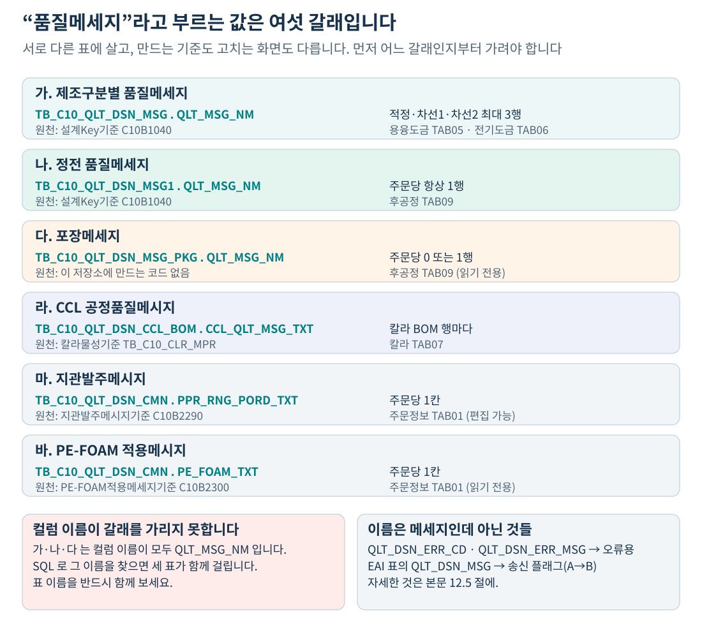

앞의 세 갈래는 컬럼 이름이 모두 `QLT_MSG_NM` 으로 같습니다. **컬럼 이름으로는 갈래를 가릴 수 없습니다.** 화면 이름과 표 이름을 함께 확인해야 합니다.

이름이 메세지인데 품질메세지가 아닌 것도 있습니다. 오류코드와 EAI 송신 플래그가 그렇습니다(12.5절). [근거 S2, S10, S14, S17]

## 나. 한 주문이 만드는 메세지 행

자동설계는 설계Key 기준을 한 번 맞힙니다. 그 **한 줄** 안에 메세지 칸이 네 개 들어 있고, 거기서 최대 네 행이 갈라져 나옵니다.

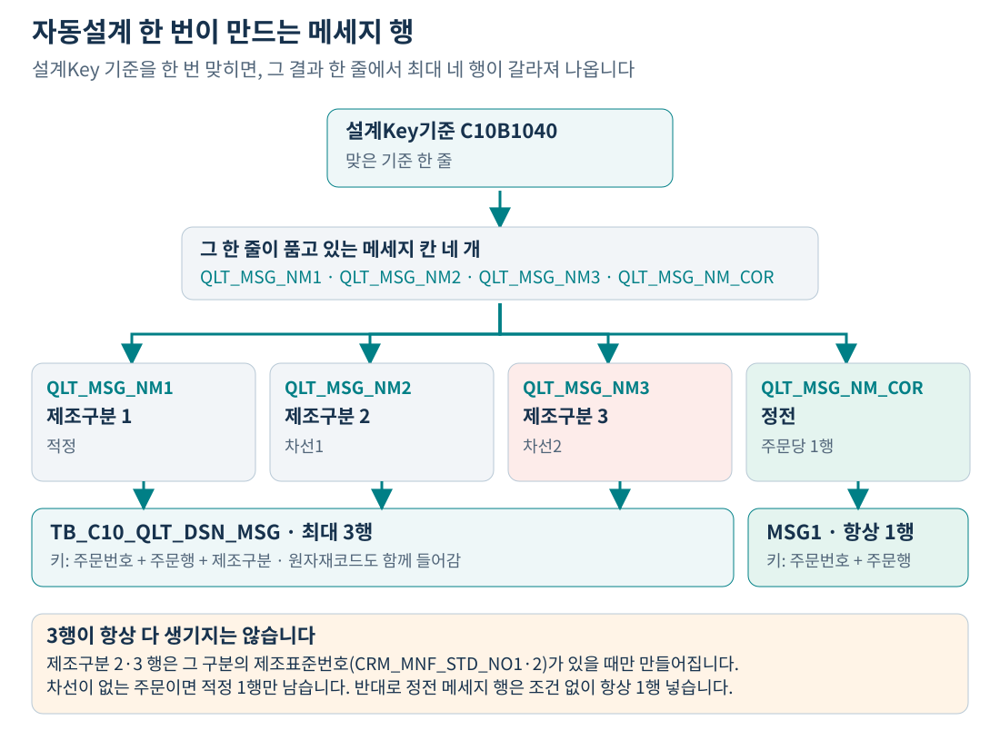

제조구분별 메세지는 **최대 3행**이고, 정전 메세지는 **항상 1행**입니다. 3행이 늘 다 생기지는 않습니다. 그 제조구분의 제조표준번호가 있을 때만 행을 만듭니다. [근거 S1: 528~552행, 575~590행]

## 다. 메세지를 결정하는 조건은 열세 개

메세지는 계산으로 나오지 않습니다. **조건 열세 개를 묶어 기준표에서 맞는 줄 하나를 찾아** 그 줄의 문구를 그대로 씁니다.

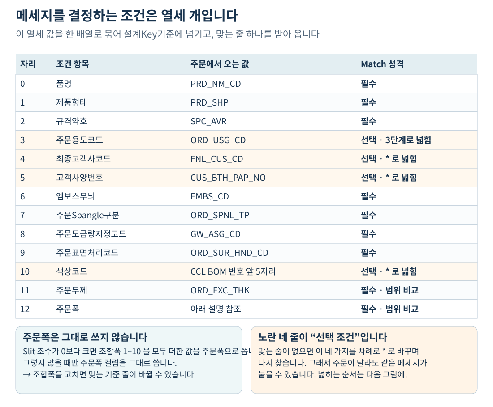

열세 개 중 **네 개는 “선택 조건”**입니다. 맞는 줄이 없으면 이 네 가지를 차례로 별표로 바꾸며 다시 찾습니다. 그래서 주문이 서로 달라도 같은 메세지가 붙을 수 있습니다. [근거 S1: 259~272행]

여기서 **주문폭은 그대로 쓰지 않습니다.** Slit 조수가 0보다 크면 조합폭 1~10을 모두 더한 값을 주문폭으로 씁니다. 폭 설계에서 조합폭을 고치면 맞는 기준 줄이 바뀔 수 있다는 뜻입니다. [근거 S1: 216~228행]

## 라. 못 찾으면 조건을 넓혀 다시 찾는다

맞는 줄이 없다고 바로 실패하지 않습니다. **자동차 주행거리계처럼** 안쪽 자리부터 올리고, 그 자리가 다 차면 한 칸 위를 올린 뒤 안쪽을 되돌립니다.

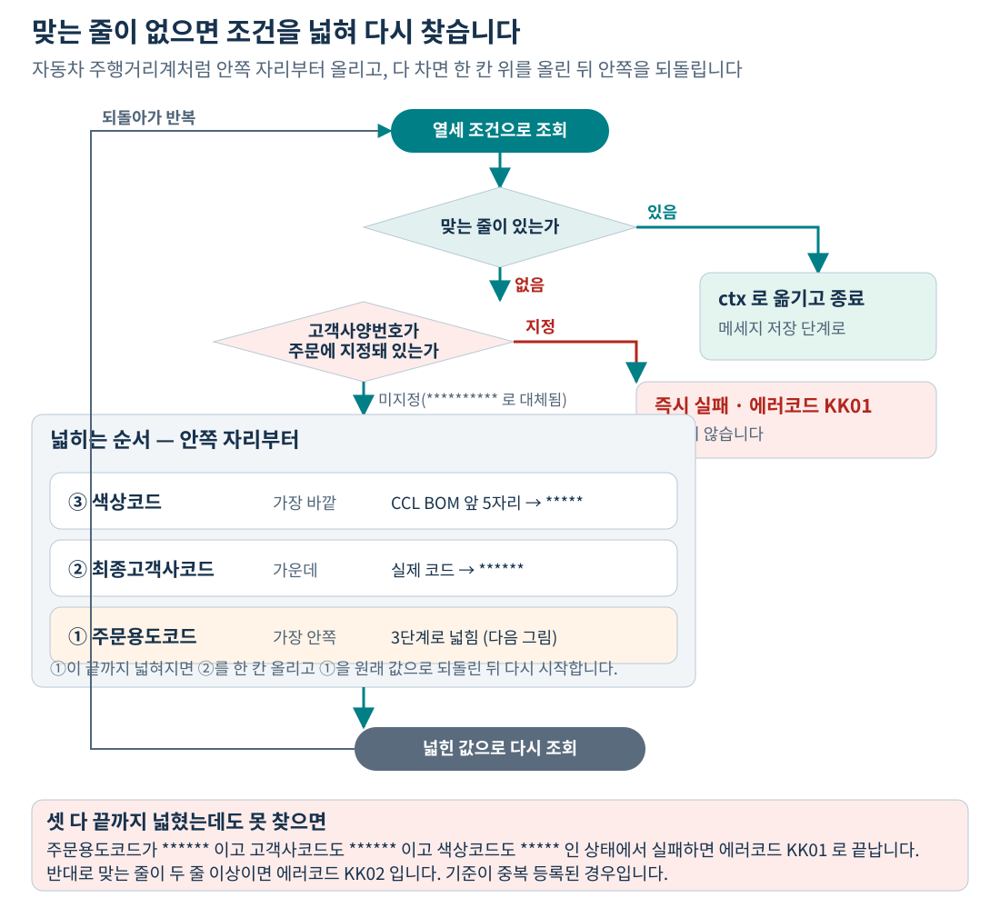

넓히는 순서는 안쪽부터 **주문용도코드 → 최종고객사코드 → 색상코드**입니다. 셋 다 끝까지 넓혔는데도 못 찾으면 에러코드 `KK01` 로 끝납니다. 반대로 맞는 줄이 **두 줄 이상이면** `KK02` 입니다. 기준이 중복 등록된 경우입니다. [근거 S1: 280~467행]

한 가지 예외가 있습니다. **고객사양번호가 주문에 지정돼 있으면 아예 넓히지 않습니다.** 첫 조회에서 못 찾는 순간 바로 실패합니다. 고객사양번호가 붙은 주문의 메세지가 안 나온다면, 기준에 그 고객사양번호 줄이 등록돼 있는지부터 봐야 합니다. [근거 S1: 452~459행]

## 마. 주문용도코드는 세 단계로 넓힌다

네 가지 선택 조건 중 주문용도코드만 단계가 여럿입니다. 여섯 자리를 뒤에서부터 별표로 덮어 갑니다.

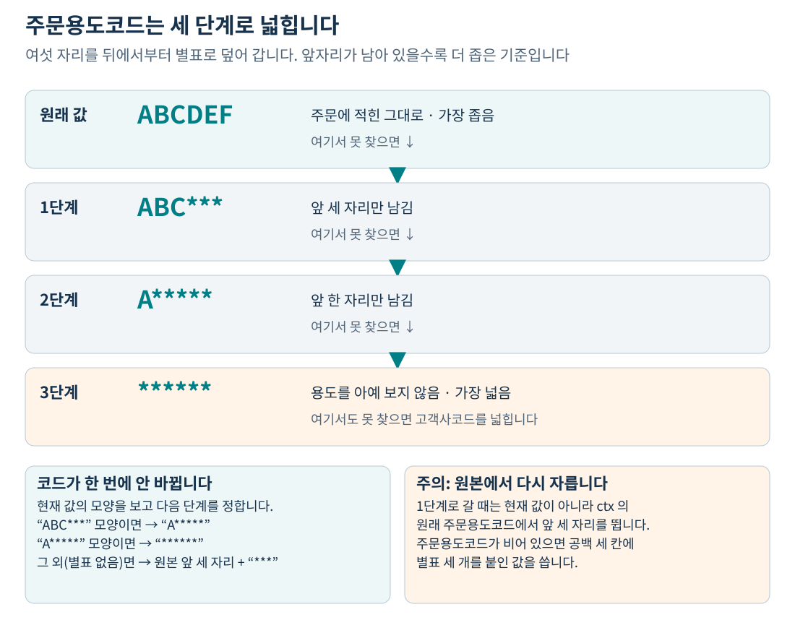

`ABCDEF` → `ABC***` → `A*****` → `******` 순입니다. 앞자리가 많이 남아 있을수록 좁은 기준이고, 별표가 많을수록 넓은 기준입니다. 넓은 줄이 맞았다면 **주문의 용도와 정확히 맞는 기준이 없었다는 뜻**입니다. [근거 S1: 304~330행]

## 바. 기준의 문구가 저장값으로 옮겨질 때 한 칸 밀린다

기준의 메세지 칸 네 개는 이름을 바꿔 가며 저장용 값으로 옮겨집니다. **이 옮김에서 세 번째 갈래만 이름이 어긋나 있습니다.**

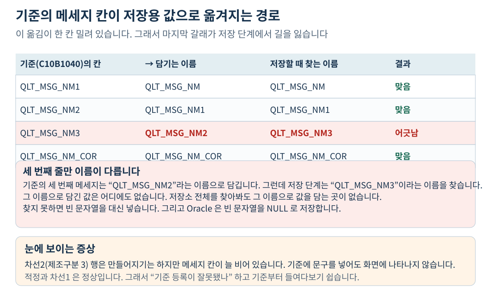

기준의 세 번째 문구는 `QLT_MSG_NM2` 라는 이름으로 담기는데, 저장 단계는 `QLT_MSG_NM3` 이라는 이름을 찾습니다. **그 이름으로 값을 담는 코드가 저장소 어디에도 없습니다.** 못 찾으면 빈 문자열을 대신 넣고, Oracle은 빈 문자열을 NULL로 저장합니다.

**눈에 보이는 증상은 이렇습니다.** 차선2(제조구분 3) 행은 만들어지지만 메세지 칸이 늘 비어 있습니다. 기준에 문구를 넣어도 화면에 나타나지 않습니다. 적정과 차선1은 정상이라 “기준 등록이 잘못됐나” 하고 기준부터 들여다보기 쉽습니다. [근거 S1: 469~518행, 547~551행]

## 사. 행이 없는 것과 값이 빈 것은 다르다

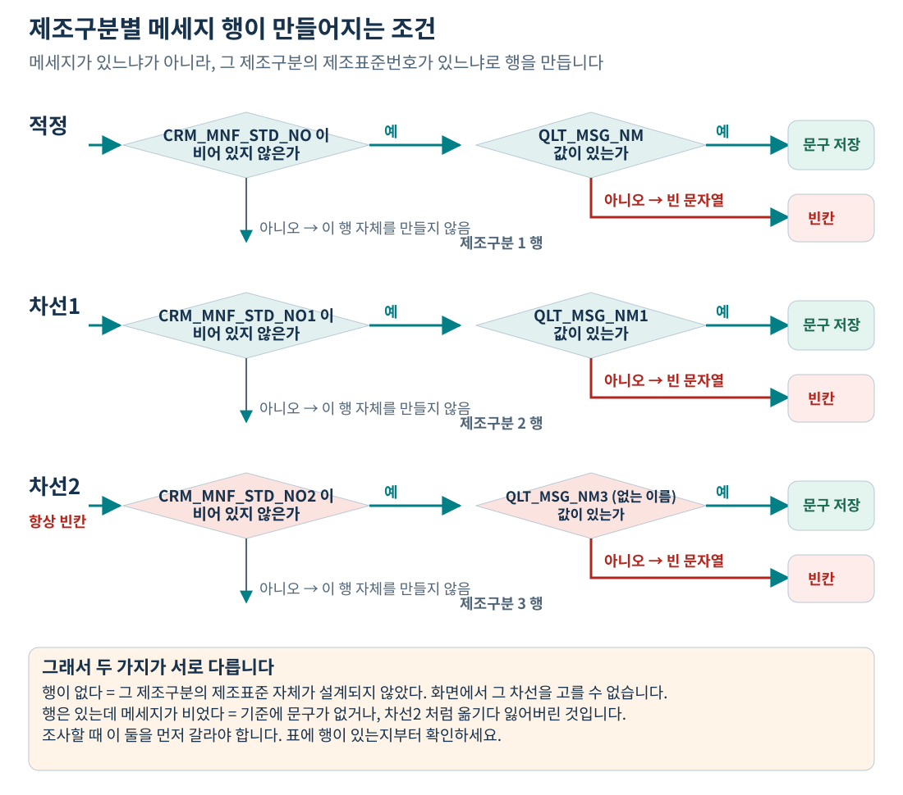

행을 만들지 결정하는 것은 **메세지 문구가 아니라 그 제조구분의 제조표준번호**입니다. 그래서 두 가지가 서로 다릅니다.

- **행이 없다** = 그 제조구분의 제조표준 자체가 설계되지 않았습니다. 화면에서 그 차선을 고를 수 없습니다.
- **행은 있는데 메세지가 비었다** = 기준에 문구가 없거나, 차선2처럼 옮기다 잃어버린 것입니다.

조사할 때 이 둘을 먼저 갈라야 합니다. 표에 행이 있는지부터 확인하세요. [근거 S1: 528~552행]

## 아. 정전 메세지는 조건 없이 항상 한 행

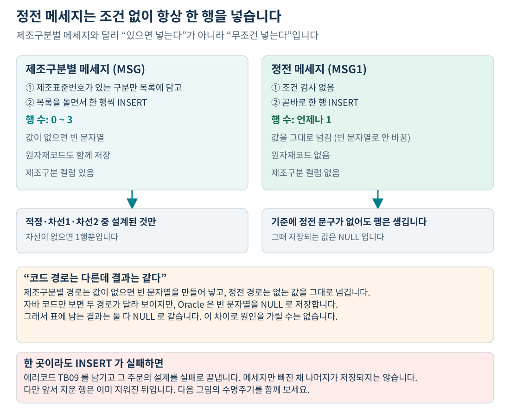

정전 메세지는 “있으면 넣는다”가 아니라 **“무조건 넣는다”**입니다. 기준에 정전 문구가 없어도 행은 생기고, 그때 저장되는 값은 NULL입니다.

**코드 경로는 두 갈래로 다릅니다.** 제조구분별 경로는 값이 없으면 빈 문자열을 만들어 넣고, 정전 경로는 없는 값을 그대로 넘깁니다. 자바 코드만 보면 달라 보이지만 **Oracle은 빈 문자열을 NULL로 저장하므로 표에 남는 결과는 같습니다.** 이 차이로 원인을 가릴 수는 없습니다. [근거 S1: 575~590행, S7: 390행]

## 자. 여섯 갈래를 한자리에 놓고 보기

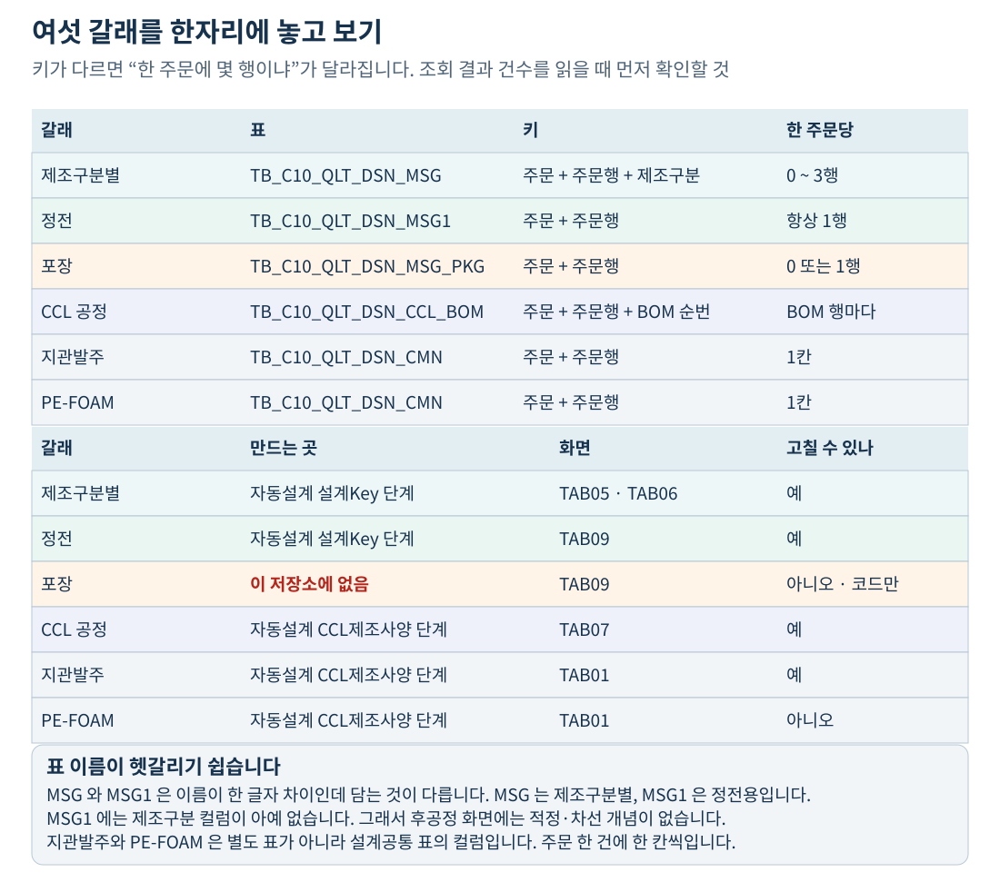

`MSG` 와 `MSG1` 은 이름이 한 글자 차이인데 담는 것이 다릅니다. **`MSG1` 에는 제조구분 컬럼이 아예 없습니다.** 그래서 후공정 화면에는 적정·차선 개념이 없습니다. `MSG_PKG` 는 이름만 메세지지, 이 저장소의 어떤 코드도 행을 넣지 않습니다. 지관발주와 PE-FOAM 은 별도 표가 아니라 **설계공통 표의 컬럼**입니다. [근거 S2, S10, S18]

## 차. 세 화면이 각각 다른 메세지를 보여준다

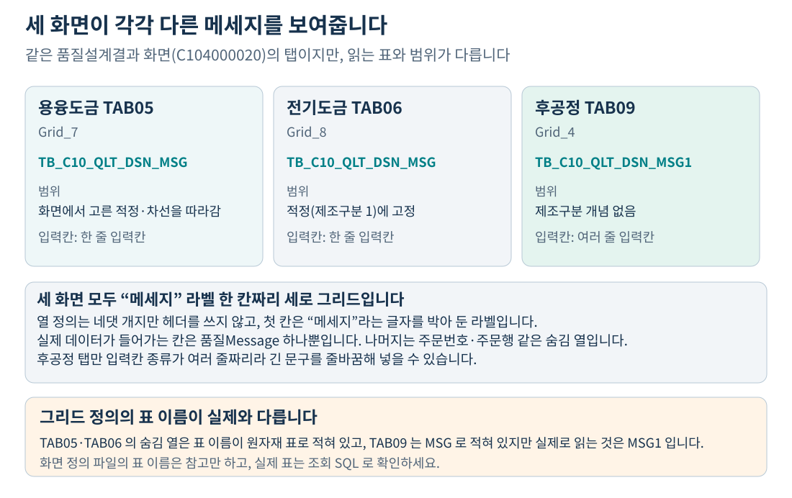

같은 품질설계결과 화면(`C104000020`)의 탭인데도 읽는 표와 범위가 다릅니다. 용융도금 탭은 화면에서 고른 적정·차선을 따라가고, **전기도금 탭은 적정에 고정**돼 있으며, 후공정 탭은 정전 표를 읽습니다. [근거 S8, S9, S10]

## 카. 같은 칸을 고쳐도 저장되는 행이 다르다

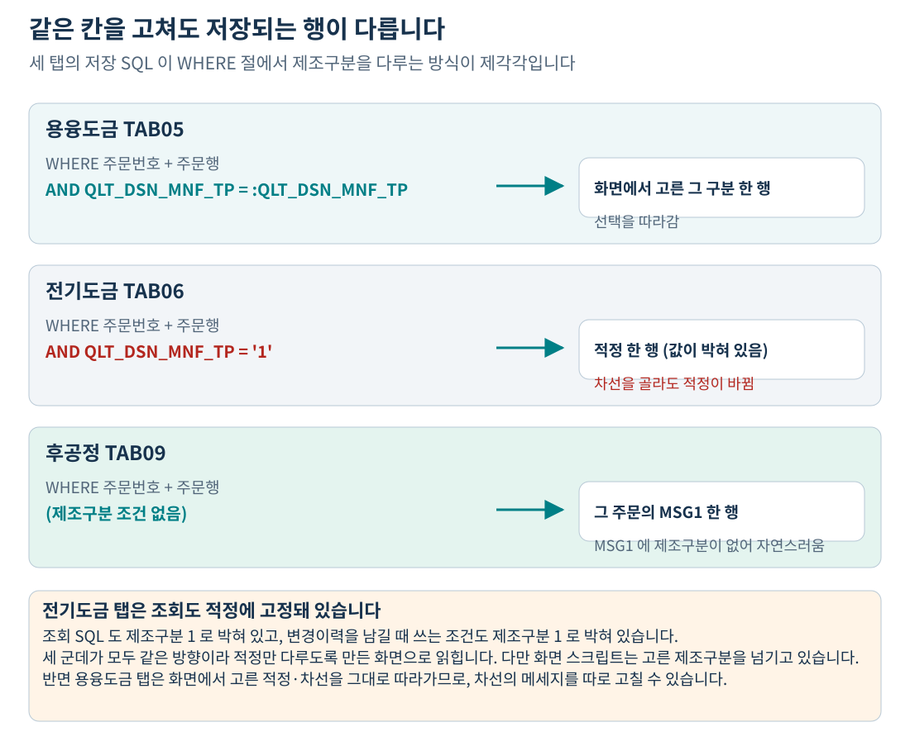

전기도금 탭은 **조회도 저장도 이력도 세 군데 모두 제조구분 1로 박혀** 있습니다. 세 군데가 같은 방향이라 적정만 다루도록 만든 화면으로 읽힙니다. 다만 화면 스크립트는 고른 제조구분을 넘기고 있어 의도가 어긋난 흔적이 남아 있습니다(9.2절). [근거 S9, S11: TAB06 111~120행, S13]

## 타. 안 보일 때는 조회 필터부터 본다

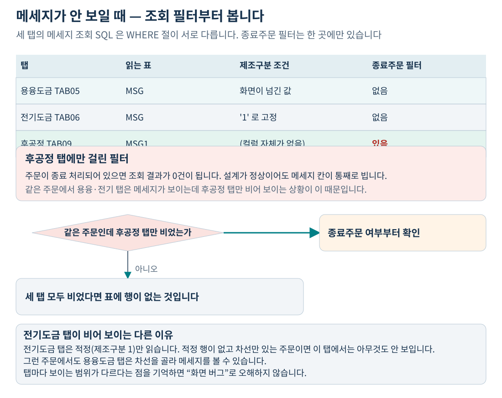

**종료주문 필터는 후공정 탭의 메세지 조회에만 있습니다.** 주문이 종료 처리되어 있으면 그 탭만 0건이 됩니다. 같은 주문에서 용융·전기 탭은 메세지가 보이는데 후공정 탭만 비어 보인다면 이것부터 확인하세요. [근거 S8, S9, S10]

## 파. 자동설계는 고쳐 쓰지 않고 지웠다 다시 만든다

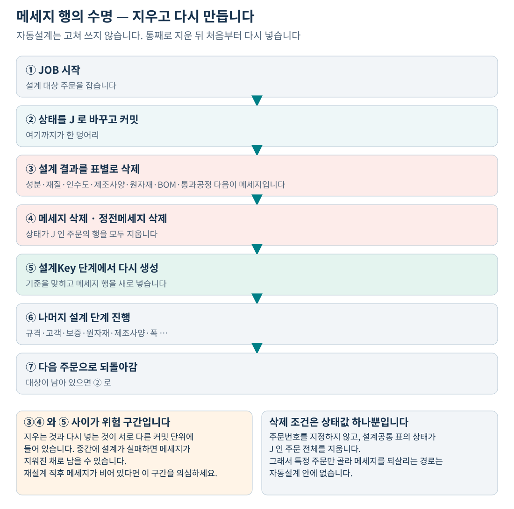

삭제 조건은 **주문번호가 아니라 설계 상태값 하나**입니다. 상태가 `J` 인 주문의 메세지를 모두 지웁니다. 그래서 특정 주문만 골라 메세지를 되살리는 경로는 자동설계 안에 없습니다. [근거 S4, S5: 210~228행]

## 하. 반복주문은 기준을 다시 맞히지 않는다

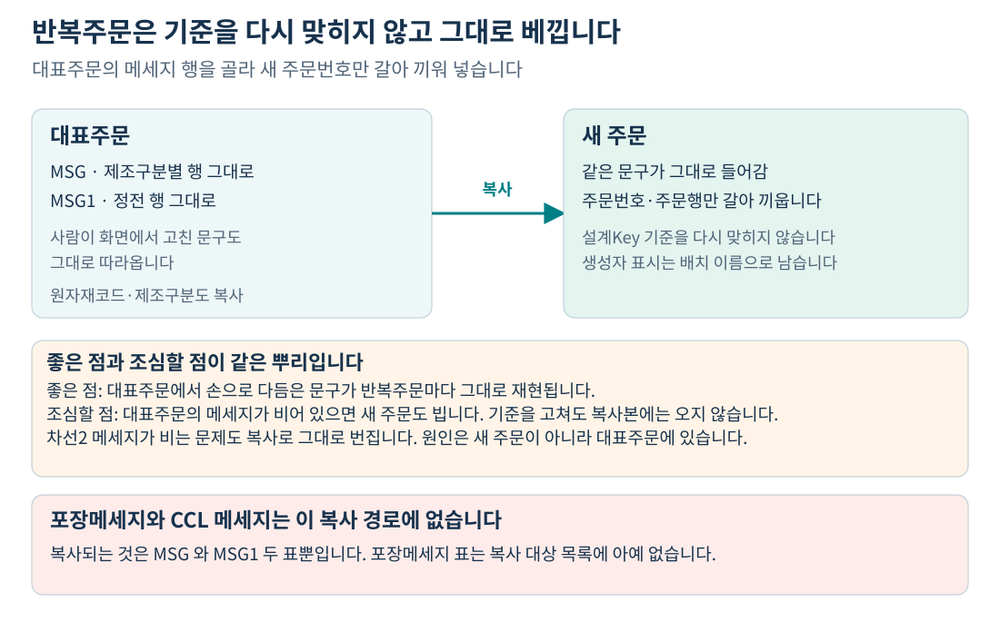

대표주문의 메세지 행을 골라 **주문번호와 주문행만 갈아 끼워** 넣습니다. 좋은 점과 조심할 점이 같은 뿌리입니다. 손으로 다듬은 문구가 그대로 재현되는 대신, **기준을 고쳐도 복사본에는 오지 않습니다.** 차선2 빈칸 문제도 복사로 그대로 번집니다. [근거 S6: 553~616행]

## 거. 화면에서 고친 것은 이력에 남는다

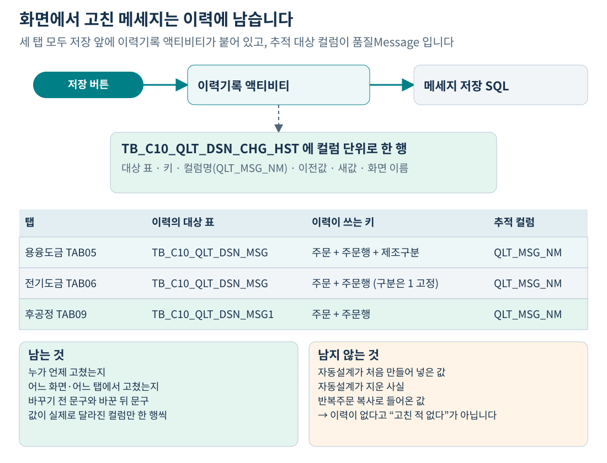

세 탭 모두 저장 앞에 이력기록이 붙어 있고 추적 대상 컬럼이 품질Message 입니다. 컬럼 단위로 **바꾸기 전 문구와 바꾼 뒤 문구**가 남습니다.

다만 **자동설계가 만들거나 지운 값은 이력에 남지 않습니다.** 이력이 없다고 “아무도 고친 적 없다”가 아니라 “화면에서 고친 적 없다”입니다. [근거 S11, S15]

## 너. 포장메세지는 두 조각을 이어 붙인 것

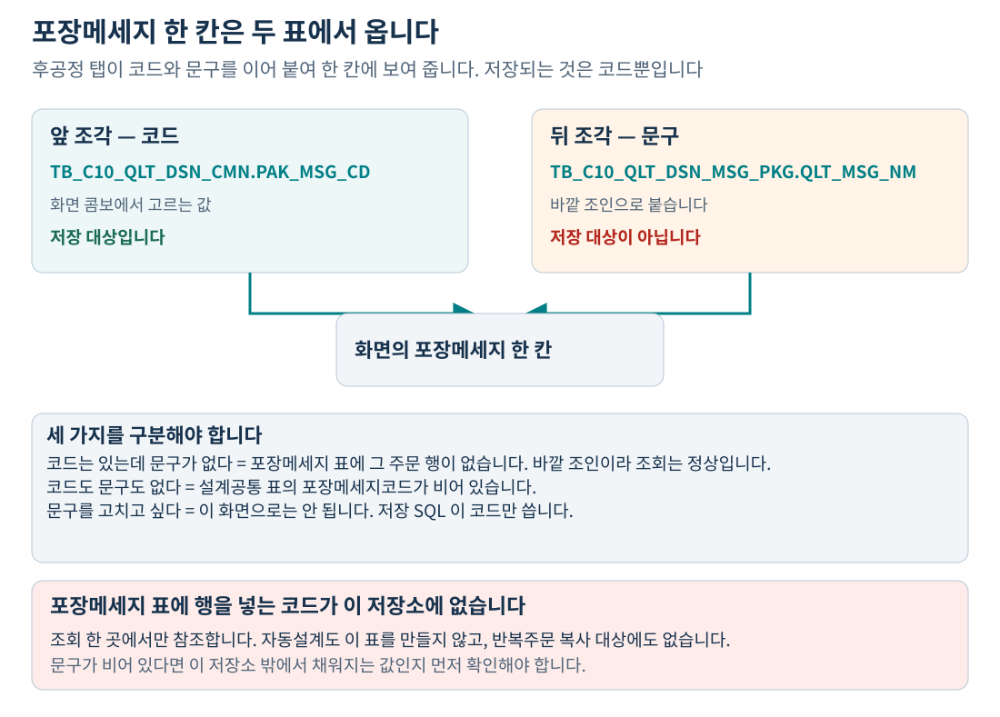

앞 조각인 코드는 설계공통 표에서 오고 저장 대상입니다. 뒤 조각인 문구는 포장메세지 표에서 바깥 조인으로 붙고 **저장 대상이 아닙니다.** 이 화면으로는 문구를 고칠 수 없습니다. [근거 S10: 119~125행, 232~245행]

## 더. 칼라 제품에는 메세지가 하나 더 있다

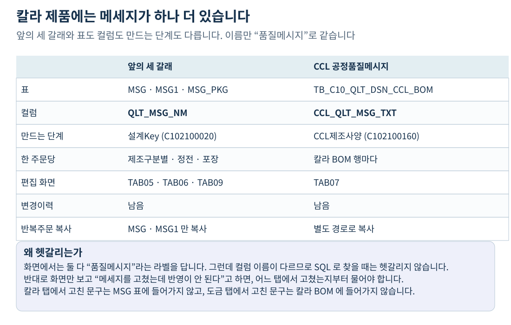

칼라 탭에서 고친 문구는 `MSG` 표에 들어가지 않고, 도금 탭에서 고친 문구는 칼라 BOM에 들어가지 않습니다. “메세지를 고쳤는데 반영이 안 된다”는 말을 들으면 **어느 탭에서 고쳤는지부터** 물어야 합니다. [근거 S14, S19]

## 러. 비었을 때 좁혀 가는 순서

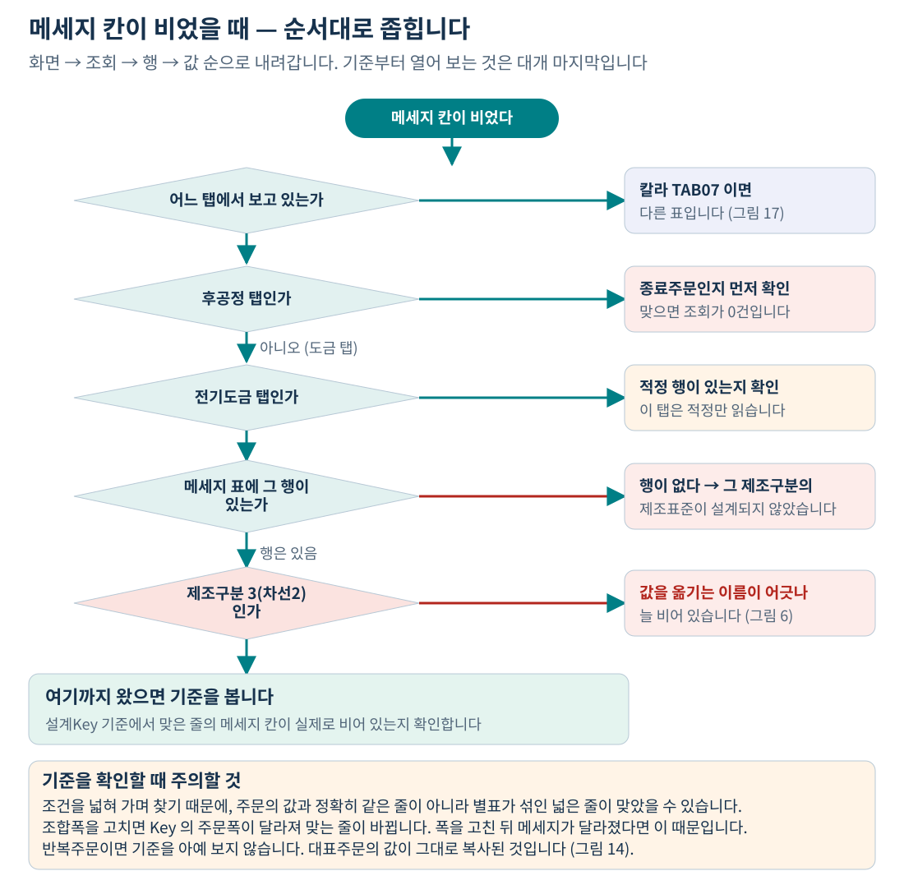

화면 → 조회 → 행 → 값 순으로 내려갑니다. **기준부터 열어 보는 것은 대개 마지막입니다.** 그 앞에서 걸러지는 경우가 훨씬 많습니다.

<div id="qm-explorer-slot"></div>

# 코드와 연결해서 읽는 상세 분석

여기서부터는 화면 뒤에서 실제로 돌아가는 코드를 따라갑니다. 각 절의 `[근거 …]` 표시는 부록 D의 코드 위치를 가리킵니다.

## 1. 여섯 갈래를 가르는 법

### 1.1 표와 컬럼

| 갈래 | 표 | 컬럼 | 키 | 한 주문당 |
|---|---|---|---|---|
| 제조구분별 품질메세지 | `TB_C10_QLT_DSN_MSG` | `QLT_MSG_NM` | 주문번호 + 주문행 + 제조구분 | 0 ~ 3행 |
| 정전 품질메세지 | `TB_C10_QLT_DSN_MSG1` | `QLT_MSG_NM` | 주문번호 + 주문행 | 항상 1행 |
| 포장메세지 | `TB_C10_QLT_DSN_MSG_PKG` | `QLT_MSG_NM` | 주문번호 + 주문행 | 0 또는 1행 |
| CCL 공정품질메시지 | `TB_C10_QLT_DSN_CCL_BOM` | `CCL_QLT_MSG_TXT` | 주문번호 + 주문행 + BOM 순번 | BOM 행마다 |
| 지관발주메시지 | `TB_C10_QLT_DSN_CMN` | `PPR_RNG_PORD_TXT` | 주문번호 + 주문행 | 1칸 |
| PE-FOAM 적용메시지 | `TB_C10_QLT_DSN_CMN` | `PE_FOAM_TXT` | 주문번호 + 주문행 | 1칸 |

**앞의 세 갈래는 컬럼 이름이 같습니다.** SQL에서 `QLT_MSG_NM` 을 검색하면 세 표가 모두 걸립니다. 표 이름을 함께 보아야 어느 갈래인지 알 수 있습니다.

뒤의 두 갈래는 **별도 표가 아니라 설계공통 표의 컬럼**입니다. 주문 한 건에 한 칸씩입니다. [근거 S2: 13~36행, 59~82행, S10: 119~125행, S14, S18]

**용어 확인.** 이 문서에서 제조구분 `1` 을 적정, `2` 를 차선1, `3` 을 차선2로 부릅니다. 소스에서도 같은 뜻으로 씁니다. 공정별 Size 편성 코드에 “적정이 F/H, 차선이 H/C일 경우”라는 주석이 있고, 그 바로 아래 조건이 제조구분 `1` 을 검사합니다. [근거 S29: 478~480행]

### 1.2 원천이 되는 업무기준

| 갈래 | 업무기준 | 읽는 곳 |
|---|---|---|
| 제조구분별 · 정전 | 설계Key기준 `C10B1040` | `DbSearchQualKeyMatch` |
| CCL 공정품질메시지 | 칼라물성기준 표 `TB_C10_CLR_MPR` | `DbSearchCclBomData` |
| 지관발주메시지 | 지관발주메시지기준 `C10B2290` | `DbSearchCclBomData` |
| PE-FOAM 적용메시지 | PE-FOAM적용메세지기준 `C10B2300` | `DbSearchCclBomData` |
| 포장메세지 | 이 저장소에 만드는 코드 없음 | — |

**메세지의 원천은 하나가 아닙니다.** 앞의 두 갈래만 설계Key 기준에서 오고, 나머지 셋은 CCL 제조사양 단계에서 다른 기준으로 채워집니다. [근거 S1: 276~279행, S19: 292~302행, 357~367행, 461행, 486행]

### 1.3 어느 화면에서 다루나

| 화면 | 탭 | 그리드·칸 | 읽는 표 | 편집 |
|---|---|---|---|---|
| 품질설계결과 | 주문정보 TAB01 | 지관메시지 | `CMN.PPR_RNG_PORD_TXT` | 가능 |
| 품질설계결과 | 주문정보 TAB01 | PE-FOAM | `CMN.PE_FOAM_TXT` | 불가 |
| 품질설계결과 | 칼라 TAB07 | Grid_8 | `CCL_BOM.CCL_QLT_MSG_TXT` | 가능 |
| 품질설계결과 | 용융도금 TAB05 | Grid_7 | `MSG` | 가능 |
| 품질설계결과 | 전기도금 TAB06 | Grid_8 | `MSG` (적정 고정) | 가능 |
| 품질설계결과 | 후공정 TAB09 | Grid_4 | `MSG1` | 가능 |
| 품질설계결과 | 후공정 TAB09 | 포장 블록 | `MSG_PKG` + 설계공통 | 불가 (코드만) |

[근거 S8, S9, S10, S12, S14, S18]

## 2. 메세지는 어디서 오는가

### 2.1 계산이 아니라 조회입니다

품질메세지에는 산식이 없습니다. **업무기준표에서 맞는 줄을 찾아 그 줄의 문구를 그대로 씁니다.** 기준표는 EasyAccess 업무기준 `C10B1040`(설계Key기준)입니다. [근거 S1: 276~279행]

이 기준표는 메세지만 주는 것이 아닙니다. 같은 줄에서 재질코드, 원자재코드 셋, 제조표준번호 셋, 통과공정번호, 설계확정구분, 승인입력기준코드도 함께 받아 옵니다. **메세지는 설계Key 편성의 부산물**입니다. 그래서 메세지가 이상하면 같은 줄에서 온 다른 값도 함께 의심해야 합니다. [근거 S1: 469~518행]

### 2.2 조건 열세 개

기준을 찾을 때 넘기는 값은 배열 하나입니다. 자리 순서가 곧 조건 순서입니다.

```
colValue[0]  품명              colValue[7]   주문Spangle구분
colValue[1]  제품형태          colValue[8]   주문도금량지정코드
colValue[2]  규격약호          colValue[9]   주문표면처리코드
colValue[3]  주문용도코드      colValue[10]  색상코드
colValue[4]  최종고객사코드    colValue[11]  주문두께
colValue[5]  고객사양번호      colValue[12]  주문폭
colValue[6]  엠보스무늬
```

[근거 S1: 259~272행]

### 2.3 주문폭은 그대로 넘기지 않습니다

```
Slit 조수 > 0  →  조합폭1 + 조합폭2 + … + 조합폭10
Slit 조수 = 0  →  주문폭 컬럼 그대로
```

Slit이 걸린 주문은 **조합폭의 합**이 기준 조회의 폭이 됩니다. 조합폭 하나를 10mm 고치면 조회에 쓰이는 폭도 10mm 달라지고, 폭 범위 조건 때문에 맞는 기준 줄이 바뀔 수 있습니다. **폭을 고친 뒤 메세지가 달라졌다면 버그가 아니라 이 규칙 때문입니다.** [근거 S1: 216~228행, S16]

### 2.4 색상코드와 고객사양번호는 미리 손질됩니다

| 주문의 고객사양번호 | 고객사양번호 조건 | 색상코드 조건 |
|---|---|---|
| 비어 있음 | `**********` 으로 대체 | CCL BOM 번호 앞 5자리, BOM 번호가 5자리 미만이면 `*****` |
| 값이 있음 | 그 값 그대로 | CCL BOM 번호 앞 5자리, BOM 번호가 5자리 미만이면 빈 값 |

마지막 칸이 눈에 띕니다. **고객사양번호가 지정된 주문에서 CCL BOM 번호가 짧으면 색상코드 조건이 빈 값으로 들어갑니다.** 별표가 아니라 빈 값입니다. [근거 S1: 222~232행]

## 3. 못 찾으면 조건을 넓힙니다

### 3.1 넓힐 수 있는 것은 네 가지뿐

열세 조건 중 넓히는 것은 **고객사양번호, 색상코드, 최종고객사코드, 주문용도코드** 넷입니다. 품명·제품형태·규격약호·두께·폭 등은 절대 넓히지 않습니다. 그래서 이 다섯 가지가 맞는 기준 줄이 없으면 메세지도 없습니다.

### 3.2 고객사양번호가 지정이면 넓히지 않습니다

```
고객사양번호가 주문에 지정돼 있는데 맞는 줄이 없다
  → 에러코드 KK01, 즉시 실패
```

넓히기는 고객사양번호가 `**********` 으로 대체된 주문에서만 일어납니다. **고객사양번호가 붙은 주문의 메세지가 안 나온다면 기준에 그 고객사양번호 줄이 등록돼 있는지부터 확인하세요.** [근거 S1: 452~459행]

### 3.3 넓히는 순서는 주행거리계와 같습니다

| 자리 | 조건 | 넓히는 값 |
|---|---|---|
| 안쪽 (①) | 주문용도코드 | 3단계로 (다음 절) |
| 가운데 (②) | 최종고객사코드 | `******` |
| 바깥 (③) | 색상코드 | `*****` |

①을 끝까지 넓히면 ②를 한 칸 올리고 **①은 원래 값으로 되돌립니다.** ②도 끝까지 가면 ③을 올리고 ①②를 모두 되돌립니다. [근거 S1: 280~450행]

전체 하강 순서를 늘어놓으면 이렇습니다. 색상코드가 `AB123`, 고객사코드가 `C00001`, 주문용도코드가 `ABCDEF` 인 주문의 경우입니다.

```
AB123 | C00001 | ABC***      AB123 | ****** | A*****      ***** | C00001 | ******
AB123 | C00001 | A*****      AB123 | ****** | ******      ***** | ****** | ABCDEF
AB123 | C00001 | ******      ***** | C00001 | ABCDEF      ***** | ****** | ABC***
AB123 | ****** | ABCDEF      ***** | C00001 | ABC***      ***** | ****** | A*****
AB123 | ****** | ABC***      ***** | C00001 | A*****      ***** | ****** | ******  → 실패 KK01
```

### 3.4 주문용도코드 세 단계

| 현재 값의 모양 | 다음 값 |
|---|---|
| 별표 없음 | 원래 주문용도코드의 앞 세 자리 + `***` |
| `XXX***` | 앞 한 자리 + `*****` |
| `X*****` | `******` |
| `******` | 더 넓히지 않음 (상위 자리로) |

**1단계로 갈 때는 현재 값이 아니라 원래 주문용도코드에서 앞 세 자리를 자릅니다.** 주문용도코드가 비어 있으면 공백 세 칸에 별표 세 개를 붙인 값을 씁니다. [근거 S1: 304~330행]

### 3.5 실패는 두 가지

| 에러코드 | 조건 |
|---|---|
| `KK01` | 넓힐 수 있는 것을 다 넓혔는데도 맞는 줄이 없음. 또는 고객사양번호가 지정인데 첫 조회에서 없음 |
| `KK02` | 맞는 줄이 두 줄 이상. 기준이 중복 등록된 경우 |

[근거 S1: 296~303행, 452~467행]

## 4. 기준의 문구가 저장값으로 옮겨질 때

### 4.1 옮김 표

Match에 성공하면 기준 줄의 값들을 이름을 바꿔 가며 문맥(`ctx`)에 담습니다. 메세지 칸 네 개의 대응은 이렇습니다.

| 기준(`C10B1040`)의 칸 | 담기는 이름 | 저장 단계가 찾는 이름 | 결과 |
|---|---|---|---|
| `QLT_MSG_NM1` | `QLT_MSG_NM` | `QLT_MSG_NM` | 맞음 |
| `QLT_MSG_NM2` | `QLT_MSG_NM1` | `QLT_MSG_NM1` | 맞음 |
| `QLT_MSG_NM3` | `QLT_MSG_NM2` | **`QLT_MSG_NM3`** | **어긋남** |
| `QLT_MSG_NM_COR` | `QLT_MSG_NM_COR` | `QLT_MSG_NM_COR` | 맞음 |

[근거 S1: 469~518행, 547~551행]

### 4.2 세 번째 줄만 어긋납니다

기준의 세 번째 메세지는 `QLT_MSG_NM2` 라는 이름으로 담깁니다. 그런데 제조구분 3 행을 만드는 코드는 `QLT_MSG_NM3` 이라는 이름을 찾습니다.

```java
// 담을 때 (469~517행 부근)
ctx.put( COL_QLT_MSG_NM2, result.getRuleValueAt( COL_QLT_MSG_NM3 ) );

// 꺼낼 때 (547~551행)
if(!DbCommonUtil.isNull( ctx.get( COL_QLT_MSG_NM3 ) ) )
    MSG.add( (String) ctx.get( COL_QLT_MSG_NM3 ) );
else MSG.add( C10STR_SPACE );
```

**`QLT_MSG_NM3` 이라는 이름으로 값을 담는 코드는 이 저장소 어디에도 없습니다.** 자바 코드에도 없고, 문맥을 채우는 어떤 조회 SQL도 그 이름의 컬럼을 돌려주지 않습니다. 그래서 이 조건은 언제나 거짓이고, 언제나 `C10STR_SPACE` 가 들어갑니다. 그 상수의 값은 **빈 문자열**입니다. [근거 S1: 476행, 547~551행, S7: 390행]

### 4.3 화면에 나타나는 증상

- 차선2(제조구분 3) 행은 **만들어집니다.** 조회하면 행이 나옵니다.
- 그 행의 메세지 칸만 **늘 비어 있습니다.**
- 기준에 세 번째 문구를 등록해도 나타나지 않습니다.
- 적정과 차선1은 정상입니다.

적정과 차선1이 정상이라 “기준 등록이 잘못됐나” 하고 기준부터 들여다보기 쉽습니다. **차선2만 비어 있다면 기준을 보기 전에 이 절을 먼저 확인하세요.**

Oracle은 빈 문자열을 NULL로 저장하므로, 표에서 보면 “문구를 등록하지 않은 경우”와 구분되지 않습니다. 원인을 기준에서 찾을 수 없다는 뜻입니다.

## 5. 제조구분별 메세지 저장

### 5.1 행을 만들지 결정하는 것

```
CRM_MNF_STD_NO  가 비어 있지 않으면  → 제조구분 1 행
CRM_MNF_STD_NO1 가 비어 있지 않으면  → 제조구분 2 행
CRM_MNF_STD_NO2 가 비어 있지 않으면  → 제조구분 3 행
```

판단 기준은 **그 제조구분의 제조표준번호**입니다. 메세지 문구가 있는지는 보지 않습니다. 그래서 문구가 없어도 행은 생기고, 반대로 문구가 있어도 제조표준번호가 없으면 행이 없습니다. [근거 S1: 528~552행]

### 5.2 함께 저장되는 값

한 행에 들어가는 것은 주문번호, 주문행, 제조구분, **원자재코드**, 메세지 문구입니다. 원자재코드가 함께 들어가는 이유는 이 표가 “설계Key 편성 결과”의 일부이기 때문입니다. 제조구분별로 다른 원자재가 선정되고, 그 원자재에 붙는 메세지라는 뜻입니다. [근거 S1: 529~562행, S2: 13~36행]

### 5.3 자동설계 INSERT에는 길이 절단이 없습니다

화면 저장 SQL 세 개는 모두 1000바이트를 넘으면 자릅니다.

```sql
QLT_MSG_NM = (CASE WHEN LENGTHB(:QLT_MSG_NM) > 1000
              THEN substrb(:QLT_MSG_NM,1,1000)
              ELSE :QLT_MSG_NM END)
```

**자동설계의 INSERT에는 이 절단이 없습니다.** 기준의 문구를 그대로 넣습니다. 기준에 아주 긴 문구가 등록돼 있으면 INSERT 단계에서 실패할 수 있고, 그러면 에러코드 `TB09` 로 그 주문의 설계가 실패합니다. [근거 S2: 13~36행, S8: 358~371행]

### 5.4 실패하면 설계 전체가 실패합니다

메세지 INSERT가 실패하면 에러코드 `TB09` 를 남기고 그 주문의 설계를 실패로 끝냅니다. **메세지만 빠진 채 나머지가 저장되지는 않습니다.** 다만 앞서 지운 행은 이미 지워진 뒤입니다(11장). [근거 S1: 566~572행, 585~591행]

### 5.5 재질코드 검사는 메세지를 넣은 뒤에 합니다

메세지 INSERT 바로 다음 줄에 재질코드가 비었는지 검사하는 코드가 있습니다.

```java
// 554~590행: 메세지 3행 + 정전 1행 INSERT
…
// 592~599행: 그 다음에야 재질코드를 검사
if(mtl_cd.equals( C10STR_SPACE ))
{
    ctx.put( COL_QLT_DSN_ERR_CD, ERRCD_KP06 );
    …
    return PosBizControlConstants.FAILURE;
}
```

**순서가 뒤집혀 있습니다.** 재질코드가 없어 설계가 실패할 주문이라도, 메세지 행은 이미 다 들어간 뒤입니다. 그리고 이 실패는 롤백되지 않습니다(11.6절). 그래서 **설계가 실패한 주문에도 메세지 행이 남아 있을 수 있습니다.** [근거 S1: 554~599행]

## 6. 정전 메세지 저장

### 6.1 조건 없이 항상 한 행

```java
// 정전메세지 저장 (575~590행)
param = new PosParameter();
param.setValueParamter( 0, ctx.get( COL_ORD_NO ) );
param.setValueParamter( 1, ctx.get( COL_ORD_LN ) );
param.setValueParamter( 2, ctx.get( COL_QLT_MSG_NM_COR ) );
dao.insert( INSERT_MSG_COR, param );
```

앞에 `if` 가 없습니다. **기준에 정전 문구가 없어도 행은 생깁니다.** [근거 S1: 575~590행]

### 6.2 값이 없을 때의 처리가 다릅니다

| | 제조구분별 경로 | 정전 경로 |
|---|---|---|
| 값이 없을 때 | 빈 문자열을 만들어 넣음 | 없는 값을 그대로 넘김 |
| 코드 | `else MSG.add( C10STR_SPACE )` | 값 검사 없음 |
| 표에 남는 것 | NULL | NULL |

**코드 경로는 다르지만 결과는 같습니다.** Oracle이 빈 문자열을 NULL로 저장하기 때문입니다. 조사할 때 이 차이로 원인을 가릴 수는 없습니다. [근거 S1: 534행, 542행, 550행, 575~590행, S7: 390행]

### 6.3 제조구분 개념이 없습니다

`TB_C10_QLT_DSN_MSG1` 에는 제조구분 컬럼이 아예 없습니다. 그래서 정전 메세지는 적정·차선을 가리지 않는 **주문 단위 값**입니다. 후공정 화면에 적정·차선 선택이 없는 것도 같은 이유입니다. [근거 S2: 59~82행, S10: 133~145행]

## 7. 표 구조와 사장 쿼리

### 7.1 쓰이는 쿼리와 안 쓰이는 쿼리

`C102100MSG-query.glue_sql` 에는 쿼리가 다섯 개 있는데 **실제로 호출되는 것은 두 개뿐**입니다.

| 쿼리 | 하는 일 | 호출처 |
|---|---|---|
| `C102100MSG.Insert` | 제조구분별 메세지 등록 | `DbSearchQualKeyMatch` (상수 `INSERT_MSG`) |
| `C102100MSG.InsertCOR` | 정전 메세지 등록 | `DbSearchQualKeyMatch` (상수 `INSERT_MSG_COR`) |
| `C102100MSG.select` | 메세지 조회 | **호출하지 않음** |
| `C102100MSG.update` | 메세지 수정 | **호출하지 않음** |
| `C102100MSG.delete` | 메세지 삭제 | **호출하지 않음** |

사장 쿼리 세 개를 읽고 “이렇게 동작하겠구나” 하고 판단하면 안 됩니다. 특히 `C102100MSG.update` 는 WHERE에 제조구분이 없어 세 행을 한꺼번에 바꾸는 모양이지만, **실행되지 않습니다.** 실제 화면 저장은 각 탭의 `MSGupdate` 를 씁니다. [근거 S2: 3~57행]

### 7.2 포장메세지 표에는 넣는 코드가 없습니다

`TB_C10_QLT_DSN_MSG_PKG` 에 INSERT·UPDATE·DELETE 하는 SQL이 저장소 전체에 없습니다. 유일한 참조는 후공정 탭 조회의 바깥 조인입니다. 자동설계도 이 표를 만들지 않고, 반복주문 복사 대상에도 없습니다.

**문구가 비어 있다면 이 저장소 밖에서 채워지는 값인지 먼저 확인해야 합니다.** [근거 S10: 119~125행, S6]

## 8. 화면 세 탭: 조회

### 8.1 세 탭의 조회 조건

| 탭 | 읽는 표 | 제조구분 조건 | 종료주문 필터 |
|---|---|---|---|
| 용융도금 TAB05 | `MSG` | 화면이 넘긴 값(바인드) | 없음 |
| 전기도금 TAB06 | `MSG` | `'1'` 로 박혀 있음 | 없음 |
| 후공정 TAB09 | `MSG1` | 컬럼 자체가 없음 | **있음** |

[근거 S8: 223~234행, S9: 157~169행, S10: 133~145행]

### 8.2 종료주문 필터

```sql
AND NOT EXISTS (SELECT * FROM MESAPUSER.VI_MES_TRM_CTL
                        WHERE CTL_NO = A.ORD_NO AND CTL_TP = 'O')
```

후공정 탭의 메세지 조회에만 있습니다. 주문이 종료 처리되어 있으면 **표에 행이 그대로 있어도 조회 결과가 0건**이 됩니다. 설계가 정상이어도 그 탭의 메세지 칸이 통째로 빕니다.

같은 주문에서 용융·전기 탭은 메세지가 보이는데 후공정 탭만 비어 보인다면 이것부터 확인하세요. [근거 S10: 141~144행]

### 8.3 전기도금 탭이 비어 보이는 다른 이유

전기도금 탭은 적정(제조구분 1)만 읽습니다. **적정 행이 없고 차선만 있는 주문이면 이 탭에서는 아무것도 안 보입니다.** 그런 주문에서도 용융도금 탭은 차선을 골라 메세지를 볼 수 있습니다.

탭마다 보이는 범위가 다르다는 점을 알면 “화면 버그”로 오해하지 않습니다.

### 8.4 용융도금 탭은 선택을 따라갑니다

용융도금 탭은 첫 그리드에서 고른 행의 **일곱 번째 칸(인덱스 6)**에서 제조구분을 읽어 조회에 넘깁니다. 적정을 고르면 적정 메세지가, 차선2를 고르면 차선2 메세지가 나옵니다. [근거 S13: 635~662행]

### 8.5 설계 상태는 조회를 막지 않습니다

세 탭의 메세지 조회 SQL에는 **설계 상태나 확정 구분 조건이 전혀 없습니다.** 확정된 주문이든 설계 중인 주문이든 표에 행이 있으면 보입니다.

확정 여부는 별도 조회(`STSselect`)로만 판정하며, 그 결과를 어떻게 쓰는지는 탭마다 다릅니다(9.5절). [근거 S8: 223~234행, 430~437행]

## 9. 화면 세 탭: 저장

### 9.1 저장 SQL의 WHERE 절

| 탭 | 대상 표 | WHERE |
|---|---|---|
| 용융도금 TAB05 | `MSG` | 주문번호 + 주문행 + `QLT_DSN_MNF_TP = :QLT_DSN_MNF_TP` |
| 전기도금 TAB06 | `MSG` | 주문번호 + 주문행 + `QLT_DSN_MNF_TP = '1'` |
| 후공정 TAB09 | `MSG1` | 주문번호 + 주문행 |

[근거 S8: 358~371행, S9: 343~356행, S10: 173~186행]

### 9.2 전기도금 탭은 적정만 다룹니다

전기도금 탭은 **조회·저장·이력 세 군데 모두** 제조구분 `'1'` 로 박혀 있습니다.

| 위치 | 값 |
|---|---|
| 조회 SQL `C104000020TAB06_MSG.select` | `AND QLT_DSN_MNF_TP = '1'` |
| 저장 SQL `C104000020TAB06.MSGupdate` | `AND QLT_DSN_MNF_TP = '1'` |
| 이력기록 액티비티의 `whereExtra` | `QLT_DSN_MNF_TP='1'` |

세 군데가 같은 방향이라 **적정만 다루도록 만든 화면**으로 읽는 것이 자연스럽습니다.

다만 **화면 스크립트는 고른 제조구분을 넘기고 있습니다.** 첫 그리드에서 고른 행의 제조구분을 읽어 조회 파라미터에 실어 보내는데, SQL이 그 값을 쓰지 않습니다. 화면과 SQL의 의도가 어긋나 있다는 뜻이므로, 이 탭에서 차선의 메세지를 다루어야 한다면 세 곳을 함께 고쳐야 합니다. [근거 S9: 157~169행, 343~356행, S11: TAB06 111~120행, S13: TAB06 628~655행]

### 9.3 후공정 탭에 제조구분 조건이 없는 것은 자연스럽습니다

후공정 탭의 저장 SQL에는 제조구분 조건이 없습니다. 앞의 두 탭과 달리 이것은 문제가 아닙니다. **대상 표인 `MSG1` 에 제조구분 컬럼이 아예 없기 때문**입니다. 주문 단위로 한 행이므로 주문번호와 주문행만으로 그 행이 특정됩니다. [근거 S2: 59~82행, S10: 173~186행]

### 9.4 확정 주문 저장 차단이 탭마다 다릅니다

| 탭 | 확정 주문일 때 |
|---|---|
| 용융도금 TAB05 | 알림만 띄우고 **저장은 진행됩니다.** 중단 코드가 주석 처리돼 있습니다 |
| 전기도금 TAB06 | **실제로 막습니다** |
| 후공정 TAB09 | 확정 검사 블록 전체가 주석 처리돼 있습니다 (2014년 요청) |

게다가 **메세지만 고친 경우에는 확정 확인 자체를 하지 않습니다.** 용융도금·전기도금 탭의 확정 검사는 원자재나 제조사양 그리드가 바뀌었을 때만 확정 조회를 부릅니다. 메세지 그리드만 손대면 곧바로 저장이 나갑니다. [근거 S13: TAB05 119~150행, TAB06 134~165행, S28: 110~122행]

### 9.5 저장할 때 1000바이트로 자릅니다

세 탭 모두 저장 SQL에서 1000바이트를 넘는 문구를 자릅니다. 한글은 UTF-8에서 한 글자가 3바이트이므로 **한글 334자면 1002바이트**가 되어 잘립니다. 긴 문구를 붙여 넣고 저장한 뒤 다시 조회했을 때 끝이 잘려 있다면 이 규칙 때문입니다. [근거 S8: 367행, S9: 352행, S10: 182행]

## 10. 변경이력

### 10.1 세 탭 모두 이력을 남깁니다

세 탭의 메세지 저장 경로 앞에는 이력기록 액티비티(`C104000020ChgHstActivity`)가 붙어 있고, 추적 대상 컬럼이 `QLT_MSG_NM` 입니다.

| 탭 | 이력의 대상 표 | 이력이 쓰는 키 |
|---|---|---|
| 용융도금 TAB05 | `TB_C10_QLT_DSN_MSG` | 주문번호 + 주문행 + 제조구분 |
| 전기도금 TAB06 | `TB_C10_QLT_DSN_MSG` | 주문번호 + 주문행 (`whereExtra` 로 제조구분 1) |
| 후공정 TAB09 | `TB_C10_QLT_DSN_MSG1` | 주문번호 + 주문행 |

[근거 S11]

### 10.2 남는 것과 남지 않는 것

이력 표(`TB_C10_QLT_DSN_CHG_HST`)에는 **값이 실제로 달라진 컬럼마다 한 행씩** 들어갑니다. 대상 표 이름, 키, 컬럼명, 이전값, 새값, 그리고 화면 이름이 함께 기록됩니다.

| 남습니다 | 남지 않습니다 |
|---|---|
| 화면에서 고친 문구의 전후 | 자동설계가 처음 만들어 넣은 값 |
| 누가 언제 어느 탭에서 고쳤는지 | 자동설계가 지운 사실 |
| 값이 달라진 컬럼만 | 반복주문 복사로 들어온 값 |

**이력이 없다고 “아무도 고친 적 없다”가 아닙니다.** “화면에서 고친 적 없다”입니다. 자동설계와 복사는 이력 경로를 타지 않습니다. [근거 S15, S3, S6]

### 10.3 수정로그 표: 두 탭의 동작이 다릅니다

용융도금·전기도금 탭에는 제조사양용 수정로그 표(`TB_C10_QLT_DSN_MNF_MDF_LOG`)가 따로 있습니다. 메세지 저장이 이 표를 건드리는지가 **두 탭에서 다릅니다.**

| 탭 | 메세지 저장 뒤 | 수정로그 |
|---|---|---|
| 용융도금 TAB05 | 저장 후 바로 끝 | 남지 않음 |
| 전기도금 TAB06 | 저장 후 전기도금이력저장으로 이어짐 | **남음** |

메세지만 고쳤을 뿐인데 전기도금 탭에서는 제조사양 수정로그가 하나 생깁니다. 두 탭의 로그 건수를 비교할 때 이 차이를 알아야 합니다. [근거 S11: TAB05 93~99행, TAB06 38~44행]

### 10.4 수정설계원 판정에서 메세지는 제외됩니다

품질설계결과 화면의 **수정설계원**(누가 마지막으로 설계를 고쳤는가)은 변경이력에서 뽑는데, 조건이 좁습니다.

```sql
AND CHG_TXT = 'C104000020TAB05'
AND ( TARGET_TABLE_NM IS NULL
   OR TARGET_TABLE_NM IN ('TB_C10_QLT_DSN_MNF','TB_C10_QLT_DSN_RMT') )
```

대상 표가 **제조사양과 원자재 둘뿐**입니다. `TB_C10_QLT_DSN_MSG` 는 목록에 없습니다. 게다가 화면 이름이 용융도금 탭으로 고정돼 있어 전기도금 탭과 후공정 탭의 저장도 제외됩니다.

**메세지만 고치면 수정설계원이 바뀌지 않습니다.** 이는 실수가 아니라 의도된 범위입니다. 이력은 그대로 남기되 수정설계원 판정 대상만 좁혀 둔 구조입니다. [근거 S26: 84~127행, 386~395행]

### 10.5 전 탭 공통 이력 팝업

`C104000020POP_HST` 는 모든 탭의 컬럼 단위 변경이력을 한 화면에 모아 보여주는 공통 팝업입니다. 메세지 컬럼 변경도 여기에 나옵니다. 탭별로 따로 찾을 필요가 없습니다.

컬럼 한글명은 데이터베이스의 컬럼 주석에서 가져오는데 **소유자를 `C10APUSER` 로 고정해 조회**합니다. 다른 스키마의 표라면 한글명이 비어 보일 수 있습니다. [근거 S27: 6~30행]

## 11. 수명주기: 지웠다 다시 만듭니다

### 11.1 자동설계 체인에서의 자리

자동설계(`C102100000-service.xml`)는 33단계 체인입니다. 메세지와 관련된 자리는 이렇습니다.

| 순서 | 액티비티 |
|---|---|
| 1 | JOB시작 UPDATE |
| 2 | 상태UPDATE |
| 3 | **COMMIT** |
| 4 | 품질설계 공통 UPDATE |
| 5 ~ 11 | 성분 · 재질 · 인수도 · 제조사양 · 원자재 · CCL-BOM · 통과공정 DELETE |
| **12** | **품질설계메세지 DELETE** |
| **13** | **품질설계메세지1 DELETE** |
| 14 | 품질설계 ERROR DELETE |
| **15** | **설계Key(C102100020)** ← 메세지를 다시 만드는 곳 |
| 16 ~ 32 | 규격 · 고객 · 사내 · 보증 · 원자재 · 제조사양 · 도금량 · CCL · 통과공정 · 두께 · 폭 · Size · 정합성체크 |
| 33 | 품질설계의뢰조회 → 대상이 남아 있으면 2번으로 |

[근거 S4]

### 11.2 삭제 조건은 상태값 하나뿐입니다

```sql
DELETE TB_C10_QLT_DSN_MSG A
WHERE EXISTS (SELECT 1 FROM TB_C10_QLT_DSN_CMN B
              WHERE  A.ORD_NO = B.ORD_NO
              AND    A.ORD_LN = B.ORD_LN
              AND    B.QLT_DSN_STS_CD = 'J')
```

**주문번호를 지정하지 않습니다.** 설계공통 표의 상태가 `J` 인 주문 전체를 지웁니다. `MSG1` 도 같은 모양입니다. 그래서 특정 주문만 골라 메세지를 되살리는 경로는 자동설계 안에 없습니다. [근거 S5: 210~228행]

### 11.3 메세지를 만드는 곳

**자동설계 체인 안에서는 설계Key 단계(15번) 하나뿐**입니다. 그 뒤에 오는 규격·고객·보증·CCL 단계는 메세지 표에 넣지 않습니다. 화면의 세 탭도 `UPDATE` 만 하고 `INSERT` 는 하지 않습니다.

체인 밖에는 경로가 하나 더 있습니다. **반복주문 복사**입니다(다음 절). [근거 S3: 120~123행, S6]

### 11.4 반복주문 복사

```sql
INSERT INTO TB_C10_QLT_DSN_MSG(ORD_NO, ORD_LN, QLT_DSN_MNF_TP, RMTL_CD, QLT_MSG_NM, …)
SELECT :ORD_NO, :ORD_LN, QLT_DSN_MNF_TP, RMTL_CD, QLT_MSG_NM, …
  FROM TB_C10_QLT_DSN_MSG
 WHERE ORD_NO = :ORD_REP_NO
   AND ORD_LN = :ORD_REP_LN
```

대표주문의 행을 골라 **주문번호와 주문행만 갈아 끼워** 넣습니다. 기준을 다시 맞히지 않습니다. `MSG1` 도 같은 모양입니다.

| | 결과 |
|---|---|
| 대표주문에서 손으로 다듬은 문구 | 그대로 재현됩니다 |
| 대표주문 이후에 고친 기준 | **반영되지 않습니다** |
| 대표주문의 빈 차선2 메세지 | 복사본에서도 빕니다 |
| 포장메세지 (`MSG_PKG`) | 복사 대상이 아닙니다 |

[근거 S6: 553~616행]

### 11.5 삭제와 재생성 사이

메세지를 지우는 12·13번과 다시 만드는 15번 사이에 **에러 삭제(14번)와 하위 서비스 진입**이 있습니다. 재설계 직후 메세지가 비어 있고 다른 설계 결과도 함께 비어 있다면, 그 주문의 설계가 중간에 실패했는지부터 확인하세요. 설계 상태와 에러코드를 함께 보아야 합니다.

### 11.6 실패해도 롤백되지 않습니다

설계Key 단계의 커밋을 담당하는 액티비티는 오류 표시값을 읽기는 하는데, **어느 쪽이든 커밋합니다.** 롤백 호출이 주석 처리되어 있습니다.

```java
// 대소문자 상관없이 N이면 커밋 Y이면 롤백
if ( checkId.toUpperCase().equals( C10STR_NO ) )
{
    this.commitTransaction( txName );
} else
{
    this.commitTransaction( txName );
    // this.rollbackTransaction(txName);
}
```

클래스 주석은 “Y면 커밋, N이면 롤백”이라 되어 있고 코드 주석은 그 반대로 적혀 있는데, **실제로는 둘 다 커밋합니다.** 그래서 설계가 실패해도 그때까지 지운 행과 넣은 행이 그대로 남습니다. [근거 S22: 127~140행]

덧붙여, 이 액티비티가 넣는 오류 표시값은 실제로 분기를 바꾸지 않습니다. 반복 액티비티가 매 건 시작에서 그 값을 다시 덮어씁니다. **오류 표시값으로 동작을 예측하지 마세요.** [근거 S3: 120~124행, S23: 90행, 120행]

### 11.7 배치에서도 같은 JOB이 돕니다

이 삭제·재생성 JOB은 화면에서만 도는 것이 아닙니다. **EAI 주문수신 배치**가 스케줄러로 기동되어 같은 서비스를 하위 서비스로 호출합니다.

또 하나 중요한 점이 있습니다. 상태를 `I` 에서 `J` 로 올리는 쿼리가 **한 번에 최대 10건**을 잡습니다. 삭제 쿼리에는 주문 조건이 없으므로, **JOB 한 번이 최대 10건의 메세지를 통째로 지우고 다시 만듭니다.** 다른 사람이 손으로 고친 메세지가 함께 지워질 수 있습니다. [근거 S24, S5: 210~232행, 265~280행]

### 11.8 복사 경로가 세 군데 있습니다

| 서비스 | 상태 |
|---|---|
| `C102100170-service` (화면) | 정상 사용 |
| `B10R0030_sub-service` (배치) | 같은 쿼리를 **직접 액티비티로 복제**해 실행 |
| `C102100180-service` | 어디서도 호출하지 않는 **고아 체인** |

고아 체인은 같은 쿼리를 **이름 바인딩이 아니라 위치 바인딩 방식으로** 호출합니다. 쿼리는 이름 바인딩용으로 선언돼 있으므로, 만약 이 체인을 되살린다면 그 부분부터 확인해야 합니다. [근거 S6, S24, S25]

## 12. 포장메세지와 CCL 공정품질메시지

### 12.1 포장메세지는 두 조각을 이어 붙인 것

```sql
TB_C10_QLT_DSN_CMN.PAK_MSG_CD ||
TB_C10_QLT_DSN_MSG_PKG.QLT_MSG_NM  PAK_MSG_CD  --포장메세지
…
AND  TB_C10_QLT_DSN_MSG_PKG.ORD_NO(+) = TB_C10_QLT_DSN_CMN.ORD_NO
AND  TB_C10_QLT_DSN_MSG_PKG.ORD_LN(+) = TB_C10_QLT_DSN_CMN.ORD_LN
```

앞 조각인 **코드**는 설계공통 표에서 오고, 뒤 조각인 **문구**는 포장메세지 표에서 바깥 조인으로 붙습니다. 두 값을 이어 붙인 결과가 화면의 한 칸입니다. [근거 S10: 119~125행]

| 화면에 보이는 것 | 뜻 |
|---|---|
| 코드 + 문구 | 정상 |
| 코드만 | 포장메세지 표에 그 주문 행이 없음 (바깥 조인이라 조회는 정상) |
| 문구만 | 설계공통의 포장메세지코드가 비어 있음 |
| 빈칸 | 둘 다 없음 |

### 12.2 저장되는 것은 코드뿐입니다

`C104000020TAB09.PKG_MSGupdate` 는 설계공통 표의 `PAK_MSG_CD` 만 갱신합니다. **포장메세지 문구는 이 화면으로 고칠 수 없습니다.** 문구를 바꾸려면 포장메세지 표를 직접 다뤄야 하는데, 그 표에 쓰는 코드가 이 저장소에 없습니다. [근거 S10: 232~245행]

### 12.3 CCL 공정품질메시지

칼라 제품에는 메세지가 하나 더 있습니다. 앞의 세 갈래와 표도 컬럼도 만드는 단계도 다릅니다.

| | 앞의 세 갈래 | CCL 공정품질메시지 |
|---|---|---|
| 표 | `MSG` · `MSG1` · `MSG_PKG` | `TB_C10_QLT_DSN_CCL_BOM` |
| 컬럼 | `QLT_MSG_NM` | `CCL_QLT_MSG_TXT` |
| 만드는 단계 | 설계Key (`C102100020`) | CCL제조사양 (`C102100160`) |
| 한 주문당 | 제조구분별 · 정전 · 포장 | 칼라 BOM 행마다 |
| 편집 화면 | TAB05 · TAB06 · TAB09 | TAB07 |
| 변경이력 | 남음 | 남음 (`trackColumns` 에 포함) |

[근거 S14]

**칼라 탭에서 고친 문구는 `MSG` 표에 들어가지 않고, 도금 탭에서 고친 문구는 칼라 BOM에 들어가지 않습니다.** “메세지를 고쳤는데 반영이 안 된다”는 말을 들으면 어느 탭에서 고쳤는지부터 물어야 합니다.

한 가지 눈여겨볼 것이 있습니다. **칼라 쪽에도 “좁은 것 우선” 규칙이 있습니다.** 칼라코드관리 화면은 칼라물성기준에서 고객코드와 주문용도코드의 일치도를 네 순위로 매겨 한 줄만 뽑습니다.

| 순위 | 조건 |
|---|---|
| 1 | 고객코드도 용도코드도 일치 |
| 2 | 고객코드만 일치 |
| 3 | 용도코드만 일치 |
| 4 | 둘 다 일반 값 |

설계Key 쪽은 자바 반복문으로 조건을 넓히고, 칼라 쪽은 SQL 한 문장 안에서 순위를 매깁니다. **방식은 다르지만 “좁은 기준을 먼저”라는 생각은 같습니다.** [근거 S30: 53~85행]

### 12.4 지관발주메시지와 PE-FOAM 적용메시지

두 갈래는 별도 표가 아니라 **설계공통 표의 컬럼**입니다. CCL 제조사양 단계에서 각각 다른 업무기준을 읽어 채웁니다.

| | 지관발주메시지 | PE-FOAM 적용메시지 |
|---|---|---|
| 컬럼 | `PPR_RNG_PORD_TXT` | `PE_FOAM_TXT` |
| 업무기준 | `C10B2290` | `C10B2300` |
| 기준 조회 실패 시 | 에러코드 `KT35` | 에러코드 `KT36` |
| 화면 | 주문정보 TAB01 | 주문정보 TAB01 |
| 화면에서 고치기 | **가능** (최대 500자) | 불가 (읽기 전용) |

지관발주메시지는 기준 조회 결과가 없으면 **빈 문자열을 넣고 넘어갑니다.** 반면 조회 자체가 실패하면 에러코드를 남깁니다. 두 경우를 구분해야 합니다. [근거 S19: 292~325행, 357~385행, S18]

### 12.5 이름은 메세지인데 품질메세지가 아닌 것

| 이름 | 실제 정체 | 왜 다른가 |
|---|---|---|
| `QLT_DSN_ERR_CD` | 품질설계 오류코드 | 설계 실패 사유를 담는 코드입니다. 설계공통 표의 컬럼이고 문구가 아닙니다 |
| `QLT_DSN_ERR_MSG` | 오류 송신용 문구 | 표에 저장되지 않습니다. EAI 오류 송신 시점에 만들어 내보냅니다 |
| `EAIAPUSER.TB_C10_B10S1010.QLT_DSN_MSG` | **송신 플래그** | 문구가 아니라 한 글자 상태값입니다. `'A'` 인 행을 확정결과 송신 대상으로 뽑고, 송신 후 `'B'` 로 바꿉니다 |

마지막 것이 가장 위험합니다. 이름이 `QLT_DSN_MSG` 라 품질메세지 컬럼으로 오해하기 쉽지만, **손대면 EAI 송신 상태가 망가집니다.** [근거 S20: 627행, 634행, S21: 359~373행]

### 12.6 칼라 탭의 MSG 동기화

칼라 탭에는 저장 말고 **`MSG동기화`** 라는 경로가 하나 더 있습니다. 화면의 메세지를 거꾸로 **마스터(`TB_C10_CLR_MPR`)에 반영**하고 EAI로 전송합니다.

| 경로 | 하는 일 | 변경이력 |
|---|---|---|
| `MSG_save` | 이 주문의 칼라 BOM에 저장 | **남습니다** |
| `MSG_sync` | 마스터에 반영 + EAI 전송 | **남지 않습니다** |

동기화 경로에는 이력기록 액티비티가 붙어 있지 않습니다. 마스터 쪽 수정로그 표에만 남습니다. **“칼라 메세지를 누가 바꿨나”를 변경이력에서만 찾으면 동기화로 바뀐 것은 놓칩니다.** [근거 S14]

한 가지 더 있습니다. 동기화의 갱신은 고객·용도 네 조합 행을 모두 바꾸는데, **EAI 전송은 `******` 조합 한 행만 골라 보냅니다.** 마스터와 EAI 수신 쪽이 어긋날 수 있습니다. [근거 S14]

### 12.7 칼라 탭에만 있는 화면 검증

칼라 탭은 저장 전에 메세지 문구에 `=""` 가 들어 있으면 알림을 띄우고 저장을 중단합니다. **다른 세 탭에는 없는 칼라 전용 방어 코드**입니다. 같은 문구를 용융도금 탭에 넣으면 그대로 저장됩니다. [근거 S14]

## 13. 메세지가 안 보일 때 추적 순서

화면 → 조회 → 행 → 값 순으로 좁혀 갑니다. **기준을 여는 것은 대개 마지막입니다.**

| 순서 | 확인할 것 | 그렇다면 |
|---|---|---|
| 1 | 어느 탭에서 보고 있나 | 칼라 탭이면 다른 표입니다 (12.3) |
| 2 | 후공정 탭인가 | 종료주문인지 확인 (8.2) |
| 3 | 전기도금 탭인가 | 적정 행이 있는지 확인 (8.3) |
| 4 | 메세지 표에 그 행이 있나 | 없으면 그 제조구분의 제조표준이 설계되지 않았습니다 (5.1) |
| 5 | 제조구분 3(차선2)인가 | 값을 옮기는 이름이 어긋나 늘 비어 있습니다 (4.2) |
| 6 | 반복주문인가 | 대표주문의 값이 복사된 것입니다 (11.4) |
| 7 | 여기까지 왔으면 기준을 봅니다 | 맞은 줄의 메세지 칸이 실제로 비어 있는지 |

### 13.1 기준을 볼 때 주의할 것

- 조건을 넓혀 가며 찾으므로, 주문의 값과 정확히 같은 줄이 아니라 **별표가 섞인 넓은 줄**이 맞았을 수 있습니다. 로그의 조건값 출력을 함께 보세요.
- **조합폭을 고치면** Key의 주문폭이 달라져 맞는 줄이 바뀝니다. 폭을 고친 뒤 메세지가 달라졌다면 이 때문입니다 (2.3).
- 고객사양번호가 지정된 주문은 넓히기 자체를 하지 않습니다 (3.2).

### 13.2 조회로 확인하는 순서

```sql
-- ① 표에 행이 있는가
SELECT QLT_DSN_MNF_TP, RMTL_CD, QLT_MSG_NM
  FROM TB_C10_QLT_DSN_MSG
 WHERE ORD_NO = ? AND ORD_LN = ?;

-- ② 정전 메세지는 따로 본다
SELECT QLT_MSG_NM FROM TB_C10_QLT_DSN_MSG1
 WHERE ORD_NO = ? AND ORD_LN = ?;

-- ③ 종료주문인가 (후공정 탭이 빌 때)
SELECT * FROM MESAPUSER.VI_MES_TRM_CTL
 WHERE CTL_NO = ? AND CTL_TP = 'O';

-- ④ 설계 상태와 에러코드
SELECT QLT_DSN_STS_CD, QLT_DSN_ERR_CD FROM TB_C10_QLT_DSN_CMN
 WHERE ORD_NO = ? AND ORD_LN = ?;
```

①에서 행이 나오는데 화면이 비었다면 화면 쪽 문제이고, 행이 안 나오면 설계 쪽 문제입니다. 이 한 갈래만 갈라도 조사 범위가 절반으로 줄어듭니다.

# 부록 A. 메세지를 다루는 SQL 한눈에 보기

| SQL 키 | 하는 일 | 대상 표 | 호출처 |
|---|---|---|---|
| `C102100MSG.Insert` | 제조구분별 메세지 등록 | `MSG` | 자동설계 설계Key 단계 |
| `C102100MSG.InsertCOR` | 정전 메세지 등록 | `MSG1` | 자동설계 설계Key 단계 |
| `C102100MSG.select` | 메세지 조회 | `MSG` | **호출하지 않음** |
| `C102100MSG.update` | 메세지 수정 | `MSG` | **호출하지 않음** |
| `C102100MSG.delete` | 메세지 삭제 | `MSG` | **호출하지 않음** |
| `C102100000.MSG_ADELETE` | 상태 J 주문의 메세지 일괄 삭제 | `MSG` | 자동설계 체인 12번 |
| `C102100000.MSG1_ADELETE` | 상태 J 주문의 정전 메세지 일괄 삭제 | `MSG1` | 자동설계 체인 13번 |
| `C102100000.MSG_DELETE` | 주문 단위 삭제 | `MSG` | **호출하지 않음** |
| `C102100000.MSG1_DELETE` | 주문 단위 삭제 | `MSG1` | **호출하지 않음** |
| `C102100170.MSGinsert` | 대표주문에서 복사 | `MSG` | 화면 복사 · 배치 복사 |
| `C102100170.MSG1insert` | 대표주문에서 복사 | `MSG1` | 화면 복사 · 배치 복사 |
| `C104000020TAB05_MSG.select` | 조회 (제조구분 바인드) | `MSG` | 용융도금 탭 |
| `C104000020TAB05.MSGupdate` | 저장 (제조구분 바인드) | `MSG` | 용융도금 탭 |
| `C104000020TAB06_MSG.select` | 조회 (제조구분 `'1'` 고정) | `MSG` | 전기도금 탭 |
| `C104000020TAB06.MSGupdate` | 저장 (제조구분 `'1'` 고정) | `MSG` | 전기도금 탭 |
| `C104000020TAB09_MSG.select` | 조회 (종료주문 필터 있음) | `MSG1` | 후공정 탭 |
| `C104000020TAB09.MSGupdate` | 저장 | `MSG1` | 후공정 탭 |
| `C104000020TAB09.PKG_MSGupdate` | 포장메세지 **코드만** 저장 | `CMN` | 후공정 탭 |
| `C104000020CHG_HST.insert` | 변경 전후를 컬럼 단위로 기록 | `CHG_HST` | 세 탭의 이력기록 액티비티 |

**`TB_C10_QLT_DSN_MSG_PKG` 에 쓰는 SQL은 이 저장소에 없습니다.**

# 부록 B. 에러코드

| 코드 | 언제 | 이후 |
|---|---|---|
| `KK01` | 조건을 다 넓혔는데 맞는 기준이 없음. 또는 고객사양번호가 지정인데 첫 조회에서 없음 | 설계 실패 |
| `KK02` | 맞는 기준이 두 줄 이상 (중복 등록) | 설계 실패 |
| `TB09` | 메세지 INSERT 실패 | 설계 실패 |
| `KP06` | 재질코드가 비어 있음 (**메세지 INSERT 뒤에 검사**) | 설계 실패 · 메세지 행은 남음 |
| `KT35` | 지관발주메시지기준 조회 실패 | 설계 실패 |
| `KT36` | PE-FOAM적용메세지기준 조회 실패 | 설계 실패 |

`KK01` 은 두 곳에서 나오는데 조건이 정반대입니다. 하나는 **다 넓히고도 못 찾은 경우**, 다른 하나는 **넓히기를 시도조차 하지 않은 경우**입니다. 로그의 조건값 출력을 보면 어느 쪽인지 알 수 있습니다. [근거 S1: 296~303행, 452~459행]

# 부록 C. 혼동하기 쉬운 설명 대조표

| 혼동할 수 있는 설명 | 현재 실행 코드에 맞춘 설명 |
|---|---|
| 품질메세지는 표 하나에 모여 있다 | 여섯 갈래가 서로 다른 표·컬럼에 흩어져 있다 |
| 컬럼 이름이 같으면 같은 메세지 | `QLT_MSG_NM` 하나로 세 표가 걸린다 |
| 메세지는 계산해서 만든다 | 업무기준에서 맞는 줄을 찾아 그대로 쓴다 |
| 조건이 안 맞으면 바로 실패 | 선택 조건 네 가지를 차례로 넓혀 다시 찾는다 |
| 고객사양번호가 있으면 더 정확히 찾는다 | 지정이면 넓히기를 아예 하지 않아 오히려 잘 실패한다 |
| 차선2 메세지가 비면 기준 등록 누락 | 값을 옮기는 이름이 어긋나 **항상** 빈다 |
| 메세지가 없으면 행도 없다 | 행 생성은 제조표준번호로 정하고 문구와 무관하다 |
| 정전 메세지도 없으면 안 만든다 | 조건 없이 항상 1행 만든다 |
| 전기도금 탭에서 차선 메세지를 고칠 수 있다 | 조회·저장·이력 모두 적정에 고정돼 있다 |
| 확정된 주문은 메세지를 못 고친다 | 메세지만 고치면 확정 확인 자체를 하지 않는다 |
| 메세지를 고치면 수정설계원이 바뀐다 | 수정설계원 판정 대상은 제조사양·원자재뿐이다 |
| 이력이 없으면 아무도 안 고쳤다 | 자동설계와 복사는 이력을 남기지 않는다 |
| 설계가 실패하면 되돌려진다 | 롤백 호출이 주석 처리돼 있어 그대로 커밋된다 |
| 재설계는 한 주문씩 처리한다 | 상태가 J 인 주문을 한 번에 최대 10건 묶어 지운다 |
| 포장메세지 문구도 화면에서 고친다 | 저장 대상은 코드뿐이며 문구 표에 쓰는 코드가 없다 |
| `QLT_DSN_MSG` 는 품질메세지 컬럼 | EAI 표의 송신 플래그다 (`A` → `B`) |

# 부록 D. 코드 근거와 재현 범위

## D.1 핵심 코드 위치

| 근거 | 파일 | 주요 위치 |
|---|---|---|
| S1 | [DbSearchQualKeyMatch.java](../../src/com/unionsteel/mes/c10/activity/nui/DbSearchQualKeyMatch.java) | 216~228 주문폭, 222~232 고객사양번호·색상코드, 259~272 조건 배열, 276~279 기준 조회, 280~450 조건 확장, 296~303·452~459 KK01, 461~467 KK02, 469~518 값 옮김, 524~572 제조구분별 INSERT, 575~591 정전 INSERT, 592~599 KP06 |
| S2 | [C102100MSG-query.glue_sql](../../src/query/C102100MSG-query.glue_sql) | 3 select(미사용), 13~36 Insert, 38~50 update(미사용), 51~58 delete(미사용), 59~82 InsertCOR |
| S3 | [C102100020-service.xml](../../src/service/C102100020-service.xml) | 16~20 COMMIT, 22~27 ERR_CHK, 29~34 MODIFY_CMN, 54~57 PROC_LOOP, 120~124 SEARCH_MD |
| S4 | [C102100000-service.xml](../../src/service/C102100000-service.xml) | 전체 33단계 체인, 79~83 메세지1 DELETE, 95~99 메세지 DELETE, 161~165 설계Key |
| S5 | [C102100000-query.glue_sql](../../src/query/C102100000-query.glue_sql) | 113·131 주문 단위 삭제(미사용), 210~228 일괄 삭제, 265~280 상태 I→J |
| S6 | [C102100170-query.glue_sql](../../src/query/C102100170-query.glue_sql) · [C102100170-service.xml](../../src/service/C102100170-service.xml) | 쿼리 553~586 MSGinsert, 587~616 MSG1insert · 서비스 200~205·266~271 호출 |
| S7 | [C10NuiConstantsIF.java](../../src/com/unionsteel/mes/c10/activity/common/constants/C10NuiConstantsIF.java) | 390 빈 문자열 상수, 2796~2804 메세지 컬럼명, 3535~3536 INSERT SQL 키, 3559 칼라물성기준 |
| S8 | [C104000020TAB05-query.glue_sql](../../src/query/C104000020TAB05-query.glue_sql) | 223~234 조회, 358~371 저장, 430~437 확정 조회 |
| S9 | [C104000020TAB06-query.glue_sql](../../src/query/C104000020TAB06-query.glue_sql) | 157~169 조회(제조구분 1 고정), 343~356 저장(제조구분 1 고정) |
| S10 | [C104000020TAB09-query.glue_sql](../../src/query/C104000020TAB09-query.glue_sql) | 119~125 포장메세지 결합, 133~145 조회·종료필터, 173~186 저장, 232~245 포장코드 저장 |
| S11 | [TAB05-service.xml](../../src/service/C104000020TAB05-service.xml) · [TAB06](../../src/service/C104000020TAB06-service.xml) · [TAB09](../../src/service/C104000020TAB09-service.xml) | TAB05 93~99 MSG저장·105~114 이력, TAB06 38~44 MSG저장·111~120 이력, TAB09 53~62 이력·67~77 포장 |
| S12 | [TAB05 Grid_7](../../WebContents/header/kr/C104000020TAB05/C104000020TAB05_Grid_7.xml) · [TAB06 Grid_8](../../WebContents/header/kr/C104000020TAB06/C104000020TAB06_Grid_8.xml) · [TAB09 Grid_4](../../WebContents/header/kr/C104000020TAB09/C104000020TAB09_Grid_4.xml) | 열 정의·편집 종류·숨김 열 |
| S13 | [C104000020TAB05.jsp](../../WebContents/C104000020TAB05.jsp) · [TAB06.jsp](../../WebContents/C104000020TAB06.jsp) | TAB05 119~150 확정 검사·635~662 제조구분 전달, TAB06 134~165 확정 검사·628~655 제조구분 전달 |
| S14 | [C104000020TAB07-query.glue_sql](../../src/query/C104000020TAB07-query.glue_sql) · [TAB07-service.xml](../../src/service/C104000020TAB07-service.xml) · [TAB07.jsp](../../WebContents/C104000020TAB07.jsp) | 쿼리 318 조회·504 저장·565~582 동기화·655~657 EAI · 서비스 10~24 이력·42~46 동기화·64~65 분기 · JSP 144~150 화면 검증 |
| S15 | [C104000020ChgHstActivity.java](../../src/com/unionsteel/mes/c10/activity/ui/C104000020ChgHstActivity.java) · [C104000020CHG_HST-query.glue_sql](../../src/query/C104000020CHG_HST-query.glue_sql) | 액티비티 71~72 SQL 키·83~85 화면 이름·350~371 컬럼 단위 INSERT · 쿼리 12~56 |
| S16 | [적정·차선 원자재 폭설계 해설서](적정_차선_원자재_폭설계_쉽게이해하기.html) | 조합폭과 정전폭목표값의 상세 설명 |
| S17 | [C102100CCL_BOM-query.glue_sql](../../src/query/C102100CCL_BOM-query.glue_sql) | 148 CCL 공정품질메시지 컬럼 |
| S18 | [C102100CMN-query.glue_sql](../../src/query/C102100CMN-query.glue_sql) · [TAB01 Form_1](../../WebContents/header/kr/C104000020TAB01/C104000020TAB01_Form_1.xml) | 쿼리 306~307·697~698 두 메세지 컬럼 · 화면 228 PE-FOAM·235 지관메시지 |
| S19 | [DbSearchCclBomData.java](../../src/com/unionsteel/mes/c10/activity/nui/DbSearchCclBomData.java) | 260~325 지관발주메시지(C10B2290), 322~385 PE-FOAM(C10B2300), 461·486 칼라물성기준에서 CCL 메세지 |
| S20 | [C104000050-query.glue_sql](../../src/query/C104000050-query.glue_sql) | 627 송신 대상 조회, 634 송신 완료 표시 |
| S21 | [C102100CMN-query.glue_sql](../../src/query/C102100CMN-query.glue_sql) | 359~373 오류 송신 문구 생성 |
| S22 | [DbSetCommit.java](../../src/com/unionsteel/mes/c10/activity/common/DbSetCommit.java) | 127~140 양쪽 모두 커밋, 롤백 주석 처리 |
| S23 | [DbQualDesignLoop.java](../../src/com/unionsteel/mes/c10/activity/nui/DbQualDesignLoop.java) | 90·120 오류 표시값 초기화 |
| S24 | [B10R0030_sub-service.xml](../../src/service/B10R0030_sub-service.xml) | 18~23·1082~1087 복사 액티비티, 750~758 자동설계 호출 |
| S25 | [C102100180-service.xml](../../src/service/C102100180-service.xml) | 198~205·271~275 고아 복사 체인 |
| S26 | [C104000020-query.glue_sql](../../src/query/C104000020-query.glue_sql) | 84~127·386~395 수정설계원 판정 조건 |
| S27 | [C104000020POP_HST-query.glue_sql](../../src/query/C104000020POP_HST-query.glue_sql) | 6~30 전 탭 공통 이력 조회 |
| S28 | [C104000020TAB09.jsp](../../WebContents/C104000020TAB09.jsp) | 110~122 확정 검사 비활성 주석 |
| S29 | [DbSearchProcSizeData.java](../../src/com/unionsteel/mes/c10/activity/nui/DbSearchProcSizeData.java) | 478~480 제조구분 1 이 적정임을 보여주는 주석 |
| S30 | [C106000200-query.glue_sql](../../src/query/C106000200-query.glue_sql) | 53~85 칼라코드관리 화면의 메세지 우선순위 조회 |

## D.2 재현 방법

문서에 적은 규칙은 `qlt-msg-guide-assets/verify-examples.cjs` 에서 JavaScript로 독립 재현합니다. 인용한 SQL 키·파일·행 근거가 실제로 존재하는지는 `verify-document.cjs` 가 대조합니다. 그림 표시와 선택 예제는 `verify-guide.cjs` 가 브라우저로 확인합니다.

```sh
node docs/analysis/qlt-msg-guide-assets/verify-examples.cjs
node docs/analysis/qlt-msg-guide-assets/verify-document.cjs
node docs/analysis/qlt-msg-guide-assets/verify-guide.cjs
```

## D.3 확인하지 않은 것

- 운영 DB의 실제 행과 업무기준 등록 내용
- Java 서비스와 Oracle을 실행한 통합 동작
- EasyAccess 기준표(`C10B1040`, `C10B2290`, `C10B2300`)의 컬럼 구조. 자바 코드가 읽는 이름으로만 추정했습니다
- `TB_C10_QLT_DSN_MSG_PKG` 에 행을 넣는 주체. 이 저장소 밖입니다

# 함께 읽기

- [적정·차선 원자재 폭설계 해설서](적정_차선_원자재_폭설계_쉽게이해하기.html) — 조합폭이 설계Key 조회의 폭을 바꾸는 이유
- [용융·전기 제조표준 설계 해설서](용융_전기_제조표준_설계_쉽게이해하기.html) — 메세지가 붙는 두 탭의 나머지 항목
- [후공정 제조표준 설계 해설서](후공정_제조표준_설계_쉽게이해하기.html) — 정전 메세지와 포장메세지가 놓인 화면
