# 읽기 전에: 이 문서는 무엇을 설명하나?

**후공정 제조표준은 만들어진 제품을 어떻게 잘라 싸서 내보낼지를 정합니다.** 정전 공정의 Slit 조수와 조합폭, 1T2C 유무, S/T 유무, 제품폭범위, SKID 치수, 보호필름, 포장 조건이 여기 모입니다. 앞선 두 탭이 설비 작업조건을 다룬다면 이 탭은 제품 마무리 조건을 다룹니다.

이 문서는 [용융·전기 제조표준 설계 해설서](용융_전기_제조표준_설계_쉽게이해하기.html)와 같은 방식으로 작성했습니다. 다만 후공정 탭은 **계산이 거의 없고 표시 규칙이 많은** 화면이라, 산식표 대신 **순서도와 판단 흐름**을 중심으로 그렸습니다. 그림 18개 중 여섯 개가 순서도입니다.

처음 읽는 분은 앞의 **‘그림으로 먼저 이해하기’**에서 화면 구성과 값의 출처를 익히고, 실제 주문을 조사하는 분은 뒤의 **상세 분석 1~11장과 부록**을 함께 읽으면 됩니다.

분석 기준은 **2026-09-10 현재 이 작업 폴더의 화면·SQL·서비스 XML·Java 소스**입니다. 운영 배포본이나 운영 DB의 행은 조회하지 않았습니다. 모든 숫자 예제는 **설명용 가정**이며 실적이나 표준값이 아닙니다. 단위는 별도 표시가 없으면 mm입니다. 기존 분석서와 실행 코드는 수정하지 않았습니다.

# 그림으로 먼저 이해하기: 후공정 화면 읽는 법

**처음 읽는 분은 이 부분부터 보세요.** 아래에서는 코드명을 잠시 내려놓고, **화면에 보이는 값이 어디서 왔고 저장하면 어디로 가는지**를 따라갑니다. 이후 본문 1~11장은 이 그림의 정확한 조건과 코드 근거를 설명합니다.

## 가. 제조표준 세 탭 중 마지막 자리

제조표준 화면은 용융도금, 전기도금, 후공정 세 탭입니다. 앞의 두 탭은 품명에 따라 갈리지만, **후공정 탭은 품명과 무관하게 모든 주문에 나타납니다.**

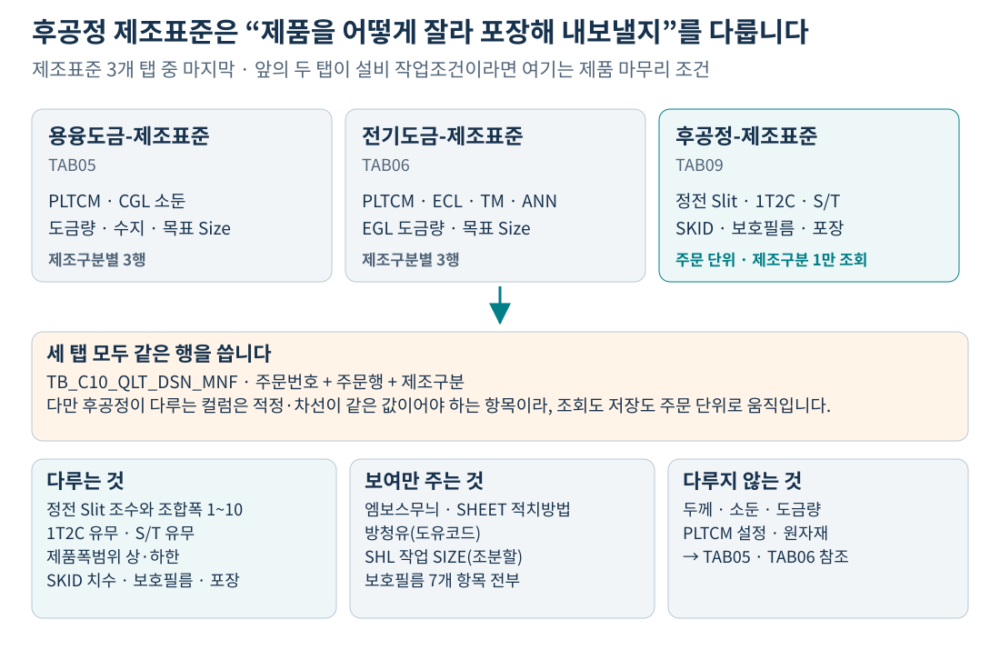

세 탭 모두 같은 표(`TB_C10_QLT_DSN_MNF`)의 행을 씁니다. 다만 **후공정이 다루는 컬럼은 적정·차선이 같은 값을 갖는 항목**이라, 조회도 저장도 주문 단위로 움직입니다. 이 차이가 7장에서 다룰 중요한 성질을 만듭니다. [근거 S1, S2]

## 나. 화면은 다섯 블록, 편집은 세 곳

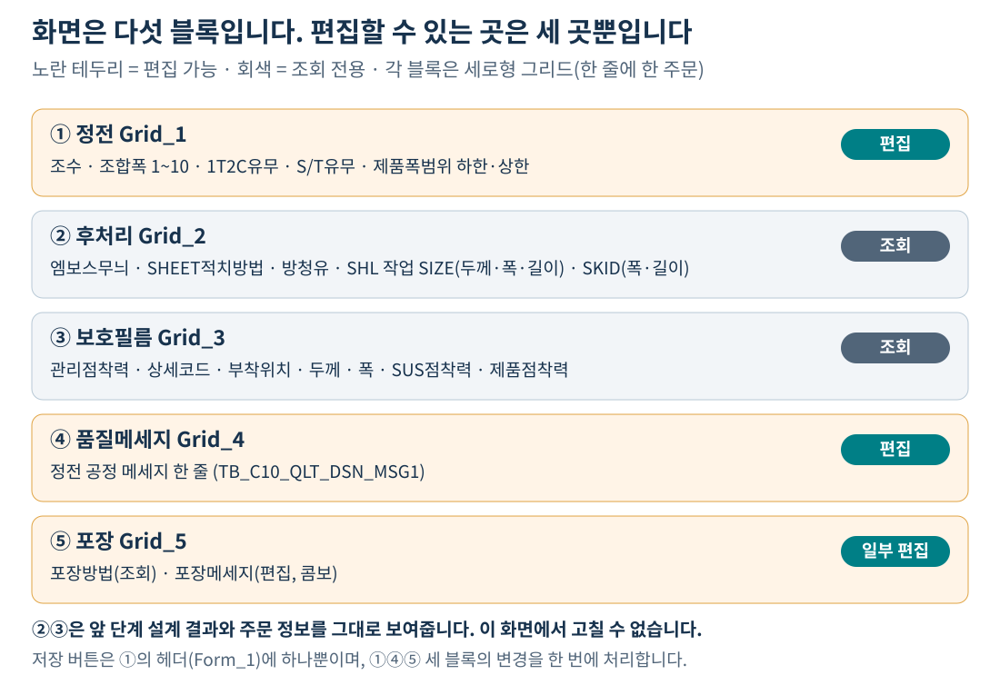

저장 버튼은 첫 블록의 헤더에 **하나뿐**입니다. 정전·품질메세지·포장 세 블록의 변경을 한 번에 처리합니다. 후처리와 보호필름 블록은 조회 전용이며 이 화면에서 고칠 수 없습니다. [근거 S3, S4]

## 다. 값은 네 곳에서 온다

후공정 탭이 스스로 계산하는 값은 **SKID 폭·길이 두 개뿐**입니다. 나머지는 주문에서 가져오거나, 자동설계가 만들어 둔 값이거나, 다른 표에서 읽어 온 값입니다.

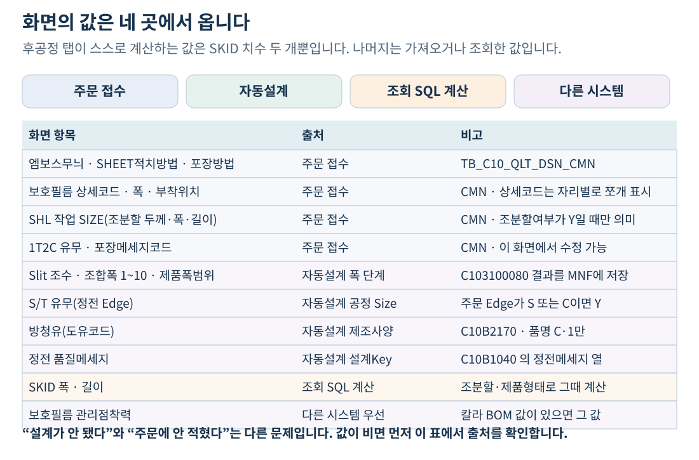

**“설계가 안 됐다”와 “주문에 안 적혔다”는 다른 문제입니다.** 값이 비어 보일 때 이 표에서 출처를 먼저 확인하면 조사 범위가 절반으로 줄어듭니다. [근거 S1, S5, S6]

## 라. 저장 버튼 하나가 세 갈래를 순서대로 확인한다

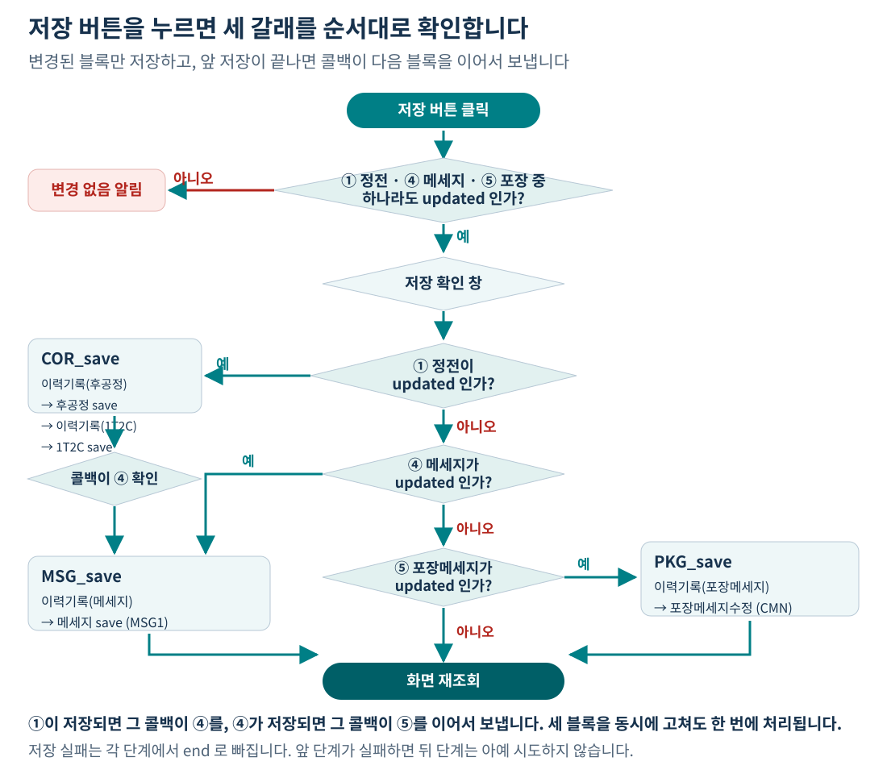

정전 블록이 저장되면 그 완료 콜백이 메세지 블록을, 메세지가 저장되면 그 콜백이 포장 블록을 이어서 보냅니다. **세 블록을 동시에 고쳐도 한 번의 버튼으로 모두 처리됩니다.** 반대로 앞 단계가 실패하면 뒤 단계는 시도조차 하지 않습니다. [근거 S4, S2]

## 마. 조수와 조합폭1은 보였다 숨었다 한다

이 화면에서 가장 자주 오해를 만드는 규칙입니다. 조회 SQL이 값을 그대로 내려주지 않고 **S/T 유무를 먼저 봅니다.**

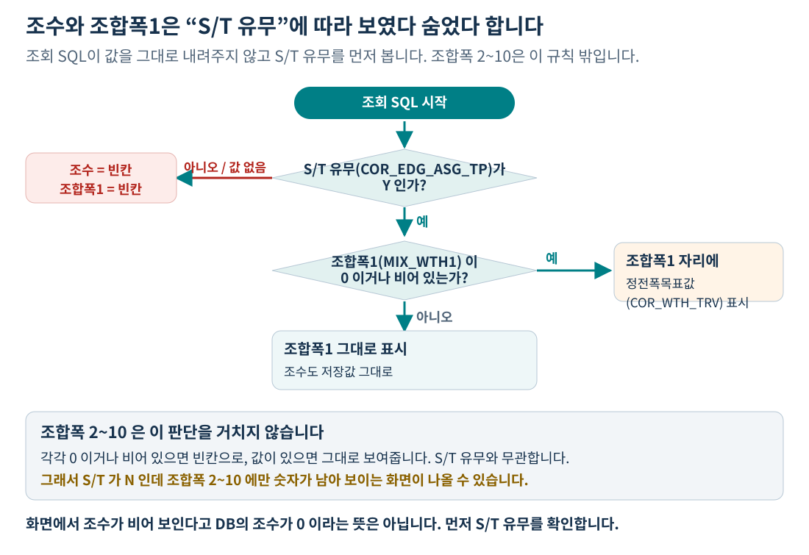

**화면에서 조수가 비어 보인다고 DB의 조수가 0이라는 뜻은 아닙니다.** 조합폭 2~10은 이 판단을 거치지 않으므로, S/T가 N인데 조합폭 2~10에만 숫자가 남아 보이는 화면이 나올 수 있습니다. [근거 S1: 10~14행]

## 바. 저장할 때도 같은 규칙이 값을 지킨다

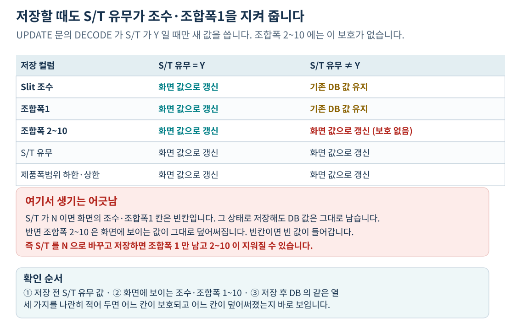

보호 대상은 **조수와 조합폭1 두 개뿐**입니다. 조합폭 2~10은 화면에 보이는 값이 그대로 덮어써집니다. 그래서 S/T를 N으로 바꾸고 저장하면 조합폭 1만 남고 2~10이 지워질 수 있습니다. [근거 S1: 155~156행]

## 사. 저장은 적정·차선 세 행을 한꺼번에 바꾼다

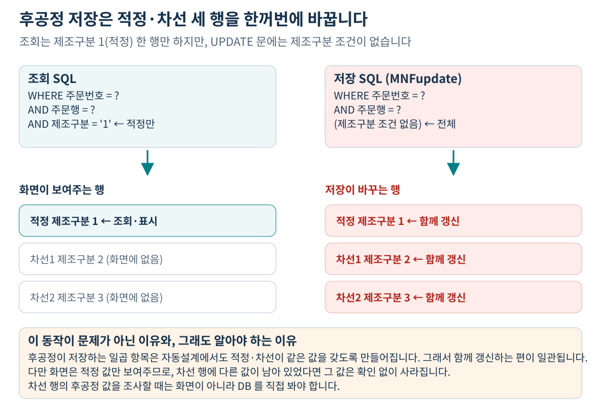

조회 SQL에는 제조구분 1 조건이 있지만 **저장 SQL에는 제조구분 조건이 없습니다.** 후공정이 저장하는 항목은 자동설계에서도 적정·차선이 같은 값을 갖도록 만들어지므로 함께 갱신하는 편이 일관됩니다. 다만 차선 행에 다른 값이 남아 있었다면 그 값은 확인 없이 사라집니다. [근거 S1: 127~128행 조회 조건, 169~170행 저장 조건]

## 아. SKID 치수는 저장된 값이 아니다

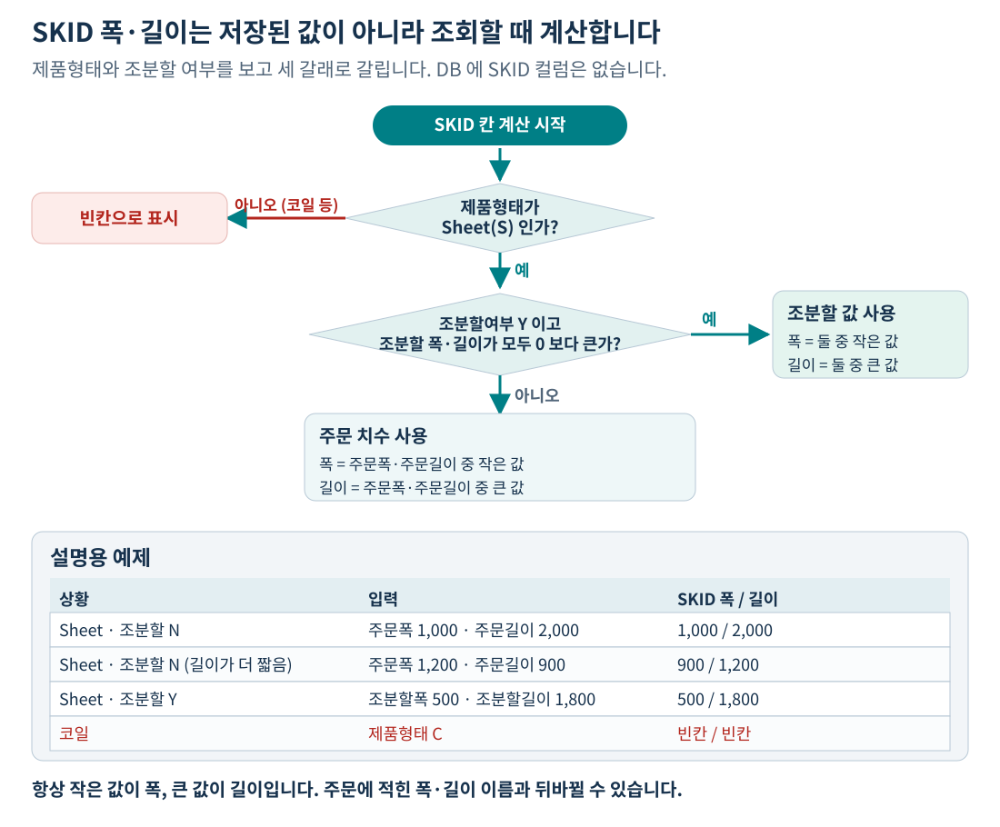

`SKID_WTH`·`SKID_LTH`라는 컬럼은 DB에 없습니다. 조회할 때마다 제품형태와 조분할 여부를 보고 계산합니다. **항상 작은 값이 폭, 큰 값이 길이**이므로 주문에 적힌 폭·길이 이름과 뒤바뀔 수 있습니다. [근거 S1: 54~81행]

### 조건을 바꿔 가며 화면을 비교해 보기

아래에서 주문 조건을 바꾸면 조수·조합폭1이 어떻게 숨겨지고 SKID가 어느 갈래로 계산되는지 바로 비교할 수 있습니다. **모든 선택지는 표시 규칙만 재현한 설명용 예제**이며, 운영 주문을 조회하는 계산기가 아닙니다. JavaScript가 꺼져 있거나 Markdown으로 읽는 경우에는 입문 그림 E·H와 본문 3·4장의 표를 이용하세요.

<div id="pp-explorer-slot"></div>

### 그림을 읽고 나서 실제 주문에 대입할 네 가지

| 먼저 확인할 것 | 이 질문에 답하면 다음이 정해진다 |
|---|---|
| 주문이 종료되었나 | 종료면 화면이 통째로 빈다. 설계 오류가 아니다 |
| S/T 유무가 Y인가 | 조수·조합폭1의 표시와 저장 보호 여부가 정해진다 |
| 제품형태와 조분할 여부 | SKID 치수가 어느 갈래로 계산될지 정해진다 |
| 값을 화면에서 봤나 DB에서 봤나 | 표시 규칙이 값을 감추므로 둘이 다를 수 있다 |

아래 상세 분석에서는 이 네 질문을 실제 컬럼·SQL·저장 경로와 연결합니다.

# 코드와 연결해서 읽는 상세 분석

## 1. 후공정 탭이 다루는 값의 목록

### 1.1 편집 대상 일곱 항목

저장 버튼이 바꾸는 값은 일곱 가지입니다. 나머지는 모두 조회 전용입니다. [근거 S1: 146~172행, 232~259행]

| 화면 항목 | 컬럼 | 저장 표 |
|---|---|---|
| Slit 조수 | `SLIT_GRP_CNT` | `TB_C10_QLT_DSN_MNF` |
| 조합폭 1~10 | `MIX_WTH1` ~ `MIX_WTH10` | `TB_C10_QLT_DSN_MNF` |
| S/T 유무 | `COR_EDG_ASG_TP` | `TB_C10_QLT_DSN_MNF` |
| 제품폭범위 하한·상한 | `PRD_WTH_RNG_LLV` / `ULV` | `TB_C10_QLT_DSN_MNF` |
| 1T2C 유무 | `OT_TC_YN` | `TB_C10_QLT_DSN_CMN` |
| 포장메세지코드 | `PAK_MSG_CD` | `TB_C10_QLT_DSN_CMN` |
| 정전 품질메세지 | `QLT_MSG_NM` | `TB_C10_QLT_DSN_MSG1` |

**같은 그리드 안에서도 저장 표가 갈립니다.** 정전 그리드의 1T2C 유무만 설계공통 표로 가고 나머지는 제조표준 표로 갑니다. 그래서 저장 경로가 두 단계로 나뉩니다(9장).

### 1.2 조회 전용 항목

| 블록 | 항목 | 원래 출처 |
|---|---|---|
| 후처리 | 엠보스무늬, SHEET 적치방법 | 주문 (`TB_C10_QLT_DSN_CMN`) |
| 후처리 | 방청유(도유코드) | 자동설계 제조사양 (`OIL_PNT_CD`) |
| 후처리 | SHL 작업 SIZE 두께·폭·길이 | 주문 조분할 값 (`SUB_PTL_*`) |
| 후처리 | SKID 폭·길이 | 조회 SQL이 그때 계산 |
| 보호필름 | 관리점착력, 상세코드, 부착위치, 두께, 폭, SUS점착력, 제품점착력 | 주문 + 칼라 BOM |
| 포장 | 포장방법 | 주문 (`ORD_PAK_MTH`) |

방청유는 자동설계 제조사양 단계가 품명 C·1에만 편성합니다. 다른 품명에서 비어 보이는 것은 정상입니다. [근거 S5]

## 2. 조회는 어떻게 이루어지나?

### 2.1 한 번의 SQL, 네 그리드

정전·후처리·보호필름·포장 네 그리드는 **모두 같은 SQL(`C104000020TAB09_MNF.select`)을 호출**합니다. 그리드마다 필요한 컬럼 목록만 다르게 넘겨 각자 쓸 값을 받습니다. 품질메세지 그리드만 별도 SQL을 씁니다. [근거 S4: 62~88행]

| 그리드 | 조회 액션 | SQL |
|---|---|---|
| Grid_1 정전 | `MNF_find` | `C104000020TAB09_MNF.select` |
| Grid_2 후처리 | `MNF_find` | 같은 SQL |
| Grid_3 보호필름 | `MNF_find` | 같은 SQL |
| Grid_5 포장 | `MNF_find` | 같은 SQL |
| Grid_4 품질메세지 | `MSG_find` | `C104000020TAB09_MSG.select` |

한 SQL이 세 표를 조인합니다. 제조표준과 설계공통은 안쪽 조인, 포장메세지는 바깥쪽 조인입니다. **포장메세지 행이 없어도 나머지 값은 정상 조회됩니다.** [근거 S1: 121~126행]

### 2.2 조회를 막는 두 가지 조건

```
AND TB_C10_QLT_DSN_MNF.QLT_DSN_MNF_TP = '1'
AND NOT EXISTS (SELECT * FROM MESAPUSER.VI_MES_TRM_CTL
                 WHERE CTL_NO = TB_C10_QLT_DSN_CMN.ORD_NO AND CTL_TP = 'O')
```

첫 줄은 적정 행만 보겠다는 뜻이고, 둘째 줄은 **종료 처리된 주문을 제외**합니다.

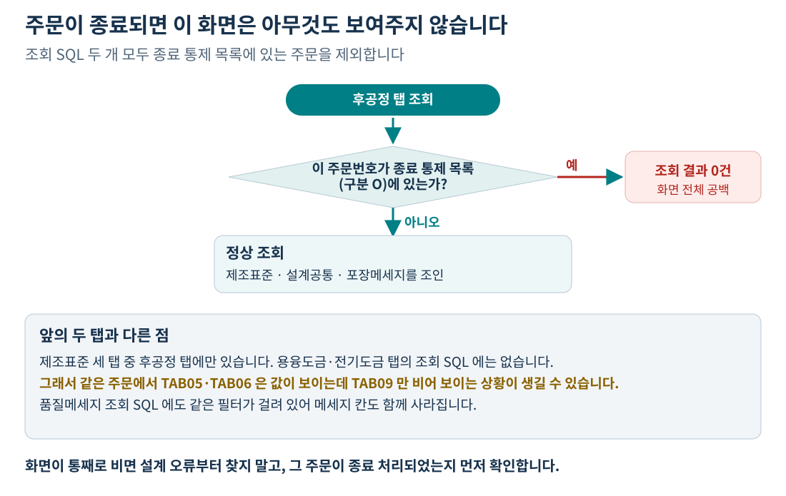

**이 종료 필터는 제조표준 세 탭 가운데 후공정 탭에만 있습니다.** 용융도금(TAB05)·전기도금(TAB06) 탭의 조회 SQL에는 없습니다. 다만 같은 화면의 다른 탭(TAB02·TAB03·TAB04·TAB08)에는 같은 필터가 있으므로, "이 화면에서 유일하다"는 뜻은 아닙니다. 그래서 같은 주문에서 앞 두 탭은 값이 보이는데 후공정 탭만 비어 보이는 상황이 생깁니다. 품질메세지 조회에도 같은 필터가 걸려 메세지 칸도 함께 사라집니다. [근거 S1: 127~130행, 141~143행]

## 3. 정전 블록: 표시 규칙이 값을 감춘다

### 3.1 조수와 조합폭1의 표시 판단

조회 SQL은 세 단계로 판단합니다. [근거 S1: 10~14행]

| 조건 | 조수 | 조합폭1 |
|---|---|---|
| S/T 유무가 N이거나 비어 있음 | 빈칸 | 빈칸 |
| S/T 유무 Y, 조합폭1이 0이거나 비어 있음 | 저장값 | **정전폭목표값으로 대체** |
| S/T 유무 Y, 조합폭1에 값 있음 | 저장값 | 저장값 |

조합폭1이 0일 때 정전폭목표값을 대신 보여주는 것은 **화면 표시일 뿐이며 저장되지 않습니다.** 그 상태로 저장 버튼을 누르면 화면에 보이던 정전폭목표값이 조합폭1로 저장될 수 있으므로, 편집 전에 원래 값을 확인해야 합니다.

### 3.2 조합폭 2~10은 규칙이 다르다

조합폭 2~10은 각각 **0이거나 비어 있으면 빈칸, 값이 있으면 그대로** 표시합니다. S/T 유무를 보지 않습니다. 앞의 두 칸과 규칙이 다르다는 점이 화면만 봐서는 드러나지 않습니다.

### 3.3 1T2C 유무와 S/T 유무는 다른 콤보다

| 항목 | 컬럼 | 공통코드 | 저장 표 |
|---|---|---|---|
| 1T2C 유무 | `OT_TC_YN` | `OT_TC_YN` | 설계공통 |
| S/T 유무 | `COR_EDG_ASG_TP` | **`CUT_LN_YN`** | 제조표준 |

S/T 유무 콤보가 읽는 공통코드 이름은 `CUT_LN_YN`(재단선 여부)입니다. 컬럼 이름(정전 Edge 지정구분)과도, 화면 이름(S/T 유무)과도 다릅니다. **세 이름이 모두 다른 항목**이므로 조사할 때 혼동하기 쉽습니다. [근거 S4: 176~186행]

## 4. 후처리 블록: 보여주기만 한다

### 4.1 SKID 치수 계산

`SKID_WTH`와 `SKID_LTH`는 DB 컬럼이 아니라 조회 SQL의 계산 결과입니다. 세 갈래로 갈립니다. [근거 S1: 54~81행]

| 조건 | SKID 폭 | SKID 길이 |
|---|---|---|
| 제품형태 Sheet + 조분할 Y + 조분할 폭·길이 모두 0 초과 | 조분할 폭·길이 중 **작은 값** | 둘 중 **큰 값** |
| 제품형태 Sheet (그 외) | 주문폭·주문길이 중 **작은 값** | 둘 중 **큰 값** |
| 제품형태가 Sheet가 아님 | 빈칸 | 빈칸 |

설명용 예제입니다.

| 상황 | 입력 | SKID 폭 / 길이 |
|---|---|---|
| Sheet, 조분할 N | 주문폭 1,000 · 주문길이 2,000 | 1,000 / 2,000 |
| Sheet, 조분할 N | 주문폭 1,200 · 주문길이 900 | 900 / 1,200 |
| Sheet, 조분할 Y | 조분할폭 500 · 조분할길이 1,800 | 500 / 1,800 |
| 코일 | 제품형태 C | 빈칸 / 빈칸 |

**항상 작은 값이 폭입니다.** 주문의 폭·길이 이름과 뒤바뀔 수 있으므로 SKID 폭이 주문폭보다 작다고 이상하게 볼 것이 아닙니다.

### 4.2 SHL 작업 SIZE

조분할 두께·폭·길이는 주문의 조분할 값을 그대로 보여줍니다. **0이면 빈칸**으로 처리합니다. 조분할여부가 Y가 아니어도 값이 있으면 그대로 보입니다. SKID 계산은 조분할여부까지 함께 보지만, 이 세 칸은 값만 봅니다. [근거 S1: 51~53행]

## 5. 보호필름 블록: 코드 한 줄을 쪼개 보여준다

### 5.1 상세코드 자리별 의미

`ORD_PTT_FLM_DTL_CD` 한 컬럼을 자리별로 잘라 세 칸을 만듭니다. [근거 S1: 82~103행]

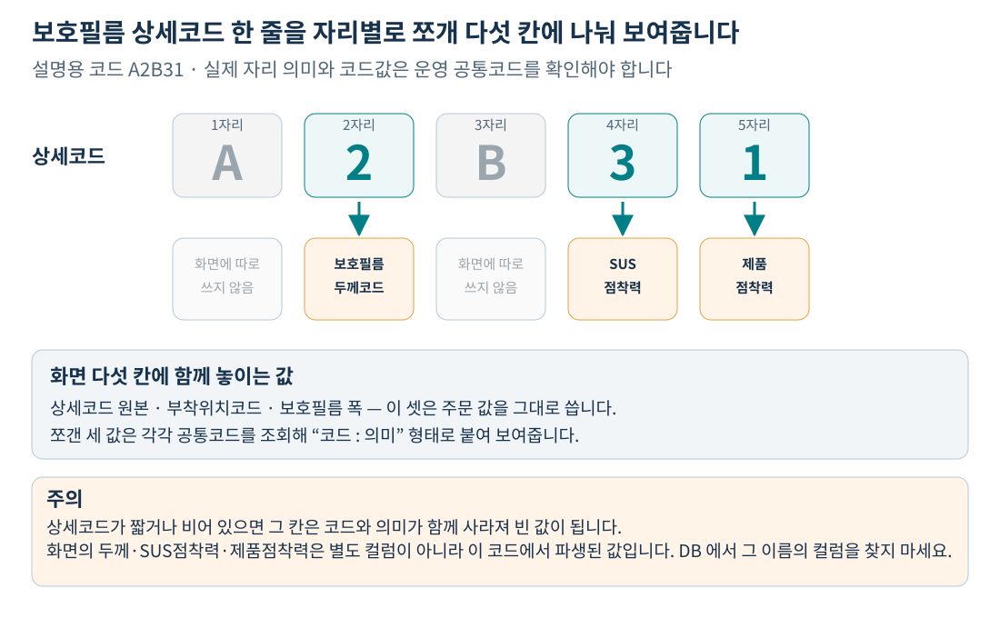

| 자리 | 화면 항목 | 공통코드 |
|---|---|---|
| 2번째 | 보호필름 두께코드 | `PTT_FLM_THK_CD` |
| 4번째 | SUS 점착력 | `PTT_FLM_SUS_ADH_CD` |
| 5번째 | 제품 점착력 | `PTT_FLM_PRD_ADH_CD` |

1번째와 3번째 자리는 이 화면에서 쓰지 않습니다. **두께·SUS점착력·제품점착력이라는 이름의 컬럼은 DB에 없습니다.** 이 코드에서 파생된 값이므로 DB에서 그 이름으로 찾으면 나오지 않습니다.

상세코드가 5자리보다 짧거나 비어 있으면 **그 칸은 코드와 의미가 함께 사라져 빈 값**이 됩니다. 잘라 낸 글자로 공통코드를 찾기 때문입니다. 반대로 자리는 있는데 그 값이 공통코드에 없으면 **의미 없이 코드만** 보입니다. 두께 칸만은 공통코드에서 코드와 의미를 함께 읽으므로 못 찾으면 통째로 빕니다.

### 5.2 관리점착력만 다른 표를 먼저 본다

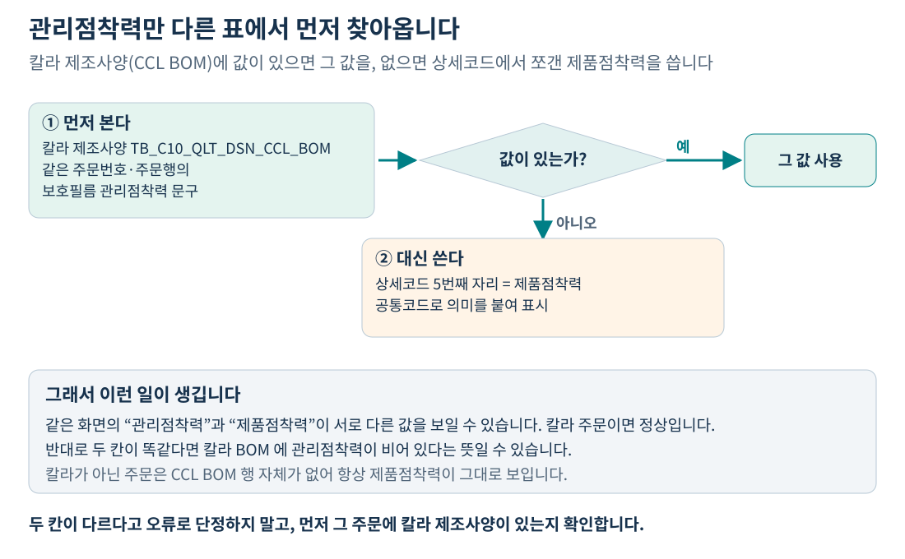

관리점착력은 **칼라 제조사양(`TB_C10_QLT_DSN_CCL_BOM`)의 보호필름 관리점착력 문구를 먼저 찾고**, 없으면 상세코드 5번째 자리의 제품점착력을 대신 씁니다. [근거 S1: 104~113행]

그래서 이런 일이 생깁니다.

- 관리점착력과 제품점착력이 **다르면** 칼라 BOM에 별도 문구가 있다는 뜻입니다. 정상입니다.
- 두 칸이 **같으면** 칼라 BOM에 관리점착력이 비어 있거나 칼라 주문이 아니라는 뜻입니다.
- 칼라가 아닌 주문은 BOM 행 자체가 없어 항상 제품점착력이 그대로 보입니다.

두 칸이 다르다고 오류로 단정하지 말고, 먼저 그 주문에 칼라 제조사양이 있는지 확인합니다.

### 5.3 화면 헤더와 실제 칸 수가 어긋난다

보호필름 그리드의 헤더는 **일곱 칸**(관리점착력·상세코드·부착위치·두께·폭·SUS점착력·제품점착력)을 선언하지만, 초기 행 정의에는 **다섯 칸**만 있습니다. 정전 그리드는 열 정의가 **열일곱 개**(주문번호·주문행번 두 개는 숨김)여서 화면에 보이는 헤더는 **열다섯 칸**인데, 초기 행 정의는 **열세 칸**입니다. [근거 S3]

초기 행은 데이터가 로드되면 대체되므로 화면 동작에는 대개 문제가 없습니다. 다만 그리드가 비어 있는 상태에서 셀 번호로 접근하는 코드가 있다면 어긋날 수 있으므로, 화면 개조 시 확인이 필요합니다.

## 6. 포장 블록: 한 칸에 두 표가 섞여 있다

포장 그리드는 두 칸입니다.

| 칸 | 값 | 편집 | 출처 |
|---|---|---|---|
| 포장방법 | `ORD_PAK_MTH` + 공통코드 의미 | 조회 | 설계공통(주문) |
| 포장메세지 | `PAK_MSG_CD` + **포장메세지 표의 문구** | 편집(콤보) | 설계공통 + 포장메세지 표 |

조회 SQL은 포장메세지코드와 포장메세지 표의 문구를 **이어 붙여 한 칸에 넣습니다.** 편집·저장 대상은 앞쪽 코드뿐입니다. 뒤에 붙은 문구는 다른 표에서 외부조인으로 읽어 온 값이고 이 화면은 그 표를 쓰지 않습니다. [근거 S1: 114~120행, 232~245행]

**포장메세지 표(`TB_C10_QLT_DSN_MSG_PKG`)에 INSERT 하는 코드는 이 저장소에 없습니다.** 조회에서만 참조합니다. 문구가 비어 보이면 그 표에 행이 없는 것이며, 이 화면이나 자동설계가 만들지 않습니다.

## 7. 저장은 어느 행을 바꾸나?

### 7.1 조회 한 행, 저장 세 행

조회는 제조구분 1만 보지만 저장 SQL의 WHERE에는 주문번호와 주문행만 있습니다. **제조구분 조건이 없어 적정·차선1·차선2 세 행이 함께 갱신됩니다.** [근거 S1: 169~170행]

이 동작이 곧 결함은 아닙니다. 후공정이 저장하는 일곱 항목은 자동설계 단계에서도 적정·차선이 같은 값을 갖도록 만들어집니다. 폭 단계가 구매반제품 차선에 대해 적정 값을 복사하는 것도 같은 이유입니다.

다만 **화면은 적정 값만 보여주므로 차선 행에 다른 값이 남아 있었다면 확인 없이 사라집니다.** 차선 행의 후공정 값을 조사할 때는 화면이 아니라 DB를 직접 봐야 합니다.

### 7.2 1T2C와 포장메세지는 주문 단위다

두 값은 설계공통 표에 있고 그 표는 주문번호·주문행이 키입니다. 애초에 제조구분이 없는 값이므로 적정·차선 구분이 존재하지 않습니다.

## 8. 저장 시 값을 지키는 규칙

### 8.1 조수와 조합폭1만 보호된다

저장 SQL은 두 컬럼에만 조건부 대입을 씁니다. [근거 S1: 155~156행]

| 컬럼 | S/T 유무 = Y | S/T 유무 ≠ Y |
|---|---|---|
| Slit 조수 | 화면 값으로 갱신 | **기존 DB 값 유지** |
| 조합폭1 | 화면 값으로 갱신 | **기존 DB 값 유지** |
| 조합폭 2~10 | 화면 값으로 갱신 | **화면 값으로 갱신 (보호 없음)** |
| S/T 유무 | 화면 값으로 갱신 | 화면 값으로 갱신 |
| 제품폭범위 하한·상한 | 화면 값으로 갱신 | 화면 값으로 갱신 |

여기서 판단 기준이 되는 S/T 유무는 **화면에서 넘어온 새 값**입니다. DB의 기존 값이 아닙니다.

### 8.2 여기서 생기는 어긋남

S/T가 N이면 화면의 조수·조합폭1 칸은 빈칸입니다. 그 상태로 저장해도 DB 값은 그대로 남습니다. 반면 조합폭 2~10은 화면에 보이는 값이 그대로 덮어써지고, 빈칸이면 빈 값이 들어갑니다.

**즉 S/T를 Y에서 N으로 바꾸고 저장하면 조합폭1은 살아남고 2~10은 지워질 수 있습니다.** 저장 전후로 열 개 칸을 함께 기록해 두면 어느 칸이 보호되고 어느 칸이 덮어써졌는지 바로 보입니다.

## 9. 저장 경로와 이력

### 9.1 세 경로가 서로 다른 표를 바꾼다

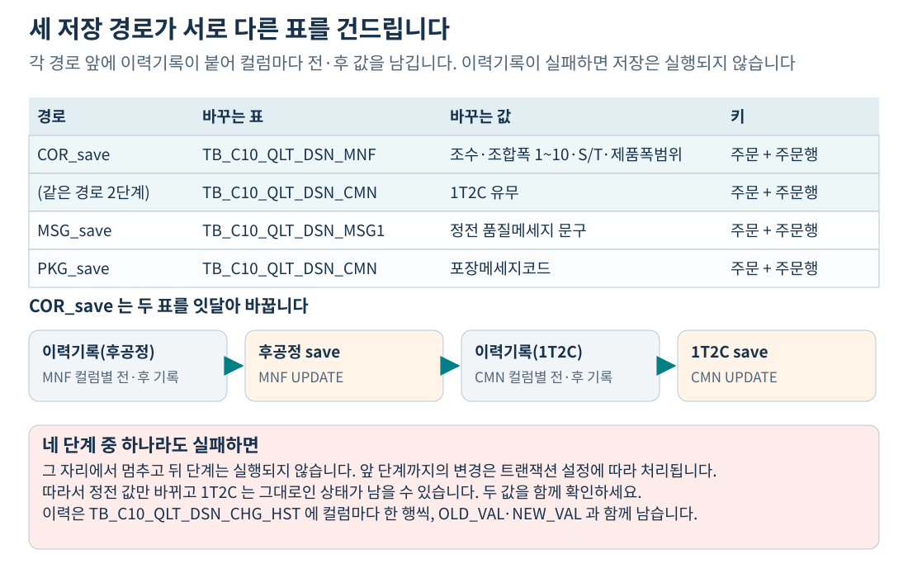

| 경로 | 바꾸는 표 | 바꾸는 값 |
|---|---|---|
| `COR_save` 1단계 | `TB_C10_QLT_DSN_MNF` | 조수·조합폭 1~10·S/T·제품폭범위 |
| `COR_save` 2단계 | `TB_C10_QLT_DSN_CMN` | 1T2C 유무 |
| `MSG_save` | `TB_C10_QLT_DSN_MSG1` | 정전 품질메세지 |
| `PKG_save` | `TB_C10_QLT_DSN_CMN` | 포장메세지코드 |

`COR_save`는 네 단계 체인입니다. 이력기록(후공정) → 후공정 save → 이력기록(1T2C) → 1T2C save 순서입니다. [근거 S2: 45~52행 라우터, 11~32행 이력기록 전이, 84~96행 save 전이]

**네 단계 중 하나라도 실패하면 그 자리에서 멈추고 뒤 단계는 실행되지 않습니다.** 정전 값만 바뀌고 1T2C는 그대로인 상태가 남을 수 있으므로 두 값을 함께 확인합니다.

### 9.2 이력은 컬럼 단위로 전·후 값이 남는다

세 경로 모두 앞에 이력기록 액티비티(`C104000020ChgHstActivity`)가 붙습니다. 이 액티비티는 저장 직전 DB 값을 읽어 화면 값과 비교하고, **달라진 컬럼마다 한 행씩** 변경 이력 표에 넣습니다. [근거 S11: 71~72행, 83~85행, 350~371행]

기록되는 항목은 다음과 같습니다.

| 컬럼 | 값 |
|---|---|
| `CHG_TXT` | 화면 ID + 탭 ID를 이어 붙인 문자열 (후공정이면 `C104000020TAB09`) |
| `TARGET_TABLE_NM` | 바뀐 표 이름 |
| `TARGET_PK_INFO` | 그 행의 키 |
| `COLUMN_NM` | 바뀐 컬럼 이름 |
| `OLD_VAL` / `NEW_VAL` | 변경 전·후 값 (각각 4,000바이트로 자름) |

**따라서 어떤 값이 무엇에서 무엇으로 바뀌었는지는 이 표 하나로 추적됩니다.** 앞의 두 탭에 있는 별도 수정로그 표(`TB_C10_QLT_DSN_MNF_MDF_LOG`)가 후공정 탭에는 없지만, 그 표는 원자재·PLTCM 몇 항목만 담으므로 추적 범위는 오히려 변경 이력 표 쪽이 넓습니다. [근거 S12: 12~56행]

**주의할 점이 하나 있습니다.** 후공정 쿼리 파일에는 `C104000020TAB09.CHG_HSTinsert`라는 이력 INSERT 문이 따로 정의되어 있고, 변경 내역 칸에 화면 이름 문자열만 넣습니다. 그러나 **이 SQL은 서비스에서 호출되지 않습니다.** 정의만 남은 구버전이므로, 이 문을 근거로 “이력에 값이 안 남는다”고 읽으면 안 됩니다. [근거 S1: 197~231행 미사용 정의]

## 10. 확정주문 검사가 실행되지 않는다

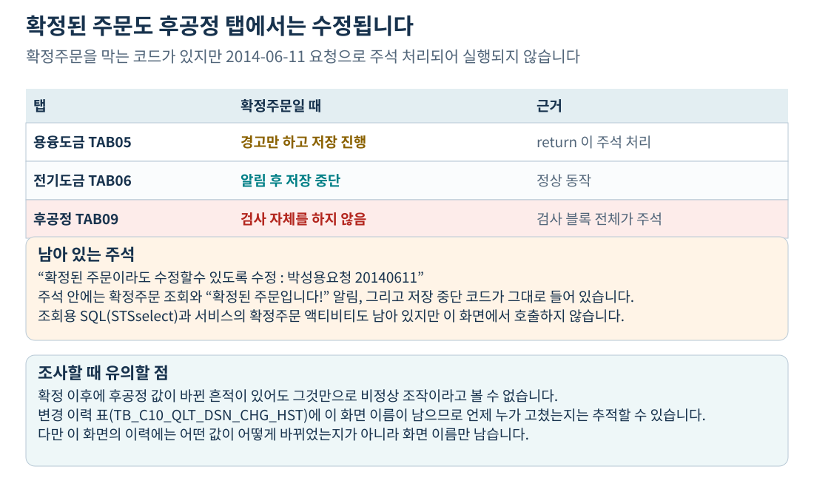

후공정 탭에는 확정주문을 막는 코드가 **주석으로만 남아 있습니다.** 주석에는 다음 문구가 붙어 있습니다.

> 확정된 주문이라도 수정할수 있도록 수정 : 박성용요청 20140611

주석 안에는 확정주문 조회, “확정된 주문입니다!” 알림, 저장 중단 코드가 그대로 들어 있습니다. 조회용 SQL(`STSselect`)과 서비스의 확정주문 액티비티도 남아 있지만 이 화면에서 호출하지 않습니다. [근거 S4: 112~122행, S1: 187~196행, S2: 33~37행]

세 탭을 비교하면 처리가 모두 다릅니다.

| 탭 | 확정주문일 때 |
|---|---|
| 용융도금 | 경고만 하고 저장 진행 (중단 코드가 주석) |
| 전기도금 | 알림 후 저장 중단 |
| 후공정 | **검사 자체를 하지 않음** |

확정 이후에 후공정 값이 바뀐 흔적이 있어도 그것만으로 비정상 조작이라고 볼 수 없습니다. 변경 이력 표에 화면 이름이 남으므로 언제 고쳤는지는 추적할 수 있습니다.

## 11. 값이 비어 보일 때 이 순서로 좁힌다

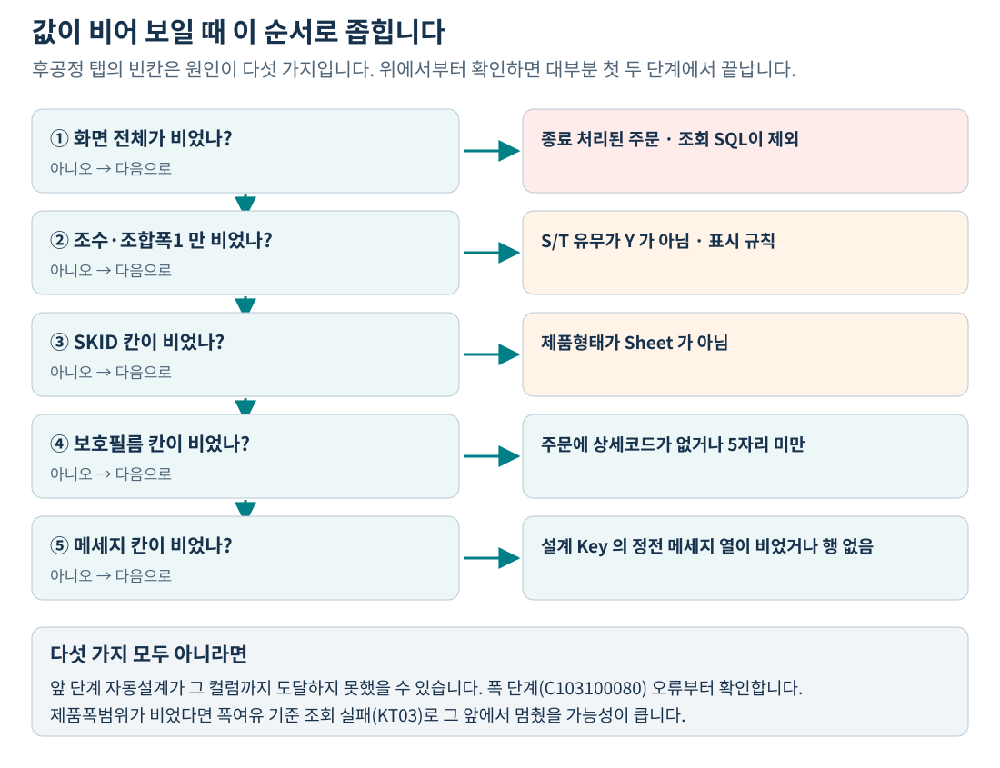

| 확인 순서 | 증상 | 원인 |
|---|---|---|
| ① | 화면 전체가 빔 | 종료 처리된 주문. 조회 SQL이 제외 |
| ② | 조수·조합폭1만 빔 | S/T 유무가 Y가 아님. 표시 규칙 |
| ③ | SKID 칸이 빔 | 제품형태가 Sheet가 아님 |
| ④ | 보호필름 칸이 빔 | 주문에 상세코드가 없거나 5자리 미만 |
| ⑤ | 메세지 칸이 빔 | 설계 Key의 정전 메세지 열이 비었거나 행이 없음 |

다섯 가지 모두 아니라면 앞 단계 자동설계가 그 컬럼까지 도달하지 못했을 수 있습니다. 제품폭범위가 비었다면 폭여유 기준 조회 실패(KT03)로 폭 단계 앞에서 멈췄을 가능성이 큽니다. [근거 S6]

## 12. 정전 품질메세지는 어느 표에 있나?

### 12.1 “품질메세지”라는 이름의 표가 셋이다

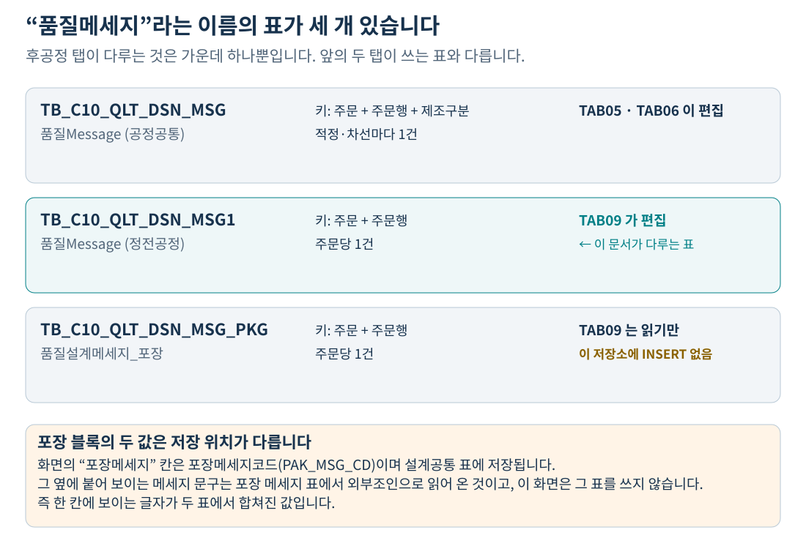

| 표 | 뜻 | 키 | 건수 | 편집 주체 |
|---|---|---|---|---|
| `TB_C10_QLT_DSN_MSG` | 품질Message (공정공통) | 주문 + 주문행 + 제조구분 | 적정·차선마다 1건 | 용융도금·전기도금 탭 |
| `TB_C10_QLT_DSN_MSG1` | 품질Message (정전공정) | 주문 + 주문행 | 주문당 1건 | **후공정 탭** |
| `TB_C10_QLT_DSN_MSG_PKG` | 품질설계메세지_포장 | 주문 + 주문행 | 주문당 1건 | 후공정 탭은 읽기만 |

후공정 탭이 편집하는 것은 가운데 하나입니다. 앞의 두 탭이 쓰는 표와 다르므로, **후공정에서 메세지를 고쳐도 앞 탭의 메세지는 바뀌지 않습니다.**

### 12.2 정전 메세지는 어디서 만들어지나

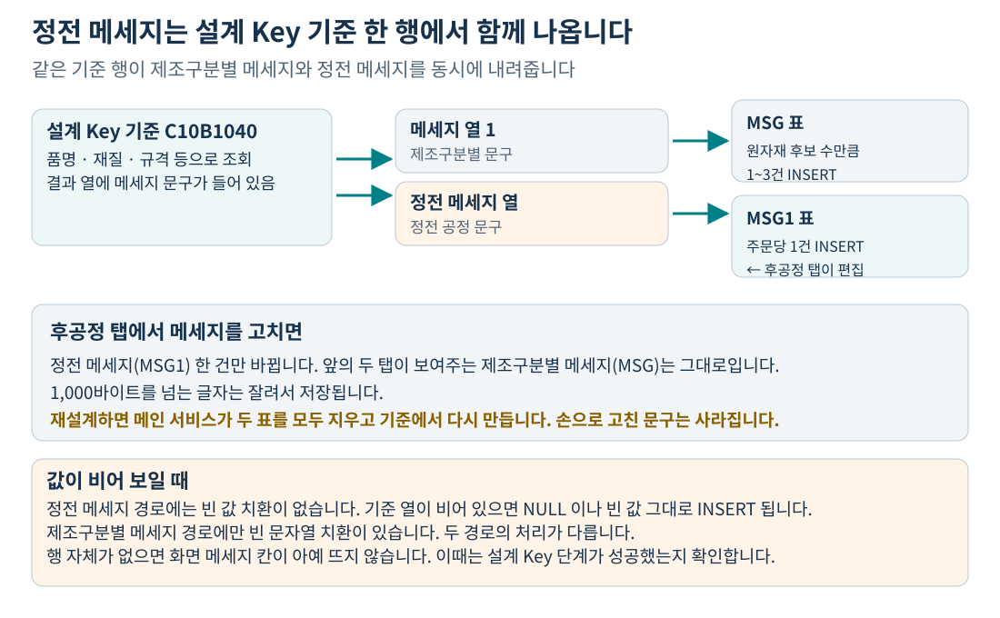

설계 Key 단계(`DbSearchQualKeyMatch`)가 업무기준 `C10B1040`을 조회하면 결과 행에 메세지 열이 두 종류 들어 있습니다. [근거 S7: 516~517행, 524~590행]

- 제조구분별 메세지 → 원자재 후보 수만큼 `MSG` 표에 INSERT
- 정전 메세지 → 주문당 1건 `MSG1` 표에 INSERT

정전 메세지 열이 비어 있어도 **행은 INSERT 됩니다.** 다만 이 경로에는 빈 값을 빈 문자열로 바꾸는 처리가 없어 기준값이 그대로 들어갑니다. 문구가 NULL이거나 빈 값인 행이 생길 수 있습니다.

**코드 경로는 두 갈래로 다릅니다.** 제조구분별 메세지 경로는 값이 없으면 빈 문자열을 넣지만, 정전 메세지 경로는 기준값을 그대로 넘깁니다. 다만 **Oracle은 빈 문자열을 NULL로 저장하므로 결과는 구분되지 않습니다.** 두 경로 모두 문구 칸이 비게 됩니다. [근거 S7: 529~552행 치환 있음, 574~590행 치환 없음]

행 자체가 없으면 화면 메세지 칸이 뜨지 않습니다. 이때는 설계 Key 단계가 성공했는지 확인합니다.

### 12.3 저장 시 길이 제한

메세지 저장 SQL은 1,000바이트를 넘으면 잘라서 저장합니다. 앞의 두 탭과 같은 규칙입니다. [근거 S1: 173~186행]

**재설계하면 메인 서비스가 메세지 표를 지우고 기준에서 다시 만듭니다.** 손으로 고친 문구는 사라집니다.

## 13. 폭 값 네 가지를 구별한다

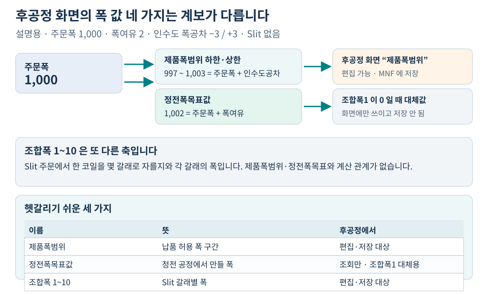

| 이름 | 뜻 | 만들어지는 곳 | 후공정에서 |
|---|---|---|---|
| 제품폭범위 하한·상한 | 납품 허용 폭 구간 | 주문폭 + 인수도 폭공차 | 편집·저장 |
| 정전폭목표값 | 정전 공정에서 만들 폭 | 주문폭(또는 조합폭 합) + 폭여유 | 조회만 |
| 조합폭 1~10 | Slit 갈래별 폭 | 주문 Slit 정보 | 편집·저장 |
| SKID 폭 | 적재 받침 치수 | 조회 SQL이 그때 계산 | 조회만 |

**제품폭범위와 정전폭목표값은 계산식이 다릅니다.** 하나는 인수도 공차를 더하고 다른 하나는 폭여유를 더합니다. 조합폭은 또 다른 축이며 이 둘과 계산 관계가 없습니다. [근거 S6: 338~342행, S8]

정전폭목표값은 화면에 자기 칸이 없습니다. 조합폭1이 0일 때만 그 자리에 대신 나타납니다.

## 14. 실제 주문의 후공정 값을 추적하는 순서

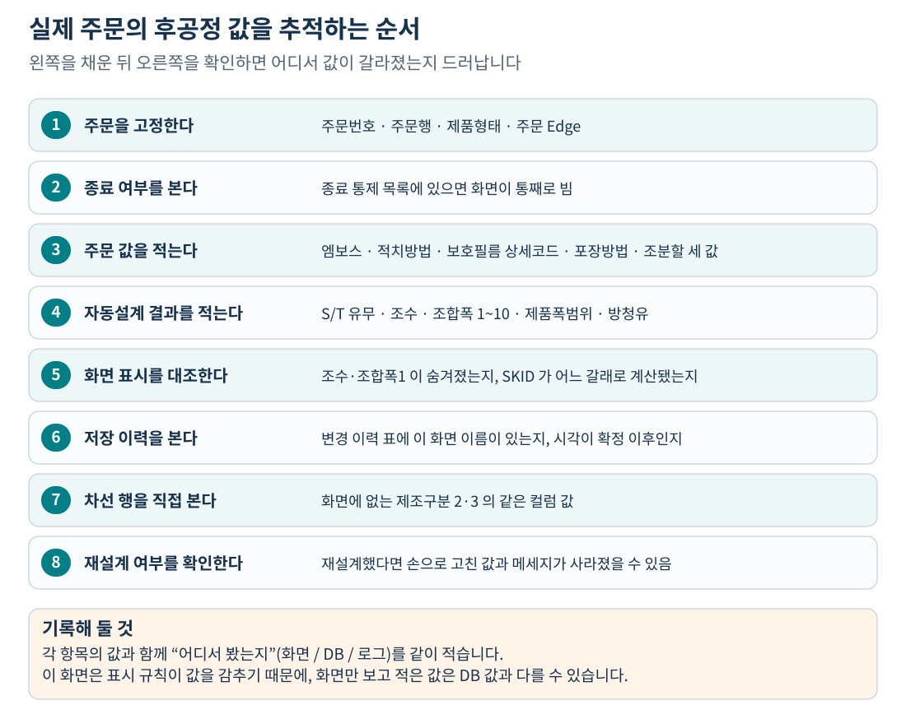

1. **주문을 고정한다.** 주문번호·주문행·제품형태·주문 Edge를 적습니다.
2. **종료 여부를 본다.** 종료 통제 목록에 있으면 화면이 통째로 빕니다.
3. **주문 값을 적는다.** 엠보스·적치방법·보호필름 상세코드·포장방법·조분할 세 값입니다.
4. **자동설계 결과를 적는다.** S/T 유무·조수·조합폭 1~10·제품폭범위·방청유입니다.
5. **화면 표시를 대조한다.** 조수·조합폭1이 숨겨졌는지, SKID가 어느 갈래로 계산됐는지 확인합니다.
6. **저장 이력을 본다.** 변경 이력 표에 이 화면 이름이 있는지, 시각이 확정 이후인지 봅니다.
7. **차선 행을 직접 본다.** 화면에 없는 제조구분 2·3의 같은 컬럼 값입니다.
8. **재설계 여부를 확인한다.** 재설계했다면 손으로 고친 값과 메세지가 사라졌을 수 있습니다.

각 항목의 값과 함께 **어디서 봤는지(화면 / DB / 로그)**를 같이 적습니다. 이 화면은 표시 규칙이 값을 감추기 때문에, 화면만 보고 적은 값은 DB 값과 다를 수 있습니다.

| 확인 항목 | 화면에서 본 값 | DB에서 본 값 |
|---|---|---|
| S/T 유무 | | |
| Slit 조수 | | |
| 조합폭 1~10 | | |
| 제품폭범위 하한·상한 | | |
| 1T2C 유무 | | |
| SKID 폭·길이 | | (계산값이라 DB에 없음) |
| 보호필름 관리점착력 | | (칼라 BOM 확인) |
| 정전 품질메세지 | | |
| 포장메세지코드 | | |

# 부록 A. 조회·저장 SQL 한눈에 보기

| SQL ID | 역할 | 대상 표 | 키 |
|---|---|---|---|
| `C104000020TAB09_MNF.select` | 정전·후처리·보호필름·포장 조회 | MNF + CMN + MSG_PKG 조인 | 주문 + 주문행 + 제조구분 1 |
| `C104000020TAB09_MSG.select` | 정전 품질메세지 조회 | MSG1 | 주문 + 주문행 |
| `C104000020TAB09.MNFupdate` | 정전 값 저장 | MNF | 주문 + 주문행 (**제조구분 없음**) |
| `C104000020TAB09.CMN.OT_TC_YN_update` | 1T2C 저장 | CMN | 주문 + 주문행 |
| `C104000020TAB09.MSGupdate` | 정전 메세지 저장 | MSG1 | 주문 + 주문행 |
| `C104000020TAB09.PKG_MSGupdate` | 포장메세지코드 저장 | CMN | 주문 + 주문행 |
| `C104000020TAB09.CHG_HSTinsert` | 구버전 이력 INSERT | CHG_HST | **화면·서비스에서 호출하지 않음** |
| `C104000020TAB09.STSselect` | 확정주문 조회 | CMN | **화면에서 호출하지 않음** |
| `C104000020CHG_HST.insert` | 실제 변경 이력 기록 | CHG_HST | 주문 + 주문행 + 순번 (컬럼마다 1행) |

# 부록 B. 화면에서 쓰는 공통코드

| 화면 항목 | 공통코드 이름 | 비고 |
|---|---|---|
| S/T 유무 | `CUT_LN_YN` | 컬럼명·화면명과 모두 다름 |
| 1T2C 유무 | `OT_TC_YN` | |
| 포장메세지 | `PAK_MSG_CD` | 콤보 목록 |
| 엠보스무늬 | `EMBS_CD` | 조회 SQL이 의미 붙임 |
| SHEET 적치방법 | `ORD_SHT_LOD_MTH` | |
| 방청유 | `OIL_PNT_CD` | |
| 보호필름 부착위치 | `ORD_PTT_FLM_ADH_LOC_CD` | |
| 보호필름 두께 | `PTT_FLM_THK_CD` | 상세코드 2번째 자리 |
| 보호필름 SUS 점착력 | `PTT_FLM_SUS_ADH_CD` | 상세코드 4번째 자리 |
| 보호필름 제품 점착력 | `PTT_FLM_PRD_ADH_CD` | 상세코드 5번째 자리 |
| 포장방법 | `ORD_PAK_MTH` | |

**읽는 경로는 두 갈래입니다.** 위 표에서 콤보로 표시한 세 항목(`CUT_LN_YN`·`OT_TC_YN`·`PAK_MSG_CD`)은 화면이 `basicLovData.do`로 `lov-service`를 호출하고, 그 SQL(`lovcode.select`)이 `TB_M00_CATEGORY_GR`·`TB_M00_CODES020`·`TB_M00_CODES030`을 조인해 목록을 만듭니다. 나머지 여덟 항목은 조회 SQL이 직접 `M00APUSER.VI_M00_CODE_ACCESS`를 조회해 이름을 붙입니다. 두 경로 모두 코드 그룹은 `SZ0000`으로 같습니다. [근거 S1: 26~45행, 83~118행, S4: 176행, 182행, 267행]

# 부록 C. 혼동하기 쉬운 설명 대조표

| 혼동할 수 있는 설명 | 현재 실행 코드에 맞춘 설명 |
|---|---|
| 화면이 비면 설계가 실패한 것 | 종료주문이면 설계와 무관하게 전체가 빈다 |
| 조수가 비면 DB 조수가 0 | S/T 유무가 Y가 아니면 값이 있어도 빈칸 |
| 조합폭 열 칸이 같은 규칙 | 1번만 보호·대체 규칙이 있고 2~10은 다름 |
| 후공정 저장은 적정만 바꾼다 | 제조구분 조건이 없어 세 행을 함께 바꾼다 |
| SKID는 저장된 치수 | 조회할 때마다 계산하며 DB 컬럼이 없다 |
| SKID 폭은 주문폭 | 폭·길이 중 작은 값이 폭이다 |
| 보호필름 두께는 별도 컬럼 | 상세코드 2번째 자리에서 파생된 값 |
| 관리점착력과 제품점착력은 같은 값 | 칼라 BOM에 문구가 있으면 다르다 |
| 후공정 메세지는 앞 탭과 같은 표 | 정전 전용 표(MSG1)로 따로 관리된다 |
| 포장메세지 문구도 이 화면이 저장 | 저장 대상은 코드뿐이며 문구는 다른 표 |
| 확정주문은 수정할 수 없다 | 후공정 탭은 검사 자체를 하지 않는다 |
| 후공정 탭도 수정로그 표(`MNF_MDF_LOG`)에 전후를 남긴다 | 수정로그 표는 없지만 변경 이력 표에 컬럼별 전후 값이 남는다 |

# 부록 D. 코드 근거와 재현 범위

## D.1 핵심 코드 위치

행 번호는 현재 로컬 소스 기준입니다. 코드 파일을 수정하면 달라질 수 있습니다.

| ID | 파일 | 확인한 부분 |
|---|---|---|
| S1 | [C104000020TAB09-query.glue_sql](../../src/query/C104000020TAB09-query.glue_sql) | 10~14 조수·조합폭1 표시, 15~23 조합폭 2~10, 24 S/T 유무, 51~53 조분할, 54~81 SKID, 82~103 보호필름 파싱, 104~113 관리점착력, 114~120 포장, 121~130 조인·종료필터, 133~144 메세지 조회·종료필터, 146~171 MNFupdate, 155~156 조수·조합폭1 보호, 169~170 WHERE, 173~186 MSGupdate, 187~196 STSselect, 197~231 이력 INSERT, 232~245 포장메세지, 246~259 1T2C |
| S2 | [C104000020TAB09-service.xml](../../src/service/C104000020TAB09-service.xml) | 11~21 이력기록(후공정), 22~32 이력기록(1T2C), 33~37 확정주문 액티비티, 45~52 라우터 분기, 84~89 1T2C save, 90~97 후공정 save |
| S3 | [Grid_1](../../WebContents/header/kr/C104000020TAB09/C104000020TAB09_Grid_1.xml) · [Grid_2](../../WebContents/header/kr/C104000020TAB09/C104000020TAB09_Grid_2.xml) · [Grid_3](../../WebContents/header/kr/C104000020TAB09/C104000020TAB09_Grid_3.xml) · [Grid_5](../../WebContents/header/kr/C104000020TAB09/C104000020TAB09_Grid_5.xml) | 열 정의·편집 가능 여부·초기 행 칸 수 |
| S4 | [C104000020TAB09.jsp](../../WebContents/C104000020TAB09.jsp) | 62~88 조회, 90~151 저장 판단, 112~122 확정주문 주석, 176행·182행 콤보(CUT_LN_YN·OT_TC_YN), 267행 콤보(PAK_MSG_CD), 194~204 정전 콜백, 243~256 메세지 콜백, 279~287 포장 콜백 |
| S5 | [DbSearchMnfData.java](../../src/com/unionsteel/mes/c10/activity/nui/DbSearchMnfData.java) | 304~344 도유코드(C10B2170) 품명 C·1 한정 |
| S6 | [DbSearchWthSizeData.java](../../src/com/unionsteel/mes/c10/activity/nui/DbSearchWthSizeData.java) | 330~335 폭여유 실패(KT03), 338~342 제품폭범위, 343~395 Slit·조합폭 |
| S7 | [DbSearchQualKeyMatch.java](../../src/com/unionsteel/mes/c10/activity/nui/DbSearchQualKeyMatch.java) | 516~517 메세지 열 추출, 524~572 제조구분별 INSERT, 574~590 정전 메세지 INSERT |
| S8 | [적정·차선 원자재 폭설계 해설서](적정_차선_원자재_폭설계_쉽게이해하기.html) | 정전폭목표값·조합폭 산식의 상세 설명 |
| S9 | [C102100MSG-query.glue_sql](../../src/query/C102100MSG-query.glue_sql) | MSG·MSG1 INSERT 구조 |
| S10 | [C102100000-service.xml](../../src/service/C102100000-service.xml) | 재설계 시 메세지 표 삭제 경로 |
| S11 | [C104000020ChgHstActivity.java](../../src/com/unionsteel/mes/c10/activity/ui/C104000020ChgHstActivity.java) | 71~72 실제 SQL 키, 83~85 CHG_TXT 구성, 350~371 컬럼 단위 INSERT |
| S12 | [C104000020CHG_HST-query.glue_sql](../../src/query/C104000020CHG_HST-query.glue_sql) | 3~11 순번 조회, 12~56 COLUMN_NM·OLD_VAL·NEW_VAL INSERT |

## D.2 확인한 것과 운영 확인이 필요한 것

**확인한 것:** 조회 SQL의 표시 규칙과 조인 구조, 종료주문 필터, SKID 세 갈래 계산, 보호필름 상세코드 파싱과 관리점착력 우선순위, 저장 SQL의 조건부 대입과 제조구분 조건 부재, 저장 체인과 이력 기록 위치, 확정주문 검사 주석 처리, 정전 메세지의 생성 경로, 세 메세지 표의 구분.

**운영에서 확인할 것:** 종료 통제 목록에 실제로 걸리는 주문의 범위, 포장메세지 표를 채우는 시스템, 공통코드 그룹의 실제 코드값과 의미, S/T를 N으로 바꿔 저장했을 때 조합폭 2~10이 지워지는 현상의 재현, 확정주문 수정 이력의 실제 발생 빈도, 차선 행에 서로 다른 후공정 값이 남아 있는 사례.

문서 빌드와 검증 방법은 [README.md](post-proc-guide-assets/README.md)에 있습니다. 검증은 코드에서 확인한 규칙을 설명용 입력에 적용한 것으로, **GLUE/Java 전체 실행이나 운영 DB와 연결한 주문별 검증은 아닙니다.**

# 함께 읽기

- [용융·전기 제조표준 설계 분석서](용융_전기_제조표준_설계_쉽게이해하기.html)
- [적정·차선 원자재 폭설계 분석서](적정_차선_원자재_폭설계_쉽게이해하기.html)
- [품질메세지 설계 분석서](품질메세지_설계_쉽게이해하기.html) — 이 화면의 정전 메세지와 포장메세지가 만들어지는 경로
- [성분설계 분석서](성분설계_쉽게이해하기.html)
- [재질설계 분석서](재질설계_쉽게이해하기.html)
- [인수도설계 분석서](인수도설계_쉽게이해하기.html)
