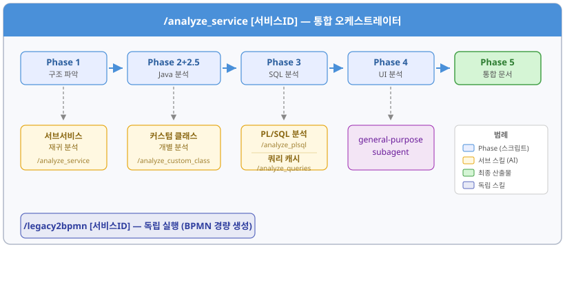
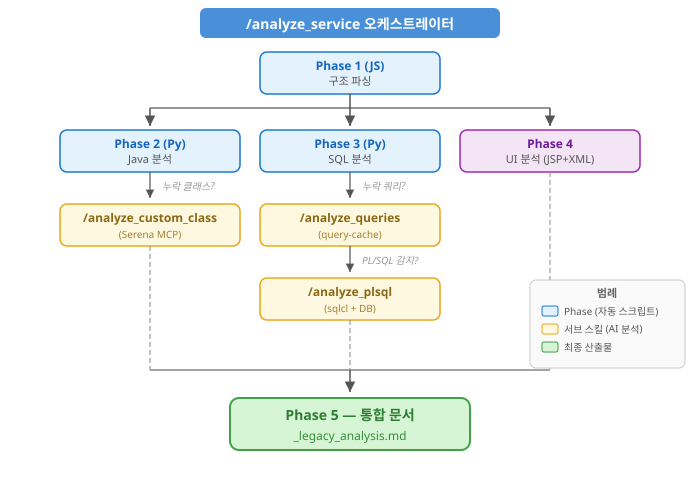

# M47 MES 레거시 분석 스킬 종합 가이드

> **작성일**: 2026-02-13
> **대상 독자**: M47 MES 프로젝트 팀원
> **목적**: Claude Code 기반 레거시 분석 자동화 스킬의 이해 및 활용

---

## 목차

1. [개요](#1-개요)
2. [스킬 전체 구성도](#2-스킬-전체-구성도)
3. [analyze-service — 서비스 통합 분석](#3-analyze-service--서비스-통합-분석)
4. [analyze-custom-class — Java 클래스 분석](#4-analyze-custom-class--java-클래스-분석)
5. [analyze-plsql — PL/SQL 분석](#5-analyze-plsql--plsql-분석)
6. [analyze-queries — SQL 쿼리 분석](#6-analyze-queries--sql-쿼리-분석)
7. [legacy2bpmn — BPMN 워크플로우 생성](#7-legacy2bpmn--bpmn-워크플로우-생성)
8. [스킬 간 관계 및 데이터 흐름](#8-스킬-간-관계-및-데이터-흐름)
9. [산출물 현황](#9-산출물-현황)
10. [출력 디렉토리 구조](#10-출력-디렉토리-구조)
11. [사용 시 주의사항](#11-사용-시-주의사항)
12. [FAQ](#12-faq)

---

## 1. 개요

### 왜 만들었는가?

M47 MES는 GLUE Framework 기반의 대규모 레거시 시스템으로, 서비스 XML → Java Activity 체인 → SQL 쿼리 → JSP UI로 이어지는 복잡한 구조를 가지고 있습니다. 이 시스템을 현대화하거나 유지보수하려면 각 서비스의 비즈니스 로직, 데이터 흐름, UI 구조를 정확히 이해해야 합니다.

수동으로 분석하면 서비스 1건당 수 시간이 걸리는 작업을 Claude Code의 AI 분석 스킬로 자동화하여 **서비스 1건당 약 5~15분** 이내에 종합 분석 보고서를 생성합니다.

### 스킬이란?

Claude Code에서 `/명령어` 형태로 실행하는 자동화된 분석 워크플로우입니다. 각 스킬은 `.claude/skills/` 디렉토리에 정의되어 있으며, SKILL.md(실행 정의), references(상세 지침), scripts(자동화 스크립트), templates(보고서 템플릿)로 구성됩니다.

### 사용하는 외부 도구

| 도구 | 역할 | 용도 |
|------|------|------|
| **Serena MCP** | Java/XML 심볼 분석 | 클래스 구조, 메소드 시그니처, 파일 검색 |
| **sqlcl MCP** | Oracle DB 접속 | PL/SQL 소스 추출, 테이블 구조 조회 |
| **Sequential Thinking MCP** | 심층 로직 분석 | PL/SQL 프로시저 단계별 분석 |
| **query-cache** | SQL 쿼리 캐싱 | .glue_sql 파일 파싱 및 분석 결과 캐시 |

---

## 2. 스킬 전체 구성도



<details>
<summary>텍스트 버전 (접기/펼치기)</summary>

```
┌─────────────────────────────────────────────────────────────────┐
│                    /analyze-service [서비스ID]                    │
│                    (통합 오케스트레이터)                             │
│                                                                  │
│  Phase 1 ─→ Phase 2+2.5 ─→ Phase 3 ─→ Phase 4 ─→ Phase 5      │
│  구조파악      Java분석       SQL분석     UI분석     통합문서      │
│                                                                  │
│   ┌──────────┐  ┌──────────┐  ┌──────────┐  ┌──────────┐       │
│   │서브서비스  │  │커스텀클래스│  │PL/SQL    │  │쿼리캐시  │       │
│   │재귀 분석  │  │개별 분석  │  │자동 분석  │  │배치 분석  │       │
│   └──────────┘  └──────────┘  └──────────┘  └──────────┘       │
│        ↓              ↓              ↓              ↓            │
│   /analyze-service  /analyze_     /analyze_     /analyze_        │
│   (재귀호출)       custom_class     plsql        queries         │
└─────────────────────────────────────────────────────────────────┘

  /legacy2bpmn [서비스ID]  ← 독립 실행 (BPMN 파일만 경량 생성)
```

</details>

---

## 3. analyze-service — 서비스 통합 분석

### 한줄 요약
GLUE 서비스 XML을 기반으로 **구조 → Java → SQL → UI → 통합 문서**를 자동 생성하는 메인 분석 스킬

### 사용법

```bash
# 전체 분석 (Phase 1~5 순차 실행)
/analyze-service M473020030

# 강제 재실행 (기존 중간 결과 무시)
/analyze-service M473020030 --force
```

> **개별 Phase 실행**: 개별 Phase는 별도의 독립 스킬/커맨드가 아닙니다. Claude에게 "Phase 3만 실행해줘"와 같이 요청하면, analyze-service 스킬 내부의 해당 Phase 지침(`references/phase1~5.md`)을 참조하여 실행합니다.

### Phase별 상세

#### Phase 1: 구조 파악
- **입력**: `src/service/{SERVICE-ID}-service.xml`
- **처리**: Service XML 파싱, Activity 목록/타입 분류, SQL Key 추출
- **출력**: `{SERVICE-ID}_structure.json`
- **실행 도구**: `node .claude/skills/analyze-service/scripts/phase1-analyzer.js`

Activity 타입 분류 기준:
| 타입 | 판단 기준 | 예시 |
|------|----------|------|
| framework | GLUE 프레임워크 기본 클래스 | `com.poscoict.glue.activity.InitActivity` |
| common | 패키지 경로에 `.common.` 포함 | `com.unionsteel.mes.m47.activity.common.M47CheckUtil` |
| custom | `com.unionsteel.mes`로 시작 (common 제외) | `com.unionsteel.mes.m47.activity.ui.M47CoilInsAct` |

#### Phase 2+2.5: Java 심층 분석
- **입력**: structure.json의 customActivities 목록
- **처리**: 각 커스텀 Java 클래스의 비즈니스 로직, SQL 매핑, 예외 처리 분석
- **출력**: `{SERVICE-ID}_java_analysis.json`
- **실행 도구**: `python3 .claude/skills/analyze-service/scripts/phase2-generator.py`
- **핵심 전략**: "없으면 분석, 있으면 사용" — 기존 class_analysis.md가 있으면 재활용

**Fast Path 흐름**:
```
phase2-generator.py 실행
  ├─ exit 0 → java_analysis.json 생성 완료 ✅
  ├─ exit 2 → 누락 클래스 있음 → /analyze-custom-class 호출 → 재실행
  └─ exit 1 → 오류 ❌
```

#### Phase 3: SQL 쿼리 분석
- **입력**: structure.json + java_analysis.json의 SQL Key 목록
- **처리**: 쿼리 원문 조회(query-cache), 분석, PL/SQL 호출 감지
- **출력**: `{SERVICE-ID}_sql_analysis.json`
- **실행 도구**: `python3 .claude/skills/analyze-service/scripts/phase3-generator.py`
- **핵심 전략**: query-cache 캐시 히트 시 수 초 내 완료

**분석 항목**: 쿼리 타입, 테이블, 컬럼, JOIN 관계, 파라미터, 비즈니스 목적, ER 관계

#### Phase 4: UI 컴포넌트 분석
- **입력**: `WebContents/{SERVICE-ID}.jsp` + XML 컴포넌트 파일
- **처리**: Layout 구조, Form 필드, Grid 컬럼, 이벤트 핸들러 분석
- **출력**: `{SERVICE-ID}_ui_analysis.json`
- **참고**: JSP 없는 배치 서비스는 자동 스킵 (빈 JSON 생성)

**분석 대상 컴포넌트**:
| 파일 패턴 | 컴포넌트 | 내용 |
|----------|---------|------|
| `{ID}_Form_*.xml` | Form | 입력 필드(text, calendar, combo 등) |
| `{ID}_Grid_*.xml` | Grid | 데이터 테이블(컬럼, 편집 속성) |
| `{ID}_Tabbar_*.xml` | Tabbar | 탭 구조 |
| `{ID}_Menu_*.xml` | Menu | 메뉴(버튼) 정의 |

#### Phase 5: 통합 문서 생성
- **입력**: Phase 1~4의 모든 JSON + 커스텀 클래스/서브서비스 보고서
- **처리**: 템플릿 기반 종합 마크다운 문서 작성
- **출력**: `{SERVICE-ID}_legacy_analysis.md`
- **항상 재생성**: 중간 JSON이 갱신될 수 있으므로 매 실행마다 새로 작성

**최종 보고서에 포함되는 내용**:
1. 시스템 개요 (서비스 ID, Activity 수, 분석 시각)
2. 비즈니스 프로세스 분석 (Mermaid 워크플로우 다이어그램)
3. 주요 유즈케이스 (UC-01, UC-02, ... 최소 3개)
4. Java 컴포넌트 분석 (커스텀 클래스별 비즈니스 로직)
5. 데이터 요구사항 (SQL 쿼리 분석, ER 다이어그램)
6. 사용자 인터페이스 요구사항 (Layout, Form, Grid)
7. 서브서비스 (존재 시)
8. PL/SQL 함수/프로시저 (감지 시)

### Step 6.5: PL/SQL 자동 분석
Phase 5 완료 후, `sql_analysis.json`에서 미분석(`analyzed: false`) PL/SQL 오브젝트를 자동 감지하여:
1. DB 1회 접속으로 소스 일괄 조회
2. 순차적으로 분석 보고서 생성
3. sql_analysis.json 갱신
4. 최종 보고서에 분석 링크 추가

### 서브서비스 재귀 분석
서비스가 다른 서비스를 호출하는 경우(subServices 배열), 미분석 서브서비스에 대해 `/analyze-service`를 재귀 호출합니다. 이미 분석된 서브서비스는 자동 스킵됩니다.

---

## 4. analyze-custom-class — Java 클래스 분석

### 한줄 요약
개별 Java 클래스의 비즈니스 로직을 Serena MCP로 심층 분석하여 Markdown + JSON 보고서 생성

### 사용법

```bash
# 클래스명으로 지정 (자동 검색)
/analyze-custom-class M47CoilInsActErrorCheck

# 전체 경로 지정
/analyze-custom-class src/com/unionsteel/mes/m47/activity/ui/M47CoilInsActErrorCheck.java

# 복수 클래스 분석
/analyze-custom-class M47CoilInsActErrorCheck, M47CoilInsActDataChange

# 패키지 전체 분석
/analyze-custom-class src/com/unionsteel/mes/m47/activity/nui/smart 모두 분석해
```

### 분석 항목

| 항목 | 설명 |
|------|------|
| 클래스 구조 | 패키지, 상속/구현 관계, 멤버 변수, 상수 |
| 메소드 상세 | 파라미터, 반환 타입, 복잡도, 처리 흐름 |
| Activity 생명주기 | doPreActivity → doMainActivity → doPostActivity |
| SQL 매핑 | M47ConstantsIF 상수 → 실제 XML 키 변환 |
| Route Transition | SUCCESS, FAILURE, INSERT/UPDATE/DELETE 분기 패턴 |
| 비즈니스 규칙 | 조건 분기, 계산 공식, 검증 로직 |
| 비즈니스 분석 | 업무 목적, 핵심 로직, 타 시스템 연동, 데이터 영향 범위 |

### 출력 파일

```
docs/analysis/service/customClass/
├── {패키지명}.{클래스명}_class_analysis.md    ← Markdown 보고서
├── .temp/
│   └── {패키지명}.{클래스명}_class_analysis.json  ← JSON 메타데이터
└── index.md                                    ← 전체 분석 목록
```

### 복잡도 평가 기준

| 등급 | 기준 |
|------|------|
| 낮음 | getter/setter, 단순 파라미터 변환 |
| 중간 | 조건 분기 2~3개, 단순 반복문 |
| 높음 | 계산 로직, 중첩 반복문, 다중 예외 처리 |
| 매우 높음 | 복잡한 상태 머신, 다중 분기, 대량 비즈니스 규칙 |

---

## 5. analyze-plsql — PL/SQL 분석

### 한줄 요약
Oracle PL/SQL 패키지/프로시저/함수를 DB에서 소스 추출 후 심층 분석, 호출 관계를 재귀적으로 추적하여 통합 보고서 생성

### 사용법

```bash
# 패키지 분석
/analyze-plsql PL_M47_ENT_SPC_TXT_UPSERT

# 독립 함수 분석
/analyze-plsql FUNC_APS_GET_JDG_RST_CD

# 스키마 자동 검색 (MESAPUSER, APSUSER)
/analyze-plsql PL_M30_STOCK_CSM
```

### 실행 흐름

```
Step 0: 사전 검증 (Serena MCP, 파라미터)
  ↓
Step 1: DB 접속 → ALL_OBJECTS 검색 → ALL_SOURCE 소스 추출
  ↓
Step 2: Serena MCP로 구조 분석 (프로시저/함수 목록)
  ↓
Step 3: Sequential MCP로 각 프로시저/함수 심층 분석 (8개 항목)
  ↓
Step 3.5: 호출 프로시저 재귀 분석 (최대 깊이 3)
  ↓
Step 4: 테이블 의존성 및 ER 관계 추출
  ↓
Step 5: Mermaid 워크플로우 다이어그램 생성
  ↓
Step 6: Markdown 보고서 생성
```

### 분석 내용

- 각 프로시저/함수별 8개 항목 심층 분석 (Sequential Thinking)
- 커서 루프 상세 분석
- 비즈니스 규칙 표 생성
- 데이터 흐름 추적
- 호출 의존성 그래프 (재귀적)
- 테이블 역할 분류 (임시/마스터/상세/전표)

### 출력 파일

| 오브젝트 타입 | 출력 경로 |
|-------------|----------|
| PACKAGE | `docs/analysis/dbms/{SCHEMA}/package/{NAME}_analysis_report.md` |
| PROCEDURE | `docs/analysis/dbms/{SCHEMA}/storedProcedure/{NAME}_analysis_report.md` |
| FUNCTION | `docs/analysis/dbms/{SCHEMA}/function/{NAME}_analysis_report.md` |

### 재귀 분석 특징

- 패키지 A가 패키지 B의 프로시저를 호출하면, B도 자동 분석
- 기존 보고서가 있으면 재활용 (중복 방지)
- 최대 재귀 깊이 3단계 (초과 시 호출 기록만 남김)
- 순환 참조 자동 감지 및 방지

---

## 6. analyze-queries — SQL 쿼리 분석

### 한줄 요약
`.glue_sql` 파일의 SQL 쿼리를 분석하여 query-cache DB에 저장. 배치 모드(대량)와 쿼리 ID 모드(특정) 지원

### 사용법

```bash
# 배치 모드: 미분석 쿼리 전체
/analyze-queries

# 특정 파일만
/analyze-queries --file M472020010-query.glue_sql

# 패턴 매칭
/analyze-queries --pattern "M4720%"

# 폴더 필터
/analyze-queries --folder nui

# 전체 재분석
/analyze-queries --force

# 계획만 확인 (실행 안함)
/analyze-queries --dry-run

# 중단된 작업 재개
/analyze-queries --resume

# 특정 쿼리 ID만 분석 (Phase 3 연동용)
/analyze-queries --query-ids M472020010.selectCoilInfo M472020010.updateWeight
```

### 두 가지 모드

#### 배치 모드
대량의 쿼리를 배치 단위로 나누어 분석합니다.

```
orchestrator.py prepare → 배치 계획 생성
  ↓
fetch-batch {id} → 쿼리 원문 가져오기
  ↓
(Claude가 분석 수행)
  ↓
save-batch {id} → 결과 저장
  ↓
(다음 배치 반복)
```

#### 쿼리 ID 모드
특정 쿼리 ID 목록만 분석합니다. Phase 3에서 missed 쿼리 분석 시 사용됩니다.

```
fetch-queries key1 key2 ... → 쿼리 원문 + 캐시 상태 조회
  ↓
missed 쿼리만 분석
  ↓
save-queries → 결과 저장
```

### 쿼리별 분석 항목

| 항목 | 설명 |
|------|------|
| queryType | SELECT, INSERT, UPDATE, DELETE, MERGE, PROCEDURE |
| tables | 테이블명, 별칭, 역할(메인/참조/조인) |
| columns | 컬럼명, 데이터 타입, PK/FK 여부 |
| joins | 조인 타입, 좌/우 테이블, 조인 조건 |
| parameters | 바인드 변수명, 타입, 필수 여부 |
| businessPurpose | 비즈니스 관점 쿼리 목적 (한글) |
| queryLogic | 주요 조건, 정렬, 집계 로직 요약 |
| performanceInfo | 쿼리 복잡도 (Simple/Medium/Complex) |

### 데이터 저장소
- **query-cache DB**: `docs/common/tools/query-cache/data/queries.db` (SQLite)
- **배치 상태**: `docs/common/tools/query-cache/data/batch_state.json`

---

## 7. legacy2bpmn — BPMN 워크플로우 생성

### 한줄 요약
Service XML만으로 BPMN 2.0 호환 워크플로우 파일을 경량 생성 (Java/SQL/UI 분석 없음)

### 사용법

```bash
/legacy2bpmn M473020030
```

### 특징
- Service XML의 Activity → BPMN Task로 1:1 변환
- Activity의 class, sqlkey, property 정보를 Task의 documentation에 기록
- BPMN 2.0 XML 형식 (Camunda Modeler, bpmn.io 호환)
- BPMNDiagram 위치 정보 포함 (자동 배치)

### 출력

```
docs/analysis/service/{ui|nui}/bpmn/{SERVICE-ID}.bpmn
```

---

## 8. 스킬 간 관계 및 데이터 흐름



<details>
<summary>텍스트 버전 (접기/펼치기)</summary>

```
                        /analyze-service (오케스트레이터)
                               │
          ┌────────────────────┼────────────────────┐
          │                    │                    │
    Phase 1 (JS)        Phase 2 (Py)         Phase 3 (Py)
    구조 파싱            Java 분석             SQL 분석
          │                    │                    │
          │              누락 클래스?          누락 쿼리?
          │                    │                    │
          │         /analyze-custom-class    /analyze-queries
          │              (Serena)            (query-cache)
          │                    │                    │
          │                    │              PL/SQL 감지?
          │                    │                    │
          │                    │             /analyze-plsql
          │                    │              (sqlcl + DB)
          │                    │                    │
          ├────────────────────┼────────────────────┤
          │                Phase 4                   │
          │               UI 분석                    │
          │            (JSP + XML)                  │
          │                    │                    │
          └────────────────────┼────────────────────┘
                               │
                          Phase 5
                         통합 문서
                     _legacy_analysis.md
```

</details>

### 데이터 흐름 (중간 산출물)

| Phase | 입력 | 출력 JSON | 설명 |
|-------|------|----------|------|
| 1 | service.xml | `_structure.json` | 서비스 구조, Activity 목록, SQL Key |
| 2+2.5 | structure.json + Java 소스 | `_java_analysis.json` | 클래스별 비즈니스 로직, SQL 매핑 |
| 3 | structure.json + query-cache | `_sql_analysis.json` | 쿼리 분석, ER 관계, PL/SQL 호출 |
| 4 | JSP + XML 컴포넌트 | `_ui_analysis.json` | Layout, Form, Grid, 이벤트 |
| 5 | Phase 1~4 JSON + 보고서들 | `_legacy_analysis.md` | **최종 통합 보고서** |

중간 JSON은 모두 `docs/analysis/service/{ui|nui}/.temp/` 에 저장됩니다.

---

## 9. 산출물 현황

2026-02-13 기준 자동 생성된 분석 보고서:

| 산출물 유형 | 건수 | 위치 |
|------------|------|------|
| UI 서비스 분석 보고서 | **186건** | `docs/analysis/service/ui/` |
| NUI 서비스 분석 보고서 | **293건** | `docs/analysis/service/nui/` |
| Java 커스텀 클래스 분석 | **191건** | `docs/analysis/service/customClass/` |
| PL/SQL 분석 보고서 | **54건** | `docs/analysis/dbms/` |
| SQL 쿼리 분석 (캐시) | **2,526/2,547건** | query-cache DB |

### PL/SQL 분석 보고서 상세

| 스키마 | 패키지 | 함수 | 프로시저 | 합계 |
|--------|--------|------|---------|------|
| MESAPUSER | 25 | 21 | 2 | 48 |
| APSUSER | - | 5 | - | 5 |
| C10APUSER | - | 1 | - | 1 |
| **합계** | **25** | **27** | **2** | **54** |

---

## 10. 출력 디렉토리 구조

```
docs/analysis/
├── service/
│   ├── ui/                          # UI 서비스 (M 접두사)
│   │   ├── {SERVICE-ID}_legacy_analysis.md    # 최종 보고서
│   │   ├── .temp/                              # 중간 JSON
│   │   │   ├── {SERVICE-ID}_structure.json
│   │   │   ├── {SERVICE-ID}_java_analysis.json
│   │   │   ├── {SERVICE-ID}_sql_analysis.json
│   │   │   └── {SERVICE-ID}_ui_analysis.json
│   │   ├── ERD/                               # ERD SVG (요청 시)
│   │   └── bpmn/                              # BPMN 파일
│   │
│   ├── nui/                         # NUI 서비스 (B 접두사)
│   │   └── (ui와 동일 구조)
│   │
│   └── customClass/                 # 커스텀 클래스 분석
│       ├── {패키지명}.{클래스명}_class_analysis.md
│       ├── .temp/
│       │   └── {패키지명}.{클래스명}_class_analysis.json
│       └── index.md                 # 전체 목록
│
├── dbms/                            # PL/SQL 분석
│   ├── MESAPUSER/
│   │   ├── package/                 # 패키지 분석
│   │   ├── function/                # 함수 분석
│   │   └── storedProcedure/         # 프로시저 분석
│   ├── APSUSER/
│   │   └── function/
│   └── C10APUSER/
│       └── function/
│
└── java_class_checklist.md          # 클래스 분석 체크리스트
```

---

## 11. 사용 시 주의사항

### 필수 사전 조건
1. **Serena MCP 서버**가 활성화되어 있어야 합니다 (Java/XML 분석용)
2. **sqlcl MCP 서버**가 활성화되어 있어야 합니다 (PL/SQL 분석 시, DB 접속: `테스트계`)
3. `node`와 `python3`이 PATH에 있어야 합니다

### 자동 스킵 (중복 실행 방지)
- Phase 1~4의 스크립트는 출력 JSON이 이미 존재하면 자동 스킵합니다
- `--force` 플래그로 강제 재실행 가능합니다
- Phase 5(통합 문서)는 **항상 재생성**합니다

### 서비스 ID 규칙
| 접두사 | 타입 | 출력 디렉토리 | 예시 |
|--------|------|-------------|------|
| M | UI 서비스 | `docs/analysis/service/ui/` | M473020030, M471010070 |
| B | NUI/배치 서비스 | `docs/analysis/service/nui/` | B47R1001, B47S1P04 |

### 대용량 서비스 분석 시
- 36개 이상 쿼리가 있는 서비스의 경우 `sql_analysis.json`이 매우 클 수 있습니다
- 68개 이상 Activity가 있는 서비스(예: M471010070)의 경우 전체 분석에 10분 이상 소요될 수 있습니다

### 에러 발생 시 대응
| 상황 | 대응 |
|------|------|
| Phase 결과 JSON 미생성 | 해당 Phase 재실행 |
| Serena MCP 미연결 | MCP 서버 상태 확인 후 재시도 |
| subagent 에러 메시지 | 결과 파일이 정상 생성되었는지 먼저 확인 |
| 서브서비스 XML 미존재 | 자동 스킵 (정상 동작) |
| DB 접속 실패 | sqlcl MCP 연결 상태 확인 |

---

## 12. FAQ

### Q: 서비스 하나를 분석하는 데 얼마나 걸리나요?
서비스 복잡도에 따라 다릅니다:
- 단순 서비스 (Activity 5~10개, 쿼리 3~5개): 약 3~5분
- 중간 서비스 (Activity 20~30개, 쿼리 10~15개): 약 7~10분
- 대형 서비스 (Activity 50개 이상, 쿼리 30개 이상): 약 10~20분

캐시가 활성화된 상태(기존 클래스/쿼리 분석 완료)에서는 훨씬 빠릅니다.

### Q: 개별 Phase만 실행할 수 있나요?
네. Claude에게 `/analyze-service M473020030 Phase 3만 실행해줘`와 같이 요청하면 해당 Phase만 실행합니다. 단, Phase 2~5는 이전 Phase의 결과 JSON이 필요합니다. (개별 Phase는 별도 독립 명령어가 아니라, analyze-service 스킬 내부의 Phase 지침을 참조하여 실행하는 방식입니다.)

### Q: 기존 분석 결과를 삭제하고 재분석하려면?
`--force` 플래그를 사용하면 중간 JSON을 무시하고 전체 Phase를 재실행합니다.
```bash
/analyze-service M473020030 --force
```

### Q: 커스텀 클래스만 분석하고 싶으면?
`/analyze-custom-class` 스킬을 직접 사용하세요.
```bash
/analyze-custom-class M47CoilInsAct
```

### Q: PL/SQL만 분석하고 싶으면?
`/analyze-plsql` 스킬을 직접 사용하세요. DB에 접속하여 소스를 추출하고 분석합니다.
```bash
/analyze-plsql PL_M47_ENT_SPC_TXT_UPSERT
```

### Q: BPMN 파일만 빠르게 만들고 싶으면?
`/legacy2bpmn` 스킬을 사용하세요. Java/SQL/UI 분석 없이 Service XML만으로 경량 생성합니다.
```bash
/legacy2bpmn M473020030
```

### Q: 분석 보고서는 어디서 확인하나요?
- UI 서비스: `docs/analysis/service/ui/{SERVICE-ID}_legacy_analysis.md`
- NUI 서비스: `docs/analysis/service/nui/{SERVICE-ID}_legacy_analysis.md`
- 커스텀 클래스: `docs/analysis/service/customClass/` 하위
- PL/SQL: `docs/analysis/dbms/{SCHEMA}/` 하위

### Q: Ralph Loop이란?
대량의 서비스를 병렬로 분석할 때 사용하는 플러그인입니다. 여러 에이전트를 동시에 실행하여 분석 속도를 크게 높일 수 있습니다. 전체 189개 Java 클래스를 26개 동시 에이전트로 병렬 분석한 사례가 있습니다.

---

## 부록: 스킬 파일 위치

| 스킬 | SKILL.md | References | Scripts | Templates |
|------|----------|-----------|---------|-----------|
| analyze-service | `.claude/skills/analyze-service/SKILL.md` | `references/phase1~5.md` | `scripts/phase1-analyzer.js`, `phase2-generator.py`, `phase3-generator.py` | `templates/legacy_analysis_report_template.md` |
| analyze-custom-class | `.claude/skills/analyze-custom-class/SKILL.md` | - | - | - |
| analyze-plsql | `.claude/skills/analyze-plsql/SKILL.md` | `references/plsql-analysis.md` | - | `templates/plsql_package_analysis_report_template.md` |
| analyze-queries | `.claude/skills/analyze-queries/SKILL.md` | `references/analysis-schema.md` | `scripts/orchestrator.py` | - |
| legacy2bpmn | `.claude/commands/legacy2bpmn.md` | - | - | - |
