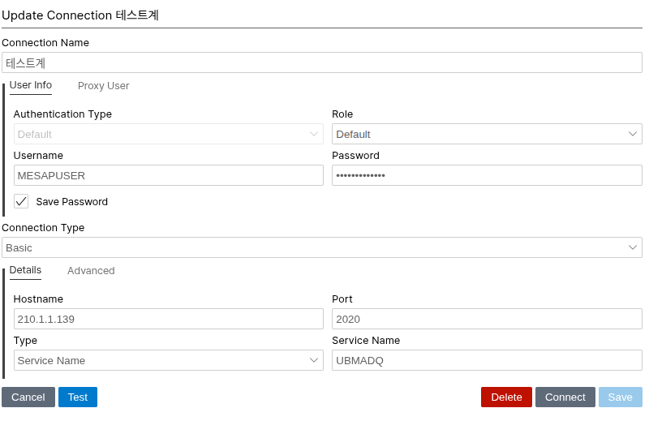

# visix 설치
   - https://krisrice.io/download_sqldev_vsix.html 에서 OS에 맞게 다운로드
   - Antigravity의 Extensions에서 ... 메뉴의 'install from VISIX...'
# 오라클 연결 설정
 
 - Connection Name : 테스트계
 - Username : MESAPUSER
 - Password : MESAPUSER_TST
 - Save Password : check
 - Hostname : 210.1.1.139
 - Port : 2020
 - Type : Service Name
 - Service Name : UBMADQ
# sqlcl 설치 (오라클 페이지)
# mcp 설정
```json
  {                                                                                                     
    "mcpServers": {                                                                                     
      "sqlcl": {                                                                                        
        "type": "stdio",                                                                                
        "command": "/home/jji/project/sqlcl/bin/sql",                                                                               
        "args": ["-mcp"]                                                                                
      }                                                                                                 
    }                                                                                                   
  }     

```
# CLAUDE.md 복사
# 스킬 커맨드 복사
# docs/common 복사